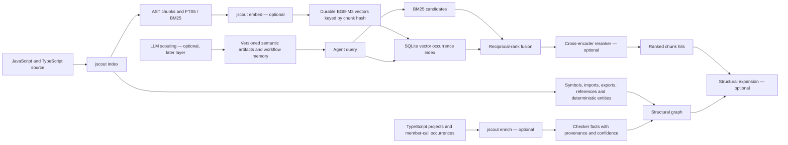
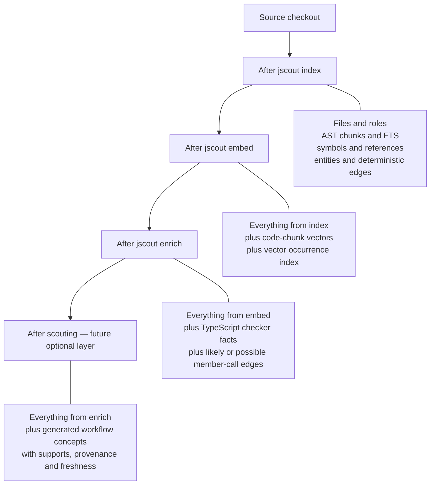
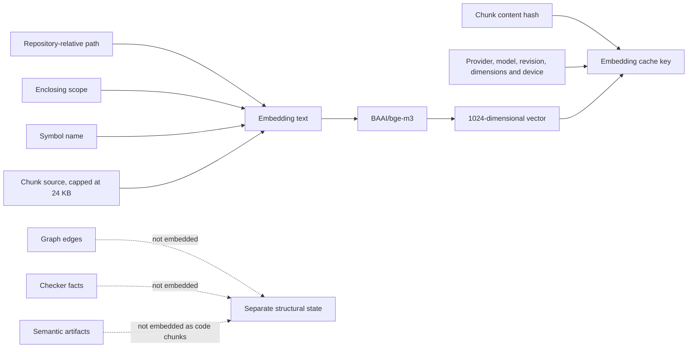
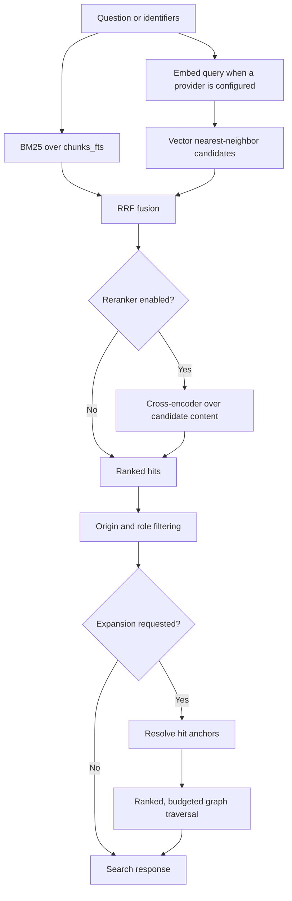
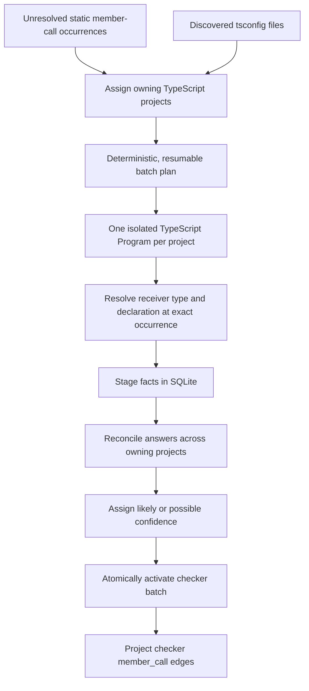
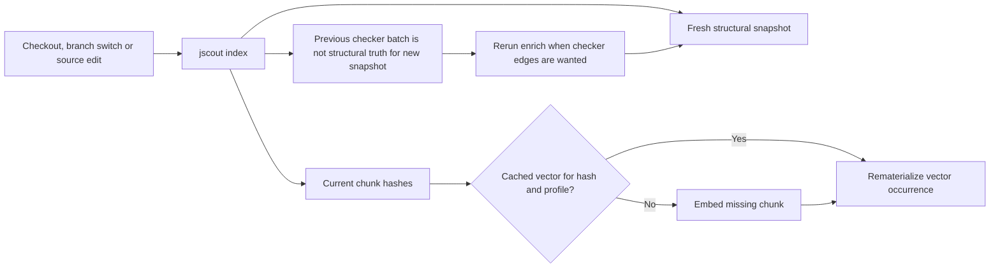
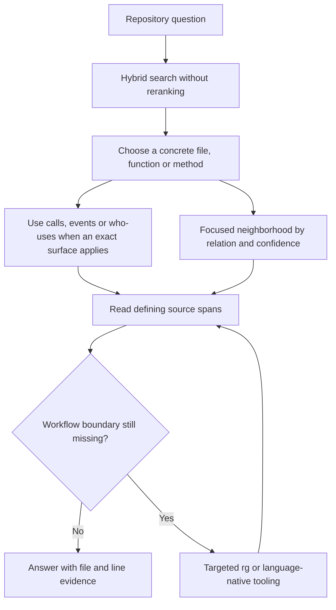
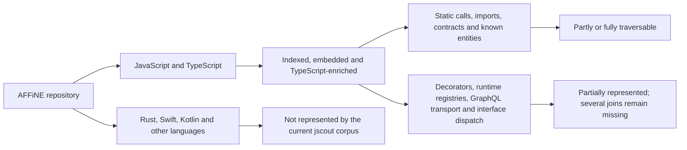

# jscout architecture diagrams

Date: 2026-08-14
Corpus: AFFiNE at `0f349af8ee` (`canary`)
Tested jscout commit: `1d0d9b0` (merged via PR #25)

Related documents:

- [AFFiNE experiment analysis](affine-experiment-analysis-2026-08-14.md)
- [Proposed fixes and next steps](affine-proposed-fixes-2026-08-14.md)
- [Comprehensive experiment output](affine-experiment-full-output-2026-08-14.md)

## 1. How the pieces fit together



The three expensive/intelligent layers are independent:

- `embed` changes semantic retrieval, not the graph;
- `enrich` changes graph expansion, not vectors;
- scouting creates a separate semantic-memory overlay rather than changing code chunks or claiming deterministic truth.

## 2. What exists after each phase



## 3. Exactly what is embedded



Conceptually, the model receives:

```text
// file: packages/example/src/file.ts
// scope: ExampleClass
// symbol: run
<chunk source text>
```

AFFiNE's maximum indexed chunk was 7,977 bytes, so no chunk hit the 24 KB embedding cap.

## 4. Query execution



The AFFiNE run showed that the current reranker should not be treated as an unconditional improvement. Hybrid search without reranking was the most reliable default during this experiment.

## 5. Enrichment execution



AFFiNE exposed an ownership problem in this flow: package projects checked their occurrences, then `tsconfig.eslint.json` claimed and rechecked all 49,142 eligible occurrences. The run succeeded, but the tooling-only aggregate project dominated memory and wall time.

## 6. Reindexing, embeddings and enrichment lifecycle



This reflects the intended rebuild philosophy:

- structural state is cheap and replaceable;
- embeddings are expensive and durable by content hash;
- checker enrichment is a snapshot-scoped overlay that can be recomputed;
- watcher behavior is a separate operational concern.

## 7. Recommended agent workflow



Search localizes. Enrichment supplies occurrence-specific TypeScript dispatch. Source inspection still establishes argument values, branch ordering, mutations and behavior.

## 8. Current coverage boundary



The current overview does not make this boundary prominent enough. A "complete embedding corpus" currently means complete coverage of indexed JavaScript/TypeScript chunks, not complete coverage of the repository.
