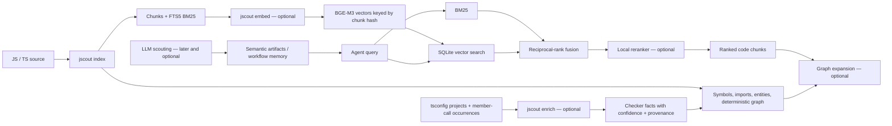

# AFFiNE experiment — comprehensive thread output

Date: 2026-08-14
Root thread: `019ffea6-49ee-71b3-be30-8527e5f90382`
AFFiNE experiment turn: `019ffeaa-2482-7ff0-b4d0-ba587a14b524`
Corpus: `/Users/cristian/git/AFFiNE` at `0f349af8ee` (`canary`)
Tested jscout commit: `1d0d9b0` (then branch `codex/checker-enrichment-scale-plan`, merged via PR #25)

## Scope of this record

This file contains:

- the AFFiNE experiment request;
- every user-visible root-agent progress update from that turn;
- the root-agent final analysis;
- every progress message and final report produced by the three dispatched agents across the structural-only, post-embedding and post-enrichment passes;
- links to durable experiment artifacts and the code surfaces relevant to the findings.

Hidden model reasoning is not conversation output and is not reproduced. Raw terminal/tool streams were not saved as standalone logs; repetitive per-batch embedding and enrichment stderr is represented by the exact user-visible progress updates below. Every command list that a dispatched agent included in its report is preserved verbatim.

Heading levels inside captured messages were shifted to fit this document hierarchy; their text is unchanged.

Absolute paths and local links below are preserved because this is a verbatim
historical record. They describe the test machine and are not expected to
resolve in another checkout.

## Related documents and artifacts

- [Architecture diagrams](affine-architecture-diagrams-2026-08-14.md)
- [AFFiNE experiment analysis](affine-experiment-analysis-2026-08-14.md)
- [Proposed fixes and next steps](affine-proposed-fixes-2026-08-14.md)
- AFFiNE jscout database: `/Users/cristian/git/AFFiNE/.jscout.db`
- Installed AFFiNE jscout skill: `/Users/cristian/git/AFFiNE/.agents/skills/jscout/SKILL.md`
- Release binary used for the run: `/Users/cristian/git/js-rag/target/release/jscout`
- [Local inference service](../inference/service.py)
- [File-role classifier](../src/file_role.rs)
- [Search implementation](../src/search.rs)
- [Embedding implementation](../src/embed.rs)
- [Checker enrichment implementation](../src/checker/enrich.rs)

No standalone raw AFFiNE shell log was created. The database is the durable runtime output; this document is the durable conversation/report record.

## Dispatched agents

| Task | Agent path | Agent thread | Passes |
|---|---|---|---|
| Document synchronization | `/root/affine_structural_sync` | `019ffeae-5c3c-7711-b83d-35516b64d1bd` | Structural-only, post-embedding, post-enrichment |
| Blob upload and URL prefix | `/root/affine_structural_blob` | `019ffeae-741c-7391-b998-856b5a112f40` | Structural-only, post-embedding, post-enrichment |
| Copilot document permission | `/root/affine_structural_permissions` | `019ffeae-8920-7da3-bb9e-3df687223dd4` | Structural-only, post-embedding, post-enrichment |

## Root AFFiNE experiment turn

### User request

can you experiment on this new codebase I pulled, affine

run the index, install the jscout skill, do some searches, various queries, then ask an agent to do some tasks, answer some questions

 what is optional when we index? do we have too much info? not enough info?

then add the embeddings and do the same

then finally the enrichment phase ...btw how does enrich reconcile with embeddings? what gets embedded?

I think I need some diagrams/workflows to understand what goes where and what info we have at different steps

is the output from jscout bloated with structure and metadata? should we have a more compact output fromat

### Progress update 1

I’m using the visualization skill because the useful outcome here is not just command logs: we need a clear map of what exists after indexing, embedding, and enrichment, and which query surfaces consume each plane. I’ll also run the phases against Affine and have fresh agents attempt repository questions at each useful boundary.

### Progress update 2

Affine is a clean 3 GB checkout on its canary branch, with no existing jscout database. I’m using the current jscout development branch because it contains the newer scalable enrichment work; I’ll keep the experiment’s structural, embedding, and checker phases separate so their effects don’t blur together.

### Progress update 3

The structural phase completed cleanly: 6,960 files, 34,177 chunks, 131,358 references, zero failures, and 5.35 seconds end to end. That already answers one concern: on Affine, full manual reindexing is cheap enough that the fixed-snapshot philosophy is credible.

### Progress update 4

The first structural searches already expose two distinct issues. Plain BM25 returns about 7 KB for eight hits and localizes exact recent code well; adding depth-two expansion immediately fills the 24 KB response cap with repeated anchors and drops 25–28 nodes. Also, `events doc.updates.pushed` finds the emitter but misses the real `@OnEvent` listener, so some framework wiring is still absent from deterministic extraction.

### Progress update 5

The three structural-only agent tasks all reached defensible answers, but none were solved by one jscout call. Exact names and protocol strings were strong; conceptual multi-hop tracing still required iterative queries plus source verification. All three independently complained about the same payload waste: repeated anchors/origins, byte-offset metadata, verbose edge evidence, and contract/decorator neighbors. One task also crossed into Affine’s Rust permission evaluator, which jscout cannot see at all.

### Progress update 6

Embedding is the expensive phase in practice: Affine has 34,172 distinct chunk hashes. About 15% belong to tests, generated files, fixtures, or documentation, and 5,656 chunks are import-only. The current local path sends fixed batches of 16, so it will take materially longer than the 5-second structural build. That suggests role/kind selection belongs on `embed`, even if structural indexing should continue covering everything.

### Progress update 7

Embedding is still the long pole: 6,576 of 34,172 distinct chunks were complete at the last checkpoint. Structural indexing and the first agent pass are done; the clearest result so far is that jscout helps agents traverse known TypeScript boundaries, but its current coverage and result encoding both hide important information. I’m letting the full embedding corpus finish so the comparison isn’t based on a partial index.

### Progress update 8

At 10,560/34,172, the embedding run is healthy and resumable; the noisy one-line-per-16-chunks progress is itself an output problem. While it runs, I’m locking down the exact enrichment and search controls so the phase comparison uses the product as shipped, not inferred flags.

### Progress update 9

The enrichment dry run adds a second scale finding: AFFiNE has 71,129 static member-call occurrences, of which 49,142 are eligible across 103 TypeScript projects. That is a legitimate full-repository enrichment workload, not a toy case. The doctor found repository TypeScript 6.0.3 and no configuration errors, so this corpus is suitable for the last phase.

### Progress update 10

The cache behavior is now confirmed from the live database: embeddings are committed incrementally by content hash, while vector occurrence rows remain zero until the run completes and performs the final synchronization. So an interrupted run keeps its expensive completed model work, but hybrid search does not expose a half-built vector corpus.

### Progress update 11

The embed phase is at 16,032/34,172. One design consequence is already visible: AFFiNE has only five duplicate chunk hashes, so this first pass really does require about 34k model calls’ worth of texts; the hash cache pays off on later reindexes and branch switches, not much on a cold corpus.

### Progress update 12

The cold embedding pass is just over halfway. It is substantially more expensive than structural indexing—minutes versus 5.35 seconds—which supports the architecture we discussed: rebuild structural state freely, preserve vectors by content hash, and treat enrichment as a separate overlay rather than coupling any of them into one fragile “index” operation.

### Progress update 13

Embedding is at 21,680/34,172. The corpus also exposes an immediate product-control gap: structural indexing can include or omit named dependencies, but embedding currently has only an origin filter. It cannot say “embed production code, skip tests/generated/import-only chunks,” even though those account for a meaningful portion of this corpus.

### Progress update 14

At 24,400/34,172, the important distinction is settled: embeddings are attached to code chunks, not to graph edges or checker facts. Enrichment will therefore change structural expansion and caller resolution, but it will not re-embed anything or directly change semantic ranking. I’ll verify that behavior after both phases rather than just relying on the implementation.

### Progress update 15

The missing-information case is concrete, not theoretical: jscout finds the TypeScript emitter at `writer.ts:300` but misses its Nest decorator listener at `gateway.ts:532`; it also cannot see the new Rust `custom_presign_get` path at all. More vectors will improve localization within indexed chunks, but neither of those gaps is fixed by embeddings.

### Progress update 16

The embedding run is at 29,856/34,172. Default lexical responses were roughly 7 KB for eight hits; expanded responses immediately hit the 24 KB cap and could spend the first 8 KB without returning a single graph node. That points to a compact transport format as the next retrieval improvement—retain the graph internally, stop serializing repeated anchors and default metadata.

### Progress update 17

The cold vector pass is at 32,816/34,172. Once it finishes I’ll run the same searches in lexical, hybrid-without-reranker, and full hybrid modes, then give fresh agents the same repository questions. That will separate “vectors localized a better file” from “the cross-encoder reordered already-good candidates.”

### Progress update 18

The full embedding corpus is complete: 34,172 vectors. I’m now comparing retrieval modes and checking the durable cache/index sizes; after that I’ll run the fresh-agent pass before touching enrichment.

### Progress update 19

The first completed comparison already found a failure mode: hybrid retrieval without reranking placed the actual sync gateway, event listener, storage adapter, and merge function in the top eight; the local BGE reranker then promoted tests and unrelated Copilot code above them, taking 8.5 seconds. I’m checking whether that degradation repeats across the other queries.

### Progress update 20

A concrete indexing defect surfaced in the hybrid results: real production files under directories named `doc`—for example `packages/backend/server/src/core/doc/writer.ts` and `blocksuite/framework/sync/src/doc/peer.ts`—are tagged `documentation`. That makes the existing `--file-role production` filter unsafe and means any future “skip documentation embeddings” option must wait until this classifier is fixed.

### Progress update 21

A compact prototype built from a real hybrid response reduced it from 7,039 to 2,606 characters (63%) while retaining file/lines, symbol, kind, snippet, and non-empty uses/used-by data. So this is not a speculative compression target: most current bytes are repeated anchors, IDs, default role/origin values, false flags, and zero-valued budget counters.

### Progress update 22

The post-embedding agent pass is complete. Vectors materially improved conceptual localization—permission builders/aliases, transcript retry, multipart upload, live Y.Doc application—but did not eliminate source tracing. Reranking was inconsistent and often worse; the practical AFFiNE default right now is hybrid `--no-rerank`. I’m starting the full 49,142-occurrence TypeScript enrichment now.

### Progress update 23

Enrichment is healthy at project 22/103. The sidecar is processing bounded batches of 128 and has peaked around 652 MiB RSS so far; this is exactly the scalable, resumable execution shape the recent G10 work was intended to provide.

### Progress update 24

Enrichment has passed 54/103 projects with no failures; peak RSS is ~657 MiB. The workload is dominated by a few broad projects, but memory drops back between projects, so it is not accumulating a monolithic TypeScript program.

### Progress update 25

The first large backend project is now running: 2,048/7,657 occurrences in `packages/backend/server`, with peak RSS around 1.1 GiB. Still bounded to one project and below the monorepo-wide failure shape, but this is the relevant resource ceiling—not the earlier 400–650 MiB projects.

### Progress update 26

The largest backend project completed successfully: 7,657 occurrences, peak ~1.27 GiB RSS, followed by a drop back under 400 MiB for the next project. Enrichment is at 81/103; this confirms process isolation is doing real work on AFFiNE.

### Progress update 27

`packages/frontend/core` is the actual worst case: 8,320/11,863 occurrences, peak ~1.46 GiB RSS. It remains stable rather than climbing per batch. The progress stream is far too verbose, though—hundreds of nearly identical lines for one project should be a periodic summary/progress bar.

### Progress update 28

The final project reveals the main enrichment inefficiency: root `tsconfig.eslint.json` claims all 49,142 eligible occurrences after their package projects already processed them. It builds a 6,980-file program at ~2.5 GiB RSS and rechecks the entire corpus. This is valid overlapping ownership under the current confidence model, but it is also the dominant cost and needs a project-selection rule for lint-only catch-all configs.

### Progress update 29

The lint catch-all is 8,960/49,142 with RSS stabilizing around 3.45 GiB. It is not failing, but it roughly doubles occurrence work and dominates wall time. I’m letting it finish because the user-facing question is whether a real full enrichment succeeds; the product fix afterward is to distinguish build/runtime projects from tooling-only aggregate configs.

### Progress update 30

The catch-all is at 17,024/49,142 and is moving faster now; RSS is stable around 3.6 GiB. The run should finish, but this single lint config costs more memory than all package projects and reprocesses the whole selected corpus—an obvious candidate for deterministic exclusion or lower ownership priority.

### Progress update 31

The catch-all is at 27,904/49,142. Its RSS has crept to ~3.8 GiB, far above the 1.46 GiB package-project maximum. That is enough evidence to classify aggregate tooling configs as a real operational problem, even though the run remains healthy.

### Progress update 32

The aggregate lint project is at 37,760/49,142. Peak RSS reached ~3.9 GiB but has not failed. The staged/resumable architecture makes this survivable; it does not make the project choice sensible. I’ll separate those two conclusions in the final recommendations.

### Progress update 33

The catch-all has 1,238 occurrences left; peak RSS is about 4.1 GiB. Once it publishes, I’ll inspect fact/confidence counts and rerun the structural paths that were empty before enrichment.

### Progress update 34

Full enrichment succeeded. It queried 97,793 occurrences for 49,142 unique selections—almost exactly 2× because of overlapping projects—and published 29,931 facts. Peak RSS was 4.32 GB. The warning signal is 18,086 unknown answers and 76,960 unmapped declarations; I’m checking how much useful graph surface actually survived those conservative confidence rules.

### Progress update 35

Enrichment added 20,539 graph edges and fixed the fluent authorization chain end-to-end: `buildDocContentGetter → user → workspace → doc → can → PermissionService.canDoc → docPermissions`, all checker-provenanced and `likely`. It also connects the sync gateway to permission checks and `DocStorageAdapter.pushDocUpdates`. The raw focused outputs are still 16.5–22.8 KB for only 10–15 edges.

### Progress update 36

The reconciliation behavior is directly verified: rerunning `embed` after enrichment reported `embedded 0/0 chunks`, and the same transcript hybrid query returned identical chunk IDs, order, and RRF scores. Enrichment adds graph edges only; it neither invalidates nor mutates the code-vector cache.

### Progress update 37

The post-enrichment graph is useful but layered: starting from the class node still gives no outgoing edges because calls belong to method symbols; starting from the localized function/method gives the resolved chain. This reinforces the intended workflow: search first, then expand from a concrete hit—not blind neighborhood traversal from a class name.

### Progress update 38

The enriched blob agent confirms the same pattern: TypeScript resolver → storage wrapper → runtime provider and client upload branches now resolve as `likely` checker edges. GraphQL transport/dataflow and the Rust custom GET implementation remain disconnected. Focused leaf neighborhoods are 4–11 KB; top-level methods are 18 KB and depth two immediately exceeds 30 KB.

### Progress update 39

All three post-enrichment agent passes are complete. Enrichment materially improves TypeScript member dispatch, but it does not synthesize workflows: interface-to-implementation joins, socket/decorator string identities, GraphQL transport/dataflow, and Rust remain gaps. I’m stopping the local model service now; the 685 MB AFFiNE index and its embeddings remain on disk.

### Root final analysis

The AFFiNE experiment supports keeping the three phases separate:

- Structural indexing is fast and useful.
- Embeddings improve conceptual localization.
- Enrichment materially improves TypeScript traversal.
- The current reranker, file-role classifier, enrichment project selection, and JSON format need changes before this feels clean.

I used the current `codex/checker-enrichment-scale-plan` build.

#### What happened on AFFiNE

| Phase | Result | Database |
|---|---:|---:|
| Structural index | 6,960 files, 34,177 chunks, 280,707 graph edges, 0 failures, 5.35 seconds | 321 MB |
| BGE-M3 embeddings | 34,172 distinct chunk hashes | 607 MB |
| TypeScript enrichment | 29,931 facts, 20,539 new graph edges | 685 MB |

Enrichment processed 49,142 eligible calls but queried 97,793 occurrences because the root `tsconfig.eslint.json` claimed the whole corpus after package projects had already processed it. Peak enrichment memory was 4.32 GB.

The installed skill is at [SKILL.md](/Users/cristian/git/AFFiNE/.agents/skills/jscout/SKILL.md). Installation alone does not configure MCP, so the experiment agents used the CLI explicitly.

AFFiNE currently has untracked `.agents/` and `.jscout.db*`. The database is preserved; be careful with `git add -A`.

#### How the pieces fit



Enrichment and embeddings do not reconcile by modifying one another.

What gets embedded is approximately:

```text
// file: path
// scope: enclosing scope
// symbol: symbol name
<chunk source text>
```

It is capped at 24 KB. AFFiNE’s largest chunk was only 7,977 bytes, so nothing was truncated.

Not embedded:

- graph edges;
- entities;
- checker facts;
- confidence/provenance;
- generated workflows;
- semantic memory.

After enrichment, I reran `jscout embed`; it reported `embedded 0/0 chunks`. Vector results retained identical chunk IDs, order, and scores. Enrichment only changes what graph expansion can reach.

#### Did each phase help?

Structural-only agents could reconstruct the sync, permission, and blob flows, but needed repeated searches and source inspection.

Embeddings helped most with conceptual localization:

- `transcript retry` moved the actual `CopilotTranscriptionService.retryTask` to number one.
- Permission queries located the fluent builders, `PermissionAccess` alias, and native TypeScript boundary.
- Blob queries found multipart client and resolver operations more reliably.
- Sync improvements were smaller; `DocSyncPeer` still required exact searching.

The local reranker was inconsistent. On sync and blob queries it promoted tests and unrelated chunks above defining production code. It added roughly 5–10 seconds in agent observations. Hybrid without reranking was generally more useful.

For now, use:

```sh
jscout search ... --no-rerank
```

Enrichment produced the biggest structural improvement. It now represents flows such as:

```text
buildDocContentGetter
  → PermissionAccess.user
  → UserAccessControllerBuilder.workspace
  → WorkspaceAccessControllerBuilder.doc
  → DocAccessControllerBuilder.can
  → PermissionService.canDoc
  → PermissionService.docPermissions
```

Likewise, the sync gateway now reaches permission checks, `SyncSocketAdapter.push`, and abstract `DocStorageAdapter.pushDocUpdates`. Blob traversal now connects resolver calls to `WorkspaceBlobStorage.presignPut`, configuration, proxy/provider branches, prefix rewriting, and client upload helpers.

Still missing:

- Rust, Swift and other non-JS/TS code;
- interface call → concrete implementation composition;
- GraphQL request/response dataflow;
- Socket.IO and Nest decorator string identities;
- event producer → decorated listener joins;
- argument values and control-flow ordering;
- dynamic native-module dispatch.

The latest AFFiNE `custom_presign_get` implementation in [config.rs](/Users/cristian/git/AFFiNE/packages/backend/native/src/runtime/object_storage/config.rs:189) remains completely invisible. Embeddings cannot repair language coverage when those files never enter the index.

#### Too much versus not enough

Internally, I would not reduce the structural corpus yet. A 5-second rebuild and 321 MB database are acceptable for this repository. Tests, contracts and generated code can matter for blast-radius investigation.

There are three places where we currently collect too much:

1. All chunk roles and kinds are embedded. There is no embed-time role/kind filter.
2. Enrichment accepts tooling-only aggregate configs such as `tsconfig.eslint.json`.
3. Responses serialize far too much diagnostic structure.

There is also a confirmed role-classification bug: [file_role.rs](/Users/cristian/git/js-rag/src/file_role.rs:73) treats any directory component named `doc` as documentation. This misclassifies real production code such as backend document storage and Blocksuite sync. Default expansion then excludes it because expansion defaults to `production/unknown`.

That needs fixing before using role-based embedding filters.

#### Output format

Yes, the agent-facing JSON is bloated.

Observed:

- Normal eight-hit searches: roughly 7–10 KB.
- Expanded searches: immediately reach 24–30 KB and truncate.
- Ten focused enriched edges: 16.5 KB.
- A real compact projection reduced 7,039 characters to 2,606—63% smaller—without removing useful localization information.

Compact mode should retain:

- `path:start-end`;
- symbol and kind;
- snippet;
- edge source/target/kind;
- confidence/provenance when non-default;
- receiver type when useful;
- truncation totals when truncation happened.

It should omit by default:

- chunk IDs;
- default origin/role;
- `false` flags and empty arrays;
- raw byte spans;
- repeated project lists;
- empty unknown/failed project lists;
- occurrence IDs;
- duplicated anchors;
- zero-valued budget counters;
- full evidence objects.

Graph nodes should receive short local IDs and edges should be tuples instead of repeating full anchors:

```json
{
  "nodes": {
    "n1": "doc-read.ts:25 buildDocContentGetter",
    "n2": "builder.ts:180 DocAccessControllerBuilder.can"
  },
  "edges": [
    ["n1", "member_call", "n2", "likely"]
  ]
}
```

Keep the current response as `--debug-json`; make compact the MCP/agent default.

#### What I would fix next

1. Remove singular `doc` from the documentation path heuristic and reindex.
2. Add compact agent output, including compact checker edges.
3. Default local search to hybrid without reranking. Make reranking explicitly opt-in until its candidate text includes path, symbol, scope and role.
4. Exclude or de-prioritize lint/test aggregate tsconfigs during enrichment.
5. Show indexed-language coverage prominently in `overview` and search diagnostics.
6. Surface checker-backed `uses/used_by` in search hits; currently enrichment is visible only through neighborhood traversal.
7. Fix concurrent read commands occasionally failing while opening/migrating the database.
8. Then address decorator/event identities and interface-to-concrete implementation joins.

The local inference service is stopped. The completed AFFiNE structural index, embeddings, and enrichment remain in `.jscout.db`.

## Dispatched-agent output

### Document synchronization

Agent: `/root/affine_structural_sync`
Thread: `019ffeae-5c3c-7711-b83d-35516b64d1bd`

#### Structural-only pass

##### Agent progress 1

I’m starting with jscout’s overview/help, then I’ll use lexical-only localization and verify the resulting symbols directly in AFFiNE’s source. I’ll keep a command log and won’t modify anything.

##### Agent progress 2

The first exact event search found the useful seam: `CloudDocStorage` on the client and `SpaceSyncGateway.onReceiveDocUpdate` on the backend. I’m now tracing the local persistence/sync coordinator and the server’s persistence/event broadcast path around those symbols.

##### Agent progress 3

The verified flow is local-first: editor mutations are persisted to the platform-local doc store before the sync peer sends Yjs deltas over Socket.IO; inbound broadcasts are persisted locally before being applied back into the live Y.Doc. I’m checking symbol locations and the deferred backend merge job now, including the separate broadcast path for backend-originated writes.

##### Final report

##### Production flow

AFFiNE’s workspace document path is local-first:

1. `CloudWorkspaceFlavourProvider.getEngineWorkerInitOptions` configures IndexedDB on web or SQLite on native as `local`, plus `CloudDocStorage` as a remote peer.
2. `DocFrontend` attaches to each live Y.Doc. A local Yjs `update` is queued, merged, and written to the local doc storage first.
3. `DocSyncPeer` subscribes to local-storage updates. It batches them and calls the remote `CloudDocStorage.pushDocUpdate`.
4. `CloudDocStorage` base64-encodes the Yjs delta and sends `space:push-doc-update` with an acknowledgement.
5. `SpaceSyncGateway.onReceiveDocUpdate` verifies membership and `Doc.Update` permission, then delegates to `WorkspaceSyncAdapter.push`.
6. `PgWorkspaceDocStorageAdapter.pushDocUpdates` validates the update, inserts it into the PostgreSQL `update` table through `DocModel.createUpdates`, and schedules `doc.mergePendingDocUpdates`.
7. After persistence, the gateway broadcasts to every other client:
   - Current clients: `space:broadcast-doc-updates`
   - Legacy clients: `space:broadcast-doc-update`
   The sender is excluded via `client.to(...)`; its local store already contains the edit.
8. Receiving clients’ `CloudDocStorage.onServerUpdates` emits a remote-storage update. `DocSyncPeer.remoteUpdated` saves it into the local IndexedDB/SQLite store with a sync-origin marker, preventing echo. `DocFrontend.onStorageUpdate` then applies it to the live Y.Doc with `NBSTORE_ORIGIN`, preventing it from being saved again.
9. Startup/offline reconciliation uses timestamps plus Yjs state vectors. `DocSyncPeer.connect`, `pull`, and `pullAndPush` call `space:load-doc-timestamps` and `space:load-doc`; the gateway returns the missing update and server state vector, and the client computes/pushes any client-only diff.
10. The deferred `doc.mergePendingDocUpdates` job calls `DocStorageAdapter.getDoc`, which locks the document, merges pending updates with the current snapshot, upserts the newer snapshot, optionally records history, and deletes the merged pending rows.

Backend-originated changes use a separate fanout path: `DocWriter` writes through `PgWorkspaceDocStorageAdapter`, emits `doc.updates.pushed`, and `SpaceSyncGateway.onDocUpdatesPushed` broadcasts it to protocol rooms.

One relevant defect: `PgWorkspaceDocStorageAdapter.pushDocUpdates` returns `0` when validation filters out every update, but `onReceiveDocUpdate` still broadcasts the original unvalidated update and returns `{ accepted: true, timestamp: 0 }`. The adapter return type does not distinguish rejection from a valid timestamp.

##### Minimal defining files and symbols

- Client storage wiring: [`cloud.ts`](</Users/cristian/git/AFFiNE/packages/frontend/core/src/modules/workspace-engine/impls/cloud.ts:456>) — `getEngineWorkerInitOptions`
- UI/worker bridge: [`client.ts`](</Users/cristian/git/AFFiNE/packages/common/nbstore/src/worker/client.ts:234>) — `StoreClient`, `WorkerDocStorage`; [`consumer.ts`](</Users/cristian/git/AFFiNE/packages/common/nbstore/src/worker/consumer.ts:16>) — `StoreConsumer`
- Live Y.Doc ↔ local storage: [`frontend/doc.ts`](</Users/cristian/git/AFFiNE/packages/common/nbstore/src/frontend/doc.ts:115>) — `DocFrontend.jobs`, `handleDocUpdate`, `event.onStorageUpdate`
- Local ↔ remote reconciliation: [`sync/doc/peer.ts`](</Users/cristian/git/AFFiNE/packages/common/nbstore/src/sync/doc/peer.ts:152>) — `DocSyncPeer.jobs`, `events.localUpdated`, `events.remoteUpdated`, `retryLoop`
- Socket remote storage: [`impls/cloud/doc.ts`](</Users/cristian/git/AFFiNE/packages/common/nbstore/src/impls/cloud/doc.ts:31>) — `CloudDocStorage.pushDocUpdate`, `getDocDiff`, `onServerUpdates`, `CloudDocStorageConnection`
- Backend gateway: [`gateway.ts`](</Users/cristian/git/AFFiNE/packages/backend/server/src/core/sync/gateway.ts:206>) — `onReceiveDocUpdate`, `onLoadSpaceDoc`, `onDocUpdatesPushed`, `WorkspaceSyncAdapter`
- Workspace persistence: [`adapters/workspace.ts`](</Users/cristian/git/AFFiNE/packages/backend/server/src/core/doc/adapters/workspace.ts:39>) — `PgWorkspaceDocStorageAdapter.pushDocUpdates`
- Merge/read semantics: [`storage/doc.ts`](</Users/cristian/git/AFFiNE/packages/backend/server/src/core/doc/storage/doc.ts:65>) — `DocStorageAdapter.getDoc`, `getDocDiff`, `squashUpdatesToSnapshot`
- Deferred compaction: [`doc-service/job.ts`](</Users/cristian/git/AFFiNE/packages/backend/server/src/core/doc-service/job.ts:39>) — `mergePendingDocUpdates`
- Database writes: [`models/doc.ts`](</Users/cristian/git/AFFiNE/packages/backend/server/src/models/doc.ts:96>) — `DocModel.createUpdates`, `upsert`

##### jscout assessment

jscout helped most with exact event/protocol terms. `space:push-doc-update` immediately identified both `CloudDocStorage` and `SpaceSyncGateway`, while storage-wiring searches found `StoreConsumer` and `getEngineWorkerInitOptions`. Expansion exposed useful adjacent types such as `SocketConnection` and `DocStorageBase`.

It also misled or omitted important sites:

- `doc update websocket sync storage` ranked the playground `WebSocketDocSource` above the production client implementation.
- Searching `DocSyncImpl` found its import and owning `Sync` class, but not the actual definition in `sync/doc/index.ts`.
- `events doc.updates.pushed` reported only `DocWriter.emitDocUpdatesPushed` and missed the `@OnEvent` listener in the gateway.
- `events space:push-doc-update` and `events space:load-doc` returned no sites because `emitWithAck` and `@SubscribeMessage` were not recognized.
- `doc.updates.pushed emit` failed to surface `DocWriter`, requiring exact source search.
- Result scores were tightly clustered around `0.01–0.016`, so they were not useful relevance indicators.

Bloated output fields were the repeated `snapshot` and `response_budget`, per-hit `anchors`/`file_anchor`/`uses`/`used_by`, and especially expansion’s contract nodes plus nested `detail.evidence`. The overview’s full entity inventory and relation counts added little localization value. The three expanded searches produced enough graph boilerplate to hit the outer output truncation despite response-byte limits.

##### Every jscout command used

```sh
/Users/cristian/git/js-rag/target/release/jscout --help
/Users/cristian/git/js-rag/target/release/jscout overview --help
/Users/cristian/git/js-rag/target/release/jscout overview /Users/cristian/git/AFFiNE --area-limit 30 --response-bytes 30000

/Users/cristian/git/js-rag/target/release/jscout search /Users/cristian/git/AFFiNE 'collaborative document sync gateway storage' --lexical-only --no-memory --file-role production --limit 12 --json --response-bytes 30000
/Users/cristian/git/js-rag/target/release/jscout search /Users/cristian/git/AFFiNE 'local store sync doc updates backend' --lexical-only --no-memory --file-role production --limit 12 --json --response-bytes 30000
/Users/cristian/git/js-rag/target/release/jscout search /Users/cristian/git/AFFiNE 'doc update websocket sync storage' --lexical-only --no-memory --file-role production --limit 12 --json --response-bytes 30000

/Users/cristian/git/js-rag/target/release/jscout search /Users/cristian/git/AFFiNE 'space:push-doc-update' --lexical-only --no-memory --file-role production --limit 16 --json --expand --expand-depth 1 --expand-seeds 3 --expand-nodes 40 --expand-edges 120 --response-bytes 50000
/Users/cristian/git/js-rag/target/release/jscout search /Users/cristian/git/AFFiNE 'doc.updates.pushed' --lexical-only --no-memory --file-role production --limit 16 --json --expand --expand-depth 1 --expand-seeds 3 --expand-nodes 40 --expand-edges 120 --response-bytes 50000
/Users/cristian/git/js-rag/target/release/jscout search /Users/cristian/git/AFFiNE 'DocSyncImpl' --lexical-only --no-memory --file-role production --limit 16 --json --expand --expand-depth 1 --expand-seeds 3 --expand-nodes 40 --expand-edges 120 --response-bytes 50000

/Users/cristian/git/js-rag/target/release/jscout search /Users/cristian/git/AFFiNE 'DocStorageAdapter pushDocUpdate' --lexical-only --no-memory --file-role production --limit 14 --json --response-bytes 35000
/Users/cristian/git/js-rag/target/release/jscout search /Users/cristian/git/AFFiNE 'doc.updates.pushed emit' --lexical-only --no-memory --file-role production --limit 14 --json --response-bytes 35000
/Users/cristian/git/js-rag/target/release/jscout search /Users/cristian/git/AFFiNE 'loadDoc pushDocUpdate storage' --lexical-only --no-memory --file-role production --limit 14 --json --response-bytes 35000
/Users/cristian/git/js-rag/target/release/jscout search /Users/cristian/git/AFFiNE 'doc.mergePendingDocUpdates' --lexical-only --no-memory --file-role production --limit 12 --json --response-bytes 30000

/Users/cristian/git/js-rag/target/release/jscout search /Users/cristian/git/AFFiNE 'new Sync storages remotes CloudDocStorage' --lexical-only --no-memory --file-role production --limit 14 --json --response-bytes 35000
/Users/cristian/git/js-rag/target/release/jscout search /Users/cristian/git/AFFiNE 'CloudDocStorage IndexedDBDocStorage Sync' --lexical-only --no-memory --file-role production --limit 14 --json --response-bytes 35000
/Users/cristian/git/js-rag/target/release/jscout search /Users/cristian/git/AFFiNE 'SpaceStorage remotes local cloud' --lexical-only --no-memory --file-role production --limit 14 --json --response-bytes 35000
/Users/cristian/git/js-rag/target/release/jscout search /Users/cristian/git/AFFiNE 'new DocFrontend' --lexical-only --no-memory --file-role production --limit 12 --json --response-bytes 25000
/Users/cristian/git/js-rag/target/release/jscout search /Users/cristian/git/AFFiNE 'DocReader getDocDiff' --lexical-only --no-memory --file-role production --limit 12 --json --response-bytes 30000

/Users/cristian/git/js-rag/target/release/jscout events --help
/Users/cristian/git/js-rag/target/release/jscout events /Users/cristian/git/AFFiNE doc.updates.pushed
/Users/cristian/git/js-rag/target/release/jscout events /Users/cristian/git/AFFiNE 'space:broadcast-doc-updates'
/Users/cristian/git/js-rag/target/release/jscout events /Users/cristian/git/AFFiNE 'space:push-doc-update'
/Users/cristian/git/js-rag/target/release/jscout events /Users/cristian/git/AFFiNE 'space:load-doc'
```

No vector retrieval, reranking, semantic memory, embedding, enrichment, or file modifications were used.

#### Post-embedding pass

##### Agent progress 1

I’ll rerun the same broad and protocol-specific queries in hybrid mode with the local BGE-M3 provider, first disabling reranking. Then I’ll compare a small set with default reranking and verify any newly suggested paths against the source; enrichment remains untouched.

##### Agent progress 2

Hybrid retrieval improved the gateway-side broad query and found `DocFrontend.handleDocUpdate` semantically, but it still over-selected playground/import chunks and did not expose `DocSyncPeer` or `CloudDocStorage` reliably. Default reranking improved one gateway query, but badly promoted migration/tool/import noise on the client query. I’m testing narrower natural-language descriptions of the sync coordinator, cloud adapter, and persistence queue.

##### Final report

##### Result

The production flow and prior conclusions are unchanged after source verification:

`Y.Doc` → `DocFrontend` → local IndexedDB/SQLite → `DocSyncPeer` → `CloudDocStorage` → `SpaceSyncGateway` → pending PostgreSQL updates → deferred snapshot merge → broadcasts → receiving `CloudDocStorage` → local store → `DocFrontend.applyUpdate`.

Vectors changed ranking more than coverage. Hybrid search without reranking modestly improved a few natural-language queries, but it did not materially reduce the source-tracing work. The key coordinator, `DocSyncPeer`, still required direct source inspection, and even the exact `DocSyncImpl` query did not return its defining file.

Default reranking was inconsistent and substantially slower. It was useful only for narrowly worded queries where the desired class was already in the candidate set.

##### Retrieval comparison

Better results:

- For “receive remote document update save local store apply live Y.Doc”:
  - Lexical: `handleDocUpdate` #1, `applyUpdate` #8.
  - Hybrid/no-rerank: `handleDocUpdate` #1, `applyUpdate` #2.
  - This improved localization of the live Y.Doc boundary.
- For the broad gateway query:
  - Lexical: `onReceiveDocUpdate` #4.
  - Hybrid/no-rerank: #3.
  - Reranked: #1.
- For the cloud-socket query:
  - Reranking produced a clean top three: `CloudDocStorage`, `onReceiveDocUpdate`, `CloudDocStorageConnection`.
- For the persistence query:
  - Reranking surfaced `DocServiceCronJob` #3; it was absent from the no-rerank top ten.

No meaningful improvement:

- The paired cloud query had the same top three under lexical and hybrid/no-rerank: `CloudDocStorageConnection`, `onReceiveDocUpdate`, `CloudDocStorage`.
- `DocSyncImpl` still returned `Sync`, its import, metadata storage, and worker proxy, but not its definition in `packages/common/nbstore/src/sync/doc/index.ts`.
- The natural-language peer/reconciliation query returned `BlobSyncPeer` but not `DocSyncPeer`.
- Neither vector mode found the full client/local/remote chain in one result set.

Worse results:

- Reranking “local Yjs document update sync remote cloud websocket backend” promoted:
  - `workspace/services/transform.ts` import chunk #1
  - `tools/doc-diff/src/io.ts` import chunk #2
  - Actual `DocFrontend.handleDocUpdate` fell to #8 from #2 without reranking.
- Reranking the inbound-update query promoted the obsolete v1 `WorkspaceSQLiteDB` path to #2.
- Broad reranking inserted an old GUID migration at #3 and the unrelated created/updated-by metadata sync service at #5.
- Hybrid exact `space:push-doc-update` promoted `DocFrontend.applyUpdate` to #3 while `CloudDocStorage` fell to #5.
- `--file-role production` did not exclude playgrounds, tools, migrations, or obsolete v1 implementations, so those remained frequent false paths.

Observed latency was roughly 0.7–1 second/query without reranking versus approximately 5–10 seconds/query with local reranking. This was not a controlled benchmark, but the difference was consistent across the batches.

Recommendation for this repository: use hybrid `--no-rerank` for broad natural-language localization, then exact lexical/structural searches and source inspection. Use reranking only for a narrowly scoped query where the candidate pool is already relevant.

##### Verified source

- [`frontend/doc.ts`](</Users/cristian/git/AFFiNE/packages/common/nbstore/src/frontend/doc.ts:296>) — local save/apply jobs and Y.Doc origin suppression
- [`sync/doc/peer.ts`](</Users/cristian/git/AFFiNE/packages/common/nbstore/src/sync/doc/peer.ts:262>) — push, pull, pull-and-push, clock reconciliation, and echo suppression
- [`impls/cloud/doc.ts`](</Users/cristian/git/AFFiNE/packages/common/nbstore/src/impls/cloud/doc.ts:45>) — Socket.IO push/load/broadcast adapter
- [`gateway.ts`](</Users/cristian/git/AFFiNE/packages/backend/server/src/core/sync/gateway.ts:645>) — load, permission checks, persistence delegation, acknowledgement, and fanout
- [`adapters/workspace.ts`](</Users/cristian/git/AFFiNE/packages/backend/server/src/core/doc/adapters/workspace.ts:54>) — validation, pending-update inserts, and merge-job scheduling
- [`storage/doc.ts`](</Users/cristian/git/AFFiNE/packages/backend/server/src/core/doc/storage/doc.ts:129>) — snapshot/update merge and Yjs diff generation
- [`doc-service/job.ts`](</Users/cristian/git/AFFiNE/packages/backend/server/src/core/doc-service/job.ts:38>) — deferred compaction

The previously identified acceptance defect also remains: if backend validation filters every update, `pushDocUpdates` returns `0`, but `onReceiveDocUpdate` still broadcasts the original update and returns `{ accepted: true, timestamp: 0 }`.

##### Payload bloat

- Ten-hit responses were typically 8–10 KB; twelve-hit responses were about 10–11 KB.
- The expanded eight-hit response rendered 29,239 bytes, had 31,751 unbudgeted bytes, and was truncated. Expansion alone consumed 14,477 bytes.
- Most expansion bytes were contract/decorator/package nodes and nested `detail.evidence`, not additional workflow-defining symbols.
- Repeated per-response `snapshot` and `response_budget`, plus per-hit `anchors`, `file_anchor`, `uses`, and `used_by`, remained the main non-snippet overhead.
- The JSON does not report:
  - whether vector retrieval actually contributed to each hit;
  - lexical score versus vector score;
  - whether reranking ran;
  - reranker/provider identity;
  - embedding corpus profile or freshness.
- No-rerank fusion scores around `0.01–0.03` and reranker scores ranging from roughly `-5` to `+4` use different, unlabeled scales. They cannot be compared directly.
- Import-only chunks frequently occupied high ranks despite containing no defining behavior.

##### Every jscout command

```sh
env JSCOUT_EMBED_PROVIDER=local /Users/cristian/git/js-rag/target/release/jscout search /Users/cristian/git/AFFiNE 'collaborative document updates move between client local storage and backend sync gateway persistence' --no-rerank --no-memory --file-role production --limit 12 --json --response-bytes 35000
env JSCOUT_EMBED_PROVIDER=local /Users/cristian/git/js-rag/target/release/jscout search /Users/cristian/git/AFFiNE 'local Yjs document update sync remote cloud websocket backend' --no-rerank --no-memory --file-role production --limit 12 --json --response-bytes 35000
env JSCOUT_EMBED_PROVIDER=local /Users/cristian/git/js-rag/target/release/jscout search /Users/cristian/git/AFFiNE 'receive remote document update save local store apply live Y.Doc' --no-rerank --no-memory --file-role production --limit 12 --json --response-bytes 35000

env JSCOUT_EMBED_PROVIDER=local /Users/cristian/git/js-rag/target/release/jscout search /Users/cristian/git/AFFiNE 'collaborative document updates move between client local storage and backend sync gateway persistence' --no-memory --file-role production --limit 12 --json --response-bytes 35000
env JSCOUT_EMBED_PROVIDER=local /Users/cristian/git/js-rag/target/release/jscout search /Users/cristian/git/AFFiNE 'local Yjs document update sync remote cloud websocket backend' --no-memory --file-role production --limit 12 --json --response-bytes 35000
env JSCOUT_EMBED_PROVIDER=local /Users/cristian/git/js-rag/target/release/jscout search /Users/cristian/git/AFFiNE 'receive remote document update save local store apply live Y.Doc' --no-memory --file-role production --limit 12 --json --response-bytes 35000

env JSCOUT_EMBED_PROVIDER=local /Users/cristian/git/js-rag/target/release/jscout search /Users/cristian/git/AFFiNE 'batch local document updates push to remote peer, receive remote updates save into local storage, reconcile with state vectors and timestamps' --no-rerank --no-memory --file-role production --limit 10 --json --response-bytes 30000
env JSCOUT_EMBED_PROVIDER=local /Users/cristian/git/js-rag/target/release/jscout search /Users/cristian/git/AFFiNE 'cloud document storage socket sends push doc update and receives broadcast doc updates' --no-rerank --no-memory --file-role production --limit 10 --json --response-bytes 30000
env JSCOUT_EMBED_PROVIDER=local /Users/cristian/git/js-rag/target/release/jscout search /Users/cristian/git/AFFiNE 'backend validates Yjs updates inserts pending updates queues merge into snapshot and broadcasts clients' --no-rerank --no-memory --file-role production --limit 10 --json --response-bytes 30000

env JSCOUT_EMBED_PROVIDER=local /Users/cristian/git/js-rag/target/release/jscout search /Users/cristian/git/AFFiNE 'batch local document updates push to remote peer, receive remote updates save into local storage, reconcile with state vectors and timestamps' --no-memory --file-role production --limit 10 --json --response-bytes 30000
env JSCOUT_EMBED_PROVIDER=local /Users/cristian/git/js-rag/target/release/jscout search /Users/cristian/git/AFFiNE 'cloud document storage socket sends push doc update and receives broadcast doc updates' --no-memory --file-role production --limit 10 --json --response-bytes 30000
env JSCOUT_EMBED_PROVIDER=local /Users/cristian/git/js-rag/target/release/jscout search /Users/cristian/git/AFFiNE 'backend validates Yjs updates inserts pending updates queues merge into snapshot and broadcasts clients' --no-memory --file-role production --limit 10 --json --response-bytes 30000

env JSCOUT_EMBED_PROVIDER=local /Users/cristian/git/js-rag/target/release/jscout search /Users/cristian/git/AFFiNE 'space:push-doc-update' --no-rerank --no-memory --file-role production --limit 12 --json --response-bytes 30000
env JSCOUT_EMBED_PROVIDER=local /Users/cristian/git/js-rag/target/release/jscout search /Users/cristian/git/AFFiNE 'DocSyncImpl' --no-rerank --no-memory --file-role production --limit 12 --json --response-bytes 30000
env JSCOUT_EMBED_PROVIDER=local /Users/cristian/git/js-rag/target/release/jscout search /Users/cristian/git/AFFiNE 'doc.mergePendingDocUpdates' --no-rerank --no-memory --file-role production --limit 12 --json --response-bytes 30000

env JSCOUT_EMBED_PROVIDER=local /Users/cristian/git/js-rag/target/release/jscout search /Users/cristian/git/AFFiNE 'cloud document storage socket sends push doc update and receives broadcast doc updates' --no-rerank --no-memory --file-role production --limit 8 --json --expand --expand-depth 1 --expand-seeds 3 --expand-nodes 30 --expand-edges 80 --expand-bytes 18000 --response-bytes 30000

env JSCOUT_EMBED_PROVIDER=local /Users/cristian/git/js-rag/target/release/jscout search /Users/cristian/git/AFFiNE 'collaborative document updates move between client local storage and backend sync gateway persistence' --lexical-only --no-memory --file-role production --limit 10 --json --response-bytes 30000
env JSCOUT_EMBED_PROVIDER=local /Users/cristian/git/js-rag/target/release/jscout search /Users/cristian/git/AFFiNE 'receive remote document update save local store apply live Y.Doc' --lexical-only --no-memory --file-role production --limit 10 --json --response-bytes 30000
env JSCOUT_EMBED_PROVIDER=local /Users/cristian/git/js-rag/target/release/jscout search /Users/cristian/git/AFFiNE 'cloud document storage socket sends push doc update and receives broadcast doc updates' --lexical-only --no-memory --file-role production --limit 10 --json --response-bytes 30000
env JSCOUT_EMBED_PROVIDER=local /Users/cristian/git/js-rag/target/release/jscout search /Users/cristian/git/AFFiNE 'backend validates Yjs updates inserts pending updates queues merge into snapshot and broadcasts clients' --lexical-only --no-memory --file-role production --limit 10 --json --response-bytes 30000
```

No enrichment, embedding, index mutation, or source modification was performed.

#### Post-enrichment pass

##### Agent progress 1

I’ll localize the same core symbols with hybrid retrieval, then traverse member-call neighborhoods around `DocFrontend`, `DocSyncPeer`, `CloudDocStorage`, the gateway handler, and the workspace storage adapter. I’ll compare the enriched edges against the prior structural-only graph and verify any claimed link directly in source.

##### Agent progress 2

The enriched gateway neighborhood now resolves concrete checker-backed member calls that were missing before: `onReceiveDocUpdate → selectAdapter`, permission helpers, `SyncSocketAdapter.push`, room selection, and payload construction. It still stops at the virtual adapter method, so I’m traversing that boundary and the client/storage classes separately.

##### Agent progress 3

The enriched graph’s main new cross-boundary edge currently lands on the abstract storage contract, not its PostgreSQL implementation. I’m checking depth-two traversal and reverse interface edges, then I’ll quantify where the graph stops.

##### Agent progress 4

The depth-two result confirms a second usability issue: `--file-role production` cuts off the real gateway-to-storage edge because `DocStorageAdapter` and several other production files are mislabeled `documentation`. Without that filter, the edge appears, but traversal still cannot dispatch from the abstract method to `PgWorkspaceDocStorageAdapter`.

##### Final report

Post-enrichment result:

- Checker-backed `member_call` edges now represent:
  - `SpaceSyncGateway.onReceiveDocUpdate` → `selectAdapter`, permission checks, `SyncSocketAdapter.push`, `buildBroadcastPayload`, and `room`.
  - `SyncSocketAdapter.push` → abstract `DocStorageAdapter.pushDocUpdates`.
  - `DocServiceCronJob.mergePendingDocUpdates` → `DocStorageAdapter.getDoc` and `DocModel.getUpdateCount`.
  - `SpaceSyncGateway.onDocUpdatesPushed` → `encodeUpdates` and `buildBroadcastPayload`.
  - Limited client internals: `DocFrontend` → `mergeUpdates`/`applyUpdate`/`schedule`; `CloudDocStorageConnection.doConnect` → base `doConnect`/`getIdConverter`.

Source verification confirms the production flow remains:

`DocFrontend` persists Yjs changes locally → `DocSyncPeer` reconciles local/remote state vectors and pushes through `CloudDocStorage` → Socket.IO `space:push-doc-update` → gateway validation/authorization → PostgreSQL pending updates and merge job → gateway broadcast → `CloudDocStorage` emits remote updates back into local storage/frontend.

Minimal defining source:

- [cloud.ts](/Users/cristian/git/AFFiNE/packages/frontend/core/src/modules/workspace-engine/impls/cloud.ts:456) — `getEngineWorkerInitOptions`
- [doc.ts](/Users/cristian/git/AFFiNE/packages/common/nbstore/src/frontend/doc.ts:295) — `DocFrontend.jobs`
- [peer.ts](/Users/cristian/git/AFFiNE/packages/common/nbstore/src/sync/doc/peer.ts:262) — `DocSyncPeer.jobs`
- [doc.ts](/Users/cristian/git/AFFiNE/packages/common/nbstore/src/impls/cloud/doc.ts:31) — `CloudDocStorage`
- [gateway.ts](/Users/cristian/git/AFFiNE/packages/backend/server/src/core/sync/gateway.ts:706) — `onReceiveDocUpdate`
- [workspace.ts](/Users/cristian/git/AFFiNE/packages/backend/server/src/core/doc/adapters/workspace.ts:54) — `pushDocUpdates`
- [doc.ts](/Users/cristian/git/AFFiNE/packages/backend/server/src/core/doc/storage/doc.ts:129) — `getDoc`
- [job.ts](/Users/cristian/git/AFFiNE/packages/backend/server/src/core/doc-service/job.ts:38) — merge job

Remaining graph gaps:

- Dispatch stops at `DocStorageAdapter.pushDocUpdates`; it does not resolve to `PgWorkspaceDocStorageAdapter.pushDocUpdates`. A separate class-level `extend` edge exists, but traversal cannot compose it with the method call.
- No member-call edges from the PostgreSQL adapter to `models.doc.createUpdates`, queue insertion, validation, or snapshot methods.
- `DocStorageAdapter.getDoc` has no outgoing edges despite source calls to snapshot/update/squash methods.
- `DocSyncPeer` has zero focused edges; local/remote storage and sync-metadata calls remain absent.
- `CloudDocStorage.pushDocUpdate` has zero edges; Socket.IO `emitWithAck`/`on` calls remain absent.
- Decorator syntax is represented as `decorated_by` (`SubscribeMessage`, `OnEvent`, `OnJob`), but string arguments are not retained, so the graph cannot connect socket/event/job producers to consumers.
- Essential production files including `peer.ts`, backend storage/adapters, and `DocWriter` are mislabeled `documentation`. `--file-role production` therefore removes the gateway-to-storage edge entirely.

Hybrid localization changed little versus pre-enrichment: broad searches still found the gateway and cloud class but missed `DocSyncPeer` and PostgreSQL storage until queried by exact names without the production-role filter. The checker graph, not vector ranking, provided the material improvement.

Payload observations:

- Gateway depth 1: 7 edges, about 11.2 KB.
- Gateway depth 2 with production filter: about 18.8 KB and omits storage.
- Same traversal without role filtering: 13 edges, 20.3 KB, adding only the abstract storage edge.
- Two-edge focused neighborhoods: about 4.1 KB.
- Empty neighborhoods: roughly 1.0–1.2 KB.
- Decorator-only gateway neighborhood: 4 edges, 6.6 KB.

Most bloat comes from repeated node paths and per-edge byte spans, duplicate tsconfig project lists, empty `unknownProjects`/`failedProjects`, receiver types, and occurrence metadata. No files were modified.

### Blob upload and URL prefix

Agent: `/root/affine_structural_blob`
Thread: `019ffeae-741c-7391-b998-856b5a112f40`

#### Structural-only pass

##### Agent progress 1

I’ll trace the prefix end-to-end using lexical-only jscout searches, then verify each hop directly in the AFFiNE sources. I’ll keep the workspace read-only.

##### Agent progress 2

The main split is now clear: without `signKey`, the prefix replaces only the provider URL’s origin; with `signKey`, it becomes the base for AFFiNE’s signed upload-proxy routes. I’m checking the response selections and client reads so unused fields are called out accurately.

##### Final report

Trace result

The configured field is `storages.blob.storage.config.usePresignedURL.urlPrefix`. It is only active for `aws-s3`/`cloudflare-r2` when `usePresignedURL.enabled` is true.

Minimal defining files/symbols:

- `packages/backend/server/src/base/storage/providers/index.ts:10-34,63-140`
  - `S3StorageConfig.usePresignedURL`
  - `S3ConfigSchema.properties.usePresignedURL`
  - Defines `enabled`, `urlPrefix`, `signKey`; R2 inherits this schema.
- `packages/backend/server/src/core/storage/config.ts:7-15,39-49`
  - Registers `storages.blob.storage` against `StorageJSONSchema`.
- `packages/backend/server/src/core/storage/wrappers/blob.ts`
  - `WorkspaceBlobStorage.uploadURLConfig` at 352-365 reads the configured values.
  - `capabilities` at 89-111 disables direct upload when absent/disabled and forces proxy capabilities when `signKey` exists.
  - `presignPut` at 130-151 and `presignUploadPart` at 165-201 apply the prefix.
  - `withURLPrefix` at 447-459 is the no-`signKey` path.
  - `createProxyUploadUrl`, `createProxyMultipartUrl`, `linkProxyUrl` at 367-445 are the `signKey` path.
- `packages/backend/server/src/core/storage-runtime/provider.ts:133-169,387-394`
  - `presignPut`, `presignUploadPart`, `fromRuntimePresigned` provide the original provider URL/headers/expiry before the TS wrapper changes it.
- `packages/backend/server/src/core/workspaces/resolvers/blob.ts`
  - `BlobUploadInit`/`BlobUploadPart` at 57-97 define the GraphQL response.
  - `createBlobUpload` at 199-330 maps `presigned.url` to `uploadUrl`.
  - `blobUploadPartUrl`/`getUploadPart` at 158-169,429-455 do the same per multipart part.
- `packages/common/graphql/src/graphql/index.ts:644-677`
  - `createBlobUploadMutation`
  - `getBlobUploadPartUrlQuery`
- `packages/common/nbstore/src/impls/cloud/blob.ts`
  - `CloudBlobStorage.set` at 131-224 selects the upload method.
  - `uploadViaPresigned` at 266-282 performs `PUT uploadUrl`.
  - `uploadViaMultipart` at 284-343 requests each prefixed part URL, PUTs it, and consumes the ETag.
- Conditional proxy-only endpoint:
  - `packages/backend/server/src/core/storage/r2-proxy.ts`
  - `R2UploadController.getUploadProxyConfig`, `upload`, `uploadPart` at 39-50,115-280 verify the token/expiry and write data to storage. Despite the class name, it accepts both R2 and S3 configs.

Flow

1. `urlPrefix` without `signKey`:
   - Runtime creates the normal provider-presigned PUT/part URL.
   - `withURLPrefix` requires the configured URL to contain only an origin: pathname `/`, no query/hash.
   - It replaces only `protocol` and `host`; provider path and signed query are preserved.
   - Resolver exposes the modified URL as `uploadUrl`.
   - Client treats it as opaque and performs a PUT with returned headers.

2. `urlPrefix` with `signKey`:
   - No provider PUT URL is used.
   - Server creates `<urlPrefix>/api/storage/upload?...token...` or `<urlPrefix>/api/storage/multipart?...token...`; if prefix is absent, `URLHelper.baseUrl` is used.
   - Client PUTs to that URL.
   - Traffic must route to `R2UploadController`, which re-reads the same `signKey`, verifies token/expiry and metadata, then calls `putObject`/`proxyUploadPart`.

3. Multipart initialization contains no upload URL. The prefix is applied separately when each `blobUploadPartUrl` is requested.

4. Disabled/missing config falls back to GraphQL upload. Invalid direct prefixes throw during initialization; `createBlobUpload` catches that and returns `GRAPHQL`.

Application response bloat

- `blobKey` is returned and selected by `createBlobUploadMutation`, but `CloudBlobStorage` already has the request key and never reads the response field.
- `expiresAt` is selected in both upload operations but never read by the client. Expiry remains enforced because it is already embedded in provider-signed URLs or in the proxy URL’s signed query.
- The init query selects every method-specific nullable field for every response. Most are null depending on `GRAPHQL`/`PRESIGNED`/`MULTIPART`; the clearly removable fields for the current client are `blobKey` and both `expiresAt` selections.

jscout assessment

Helpful:

- The first broad lexical query ranked `WorkspaceBlobStorage.withURLPrefix` first.
- Exact `who-uses` calls quickly linked `presignPut`/`presignUploadPart` to `WorkspaceBlobResolver`.
- Searches for the GraphQL operation names located the only production client, `CloudBlobStorage`.

Misleading/noisy:

- Searches for guessed identifiers `blobUrlPrefix` and `storageUrlPrefix` returned nothing; the real name is generic `urlPrefix`.
- Broad expansion pulled in `BlobSyncPeer`, `BlobFrontend`, resource utilities, tests, decorator contracts, and external packages. It did not assemble the end-to-end path by itself.
- Searching Rust-style identifiers missed `packages/backend/native/.../config.rs` because jscout indexes JS/TS, then returned unrelated TS storage/throttler symbols.
- `who-uses` marks same-name method calls as `possible`, including wrapper/runtime methods that are not necessarily the selected declaration.

Bloated jscout JSON fields for this task included repeated `file_role`, `file_origin`, anchors, `snippet_truncated: false`, shallow `uses` arrays, documentary decorator/package nodes, byte-offset declarations, edge occurrence IDs/evidence/null details, and full `response_budget` counters when nothing was truncated. The useful payload was primarily file, symbol, line range, snippet, and resolved call/use edges.

Key commands

```sh
jscout stats /Users/cristian/git/AFFiNE

jscout search --lexical-only --expand --json /Users/cristian/git/AFFiNE \
  'storage URL prefix blob upload response'
jscout search --lexical-only --expand --json /Users/cristian/git/AFFiNE \
  'usePresignedURL urlPrefix signKey storage config'
jscout search --lexical-only --expand --json /Users/cristian/git/AFFiNE \
  'presignPut workspace blob upload URL method headers expiresAt'
jscout search --lexical-only --expand --json /Users/cristian/git/AFFiNE \
  'createBlobUploadMutation uploadUrl headers expiresAt uploadedParts'

jscout who-uses --json /Users/cristian/git/AFFiNE \
  'wrappers/blob:presignPut'
jscout who-uses --json /Users/cristian/git/AFFiNE \
  'wrappers/blob:presignUploadPart'
jscout who-uses --json /Users/cristian/git/AFFiNE \
  'wrappers/blob:withURLPrefix'
jscout who-uses --json /Users/cristian/git/AFFiNE \
  'createBlobUploadMutation'
jscout who-uses --json /Users/cristian/git/AFFiNE \
  'getBlobUploadPartUrlQuery'

rg -n '\burlPrefix\b|usePresignedURL' packages
rg -n 'blobKey|expiresAt' packages/common/nbstore/src/impls/cloud/blob.ts \
  packages/common/graphql/src/graphql/index.ts
sed -n ... <exact files above>
```

No AFFiNE source files were modified.

#### Post-embedding pass

##### Agent progress 1

I’ll rerun the trace with the local BGE-M3 corpus: hybrid retrieval without reranking first, then a small number of default reranked searches. I’ll specifically probe the Rust `custom_presign_get` path and verify any semantic hit directly in source. No enrichment or repository edits.

##### Agent progress 2

Hybrid retrieval improves the TypeScript path when the query names response fields, but neither hybrid nor reranked search returns the Rust implementation—even for `custom_presign_get` and a description matching its HMAC algorithm. I’m verifying that Rust code and its tests directly now.

##### Final report

##### Result

The source-level trace is unchanged from the lexical pass. Hybrid BGE-M3 retrieval improved targeted TypeScript discovery, especially the client/multipart path, but it still cannot retrieve the Rust `custom_presign_get` implementation. The embedding corpus appears limited to jscout’s JS/TS chunks.

##### Verified flow

1. `packages/backend/server/src/base/storage/providers/index.ts`
   - `S3StorageConfig.usePresignedURL` defines `enabled`, `urlPrefix`, and `signKey`.
   - `S3ConfigSchema` exposes them for both AWS S3 and R2.

2. `packages/backend/server/src/core/storage/config.ts`
   - Registers `storages.blob.storage` with `StorageJSONSchema`.

3. `packages/backend/server/src/core/storage/wrappers/blob.ts`
   - `WorkspaceBlobStorage.uploadURLConfig` reads the values.
   - Disabled/missing config disables direct browser upload.
   - Without `signKey`, `presignPut`/`presignUploadPart` obtain provider URLs and `withURLPrefix` replaces only protocol/host. The prefix must be origin-only.
   - With `signKey`, `createProxyUploadUrl`/`createProxyMultipartUrl` build `<prefix>/api/storage/{upload,multipart}` URLs containing signed metadata. Missing prefix defaults to `URLHelper.baseUrl`.

4. `packages/backend/server/src/core/workspaces/resolvers/blob.ts`
   - `createBlobUpload` returns the single-upload URL as `BlobUploadInit.uploadUrl`.
   - Multipart initialization returns only upload ID/part size; `getUploadPart` returns each prefixed part URL.

5. `packages/common/graphql/src/graphql/index.ts`
   - `createBlobUploadMutation` and `getBlobUploadPartUrlQuery` select those URL/header fields.

6. `packages/common/nbstore/src/impls/cloud/blob.ts`
   - `CloudBlobStorage.set` consumes the init response.
   - `uploadViaPresigned` performs an opaque `PUT` to `uploadUrl`.
   - `uploadViaMultipart` requests and PUTs each part URL, forwards response headers, and reads ETags.

7. Proxy mode terminates in `packages/backend/server/src/core/storage/r2-proxy.ts`
   - `R2UploadController.upload`/`uploadPart` re-read `signKey`, verify expiry/token/metadata, and write to storage.

##### Rust custom GET implementation

Direct source verification found the latest implementation at:

- `packages/backend/native/src/runtime/object_storage/config.rs:141-236`
  - `from_r2_config` enables custom GET only when `enabled`, nonempty `urlPrefix`, and nonempty `signKey` are all present.
  - `custom_presign_get` obtains the current Unix timestamp.
  - `custom_presign_get_at`:
    - requires HTTP(S), no query/fragment;
    - appends the object key to the prefix path;
    - HMAC-SHA256 signs `url.path() + timestamp`;
    - emits standard-base64 `sign=<timestamp>-<signature>`;
    - returns expiry based on configured presign duration, defaulting to 60 seconds.
- `packages/backend/native/src/runtime/object_storage/service.rs:179-197`
  - `presign_get` prefers `custom_presign_get`, then falls back to provider presigning.
- `packages/backend/native/src/runtime/object_storage/tests.rs:252-318`
  - Verifies a path-bearing CDN prefix and deterministic signature.

This is a GET/download path, not the browser PUT upload path. The upload prefix manipulation remains in TypeScript. It is also R2-specific in native code: `from_s3_config` leaves custom GET prefix/signing fields unset.

##### Semantic-search assessment versus lexical-only

Improved:

- The targeted client query ranked:
  1. `CloudBlobStorage.uploadViaMultipart`
  2. `WorkspaceBlobResolver.getUploadPart`
  3. `BlobUploadInit`
  4. `createBlobUpload`
- The targeted configuration query ranked:
  1. `uploadURLConfig`
  2. `S3ConfigSchema`
  4. `withURLPrefix`
  5. `presignPut`
- On the exact earlier query, hybrid moved `CloudBlobStorage.set` from eighth to sixth and added `createProxyUploadUrl`, replacing one unrelated resource utility.

Still noisy:

- The same controlled query promoted unrelated `BlobSyncPeer.uploadBlob` to second and added `fullUpload`.
- A production-only filter removed tests but retained unrelated `BlobSyncPeer` and `BlobFrontend`.
- Structural `who-uses` remained necessary to stitch resolver and client operations reliably.

Reranking was worse for this task:

- The general reranked search ranked tests first, dropped `withURLPrefix` from the top eight, and placed `uploadURLConfig` eighth.
- The Rust-oriented reranked query promoted `S3ConfigSchema` and tests, but still returned no Rust.
- Reranked scores changed to positive/negative cross-encoder values without explaining their scale or comparability to hybrid scores.

Rust limitation:

- Exact hybrid search for `custom_presign_get` returned TS `StorageRuntimeProvider.presignGet`, `S3Compat.presignGetObject`, and unrelated TS symbols.
- A natural-language description matching the Rust algorithm returned TS S3 signing/config code, never `packages/backend/native`.
- Both no-rerank and reranked searches failed. `rg` was required.
- A “complete embedding corpus” therefore means complete coverage of jscout’s indexed JS/TS chunks, not complete repository-language coverage.

##### Payload bloat

The expanded targeted-client response reported:

- `unbudgeted_bytes: 34589`
- `truncated: true`
- 3 omitted nodes
- 21 omitted edges

Much of that expansion was irrelevant: `toStrictArrayBuffer`, timeout constants, GraphQL decorator contracts, package nodes, and repeated evidence metadata.

Redundant fields remain:

- repeated `file_role`, `file_origin`;
- both `anchors` and `file_anchor`;
- repeated `snippet_truncated: false`;
- shallow `uses` lists;
- byte-offset declarations;
- decorator/package contract nodes;
- occurrence IDs, extractor names, evidence offsets, null detail fields;
- full response-budget counters when nothing is truncated.

Missing diagnostics are also material: the response does not expose per-hit lexical/vector contribution or echo that the local embedding provider was used. Hybrid scores around `0.03` are not interpretable without knowing the fusion components.

Application payload bloat remains unchanged:

- `blobKey` is selected but never read by `CloudBlobStorage`.
- `expiresAt` is selected in both upload operations but never read.
- Expiry remains enforced through the signed URL itself, so these current client selections are redundant.

##### Every jscout command run

```sh
env JSCOUT_EMBED_PROVIDER=local jscout search --no-rerank --json --response-bytes 24000 /Users/cristian/git/AFFiNE \
  'Trace how a configured storage URL prefix changes blob upload URLs, passes through the upload response, and is consumed by the client'

env JSCOUT_EMBED_PROVIDER=local jscout search --json --response-bytes 24000 /Users/cristian/git/AFFiNE \
  'Trace how a configured storage URL prefix changes blob upload URLs, passes through the upload response, and is consumed by the client'

env JSCOUT_EMBED_PROVIDER=local jscout search --no-rerank --expand --json --response-bytes 24000 /Users/cristian/git/AFFiNE \
  'Client receives uploadUrl headers method uploadId uploadedParts from createBlobUpload and PUTs blob or multipart chunks'

env JSCOUT_EMBED_PROVIDER=local jscout search --no-rerank --json --response-bytes 24000 /Users/cristian/git/AFFiNE \
  'Configuration usePresignedURL urlPrefix signKey chooses provider origin rewrite versus signed server proxy upload URL'

env JSCOUT_EMBED_PROVIDER=local jscout search --no-rerank --json --response-bytes 24000 /Users/cristian/git/AFFiNE \
  'custom_presign_get'

env JSCOUT_EMBED_PROVIDER=local jscout search --no-rerank --json --response-bytes 24000 /Users/cristian/git/AFFiNE \
  'Rust object storage builds a custom signed GET URL by appending object key to a configured CDN prefix and HMAC signing the path with a timestamp'

env JSCOUT_EMBED_PROVIDER=local jscout search --json --response-bytes 24000 /Users/cristian/git/AFFiNE \
  'Rust object storage builds a custom signed GET URL by appending object key to a configured CDN prefix and HMAC signing the path with a timestamp'

env JSCOUT_EMBED_PROVIDER=local jscout search --no-rerank --json --response-bytes 24000 /Users/cristian/git/AFFiNE \
  'storage URL prefix blob upload response'

env JSCOUT_EMBED_PROVIDER=local jscout search --no-rerank --file-role production --json --response-bytes 16000 /Users/cristian/git/AFFiNE \
  'Trace how a configured storage URL prefix changes blob upload URLs, passes through the upload response, and is consumed by the client'

env JSCOUT_EMBED_PROVIDER=local jscout who-uses --json /Users/cristian/git/AFFiNE \
  'wrappers/blob:presignPut'

env JSCOUT_EMBED_PROVIDER=local jscout who-uses --json /Users/cristian/git/AFFiNE \
  'wrappers/blob:presignUploadPart'

env JSCOUT_EMBED_PROVIDER=local jscout who-uses --json /Users/cristian/git/AFFiNE \
  'createBlobUploadMutation'

env JSCOUT_EMBED_PROVIDER=local jscout who-uses --json /Users/cristian/git/AFFiNE \
  'getBlobUploadPartUrlQuery'
```

The actual binary path was `/Users/cristian/git/js-rag/target/release/jscout` in every command. No source files were modified.

#### Post-enrichment pass

##### Agent progress 1

I’ll use hybrid search only to re-anchor the relevant symbols, then inspect focused checker-enriched `member_call` neighborhoods for the wrapper, resolver, and client hops. I’ll compare those graph edges to the pre-enrichment gaps and separately confirm that Rust remains outside the indexed graph.

##### Final report

##### Post-enrichment result

Checker enrichment materially improves the TypeScript call graph. Resolver → wrapper → runtime/internal helper links that were previously only `possible` from `who-uses` are now explicit `member_call` edges with `likely` confidence, checker provenance, and concrete receiver types.

Hybrid localization also returned the relevant production symbols in one result: multipart client, resolver part handler, `presignPut`, `createBlobUpload`, `withURLPrefix`, presigned client uploader, `CloudBlobStorage.set`, and `capabilities`.

###### Newly represented links

| Workflow hop | Checker edge |
|---|---|
| Resolver → single upload wrapper | `createBlobUpload` → `WorkspaceBlobStorage.presignPut`, line 293 |
| Wrapper config read | `presignPut` → `uploadURLConfig`, line 135 |
| Signed-proxy branch | `presignPut` → `createProxyUploadUrl`, line 138 |
| Provider-presigned branch | `presignPut` → `StorageRuntimeProvider.presignPut`, line 143 |
| Prefix rewrite | `presignPut` → `withURLPrefix`, line 149 |
| Proxy URL assembly | `createProxyUploadUrl` → `linkProxyUrl`, line 387 |
| Resolver → multipart wrapper | `getUploadPart` → `presignUploadPart`, line 441 |
| Multipart config/read | `presignUploadPart` → `uploadURLConfig` and `multipartPartContentLength` |
| Multipart proxy/provider branches | `presignUploadPart` → `createProxyMultipartUrl`, runtime `presignUploadPart`, and `withURLPrefix` |
| Client method selection | `CloudBlobStorage.set` → `uploadViaPresigned`, `uploadViaMultipart`, GraphQL fallback, completion, and abort helpers |
| Client PUT | `uploadViaPresigned`/`uploadViaMultipart` → `fetchWithTimeout`, lines 272/313 |
| Proxy termination | `R2UploadController.upload` → runtime `putObject`, line 177 |
| Multipart proxy termination | `R2UploadController.uploadPart` → runtime `proxyUploadPart`, line 263 |

Receiver types are specific, for example `WorkspaceBlobStorage` on resolver calls and `StorageRuntimeProvider` on runtime calls. Before enrichment, the same wrapper usages were reported only as `possible` same-name matches.

The search hit summaries have not incorporated these enriched edges: `presignPut`, `withURLPrefix`, and `uploadViaPresigned` still show empty `used_by` despite their checker neighborhoods containing incoming calls. Neighborhood is therefore required to see the enrichment.

##### Still absent

- GraphQL transport remains disconnected under `member_call`:
  - `createBlobUploadMutation` and `getBlobUploadPartUrlQuery` each resolve to an isolated anchor with zero member-call edges.
  - `this.connection.gql(...)` is not linked to `HttpConnection.gql`, likely because `gql` is a factory-created property rather than a declared method.
  - Consequently, there is no checker path from `CloudBlobStorage.set` through the GraphQL operation to `WorkspaceBlobResolver.createBlobUpload`.
  - Existing non-checker `use` and GraphQL-handler edges still provide pieces of that bridge.
- URL response-field dataflow is absent. The graph does not show resolver `uploadUrl` becoming the client `uploadUrl` argument.
- `fetchWithTimeout` has incoming calls but no outgoing member-call edge to `globalThis.fetch`.
- Plain function calls such as `createStorageUploadToken` and constructors such as `new URL` are outside the requested `member_call` filter.
- Native runtime calls stop at the TS wrapper/provider boundary.

###### Rust remains entirely absent

`neighborhood ... custom_presign_get --kind member_call` returned:

```text
Error: anchor `custom_presign_get` was not found in the current snapshot
```

The TS GET neighborhood reaches:

```text
WorkspaceBlobStorage.get
  → StorageRuntimeProvider.presignGet
  → StorageRuntimeProvider.measured
```

It does not reach Rust. Direct source verification still finds:

- `packages/backend/native/src/runtime/object_storage/config.rs:189-236`
  - `custom_presign_get` / `custom_presign_get_at`
- `packages/backend/native/src/runtime/object_storage/service.rs:179-197`
  - `presign_get` prefers the custom URL, then provider presigning
- `packages/backend/native/src/runtime/object_storage/tests.rs`
  - deterministic custom-prefix/signature tests

Thus the 29,931 checker facts and 20,539 graph edges cover TypeScript only; they do not change repository-language coverage.

##### Payload size and noise

Focused depth-1 leaf neighborhoods were usable:

- `presignPut`: 6 nodes, 5 edges, about 9.0 KB
- `presignUploadPart`: 7 nodes, 6 edges, about 10.7 KB
- `createProxyUploadUrl`: 3 nodes, 2 edges, about 4.3 KB
- `uploadViaPresigned`: 3 nodes, 2 edges, about 4.1 KB
- `uploadViaMultipart`: 3 nodes, 2 edges, about 4.1 KB

Top-level methods are substantially larger:

- `createBlobUpload`: 12 nodes, 11 edges, about 18.5 KB
  - Includes permission, quota, model, head, resume, and multipart calls.
- `CloudBlobStorage.set`: 9 nodes, 14 edges, about 18.4 KB
  - Repeats four GraphQL-fallback calls and error-conversion calls.
- `R2UploadController.uploadPart`: about 18.1 KB
  - Repeats parsing helpers while the important runtime edge is only one item.

Depth two expands too quickly:

- `presignPut`, depth 2: 31,493 unbudgeted bytes and 16 omitted items under a 16 KB response limit.
- The fan-out into resolver permissions, quota, model calls, and sibling storage methods obscures the URL workflow.

Ordering can hide critical edges. The 16 KB `R2UploadController.upload` response truncated two items, including the terminal `StorageRuntimeProvider.putObject` edge; raising the budget to 22 KB returned the complete 17 KB payload.

Most per-edge size is diagnostic repetition:

- byte ranges for call/receiver/property;
- identical project lists;
- empty `unknownProjects`/`failedProjects`;
- repeated `occurrenceSpecific`;
- full node declaration offsets.

`receiverTypes`, provenance, confidence, file, and line are useful. A compact edge mode omitting offsets and repeated project metadata would make focused neighborhoods substantially smaller.

##### Commands used

Localization:

```sh
env JSCOUT_EMBED_PROVIDER=local /Users/cristian/git/js-rag/target/release/jscout \
  search --no-rerank --file-role production --json --response-bytes 16000 \
  /Users/cristian/git/AFFiNE \
  'storage URL prefix presignPut createBlobUpload uploadUrl client PUT multipart part'
```

Focused neighborhoods used the following anchor pattern:

```sh
jscout neighborhood /Users/cristian/git/AFFiNE '<path>:<symbol>' \
  --kind member_call --min-confidence likely \
  --direction both --depth 1
```

Anchors inspected:

```text
wrappers/blob.ts:presignPut
wrappers/blob.ts:presignUploadPart
wrappers/blob.ts:createProxyUploadUrl
workspaces/resolvers/blob.ts:createBlobUpload
nbstore/.../cloud/blob.ts:set
nbstore/.../cloud/blob.ts:uploadViaPresigned
nbstore/.../cloud/blob.ts:uploadViaMultipart
nbstore/.../cloud/blob.ts:fetchWithTimeout
storage/r2-proxy.ts:upload
storage/r2-proxy.ts:uploadPart
wrappers/blob.ts:get
graphql/index.ts:createBlobUploadMutation
graphql/index.ts:getBlobUploadPartUrlQuery
custom_presign_get
```

One initial full-symbol-anchor neighborhood attempt returned a transient “no readable schema / unable to open database file”; retrying with `path:symbol` succeeded.

Source files were only read; no source modifications were made.

### Copilot document permission

Agent: `/root/affine_structural_permissions`
Thread: `019ffeae-8920-7da3-bb9e-3df687223dd4`

#### Structural-only pass

##### Agent progress 1

I’ll trace this read-only in `/Users/cristian/git/AFFiNE`, starting with lexical-only `jscout`, then verify the authorization and document-read path directly in source.

##### Agent progress 2

The first search localized the key gate in `buildDocContentGetter`: selected-scope validation precedes `PermissionAccess … can('Doc.Read')`, and the persisted read occurs only after that decision. I’m now resolving both implementations—the permission evaluator and `DocReader.getDocMarkdown`—to verify the complete path.

##### Agent progress 3

Source verification confirms two read surfaces: the regular Copilot `doc_read` tool gates with `Doc.Read`; the workspace MCP wrapper additionally asserts `Workspace.Read` when the server is created, then rechecks `Doc.Read` per requested document. Both call the same `DocReader.getDocMarkdown` abstraction after authorization.

##### Final report

Read-only trace completed. No files modified.

##### Authorization and read flow

Regular Copilot `doc_read`:

1. [`ToolRuntime.getTools`](/Users/cristian/git/AFFiNE/packages/backend/server/src/plugins/copilot/runtime/tool-runtime.ts:140) constructs `doc_read` using `buildDocContentGetter`.
2. [`buildDocContentGetter`](/Users/cristian/git/AFFiNE/packages/backend/server/src/plugins/copilot/tools/doc-read.ts:25):
   - validates user/workspace/doc context;
   - enforces the user-selected retrieval scope;
   - confirms the workspace is synced;
   - calls `ac.user(user).workspace(workspace).doc(docId).can('Doc.Read')` at line 60;
   - returns `DOC_ACCESS_DENIED` without reading content when false;
   - only after success calls `docReader.getDocMarkdown(...)` at line 81.
3. [`DocAccessControllerBuilder.can`](/Users/cristian/git/AFFiNE/packages/backend/server/src/core/permission/builder.ts:180) delegates to [`PermissionService.canDoc`](/Users/cristian/git/AFFiNE/packages/backend/server/src/core/permission/service.ts:149).
4. `canDoc` loads one `Doc.Read` decision through `docPermissions` and returns `decisions[0]?.allowed ?? false`.
5. [`PermissionContextLoader.load`](/Users/cristian/git/AFFiNE/packages/backend/server/src/core/permission/context-loader.ts:69) loads active workspace membership, workspace policy/runtime, document policy, and explicit user grant.
6. The native evaluator builds candidates in [`doc_candidates`](/Users/cristian/git/AFFiNE/packages/backend/native/src/permission/candidates.rs:203). `Doc.Read` is available to every non-`none` document role, including `external`, in [`actions.rs`](/Users/cristian/git/AFFiNE/packages/backend/native/src/permission/actions.rs:41). [`decide`](/Users/cristian/git/AFFiNE/packages/backend/native/src/permission/candidates.rs:113) allows the action when at least one candidate supplies it and no restriction applies.
7. [`DatabaseDocReader.getDocMarkdown`](/Users/cristian/git/AFFiNE/packages/backend/server/src/core/doc/reader.ts:192) reads the persisted snapshot plus pending updates through `PgWorkspaceDocStorageAdapter.getDoc`, then parses the binary snapshot to Markdown. The standard server normally uses [`RpcDocReader.getDocMarkdown`](/Users/cristian/git/AFFiNE/packages/backend/server/src/core/doc/reader.ts:383), which calls the signed internal document-service endpoint and falls back to the database reader.

There is no separate `Workspace.Read` assertion in the regular `doc_read` path. `Doc.Read` is authoritative and can arise from an inherited owner/admin role, an explicit document grant, the active member-default policy, or public-document policy.

Workspace MCP variant:

- [`WorkspaceMcpProvider.for`](/Users/cristian/git/AFFiNE/packages/backend/server/src/plugins/copilot/mcp/provider.ts:106) asserts `Workspace.Read` before creating the workspace MCP server.
- Its `read_document` tool separately checks `Doc.Read` at line 129 before calling `DocReader.getDocMarkdown` at line 139.
- Denial is deliberately returned as “not found,” avoiding document-existence disclosure.
- Consequently, `Workspace.Read` alone does not authorize private document content.

##### Jscout assessment

Jscout helped:

- The first lexical query placed `buildDocContentGetter` second and exposed `ToolRuntime.getTools` through structural expansion.
- `who-uses` precisely confirmed the sole regular-tool constructor call.
- `calls … can` found both the regular Copilot and MCP document permission gates.
- `who-uses … getDocMarkdown` identified both content-read surfaces.

Jscout limitations/misdirection:

- `search "class PermissionAccess"` missed the implementation because it is exported as the alias `AccessControllerBuilder as PermissionAccess`.
- Structural traversal did not follow the fluent `.user().workspace().doc().can()` chain into `PermissionService.canDoc`.
- Rust native evaluator code is outside jscout’s JS/TS scope and required `rg`.
- Generic results included unrelated calendar/notification resolvers, frontend display code, tests, and generated i18n.
- `who-uses getDocMarkdown` repeated identical call sites once for the abstract method and both overrides, all marked `possible`.
- The expanded neighborhood pulled in nearly every tool imported by `ToolRuntime`, producing 65 KB unbudgeted output for a two-edge flow.

Bloated response fields included repeated `snapshot`, `file_role`, `file_origin`, `anchors` plus `file_anchor`, `meta.declaration` byte offsets, nested edge resolver/evidence metadata, low-value contract/decorator nodes, and verbose `response_budget`. For this task, `file`, symbol, line, snippet, and direct call edges were sufficient.

##### Commands used

```sh
jscout search --lexical-only --expand --json /Users/cristian/git/AFFiNE \
  'Copilot document read permission workspace authorization' ...
jscout search --lexical-only --expand --json /Users/cristian/git/AFFiNE \
  'PermissionAccess user workspace doc can Doc.Read' ...
jscout search --lexical-only --expand --json /Users/cristian/git/AFFiNE \
  'getDocMarkdown DocReader' ...
jscout neighborhood /Users/cristian/git/AFFiNE \
  'packages/backend/server/src/plugins/copilot/tools/doc-read.ts:buildDocContentGetter' ...
jscout who-uses --json /Users/cristian/git/AFFiNE \
  'packages/backend/server/src/plugins/copilot/tools/doc-read.ts:buildDocContentGetter'
jscout who-uses --json /Users/cristian/git/AFFiNE \
  'packages/backend/server/src/core/doc/reader.ts:getDocMarkdown'
jscout calls --json /Users/cristian/git/AFFiNE can --limit 100
```

Source verification used `rg`, `sed`, and `nl -ba` over the files linked above.

#### Post-embedding pass

##### Agent progress 1

I’ll repeat the trace against the completed local BGE-M3 corpus, first with hybrid retrieval and reranking disabled, then sample default reranking. I’ll compare whether semantic retrieval closes the alias/fluent-call and Rust-boundary gaps from the lexical pass, while verifying all claims in source.

##### Agent progress 2

Hybrid vectors improved the broad natural-language query—both `doc-read.ts` and the MCP provider became the top two hits—but made the identifier-heavy permission-chain query worse by promoting generic permission tests and non-Copilot controllers. The implementation query now finds `PermissionService`, `PermissionContextLoader`, and `builder.ts`, but still cannot cross into the Rust evaluator. I’m testing whether reranking repairs that ranking.

##### Agent progress 3

Targeted semantic queries do solve the earlier alias problem: hybrid retrieval returned `DocAccessControllerBuilder`, `PermissionService`, the `PermissionAccess` re-export, and the complete builder chain in the first page; reranking moved the service/builders to the top. The native-boundary query also found the TypeScript `evaluatePermissionV1` wrapper, but—as expected for this index—still stopped before the Rust candidate/action logic. I’m checking the remaining structural gap without enrichment.

##### Final report

Conclusion is unchanged. The completed BGE-M3 corpus reduced initial localization for broad natural-language queries and solved the `PermissionAccess` alias discovery when queried directly. It did not create a structural path through the fluent `.can()` call, and it cannot enter the Rust evaluator.

##### Verified flow

Regular Copilot `doc_read`:

1. [`ToolRuntime.getTools`](/Users/cristian/git/AFFiNE/packages/backend/server/src/plugins/copilot/runtime/tool-runtime.ts:140) constructs `doc_read`.
2. [`buildDocContentGetter`](/Users/cristian/git/AFFiNE/packages/backend/server/src/plugins/copilot/tools/doc-read.ts:25) checks selected-document scope, then:
   - calls `.user(...).workspace(...).doc(docId).can('Doc.Read')` at line 60;
   - returns `DOC_ACCESS_DENIED` when false;
   - only after success calls `docReader.getDocMarkdown(...)` at line 81.
3. [`PermissionAccess`](/Users/cristian/git/AFFiNE/packages/backend/server/src/core/permission/index.ts:30) is an alias for `AccessControllerBuilder`.
4. [`DocAccessControllerBuilder.can`](/Users/cristian/git/AFFiNE/packages/backend/server/src/core/permission/builder.ts:180) calls [`PermissionService.canDoc`](/Users/cristian/git/AFFiNE/packages/backend/server/src/core/permission/service.ts:149).
5. `canDoc → docPermissions → evaluateLoaded → PermissionContextLoader.load` loads active workspace membership, workspace policy/runtime, document policy, and explicit document grant.
6. `PermissionService.evaluate` calls the TypeScript [`evaluatePermissionV1`](/Users/cristian/git/AFFiNE/packages/backend/server/src/native.ts:448) wrapper, which calls `serverNativeModule.evaluatePermissionV1`.
7. Rust [`doc_candidates`](/Users/cristian/git/AFFiNE/packages/backend/native/src/permission/candidates.rs:203) derives permission sources; [`decide`](/Users/cristian/git/AFFiNE/packages/backend/native/src/permission/candidates.rs:113) allows an action when a candidate supplies it and no restriction applies. [`Doc.Read`](/Users/cristian/git/AFFiNE/packages/backend/native/src/permission/actions.rs:41) belongs to the lowest non-`none` document role.
8. [`DatabaseDocReader.getDocMarkdown`](/Users/cristian/git/AFFiNE/packages/backend/server/src/core/doc/reader.ts:192) then loads the persisted snapshot/updates and parses Markdown. [`RpcDocReader.getDocMarkdown`](/Users/cristian/git/AFFiNE/packages/backend/server/src/core/doc/reader.ts:383) uses the internal document-service endpoint and falls back to the database reader.

The regular tool does not separately assert `Workspace.Read`; `Doc.Read` is authoritative.

MCP variant:

- [`WorkspaceMcpProvider.for`](/Users/cristian/git/AFFiNE/packages/backend/server/src/plugins/copilot/mcp/provider.ts:106) first asserts `Workspace.Read`.
- `read_document` separately checks `Doc.Read` at line 129, then calls `getDocMarkdown` at line 139.
- Permission denial is returned as not-found.

##### Vector/reranker comparison

- Broad natural hybrid query: `doc-read.ts` ranked first and the MCP provider second. In the lexical pass, generic permission types ranked first, `doc-read.ts` second, and MCP eighth. This materially reduced initial localization.
- Identifier-heavy hybrid query regressed: generic controllers and permission tests occupied the first positions; `doc-read.ts` fell outside the first eight. Reranking repaired this and put `doc-read.ts` first, with `DocReader` sixth and `PermissionService` seventh.
- Targeted fluent-path hybrid query was the largest improvement over lexical-only:
  - `DocAccessControllerBuilder` #1
  - `PermissionService` #2
  - the `PermissionAccess` alias export #3
  - `UserAccessControllerBuilder` #5
  - `AccessControllerBuilder` #8
  - `doc-read.ts` #10
- Reranking the fluent query moved `PermissionService` and the three intermediate builders to positions 1–4, but dropped the alias-export evidence from the visible results. Hybrid without reranking was more complete.
- Native-boundary hybrid query found `PermissionService` #1 and the TypeScript native wrapper #2. Reranking demoted the wrapper to #10 with a negative score.
- Neither vectors nor reranking found the Rust implementation. The corpus/index remains JS/TS-oriented; `rg` was still required for `packages/backend/native/src/permission/{candidates,actions,evaluator}.rs`.
- Without enrichment, structural traversal around `DocAccessControllerBuilder` returned the anchor and zero edges. Thus vectors improve file localization but do not repair the fluent `.can() → canDoc()` graph.
- Exact `calls can` still reports `receiver: null` and no matched argument for these fluent calls, so it finds the sites but cannot distinguish `Doc.Read` structurally.
- Exact `who-uses evaluatePermissionV1` correctly linked `PermissionService.evaluate` to the TypeScript wrapper.

Observed reranking was substantially slower: three reranked searches took 15.6 seconds as a batch versus under two seconds for comparable no-rerank hybrid batches. This was not a controlled benchmark.

##### Payload bloat

- `--expand` responses again reached the 30 KB cap; one recorded response had 45,261 unbudgeted bytes.
- Expansion was dominated by MCP helper calls, decorator contracts, repeated `defineTool`/`abortIfNeeded` edges, declaration byte offsets, anchors, provenance, and nested evidence.
- A vector-selected `TestAssets` chunk contained a long embedded article, pushed output to 14,992/15,000 bytes, and required snippet truncation.
- Repeated low-value fields remain: `snapshot`, `file_role`, `file_origin`, both `anchors` and `file_anchor`, `uses`/`used_by`, and `response_budget`.
- Reranked results expose only the new score, including negative scores, without the original hybrid score or lexical/vector contribution, making ranking changes difficult to diagnose.
- `calls can` returned unrelated backend and frontend `can()` calls because receiver and literal-argument filtering were unavailable.
- The builder neighborhood’s 1.1 KB response was compact only because the un-enriched graph contained no outgoing edges.

##### Every jscout command

```sh
env JSCOUT_EMBED_PROVIDER=local /Users/cristian/git/js-rag/target/release/jscout search --no-rerank --expand --json /Users/cristian/git/AFFiNE 'Where does Copilot authorize a user to read a document in a workspace before loading its markdown content?' -k 12 --response-bytes 30000
env JSCOUT_EMBED_PROVIDER=local /Users/cristian/git/js-rag/target/release/jscout search --no-rerank --expand --json /Users/cristian/git/AFFiNE 'Trace PermissionAccess user workspace doc can Doc.Read through canDoc permission evaluation to getDocMarkdown' -k 12 --response-bytes 30000
env JSCOUT_EMBED_PROVIDER=local /Users/cristian/git/js-rag/target/release/jscout search --no-rerank --expand --json /Users/cristian/git/AFFiNE 'Copilot Workspace.Read Doc.Read MCP read_document authorization' -k 12 --response-bytes 30000

env JSCOUT_EMBED_PROVIDER=local /Users/cristian/git/js-rag/target/release/jscout search --no-rerank --json /Users/cristian/git/AFFiNE 'Trace PermissionAccess user workspace doc can Doc.Read through canDoc permission evaluation to getDocMarkdown' -k 8 --response-bytes 12000
env JSCOUT_EMBED_PROVIDER=local /Users/cristian/git/js-rag/target/release/jscout search --no-rerank --json /Users/cristian/git/AFFiNE 'Copilot Workspace.Read Doc.Read MCP read_document authorization' -k 8 --response-bytes 12000
env JSCOUT_EMBED_PROVIDER=local /Users/cristian/git/js-rag/target/release/jscout search --no-rerank --json /Users/cristian/git/AFFiNE 'How is PermissionAccess implemented and how does canDoc load and evaluate document permission policies and grants?' -k 10 --response-bytes 15000

env JSCOUT_EMBED_PROVIDER=local /Users/cristian/git/js-rag/target/release/jscout search --json /Users/cristian/git/AFFiNE 'Where does Copilot authorize a user to read a document in a workspace before loading its markdown content?' -k 10 --response-bytes 18000
env JSCOUT_EMBED_PROVIDER=local /Users/cristian/git/js-rag/target/release/jscout search --json /Users/cristian/git/AFFiNE 'Trace PermissionAccess user workspace doc can Doc.Read through canDoc permission evaluation to getDocMarkdown' -k 10 --response-bytes 18000
env JSCOUT_EMBED_PROVIDER=local /Users/cristian/git/js-rag/target/release/jscout search --json /Users/cristian/git/AFFiNE 'How is PermissionAccess implemented and how does canDoc load and evaluate document permission policies and grants?' -k 10 --response-bytes 18000

env JSCOUT_EMBED_PROVIDER=local /Users/cristian/git/js-rag/target/release/jscout search --no-rerank --json /Users/cristian/git/AFFiNE 'Which builder class implements the PermissionAccess fluent chain user workspace doc can and delegates to PermissionService canDoc?' -k 12 --response-bytes 15000
env JSCOUT_EMBED_PROVIDER=local /Users/cristian/git/js-rag/target/release/jscout search --json /Users/cristian/git/AFFiNE 'Which builder class implements the PermissionAccess fluent chain user workspace doc can and delegates to PermissionService canDoc?' -k 12 --response-bytes 15000
env JSCOUT_EMBED_PROVIDER=local /Users/cristian/git/js-rag/target/release/jscout search --no-rerank --json /Users/cristian/git/AFFiNE 'Where does PermissionService cross into the native Rust permission evaluator evaluatePermissionV1 and decide Doc.Read?' -k 12 --response-bytes 15000
env JSCOUT_EMBED_PROVIDER=local /Users/cristian/git/js-rag/target/release/jscout search --json /Users/cristian/git/AFFiNE 'Where does PermissionService cross into the native Rust permission evaluator evaluatePermissionV1 and decide Doc.Read?' -k 12 --response-bytes 15000

env JSCOUT_EMBED_PROVIDER=local /Users/cristian/git/js-rag/target/release/jscout search --no-rerank --json /Users/cristian/git/AFFiNE 'Where does PermissionService cross into the native Rust permission evaluator evaluatePermissionV1 and decide Doc.Read?' -k 8 --file-role production --response-bytes 10000
env JSCOUT_EMBED_PROVIDER=local /Users/cristian/git/js-rag/target/release/jscout search --no-rerank --json /Users/cristian/git/AFFiNE 'Trace the Copilot doc_read authorization from tool construction through PermissionAccess canDoc to getDocMarkdown' -k 10 --file-role production --response-bytes 14000
env JSCOUT_EMBED_PROVIDER=local /Users/cristian/git/js-rag/target/release/jscout search --json /Users/cristian/git/AFFiNE 'Copilot MCP Workspace.Read then Doc.Read before read_document getDocMarkdown' -k 8 --file-role production --response-bytes 12000

env JSCOUT_EMBED_PROVIDER=local /Users/cristian/git/js-rag/target/release/jscout who-uses --json /Users/cristian/git/AFFiNE 'packages/backend/server/src/plugins/copilot/tools/doc-read.ts:buildDocContentGetter'
env JSCOUT_EMBED_PROVIDER=local /Users/cristian/git/js-rag/target/release/jscout calls --json /Users/cristian/git/AFFiNE can --limit 100
env JSCOUT_EMBED_PROVIDER=local /Users/cristian/git/js-rag/target/release/jscout neighborhood /Users/cristian/git/AFFiNE 'packages/backend/server/src/core/permission/builder.ts:DocAccessControllerBuilder' --depth 2 --direction out --node-limit 30 --edge-limit 80 --response-bytes 18000
env JSCOUT_EMBED_PROVIDER=local /Users/cristian/git/js-rag/target/release/jscout who-uses --json /Users/cristian/git/AFFiNE 'packages/backend/server/src/native.ts:evaluatePermissionV1'
```

Source verification used `rg` and `sed`; no files were modified.

#### Post-enrichment pass

##### Agent progress 1

I’ll test the enriched graph at the same authorization anchors, using hybrid retrieval only for localization and restricting traversal to checker-derived `member_call` edges. The key comparison is whether it now resolves `buildDocContentGetter → DocAccessControllerBuilder.can → PermissionService.canDoc → evaluator`, and whether it also reaches `DocReader.getDocMarkdown`.

##### Agent progress 2

Enrichment now represents the previously missing fluent path: the getter has checker-backed edges to `user`, `workspace`, `doc`, `can`, then at depth two to `PermissionService.canDoc`; it also resolves `DocReader.getDocMarkdown` and the intermediate metadata reads. A class-level builder anchor still has zero edges because calls belong to method symbols, so I’m continuing from method anchors into context loading, native dispatch, storage, and the MCP variant.

##### Final report

Enrichment materially improved the TypeScript trace. The regular Copilot gate can now be followed from the tool directly into `PermissionService.evaluateLoaded` using checker-derived `member_call` edges. The trace still stops before native evaluation and before the concrete persisted-document read.

##### Newly represented after enrichment

From [`buildDocContentGetter`](/Users/cristian/git/AFFiNE/packages/backend/server/src/plugins/copilot/tools/doc-read.ts:25), a depth-2 focused neighborhood now resolves:

- `PermissionAccess.user`
- `UserAccessControllerBuilder.workspace`
- `WorkspaceAccessControllerBuilder.doc`
- `DocAccessControllerBuilder.can`
- `PermissionService.canDoc`
- `DocReader.getDocMarkdown`
- `WorkspaceModel.get`
- `DocModel.getAuthors`

This is the fluent path that was entirely absent before enrichment. The payload was 10 nodes, 9 edges, 14,934 rendered bytes, with no truncation.

Method-focused continuation now resolves:

```text
DocAccessControllerBuilder.can
  → PermissionService.canDoc
  → PermissionService.docPermissions
  → PermissionService.evaluateLoaded
```

That neighborhood was 4 nodes, 3 edges, 5,731 bytes.

From `evaluateLoaded`, checker edges now show:

- `PermissionContextLoader.load`
- `PermissionService.evaluate`
- `workspaceExists`
- runtime-policy refresh calls
- then `load → workspaceMember`, `workspacePolicy`, `workspaceRuntime`, `docPolicies`, `docGrants`

This previously required manual source searching. At depth 3 it produced 30,872 unbudgeted bytes, was capped at 27,955 rendered bytes, and omitted 3 items.

The MCP workspace path is also represented:

```text
WorkspaceMcpProvider.for
  → WorkspaceAccessControllerBuilder.assert
  → PermissionService.assertWorkspace
  → PermissionService.canWorkspace
  → PermissionService.workspacePermissions

WorkspaceMcpProvider.for
  → DocAccessControllerBuilder.can
  → PermissionService.canDoc

WorkspaceMcpProvider.for
  → DocReader.getDocMarkdown
```

Source confirms that these correspond to `Workspace.Read` at [`provider.ts:111`](/Users/cristian/git/AFFiNE/packages/backend/server/src/plugins/copilot/mcp/provider.ts:111), `Doc.Read` at line 129, and the read at line 139.

##### Still absent

- `PermissionService.evaluate → evaluatePermissionV1` is a direct imported-function call, not a `member_call`; its focused neighborhood has one node and zero edges.
- The [`evaluatePermissionV1` wrapper](/Users/cristian/git/AFFiNE/packages/backend/server/src/native.ts:448) also has zero focused edges. The dynamic native-module call is unresolved.
- Rust [`doc_candidates` and `decide`](/Users/cristian/git/AFFiNE/packages/backend/native/src/permission/candidates.rs:113) remain outside the TypeScript graph.
- `DocReader.getDocMarkdown` resolves only to the abstract method. It does not connect to `DatabaseDocReader` or `RpcDocReader`.
- A focused neighborhood on the concrete [`DatabaseDocReader.getDocMarkdown`](/Users/cristian/git/AFFiNE/packages/backend/server/src/core/doc/reader.ts:192) has one node and zero edges, so `this.workspace.getDoc(...)` and persisted snapshot loading still require source inspection.
- The graph does not encode the argument value `'Doc.Read'`, the `allowed` boolean extraction, control-flow ordering, or the denial short-circuit. Line-number evidence identifies call placement, but source is still needed to prove authorization happens before content reading.
- Class anchors remain ineffective: `DocAccessControllerBuilder` itself still returns one node and zero edges. The method anchor `DocAccessControllerBuilder::can` is required.

##### Payload/noise

Focused traversal is useful but verbose:

| Anchor | Result |
|---|---:|
| `buildDocContentGetter`, depth 2 | 14.9 KB, 10 nodes/9 edges |
| `DocAccessControllerBuilder::can`, depth 3 | 5.7 KB, 4/3 |
| `WorkspaceAccessControllerBuilder::assert`, depth 3 | 5.8 KB, 4/3 |
| `PermissionService.canDoc`, depth 2 | 4.2 KB, 3/2 |
| `PermissionService.evaluateLoaded`, depth 3 | 30.9 KB unbudgeted, truncated |
| `PermissionService.evaluate` | 1.1 KB, zero edges |
| native wrapper | 1.0 KB, zero edges |
| concrete database reader | 1.1 KB, zero edges |
| `WorkspaceMcpProvider::for`, depth 2 | 40.0 KB unbudgeted, truncated to 29.2 KB |

Most per-edge bytes are repeated checker metadata: byte spans, project lists, empty `unknownProjects`/`failedProjects`, receiver types, occurrence flags, and relevance. The MCP traversal is especially noisy because the monolithic `for` method owns all nested read/write tool callbacks; it includes document writers, retrieval, and repeated permission chains unrelated to `read_document`.

`evaluateLoaded` is path-insensitive and expands the quota-refresh branch even though `Doc.Read` is not one of the runtime-restricted write actions.

One usability issue appeared: five parallel neighborhood commands all failed with “no readable schema / unable to open database file.” `jscout stats` immediately succeeded, and the same queries succeeded when retried serially.

##### Commands

Representative successful commands:

```sh
env JSCOUT_EMBED_PROVIDER=local jscout search --no-rerank --json /Users/cristian/git/AFFiNE \
  'Trace the Copilot doc_read authorization from tool construction through PermissionAccess canDoc to getDocMarkdown' \
  -k 10 --file-role production --response-bytes 14000

env JSCOUT_EMBED_PROVIDER=local jscout neighborhood /Users/cristian/git/AFFiNE \
  'packages/backend/server/src/plugins/copilot/tools/doc-read.ts:buildDocContentGetter' \
  --depth 2 --direction out --kind member_call --min-confidence likely \
  --node-limit 40 --edge-limit 120 --response-bytes 24000

env JSCOUT_EMBED_PROVIDER=local jscout neighborhood /Users/cristian/git/AFFiNE \
  'sym:packages/backend/server/src/core/permission/builder.ts#DocAccessControllerBuilder::can@1' \
  --depth 3 --direction out --kind member_call --min-confidence likely \
  --node-limit 30 --edge-limit 80 --response-bytes 18000

env JSCOUT_EMBED_PROVIDER=local jscout neighborhood /Users/cristian/git/AFFiNE \
  'packages/backend/server/src/core/permission/service.ts:evaluateLoaded' \
  --depth 3 --direction out --kind member_call --min-confidence likely \
  --node-limit 50 --edge-limit 150 --response-bytes 28000

env JSCOUT_EMBED_PROVIDER=local jscout neighborhood /Users/cristian/git/AFFiNE \
  'sym:packages/backend/server/src/plugins/copilot/mcp/provider.ts#WorkspaceMcpProvider::for@1' \
  --depth 2 --direction out --kind member_call --min-confidence likely \
  --node-limit 60 --edge-limit 180 --response-bytes 30000
```

Source was verified with `nl`/`sed`. No files were modified.

## Experiment residue and recovery notes

- AFFiNE source files were not modified.
- `.agents/` and `.jscout.db*` were untracked in the AFFiNE checkout at the end of the run.
- The main database was approximately 685–688 MB after structural indexing, embeddings and enrichment.
- The local inference service was stopped after testing.
- Do not use `git add -A` in AFFiNE without explicitly excluding the database and installed skill if those artifacts should remain local.
