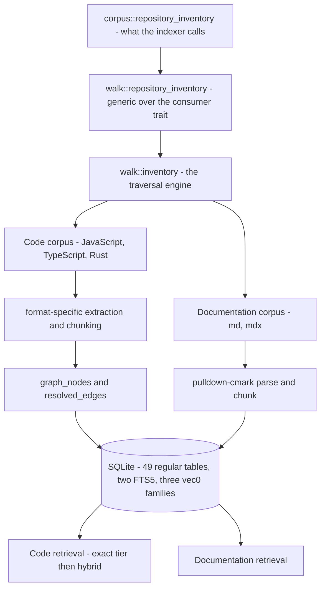

# System overview

jscout indexes a repository so that coding agents can find the right material without reading the whole tree. One deterministic traversal selects two corpora: JavaScript and TypeScript source, which oxc parses into symbol-aligned chunks and a confidence-weighted graph, and Markdown documentation, which a prose parser cuts into heading-scoped chunks. Both land in one SQLite database and are queried through separate retrieval paths. Optional layers add embeddings, TypeScript type resolution via a compiler sidecar, LLM-generated semantic artifacts, and a deterministic value-flow pass that resolves some method receivers without any type checker.

This document is the map. Every claim is expanded, with citations, in one of the documents listed in the [README](README.md).

## What the system is made of

A binary-only Rust crate — no `src/lib.rs`, and `src/main.rs` is 81 lines: 41 module declarations and a short `fn main`. That fronts 88 `.rs` files and 91,282 lines, roughly a third of it test code across 570 tests. Crate version 0.4.0.

| Component | Language | Role |
|---|---|---|
| `src/` | Rust 1.97.1, edition 2024 | Traversal, parsing, extraction, projection, storage, retrieval, CLI, MCP |
| `src/docs/` | Rust | Markdown corpus, prose chunking, documentation retrieval |
| `checker/` | Node + TypeScript | Type resolution via a `ts.Program` in a worker |
| `gateway/` | Node + pi-ai | LLM provider calls; holds credentials |
| `inference/` | Python + uv | BGE-M3 embeddings and cross-encoder reranking |
| `npm/cli/` | Node | `@jscout/cli` launcher over platform binary packages |

Read the top of that diagram for the layering. `walk::repository_inventory` is generic over a `RepositoryInventoryConsumer` trait, and the traversal engine lives in `src/walk/inventory.rs` — an explicit `WalkTask` stack that reproduces sorted depth-first order without recursion and without a depth cap. `walk` owns traversal and ignore handling and knows nothing about Markdown. Each plane owns its membership, hidden-path policy, capture, and extraction, so `DocumentationCollector` is simply one consumer. Markdown membership and capture happen inside the same deterministic traversal that selects code, preventing two filesystem views inside one publication. That capture constraint is distinct from invalidation identity: the resulting code and documentation corpora now have independent digests.

## Two corpora, one database

The `files` table carries a `corpus` column, and `code_files` / `code_chunks` are **views** over it filtered to `corpus='code'`. Structural projection reads the views; documentation gets its own tables — including `doc_inventory`, `doc_chunk_meta`, `doc_file_provenance`, `doc_blame_cache`, `doc_embedding_index_entries`, and `doc_vector_generations` — plus a `docs_fts` index and dimension-named `vec_doc_embeddings_N` vector tables.

Prose chunking could not reuse the code chunker. A chunk boundary is a section change — a heading or a thematic break — or a size threshold, never a heading crossing. Blocks merge while they share a section and stay under a byte budget; an oversized block is split at format-native boundaries (code-fence newlines, table rows, list items) with synthetic context re-prepended. A document's address is its byte span plus line span plus a heading breadcrumb; there are no slugs or HTML anchors anywhere in `src/docs/`.

Documentation embedding identity is deliberately path-independent: a BLAKE3 over a version tag, the nearest heading, and the rendered body, excluding path and byte offsets, so renames and edits to ancestor headings reuse cached vectors.

## One publication, separate invalidation identities

`src/publication.rs` computes three domain-separated digests. `code_digest` covers code contracts, code files and package identity, Rust edition context, and module resolution. `documentation_digest` covers documentation contracts and docs files as path/hash/format. The provenance digest covers Git-basis freshness state. `publication_snapshot` (`meta.snapshot`) is the fold of those three components, published with them in one transaction.

Atomic query/read responses return the code digest as `snapshot` on code and semantic surfaces and the documentation digest on documentation surfaces; `annotate` uses the code digest as its write guard. Those responses also carry `publication_snapshot`. The fold is not itself a freshness, write, or invalidation gate, and it does not cover later checker, semantic, reconnaissance, or vector writes. Open-time schema and producer-contract validation remains global, so separate rotation gates do not make the two planes independently readable from an incompatible database.

## Resolving `obj.method()` without a type checker

| Mechanism | Cost | Resolves | Confidence |
|---|---|---|---|
| Name-match hub | Free | Every same-named property, as candidates | `possible` |
| Value flow | One extra AST pass | Receivers with a closed lexical shape | `likely` |
| Checker sidecar | Minutes | Whatever `ts.Program` knows | `likely` |

Value flow records only closed lexical shapes — `this`, a direct or const-bound `new`, imported const bindings, synchronous factories whose every return path yields another supported value. Awaited values are excluded because thenable assimilation can change runtime identity. A receiver resolved this way is excluded from the checker plan entirely, so the cheap pass removes work from the expensive one. See [06-structural-extraction.md](06-structural-extraction.md).

No call edge anywhere is `certain`, and the default `min_confidence` of `likely` hides name-match candidates from traversal unless a caller lowers it.

## Retrieval

Code retrieval has two modes. Ranked runs a deterministic exact-identifier tier ahead of BM25 plus vector fusion, reranking and repository policy. Exhaustive traverses every chunk whose stored content matches, paged by cursors that encode `(path, start, content-hash)` rather than row ids, and fails the request rather than emitting a hit whose match lines could not be computed. Documentation retrieval is a separate path over its own tables. See [10-code-retrieval.md](10-code-retrieval.md) and [04-documentation-retrieval.md](04-documentation-retrieval.md).

## Scouting now runs concurrently

Scouting executes in waves bounded by a `max_concurrency` setting that **defaults to 1**. Model execution may overlap; validation and database publication do not. A wave that fails mid-flight produces a `wave_aborted` outcome, and the interrupt contract needed two follow-up commits to settle. Because the default is 1, the concurrent path is the less-exercised one. See [11-scouting.md](11-scouting.md).

## Roadmap status

[`PLAN.md`](../../PLAN.md) is the normative source for numbered-gate status. This analysis describes the implementation and does not duplicate that status ledger.

## Where to go next

[22-delta-since-2026-08-24.md](22-delta-since-2026-08-24.md) if you read the previous analysis. [03-documentation-corpus.md](03-documentation-corpus.md) and [04-documentation-retrieval.md](04-documentation-retrieval.md) for what is new. [08-storage-schema.md](08-storage-schema.md) for the data model. [21-sharp-edges.md](21-sharp-edges.md) before changing anything.
