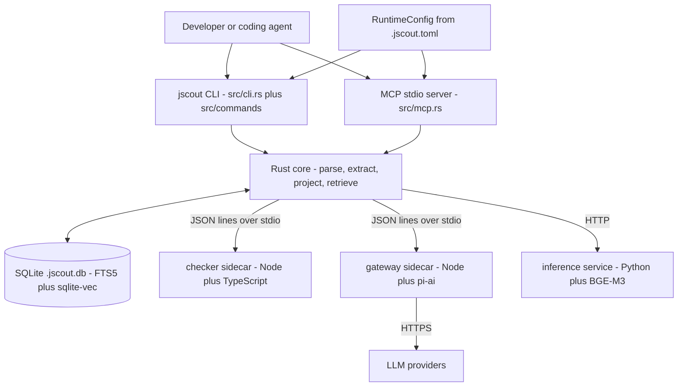
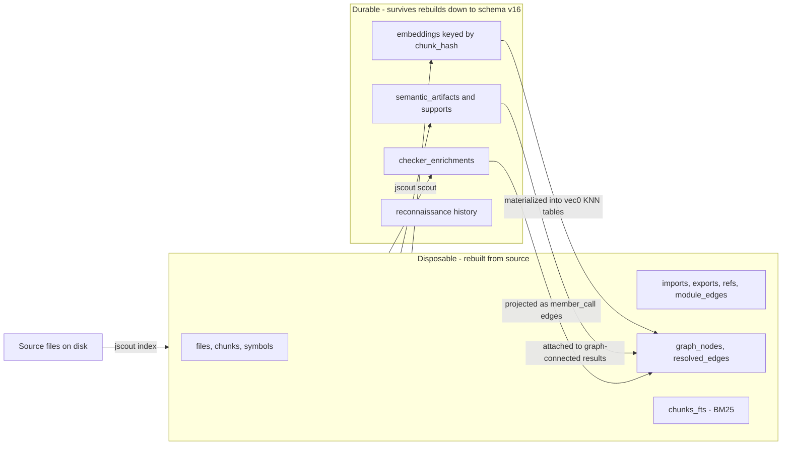
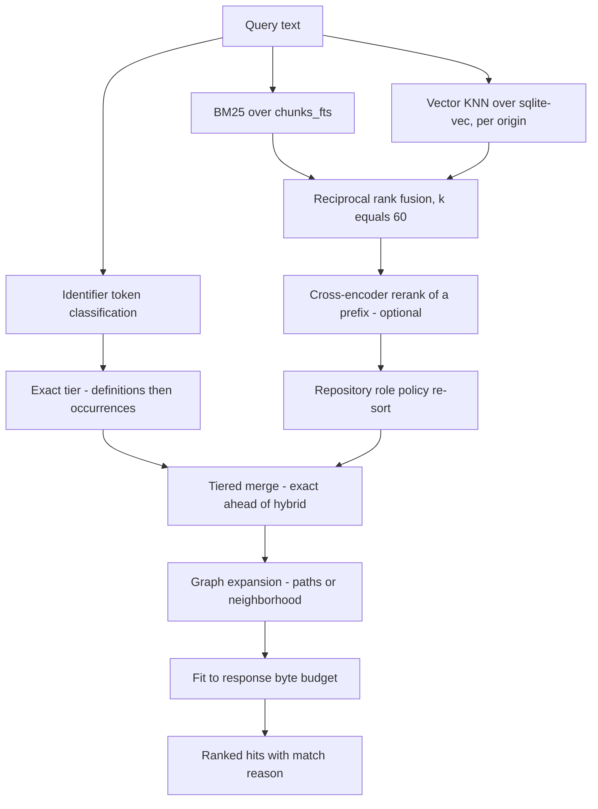

# System overview

jscout indexes JavaScript and TypeScript repositories so that coding agents can find the right code without reading the whole tree. It parses every source file with oxc, cuts it into symbol-aligned chunks, projects a confidence-weighted graph of symbols and their relationships into SQLite, and answers retrieval queries over that graph — first through a deterministic exact-identifier tier, then through hybrid lexical plus vector search. Three optional and independently priced layers sit on top: embeddings, TypeScript type resolution via a compiler sidecar, and LLM-generated semantic artifacts. It ships as one Rust binary plus two Node sidecars and one Python service.

This document is the map. Every claim here is expanded, with citations, in one of the documents listed in the [README](README.md).

## What the system is made of

A single Rust binary crate — there is no `src/lib.rs`, and `src/main.rs` is 79 lines: 39 module declarations (37 production, two test-only) and an 18-line `fn main` (`src/main.rs:51-68`). That fronts 78 `.rs` files and 70,445 lines, of which roughly a third is test code. Crate version 0.4.0.

| Component | Language | Role |
|---|---|---|
| `src/` | Rust 1.97.1, edition 2024 | Parsing, extraction, projection, storage, retrieval, CLI, MCP server |
| `checker/` | Node + TypeScript | Type resolution via the TypeScript compiler API |
| `gateway/` | Node + pi-ai | LLM provider calls; holds credentials |
| `inference/` | Python + uv | BGE-M3 embeddings and cross-encoder reranking |
| `npm/cli/` | Node | `@jscout/cli` launcher over four platform binary packages |
| `eval/` + `scripts/eval-*.mjs` | Node | Pre-registered agent experiments against frozen snapshots |

The processes are separated by capability, not convenience. The checker reads the repository and needs its TypeScript; the gateway holds credentials and touches the network but never reads the repository or the database; the inference service loads model weights. Each boundary is a versioned JSON protocol over stdio or HTTP, with Rust owning timeouts, cancellation, validation, and all durable state.

Read this for the trust boundaries: only `CORE` touches `DB`, only `GW` holds credentials, only `CHK` needs the repository's toolchain. `CFG` feeding both front ends is newer than it looks — see [12-configuration.md](12-configuration.md).

## The three planes

The database is partitioned by lifecycle, not subject matter. Everything cheap to recompute is disposable; everything that cost money, minutes, or model weights is durable and content-addressed, so it re-attaches by hash after a rebuild rather than being recomputed.

The arrows back into `GRAPH` are the point: a full reindex of an embedded repository issues zero embedding calls. Storage is 37 regular tables plus one FTS5 virtual table plus N dynamically-created `vec0` tables, of which 29 are dropped and rebuilt on every index run. `SCHEMA_VERSION` is `"26"` but `DURABLE_SCHEMA_FLOOR` is 16 (`src/store.rs:8-9`) — a single migration boundary replaces a per-version ladder, because there is no value in migrating the shape of data that can be recomputed. See [05-storage-schema.md](05-storage-schema.md).

## Type erasure, and its exception

TypeScript types are treated as documentation, not behavior. Type-only syntax produces **zero** chunks — interfaces, type aliases, `import type`, `export type`, and `declare` constructs all yield no retrievable unit — and type information is erased from the runtime graph in five places, then re-extracted as a parallel *contract* plane in its own tables with its own export-chain resolver. Type-only module edges are weighted below runtime coupling, so type dependencies stay visible as architecture while being structurally unable to influence call projection.

The exception is newer and worth stating: **authored `.d.ts`, `.d.mts` and `.d.cts` files are indexable**. `is_indexable` (`src/walk.rs:13-20`) no longer rejects them by extension; its comment states that authored declaration files are part of the contract plane, and generated declarations are excluded by directory and origin policy instead. See [02-ingestion.md](02-ingestion.md) and [03-structural-extraction.md](03-structural-extraction.md).

## Confidence is a first-class value

Every projected edge carries a confidence and a provenance string.

| Confidence | Meaning | Typical source |
|---|---|---|
| `certain` | Resolved through an unambiguous binding | Identifier reference through a resolved import chain |
| `likely` | Resolved through a heuristic hop, or an unambiguous but type-derived answer | Workspace-inferred module mapping; unambiguous checker resolution |
| `possible` | A name coincidence, not a resolution | Untyped member call matched on property name alone |

Two consequences: no call edge anywhere is `certain`, because a receiver type can still map to several declarations; and the default `min_confidence` of `likely` hides every untyped member-call edge from traversal unless the caller lowers it. Recall on method dispatch is opt-in by construction. See [04-call-graph-and-surface.md](04-call-graph-and-surface.md).

## Query to answer

Retrieval now runs a deterministic tier before anything learned.

The `EX` lane is gate G17. It is an absolute pre-tier, not a boost inside fusion: exact definitions and whole-token occurrences are admitted ahead of everything the reranker produced, and fusion, reranking and policy penalties operate only inside the lower tier where they may reorder exact peers but cannot displace them. Hits carry a `MatchReason` so a caller can tell which lane produced a result. This exists because a measured failure — a search for `createRouteTypesManifest` returning an unrelated `createRoute` helper first — showed that discarding BM25 magnitude in fusion let the reranker demote exact matches. See [07-retrieval.md](07-retrieval.md).

## Indexing is no longer always a full rebuild

The previous analysis of this codebase recorded that the incremental indexer path was `#[cfg(test)]` and unreachable from any command. **That is no longer true.** `indexer::incremental_refresh_repo_with_options` (`src/indexer.rs:209`) is `pub` and non-`cfg(test)`, and it is the watcher's default first phase. The split is deliberate and asymmetric: the incremental extractor is promoted to production **for the watcher only**, while manual `jscout index` stays full-refresh-only. Incremental batches are capped at `MAX_INCREMENTAL_SOURCE_PATHS = 256` distinct paths (`src/watch.rs:22`), above which the generation is promoted to a full refresh. An incremental generation still scans and hashes the complete current source tree and publishes a byte-identical snapshot contract, so readers cannot tell which path produced it. See [13-incremental-and-watch.md](13-incremental-and-watch.md) and [20-delta-since-2026-08-17.md](20-delta-since-2026-08-17.md).

## Configuration moved out of the environment

`.jscout.toml` at the canonical repository root is now the authoritative runtime configuration surface. `JSCOUT_*` environment variables are demoted to a third tier that never overrides a configured field and produces a migration warning on every run naming each key still coming from the environment. Precedence is CLI flag, then `.jscout.toml`, then legacy environment variable, then builtin default, with provenance recorded per key and surfaced by `jscout config show`. Secrets are never values in the model — only variable *names*. This subsystem did not exist a week ago. See [12-configuration.md](12-configuration.md).

## Threads

There is still no async runtime — no tokio, no rayon; HTTP is blocking. The index, extract and project pipeline is a single thread. Threads exist only for sidecar stream readers, the notify event source, and the watcher's interruptible-phase workers, each of which opens its own database connection. See [16-cross-cutting.md](16-cross-cutting.md).

## Where to go next

[20-delta-since-2026-08-17.md](20-delta-since-2026-08-17.md) if you read the previous analysis and need to know what to discard. [17-end-to-end-traces.md](17-end-to-end-traces.md) to follow one request down. [05-storage-schema.md](05-storage-schema.md) if you want the data model, since most subsystems are best understood as things that write to or read from specific tables. [19-sharp-edges.md](19-sharp-edges.md) before changing anything.
