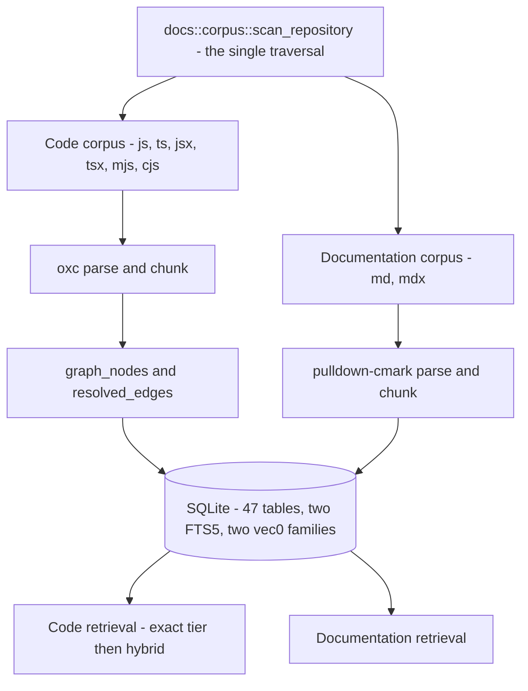

# System overview

jscout indexes a repository so that coding agents can find the right material without reading the whole tree. One deterministic traversal selects two corpora: JavaScript and TypeScript source, which oxc parses into symbol-aligned chunks and a confidence-weighted graph, and Markdown documentation, which a prose parser cuts into heading-scoped chunks. Both land in one SQLite database and are queried through separate retrieval paths. Optional layers add embeddings, TypeScript type resolution via a compiler sidecar, LLM-generated semantic artifacts, and a deterministic value-flow pass that resolves some method receivers without any type checker.

This document is the map. Every claim is expanded, with citations, in one of the documents listed in the [README](README.md).

## What the system is made of

A binary-only Rust crate — no `src/lib.rs`, and `src/main.rs` is 81 lines: 41 module declarations and a short `fn main`. That fronts 87 `.rs` files and 91,174 lines, roughly half of it test code across 570 tests. Crate version 0.4.0.

| Component | Language | Role |
|---|---|---|
| `src/` | Rust 1.97.1, edition 2024 | Traversal, parsing, extraction, projection, storage, retrieval, CLI, MCP |
| `src/docs/` | Rust | Markdown corpus, prose chunking, documentation retrieval |
| `checker/` | Node + TypeScript | Type resolution via a `ts.Program` in a worker |
| `gateway/` | Node + pi-ai | LLM provider calls; holds credentials |
| `inference/` | Python + uv | BGE-M3 embeddings and cross-encoder reranking |
| `npm/cli/` | Node | `@jscout/cli` launcher over platform binary packages |

Read the top of that diagram carefully, because it inverts what earlier descriptions of this system said. `walk::repository_inventory` no longer walks anything — it delegates to `docs::corpus::scan_repository` (`src/docs/corpus.rs:164`), so the documentation module owns the single traversal that produces the *code* file list as well. The reason is stated in the source: Markdown membership, capture and parse must happen inside the same deterministic walk that selects code, so documentation cannot acquire an independent snapshot or a second filesystem scan. The old `ignore::WalkBuilder` iteration survives only for read-only diagnostics and the watcher's path policy.

## Two corpora, one database

The `files` table carries a `corpus` column, and `code_files` / `code_chunks` are **views** over it filtered to `corpus='code'` (`src/store.rs:429-437`). Structural projection reads the views; documentation gets its own tables — `doc_inventory`, `doc_chunk_meta`, `doc_embedding_index_entries`, `doc_vector_generations`, a `docs_fts` index, and dimension-named `vec_doc_embeddings_N` vector tables alongside the code plane's `vec_embeddings_N`.

Prose chunking could not reuse the code chunker. A chunk boundary is a section change — a heading or a thematic break — or a size threshold, never a heading crossing. Blocks merge while they share a section and stay under a byte budget; an oversized block is split at format-native boundaries (code-fence newlines, table rows, list items) with synthetic context re-prepended. A document's address is its byte span plus line span plus a heading breadcrumb; there are no slugs or HTML anchors anywhere in `src/docs/`.

Documentation embedding identity is deliberately path-independent: a BLAKE3 over a version tag, the nearest heading, and the rendered body, excluding path and byte offsets, so renames and edits to ancestor headings reuse cached vectors.

## Where the two planes are not actually separate

The design intent recorded in `PLAN.md` is that prose changes must not couple to structural snapshots. The implementation does not yet achieve that. `compute_snapshot_with_resolution` (`src/structural.rs:429`) hashes `SELECT f.path, f.hash, f.role, f.origin, f.corpus, f.format … FROM files f … ORDER BY f.path` — **with no corpus filter**. Documentation rows are inside the structural snapshot digest, so editing a `.md` file moves the structural snapshot. [06-structural-extraction.md](06-structural-extraction.md) traces the consequences; [21-sharp-edges.md](21-sharp-edges.md) ranks it.

The reverse coupling also exists: a documentation read validates `extraction_version`, the code plane's producer contract (`src/store.rs:134-139`), so the two planes are not independently readable.

## Resolving `obj.method()` without a type checker

| Mechanism | Cost | Resolves | Confidence |
|---|---|---|---|
| Name-match hub | Free | Every same-named property, as candidates | `possible` |
| Value flow | One extra AST pass | Receivers with a closed lexical shape | `likely` |
| Checker sidecar | Minutes | Whatever `ts.Program` knows | `likely` |

Value flow records only closed lexical shapes — `this`, a direct or const-bound `new`, imported const bindings, synchronous factories whose every return path yields another supported value. Awaited values are excluded because thenable assimilation can change runtime identity. A receiver resolved this way is excluded from the checker plan entirely, so the cheap pass removes work from the expensive one. See [06-structural-extraction.md](06-structural-extraction.md).

No call edge anywhere is `certain`, and the default `min_confidence` of `likely` hides name-match candidates from traversal unless a caller lowers it.

## Retrieval

Code retrieval has two modes. Ranked runs a deterministic exact-identifier tier ahead of BM25 plus vector fusion, reranking and repository policy. Exhaustive traverses every chunk whose stored content matches, paged by cursors that encode `(path, start, content-hash)` rather than row ids, and fails the request rather than emitting a hit whose match lines could not be computed. Documentation retrieval is a separate path over its own tables. See [10-code-retrieval.md](10-code-retrieval.md) and [04-documentation-retrieval.md](04-documentation-retrieval.md).

## Scouting now runs concurrently

Scouting executes in waves bounded by a `max_concurrency` setting that **defaults to 1**. Model execution may overlap; validation and database publication do not. A wave that fails mid-flight produces a `wave_aborted` outcome, and the interrupt contract needed two follow-up commits to settle. Because the default is 1, the concurrent path is the less-exercised one. See [11-scouting.md](11-scouting.md).

## Gate status, stated accurately

`PLAN.md`'s own headings are not all current. G24 is headed "Proposed" but phases 1 and 2 — named-sections admission and documentation vectors — are built and merged; phases 3 (git-basis freshness) and 4 (documentation-aware watch classification) are not. The heading was never updated when the code landed. G25 is genuinely proposed. G23 shipped as agent guidance with its acceptance replay still pending. See [20-history-and-roadmap.md](20-history-and-roadmap.md).

Phase 4's absence has a concrete consequence: **a `.md` edit alone does not trigger a watch generation.** The watcher filters events through `walk::is_indexable`, which accepts only JS/TS extensions. Documentation is reindexed only when a code change happens to trigger a generation. See [16-incremental-and-watch.md](16-incremental-and-watch.md).

## Where to go next

[22-delta-since-2026-08-24.md](22-delta-since-2026-08-24.md) if you read the previous analysis. [03-documentation-corpus.md](03-documentation-corpus.md) and [04-documentation-retrieval.md](04-documentation-retrieval.md) for what is new. [08-storage-schema.md](08-storage-schema.md) for the data model. [21-sharp-edges.md](21-sharp-edges.md) before changing anything.
