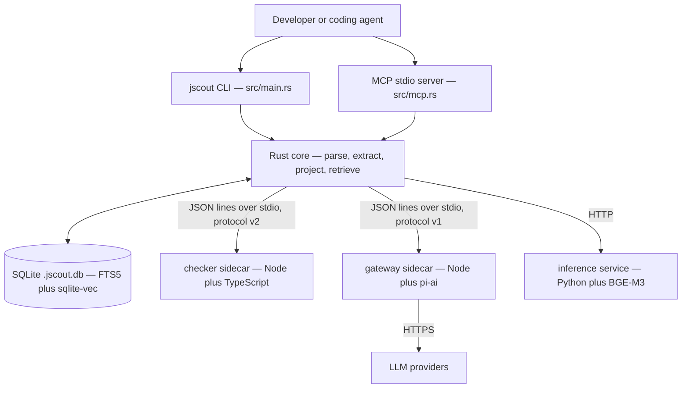
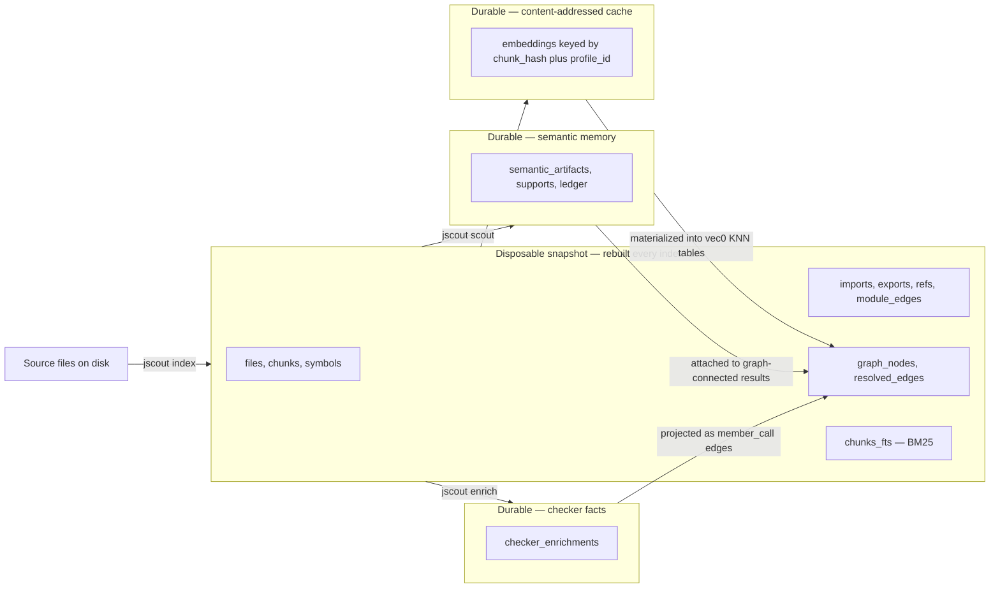
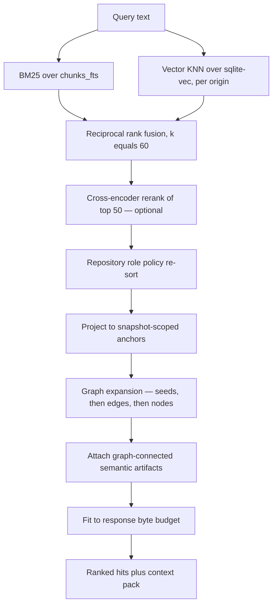

# System overview

jscout indexes JavaScript and TypeScript repositories so that coding agents can find the right code without reading the whole tree. It parses every source file with oxc, cuts it into symbol-aligned chunks, projects a confidence-weighted graph of symbols and their relationships into SQLite, and answers retrieval queries over that graph with hybrid lexical plus vector search. Three optional and independently expensive layers sit on top: embeddings, TypeScript type resolution via a compiler sidecar, and LLM-generated semantic artifacts. The whole thing ships as one Rust binary plus two Node sidecars and one Python service.

This document is the map. Every claim here is expanded, with citations, in one of the documents listed in the [README](README.md).

## What the system is made of

The repository is a single Rust binary crate — there is no `src/lib.rs`, and `src/main.rs` declares all 32 modules directly. That is 57,769 lines across 48 `.rs` files, roughly half of which is test code living in inline `#[cfg(test)]` modules (319 tests total). Nothing consumes jscout as a library, so a `lib` target would only add an API-stability surface to maintain.

| Component | Language | Role |
|---|---|---|
| `src/` | Rust 1.97.1, edition 2024 | Parsing, extraction, projection, storage, retrieval, CLI, MCP server |
| `checker/` | Node + TypeScript 5.9.3 | Real type resolution via the TypeScript compiler API |
| `gateway/` | Node + pi-ai | LLM provider calls; holds credentials |
| `inference/` | Python + uv | BGE-M3 embeddings and cross-encoder reranking |
| `eval/` + `scripts/eval-*.mjs` | Node | Pre-registered agent experiments against frozen repo snapshots |

The four processes are deliberately separated by capability rather than by convenience. The checker reads the repository and needs the repo's own TypeScript installation; the gateway holds API credentials and touches the network but never reads the repository or the database; the inference service loads model weights. Each boundary is a versioned JSON protocol over stdio or HTTP, with Rust owning timeouts, cancellation, and persistence on every one of them.

Read this diagram for the trust boundaries: only `CORE` touches `DB`, only `GW` holds credentials, and only `CHK` needs the repository's own toolchain. The CLI and the MCP server are two front ends over the same core, and neither has logic of its own beyond argument handling and response shaping.

## The three planes

The single most consequential architectural decision is that the database is partitioned by lifecycle, not by subject matter. Everything derived cheaply from source is disposable and gets truncated and rebuilt wholesale on every index run. Everything expensive — network calls, model weights, LLM spend, compiler time — is durable and content-addressed so a full rebuild costs nothing to recompute.

The arrows back into `GRAPH` are the point. Durable planes are keyed by content hashes — a chunk's blake3, an artifact's input fingerprint, a checker occurrence's span identity — so when the disposable snapshot is thrown away and rebuilt, the durable rows re-attach to the new snapshot by hash rather than being recomputed. A full reindex of an embedded repository issues zero embedding calls.

This also explains the migration policy. `src/store.rs` replaced a per-version migration ladder with a single `DURABLE_SCHEMA_FLOOR` constant set to 16 (`src/store.rs:9`) plus wholesale rebuild of everything disposable. Upgrading from v16 through v22 forces a full reindex; anything below v16 is refused outright rather than migrated best-effort. There is no value in migrating the shape of data that can be recomputed from source.

## Type erasure

The project's stated philosophy is that TypeScript types are for humans and carry no runtime behavior, and the code takes that literally. Type-only syntax produces **zero** chunks — interfaces, type aliases, `import type`, `export type`, and `declare` constructs all yield no retrievable unit (`src/chunk.rs:119-127`), and `.d.ts` files are rejected at discovery (`src/walk.rs:13`).

But the type information is not discarded, it is quarantined. Every import and export is forked at extraction time into a runtime list and a *contract* list, stored in separate `contract_imports` / `contract_exports` tables with their own export-chain resolver. Type-only module dependencies become distinct edge kinds (`imports_types`, `imports_package_types`) weighted 0.6 against 0.75 for runtime `import` and `reexport` (`src/structural.rs:3311-3312`). The effect is that type edges remain visible as architectural information while being structurally incapable of influencing call projection or workflow traversal.

The cost is direct: interfaces and type aliases cannot be retrieved through chunk search at all. This is the gap the checker sidecar exists to partially close — see [09-sidecars.md](09-sidecars.md).

## Confidence is a first-class value

Nothing in the graph claims more certainty than it has. Every projected edge carries a confidence in a three-level lattice and a provenance string explaining where it came from.

| Confidence | Meaning | Typical source |
|---|---|---|
| `certain` | Resolved through an unambiguous binding | Identifier reference through a resolved import chain |
| `likely` | Resolved, but through a heuristic hop or a non-unique type answer | Workspace-inferred module mapping; unambiguous checker resolution |
| `possible` | A name coincidence, not a resolution | Untyped member call matched by property name |

Two facts follow that surprise people. First, **no call edge anywhere in the system is `certain`** — checker-derived member calls are assigned `likely` when the answer is unambiguous and `possible` otherwise, never `certain` (`src/checker/enrich.rs:1897-1899`), because a receiver type can still map to multiple declarations. So `certain` in `who_uses` output always means an identifier reference and never a method dispatch. Second, the default `min_confidence` of `likely` hides all untyped member-call edges from neighborhood and path traversal unless the caller explicitly lowers it. Recall on method dispatch is opt-in.

## Source to answer

The retrieval path fuses two rankings that live on incompatible scales, then reshapes the result until it fits a byte budget.

Rank fusion at `RRF` (`src/search.rs:809`, with k fixed at 60) throws away magnitude deliberately: BM25 scores and cosine distances are uncalibrated against each other, and rank fusion needs no normalization or per-corpus tuning. The price is that a dramatically better vector hit gets the same weight as a marginal top-1 lexical hit, which is part of why the optional reranker at `RR` exists. Note that `RR` only rescores a prefix and splices it back — a candidate at fused rank 51 can never be promoted.

The `EXP` stage admits edges atomically with both endpoints, before standalone nodes. An earlier nodes-first ordering could exhaust the byte budget before emitting a single edge, producing "context packs" with no relationships in them. Full detail is in [07-retrieval.md](07-retrieval.md).

## What runs where, and on how many threads

There is no async runtime. `Cargo.toml` has no tokio, no rayon, no futures; HTTP is blocking `ureq`. The entire index, extract, and project pipeline is a single thread walking a sorted file list. Threads exist in exactly three places, all for I/O or cancellation: one reader thread per sidecar stream, the notify event thread, and the watcher's interruptible-phase workers. Each worker opens its own database connection, which is why no `Send`/`Sync` wrapper around `rusqlite::Connection` appears anywhere.

That simplicity is bought with a real cost: indexing is proportional to repository size on every run, because the production path is always a full rebuild. The incremental code path in `src/indexer.rs` exists but is `#[cfg(test)]` and unreachable from any command. See [14-cross-cutting.md](14-cross-cutting.md) and [11-incremental-and-watch.md](11-incremental-and-watch.md).

## How this repository was built

292 commits by a single author between 2026-08-07 and 2026-08-17 — ten calendar days. Development is organized around numbered gates (G1 through G16) defined in `PLAN.md`, which is explicitly the only normative architecture document. A gate carries a contract, a numbered implementation order with steps individually marked complete, falsifiable acceptance checks, and an out-of-scope list; gates are amended in place with dated headings rather than rewritten, and branch names encode them (`feat/g12-watcher-coordinator`).

As of commit `a102597`, G1 through G14 are implemented, G15 (design-before-edit task memory) is the next planned milestone, and G16 is a conditional gate that only opens if specific evidence criteria fire. G10 — the checker sidecar — is implemented but explicitly *not accepted*: full-scale runs on large real repositories remain open. See [16-history-and-roadmap.md](16-history-and-roadmap.md).

Evaluation runs ahead of features rather than behind them. The `eval/` tree holds pre-registrations, an adjudication rubric, and dated immutable results, and the harness runs Codex agents against `git archive` exports with no `.git` directory so history cannot leak the answer. The rubric also registers an asymmetric default that resolves uncertainty *against* the tool's author, and it records that the judge and the author are the same person. See [12-evaluation.md](12-evaluation.md).

## Where to go next

Read [15-end-to-end-traces.md](15-end-to-end-traces.md) if you want to follow one request all the way down. Read [05-storage-schema.md](05-storage-schema.md) if you want to understand the data model, since almost every other subsystem is best understood as something that writes to or reads from a specific set of tables. Read [17-sharp-edges.md](17-sharp-edges.md) before changing anything.
