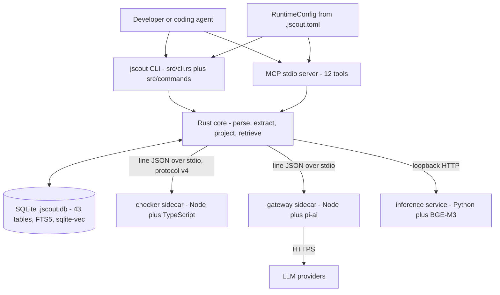
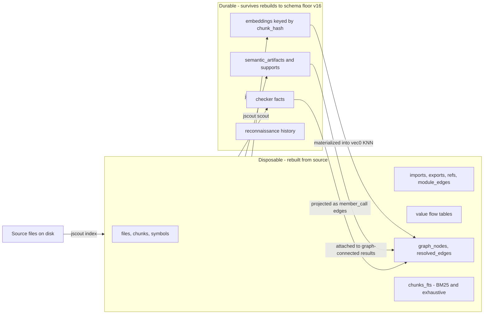
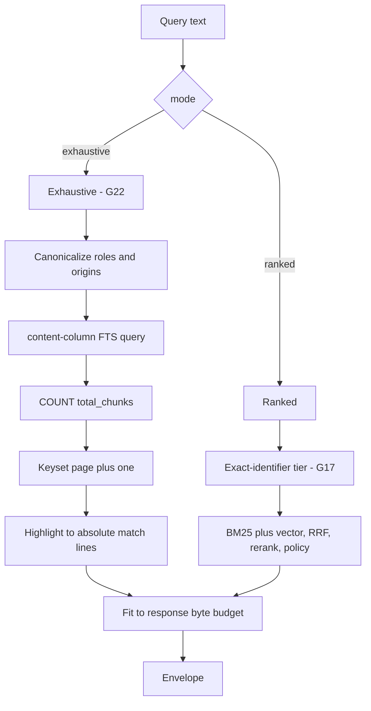

# System overview

jscout indexes JavaScript and TypeScript repositories so that coding agents can find the right code without reading the whole tree. It parses every file with oxc, cuts it into symbol-aligned chunks, projects a confidence-weighted graph of symbols and their relationships into SQLite, and answers queries in one of two modes: ranked hybrid retrieval, or an exhaustive lexical traversal that pages through every matching chunk with a completeness guarantee. Three optional and independently priced layers sit on top — embeddings, TypeScript type resolution via a compiler sidecar, and LLM-generated semantic artifacts — plus a deterministic value-flow pass that resolves some method receivers without any type checker at all.

Every claim here is expanded, with citations, in one of the documents listed in the [README](README.md).

## What the system is made of

A binary-only Rust crate — no `src/lib.rs`, and `src/main.rs` is 80 lines: 40 module declarations and a short `fn main`. That fronts 82 `.rs` files and 79,963 lines, roughly half of it test code across 474 tests. Crate version 0.4.0.

| Component | Language | Role |
|---|---|---|
| `src/` | Rust 1.97.1, edition 2024 | Parsing, extraction, projection, storage, retrieval, CLI, MCP server |
| `checker/` | Node 22.19.0 + TypeScript | Real type resolution via a `ts.Program` in a worker |
| `gateway/` | Node + pi-ai | LLM provider calls; holds credentials |
| `inference/` | Python + uv | BGE-M3 embeddings and cross-encoder reranking |
| `npm/cli/` | Node | `@jscout/cli` launcher over platform binary packages |
| `eval/` + `scripts/eval-*.mjs` | Node | Pre-registered agent experiments against frozen snapshots |

Processes are separated by capability. The checker reads the repository and needs its TypeScript; the gateway holds credentials and touches the network but never reads the repository or the database; the inference service loads model weights. Each boundary is a versioned JSON protocol — the checker's is now at version 4 — with Rust owning timeouts, cancellation, validation, and all durable state.

Only `CORE` touches `DB`, only `GW` holds credentials, only `CHK` needs the repository's toolchain. `CFG` is resolved before any database is opened or sidecar spawned — see [13-configuration.md](13-configuration.md).

## The two planes

Storage is partitioned by lifecycle. `src/store.rs` declares 43 regular tables plus one FTS5 virtual table in a single idempotent `init_schema` batch, with 53 explicit indexes; N `vec0` tables are created dynamically per embedding dimension. Everything cheap to recompute is dropped and rebuilt on reset; everything that cost money, minutes, or model weights is content-addressed and re-attaches by hash.

A full reindex of an embedded repository issues zero embedding calls. `SCHEMA_VERSION` is `"29"` (`src/store.rs`), with `EXTRACTION_VERSION` at 7 and `PROJECTION_VERSION` at 12 — three independent version stamps, so a change to chunking invalidates extraction without forcing a re-embed. See [06-storage-schema.md](06-storage-schema.md).

## Resolving `obj.method()` without a type checker

The hardest problem in this codebase is method dispatch: the receiver's class is not in the syntax. Three mechanisms attack it, in increasing cost.

| Mechanism | Cost | What it resolves | Confidence |
|---|---|---|---|
| Name-match hub | Free | Every same-named property, as candidates | `possible` |
| **Value flow** | One extra AST pass | Receivers with a closed lexical shape | `likely` |
| Checker sidecar | Minutes | Whatever `ts.Program` knows | `likely` |

Value flow is new and deliberately limited. `src/value_flow.rs` is a pure oxc pass recording only *closed lexical shapes* — `this`, a direct or const-bound `new`, imported const bindings, and synchronous factories whose every return path yields another supported value. Its own header states it is not a type inferrer. Awaited values are excluded because thenable assimilation can change runtime identity; decorated or mutated classes are recorded as blockers. `src/structural/receiver_flow.rs` then resolves those shapes through the module graph using an *exact* export resolver rather than the heuristic one, and mints occurrence-specific `member_call` edges with provenance `receiver-value-flow`.

The consequence worth knowing: a receiver resolved this way is **excluded from the checker plan entirely**. The cheap deterministic pass removes work from the expensive one. See [04-value-flow.md](04-value-flow.md).

## Confidence is a first-class value

| Confidence | Meaning | Typical source |
|---|---|---|
| `certain` | Resolved through an unambiguous binding | Identifier reference through a resolved import chain |
| `likely` | Resolved through a heuristic hop, value flow, or an unambiguous type answer | Workspace-inferred mapping; `receiver-value-flow`; checker |
| `possible` | A name coincidence, not a resolution | Untyped member call matched on property name |

No call edge anywhere is `certain`. The default `min_confidence` of `likely` hides name-match candidates from traversal unless the caller lowers it, so recall on method dispatch is opt-in. See [05-call-graph-and-surface.md](05-call-graph-and-surface.md).

## Two retrieval modes

The two modes share the envelope and the budget but nothing else, which is why exhaustive mode *forbids* reranking, expansion, and memory attachment rather than ignoring them — the CLI and MCP server pre-neutralize those options, and the search layer bails defensively if they survive.

Exhaustive mode's promise is completeness over the `content` FTS column: every chunk whose stored source text matches, paged deterministically. Its cursors encode `(path, start, content-hash)` rather than a row id, because row ids are disposable — a file removed and reindexed can hand the same id to a different chunk, and an edit-then-revert can retire an id on a byte-identical database. Both cases are pinned by tests. Highlight markers are namespaced with ASCII record separators and extended on collision, and the whole request fails if highlights do not cover every selected chunk, rather than emitting a hit with empty match lines. See [08-retrieval.md](08-retrieval.md).

## Indexing, incrementally

`jscout watch` runs debounced, monotonically numbered generations; each begins with a structural refresh that is incremental or full depending on scope, then optionally chains embed, checker enrich, and semantic embed onto the snapshot that refresh published. Incremental refresh is production-reachable for the watcher; manual `jscout index` remains full-refresh. See [14-incremental-and-watch.md](14-incremental-and-watch.md).

## Threads

Still no async runtime. The index, extract and project pipeline is a single thread; threads exist only for sidecar stream readers, the notify event source, and the watcher's interruptible-phase workers, each with its own database connection. See [16-cross-cutting.md](16-cross-cutting.md).

## Where to go next

[20-delta-since-2026-08-22.md](20-delta-since-2026-08-22.md) if you read the previous analysis. [08-retrieval.md](08-retrieval.md) and [04-value-flow.md](04-value-flow.md) for what is new. [06-storage-schema.md](06-storage-schema.md) for the data model. [19-sharp-edges.md](19-sharp-edges.md) before changing anything.
