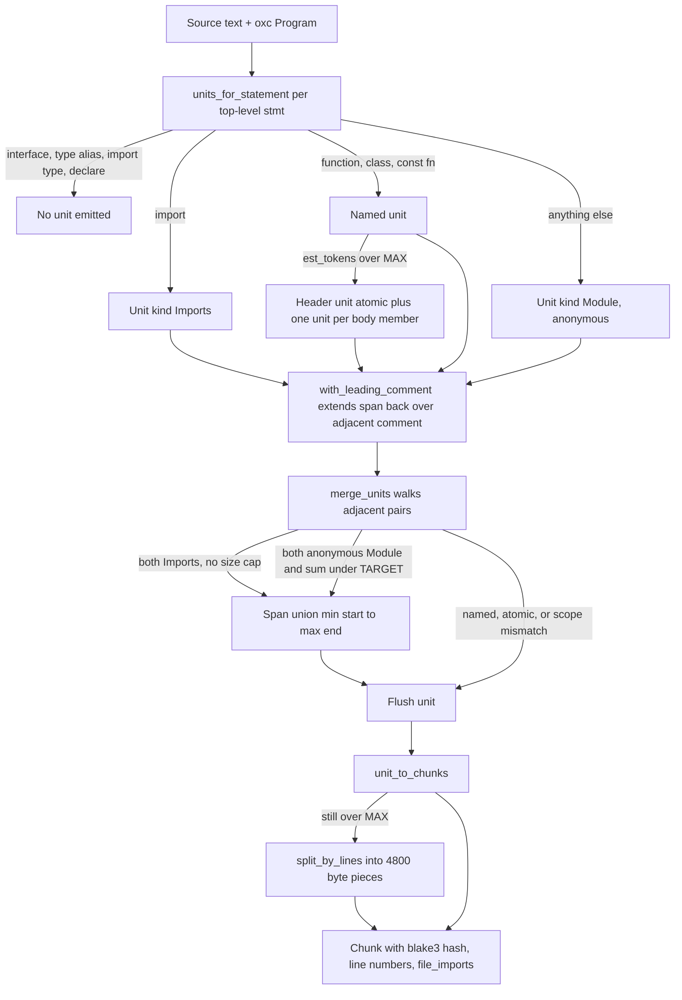
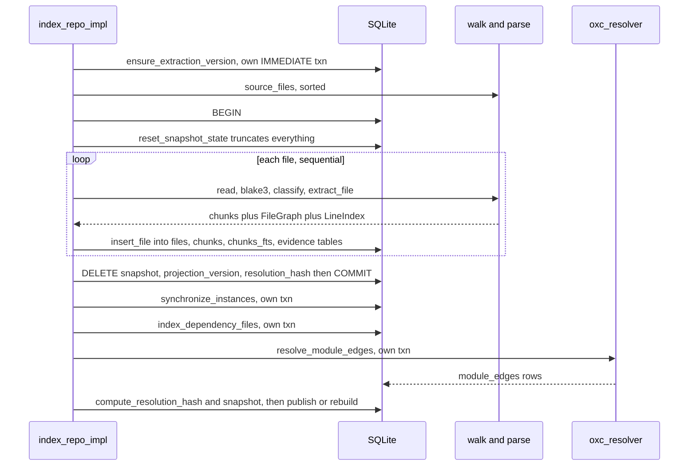
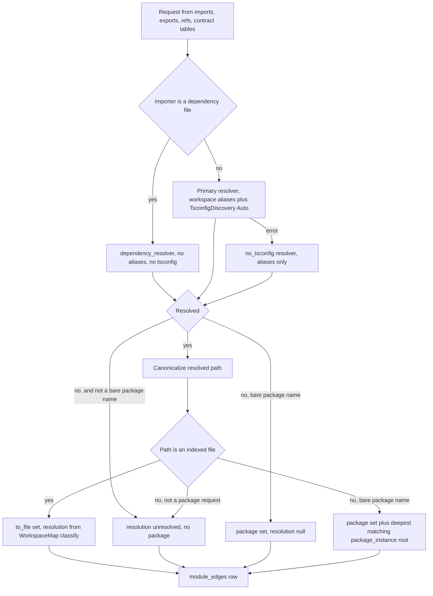

# Ingestion: discovery, parsing, chunking, and resolution

Ingestion turns a checkout on disk into rows in the SQLite snapshot. It enumerates every indexable JS/TS file under a repository root, parses each with oxc inside a scoped arena, cuts the program into symbol-aligned chunks that deliberately drop type-only syntax, classifies each file's role and corpus origin, writes chunks and structural evidence in one sequential transaction, and then — after the canonical rows are committed — resolves every module request into `module_edges` using an `oxc_resolver` configured with an alias table built from the repository's own manifests. Everything downstream reads only what this phase produced, so its determinism and its erasure decisions are load-bearing for the whole system.

## Discovery

`walk::source_files` (`src/walk.rs:22`) builds an `ignore::WalkBuilder` with `hidden(true)`, `git_ignore(true)`, `git_global(true)` and `git_exclude(true)`, so dot-entries and all three gitignore layers are honored without project-specific configuration, then installs a `filter_entry` closure (`src/walk.rs:29`) rejecting any directory whose basename appears in `SKIP_DIRS`. Because `filter_entry` prunes rather than filters, those subtrees are never descended even when not gitignored — which matters for `dist/`, since a built monorepo package often ships output that is present but uncommitted.

| Knob | Value | Where |
| --- | --- | --- |
| Indexable extensions | `js jsx ts tsx mjs cjs mts cts` | `src/walk.rs:5` |
| Pruned directories | `node_modules dist build .next coverage out` | `src/walk.rs:8` |
| Always rejected | `*.d.ts`, `*.d.mts`, `*.d.cts` | `src/walk.rs:13` |
| Ignore sources | `.gitignore`, global gitignore, `.git/info/exclude`, hidden entries | `src/walk.rs:25-28` |

The declaration-file rejection is the first appearance of the type-erasure stance: a `.d.ts` has no runtime behavior, so it contributes nothing the indexer models. The result vector is `sort()`ed (`src/walk.rs:39`), and that sort is what makes the entire index reproducible — file ids, chunk ids, and the structural snapshot hash all inherit walk order. There is no user-facing include/exclude configuration; the only levers are gitignore and the hardcoded `SKIP_DIRS`, which is also reused by workspace glob expansion and entry-candidate filtering (`src/workspace.rs:520`) and by dependency file collection (`src/dependency.rs:537`). `src/walk.rs` has no unit tests of its own.

## Parsing: the arena-scoped borrow

oxc allocates the AST in a bump arena, and `Semantic` borrows that AST. `parse::with_parsed` (`src/parse.rs:26`) turns that lifetime constraint into an API: it creates an `Allocator` on its own stack frame, parses into it, builds semantic data from `&ret.program`, and calls the caller's closure with `(&ParserReturn, &Semantic)`. Only an owned `T` escapes, so no caller can hold a `Program` past the arena's lifetime and all per-file analysis has to be one pass inside the closure — which is what `extract_file` does, running the chunker and `graph::extract` back to back and returning an owned `FileData { chunks, graph, lines }` (`src/indexer.rs:480-491`). `SemanticBuilder` is configured `.with_build_nodes(true)` (`src/parse.rs:46`) because reference classification in the graph extractor walks node ancestors.

Error handling is deliberately narrow. oxc returns diagnostics for recoverable problems as a matter of course, so only `ret.panicked` aborts (`src/parse.rs:34`) — a file with recoverable syntax errors still indexes in full. When the parser does abort, the first diagnostic is lifted into the outer `anyhow` error text (`src/parse.rs:35-43`) rather than attached as context, because callers already add the path and `Display` on a context chain would otherwise collapse to just the path.

`source_type_for` (`src/parse.rs:9`) takes `SourceType::from_path` and, for anything `is_javascript()`, calls `.with_jsx(true)`. The comment at `src/parse.rs:11-15` gives the reason: oxc 0.143 derives the non-JSX variant for `.js`/`.mjs`/`.cjs`, but JSX in `.js` is routine in Babel- and framework-owned sources, and JSX's grammar is additive for JavaScript, so `a < b && c > d` still parses (test at `src/parse.rs:87`). TypeScript stays extension-strict — only `.tsx` enables TSX — because `<T>expr` type assertions and JSX elements are genuinely ambiguous in `.ts`. Exotic JS hostile to JSX tokenization could still mis-parse; an unknown extension falls back to `SourceType::default()`.

## Chunking

Sizing is byte-based and crude: `est_tokens(span) = (span.end - span.start) / 4` (`src/chunk.rs:64`), with `TARGET_TOKENS = 1200` and `MAX_TOKENS = 2000` (`src/chunk.rs:9-10`) — 4800 and 8000 bytes. There is no overlap window; the model is a span-partition of the file, not a sliding window. The path from statements to rows:

The `ERASE` branch is the philosophy made mechanical. `units_for_statement` (`src/chunk.rs:119`) matches `TSInterfaceDeclaration`, `TSTypeAliasDeclaration`, `TSImportEqualsDeclaration`, `declare` module declarations, `import type` and `export type` and emits nothing (`src/chunk.rs:122-127`); the same arms repeat inside the `export <decl>` unwrap (`src/chunk.rs:160-163`), and `units_for_function` returns early for `f.declare` (`src/chunk.rs:205`). No chunk is ever created for a type-only construct, so interfaces and type aliases are not retrievable through chunk search at all. Type edges survive separately in `contract_imports`/`contract_exports`, but the text of a type declaration is only ever visible in a chunk by accident, via span union (see below).

`SPLIT` handles oversized declarations. A function over `MAX_TOKENS` becomes an `atomic` header unit spanning `full_span.start .. first_body_statement.start`, plus one non-atomic `Module` unit per body statement carrying the function name in `scope_chain` (`src/chunk.rs:242-261`). Classes split the same way into a `ClassHeader` and one `Method` unit per member (`src/chunk.rs:295-317`). `units_for_var` promotes a single-declarator `const Foo = () => …` or `= function …` to a named unit and applies the same header/body split to an oversized arrow with a block body (`src/chunk.rs:329-375`). `component_or_function` (`src/chunk.rs:190`) calls a named unit a `Component` when the file is JSX and the name starts with an ASCII uppercase letter.

`merge_units` (`src/chunk.rs:405`) is where the "named declarations stand alone" rule lives. Two adjacent units merge only when neither is `atomic`, their `scope_chain`s are equal, and either both are `Imports` — with *no* size cap at all, so a huge import block merges into one unit and is only afterwards line-split — or both are anonymous `Module` units whose combined estimate is at or under `TARGET_TOKENS` (`src/chunk.rs:429-434`). The stated reason (`src/chunk.rs:421-424`) is that a chunk that *is* `getUser` retrieves better than one containing `getUser` plus three unrelated statements. The cost is row count: a file of one-line exports produces one chunk per export, each with its own embedding.

Merging takes `min(start) .. max(end)` (`src/chunk.rs:436-437`) — a span union, not a concatenation. Any text lying between two merged units is absorbed, including erased type declarations that produced no unit, so a `type Foo = …` sandwiched between two mergeable anonymous statements does reappear in chunk content. Erasure is a guarantee about *chunk boundaries and names*, not about which bytes can appear inside a chunk.

Chunk spans within a file are also **not** strictly disjoint. `chunk_program` applies `with_leading_comment` to every unit including the inner body-statement units of a split (`src/chunk.rs:112-114`), so a comment sitting inside a header unit's span can also be pulled into the following body unit's span, duplicating that comment across two chunks. In practice this is benign — `chunk_for` (`src/indexer.rs:552`) attributes evidence to the *first* chunk whose `[start, end)` contains the offset, and evidence offsets never land inside a comment — but any consumer that assumes a partition will be wrong. `with_leading_comment` (`src/chunk.rs:389`) scans comments in reverse, stops at the first one ending at or before the span start, and extends only when the intervening gap is whitespace with at most one newline.

`unit_to_chunks` (`src/chunk.rs:461`) is the last-resort splitter. Anything still over `MAX_TOKENS` goes through `split_by_lines` (`src/chunk.rs:494`), which walks 4800-byte budgets, backs the provisional end up to the nearest preceding `\n`, and guards `is_char_boundary` on both sides of that search so a multibyte codepoint is never cut (`src/chunk.rs:503-517`). A single "line" longer than the budget yields an over-budget chunk rather than a broken one. Multi-part results are named `Name#part1`, `#part2`, and only part 1 keeps `symbols` (`src/chunk.rs:471-481`).

| `Chunk` field | Note |
| --- | --- |
| `kind` | `Function \| Component \| Class \| ClassHeader \| Method \| Imports \| Module` (`src/chunk.rs:14`), snake_case in SQL/JSON |
| `name` / `scope_chain` | `scope_chain` is outermost-first, e.g. `["UserService"]` for a method |
| `symbols` | top-level declared names; part 1 only for split chunks |
| `start` / `end` | byte offsets, used by `chunk_for` to attach evidence |
| `start_line` / `end_line` | 1-based, `partition_point` over newline offsets (`src/chunk.rs:59`) |
| `hash` / `content` | `blake3(content)` hex (`src/chunk.rs:486`) plus the verbatim source slice |
| `file_imports` | sorted `requested_modules` keys — per-*file* context copied onto every chunk (`src/chunk.rs:41-42`) |

## Role and origin

Two orthogonal labels are attached to every file. `file_role::classify` (`src/file_role.rs:16`) lowercases the path, splits it into components, lowercases the first ≤4096 bytes as a header (with an `is_char_boundary` walk-back so the truncation is UTF-8 safe), and applies a fixed precedence: generated → fixture → test → documentation → production. Markers are whole path components or filename infixes, and `@generated`-style header text also forces `generated` (`src/file_role.rs:115`). Singular `doc/` is deliberately excluded from the documentation markers (`src/file_role.rs:71-74`) because document-domain production code commonly uses that directory name. `penalty` (`src/file_role.rs:95`) turns the role into a retrieval multiplier — production/absent 1.0, unknown 0.75, documentation 0.4, test 0.3, fixture 0.2, generated 0.1 — and maps any *unrecognized* role to 0.0, so adding a role to `ALL` without updating `penalty` would silently zero those files out of ranking. Classification runs before the unchanged-hash comparison (`src/indexer.rs:262` precedes `:263`), so a refresh pays for it on every file regardless.

`origin` is a much smaller three-value partition — `repository`, `workspace`, `dependency` (`src/origin.rs:3`) — stored as a `files.origin` column with a CHECK constraint and used as a query-time allowlist by every retrieval surface. Only the first two are on by default (`src/origin.rs:4`). `workspace` is assigned after the fact by a literal path-prefix `UPDATE` in `dependency::synchronize_instances`, and `dependency` rows live under a synthetic path.

## The drive loop

`index_repo_impl` (`src/indexer.rs:177`) is the entire driver and it is strictly sequential: one `rusqlite::Connection`, one `for file in &files`, no parallelism anywhere in the crate. Only `refresh_repo_with_options` (`src/indexer.rs:150`) is reachable from production — `jscout index` (`src/main.rs:1572`) and every watcher generation use it, always with `IndexMode::FullRefresh`. The incremental variants are `#[cfg(test)]` (`src/indexer.rs:132-146`), retained so differential tests can prove wholesale truncation produces the same database as historical per-file replacement.

Read the diagram for where the transaction boundaries fall. `ensure_extraction_version` (`src/indexer.rs:443`) runs first and alone: when `meta.extraction_version` differs from `entity::EXTRACTION_VERSION` (`"5"`, `src/entity.rs:14`) it blanks every `files.hash`, deletes `resolved_edges` and `graph_nodes`, deletes the `snapshot` and `projection_version` meta keys, and upserts the new version, all inside its own `BEGIN IMMEDIATE`. On the production `FullRefresh` path this is largely dead weight, since `store::reset_snapshot_state` truncates unconditionally a few lines later; the hash-blanking only matters to the test-only incremental path. It is also not the only staleness gate — `store::SCHEMA_VERSION` (`src/store.rs:8`, `"23"`, with `DURABLE_SCHEMA_FLOOR = 16`) either rebuilds the disposable schema on open or hard-errors outside the supported window.

`extraction_reset` (`src/indexer.rs:233`) is always true for `FullRefresh`, and true on the incremental path when at least half the existing hashes are blank; the comment at `src/indexer.rs:222-228` explains that at that scale each `store::delete_file` cascades through fully-populated evidence tables and the FTS index, so truncating once and inserting like a fresh index is far cheaper. `reset_extraction_state` (`src/store.rs:916`) clears vector rows first, deletes children before parents so foreign-key enforcement only checks emptied tables, and drops and recreates `chunks_fts` rather than deleting rows; `reset_snapshot_state` widens that to `package_instances` and the `root`/`snapshot`/`projection_version`/`resolution_hash` meta keys.

Inside the loop, `seen.insert(rel)` happens at `src/indexer.rs:253`, *before* the file is read. That ordering is the failure contract: a read or extract error records an `IndexFailure` and continues, and because the path is already in `seen` the cleanup pass at `src/indexer.rs:299` will not treat it as disappeared-from-disk and delete the previous row. The dependency loop re-establishes this for read failures (`src/indexer.rs:770`) but deliberately not for minified skips (`src/indexer.rs:781-786`), so a newly-minified file is dropped from the corpus.

The most important lines are `src/indexer.rs:323-327`: the three projection-identity meta keys are deleted in the *same* transaction as the canonical file writes, then committed together. Everything after that point — dependency discovery, planning, instance sync, dependency indexing, module resolution, projection rebuild — can fail, and each runs in its own separate transaction. Committing the invalidation up front means a mid-phase failure leaves committed content and no public snapshot, never a stale-but-published graph. The `root` meta key is a small hole: `reset_snapshot_state` deletes it (`src/store.rs:957-958`) and it is only re-inserted after the dependency phase (`src/indexer.rs:339-343`).

Finally, `ProjectionIdentity` (`src/indexer.rs:402`) — the triple `(snapshot, projection_version, resolution_hash)` — is captured before invalidation and compared against the freshly computed one at `src/indexer.rs:358`; if all three match, the run republishes the meta keys and returns with `projection_rebuilt = false`. `resolution_hash` is separate because module resolution depends on tsconfigs, manifests and `node_modules` layout — inputs outside indexed file content — so without it, adding a tsconfig `paths` entry would silently keep a stale graph. The cost is that resolution runs in full on every pass before the fast path can be evaluated.

## Workspace aliases and the resolution decision tree

`WorkspaceMap::build` (`src/workspace.rs:56`) reads workspace globs from `pnpm-workspace.yaml` (via a hand-rolled partial YAML reader at `src/workspace.rs:222` that understands block sequences and one inline-array form and nothing else) or the root `package.json` `workspaces` field, then expands literal, `*` and `**` segments with leading-`!` exclusions. For each package with a usable `name`, `add_package` (`src/workspace.rs:149`) emits three shapes of alias entry: exact `name/sub$` for each declared non-wildcard subpath export, wildcard entries for `*` exports plus an implicit `name/dist/*`, and a bare `name` prefix whose values are `[source entry file, src/, package dir]`.

The list is then sorted **descending** by key and deduped (`src/workspace.rs:96-97`), which is not cosmetic. `oxc_resolver` commits to the first matching prefix entry, and a matched-but-failing entry stops resolution rather than falling through — so if bare `name` were consulted before `name/dist/*`, every subpath import into a workspace package would fail against the package root instead of reaching the mirrored source. Descending key order guarantees every `name/…` entry precedes bare `name`.

`resolve_module_edges` (`src/indexer.rs:860`) builds all three resolvers from one `resolver_options` template (`src/indexer.rs:91`): TS-first extension order, `extension_alias` implementing the `./x.js`-means-`./x.ts` convention, `condition_names = RESOLVE_CONDITIONS` (`import, require, node, default`), and `main_fields = [module, main]`. `RETRY` exists because one tsconfig whose `extends` points at an uninstalled package fails every resolution beneath it; degrading to plain resolution keeps most edges at the cost of making tsconfig-resolved edges indistinguishable from fallback ones. `NOALIAS` exists because applying first-party workspace aliases inside third-party code could redirect a dependency's own `import 'foo'` into an unrelated same-named workspace package.

`CANON` (`src/indexer.rs:988`) is what actually collapses pnpm symlink farms: the resolver's output is canonicalized before lookup, and the `by_path` map it is looked up in was itself built from canonicalized physical paths (`src/indexer.rs:907`). `ATTR` uses `package_roots`, loaded from dependency `package_instances` and sorted by *descending* path-component count (`src/indexer.rs:914-926`), so a `path.starts_with(root)` scan attributes a file to the deepest matching instance — longest-prefix ordering that matters for nested `node_modules`. `CLASS` calls `WorkspaceMap::classify` (`src/workspace.rs:118`), yielding `resolver` when no workspace alias was involved, `workspace` for an exact manifest-backed mapping, and `workspace-inferred` for a heuristic one.

That provenance comes from `package_entry` (`src/workspace.rs:445`), which prefers manifest truth — root export targets, then `source`/`module`/`main` — but only accepts a target naming an *existing* source file, since `entry_candidates` (`src/workspace.rs:517`) drops anything under a `SKIP_DIR` or ending in `.d.ts` and maps a `.js` value to `[.ts, .tsx, .js, .jsx]`. When nothing survives it falls back to `browser`, `src/index.*`, `index.*` and marks the result `Inferred`. `subpath_source` (`src/workspace.rs:559`) is a three-rung ladder: an existing manifest target, then a dist-mirror guess (`dist[/flavor]/x.js` → `src/x.ts` or `x.ts`, flavors at `src/workspace.rs:551`), then `unique_source_match`, a depth-≤4 scan of `src/` that answers only when exactly one candidate matches — ambiguity yields nothing rather than a guess. Condition selection is shared with dependency planning through `package_exports::collect_active_targets` (`src/package_exports.rs:11`), which commits on the first active condition in *declaration order* without backtracking — which only works because serde_json's `preserve_order` feature is enabled.

The request set comes from a `UNION ALL` over `imports`, `exports.from_request`, `refs.target_request` (runtime) and `contract_imports`/`contract_exports` (type-only), grouped by `(file_id, request)` with `max(is_runtime) = 0` as the `type_only` flag (`src/indexer.rs:928-945`). That is one row per `(file, request)` pair, not per import site, and a request appearing both as a runtime import and an `import type` collapses to a single runtime edge. Results are memoized in a `HashMap<(importer, request), …>` — the only performance optimization in the loop. `external_package_name` (`src/indexer.rs:1039`) keeps bundler conventions out of the package layer: it accepts only `node:`/`bun:` schemes and rejects requests starting with `.`, `/`, `~`, `#` or containing `\`, `%`, `?`, so `~/assets/x.png`, `@/components/app` and `#internal/x` become `unresolved` evidence rather than invented `pkg:` nodes.

## Dependency scoping

Dependency indexing is opt-in through `--deps` (`src/main.rs:73-76`, comma-separated or repeatable), and `normalized_selectors` (`src/dependency.rs:563`) requires exactly one bare package name per entry — subpaths, `@version` suffixes and `.`-prefixed values are hard errors. `discover` (`src/dependency.rs:76`) never walks `node_modules`: it pulls `(importer path, request)` pairs out of the *already indexed* `imports`/`exports`/`refs` tables, resolves each from its real importer location with a resolver carrying no workspace aliases, walks up from the resolved file to the first `package.json` whose `name` matches, and canonicalizes that root. Resolving from real importer locations is what discovers two installed versions of one name; canonicalization collapses pnpm's symlink farm to one instance per real version. A selected-but-unused package gets one probe at `<root>/node_modules/<name>` (`src/dependency.rs:124`); Yarn PnP is rejected outright (`src/dependency.rs:86-90`); a selector resolving to nothing aborts the run (`src/dependency.rs:131-135`), after the first-party rows are already committed.

| Stage | Behavior | Where |
| --- | --- | --- |
| Analysis roots | manifest `source` field or `"source"` export condition (`manifest-source`), else runtime export/`module`/`main` targets (`runtime`), else the package root (`package-root`) | `src/dependency.rs:382` |
| File collection | recursive, skipping dot-prefixed entries and nested `node_modules` | `src/dependency.rs:535-561` |
| Ordering | forced entries first, then lexicographic | `src/dependency.rs:327-337` |
| Budgets | 10 000 files / 100 MiB total / 2 MiB per file; overflow marks the plan `truncated` | `src/dependency.rs:22-24`, `:351-358` |
| Minified skip | `.min.` in the name, or first line >4000 chars followed by four lines >1000 chars — unless forced | `src/dependency.rs:295-309` |

Forced entries are hoisted before the budget applies and exempted from the minified filter, because the file first-party imports resolve to must survive truncation; the price is that a minified bundle serving as the package entry gets indexed whole. The budgets are `DependencyLimits` fields that no caller overrides — both `cmd_index` (`src/main.rs:1571-1577`) and the watcher use `..Default::default()` — so they are effectively hardcoded.

`synchronize_instances` (`src/dependency.rs:161`) runs in its own transaction and treats the selector list as authoritative. It resets every non-dependency file back to `origin='repository'`, upserts one `package_instances` row per workspace package and per plan, deletes instances no longer desired — routing their files through `store::delete_file` first, because FTS5 and sqlite-vec rows do not participate in foreign-key cascades (`src/dependency.rs:205-207`) — then re-tags workspace subtrees by literal path prefix, shallow roots first (`src/dependency.rs:221-224`) so a nested package's later `UPDATE` wins on its own subtree. Omitting `--deps` on a later run therefore removes the entire dependency corpus. Dependency files are written under `dependency:<name>@<version>#<8 hex of canonical root>/<package path>` (`src/indexer.rs:848-857`); an 8-hex collision would surface as a confusing `files.path` UNIQUE violation rather than a clear error.

## Failure model and known gaps

The failure split is sharp: per-file `read` and `extract` errors are recorded in `IndexOutcome.failures` with a stage label and the run continues, while every dependency, resolution, and projection error propagates as `Err` and aborts the command. `outcome.unchanged` is incremented at `src/indexer.rs:269` and `:800` but read nowhere outside tests — on the production path `existing` starts empty, so it is structurally always zero, which is why `cmd_index` does not print it (`src/main.rs:1582-1584`).

Costs visible in the code and not yet addressed: `chunk_for` (`src/indexer.rs:552`) is a linear scan over the file's chunks run once per ref, event, member call, and entity site, over a vector already sorted by construction; `with_leading_comment` re-scans the comment list per unit; `unique_source_match` (`src/workspace.rs:685`) does an unmemoized depth-4 directory scan per unmapped subpath export. Coverage is uneven in a matching way — `src/indexer.rs` carries differential and atomicity tests and `src/workspace.rs`/`src/dependency.rs` carry fixture-based tests including a Unix-only pnpm symlink case, but `src/walk.rs` has none at all and `src/chunk.rs` has no test for merge behavior or the oversized-function body split.

Related: [structural extraction](03-structural-extraction.md) consumes what this phase produces, the tables written here are described in [the storage schema](05-storage-schema.md), and the watcher that reuses this driver is in [incremental and watch](11-incremental-and-watch.md).
