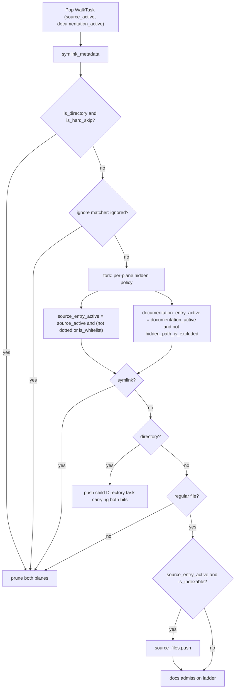
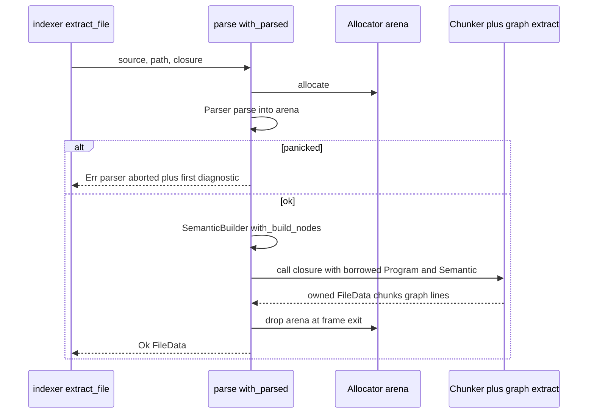

# Code ingestion: discovery, parsing, and chunking

Ingestion turns a checkout into a deterministic, bounded set of byte ranges with package identities attached. At `823b836` it starts in a place that would surprise anyone who read the code six months ago: `src/walk.rs` no longer walks. `walk::repository_inventory` (`src/walk.rs:169-188`) delegates the entire traversal to `crate::docs::corpus::scan_repository` (`src/docs/corpus.rs:164`), so the documentation module owns the single filesystem pass that yields the code file list. From that list the indexer runs a per-file pipeline — read, hash, role-classify, format-classify, short-circuit on unchanged, oxc parse, chunk, extract graph facts — while a parallel path builds the workspace alias table that lets the resolver map bare cross-package specifiers onto indexed source instead of `dist/`. This document covers the code plane end to end; the traversal itself, and everything Markdown-specific about it, is the subject of `03-documentation-corpus.md`.

## Discovery: one walk, two descent bits

The shared walker (`Scanner::walk_repository`, `src/docs/corpus.rs:331-520`) is a hand-rolled explicit-stack DFS, not an `ignore::WalkBuilder` iterator. `WalkBuilder` still exists in the file, but only long enough to have its `IncrementalIgnore` matcher popped out and driven by hand (`src/docs/corpus.rs:186-196`, matched at `:418`). The reason is that each stack task carries two independent descent booleans, `source_active` and `documentation_active` (`WalkTask`, `src/docs/corpus.rs:312-325`), and `WalkBuilder` offers one. A prune on one plane must not narrow the other; `filter_entry` cannot express that.

What matters for code ingestion is that the code plane's admission policy is byte-for-byte the pre-G24 one, reimplemented by hand rather than delegated. The scanner builds its matchers with `hidden(false)` (`src/docs/corpus.rs:188`) and then restores the old `hidden(true)` semantics — including the escape hatch where an ignore-file whitelist rule reopens a dot-prefixed entry — in a single expression:

```rust
let source_entry_active = source_active
    && (!relative.file_name().is_some_and(os_str_starts_with_dot)
        || ignored.is_whitelist());
```
(`src/docs/corpus.rs:436-440`)

Everything upstream of that line is shared by both planes. Order matters, because a gate that fires first suppresses later ones:

| Gate | Location | Applies to |
| --- | --- | --- |
| `symlink_metadata` | `src/docs/corpus.rs:385-404` | both; races skipped, retryable aborts, permanent recorded |
| hard skip: `.git` + `SKIP_DIRS` | `:410-416` via `is_hard_skip` `:715-722` | both, **directories only** |
| gitignore / global / exclude match | `:418-434` | both |
| hidden policy | `:436-440` (code) vs `:450-459` (docs) | per plane |
| symlink prune | `:442-448` | both |
| file-type check | `:471-480` | both |
| `walk::is_indexable` | `:482-484` | code only |

Two details in that table are easy to get wrong. The hard skip is guarded by `is_directory && is_hard_skip(&relative)`, so a *regular file* literally named `out` or `dist` is not hard-skipped; and `is_hard_skip` tests only the leaf `file_name`, unlike `walk::is_in_skipped_directory` (`src/walk.rs:88-101`), which scans every component. The two predicates agree in effect only because pruning the directory prevents descent in the first place — `is_in_skipped_directory` remains the one the watcher uses, precisely because the watcher sees paths without having walked to them.

`SKIP_DIRS` is `node_modules`, `dist`, `.next`, `coverage`, `out` (`src/walk.rs:12`). Code admission is a pure extension test against `EXTENSIONS = [js, jsx, ts, tsx, mjs, cjs, mts, cts]` (`src/walk.rs:9`, `is_indexable` at `:14-21`), applied to the absolute path.

The legacy `WalkBuilder`-driven `source_inventory` (`src/walk.rs:119-164`) is still compiled and still called — by `cmd_chunks` and `cmd_stats` (`src/commands/core.rs:489`, `:522`), which are read-only diagnostics — and it serves as a differential oracle: two tests assert the shared walker's file list equals the legacy one (`src/walk.rs:409`, `:458`). That parity is a fixture-level check, not a structural guarantee. The two walkers sort with different keys: `src/walk.rs:162` uses `files.sort()`, which is `Path`'s component-wise `Ord`, while `src/docs/corpus.rs:217-218` sorts by `as_os_str()` raw bytes. For sibling names where a `.` or `-` meets a `/` — `a.b/x.ts` versus `a/x.ts` — the two orders disagree. No fixture contains such a collision. The consequence would be insertion order and rowids, not correctness, but the invariant is weaker than the test suggests.

Documentation admission is entirely additive from the code plane's perspective, and disabling it costs nothing: `documentation_active` initializes to `!self.options.include.is_empty()` (`src/docs/corpus.rs:335`), and `DocsSettings::indexing_include` returns `&[]` when `[docs] enabled = false` (`src/config/model.rs:58-60`). The traversal collapses to exactly the old code walk, with no second code path that could drift. The cost of that encoding is that `include = []` with `enabled = true` is silently the same state, with no decision row explaining it. A worse coupling runs the other way: the include/exclude globsets are validated at scan time (`src/docs/corpus.rs:173`) and a malformed pattern aborts the whole repository inventory, code indexing included, rather than degrading to code-only.

The flowchart below is the per-entry ladder for one filesystem entry. Read it for where the single shared chain forks — everything above `HID` is common.



`PUSH` is the only place the two bits stay separate across recursion (`src/docs/corpus.rs:461-470`), which is what makes a docs prune unable to narrow the code plane. `CODE` and `DOCG` are both reachable for the same entry — a `.ts` file simply falls out of the docs ladder at the extension gate.

One more property worth stating because it does not hold uniformly across the file: the traversal's I/O policy (skip races, abort on retryable, record permanent) inverts in the capture phase. `acquire_candidates` (`src/docs/corpus.rs:542-607`) treats an inventory race as an abort (`:590-597`), an `O_NOFOLLOW` violation as an abort (`:577-584`), a type change to non-regular as a hard `bail!` (`:552-557`), and a permanent read error as a decision row rather than a rejection (`:598-603`). That phase only touches documents, but it runs inside the same call the code inventory returns from, so a documentation-side I/O fault can fail the code inventory too.

## The authored-`.d.ts` contract plane

`is_indexable` matches on extension alone, so `foo.d.ts` is an ordinary `ts` file and is indexed. The comment directly above it states the policy (`src/walk.rs:15-17`): authored declaration files are contract-plane evidence, and generated declarations are excluded *by location* — gitignore and `SKIP_DIRS` catch `dist/generated.d.ts` and `build/generated.d.ts`, while `packages/app/contracts.d.ts` is admitted (test at `src/walk.rs:242-280`).

The complementary half of the rule lives in resolution, not discovery. `entry_candidates` returns an empty candidate list for any manifest field ending `.d.ts`, `.d.mts`, or `.d.cts` (`src/workspace.rs:885-887`), unconditionally — the `allow_build_output` escape does not reopen it, unlike the `SKIP_DIRS` segment test on the line above (`:884`). So a package whose `types` or `exports.types` names declarations never gets a workspace alias pointing at them; declarations are searchable evidence but never a resolution target. Declaration files are also refresh boundaries for the watcher (`src/watch.rs:1402-1404`), since a changed `.d.ts` can alter resolution for files that did not change.

The residual gap: a generated `.d.ts` committed at a source path is indexed as production code. `file_role`'s `@generated` header markers are the only remaining defense, and generators do not reliably emit them.

## Parsing: one arena, one stack frame

`src/parse.rs` is 111 lines and makes exactly two decisions. `source_type_for` (`:9-20`) takes oxc's extension mapping and applies a single correction — every JavaScript source type gets `.with_jsx(true)`, because oxc 0.143 derives the non-JSX variant for `.js`/`.mjs`/`.cjs` and Babel-era trees routinely put JSX there. JSX grammar is additive in JavaScript, so nothing is lost; in TypeScript it is ambiguous with type assertions, so TS stays extension-strict and only `.tsx` is TSX. The assumption about oxc's behavior lives in a comment, not a compile-time check.

`with_parsed` (`:26-49`) is the arena ownership pattern every code extractor goes through. `Allocator`, `Program`, and `Semantic` all live in one stack frame; the caller supplies a closure and extracts owned data as its return value. `SemanticBuilder` runs with `with_build_nodes(true)` because reference classification walks node ancestors. A `panicked` parse returns the first diagnostic as the *outer* anyhow message (`:35-43`) — callers already add the file path as context, and anyhow's `Display` would otherwise collapse to a path with no diagnostic.



The load-bearing part is that `C` returns owned data *before* `A` is dropped. `extract_file` (`src/indexer.rs:841-852`) is the only caller shape that matters: it builds a `Chunker`, calls `chunk_program`, calls `graph::extract`, and returns a `FileData` of owned `String`s.

## Chunking: erasure, symbol alignment, and two budgets

`src/chunk.rs` projects the AST onto byte ranges in three stages, then splits (`chunk_program`, `:106-116`):

1. `units_for_statement` (`:119-177`) emits zero or more `Unit`s per top-level statement.
2. Each unit's span is extended backward over an immediately-preceding JSDoc (`with_leading_comment`, `:388`).
3. `merge_units` (`:404-457`) walks the unit list, merging only where allowed, and hands each finished unit to `unit_to_chunks` (`:460-491`).

**Erasure** is a match-arm list, and it is the "TypeScript is for humans" premise made concrete: types are not runtime behavior, so removing them at projection keeps interfaces from competing with implementations at query time. Erased at `:122-128`: `TSInterfaceDeclaration`, `TSTypeAliasDeclaration`, `TSImportEqualsDeclaration`, `TSModuleDeclaration` when `declare`, type-only `ImportDeclaration`, type-only `ExportNamedDeclaration`. The same set is repeated inside the `ExportDeclaration` unwrap (`:158-165`), and `units_for_function` bails on `f.declare` (`:205-207`).

Because erasure is per-variant, it has holes that oxc's AST evolution opened:

| Construct | Why it survives |
| --- | --- |
| `declare global { … }` | a distinct `TSGlobalDeclaration` variant, not `TSModuleDeclaration`; falls to the `_ => misc_unit` arm (`src/chunk.rs:175`) |
| `export type { X } from './y'` | `ExportFromDeclaration`, which carries its own `export_kind`; the check at `:127` is on `ExportNamedDeclaration` |
| `declare class Foo {}` | `units_for_class` (`:273`) never inspects `declare` |
| `export declare const x: T` | `units_for_var` (`:318`) never inspects `declare` |

Net effect: a `.d.ts` of pure interfaces yields zero chunks; one of `declare const`/`declare class` yields ordinary chunks.

**Merging is deliberately anti-density.** The predicate at `:428-433` requires `!a.atomic && !u.atomic && same_scope`, and then either `both_imports` — adjacent import statements, with *no* size bound — or `both_anonymous`, two unnamed `Module` statements, gated on `est_tokens(a) + est_tokens(u) <= TARGET_TOKENS`. Named declarations never merge with anything. The comment at `:420-423` gives the reason: a chunk whose name is the symbol the query asks about ranks and reads better than a denser chunk holding several unrelated declarations. The price is chunk count — more embedding calls, more FTS rows, and a file of many small exported functions produces one chunk each.

**Two budgets, both in estimated tokens defined as bytes/4** (`src/chunk.rs:8-10`): `TARGET_TOKENS = 1200` and `MAX_TOKENS = 2000`. They do different jobs. `MAX_TOKENS` is the oversize threshold — `units_for_function` (`:212`), `units_for_class` (`:275`), and `units_for_var` (`:339`) split structurally above it, and `unit_to_chunks` (`:462`) falls back to line splitting above it. `TARGET_TOKENS` is the anonymous-merge ceiling and, times four, the line-split byte budget (`:494`).

Structural splitting comes first because a byte-budget cut through the middle of a method loses both the signature and any coherent unit. An oversized function becomes a header unit (function start to first body statement) plus one unit per body statement (`:229-260`); an oversized class becomes a `ClassHeader` plus one `Method` unit per member (`:286-315`). Header units are marked `atomic` so `merge_units` cannot glue them back. Only a still-oversized leaf reaches `split_by_lines` (`:493-522`), which twice re-aligns to `is_char_boundary` before and after searching backward for a newline — the raw byte budget can otherwise land mid-codepoint. A test asserts the concatenated splits equal the source with its trailing newline stripped (`:608-636`).

The identity of a chunk is `blake3` of its exact content slice (`:485`). Only line-split products get `<name>#part{n}` names (`:470-474`); structural split products carry the enclosing name in `scope_chain` instead, which means exact-name search cannot reach an oversized function's body statements directly.

## Role and origin

`file_role::classify` (`src/file_role.rs:16-84`) reads path components plus a 4 KiB lowercased header prefix, trimmed to a char boundary (`:23-26`), and returns the first match in a fixed order: `generated` → `fixture` → `test` → `documentation` → `production`. Precedence is by rule order, not by position in the path, so `packages/api/tests/generated/run.test.ts` classifies as `generated` (asserted at `:170-173`). The header scan only sees the first 4096 bytes, so an `@generated` banner after a long license block is missed.

| Role | Penalty (`src/file_role.rs:95-105`) |
| --- | --- |
| production (and unset) | 1.0 |
| unknown | 0.75 |
| documentation | 0.4 |
| test | 0.3 |
| fixture | 0.2 |
| generated | 0.1 |

The one carefully-reasoned exclusion is singular `doc/`, which is *not* a documentation marker while `docs`, `documentation`, `.storybook`, and `stories` are (`:66-76`). Document-domain production code — editor cores, sync layers — routinely names a directory `doc/`, and marking it documentation would apply a 0.4 penalty to real implementation (test at `:176-204`). The comment concedes these directory names are coarse bootstrap signals awaiting evidence-backed reconnaissance.

`src/origin.rs` is 35 lines of allowlist validation. Its only substantive content is that `ALL = [repository, workspace, dependency]` but `DEFAULT = [repository, workspace]` (`:3-4`) — dependency code is opt-in for retrieval, not merely opt-in for indexing.

## Workspace aliases and their provenance

`WorkspaceMap::discover_with_fs(&root, &inventory.files, operation.fs)` (`src/indexer.rs:400-401`) runs on the code file list only. It expands `pnpm-workspace.yaml` globs — via a hand parser handling block-sequence and inline-array forms only (`src/workspace.rs:278-313`), which silently yields nothing for anchors or nested keys — or `package.json` `workspaces`, then builds an alias per member.

Its distinguishing feature is provenance. Every alias records `Origin::Manifest` or `Origin::Inferred` (`src/workspace.rs:24-32`), and `classify` (`:199-210`) turns that into a three-valued label — `resolver` when the workspace machinery was not involved, `workspace` for an exact manifest-backed specifier, `workspace-inferred` for a heuristic mapping — stamped on `module_edges` rows. That labeling is applied only on the branch where the resolved path is found in the index (`src/indexer.rs:1704-1710`); a resolution to a real but un-indexable file writes `"unresolved"` (`:1715`) and an external package writes no resolution plus a package name (`:1717-1725`). The resolver used also branches: dependency-origin importers go through `dependency_resolver.resolve_file` with no fallback, while repository importers get `resolver … .or_else(no_tsconfig)` (`:1694-1699`).

Entry selection (`preferred_package_entry`, `src/workspace.rs:671-706`) is a five-pass ladder whose order is load-bearing and documented only in prose (`:666-670`): manifest fields against *indexed* sources → manifest fields on disk excluding build output → inferred fields against indexed sources → inferred fields on disk → manifest fields on disk *allowing* build output. The reason is blunt: `main`/`module`/`exports` usually name `dist/…`, which is gitignored and pruned by `SKIP_DIRS`, so honoring them naively produces aliases to files that have no chunks. Note that "build output last" holds for package entries; for subpath exports, `allow_build_output = true` is a *middle* pass (`:949`), followed by dist-mirror tails (`:953-963`) and a unique-source search (`:964-967`) that still prefer source.

Export-condition selection is shared, not duplicated: `RESOLVE_CONDITIONS = [import, require, node, default]` in `src/package_exports.rs:6`, with first-active-condition-commits semantics and no backtracking, used by the resolver options, workspace subpath aliasing, and dependency runtime-target collection alike.

The heuristic tails are quiet when they fail. Unique-source searches are depth-bounded (`src/workspace.rs:808`, `:1099`, `:1165`) and require exactly one match; a deeply nested or ambiguously named subpath export gets no alias and no reported failure.

## Dependency scoping

`src/dependency.rs` opens with the rule (`:1-5`): `node_modules` is never enumerated. Discovery takes exact package selectors, pulls importer/request pairs out of the index, resolves each from the importer's real location, and walks *up* from the resolution to the first manifest whose `name` matches (`owning_package_root`, `:623-652`). Canonical roots, not the path used to reach them, establish ownership, so a pnpm symlink into `node_modules` and the workspace directory are one package.

Two G24-era changes land here. `importer_requests` (`src/dependency.rs:602-621`) now reads `FROM code_files` (`:605`) rather than `files`, so a Markdown row's `imports` facts cannot seed dependency discovery — the view keeps the corpus boundary in one schema object instead of scattering `WHERE corpus='code'` predicates, and a test pins it (`:901-923`). The same query also filters `f.origin IN ('repository','workspace')` (`:611`), so dependency-origin code cannot seed further discovery either. And `synchronize_instances` swapped `BEGIN`/`COMMIT` for `SAVEPOINT jscout_dependency_instances` (`:171`, `:260-267`) so it nests inside the indexer's single `BEGIN IMMEDIATE` publication transaction (`src/indexer.rs:440`) instead of committing on its own. The tradeoff is that rollback is now to a savepoint: on error when nested, the enclosing transaction's earlier work survives, so the function no longer promises an unchanged database.

File planning picks a basis in tiers — manifest-source, then runtime targets, then `package-root` (`src/dependency.rs:426-430`) — and the last tier means the whole package tree becomes candidates and the byte budget, rather than the manifest, decides what gets indexed. Candidates are sorted and deduped (`:333-334`) and then *re-sorted* forced-entries-first (`:338-348`), so a lexically late boundary entry cannot disappear behind unrelated package files under a truncating limit. Deterministic, but not lexicographic. `collect_indexable_files` (`:544-577`) recurses without a depth bound, skipping only dot-directories and `node_modules`; `should_skip_minified` (`:301-315`) is a heuristic — filename contains `.min.` or a first line over 4000 bytes followed by four lines over 1000 — that forced entries bypass entirely.

## Where the code plane stops short

- **A Markdown-only edit produces no watch generation.** `EventClassifier::classify` signals source dirt only for `walk::is_indexable` paths, so `docs_include`/`docs_exclude` reach the index only when some code change triggers a generation. The classifier ladder and the three indirect routes that do reindex documentation are in `16-incremental-and-watch.md`.
- **The parity oracle is fixture-level.** Two assertions (`src/walk.rs:409`, `:458`) compare against the legacy walker, over fixtures that happen not to contain the sort-key collision described above. The duplicated policy surface is permanent maintenance cost for that check.
- **The unchanged short-circuit compares three things** — hash, corpus, and format (`src/indexer.rs:518-521`) — which is enough for the code plane. Documents additionally lose the short-circuit wholesale when the doc chunk format version moves (`:443`, `:569`); code has no equivalent per-corpus flag and relies on an extraction-reset heuristic (`:476-490`).
- **`max_file_bytes` has no config surface.** It defaults to 4 MiB (`src/docs/corpus.rs:17`) and `IndexOptions` constructs `CorpusOptions` with `..CorpusOptions::default()` (`src/indexer.rs:390`), so include and exclude are configurable but the size cap is not.
