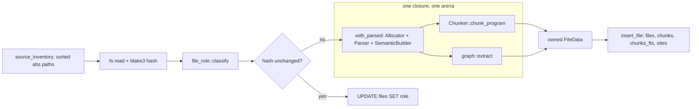
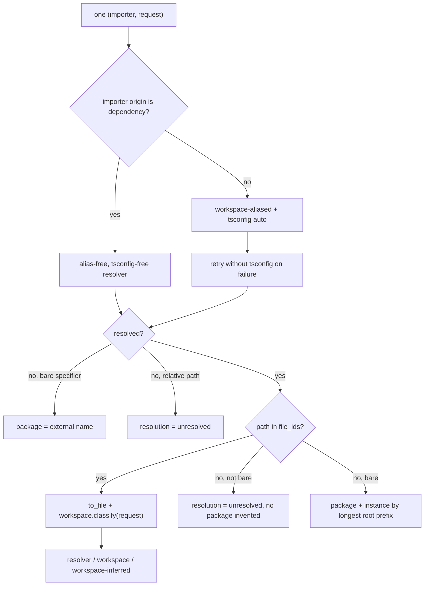
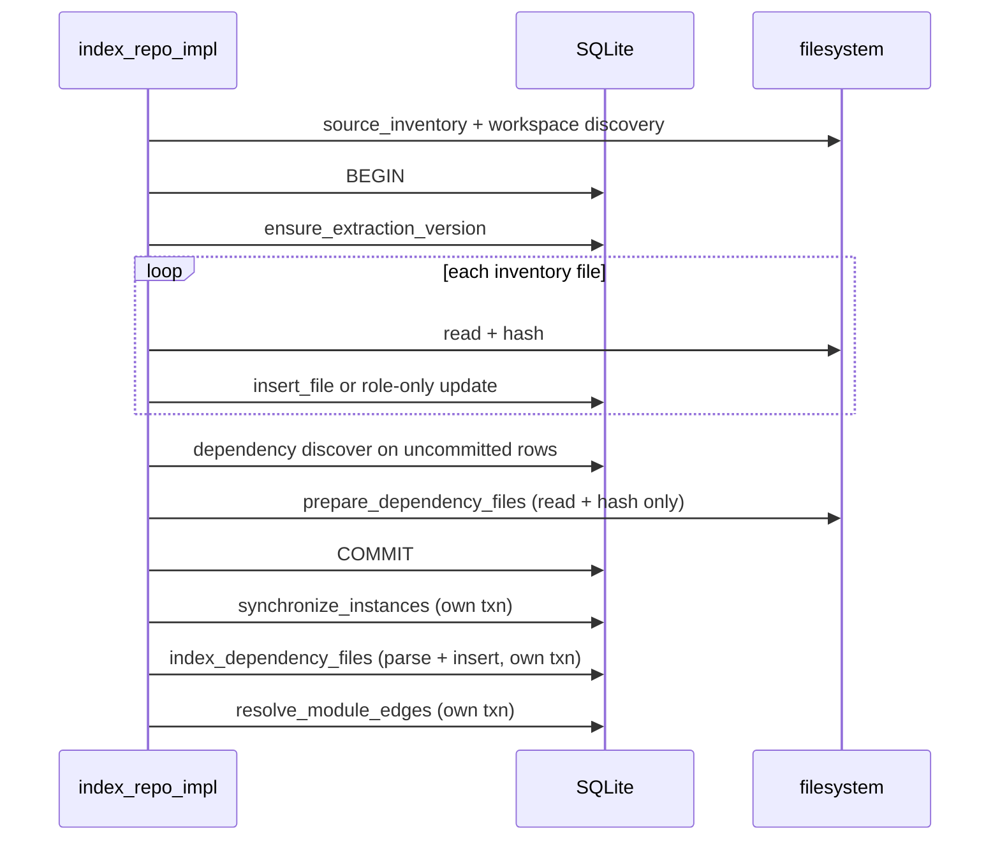

# Ingestion: discovery, parsing, chunking, and resolution

Ingestion turns a checkout on disk into rows in `files`, `chunks`, and `module_edges`. An ignore-aware inventory produces a sorted list of absolute paths; each path is read, hashed with blake3, labelled with a path-and-header-derived role, and — if its hash moved — handed to a single arena-scoped oxc parse whose AST is cut into symbol-aligned chunks and walked for graph facts in the same closure. A manifest-driven workspace alias table, built from the inventory before any write, gives `oxc_resolver` in-repo targets so cross-package imports land on indexed source rather than on `dist/`; an explicitly selected dependency corpus, discovered by resolving real importer requests instead of walking `node_modules`, adds third-party files under a separate origin. Everything from the first read to the last dependency `stat` happens inside one transaction, so a transient filesystem failure rolls back to the previously published snapshot instead of committing a random subset.

## Stage order, and why it is load-bearing

`index_repo_impl` (`src/indexer.rs:308`) canonicalizes the root, runs `walk::source_inventory` (`src/indexer.rs:318`), then hands the resulting file list straight to `WorkspaceMap::discover_with_fs` (`src/indexer.rs:319-321`). That ordering is a data dependency, not a convenience: alias-target preference is defined in terms of *indexed* sources, so workspace discovery cannot run before it knows what the inventory contains. The symmetric dependency sits at the other end — `dependency::discover` (`src/indexer.rs:489-490`) queries the `imports`/`exports`/`refs` rows the per-file loop wrote moments earlier and has not yet committed, because resolver-driven discovery exists to find the exact installed instance a real importer reaches. Both rejection lists are folded into `IndexOutcome` before any write (`src/indexer.rs:339-352`).

The following diagram traces one repository file from the inventory to its chunk rows. Watch for the fast path that skips parsing entirely, and for the boundary box around the arena.

`UPD` is the dominant path on an incremental run: an unchanged hash updates only `role` and continues (`src/indexer.rs:428-437`), never touching the parser. `SCOPE` is the only place AST nodes exist — `CHUNK` and `GRAPH` both run inside it, and only `FD` crosses back out.

## Discovery and filtering

`source_walk_builder` (`src/walk.rs:82`) configures `ignore::WalkBuilder` with `hidden(true)`, `git_ignore`, `git_global`, and `git_exclude` all on, plus one `filter_entry` closure delegating to `is_in_skipped_directory` (`src/walk.rs:70`). That function strips the repository root prefix and tests every remaining component against `SKIP_DIRS` = `node_modules`, `dist`, `.next`, `coverage`, `out` (`src/walk.rs:11`). Testing the *root-relative* path is what lets a repository whose own root directory is named `dist` still index — `strip_prefix` leaves no components to match. `build` is deliberately absent from the list, because `src/build/` is an authored directory in real repositories and `.gitignore` already excludes genuine build output; the test at `src/walk.rs:197` pins both halves.

`is_indexable` (`src/walk.rs:13`) is a pure extension test against `EXTENSIONS` = `js jsx ts tsx mjs cjs mts cts` (`src/walk.rs:8`). This is the whole of the authored-`.d.ts` contract-plane policy: `foo.d.ts` has extension `ts`, so it is admitted, and the comment at `src/walk.rs:14-16` states the reasoning — declaration files carry the type-level contract a repository exposes, and generated declarations must be excluded *structurally* (skipped directories, origin policy) rather than by suffix, because a suffix rule discards the authored ones too. The test matrix at `src/walk.rs:197-234` covers all three cases: `packages/app/contracts.d.ts` in, `build/generated.d.ts` out via gitignore, `packages/app/dist/generated.d.ts` out via `SKIP_DIRS`.

The counterpart to that admission lives in resolution, not discovery. `entry_candidates` (`src/workspace.rs:881`) returns an empty candidate list for any manifest field ending in `.d.ts`, `.d.mts`, or `.d.cts` (`src/workspace.rs:883-887`), so a package whose `main` or `types` points at a declaration file never gets that file as an alias target. Declarations are corpus members and never resolution destinations — the tradeoff is that they occupy `files` rows while contributing few or no chunks, so file counts and chunk counts diverge.

`source_inventory` (`src/walk.rs:98`) classifies every filesystem failure three ways rather than flattening them into one error type. Inventory races (`NotFound`, `IsADirectory`, `NotADirectory`, via `only_inventory_races` at `src/walk.rs:163`) vanish silently; retryable failures and any failure at depth 0 abort the whole inventory with context (`src/walk.rs:106-111`, `:119-123`); everything else becomes a `WalkRejection { path, stage, error }` where `stage` distinguishes `"walk"` from `"ignore"` (`src/walk.rs:112-118`, `:124-135`). The premise is that a resource failure can affect an arbitrary, unknowable slice of the corpus, so publishing a clean-but-random subset is worse than failing outright — while one `chmod 000` subtree is local and must not wedge the repository (`src/walk.rs:248`). The cost is that every downstream filesystem call site becomes a three-arm match, and `src/workspace.rs` carries a full parallel `classified_*` copy of each traversal helper (compare `unique_source_match` at `src/workspace.rs:1082` with `classified_unique_source_match` at `:1143`).

`SourcePathPolicy` (`src/walk.rs:38`) re-exposes the same `WalkBuilder` configuration to the watcher as a standalone `IncrementalIgnore` matcher; `is_ignored` (`src/walk.rs:58`) answers "not ignored" whenever the matcher itself errors, so the watcher schedules a refresh whose inventory pass classifies the failure properly. That matcher does *not* apply `SKIP_DIRS` — those live in `filter_entry`, not in the ignore rules — so the watcher pairs it with `walk::is_in_skipped_directory` (`src/watch.rs:498`, `:519`). `source_files` (`src/walk.rs:148`) discards rejections and exists only for read-only diagnostics.

## Parsing: one arena, one pass

`with_parsed` (`src/parse.rs:26`) is a scoped borrow around oxc's arena allocator. It puts `Allocator::default()` on its own stack frame, runs `Parser::new(&allocator, source, source_type).parse()`, builds semantics with `SemanticBuilder::new().with_build_nodes(true).build(&ret.program)` (`src/parse.rs:44-46`), and hands the caller only `(&ParserReturn, &Semantic)` inside an `FnOnce` that must return an owned `T`. Lifetimes rather than convention guarantee that no AST node outlives the parse; the price is that all per-file analysis must be squeezed into one pass, and adding an extractor means editing `extract_file` (`src/indexer.rs:663`) rather than adding an independent pass. `extract_file` does exactly the two things: `Chunker::chunk_program` and `graph::extract`, back to back, returning `FileData { chunks, graph, lines }`.

Only `ret.panicked` rejects a file (`src/parse.rs:34`). Recoverable diagnostics still index, which keeps a mid-refactor repository searchable. The first diagnostic is lifted into the *outer* anyhow message (`src/parse.rs:38-43`) because callers already attach the path, and an anyhow context chain's `Display` would otherwise collapse to path-only.

`source_type_for` (`src/parse.rs:9`) opts every `is_javascript()` source type into `.with_jsx(true)` while leaving TypeScript extension-strict (`src/parse.rs:16`). JSX's grammar is additive over JS, so `left < middle && middle > right` still parses in a `.js` file (test at `src/parse.rs:73`); `.ts` cannot get the same treatment because `<T>expr` type assertions and JSX elements are genuinely ambiguous. A `.ts` file that contains JSX therefore fails to parse and is recorded as an `extract` rejection.

## Chunking and type erasure

Sizing is estimated as `bytes / 4` (`src/chunk.rs:64`) against `TARGET_TOKENS = 1200` and `MAX_TOKENS = 2000` (`src/chunk.rs:9-10`). `chunk_program` (`src/chunk.rs:106`) lowers each top-level statement into zero or more `Unit`s, extends every unit's span backward over an adjacent leading comment (`src/chunk.rs:113`), then merges and materializes.

`units_for_statement` (`src/chunk.rs:119`) is where erasure happens. Interfaces, type aliases, `import =` declarations, `declare` module/namespace declarations, type-kind imports and type-kind named exports emit no unit at all (`src/chunk.rs:121-127`), and the same arms are repeated inside the `export <decl>` unwrap (`:159-164`). `units_for_function` returns early on `f.declare` (`src/chunk.rs:205-207`). The erasure is **asymmetric**, and this matters: `units_for_class` (`src/chunk.rs:273`) and `units_for_var` (`src/chunk.rs:318`) have no `declare` check, so `declare class Widget {}`, `export declare const version: string`, and `declare enum E {}` all still produce chunks. The common claim that a `.d.ts` yields zero chunks holds for the interface/type-alias/`declare function` shapes that dominate hand-written declaration files, but not universally — an ambient file built from `declare class` and `declare const` produces named `Class` and `Module` chunks. The colocated erasure test (`src/chunk.rs:549`) covers only the erased forms and does not exercise those two.

`merge_units` (`src/chunk.rs:404`) merges only non-atomic same-scope pairs that are both `Imports`, or both anonymous `Module` units whose combined estimate stays under `TARGET_TOKENS` (`src/chunk.rs:429-434`). Named declarations always stand alone: a chunk that *is* `getUser` retrieves better than a chunk that merely contains it. The cost is that a barrel file of one-line re-exports pays one chunk and one embedding per export. Merging is a span union `min..max` (`src/chunk.rs:436-437`), not text concatenation, so byte offsets stay usable for site attribution — and, as a direct consequence, type declarations erased at the unit level reappear verbatim inside a merged chunk's text. Erasure is a guarantee about chunk boundaries and chunk names, not about bytes.

Oversized declarations split structurally before falling back to line splitting. An oversized function emits a header unit spanning from the declaration start to the first body statement (`src/chunk.rs:244`) marked `atomic: true` (`:249`), followed by one unit per body statement — and those body units are `atomic: false` (`src/chunk.rs:258`), deliberately mergeable, so `merge_units` packs them back up to `TARGET_TOKENS`. A 200-statement oversized function does not become 200 chunks; it becomes a header plus a handful of merged `Module` chunks. (The code comment at `src/chunk.rs:223-224` says "split body statements into atomic parts", which contradicts the code it introduces.) Oversized classes take the same shape with a `ClassHeader` plus one `Method` unit per member (`src/chunk.rs:293-317`), as do oversized single-declarator arrow functions (`src/chunk.rs:356-371`). Whatever still exceeds `MAX_TOKENS` after that is line-split by `split_by_lines` (`src/chunk.rs:493`) with UTF-8-boundary clamping and newline backoff; parts get a `#partN` name suffix (`src/chunk.rs:471`) and `symbols` is populated only when `i == 0` (`src/chunk.rs:480`).

Two consequences follow. The header/body split means adjacent chunks *can* overlap: the header span runs to the first member's start, and `with_leading_comment` (`src/chunk.rs:388`) then extends the following member's span backward over a comment sitting inside the header span, so the two share bytes and offset-containment attribution is ambiguous there. And `with_leading_comment` attaches any comment kind, not only JSDoc, scans in reverse and `break`s at the first comment ending before the node, and requires the gap to be whitespace with at most one newline (`src/chunk.rs:392-400`) — a doc comment separated from its declaration by a second comment is not attached.

A `Chunk` (`src/chunk.rs:25`) is identified by byte offsets into the exact source that was hashed plus a blake3 hash of its own content; offsets rather than line ranges are the join key for attributing extracted sites. Every chunk also carries `file_imports`, the file's sorted `requested_modules` keys copied verbatim (`src/chunk.rs:89-100`), so an embedding sees dependency context the chunk text itself may lack.

## Role and origin: two axes on one row

`file_role::classify` (`src/file_role.rs:16`) lowercases the path, splits it into components, lowercases the first 4 KiB of source with a char-boundary clamp (`src/file_role.rs:24-28`), and applies a fixed precedence: generated > fixture > test > documentation > production. Singular `doc` is deliberately excluded from the documentation markers (`src/file_role.rs:70-76`) because document-domain production code commonly uses that directory name; there is a dedicated test for it (`src/file_role.rs:164`). Roles carry a retrieval penalty consumed by structural ranking — production 1.0, unknown 0.75, documentation 0.4, test 0.3, fixture 0.2, generated 0.1 (`src/file_role.rs:92-102`, used at `src/structural.rs:3364`). `classify` never returns `"unknown"`, yet `"unknown"` is in `ALL` (`src/file_role.rs:11`), in `DEFAULT_EXPANSION` (`:14`), and is the `files.role` column default (`src/store.rs:285`); rows can only acquire that role from a default-valued insert, so the default expansion list carries a slot the classifier cannot fill.

Origin is a three-value vocabulary — `repository`, `workspace`, `dependency` — whose default allowlist omits `dependency` (`src/origin.rs:3-4`). Third-party source is therefore indexed but invisible to default queries unless opted into; `validate_all` (`src/origin.rs:11`) rejects an empty allowlist and is called at every query entry point, including search (`src/search.rs:1605-1606`), MCP (`src/mcp.rs:1206`), and config load (`src/config/load.rs:396`, `:588`). Both axes land on the same `files` row (`src/store.rs:281-291`) so filtering by role and origin needs no join, and `package_path` is what lets a dependency file's physical location be reconstructed from its instance root during edge resolution.

## Workspace resolution

`WorkspaceMap::discover_with_fs` (`src/workspace.rs:76`) reads globs from `pnpm-workspace.yaml` through a hand-rolled parser (`src/workspace.rs:278`) or from `package.json` `workspaces`, expands them with its own `**`/`*` matcher (`src/workspace.rs:480`, `:553`, `:570`), and for each member with a usable `name` emits aliases in `add_indexed_package` (`src/workspace.rs:155`): one `name/dist/*` wildcard and one bare `name` alias carrying up to three ordered values — the preferred manifest entry, `<dir>/src`, `<dir>` (`src/workspace.rs:184-185`) — plus one `$`-suffixed exact alias per declared non-wildcard subpath export and one wildcard alias per `"./*"` export (`src/workspace.rs:226-276`, `:996`). The list is sorted descending by key and deduped (`src/workspace.rs:139-140`), which both guarantees unique keys and makes specific keys precede general ones for the resolver.

Provenance is the point of the structure. `Origin::Manifest` versus `Origin::Inferred` (`src/workspace.rs:29-32`) is recorded per specifier string in `manifest_specifiers`, and `classify` (`src/workspace.rs:202`) turns that into the `module_edges.resolution` value `resolver` / `workspace` / `workspace-inferred` written at `src/indexer.rs:1309`. Monorepo aliasing is unavoidably heuristic — dist-mirroring, unique-name search, `src/` conventions — so consumers need to know which edges rest on one. The weakness is that provenance keys on the *specifier*, not the resolution: the bare-name alias holds up to three values, and if the manifest entry fails and the resolver falls through to `<dir>/src`, the edge is still stamped `workspace`.

`preferred_package_entry` (`src/workspace.rs:671`) runs a five-rung ladder: indexed manifest target, on-disk manifest target, indexed inferred target, on-disk inferred target, and finally a manifest target allowing build output. An alias pointing into `dist/` resolves to a file the walker will never index, so the edge dead-ends; keeping build output as the last rung still gives a genuinely source-less package a target. The cost is five sequential passes over the same field lists, and a package's entry can change between runs purely because a source file entered or left the inventory. `preferred_subpath_source` (`src/workspace.rs:923`) adds dist-mirroring (`dist[/flavor]/x.js` → `src/x.ts` or `x.ts`, via `mirror_tails` at `:973`, flavors at `:915`) and a unique-name search under `src/` bounded to five relative components in the indexed variant (`src/workspace.rs:805`) and four levels of recursion in the filesystem ones (`:1082`, `:1143`).

## Dependency scoping

`dependency::discover` (`src/dependency.rs:76`) never walks `node_modules`. It normalizes selectors to exact package names, scoped or unscoped, rejecting subpaths (`src/dependency.rs:575`); bails on Yarn PnP without a `node_modules` directory (`:83-89`); short-circuits to the workspace instance when the name is first-party (`:96-100`); and otherwise resolves the real `(importer, request)` pairs drawn from `imports`/`exports.from_request`/`refs.target_request` restricted to `origin IN ('repository','workspace')` (`importer_requests`, `src/dependency.rs:598-609`), walking upward from each resolution to the manifest whose `name` matches (`owning_package_root`, `:619`). Two boundaries follow from that seed query: transitive packages are never discovered, and — because `contract_imports`/`contract_exports` are absent from the union, unlike the one in `resolve_module_edges` — a package imported solely for its types is never found. A selected-but-unimported package is reached only through a single logical `node_modules/<name>` probe (`src/dependency.rs:120-128`).

`plan_package` (`src/dependency.rs:313`) picks analysis roots by basis in `analysis_roots` (`:387`): `manifest-source` when a `source` field or `source` export condition names an existing path, else `runtime` from `exports` targets plus `module`/`main`, else `package-root`. `roots_for_targets` (`:511`) expands each target's first path component to a whole directory, on the premise that a package entry alone is useless and its sibling modules are what agents need. Forced entries — the manifest-named boundary files — sort to the front of the byte budget (`src/dependency.rs:334-346`) so a lexically late entry cannot vanish behind unrelated files, and they bypass `should_skip_minified` (`:297`), which drops `.min.` names and bundles whose first line exceeds 4,000 bytes with four following lines each over 1,000. `DependencyLimits` defaults to 10,000 files / 100 MB / 2 MB per file (`src/dependency.rs:22-24`), and `status` reports `complete` or `truncated` rather than hiding the cut.

`synchronize_instances` (`src/dependency.rs:163`) resets every non-dependency file to `origin='repository'` with a null instance, upserts workspace and planned dependency instances, deletes undesired instances by routing their files through `store::delete_file` first — FTS5 does not participate in SQLite foreign-key cascades (`src/dependency.rs:207-219`) — then re-tags files by canonical-root prefix, shallow roots first, so a nested declared package owns its own subtree (`src/dependency.rs:225-253`). Workspace membership can change between runs in ways an incremental diff cannot observe (a manifest deleted, a glob narrowed), so the full re-tag is O(files) SQL and always correct, at the cost of two full-table updates per index even when nothing changed.

## Landing the edges

`resolve_module_edges` (`src/indexer.rs:1173`) rebuilds `module_edges` from scratch, unioning runtime requests (`imports`, `exports.from_request`, `refs.target_request`) with type-only ones (`contract_imports`, `contract_exports`) and grouping by `(file_id, request)` so an edge is `type_only` only when no runtime use exists (`src/indexer.rs:1244-1263`). Three resolvers coexist: workspace-aliased with `TsconfigDiscovery::Auto`, workspace-aliased without tsconfig as a fallback for broken `extends` chains, and — for dependency importers — one built with `resolver_options(Vec::new(), None)`, both alias-free *and* tsconfig-free, so a third-party package's own imports can never be redirected into a same-named first-party package (`src/indexer.rs:1178-1190`). All three share `resolver_options` (`src/indexer.rs:116`): TS-first extensions, `extension_alias` mapping `.js → [.ts, .tsx, .js, .jsx]` plus `.mjs`/`.cjs` equivalents, `condition_names` from `package_exports::RESOLVE_CONDITIONS`, `main_fields = [module, main]`.

The diagram below is the decision tree for one `(importer, request)` pair. Watch for the two distinct ways a request ends up with no `to_file`.

`CLS` is the only branch that produces provenance; `RES` names its three possible values. `UNR2` and `UNR1` are different failures wearing the same label — the first is a real file that jscout cannot index (CSS, assets, JSON), kept as evidence without inventing a package name; the second is a relative import that resolved to nothing. `PINST` matches the resolved path against dependency package roots sorted by descending component count (`src/indexer.rs:1242`, `:1321-1324`), so a nested duplicate install wins over its parent.

## Where the risk actually ends

Source extraction and every selected-dependency *read and hash* happen inside the phase-1 transaction (`src/indexer.rs:357-511`), so a retryable read failure there rolls back and leaves the previous snapshot untouched. That protection stops at `COMMIT`, though: `prepare_dependency_files` (`src/indexer.rs:1015`) only reads and hashes, and dependency files are parsed and inserted afterwards by `index_dependency_files` (`src/indexer.rs:1071`, calling `extract_file` at `:1123`), as are `synchronize_instances`, `materialize_cached_embeddings`, and `resolve_module_edges` (`src/indexer.rs:513-519`). A failure in any of those leaves a committed snapshot with missing dependency files and an empty or partial `module_edges`.

Between `BEGIN` and the file loop sits `ensure_extraction_version` (`src/indexer.rs:634`), which is more than a version stamp: on a mismatch it blanks every stored file hash and drops the disposable graph and its publication keys inside the caller's transaction ([03-structural-extraction.md](03-structural-extraction.md) has the full account). Those empty hashes are exactly what the reset heuristic then counts: if at least half the stored hashes are empty *and* `allow_extraction_reset` is on, the disposable plane is truncated once via `store::reset_extraction_state` and everything reinserted as if fresh (`src/indexer.rs:388-402`). `IndexMode::FullRefresh` takes a different branch, calling `store::reset_snapshot_state`, which additionally deletes `package_instances` and the `root`/`resolution_hash` meta keys (`src/store.rs:1091-1098`); it has already replaced `existing` with an empty map at `src/indexer.rs:376-380`, so the half-empty test is dead on that path rather than an alternative trigger.

After edge resolution the run writes the `root` meta key, computes a resolution hash and a snapshot (`src/indexer.rs:520-526`), applies the checker retention policy, and compares a `ProjectionIdentity` of `(snapshot, projection_version, resolution_hash)` read before the writes (`src/indexer.rs:475-483`, defined at `:593`). On equality it republishes the three meta keys and skips the projection rebuild (`outcome.projection_rebuilt = false`); otherwise `rebuild_projection_with_timing` runs.

## What `insert_file` writes beyond chunks

Two of `insert_file`'s outputs are easy to miss because neither is a chunk. It persists the bounded value-flow fact set — `receiver_value_flows`, `function_return_flows`, `value_binding_flows`, `class_value_flows`, `instance_method_value_flows`, and `class_member_value_flow_blockers` (`src/indexer.rs:862-957`) — fed from `FileGraph` fields populated during the same single parse (`src/graph.rs:64-67`, `:177-181`), so `extract_file` emits four more owned fact vectors than the chunk path alone needs. What those facts mean and how they resolve is [04-value-flow.md](04-value-flow.md).

And `fts_content` (`src/indexer.rs:676-685`) replaces embedded NULs with spaces before chunk text reaches `chunks_fts`, because FTS5 indexes past a NUL while `highlight()` can drop the bytes between that NUL and a later match. The substitution is byte-length-preserving, so line offsets are untouched — which is what lets exhaustive search convert highlight positions to absolute file lines ([08-retrieval.md](08-retrieval.md)). The FTS mirror is therefore no longer verbatim chunk content.

## Sharp edges in this path

| Edge | Where | Effect |
| --- | --- | --- |
| `declare class` / `declare const` are not erased | `src/chunk.rs:273`, `:318` | ambient files can produce named chunks; the erasure test does not cover them |
| Header and first-member spans can overlap | `src/chunk.rs:244`, `:388` | offset-containment site attribution is ambiguous for the shared bytes |
| Split body units are mergeable, not atomic | `src/chunk.rs:258` vs. comment at `:223` | the comment describes behavior the code does not have |
| Single line over the byte budget | `src/chunk.rs:493-521` | no newline to back up to, so the span stays over budget |
| `has_file_marker` is a whole-name substring test | `src/file_role.rs:135` | `manifest.test.helpers.ts` classifies as `test` |
| Alias dedup keeps the first entry after a descending sort | `src/workspace.rs:139-140` | two packages declaring the same `name` collapse; the survivor depends on discovery order |
| `package_entry_paths` swallows discovery failure | `src/workspace.rs:711-718` | an overview over a broken checkout silently reports only the root entry |
| `pnpm_workspace_globs` is a YAML subset | `src/workspace.rs:278` | anchors, multi-line scalars, or a nested `packages:` are mis-parsed rather than reported |
| Forced-entry comparator reallocates per comparison | `src/dependency.rs:334-346` | O(n log n) string allocations over a list bounded at 10,000 files |
| `should_skip_minified` inspects five lines | `src/dependency.rs:297` | a bundle behind a banner comment escapes; a long single-line data file is dropped |
| `discover` tests the cross-selector accumulator | `src/dependency.rs:120`, `:129` | the "not installed" error and the root probe both depend on state from earlier selectors |
| `SKIP_DIRS` is consulted from eight sites | `src/walk.rs:78`, `src/watch.rs:498`, `src/workspace.rs:544`, `:884`, `:980`, `:1044`, `:1120`, `:1193` | changing the list has non-obvious blast radius; an authored directory named `out` or `dist` is invisible regardless of gitignore |

## Testing

Tests are colocated: `src/walk.rs:189` (three, including the `.d.ts` admission matrix at `:197` and a `#[cfg(unix)]` `chmod 000` subtree case at `:248`), `src/parse.rs:51` (three, on the JSX-in-`.js` grammar, the extension-strict TypeScript rule, and the diagnostic error shape), `src/chunk.rs:535` (five: erasure, arrow-component naming, oversized-class splitting, multibyte-safe line splitting with a round-trip assertion, comment attachment), `src/file_role.rs:139` (two, one on the singular-`doc` carve-out), `src/origin.rs:25` and `src/package_exports.rs:31` (one each), `src/dependency.rs:706` (ten), and `src/workspace/tests.rs` (thirteen). The `package_exports` test is the sharpest of them: it pins that `collect_active_targets` commits to the first key in the *object's declaration order* that is a member of `RESOLVE_CONDITIONS`, not to the first entry of `RESOLVE_CONDITIONS` — which is why `serde_json`'s `preserve_order` feature is load-bearing. The fault-injection harness (`src/test_fs.rs`) is how the three-way I/O classification is exercised without real permission games.

## Stability

The eight files that define this subsystem — `src/walk.rs`, `src/parse.rs`, `src/chunk.rs`, `src/file_role.rs`, `src/origin.rs`, `src/workspace.rs`, `src/package_exports.rs`, `src/dependency.rs` — are byte-identical to their state at `854bff1`. Discovery, the `.d.ts` policy, parsing setup, chunking and erasure, role and origin vocabularies, workspace aliasing, and dependency scoping have not moved. Everything that did move in this range sits in `src/indexer.rs` and is covered above; [20-delta-since-2026-08-22.md](20-delta-since-2026-08-22.md) has the whole-repository accounting.
