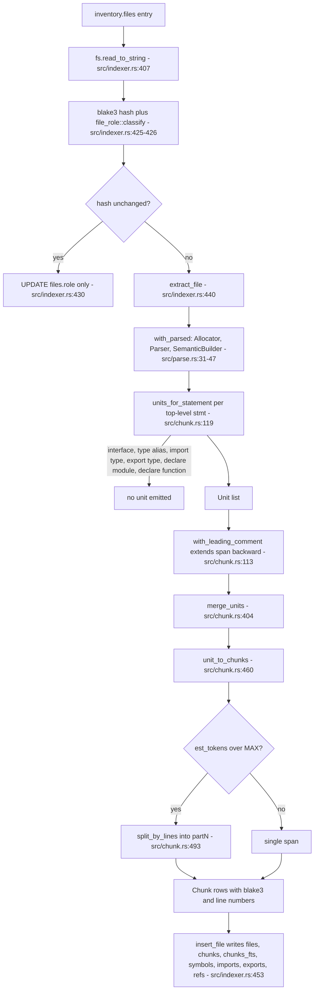
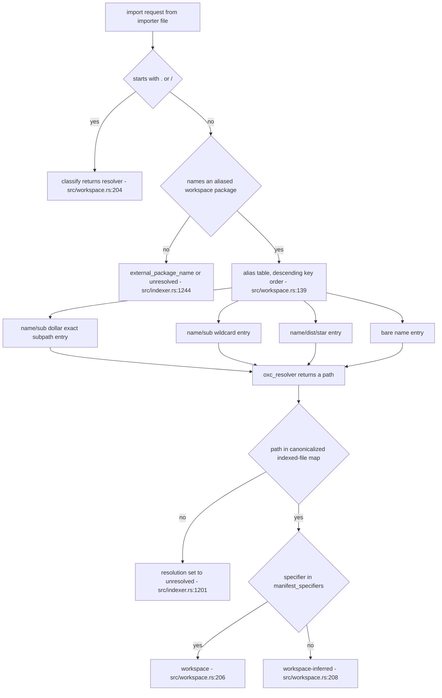

# Ingestion: discovery, parsing, chunking, and resolution

Ingestion turns a checkout on disk into rows. Four mechanically separate stages meet inside `index_repo_impl` (`src/indexer.rs:307`): an ignore-aware inventory produces a sorted list of absolute paths plus a list of per-path failures (`src/walk.rs:98`); each file is read, hashed, and — if its hash moved — parsed once inside a scoped arena and cut into chunks (`src/parse.rs:26`, `src/chunk.rs:106`); every file gets a role label from its path and its first 4 KiB (`src/file_role.rs:16`); and a workspace manifest scan builds an alias table that lets `oxc_resolver` land monorepo imports on indexed source rather than on build output (`src/workspace.rs:76`). The stage that most shapes what retrieval can see is chunking, because it erases type-only syntax: an authored `.d.ts` gets a `files` row and contract evidence but can produce zero chunks and therefore zero embeddings.

## Discovery: what enters the corpus

`source_walk_builder` (`src/walk.rs:82`) configures `ignore::WalkBuilder` with `hidden(true)`, `git_ignore(true)`, `git_global(true)`, `git_exclude(true)` (`src/walk.rs:86-89`) and one `filter_entry` closure (`src/walk.rs:90`) that calls `is_in_skipped_directory` (`src/walk.rs:70`). That predicate strips the root prefix and tests every remaining component against `SKIP_DIRS` — `node_modules`, `dist`, `.next`, `coverage`, `out` (`src/walk.rs:11`). Because the test runs on the *root-relative* path, a repository whose own root directory is named `dist` still indexes: `strip_prefix` leaves an empty path with no components. `build` is deliberately absent from the list; `src/build/` is a real authored directory in many repos, and gitignore already excludes genuine build output (test at `src/walk.rs:197`).

`is_indexable` (`src/walk.rs:13`) is now nothing but an extension test against `EXTENSIONS` (`src/walk.rs:8`). Declaration files are not rejected by extension — a `.d.ts` has extension `ts` and passes. The comment at `src/walk.rs:14-16` gives the reasoning: declaration files carry the contract plane, and excluding them by suffix threw that evidence away; *generated* declarations are meant to be excluded structurally, by the skipped-directory prune and by origin policy. The tradeoff shows in the numbers: a `.d.ts` occupies a `files` row and contributes near-zero chunks, so file and chunk counts diverge, and a hand-written `.d.ts` under an output directory nobody named in `SKIP_DIRS` now enters the corpus.

`SKIP_DIRS` is read from eight places — `is_in_skipped_directory` (`src/walk.rs:78`), which the watcher's event filter also calls (`src/watch.rs:498`), plus `checked_child_dirs` (`src/workspace.rs:544`), `entry_candidates` (`src/workspace.rs:884`), mirror-tail detection (`src/workspace.rs:980`), wildcard prefix translation (`src/workspace.rs:1044`), and two filesystem scan helpers (`src/workspace.rs:1120`, `:1193`). It is not, however, the whole exclusion policy: the hidden-file and gitignore flags exclude far more, and they are only reachable through the builder.

## The I/O trichotomy

`source_inventory` (`src/walk.rs:98`) replaced a lossy `walker.flatten()` with a three-way classification driven by `src/io_policy.rs`. The premise is that not all filesystem failures mean the same thing, and collapsing them either loses data silently or wedges a repository over one unreadable directory.

| Class | Predicate | Walk behavior | Rationale |
|---|---|---|---|
| Inventory race | `io_policy::is_inventory_race` — `NotFound`, `IsADirectory`, `NotADirectory` (`src/io_policy.rs:6`) | Dropped silently (`src/walk.rs:112`, `:128`) | An inventory is not atomic; a file deleted mid-walk is absence, not loss |
| Retryable | `io_policy::is_retryable` — `Interrupted`/`WouldBlock`/`TimedOut`/connection kinds, plus `EIO`, `EMFILE`, `ENFILE`, `ENOMEM`, `ESTALE`, … (`src/io_policy.rs:16`, `:38`) | Abort the whole inventory with context (`src/walk.rs:108-111`, `:123-127`) | A resource failure can affect an arbitrary slice of the corpus; publishing a clean-but-random subset is worse than failing |
| Permanent | everything else — `PermissionDenied`, `InvalidData`, … | `WalkRejection { path, stage, error }` and continue (`src/walk.rs:113-118`, `:129-135`) | One chmod-000 subtree must not stop the repository from indexing |

A depth-0 error also aborts (`src/walk.rs:108`) — failing at the root is not a partial failure. Rejections carry a `stage` string separating a traversal failure (`"walk"`) from an ignore-file read failure (`"ignore"`), and `index_repo_impl` folds both into `IndexOutcome` (`src/indexer.rs:338-351`). The same trichotomy reappears in `classified_io` for workspace discovery (`src/workspace.rs:337-357`) and inline in the source read loop (`src/indexer.rs:412-423`) — the cost being that every filesystem call site becomes a three-arm match, and workspace discovery grew a parallel `classified_*` copy of each traversal helper alongside the unclassified `FilesystemSources` versions.

`files.sort()` (`src/walk.rs:141`) makes traversal order stable across runs. It is *not* what makes ids or hashes deterministic: the structural snapshot is computed with `ORDER BY f.path` and the resolution hash with an explicit multi-column ordering (`src/structural.rs`), and on the incremental path unchanged files keep their existing rowids (`src/indexer.rs:427-436`), so `files.id` does not follow inventory order after the first index. The sort buys reproducible diagnostics and stable rejection ordering.

`SourcePathPolicy` (`src/walk.rs:38`) exposes the same ignore configuration to the watcher as a standalone `ignore::IncrementalIgnore` matcher, so single-path event classification uses the walker's policy rather than a copied rule set. Its `is_ignored` (`src/walk.rs:56`) deliberately reports "not ignored" when the matcher errors — the watcher then schedules a refresh whose inventory pass will classify and report the error properly. The watcher rebuilds the policy after each successful refresh (`src/watch.rs:457`), so ignore-file edits take effect at the same publication boundary as the new inventory.

`walk::source_files` (`src/walk.rs:148`) discards rejections and returns only the file list. It exists for read-only diagnostics — `cmd_chunks` and `cmd_stats` (`src/commands/core.rs:435`, `:468`) — and indexing must not use it, because dropping rejections would make an inaccessible subtree indistinguishable from an empty one.

## Parsing: one arena, one pass

`with_parsed` (`src/parse.rs:26`) is a scoped-borrow around oxc's arena allocation. `Allocator::default()` is created on that stack frame (`src/parse.rs:31`), `Parser::new(&allocator, source, source_type).parse()` allocates the `Program` inside it (`src/parse.rs:33`), `SemanticBuilder::new().with_build_nodes(true).build(&ret.program)` borrows it (`src/parse.rs:45-47`), and the caller sees only `(&ParserReturn<'_>, &Semantic<'_>)` inside an `FnOnce` returning an owned `T`. No AST node can outlive the call, which is enforced by lifetimes rather than convention. The consequence is that every per-file analysis has to happen in one pass, and it does: `extract_file` (`src/indexer.rs:662-673`) runs the chunker and `graph::extract` back to back inside the closure and returns owned `FileData`. Node building is on because reference classification walks node ancestors (comment at `src/parse.rs:44`).

Only `ret.panicked` rejects a file (`src/parse.rs:34`); recoverable diagnostics still index in full, which is what makes a repository mid-refactor still searchable. The first diagnostic is lifted into the *outer* anyhow message (`src/parse.rs:42`) because callers already attach the path, and an anyhow context chain's `Display` would collapse to path-only.

`source_type_for` (`src/parse.rs:9`) opts every `is_javascript()` source type into `.with_jsx(true)` (`src/parse.rs:16`) while leaving TypeScript extension-strict. JSX's grammar is additive over JS, so ordinary comparisons like `a < b && c > d` still parse (test at `src/parse.rs:74`); `.ts` cannot get the same treatment because `<T>expr` type assertions and JSX elements are genuinely ambiguous. Unknown extensions fall back to `SourceType::default()`.

## Chunking: erasure, then symbol-aligned boundaries

Sizing is crude on purpose: `est_tokens` is `bytes / 4` (`src/chunk.rs:64`), measured against `TARGET_TOKENS = 1200` and `MAX_TOKENS = 2000` (`src/chunk.rs:9-10`) — 4800 and 8000 bytes. There is **no overlap window**: chunks are cut at syntactic boundaries and adjacent chunks share no text, so retrieval cannot rely on a straddling window to catch a symbol sitting at a seam. The compensation is that boundaries land where a reader would place them, and that every chunk carries the file's full import list as context (`file_imports`, `src/chunk.rs:42`, from `module_record.requested_modules` at `src/chunk.rs:90-96`).

The following diagram traces one file from the inventory to its `chunks` rows. Watch the two early exits — the hash short-circuit and the erasure arm — and note that `merge_units` is the only path to `unit_to_chunks`.

`units_for_statement` (`src/chunk.rs:119`) emits nothing for `TSInterfaceDeclaration`, `TSTypeAliasDeclaration`, `TSImportEqualsDeclaration` (`src/chunk.rs:122-124`), a `declare`d `TSModuleDeclaration` (`:125`), a type-kind `ImportDeclaration` (`:126`), and a type-kind `ExportNamedDeclaration` (`:127`). The `export <decl>` unwrap repeats the same arms (`src/chunk.rs:160-163`), and `units_for_function` returns early on `f.declare` (`src/chunk.rs:205`). A file whose statements are all of these produces an empty `Vec<Chunk>` — the `ERASED` branch above with nothing downstream of it. That is the intended outcome for a `.d.ts`: it still gets a `files` row and its contract imports and exports still land in `contract_imports`/`contract_exports`, but it contributes no chunk text, no FTS rows, and no embeddings.

The erasure is not symmetric, and the gap matters. `units_for_class` (`src/chunk.rs:273`) and `units_for_var` (`src/chunk.rs:318`) have no `declare` check at all, so top-level `declare const x: T;` and `export declare class C {}` *do* produce chunks. Only `declare function` is erased at the declaration level. The erasure test (`src/chunk.rs:549`) does not cover those forms.

## Merging, span union, and the split products

`merge_units` (`src/chunk.rs:404`) walks the unit list with a single accumulator. A merge requires, in order: neither unit `atomic`, identical `scope_chain`, and then either both units are `Imports` or both are anonymous `Module` units whose combined `est_tokens` stays under `TARGET_TOKENS` (`src/chunk.rs:428-433`). Named declarations therefore never share a chunk with a neighbor — the comment at `src/chunk.rs:420-423` states the retrieval argument: a chunk that *is* `getUser` beats one that merely contains it. The cost is one chunk and one embedding per export in a file of one-line re-exports.

Merging is a span union, `min(start)..max(end)` (`src/chunk.rs:436`), not a text concatenation. That keeps `start`/`end` usable as byte offsets into the original source, which is what lets extracted sites be attributed to a chunk by offset containment. It also means erased type declarations sitting *between* two merged anonymous units reappear verbatim in the chunk's content: erasure is a guarantee about chunk boundaries and names, not about bytes.

Oversized declarations are split rather than truncated. A function over `MAX_TOKENS` becomes an atomic header unit spanning `[fn_start, first_body_stmt.start)` plus one anonymous `Module` unit per body statement, each carrying the function name in its `scope_chain` (`src/chunk.rs:242-260`). A class splits into `ClassHeader` plus one `Method` unit per member (`src/chunk.rs:273-315`). `units_for_var` promotes a single-declarator `const Foo = () => …` to a named function or component unit and applies the same body split to a block-bodied arrow (`src/chunk.rs:318-374`). The `atomic` flag on headers exists purely so `merge_units` cannot glue a split product back to a neighbor.

Whatever survives merging still over `MAX_TOKENS` is line-split by `split_by_lines` (`src/chunk.rs:493`) into `#partN` pieces (`src/chunk.rs:471`). The budget is `TARGET_TOKENS * 4` bytes; the provisional end is walked back to a UTF-8 char boundary, then back to the last newline inside the window, then clamped to a char boundary again (`src/chunk.rs:502-516`). Two consequences follow. A single line longer than 4800 bytes yields an over-budget span, because there is no newline in the window to back up to. And `symbols` is populated only on part 1 (`src/chunk.rs:480`) — later parts carry an empty symbol list, so symbol-based lookup finds only the head of a split declaration.

Two more edges are worth naming. `merge_units` applies *no* size cap to adjacent `Imports` units (`src/chunk.rs:431`), so a 2000-line import block becomes one unit and is only afterwards chopped into `#partN` pieces by the line fallback. And `with_leading_comment` (`src/chunk.rs:388`) runs on every unit including split-body units (`src/chunk.rs:112-114`), so a comment lying inside a header unit's span can also be pulled into the following body unit. Chunk spans are therefore not a strict partition of the file; anything that assumes disjoint `[start, end)` ranges will double-count comment text.

## Role and origin labels

`file_role::classify` (`src/file_role.rs:16`) lowercases the repository-relative path and the first 4 KiB of source (clamped to a char boundary) and returns exactly one of five values in a fixed precedence: generated, fixture, test, documentation, production. It never returns `"unknown"`, even though `"unknown"` is in `ALL` (`src/file_role.rs:5-12`) and in `DEFAULT_EXPANSION` (`src/file_role.rs:14`); its only real source is the `files.role` column default (`src/store.rs:259`), reached by a row inserted without a role. Unlike `files.origin`, `files.role` has no CHECK constraint.

| Role | Retrieval multiplier (`src/file_role.rs:95`) |
|---|---|
| `production`, or no role at all | 1.0 |
| `unknown` | 0.75 |
| `documentation` | 0.4 |
| `test` | 0.3 |
| `fixture` | 0.2 |
| `generated` | 0.1 |
| anything else | 0.0 |

That last row is a trap: adding a value to `file_role::ALL` without adding an arm to `penalty` silently zeroes those files out of ranking rather than failing to compile. Separately, classification runs *before* the unchanged-hash comparison (`src/indexer.rs:426` precedes `:427`), so every refresh pays for lowercasing the path and 4 KiB of every file even when nothing changed — the price of being able to fix a role label without re-extracting.

Origin is a coarser, three-value partition: `repository`, `workspace`, `dependency` (`src/origin.rs:3`), with `[repository, workspace]` as the default allowlist (`src/origin.rs:4`). An empty allowlist and any value outside the three are errors (`src/origin.rs:10`). Unlike role, this one is enforced at the schema level by a CHECK constraint on `files.origin` (`src/store.rs:260-261`). First-party source is written with `origin: "repository"` (`src/indexer.rs:449`); the workspace and dependency values are applied later by `dependency::synchronize_instances`.

## Workspace discovery and the alias table

`WorkspaceMap::discover_with_fs` (`src/workspace.rs:76`) takes the *indexed source list* and returns a `WorkspaceDiscovery { map, rejections }`. It builds `IndexedSources` from the inventory (`src/workspace.rs:82`), reads workspace globs from `pnpm-workspace.yaml` or the root `package.json` `workspaces` field — both the array form and the `{"packages": [...]}` object form are accepted (`src/workspace.rs:402-408`) — and expands them to member directories (`src/workspace.rs:83-84`). Each member's `package.json` is read through `classified_io`, so a JSON parse error becomes a `workspace-manifest` rejection (`src/workspace.rs:105-109`) while an `EMFILE` aborts discovery entirely (`src/workspace.rs:346-348`). A member with no `name`, or a name starting with `.` or `/`, is skipped silently (`src/workspace.rs:113-118`) — no rejection is recorded, so the package simply never gets an alias and nothing in the outcome says why.

Alias ordering is the subtlest invariant in this subsystem. `oxc_resolver` commits to the first alias entry whose key prefixes the request, and a matched-but-failing entry *stops* resolution rather than falling through to the next entry. `add_indexed_package` (`src/workspace.rs:155`) pushes, in construction order, exact `name/sub$` and wildcard `name/sub` subpath entries (`src/workspace.rs:265-268`, `:250-255`), then `name/dist/*` (`src/workspace.rs:184`), then bare `name` (`src/workspace.rs:185`). The list is then sorted **descending** by key and deduped (`src/workspace.rs:139-140`), which guarantees every `name/…` key sorts before bare `name`. If bare `name` were consulted first it would match every subpath import into that package and then fail, breaking them all. The constraint lives entirely in a string comparison; nothing in the type expresses it.

The next diagram is the resolution decision tree — how a request becomes a labeled module edge. Watch `CLASSIFY`: whether an edge reads `workspace` or `workspace-inferred` is decided by one `HashSet` membership test, and everything not aliased at all falls out as `resolver`.

`manifest_specifiers` is populated only when an alias target came from manifest data — a package entry with `Origin::Manifest` (`src/workspace.rs:173-175`) or a subpath export with `Origin::Manifest` (`src/workspace.rs:262-263`). Everything else lands in the `WSINF` branch. Note that a request the map does not recognize as a workspace request returns `"resolver"` (`src/workspace.rs:203-204`), not `"workspace-inferred"`; the inferred label is reserved for specifiers that *are* workspace-owned but whose target was guessed.

## Entry preference: a five-pass ladder

`preferred_package_entry` (`src/workspace.rs:671-706`) decides which file a bare workspace-package import lands on. It runs five passes:

| Pass | Source of the field | Where the target must exist | Origin recorded |
|---|---|---|---|
| 1 | manifest fields (`src/workspace.rs:679`) | indexed corpus | `Manifest` |
| 2 | manifest fields (`:684`) | filesystem, build output excluded | `Manifest` |
| 3 | inferred fields (`:690`) | indexed corpus | `Inferred` |
| 4 | inferred fields (`:695`) | filesystem, build output excluded | `Inferred` |
| 5 | manifest fields (`:700`) | filesystem, build output **allowed** | `Manifest` |

The shape preserves the historical manifest-before-inferred precedence while preferring source that is actually in the corpus over a recognized output layout, and keeps `dist/index.js` as a real last resort for a package that genuinely ships no source. The preference matrix is pinned by a five-case test at `src/workspace/tests.rs:214`. The residual gap: a `main` pointing into an *unrecognized* output directory — `lib/`, say, which is not in `SKIP_DIRS` — wins at pass 2 over indexed `src/`, is labeled `Manifest`, and produces a `workspace` edge to a file that was never indexed.

`entry_candidates` (`src/workspace.rs:881`) does the extension guessing: a `.js` manifest value expands to `[.ts, .tsx, .js, .jsx]` (`src/workspace.rs:896-900`), mirroring the resolver's `extension_alias`. It also drops `.d.ts`/`.d.mts`/`.d.cts` targets outright (`src/workspace.rs:885-887`), so a package whose only export target is a declaration file gets no manifest entry at all — an interaction with the decision to *index* declaration files that is easy to miss.

Subpath exports go through `package_exports::collect_active_targets` (`src/package_exports.rs:11`), which appends strings, recurses through arrays in order, and — for objects — commits to the **first** key present in `RESOLVE_CONDITIONS` (`import`, `require`, `node`, `default`) and returns without backtracking (`src/package_exports.rs:19-26`). This is correct only because `serde_json`'s `preserve_order` feature keeps declaration order; without it the "first active condition" would be whatever the hash map yielded. Wildcard exports become one alias whose values are the translated target prefixes plus two trailing generic fallbacks, `<dir>/src/*` and `<dir>/*` (`src/workspace.rs:1023-1026`). Those fallbacks exist because a matched-but-failing alias blocks resolution entirely; the price is that the alias can silently resolve specifiers the package's `exports` map would actually forbid.

## Dependency scoping

`dependency::discover` (`src/dependency.rs:76`) never walks `node_modules`. It reads `(importer, request)` pairs from the importer rows just written by first-party extraction (`src/dependency.rs:93`), resolves each matching request from its real importer with an alias-free resolver (`src/dependency.rs:105-119`), climbs to the first `package.json` whose `name` matches, and canonicalizes. Canonicalization is what collapses pnpm's symlink farm to one row per real installed instance — and simultaneously surfaces two installed versions of one name as two instances. A package imported only from an unindexed file is invisible to this method; the sole fallback is a direct probe of `<root>/node_modules/<selector>/package.json`, and only when no instance of that name was already found (`src/dependency.rs:121-130`). A selector that remains unresolved aborts the run (`src/dependency.rs:132-136`) — after the entire first-party corpus has been read, parsed, and written, though still inside the transaction that rolls back.

The Yarn PnP bail (`src/dependency.rs:87-91`) is narrower than it looks: it fires only when selectors are non-empty (the function returns early otherwise at `:84-86`), `<root>/node_modules` is not a directory, *and* `.pnp.cjs` or `.pnp.loader.mjs` exists.

`plan_package` (`src/dependency.rs:313`) picks analysis roots from `source` fields first, then runtime export/`module`/`main` targets, then the package root (`src/dependency.rs:387`). Candidates are sorted with forced entries hoisted ahead of everything (`src/dependency.rs:334-344`) before the 10 000-file / 100 MiB / 2 MiB budget is applied (`src/dependency.rs:356-363`), so the file a first-party import actually resolves to survives truncation and the module edge does not dangle; forced entries are also exempt from the minified filter (`src/dependency.rs:298`). Any skip marks the plan `truncated` (`src/dependency.rs:372-376`). The limits are nominally configurable through `DependencyLimits`, but every construction in the codebase uses `Default`, so they are effectively hardcoded.

## Where the seams are thin

The `fs_ops::FileSystem` trait (`src/fs_ops.rs:16`) injects `read_to_string`, `metadata`, `read_dir`, and `file_type` into source publication, workspace discovery, and dependency planning, which lets `src/test_fs.rs` inject per-operation failures without thread-local state in production modules (`src/fs_ops.rs:8-10`). It deliberately excludes canonicalization, existence probes, the diagnostic `package_entry_paths` traversal, resolver internals, and the `ignore` walk (`src/fs_ops.rs:12-15`). That exclusion is load-bearing: `package_entry_paths` (`src/workspace.rs:711`) uses raw `fs::read_to_string` and `FilesystemSources` and swallows a discovery error to keep repository-overview scouting working, so its answers can differ from the indexing path's where discovery partially fails.

Two behaviors in the source loop deserve explicit statement because they invert the usual reading. An inventory race `continue`s *without* inserting into `seen` (`src/indexer.rs:412`), so a file that vanishes between inventory and read is deliberately treated as deleted and its row is removed by the cleanup pass (`src/indexer.rs:467-471`). A permanent read error *does* insert into `seen` (`src/indexer.rs:417`) after deleting the old row and recording a `read` rejection — the path stays known, its content does not. Rejection stages form a de-facto vocabulary across the subsystem: `walk` and `ignore` from the walker, `workspace-manifest`, `workspace-canonicalize`, and `workspace-walk` from discovery, and `read` and `extract` from the indexer.

Finally, `unique_source_match` — the last-resort scan mapping an unmapped subpath export onto a source file — uses two different depth limits: `components().count() > 5` in the indexed-source variant (`src/workspace.rs:809`) versus `depth > 4` in the filesystem variants (`src/workspace.rs:1101`, `:1165`). Both answer only on an exactly-unique match, so ambiguity yields nothing rather than a wrong guess, and neither is memoized, so a package with many unmapped subpath exports rescans `src/` once per export.

The rows this stage writes are consumed by [structural extraction](03-structural-extraction.md) and [the storage schema](05-storage-schema.md); the incremental variant of the same pipeline is in [incremental and watch](13-incremental-and-watch.md).
