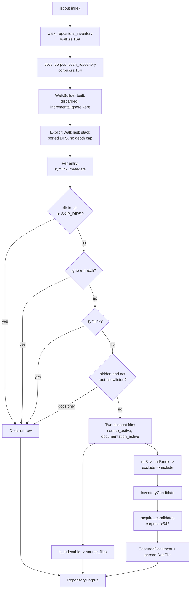
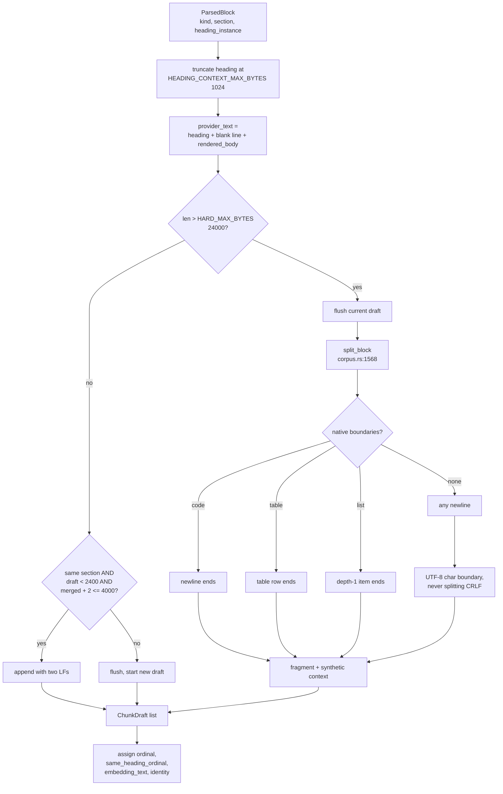

# The documentation corpus: discovery, admission, and prose chunking

`src/docs/corpus.rs` is 2,708 lines that do four things in sequence: walk the repository once, decide which files are documents and record why every rejected path was rejected, capture each admitted document's exact bytes under `O_NOFOLLOW`, and turn those bytes into heading-scoped, byte-budgeted chunks carrying a breadcrumb and a path-independent embedding identity. The structurally surprising part is the first step. The walk this module performs is not a documentation walk that runs alongside the code walk — it *is* the code walk. `walk::repository_inventory` no longer touches the filesystem; it calls into `docs::corpus` and unpacks the result. A module named `docs` now decides which `.ts` files get indexed.

## One traversal, two planes

`walk::repository_inventory` (`src/walk.rs:169`) is nine lines of field reshuffling around `crate::docs::corpus::scan_repository` (`src/docs/corpus.rs:164`). Its doc comment states the reason (`src/walk.rs:166-168`): Markdown membership, capture, and parse happen inside the same deterministic traversal that selects code paths, so there is no independent documentation snapshot and no later filesystem scan that could disagree with the code inventory. The alternative — a second `ignore::WalkBuilder` pass for Markdown — would produce two file lists taken at two different instants, and any mismatch would show up as documentation referring to code that the same index pass never saw.

The old walker survives. `walk::source_inventory` (`src/walk.rs:119`) still drives `ignore::WalkBuilder` directly, but its only remaining callers are the read-only `source_files` diagnostic (`src/walk.rs:193`) and the watcher's `SourcePathPolicy` (`src/walk.rs:59`), which needs a standalone path matcher rather than a file list. So "which files count" is now implemented twice, in two structurally different walkers that must stay in agreement. That is the price of the inversion, and it is paid in the watcher: `walk::is_indexable` accepts only the eight code extensions (`src/walk.rs:9,14`), so a `.md` edit on its own never triggers a watch generation (`16-incremental-and-watch.md`).

`scan_repository_with_capture` (`src/docs/corpus.rs:168`) does something unusual with `ignore`: it builds a `WalkBuilder` with `hidden(false).git_ignore(true).git_global(true).git_exclude(true).follow_links(false)`, then throws the walker away and keeps only the popped `IncrementalIgnore` matcher (`src/docs/corpus.rs:184-192`). The crate is used as an ignore-rule engine, not as a traversal. Traversal is an explicit heap stack of `WalkTask` (`src/docs/corpus.rs:312-325`): directory entries are read, sorted by file name, and pushed in reverse so popping reproduces sorted depth-first order — without recursion, and therefore without a depth cap (test `explicit_stack_walks_deep_trees_without_a_depth_cap`, `src/docs/corpus.rs:2199`).

Each task carries **two independent descent bits**, `source_active` and `documentation_active`, because the two planes' hidden-path policies genuinely differ and a docs-only prune must not narrow the code inventory (comment at `src/docs/corpus.rs:211-214`). Code keeps the legacy `hidden(true)` semantics, including the ignore-file whitelist that can reopen a hidden entry (`src/docs/corpus.rs:432-439`). Docs applies its own fixed rule in `hidden_path_is_excluded` (`src/docs/corpus.rs:724`): a dot-prefixed component is fatal *unless* it is at component index 0 and appears in `HIDDEN_ROOT_ALLOWLIST = [".github", ".claude", ".agents"]` (`src/docs/corpus.rs:26`). `.github/workflows/notes.md` is admitted; `packages/app/.github/notes.md` is `hidden-not-allowlisted`; `docs/.drafts/x.md` likewise. The allowlist is not configurable — it names the three places where agent-facing authored guidance actually lives, and widening it would multiply the admission surface. A repo that keeps prose under `.docs/` cannot admit it without a code change.

The whole documentation plane is switched off by an empty include list: the root task sets `documentation_active: !self.options.include.is_empty()` (`src/docs/corpus.rs:335`), and `DocsSettings::indexing_include` returns `&[]` when `[docs] enabled = false` (`src/config/model.rs:58-60`). Disabling docs costs nothing in the code plane, which is pinned by `empty_include_disables_docs_without_narrowing_code_inventory` (`src/docs/corpus.rs:2037`).

What to look for in the walk diagram: the single `SCAN` node feeding two outputs, and the fact that the ignore matcher is an input to the loop rather than a driver of it.

Note that `SPLIT` is the only node with two outgoing edges into different planes, and that `HID` prunes only the docs bit — the code bit continues down a hidden directory that an ignore-file whitelist reopened.

## Admission order and the visible decisions

Membership is evaluated in a fixed order inside the walk (`src/docs/corpus.rs:404-514`), and every rejection emits a `Decision` (`src/docs/corpus.rs:83`) carrying `{path, subject, rule, detail, path_base64, path_encoding}`, where `subject` is `directory`, `entry`, or `file`. The complete rule vocabulary:

| Rule | Phase | Emitted when |
| --- | --- | --- |
| `hard-skip` | walk | directory named `.git` or in `walk::SKIP_DIRS` (`src/docs/corpus.rs:715`) |
| `ignored` | walk | gitignore/global/exclude matched (directories always; files only when path-relevant) |
| `symlink-not-followed` | walk | any symlink, of any name (`src/docs/corpus.rs:441-448`) |
| `hidden-not-allowlisted` | walk | dot component outside the root allowlist |
| `non-utf8-path` | walk | `.md`/`.mdx` path that is not valid UTF-8 |
| `unsupported-extension` | walk | non-document file that an `include` glob explicitly matched |
| `excluded` | walk | an `exclude` glob matched |
| `not-included` | walk | no `include` glob matched |
| `oversized` | capture | file exceeds `max_file_bytes` (4 MiB) |
| `non-utf8` | capture | bytes are not valid UTF-8 |
| `read-error` | capture | permanent I/O failure, with `detail` |
| `indexed` | capture | captured and parsed |

Decision rows are deliberately narrow for *files*: `unsupported-extension` fires only when an include glob matched a non-document path (`src/docs/corpus.rs:494-501`), so ordinary `.ts` files never appear in `jscout docs status`. The symlink branch is the exception and is not narrowed this way — a symlink named `foo.ts`, or a bare directory symlink, produces a `symlink-not-followed` row whenever the documentation plane is active, which is exactly what `symlinks_are_reported_and_not_followed` (`src/docs/corpus.rs:2059`) asserts for a link named `linked`. Non-UTF-8 paths carry a lossless base64 encoding beside a lossy display path (`encode_native_path`, `src/docs/corpus.rs:802`).

Globs are compiled with `literal_separator(true)`, `case_insensitive(false)`, `backslash_escape(true)` (`src/docs/corpus.rs:672-684`), and patterns starting with `!`, ending with `/`, or containing unescaped braces are rejected outright (`src/docs/corpus.rs:687-699`), at config load (`src/config/load.rs:419`) and again at every scan. Admission is therefore one deterministic pass with no ordering semantics between patterns — and consequently no way to write "everything under `docs/` except drafts" as a single pattern. `is_document_path` compares the raw `OsStr` extension against `md` and `mdx` (`src/docs/corpus.rs:741`), so `README.MD` is never a document even on a case-insensitive filesystem; `glob_contract_is_pinned` (`src/docs/corpus.rs:1899`) exists to keep that from drifting.

## Two-phase capture

The walk collects candidates; it does not read anything. `acquire_candidates` (`src/docs/corpus.rs:542`) sorts candidates by normalized path bytes and then calls `capture_file` (`src/docs/corpus.rs:626`) per file. Capture opens with `O_NOFOLLOW | O_NONBLOCK` on unix (`src/docs/corpus.rs:642-650`), re-checks the file type *through the descriptor*, and reads `max_bytes + 1` bytes so an oversized file is classified without reading all of it. The `capture` closure is injected through the `Scanner` struct purely so tests can simulate read failures and type changes without a filesystem.

TOCTOU is classified rather than swallowed, and the classification has four distinct outcomes:

- **Decision** — oversized, non-UTF-8, or a permanent read error. The rest of the corpus proceeds.
- **`InventoryRejection`** — a permanent walk-stage failure on a directory or entry, recorded with `stage: "walk"`.
- **Hard abort of the whole index** — `CapturedFile::NotRegular` (the type changed between walk and open), an `ELOOP` no-follow violation, a retryable error, or an inventory race detected during capture (`src/docs/corpus.rs:557-604`). A file that was a regular file during the walk and is a symlink during capture cannot be reported as "skipped", because the snapshot would then be a mix of two filesystem states.
- **A fourth, easily missed abort**: `ensure_regular_inventory_file` (`src/docs/corpus.rs:610`) `bail!`s when a non-file, non-directory, non-symlink entry has a `.md`/`.mdx` extension (`src/docs/corpus.rs:470-479`). A FIFO named `notes.md` inside an active docs subtree wedges the entire index; the same FIFO named `notes.txt` is silently skipped. The asymmetry is deliberate and tested both ways (`src/docs/corpus.rs:2078, :2089`), but it is a real foot-gun.

The captured `Vec<u8>` is retained in `CapturedDocument` alongside the parsed `DocFile` (`src/docs/corpus.rs:55-62`), and parsing runs against that same buffer. The content hash, every block hash, and every chunk byte range therefore observe one filesystem state. The indexer re-derives the byte length, re-hashes with BLAKE3, and re-derives every non-stub chunk's embedding identity, `ensure!`ing each matches the parser's metadata (`src/indexer.rs:923-931, :1010-1024`) — a trust-but-verify seam between parse and insert. The cost is that the entire repository's Markdown is held in memory for the duration of the index pass, bounded only by the per-file 4 MiB cap. That cap is a `CorpusOptions` field but the indexer always takes the default via `..CorpusOptions::default()` (`src/indexer.rs:385-391`), so it is effectively hardcoded with no `[docs]` key.

## Parsing prose

`parse_document` (`src/docs/corpus.rs:1052`) hashes the raw bytes first, then strips a UTF-8 BOM for text purposes only — offsets stay relative to the raw buffer via `body_base` (`src/docs/corpus.rs:1060`). Front matter is recognized only when the *first* logical line is exactly `---` and some later logical line is exactly `---`, **and** the enclosed YAML deserializes to a `Mapping`; anything else yields `malformed_as_body` with `body_start = 0`, re-reading the delimiters as ordinary Markdown (`src/docs/corpus.rs:873-918`). `logical_lines` (`src/docs/corpus.rs:963`) tracks content end and full end separately so LF and CRLF compare identically without per-line allocation. Only a string `title`, a string `description`, and a string-or-all-string-sequence `tags` are extracted. A leading blank line defeats recognition entirely: byte 0 is not `---`, so the state is `absent`, the delimiters become a thematic break, and the YAML becomes visible body text.

Comment removal runs before structure. `protected_code_ranges` (`src/docs/corpus.rs:1208`) collects fenced/indented code blocks and inline code spans; `comment_removals` (`src/docs/corpus.rs:1236`) then scans raw bytes for `<!-- -->` always and `{/* */}` only for `.mdx`, skipping protected ranges and retaining unclosed openers. This is a byte scan with a skip list, not a parse — a `<!--` inside an HTML attribute value is still removed. Blocks keep both representations: `body` is the exact source slice with original line endings, `rendered_body` is comment-stripped and LF-normalized by `render_source_range` (`src/docs/corpus.rs:1425`), which also trims leading and trailing newlines. Retrieval and embedding see the rendered form; the raw form remains available as evidence.

Structure comes from `pulldown-cmark` with `Options::ENABLE_TABLES` and nothing else (`src/docs/corpus.rs:1205`). Footnotes, strikethrough, and task lists are parsed as plain CommonMark and land inside paragraph blocks as literal text. `document_items` (`src/docs/corpus.rs:1292`) iterates `into_offset_iter` and uses a `consumed_until` cursor to suppress nested events, so a list's inner paragraphs do not become sibling blocks. `Event::Rule` becomes a `Boundary`; `Event::Html` bypasses `body_block_kind` and emits a `BlockKind::Html` body item directly (`src/docs/corpus.rs:1330-1337`).

MDX gets no JSX-aware parser. JSX elements, props, and expressions stay as authored text so a component name remains searchable in BM25. Only two things are dropped: unprotected `{/* */}` comments, and the contiguous *leading* run of paragraph blocks that `is_esm_only` (`src/docs/corpus.rs:1344`) confirms oxc parses as pure module declarations — no hashbang, no directives, non-empty body, every statement a module declaration. `mdx_preamble_open` closes permanently at the first heading, boundary, or non-ESM block (`src/docs/corpus.rs:1081, :1082, :1111, :1124`). A `"use client";` directive, a fence, or one line of prose closes it, after which `export const metadata = {…}` is retained verbatim as a paragraph. Running the full oxc parser on leading MDX paragraphs also means prose parsing is not purely lexical.

Heading state is a six-slot array (`src/docs/corpus.rs:1069`). Setting level *n* writes slot *n−1* and clears every slot below it; `breadcrumb` joins the live slots with `" > "`; `nearest_heading` is the deepest live slot (`src/docs/corpus.rs:1085-1096, :1125-1129`). There are no slugs and no HTML anchors anywhere in `src/docs/` — a chunk's address is its byte span plus its line span plus its breadcrumb. The document `title` falls back front matter → first H1 → file stem (`src/docs/corpus.rs:1156-1163`).

Two counters advance separately and this is load-bearing. `section` increments at every heading **and** every thematic break (`src/docs/corpus.rs:1083, :1111`); it gates chunk merging. `heading_instance` increments only at headings, with 0 meaning preamble (`src/docs/corpus.rs:1084`); it gates `same_heading_ordinal`. Because they diverge, a `---` flushes the current chunk without renumbering that heading's chunks — pinned by `same_heading_ordinals_use_heading_instances_and_ignore_thematic_boundaries` (`src/docs/corpus.rs:2564`).

## Chunking

What to look for in the pipeline diagram: the oversize test happens *before* merging, not after, and the split path never rejoins the merge path.

`build_chunks` (`src/docs/corpus.rs:1475`) walks blocks in order. Before anything else it truncates the block's nearest heading to `HEADING_CONTEXT_MAX_BYTES` = 1,024 with the suffix `"\n[heading truncated]"` (`src/docs/corpus.rs:1485-1487`) — the truncated string is what lands in `DocChunk::nearest_heading` and what feeds both `provider_text` and `embedding_identity`. A draft absorbs the next block only while all three conditions hold: identical `section`, accumulated rendered body under `TARGET_BYTES` = 2,400, and merged length plus the two-byte `"\n\n"` joiner within `MERGE_MAX_BYTES` = 4,000 (`src/docs/corpus.rs:1505-1509`). A chunk boundary is therefore a section change or a size threshold, never a heading crossing. `MERGE_MAX_BYTES` sitting well above `TARGET_BYTES` is what lets an atomic 5 KB paragraph stay whole rather than being cut mid-sentence (`src/docs/corpus.rs:2596`).

A block whose provider text already exceeds `HARD_MAX_BYTES` = 24,000 bypasses merging entirely and goes to `split_block` (`src/docs/corpus.rs:1568`) with a body budget of `HARD_MAX_BYTES` minus the heading overhead. Splitting tries the whole remainder first, then the last fitting *native* boundary, then any newline, then a UTF-8 character boundary. Native boundaries are format-specific and are computed as **ends**, not starts: newline ends for fenced and indented code, `Tag::TableRow` start-event offset ends for tables, depth-1 `Tag::Item` offset ends for lists, each extended over a following CR and LF (`parser_boundaries`, `src/docs/corpus.rs:1761-1792`). Under `into_offset_iter` a `Start` event's range spans the whole row or item, so this cuts between rows, not before them. Every fragment re-prepends the block's synthetic context — `[fence lang]` or `[table col | col]`, capped at 1,024 bytes (`src/docs/corpus.rs:1014-1027`) — so the reader of fragment 7 of a 40 KB table still sees the column names. Synthetic context exists for exactly two block kinds; everything else gets an empty string.

Two assertions keep splitting honest. `assert!(end > start, "hard-bound splitting must make progress")` (`src/docs/corpus.rs:1635`) is a real runtime assert, backed by `next_utf8_boundary` guaranteeing at least one character advances (`src/docs/corpus.rs:1726-1735`), and `splits_crlf` (`src/docs/corpus.rs:1737`) prevents a CR from being separated from its LF. Fragment byte ranges partition the original block exactly — each fragment's `source_end` is the next fragment's `source_start` (`src/docs/corpus.rs:2608`). A `debug_assert!` at `src/docs/corpus.rs:1539` checks the resulting embedding text against the hard cap.

A document that produced no blocks at all — heading-only, or entirely front matter — gets one stub chunk spanning the whole file with `is_stub = true`, no embedding text, and no identity (`src/docs/corpus.rs:1165-1186`). Its breadcrumb is every heading's text joined with `" > "` in document order, which for five sibling H2s reads like a five-level nesting that does not exist.

## Identity, and why the code chunker could not be reused

`embedding_identity` (`src/docs/corpus.rs:280`) is BLAKE3 over `b"jscout-doc-embedding-v1\0"`, a one-byte heading-presence flag, then big-endian length-prefixed heading and rendered body. Path, breadcrumb, and byte offsets are all excluded, so a file rename or an edit to an ancestor heading reuses cached vectors — only text that actually reaches the provider is in the preimage. The consequence is that two identical passages under identically-named headings in different files share one cached vector; that is intended reuse, but the cache cannot tell them apart. The preimage is frozen byte-for-byte by `embedding_serialization_matches_the_normative_preimage` (`src/docs/corpus.rs:1918`), so extending it requires bumping `docs::CHUNK_FORMAT_VERSION` (currently `"documentation-v1"`, `src/docs/mod.rs:11`), which is checked independently of the code extractor version (`src/indexer.rs:822`) and reprocesses documentation without invalidating code rows.

The code chunker (`src/chunk.rs`) could not be reused because almost every input it depends on is absent from prose. It walks an oxc AST and splits at declaration boundaries; Markdown has no declarations, and `pulldown-cmark` yields an event stream, not a tree with spans it can subdivide. It budgets in estimated tokens (`TARGET_TOKENS` 1200, `MAX_TOKENS` 2000, `src/chunk.rs:9-10`) against a `&str`; the docs chunker budgets in bytes against the exact `provider_text` string, because bytes are the only measure it can compute exactly over the raw captured buffer. It emits `name`, `scope_chain`, `symbols`, and `file_imports`, all of which are NULL or empty for a documentation chunk (`src/indexer.rs:958-962`). And it feeds `chunks_fts` and the exact-identifier tiers, while prose feeds `docs_fts` only. Even the line-number helper is a separate implementation — `docs::corpus::LineIndex` (`src/docs/corpus.rs:1829`) indexes raw bytes and counts CR, LF, and CRLF as one break each, because chunk line spans must address the file on disk rather than a rendered string.

Byte budgets are a proxy for token budgets, and an imperfect one: CJK or heavily-escaped prose produces fewer tokens per chunk than ASCII at the same byte size. Two further limits are worth naming. `doc_chunk_meta.ordinal` stores `same_heading_ordinal`, not the global `ordinal` (`src/indexer.rs:1040-1049`) — the global ordinal is contiguous from 0 and `ensure!`d at insert (`src/indexer.rs:976-980`) but is never persisted, surviving only as `chunks` row order. And for a stub chunk, `rendered_body` is empty, so `docs_fts.body` is empty while `chunks.content` holds the whole raw file (`src/indexer.rs:1030, :1044-1052`); such a document is findable by title, path, and breadcrumb, but not by its own text.
