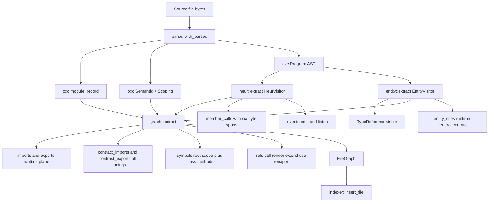
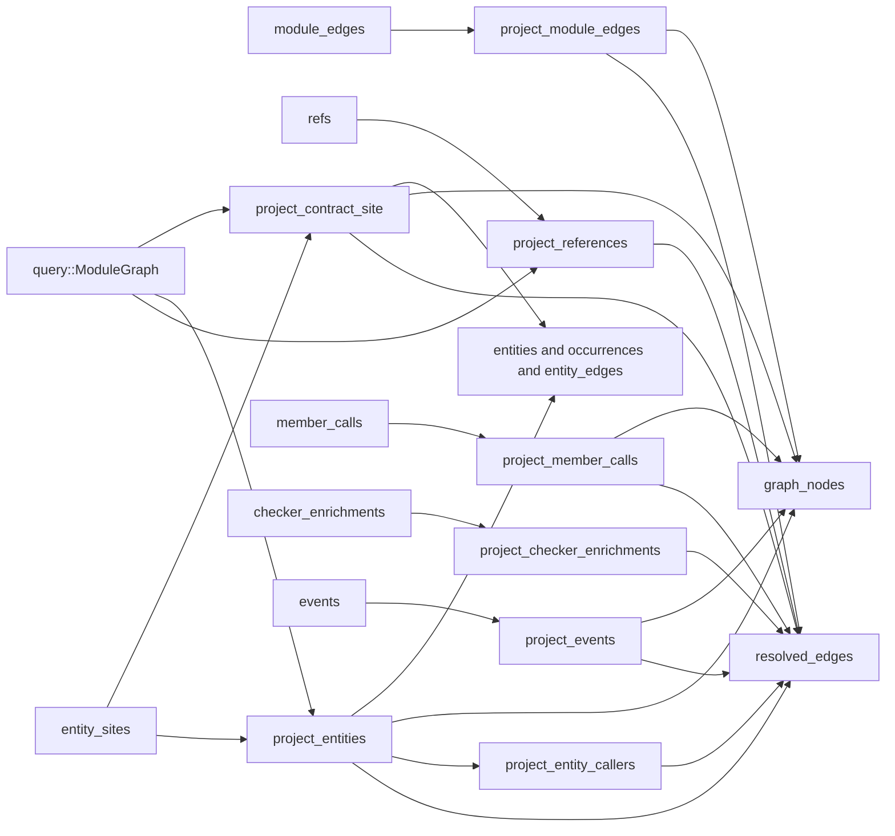

# Structural extraction: entities, symbols, and graph edges

Structural extraction is the part of jscout that turns each parsed JS/TS file into flat, source-local fact rows — symbols, imports, exports, references, member calls, event wiring, and typed "entity sites" — and then, in a separate pass, re-resolves those rows across the module graph into a keyed node/edge graph that retrieval traverses. The two halves are deliberately not the same pass: extraction is cached per file hash and knows nothing outside the file it is looking at, while projection is a wholesale rebuild that owns every node-key format, every confidence downgrade, and every cross-file resolution. This document enumerates what each visitor emits, what happens to TypeScript type information, and what the projected node and edge kinds actually are.

## Two stages and why they are split

`graph::extract` (`src/graph.rs:67`) takes one `ParserReturn` plus one `Semantic` and returns a `FileGraph` (`src/graph.rs:50`) of flat rows. `structural::rebuild_projection` (`src/structural.rs:431`) reads those rows back out of SQLite and writes `graph_nodes`, `resolved_edges`, `entities`, `entity_occurrences`, and `entity_edges` (column definitions in [05-storage-schema.md](05-storage-schema.md)). The split follows the versioning: `EXTRACTION_VERSION` (`"5"`, `src/entity.rs:14`) invalidates file hashes and forces a reparse, whereas `PROJECTION_VERSION` (`"11"`, `src/structural.rs:12`) only invalidates the disposable graph. Changing a node-key format or a confidence rule therefore costs a projection rebuild, not a full reparse of the repo.

The disposability is literal. `rebuild_projection` deletes exactly three tables inside `BEGIN IMMEDIATE` — `resolved_edges`, `graph_nodes`, `entities` (`src/structural.rs:447-449`). `entity_occurrences` and `entity_edges` disappear only through `ON DELETE CASCADE` off `entities` (`src/store.rs:434`, `src/store.rs:455`). Every canonical extraction table (`symbols`, `refs`, `imports`, `exports`, `contract_imports`, `contract_exports`, `member_calls`, `events`, `entity_sites`, `module_edges`) is untouched. On success the same transaction stamps `meta.snapshot` and `meta.projection_version`; any error rolls the whole thing back. With `JSCOUT_TIMING` set, each stage prints its elapsed time to stderr (`src/structural.rs:493-541`).

Parsing happens in `parse::with_parsed` (`src/parse.rs:26`), which builds `Semantic` with `with_build_nodes(true)` (`src/parse.rs:46-48`) because reference classification walks AST ancestors and cannot do so without the node store. `source_type_for` (`src/parse.rs:9`) forces the additive JSX grammar on for every JavaScript source type while leaving TypeScript extension-strict.

## The three extraction passes

`graph::extract` composes three sources of facts over the same program. Look at how little of it is a visitor: the import/export half is read straight out of oxc's precomputed `module_record`, and the symbol half walks `Semantic`'s scoping table rather than the AST.

`HeurVisitor` and `EntityVisitor` are the only true `Visit` implementations; `TRV` is a third, run nested inside `EntityVisitor` on type annotations and type declarations. `SYM` has two disjoint feeders: the scoping walk at `src/graph.rs:230-260` and `heur.methods` at `src/graph.rs:211-222`. And `IMP` and `CIMP` are two separate outputs of the same loop, not a filter applied later.

## Symbols: root scope, plus class methods, minus imports

Symbols come from `scoping.get_bindings(root_scope_id())` (`src/graph.rs:230-236`) — module-level bindings only. Nested functions, block locals, and closures never become symbol nodes; references to them are attributed to the enclosing root declaration by `owner_at`. Two exclusions apply inside that walk, and both live under `if !is_import` (`src/graph.rs:243`): import bindings never produce a `SymbolRow` at all, and among the rest, any binding whose `SymbolFlags` intersect `TypeAlias | Interface` is skipped (`src/graph.rs:245`). `symbol_kind` (`src/graph.rs:313`) then flattens the remaining flags to one of `class`, `function`, `const`, `var`.

Class methods are the other, larger source of symbols. `HeurVisitor::visit_class` (`src/heur.rs:248`) emits a `MethodDef` for every `MethodDefinition` with a statically resolvable key, and `src/graph.rs:211-222` turns each into a `SymbolRow` with `kind: "method:{Class}"` and `scope_chain` set to the class name. That `scope_chain` is what keeps `UserService.save` and `OrderService.save` distinct nodes, and these rows — not the root bindings — are what member-call candidates and checker enrichments resolve onto.

`SymbolRow` (`src/graph.rs:11`) carries two spans: `start`/`end` for the identifier and `decl_start`/`decl_end` for the whole declaration. The declaration span is the containment span `owner_at` (`src/structural.rs:2352`) uses to attribute an arbitrary byte offset to a symbol, picking the smallest enclosing span. The interval is half-open (`decl_start <= offset < decl_end`), and `refs` stores only a start offset, so a reference sitting exactly at `decl_end` attributes to the enclosing scope rather than the symbol.

Symbol identity is minted at projection time, not extraction time. `load_symbols` (`src/structural.rs:598`) sorts by `(path, scope, name, decl_start, id)` and assigns a 1-based ordinal per `(file_id, scope, name)`, producing `sym:{path}#{scope}::{name}@{ordinal}` (`src/structural.rs:3661`). `parse_symbol_key` (`src/structural.rs:3665`) reverses the format so a stale anchor from an earlier snapshot can be re-resolved by `(path, scope, name)` instead of erroring. The cost of positional ordinals is real: inserting a second same-named declaration earlier in the same file and scope renumbers the later one, silently changing its key across snapshots.

## Reference classification

Every resolved reference to a root binding becomes a `RefRow` (`src/graph.rs:39`) unless `r.flags().is_type_only()` (`src/graph.rs:268`). `classify_reference` (`src/graph.rs:327`) walks up to five ancestors and returns the first match: a JSX opening or closing element yields `render`, a `CallExpression`/`NewExpression` yields `call` when the callee span contains the reference and `use` otherwise, a `Class` whose `super_class` contains the reference yields `extend`, and the default is `use`. A `StaticMemberExpression` at depth 0 whose object is the reference also records the property name, which `src/graph.rs:276-283` uses to refine a namespace import: `ns.foo()` records `target_name = "foo"` with detail `via namespace ns` instead of the useless `*`.

Two more `RefRow` sources exist outside the binding walk. Indirect re-exports emit a `reexport` row (`src/graph.rs:147-155`), and every static `import()` with a literal or fully-static template specifier emits a `use` row with detail `dynamic import` (`src/graph.rs:197-208`). All `RefRow`s are written at confidence `certain`; downgrades happen at projection.

## What happens to TypeScript type information

Type information is not deleted. It is forked into a parallel documentary plane that is stored, resolved, and projected separately, and that no workflow traversal will follow. Seven mechanisms implement this.

| # | Mechanism | Where | Effect |
|---|---|---|---|
| 1 | Type symbols dropped | `src/graph.rs:245` | An `interface` or `type` alias never becomes a `symbol` node |
| 2 | Type-position references dropped | `src/graph.rs:268` | `let a: Foo` produces no runtime edge |
| 3 | Imports/exports forked | `src/graph.rs:84-87`, `113-121`, `142-146`, `167-170` | Every entry lands in `contract_*`; only `!entry.is_type` also lands in the runtime list |
| 4 | Module edge labeled | `src/indexer.rs:929-945` | `type_only = max(is_runtime) = 0` over a UNION of runtime and contract-only request sources |
| 5 | Type structure re-extracted | `src/entity.rs:831`, `855`, `879`, `209-277` | Declarations and exported signatures emit `plane: "contract"` sites |
| 6 | Contract export chains resolved separately | `src/query.rs:147`, `src/query.rs:17-22` | `resolve_contract_export_traced` reads `contract_exports`; `resolve_export_traced` reads `exports` |
| 7 | Contract edges inert for workflow | `src/structural.rs:2942`, `2946`, `2960` | No contract kind appears in any `workflow_*_kind` match |

Mechanism 4 is the subtle one. `src/indexer.rs` builds a UNION (over the request resolution described in [02-ingestion.md](02-ingestion.md)) where `imports`, `exports.from_request`, and `refs.target_request` contribute `is_runtime = 1` and `contract_imports`, `contract_exports.from_request` contribute `0`; a request reachable only through type positions gets `type_only = 1`. `project_module_edges` then emits kind `imports_types` instead of `import` (`src/structural.rs:805`) and `imports_package_types` instead of `imports_package` (`src/structural.rs:819-823`), with relation weight 0.6 rather than 0.75 (`src/structural.rs:3311-3312`). The tradeoff is stated plainly by the query's shape: adding a new runtime request source and forgetting the UNION would silently demote real runtime dependencies to the type plane.

The fork at `src/graph.rs:84-87` makes `contract_imports` a superset of `imports` for ES module syntax, but not in general: CommonJS `require()` bindings (`src/graph.rs:180-187`) go into `g.imports` only and `module.exports` / `exports.X` shapes (`src/graph.rs:188-196`) into `g.exports` only, so in a CJS file the runtime plane contains entries the contract plane does not.

`TypeReferenceVisitor` (`src/entity.rs:64`) is what keeps the contract plane from filling with noise. It maintains a stack of bound type-parameter names, pushed and popped around function types, constructor types, mapped types, and the declaration's own type parameters (`src/entity.rs:116-125`), and skips any `TSTypeReference` whose name is currently bound or is one of the 27 builtin wrappers in `is_builtin_contract_wrapper` (`src/entity.rs:1113` — `Array`, `Promise`, `Record`, `Partial`, `Pick`, `Omit`, `Map`, `Set`, `Date`, `Error`, `RegExp`, and so on). `Page<T>` therefore yields `Page` and any concrete argument, but never `T` or `Promise`. A leak in the push/pop discipline would erase legitimate references sharing a parameter name. Both `visit_ts_interface_declaration` and `visit_ts_type_alias_declaration` walk their subtree twice — once with a fresh collector, once with `self` (`src/entity.rs:842-857`, `866-881`) — which doubles work on deeply nested type structures.

## Entity sites: the recognizer inventory

`EntityVisitor` (`src/entity.rs:47`) visits `VariableDeclarator`, `Class`, `ObjectExpression`, `CallExpression`, `StaticMemberExpression`, `ComputedMemberExpression`, `NewExpression`, `Decorator`, `Function`, and the three TS declaration nodes. Each recognizer is shape-specific rather than general. Every emitted site is an `EntitySite` (`src/entity.rs:17`) carrying plane, entity type, role, identity kind, identity name and byte offset, optional target name and offset, span, extractor, provenance, and confidence.

| Plane | Entity type | Role | Extractor | Provenance | Conf. | Site |
|---|---|---|---|---|---|---|
| runtime | `registry` | `registered_handler` | `twenty-define-logic-function` | `framework-pattern` | likely | `src/entity.rs:324` |
| runtime | `registry` | `dispatch_site` | `twenty-logic-function-dispatch` | `framework-field` | likely | `src/entity.rs:937` |
| runtime | `data_lifecycle` | `lifecycle_listener` | `twenty-database-event-trigger` | `framework-pattern` | likely | `src/entity.rs:352` |
| runtime | `data_lifecycle` | `lifecycle_producer` | `graphql-mutation-lifecycle` | `naming-convention` | likely | `src/entity.rs:390` |
| runtime | `job` | `job_producer` / `job_handler` | `queue-cron-call` | `runtime-api-pattern` | likely | `src/entity.rs:458` |
| runtime | `job` | `job_handler` | `queue-worker-constructor` | `runtime-api-pattern` | likely | `src/entity.rs:1026` |
| runtime | `job` | `job_handler` | `job-handler-decorator` | `decorator-pattern` | likely | `src/entity.rs:761` |
| runtime | `di_token` | `provider` | `di-provider-object` | `provider-object-pattern` | likely | `src/entity.rs:724` |
| runtime | `di_token` | `injection_site` | `di-inject-decorator` | `decorator-pattern` | likely | `src/entity.rs:760` |
| general | `route` | `route_handler` | `http-router-call` | `routing-api-pattern` | likely | `src/entity.rs:498` |
| general | `route` | `route_handler` | `http-route-decorator` | `routing-decorator-pattern` | likely | `src/entity.rs:666` |
| general | `graphql_operation` | `graphql_operation` | `graphql-client-operation` | `graphql-api-pattern` | likely | `src/entity.rs:525` |
| general | `graphql_operation` | `graphql_handler` | `graphql-operation-decorator` | `graphql-decorator-pattern` | likely | `src/entity.rs:691` |
| general | `environment_variable` | `environment_read` | `process-env-member` / `process-env-computed-member` | `environment-syntax` | likely | `src/entity.rs:974`, `994` |
| general | `environment_variable` | `environment_read` | `environment-api-call` | `environment-api-pattern` | likely | `src/entity.rs:547` |
| general | `config_key` | `config_read` | `configuration-api-call` | `configuration-api-pattern` | likely | `src/entity.rs:566` |
| general | `feature_flag` | `feature_flag_check` | `feature-flag-call` | `feature-flag-api-pattern` | likely | `src/entity.rs:586` |
| general | `database_resource` | `database_read` / `database_write` / `database_acquire` | `database-api-call` | `database-api-pattern` | likely | `src/entity.rs:601` |
| general | `external_host` | `external_host_call` | `static-url-call` | `network-api-pattern` | likely | `src/entity.rs:624` |
| contract | `interface` / `type_alias` / `enum` | `contract_declaration` | `contract-declaration` | `type-declaration` | certain | `src/entity.rs:833`, `857`, `881` |
| contract | `schema` | `contract_declaration` | `contract-declaration` | `validation-schema-pattern` | likely | `src/entity.rs:800` |
| contract | `schema` | `contract_declaration` | `contract-declaration` | `dto-schema-pattern` | likely | `src/entity.rs:901` |
| contract | `reference` | `contract_reference` / `parameter_contract` / `return_contract` | `typescript-contract-reference` | `type-syntax` | certain | `src/entity.rs:190-205` |
| contract | `decorator` | `decorator_use` | `decorator-contract` | `decorator-syntax` | certain | `src/entity.rs:1048` |

Confidence is fixed at the push helper rather than per recognizer. `push_general` hardcodes `"likely"` (`src/entity.rs:150`); `push_contract_references` hardcodes `"certain"` with provenance `type-syntax` (`src/entity.rs:201-203`) because the syntax alone proves a type reference; `push_contract_declaration` takes a `(provenance, confidence)` pair so TS declarations are `certain` while inferred zod/DTO schemas are `likely`. Runtime-plane sites are hand-written `"likely"` at each site.

Identity comes from `EntityVisitor::identity` (`src/entity.rs:279`): an identifier reference, a `Foo.name` member unwrapped to `Foo`, or a static string. `static_string` (`src/entity.rs:1529`) folds literals, fully static template literals, and identifiers found in a file-global, single-pass, non-scope-aware `static_strings` map. The code says so at `src/entity.rs:49-51` and holds affected sites at `likely` for exactly that reason: two same-named constants in different scopes collide with last-write-wins, and a constant used before its declarator is visited resolves to nothing.

Gating varies sharply between recognizers. `extract_job_call` (`src/entity.rs:414`) accepts only `add`/`addBulk`/`addCron`/`enqueue`/`publish`/`schedule` and additionally requires the lowercased receiver path to contain one of `queue`, `job`, `worker`, `cron`, `schedul`, `producer`. `is_general_callee` (`src/entity.rs:1348`) is the opposite: it admits every HTTP verb plus roughly thirty common method names, so `extract_general_call` runs its six pattern checks on a large fraction of all member calls in a repo, with real discrimination deferred to substring checks on the callee path (`is_router_holder`, `is_config_api_path`). `database_call` (`src/entity.rs:1399`) layers holder heuristics in order — a `*Repository`/`*Repo`/`*Model` segment first, then the segment after a database API segment, then the first argument only when the holder is literally `db`/`database`/`prisma` — so adding a holder shape can silently change which resource name wins.

## The heuristic tier

`heur::extract` (`src/heur.rs:285`) covers what a checkerless runtime graph cannot bind through `module_record`.

| Output | Shape recognized | Where | Consumed as |
|---|---|---|---|
| `requires` | `const x = require('m')`, `const {a} = require('m')` | `src/heur.rs:126-155` | `g.imports` rows |
| `cjs_exports` | `module.exports.X =`, `exports.X =`, `module.exports = {…}` | `src/heur.rs:157-196` | `g.exports` rows |
| `events` | first argument is a static string and the method is in `EMIT_METHODS` or `LISTEN_METHODS` | `src/heur.rs:79-95`, `215-231` | `events` table |
| `member_calls` | every `StaticMemberExpression` call | `src/heur.rs:232-243` | `member_calls` table |
| `dynamic_imports` | `import('m')` with a static specifier | `src/heur.rs:267-282` | `refs` rows kind `use` |
| `methods` | statically named `MethodDefinition` in a named class | `src/heur.rs:248-265` | `symbols` rows kind `method:{Class}` |

`MemberCall` (`src/heur.rs:32`) records six exact byte offsets — call start/end, receiver start/end, property start/end — because those are the join key the TypeScript checker sidecar uses to attach a precise type fact to one occurrence. `receiver_unbound` is computed only for bare-identifier receivers (`src/heur.rs:203-210`); `this.x()` and chained receivers always record `false`, which is not the same as "bound". `span_of` at `src/heur.rs:307` is dead code, explicitly marked `#[allow(unused)]`.

## Projection: node kinds and edge kinds

Projection runs six stages in a fixed order, and the order is load-bearing rather than cosmetic. `project_entity_callers` queries `resolved_edges WHERE kind='call'` (`src/structural.rs:1872-1875`), so it only produces anything because `project_references` already ran in the same transaction.

`ModuleGraph` feeds three of the stages and nothing else; it is loaded once with `load_with_contracts` (`src/query.rs:31`) so both export planes are in memory. `project_entity_callers` hangs off `project_entities` rather than being a stage of its own, which is why it can read the `call` edges the earlier stage wrote. `project_checker_enrichments` reads `graph_nodes` in its join, so it must run after the nodes exist.

Node keys are all minted in `src/structural.rs`:

| Node kind | Key format | Where |
|---|---|---|
| `file` | `file:{path}` | `src/structural.rs:3561` |
| `symbol` | `sym:{path}#{scope}::{name}@{ordinal}` | `src/structural.rs:3661` |
| `package` | `pkg:{name}` or `pkg:{name}@{version}#{digest8}` | `src/structural.rs:3565-3577` |
| `entity` | `entity:{type}:{name}` (literal) or `entity:{type}:ref-{digest16}` (reference) | `src/structural.rs:3587`, `3634` |
| `contract` | `contract:{type}:{path}#{name}`, `…:ref-{digest16}`, `…:external:{request}#{name}`, `…:unresolved:{request}#{name}` | `src/structural.rs:3591`, `3599`, `3614`, `3622` |
| `member_hub` | `member:unknown:{prop}` | `src/structural.rs:3583` |
| `event_hub` | `event:unknown:{name}` | `src/structural.rs:3579` |
| `event_site` | `event-site:{path}:{event_id}` | `src/structural.rs:2310` |

Literal entity keys are repo-global by design, so a job named `email` enqueued in two unrelated packages collapses into one node — deliberate for cross-file joining, surprising in a monorepo. Reference keys digest the resolved target set, falling back to `{path}\0{name}` when nothing resolved (`src/structural.rs:3634-3646`), which makes the fallback key per-file rather than global.

The full edge inventory, with the ranking weight each kind carries in `relation_weight` (`src/structural.rs:3291`):

| Kind | Source → target | Emitted by | Weight |
|---|---|---|---|
| `call`, `render`, `extend` | symbol/file → symbol/file/package | `project_references` | 1.0 |
| `reexport` / `use` | symbol/file → symbol/file/package | `project_references` | 0.75 / 0.5 (default) |
| `import` / `imports_types` | file → file/package hub | `project_module_edges` | 0.75 / 0.6 |
| `imports_package` / `imports_package_types` | file → package instance hub | `project_module_edges` | 0.5 / 0.6 |
| `contains_module` | package hub → file | `project_module_edges` | 0.5 |
| `dispatches` | symbol → entity | `project_entities` | 1.0 |
| `registered_handler` | entity → symbol | `project_entities` | 1.0 |
| `produces_lifecycle` / `produces_lifecycle_via` | symbol → entity / caller → entity | `project_entities` / `project_entity_callers` | 1.0 |
| `lifecycle_listener` | entity → symbol | `project_entities` | 1.0 |
| `produces_job` / `produces_job_via` | symbol → entity / caller → entity | `project_entities` / `project_entity_callers` | 1.0 |
| `job_handler` | entity → symbol | `project_entities` | 1.0 |
| `injects` / `provides` | symbol → entity / entity → symbol | `project_entities` | 1.0 |
| `handles_route` / `handles_graphql` | entity → symbol | `project_entities` | 1.0 |
| `invokes_graphql` | symbol → entity | `project_entities` | 0.9 |
| `reads_resource` / `writes_resource` | symbol → entity | `project_entities` | 0.9 |
| `acquires_resource`, `reads_env`, `reads_config`, `checks_flag`, `calls_host` | symbol → entity | `project_entities` | 0.8 |
| `declares_contract` | file → contract | `project_contract_site` | 0.55 |
| `accepts_contract` / `returns_contract` / `references_contract` | symbol or contract → contract | `project_contract_site` | 0.65 |
| `decorated_by` | symbol → contract | `project_contract_site` | 0.7 |
| `member_call` | symbol/file → member hub, or symbol → symbol (checker) | `project_member_calls`, `project_checker_enrichments` | 0.9 |
| `member_candidate` | member hub → symbol | `project_member_calls` | 0.9 |
| `contains_event` | file → event site | `project_events` | 0.6 |
| `emits` / `listens` | site → hub / hub → site | `project_events` | 0.7 |

Only `call`, `render`, `extend`, and `member_call` count as direct workflow hops (`src/structural.rs:2942`). The eight producer/consumer kinds pair up into four complementary families in `workflow_runtime_boundary_kind` (`src/structural.rs:2960`): registry, lifecycle, job, di. Everything contract-plane is absent from all three workflow predicates, which is what makes documentary edges inert for traversal even though they are stored and rankable — see [07-retrieval.md](07-retrieval.md) for how the traversals consume these weights.

## Resolution, ambiguity, and the honest fallbacks

`project_references` (`src/structural.rs:838`) finds the owning symbol via `owner_at`, falling back to the file node, then resolves the target: local names against root symbols, cross-module through `ModuleGraph::edge` and `resolve_export_traced` to chase barrels. Two independent downgrades apply. Ambiguity — more than one root symbol with the name — forces `possible` with provenance `semantic+resolver-candidate` and lists all candidates in `detail_json`; a hop across a `workspace-inferred` module edge demotes `certain` to `likely` with provenance `semantic+resolver-inferred`, but only when the reference started at `certain` (`src/structural.rs:977-990`). When `graph.edge()` misses entirely, the reference still projects onto a package or package-instance hub from `package_for` (`src/structural.rs:968-971`) rather than vanishing.

`project_entities` (`src/structural.rs:1031`) splits by role: producer-side roles emit `symbol/file --kind--> entity`, handler-side roles emit `entity --kind--> symbol`. Two decisions are worth naming. First, boundary collapse — for `lifecycle_producer` and `job_producer`, `project_entity_callers` (`src/structural.rs:1861`) mints `produces_lifecycle_via` / `produces_job_via` edges from every existing caller of the producer symbol straight to the entity, so a two-hop `handler → helper → queue.add` becomes reachable in one workflow hop. The cost is edge multiplication by caller count and a provenance string (`entity-boundary-collapse`) that is the only explanation for why a caller sits adjacent to an entity it never names. Second, no fabricated handlers — a `route_handler` or `graphql_handler` from a call-shaped extractor whose target does not resolve to a symbol keeps its occurrence but skips the edge entirely via `continue` (`src/structural.rs:1246-1258`), so consumers must not assume every occurrence has a matching `entity_edges` row.

`project_contract_site` (`src/structural.rs:1408`) resolves through `ContractCatalog.imports` plus `resolve_contract_export_traced`, falling back to local declarations, then to root symbols. Unresolvable references still get a stable key: `contract:{type}:external:{request}#{name}` for bare specifiers, `contract:{type}:unresolved:…` for relative ones. For a `contract_reference` the edge source is the smallest enclosing contract declaration (`ContractCatalog::enclosing`), so `type A = B` projects as `A --references_contract--> B` rather than as a file-level edge.

Deduplication is narrower than it looks. `projected_edges` (`src/structural.rs:1053`) is a local of `project_entities`, shared only with `project_entity_callers`; the comment at `src/structural.rs:1050-1052` scopes it explicitly to entity relationships. `project_module_edges`, `project_references`, `project_member_calls`, `project_checker_enrichments`, and `project_events` all insert unconditionally, `resolved_edges` has no UNIQUE constraint (`src/store.rs:517-532`), and `graph_degree` counts every row. Duplicate `(src, dst, kind)` rows are normal outside the entity stage.

## Member hubs and checker enrichment

`project_member_calls` (`src/structural.rs:1924`) is the checkerless fallback for `x.save()`. For every `member_calls` row whose property name matches at least one symbol name anywhere in the repo, it creates a global `member:unknown:{prop}` hub, fans `member_candidate` edges at confidence `possible` out to every same-named symbol once per hub, and links the calling symbol to the hub with a `member_call` edge, also `possible`. This keeps the call reachable and enumerates honest candidates instead of guessing one, at the price of very high-degree hubs for property names like `get` or `run` — `hub_damping` (`src/structural.rs:3326`) and the workflow degree limit exist largely to contain that.

`project_checker_enrichments` (`src/structural.rs:2103`) adds precise `member_call` edges with provenance `checker` on top of the hubs rather than replacing them. Its join is unforgiving: the enrichment batch must be `active` and stamped with the current snapshot, its `checker_project_runs` row must be `status='completed'`, the source file's hash must still match, all six byte offsets must still match a live `member_calls` row, and `checker::target_fingerprint(target, target_hash, decl_start, decl_end)` must still match what was recorded. A stale or mismatched fact drops out silently instead of projecting a wrong edge; the price is that any span-numbering change in `src/heur.rs` invalidates every checker fact without erroring. Confidence degrades to `possible` when the fact itself was `possible` or when the occurrence had failed projects; unknown projects alone do not downgrade it. The sidecar protocol that produces these rows is covered in [09-sidecars.md](09-sidecars.md).

## Testing and known gaps

There is no `tests/` directory; every `#[test]` lives inline. `src/entity.rs` has ten tests driving the visitor through `parse::with_parsed` on synthetic TS fixtures and asserting on emitted `EntitySite` tuples, including generic-parameter exclusion from contract references. `src/structural.rs` has 22 tests that index a real tempdir repo through `indexer::index_repo` and assert on projected nodes and edges — type-only barrels resolving in the contract plane with zero runtime edges, inline route handlers not attaching to the next declaration, ambiguous root references projecting every candidate as `possible`, same-named methods scoped by class, and checker facts going inert after a snapshot change.

`src/graph.rs` and `src/heur.rs` have zero tests of their own. CommonJS require and `module.exports` shapes, dynamic imports, the emit/listen method lists, `receiver_unbound` computation, and the five-ancestor walk in `classify_reference` are covered only indirectly. Nothing asserts that the extractor and role string sets stay in sync with `relation_weight` and the `workflow_*_kind` match arms, so a newly added entity role can fall through the `_ => {}` arm ending the `project_entities` role match and produce no edge at all, or land on the default relation weight of 0.5, without any test failing.

Two costs are visible in the projection code. `project_entities` issues a `SELECT id FROM entities WHERE entity_key=?1` after every entity insert (`src/structural.rs:1128`) and `resolve_reference_at` (`src/structural.rs:1815`) issues a per-site `refs` lookup — both N+1 patterns proportional to entity-site count. And `src/structural.rs` is 5265 lines, roughly 1590 of them the inline test module; the production half mixes projection, key formats, ranking weights, anchor resolution, and three traversal algorithms in one file ([17-sharp-edges.md](17-sharp-edges.md) collects the consequences).
