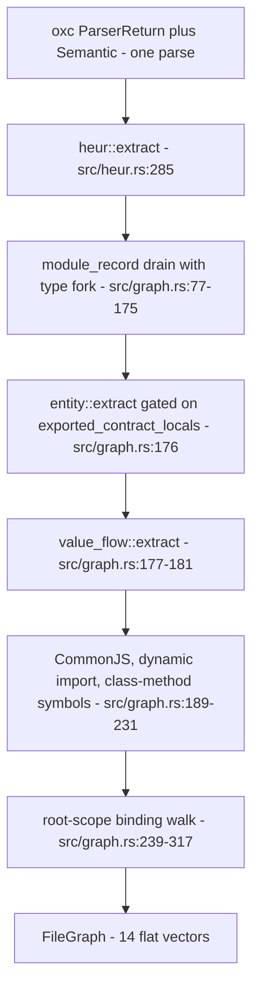
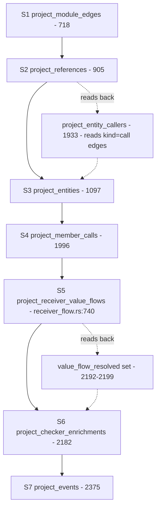

# Structural extraction: entities, symbols, and graph edges

Structural analysis in jscout is two halves with a table boundary between them. Extraction runs once per file over one oxc parse and writes flat, source-local rows — symbols, references, member calls, events, entity sites, value flows — with no knowledge of any other file. Projection then reads every one of those tables back, resolves them against the repo-wide module graph, mints node keys and edge confidences, and writes a disposable `graph_nodes` / `resolved_edges` pair. The halves carry separate version constants (`entity::EXTRACTION_VERSION = "7"`, `structural::PROJECTION_VERSION = "12"`) because cross-file resolution changes far more often than parsing does, and only the cheap half should be forced to redo work. Along the way TypeScript's type layer is erased from the runtime plane at five distinct points and re-extracted as a parallel documentary plane that no traversal will step through.

## The two version constants

`EXTRACTION_VERSION` lives at `src/entity.rs:14` but governs *all* deterministic extraction, not just entity recognizers. `indexer::ensure_extraction_version` (`src/indexer.rs:634`) compares it against `meta.extraction_version`; on mismatch it runs `UPDATE files SET hash=''`, deletes `resolved_edges` and `graph_nodes`, deletes both `meta.snapshot` and `meta.projection_version` (`src/indexer.rs:648-655`), and republishes the constant — all inside the caller's transaction, so a later acquisition failure restores the old extractor version and snapshot together. Blanking hashes is what forces unchanged files to be parsed again. `PROJECTION_VERSION` (`src/structural.rs:13`) participates in the snapshot digest and in `ProjectionIdentity`; bumping it invalidates only the disposable graph, not the parse.

The 5→7 jump in `EXTRACTION_VERSION` at this baseline came from adding `src/value_flow.rs`, with no entity recognizer changed. That is the clearest evidence the constant is misnamed relative to where it lives: the name says "entity", the contract says "any deterministic extraction output persisted per file".

The whole projection is also skippable. `src/indexer.rs:536-566` compares the previous `ProjectionIdentity` (snapshot + `PROJECTION_VERSION` + `resolution_hash`) against the current one; if they match and no checker batch changed, `rebuild_projection_with_timing` is never called — the identity is merely republished, `outcome.projection_rebuilt = false`, and timing prints `structural-projection=skipped (unchanged)`. This is the common case on a re-index of an untouched tree. Note that `resolution_hash` is written *after* the projection transaction commits (`src/indexer.rs:568-572`), so the all-or-nothing guarantee covers `meta.snapshot` and `meta.projection_version` but not that third identity component.

## Per-file extraction

`graph::extract(ret, semantic) -> FileGraph` (`src/graph.rs:71`) runs four visitors over one AST in a fixed order, then does the binding walk itself.

`HEUR` goes first because oxc's module record cannot see CommonJS, and later stages need its output merged in before the binding walk resolves import locals. It recognizes `require` destructuring (`src/heur.rs:126`), `module.exports` / `exports.X` assignment (157), string-keyed event wiring against six `EMIT_METHODS` and seven `LISTEN_METHODS` (`src/heur.rs:79-95`), every static member call with six exact byte offsets plus a `receiver_unbound` flag (`src/heur.rs:198-246`), statically named methods of named classes (248), and `import()` with a static specifier (267).

`REC` drains oxc's module record and forks every import and export row: the contract lists get everything, the runtime lists get only `!entry.is_type` (`src/graph.rs:77-100` for imports, symmetric for exports). `indirect_export_entries` additionally emits a `reexport` `RefRow` (`src/graph.rs:151`). `MERGE` folds `heur`'s requires into `g.imports`, its CommonJS exports into `g.exports`, its dynamic imports into `g.refs` as `use`, and — critically for receiver flow — synthesizes a `SymbolRow` per class method with `kind: "method:{Class}"` and `scope_chain` set to the class name (`src/graph.rs:220-231`). Those synthetic rows are the only reason class methods exist as `sym:` nodes at all.

`WALK` iterates root-scope bindings only. Each non-import binding becomes a `SymbolRow` carrying both the identifier span and the *declaration* span; each resolved reference becomes a `RefRow` classified by `classify_reference` (`src/graph.rs:336`, walking at most four ancestors) into `call | render | extend | use`, with a `member_prop` refinement when the reference is the object of a static member expression. Every `RefRow` extraction emits carries `confidence: "certain"` (literals at `src/graph.rs:154, 210, 296, 308`); the claim is that extraction never *guesses*, not that references are correct. Every downgrade below `certain` originates in cross-file evidence at projection time.

Restricting symbols to root scope keeps node count and key ambiguity bounded, at the cost that closures, block locals, and nested functions never appear as nodes. Their references are attributed upward: `owner_at` (`src/structural.rs:2456`) finds the enclosing declaration by span containment, which is exactly why `SymbolRow` carries `decl_start`/`decl_end` alongside the identifier span.

## Type erasure and the contract plane

The project's stated position — "TypeScript is for humans" — cashes out as: a type-only relation must never imply execution. Erasure is applied at five separate points during extraction.

| # | Site | What is dropped |
|---|---|---|
| 1 | `src/graph.rs:254` | A binding whose flags intersect `TypeAlias \| Interface` emits no `SymbolRow` |
| 2 | `src/graph.rs:277` | A reference whose `flags().is_type_only()` emits no `RefRow` |
| 3 | `src/graph.rs:303` | An import binding with no module-record entry (a type import) emits nothing |
| 4 | `src/graph.rs:85, 175` | `is_type` import/export rows go only to `contract_imports` / `contract_exports` |
| 5 | `src/graph.rs:176` | `entity::extract` receives `exported_contract_locals` — the type-inclusive export set — as its export gate |

Point 5 is the inverse of the others: the type-inclusive set is what *enables* exported-signature contract extraction, so the erased structure comes back as a parallel documentary plane rather than vanishing. That plane is then quarantined at projection. `project_contract_site` stamps `"documentary": true` into the entity meta (`src/structural.rs:1549`), the occurrence detail (1582), and the edge detail (1625). No contract edge kind appears in `workflow_direct_kind` (`src/structural.rs:3059`), `workflow_general_association_kind` (3063), or `workflow_runtime_boundary_kind` (3077), so workflow traversal has no rule that would let it cross one. A second, blunter gate sits in front of all of them: `workflow_logical_steps` drops any incident edge ranking below `likely` (`src/structural.rs:2770`) before it dispatches on kind at all, which is why the `possible` planes — member-name-match, string-event, member candidates — never surface in workflow output either.

The quarantine is not total. `graph_degree` (`src/structural.rs:3395`) counts every row in `resolved_edges` regardless of plane, so a heavily-typed symbol looks like a hub even when none of that degree is runtime. Workflow steps compensate by pinning `hub_floor = 1.0` (`src/structural.rs:2779-2781`) with an inline comment naming the reason. The cost of the documentary plane is also visible in the node inventory: an enum appears twice, once as a runtime symbol and once as a contract declaration.

## Entity sites

`EntitySite` (`src/entity.rs:17`) is deliberately flat: plane, entity type, role, `identity_kind` (`literal` or `reference`), a raw identity name plus offset, an optional target name plus offset, a span, and an `extractor` / `provenance` / `confidence` triple naming which recognizer fired and how much to trust it. The trust is set by the push helper, not by the recognizer: `push_general` hardcodes `likely` (`src/entity.rs:150`), `push_contract_references` hardcodes `certain` with provenance `type-syntax` (`src/entity.rs:202`), and `push_contract_declaration` takes trust as a `(provenance, confidence)` tuple parameter (`src/entity.rs:155-180`) while hardcoding `extractor: "contract-declaration"` for every caller. That last detail matters when reading the table below: in the contract-declaration rows the named string is a *provenance*, not an extractor, unlike every other row.

| Plane | Entity type | Role | Recognizer (extractor unless noted) | Confidence |
|---|---|---|---|---|
| runtime | registry | registered_handler | `twenty-define-logic-function` (324) | likely |
| runtime | registry | dispatch_site | `twenty-logic-function-dispatch` (937) | likely |
| runtime | data_lifecycle | lifecycle_listener | `twenty-database-event-trigger` (352) | likely |
| runtime | data_lifecycle | lifecycle_producer | `graphql-mutation-lifecycle` (391) | likely |
| runtime | job | job_producer / job_handler | `queue-cron-call` (457) | likely |
| runtime | job | job_handler | `job-handler-decorator` (766), `queue-worker-constructor` (1026) | likely |
| runtime | di_token | provider | `di-provider-object` (725) | likely |
| runtime | di_token | injection_site | `di-inject-decorator` (766) | likely |
| general | route | route_handler | `http-router-call` (498), `http-route-decorator` (667) | likely |
| general | graphql_operation | graphql_operation | `graphql-client-operation` (525) | likely |
| general | graphql_operation | graphql_handler | `graphql-operation-decorator` (691) | likely |
| general | environment_variable | environment_read | `environment-api-call` (547), `process-env-member` (974), `process-env-computed-member` (994) | likely |
| general | config_key | config_read | `configuration-api-call` (566) | likely |
| general | feature_flag | feature_flag_check | `feature-flag-call` (586) | likely |
| general | database_resource | database_read / _write / _acquire | `database-api-call` (601) | likely |
| general | external_host | external_host_call | `static-url-call` (624) | likely |
| contract | interface / type_alias / enum | contract_declaration | provenance `type-declaration` (833 / 857 / 881) | certain |
| contract | schema | contract_declaration | provenance `validation-schema-pattern` (800), `dto-schema-pattern` (901) | likely |
| contract | reference | contract_reference / parameter_contract / return_contract | `typescript-contract-reference` (190-205) | certain |
| contract | decorator | decorator_use | `decorator-contract` (1048) | certain |

Line numbers are `src/entity.rs`. `TypeReferenceVisitor` (`src/entity.rs:64`) nests inside `EntityVisitor` for annotation walking; it drops 27 builtin wrappers and any bound type parameter, so `Promise<User>` yields exactly one reference, to `User`.

## Projection

`rebuild_projection_with_timing` (`src/structural.rs:476`) does its three reads — `load_files`, `ModuleGraph::load_with_contracts`, `load_symbols` — *before* `BEGIN IMMEDIATE` (`src/structural.rs:481-483`), so the write lock is held only for the write. Inside the transaction it deletes exactly three tables (`resolved_edges`, `graph_nodes`, `entities` at 496-498; `entity_occurrences` and `entity_edges` vanish by FK cascade), inserts one file node per file (505) and one symbol node per symbol (517), then runs seven stages, and finally upserts `meta.snapshot` and `meta.projection_version` (606-615). Any stage error rolls back (618-624), leaving the previous snapshot in place.

Two of the dotted arrows are load-bearing orderings, not conveniences. `project_entity_callers` (`src/structural.rs:1933`) queries `resolved_edges WHERE kind='call'` — rows that only exist because `S2` already ran — to collapse producer helpers into `produces_lifecycle_via` / `produces_job_via` edges, which is what buys two-hop worker recall. And `S6` pre-scans `resolved_edges` once for `provenance='receiver-value-flow' AND confidence='likely'`, collecting `source_ref_id` (a `member_calls` rowid) into `value_flow_resolved`, then skips any checker fact for an occurrence in that set (`src/structural.rs:2286-2288`). Reordering `S5` after `S6` would silently emit two `member_call` edges for the same call site.

### Node kinds

Eight kinds exist in `graph_nodes.node_kind`. Key formats are minted by the functions at `src/structural.rs:3683-3784`; every component that could contain a delimiter passes through `encode_key_component` (3771), which percent-escapes anything outside `[A-Za-z0-9._\-/@]`, so the literal templates below are the shape, not the byte sequence.

| Kind | Key format | Minted at |
|---|---|---|
| `file` | `file:{path}` | 3683 |
| `symbol` | `sym:{path}#{scope}::{name}@{ordinal}` | 3783 |
| `package` | `pkg:{name}@{version}#{digest8}` (dependency instance) / `pkg:{name}` (bare hub) | 3691 / 3687 |
| `entity` | `entity:{type}:{name}` (literal identity) / `entity:{type}:ref-{digest16}` | 3709 / 3756 |
| `contract` | `contract:{type}:{path}#{name}`, `:ref-{digest16}`, `:external:{request}#{name}`, `:unresolved:{request}#{name}` | 3713 / 3721 / 3736 / 3744 |
| `member_hub` | `member:unknown:{prop}` | 3705 |
| `event_hub` | `event:unknown:{name}` | 3701 |
| `event_site` | `event-site:{path}:{event_id}` | 2414 |

Symbol identity is minted at projection, never at extraction. `load_symbols` (`src/structural.rs:661`) re-sorts in Rust by `(path, scope, name, decl_start, id)` (686) and assigns a 1-based ordinal per `(file_id, scope, name)`. Sorting by `path` rather than `file_id` keeps file renumbering out of the key — but `id` is the SQLite rowid and remains the final tiebreaker, so the "rowids never leak" property holds only when no two same-named symbols in the same file and scope share a `decl_start`.

Reference-identity entities key on a blake3 of the joined resolved target keys, falling back to `{path}\0{name}` when nothing resolved (`reference_entity_key`, 3756). That hash is what lets a dispatch site and its handler collapse onto one node so a producer and a consumer can meet. The costs are that keys are unreadable, and that a site whose reference did not resolve joins with nothing across files.

### Edge kinds

| Stage | Kinds | Source → target | Confidence / provenance |
|---|---|---|---|
| S1 | `contains_module` | package hub → file | `certain` / `dependency-index` |
| S1 | `import`, `imports_types` | file → file, package-instance hub, or bare package hub | six-way `(type_only, resolution)` table at 862-869 |
| S1 | `imports_package`, `imports_package_types` | file → package-instance hub | same table |
| S2 | `call`, `render`, `extend`, `use`, `reexport` | symbol/file → symbol, or → package hub | `semantic+resolver` \| `-inferred` \| `-candidate` |
| S3 | `dispatches`, `produces_lifecycle`, `produces_job`, `injects`, `invokes_graphql`, `reads_env`, `reads_config`, `reads_resource`, `writes_resource`, `acquires_resource`, `checks_flag`, `calls_host` | symbol → entity | site provenance, `likely` |
| S3 | `produces_lifecycle_via`, `produces_job_via` | caller → entity | `entity-boundary-collapse` |
| S3 | `registered_handler`, `lifecycle_listener`, `job_handler`, `provides`, `handles_route`, `handles_graphql` | entity → symbol | site provenance, or `registration-site-fallback` / `provider-site-fallback` |
| S3 | `declares_contract`, `accepts_contract`, `returns_contract`, `decorated_by`, `references_contract` | symbol/file → contract | `documentary: true` on all three JSON blobs |
| S4 | `member_call` (caller → hub), `member_candidate` (hub → symbol) | | `possible` / `member-name-match` |
| S5 | `member_call` | symbol → symbol (file key if `owner_at` finds nothing) | `likely` / `receiver-value-flow` |
| S6 | `member_call` | symbol → symbol (same fallback) | `likely \| possible` / `checker` |
| S7 | `contains_event` | file → event site | `certain` / `syntax` |
| S7 | `emits`, `listens` | event site ↔ event hub | `possible` / `string-event` |

`S6` can never be `certain`: `checker_enrichments.confidence` is `CHECK(confidence IN ('likely','possible'))` (`src/store.rs:722`) and the stage only ever downgrades from there.

Stage 1's package-instance hub (`src/structural.rs:794`) and `contains_module` edge (817-832) are gated on `crosses_dependency_boundary` (787-789) — the edge's package instance must differ from the source file's own instance — so an import between two files inside the same dependency mints neither. `imports_package` / `imports_package_types` additionally require `to_id.is_some()` (881-884), so a dependency import that failed to resolve to an indexed file gets the plain `import` edge to the hub and nothing else.

Stage 4 is the graph's densest region and its bluntest instrument: for every `member_calls` row whose property name matches any symbol name anywhere in the repo, it mints a `member:unknown:{prop}` hub once and a `member_candidate` edge to each same-named symbol, then one `member_call` edge from the caller to the hub. A property matching no symbol name anywhere mints nothing at all (`src/structural.rs:2039-2041`). Routing through a hub rather than fabricating N direct call edges makes the ambiguity structurally visible and rankable, but the density is held back only by `possible` confidence and hub damping.

### The confidence lattice

`certain > likely > possible`, ranked by `confidence_rank` (`src/structural.rs:3674`) for traversal gates and weighted 1.0 / 0.6 / 0.3 by `confidence_weight` (3404) for scoring. `lower_confidence` (1982) is the meet operation used on the entity and contract paths, enforcing that a projected edge is never more confident than any input it composed. `project_references` does not use it — it downgrades inline (`src/structural.rs:1050-1063`): an ambiguous root symbol fans out one `possible` edge per candidate with provenance `semantic+resolver-candidate`; a workspace-inferred module hop or an inferred export hop drops `certain` to `likely` with `semantic+resolver-inferred`; zero targets emit no edge at all (1047-1049).

The three values are CHECK-constrained on `entity_sites` (`src/store.rs:531`), `entity_occurrences` (562), and `entity_edges` (575). They are *not* constrained on `resolved_edges.confidence` (641), and `entities` has no confidence column at all (538-546) — trust lives on occurrences and edges, not on the canonical entity.

## Where receiver flow fits

Stage 5 is new at this baseline and is the only stage that resolves a method receiver without a type checker. Extraction lives in `src/value_flow.rs` (838 lines, called at `src/graph.rs:177-181`); resolution lives in `src/structural/receiver_flow.rs` (936 lines, declared `mod receiver_flow;` at `src/structural.rs:3796`). The mechanism — which lexical shapes are accepted, the superclass walk, the member blockers, the ≤3 caps — is the subject of [04-value-flow.md](04-value-flow.md) and is not repeated here. What matters structurally is the seam.

`ValueFlowCatalog::load` (`src/structural/receiver_flow.rs:54`) reads five tables once per rebuild — `function_return_flows`, `value_binding_flows`, `class_value_flows`, `instance_method_value_flows`, `class_member_value_flow_blockers` — so the recursive class and factory resolution is map lookups plus point queries on `refs`. The stage's own statement (777) then streams `receiver_value_flows` and joins each row to its `member_calls` row by *exact* call span. Binding resolution goes through `ModuleGraph::resolve_export_exact` (`src/query.rs:151`), which is strictly narrower than `resolve_export_traced`: it refuses workspace-inferred edges and ambiguous `export *` branches and returns `Some` only for exactly one candidate. The strictness is deliberate — this stage suppresses a later checker pass, so it must not close an occurrence on a binding it only guessed at.

Emission is at `src/structural/receiver_flow.rs:922-932`: a direct symbol→symbol `member_call` edge at `likely` with provenance `receiver-value-flow`, `source_ref_id` set to the `member_calls` rowid, and a detail blob carrying `memberCallId`, all three span pairs, the flow kind, the resolved receiver classes, `candidateCount`, and `occurrenceSpecific: true`. That `source_ref_id` is how `S6` finds the occurrences to skip.

The tradeoff is stated plainly by the code's own ordering: a `likely` value-flow edge displaces a checker fact that might have been more confident, and might have named a different target. The payoff is one edge per occurrence instead of two, and not paying the TypeScript sidecar for calls that syntax alone can close.

## Sharp edges

- `resolved_edges.source_ref_id` is overloaded. `project_references` writes a `refs.id` there (`src/structural.rs:1087`); `project_checker_enrichments` (2355) and `project_receiver_value_flows` (929) write a `member_calls` rowid. Consumers must disambiguate by provenance — the suppression scan at 2192-2199 depends on exactly that.
- `EntityVisitor.static_strings` is file-global and single-pass (`src/entity.rs:49-52`, populated at 790), so a constant declared *after* its use site does not fold: `router.get(ROUTE, h)` above `const ROUTE = '/x'` yields no route site.
- `is_general_callee` (`src/entity.rs:1348`) admits every HTTP method name, so one call expression can legitimately emit several general sites; the recognizers are separated only by receiver-path guards (`is_router_holder` 1242, `is_config_api_path` 1279, `database_call` 1399).
- Symbol ordinals are positional. Inserting a second same-named symbol earlier in a file shifts every later ordinal, so a stored anchor can silently rebind. `expected_snapshot` plus the `"re-resolved"` status mitigates this; it does not eliminate it. Relatedly, `resolve_anchor` (`src/structural.rs:3504`) checks `starts_with("sym:") && stale` *before* `graph_node_exists` (3514), so a stale `sym:` anchor is re-parsed and re-resolved by `(path, scope, name)` even when that exact key still exists — exact-key match wins only when the caller passed no `expected_snapshot`, or one equal to the current snapshot.
- The `projected_edges` dedup set (`src/structural.rs:1119`) covers only the runtime and general arms of `project_entities` (1278, 1366). `project_contract_site` never touches it; its `insert_edge` (1641-1653) is guarded only by `source != entity_key`, so two contract sites in one symbol referencing the same type write two identical `(source, target, kind)` rows. Stage 5 likewise does not dedupe across occurrences, so repeated calls in one symbol each add a row and inflate `graph_degree`.
- Inline route and GraphQL handlers with no resolvable symbol target emit the entity occurrence but no handler edge (`src/structural.rs:1310-1324`) — the route stays findable but not traversable. Decorator-based handlers do take a site fallback and mark `detail.targetResolution = "site-fallback"`. Decorator sites attach forward to the next declaration for only three extractors and only within 512 bytes (1664-1679); a decorator with a large inline payload degrades to the containing file as its edge source.
- Stage 6 has gates beyond the batch, offset, and fingerprint checks: a `checker_occurrence_coverage` entry must exist for the occurrence (`src/structural.rs:2289`) or the fact is dropped, and `current_path != path` is re-checked at 2300. It now accepts run status `IN ('completed','partial')` (2223) where it previously required `completed`, and a per-occurrence status of `failed` (2166) forces the projection down to `possible`.

## Test coverage

There are no unit tests in `graph.rs`, `heur.rs`, or `value_flow.rs`; those paths are covered end-to-end. `src/structural/tests.rs` holds 38 `#[test]` functions across 2,438 lines, each writing a temp repo, running the indexer, rebuilding the projection, and asserting node/edge shape. Fifteen of them arrived with stage 5 (1607-2335), covering `this` receivers, one-hop inheritance, depth-two factories, awaited-thenable rejection, the `with` / `eval` / sloppy-redeclaration bailouts, exported const values, the three-class cap versus four, decorator and static-property mutation rejection, namespace factories, instance-field and member-blocker handling, exact non-heuristic export resolution, workspace-inferred edge rejection, and removal when a const becomes unsupported. Older pins worth naming: two-hop worker recall through `produces_lifecycle_via` (346), inline route handlers not attaching to the next declaration (958), contract-plane resolution through type-only barrels (750), deterministic ordering of parallel edges (56), the path prefix-state cap (190), per-occurrence checker projection alongside member hubs (1187), and checker batch removal after a snapshot change (1436). `src/entity/tests.rs` adds 10 recognizer unit tests in 374 lines.
