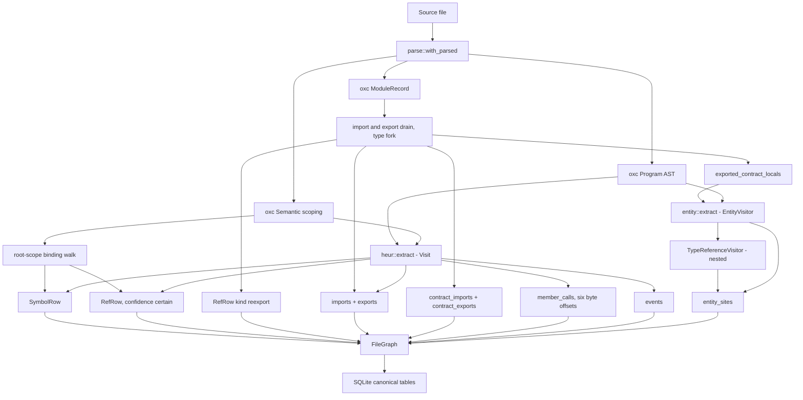
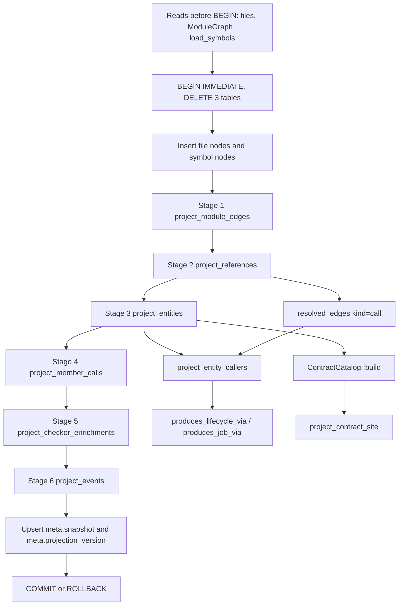
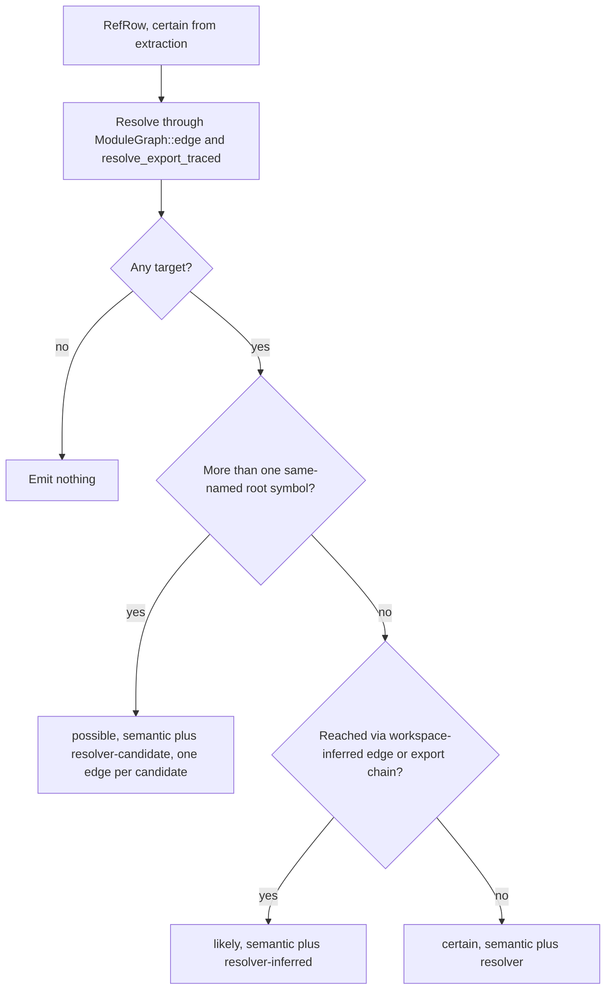

# Structural extraction: entities, symbols, and graph edges

Structural extraction turns one parsed JS/TS file into flat, source-local fact rows — symbols, imports, exports, references, member calls, event sites, entity sites — and writes them verbatim into SQLite. A later, separate pass reads those rows back out across the whole repository and re-resolves them into a keyed node/edge graph in `graph_nodes` and `resolved_edges`, attaching a confidence level and a provenance string to every edge it mints. The split exists because cross-file resolution and node-key formats change far more often than parsing does, and the two halves are versioned independently: `entity::EXTRACTION_VERSION` (`src/entity.rs:14`, currently `"5"`) forces a full reparse when bumped, while `structural::PROJECTION_VERSION` (`src/structural.rs:13`, currently `"11"`) only invalidates the disposable graph. TypeScript type information is erased from the runtime side of this pipeline at five specific points and re-extracted, deliberately, as a parallel documentary plane that can be read but never traversed as runtime behavior.

## Stage one: three passes over one AST

`indexer::extract_file` (`src/indexer.rs:662`) parses the source once inside `parse::with_parsed` and calls `graph::extract(ret, semantic)` (`src/graph.rs:67`), which returns a `FileGraph` (`src/graph.rs:49`). `graph::extract` is not itself a `Visit` implementation. It does three things in a fixed order: runs the heuristic visitor first (`src/graph.rs:70`), drains oxc's `module_record` for imports and exports (`src/graph.rs:73-171`), and then walks the root scope's bindings for symbols and their resolved references (`src/graph.rs:238-309`). The entity visitor is invoked in between, at `src/graph.rs:172`, because it needs the export set the module-record drain just computed.

The import drain forks every entry: each `import_entries` row becomes a `contract_imports` row unconditionally, and only `!entry.is_type` also becomes an `imports` row (`src/graph.rs:73-88`). The three export loops fork the same way — `local_export_entries` (93-121), `indirect_export_entries` (122-156), `star_export_entries` (157-171). The indirect loop additionally emits a `RefRow` with `kind: "reexport"` (`src/graph.rs:147-155`), which is how a barrel file's re-export becomes a traversable edge rather than a dangling name. Two export-local sets are accumulated: `exported_contract_locals` collects only from `local_export_entries` and only when `ExportLocalName::Name` matches, so `export default` contributes nothing (`src/graph.rs:99-106`); `exported_locals` takes the runtime subset and is then extended by CommonJS `module.exports` names at `src/graph.rs:189`. So the contract lists are a superset of the runtime lists for ES module syntax only — CommonJS bindings enter the runtime lists alone.

The binding walk iterates `scoping.get_bindings(root_scope_id())` (`src/graph.rs:231-236`). Root bindings only: nested functions, block locals, and closures never become symbol nodes. That is a real modelling loss, mitigated later — a reference inside a closure is attributed to the enclosing root declaration by `owner_at` (`src/structural.rs:2410`), which picks the smallest declaration span containing the byte offset. `SymbolRow` therefore carries two spans (`src/graph.rs:11-19`): `(start, end)` is the identifier, `(decl_start, decl_end)` is the whole declaration, and it is the declaration span that makes containment attribution work at all.

The heuristic pass, `heur::extract` (`src/heur.rs:285`), is a genuine `Visit` (`src/heur.rs:125`) covering exactly what a checkerless graph cannot bind through the module record: `require` destructuring in `visit_variable_declarator` (126), `module.exports`/`exports.X` assignment in `visit_assignment_expression` (157-196), string-keyed event wiring matched against six `EMIT_METHODS` and seven `LISTEN_METHODS` (`src/heur.rs:79-95`, dispatched at 216-218), every static member call with six exact byte offsets (`src/heur.rs:32-52`, populated at 198-243), statically named `MethodDefinition`s in named classes (248-265), and `import()` with a static specifier (267-282). It needs `Semantic` for one question only: whether the receiver base identifier is unbound in the file's scope tree, answered at `src/heur.rs:204-208`, which is what separates a genuine global (`console`, a CommonJS `module`) from a parameter that happens to share the name. Its class methods are the single exception to root-scope-only symbols — `src/graph.rs:211-222` turns each into a `SymbolRow` with `kind: "method:{Class}"` and `scope_chain: {Class}`.

The third pass, `entity::extract` (`src/entity.rs:1073`), runs `EntityVisitor` over the program with the contract-superset export set. A fourth visitor, `TypeReferenceVisitor` (`src/entity.rs:64`), runs nested inside it over type annotations and type declarations.

The diagram below shows how the three passes feed one `FileGraph`. Note that `HEUR` runs before the module-record drain, that the type fork produces two parallel import/export lists, and that `ECL` — the contract-superset export set — is what gates entity extraction.

Every `RefRow` that leaves `BIND` or `HEUR` carries `confidence: "certain"` (the literals are at `src/graph.rs:150, 201, 287, 299`; the field and its comment are at `src/graph.rs:43`). This is not a claim that every reference is correct — it is the statement that extraction never guesses. All downgrading happens at projection, from cross-file evidence extraction does not have.

## What happens to TypeScript type information

Erasure is applied at four points in `graph.rs` and one in the export fork, and it is narrower than it first looks.

| Site | What is erased | What survives |
|---|---|---|
| `src/graph.rs:245-247` | Root bindings whose flags intersect `SymbolFlags::TypeAlias \| SymbolFlags::Interface` produce no `SymbolRow` | `enum`, `namespace`, and ambient `declare const/function/class` bindings still produce runtime `SymbolRow`s |
| `src/graph.rs:268-270` | References with `is_type_only()` produce no `RefRow` | Value-position references to a type-adjacent symbol |
| `src/graph.rs:294` | An import binding with no module-record entry (a type import) emits nothing at all — the third match arm | — |
| `src/graph.rs:73-88, 108-121, 145-156, 167-170` | `entry.is_type` rows are kept out of `imports`/`exports` | The same rows land in `contract_imports`/`contract_exports` |
| `src/graph.rs:99-106, 172` | — | `exported_contract_locals` is the type-inclusive export set handed to `entity::extract`, so a type-only export still enables exported-signature contract extraction |

The filter at 245-247 sits inside the `if !is_import` branch, and it names only two flags. A TypeScript `enum` therefore appears twice in the model: as a runtime symbol node (because `enum` is a value at runtime) and as a `contract`-plane declaration site (`src/entity.rs:879-893`). That asymmetry is correct — a `const enum` is erased, a plain `enum` is not — but the code does not distinguish them on the graph side.

The contract plane re-extracts the erased structure as a parallel fact set. `TypeReferenceVisitor` keeps it honest in two ways. It maintains a stack of bound type-parameter names, pushed and popped around function types (`src/entity.rs:82-86`), constructor types (88-92), and mapped types (94-98), with `is_bound` scanning the stack in reverse (127-133), so a generic `T` is never recorded as a reference to some unrelated declaration named `T`. And it drops 27 builtin wrappers — `Array`, `Promise`, `Record`, `Pick`, `Awaited`, `Map`, `Date`, `RegExp`, and the rest — at `src/entity.rs:1113-1144`, so `Promise<User>` yields one reference to `User` rather than two.

Quarantine is enforced on the projection side. `project_contract_site` stamps `"documentary": true` into the entity meta, the occurrence detail, and the graph edge detail (`src/structural.rs:1528, 1561, 1604`). No contract edge kind appears in `workflow_direct_kind` (`src/structural.rs:3013`), `workflow_general_association_kind` (3017), or `workflow_runtime_boundary_kind` (3031), so workflow traversal never selects one as a step. That is the step-selection guarantee only; contract edges still count toward `graph_degree` (`src/structural.rs:3351`), which is exactly why the workflow code forces `hub_floor = 1.0` with a comment stating that symbol degree includes documentary and file-projection edges (`src/structural.rs:2733-2735`). Contract edges remain fully visible to `neighborhood` and `paths`.

## Entity site inventory

`EntitySite` (`src/entity.rs:17-31`) is a flat record carrying `plane`, `entity_type`, `role`, `identity_kind`, an identity name that is raw source text rather than a key, an optional target name, a span, and the `extractor`/`provenance`/`confidence` triple that names which recognizer fired and how far it can be trusted. `entity_sites` CHECK-constrains `plane` to `runtime|contract|general`, `identity_kind` to `literal|reference`, and `confidence` to `certain|likely|possible` (`src/store.rs:405, 408, 415`). The recognizers are deliberately narrow; each names a framework or convention.

Runtime plane — every one is `likely`:

| entity_type | role | extractor | provenance | Site |
|---|---|---|---|---|
| `registry` | `registered_handler` | `twenty-define-logic-function` | `framework-pattern` | `src/entity.rs:325` |
| `registry` | `dispatch_site` | `twenty-logic-function-dispatch` | `framework-field` | `src/entity.rs:938` |
| `data_lifecycle` | `lifecycle_listener` | `twenty-database-event-trigger` | `framework-pattern` | `src/entity.rs:353` |
| `data_lifecycle` | `lifecycle_producer` | `graphql-mutation-lifecycle` | `naming-convention` | `src/entity.rs:392` |
| `job` | `job_producer` or `job_handler` | `queue-cron-call` | `runtime-api-pattern` | `src/entity.rs:458` |
| `job` | `job_handler` | `job-handler-decorator` | `decorator-pattern` | `src/entity.rs:767` |
| `job` | `job_handler` | `queue-worker-constructor` | `runtime-api-pattern` | `src/entity.rs:1027` |
| `di_token` | `provider` | `di-provider-object` | `provider-object-pattern` | `src/entity.rs:726` |
| `di_token` | `injection_site` | `di-inject-decorator` | `decorator-pattern` | `src/entity.rs:767` |

General plane — all `likely`, because `push_general` hardcodes it (`src/entity.rs:150`):

| entity_type | role | extractor | provenance | Site |
|---|---|---|---|---|
| `route` | `route_handler` | `http-router-call` | `routing-api-pattern` | `src/entity.rs:499` |
| `route` | `route_handler` | `http-route-decorator` | `routing-decorator-pattern` | `src/entity.rs:668` |
| `graphql_operation` | `graphql_operation` | `graphql-client-operation` | `graphql-api-pattern` | `src/entity.rs:526` |
| `graphql_operation` | `graphql_handler` | `graphql-operation-decorator` | `graphql-decorator-pattern` | `src/entity.rs:692` |
| `environment_variable` | `environment_read` | `environment-api-call` | `environment-api-pattern` | `src/entity.rs:548` |
| `environment_variable` | `environment_read` | `process-env-member` | `environment-syntax` | `src/entity.rs:975` |
| `environment_variable` | `environment_read` | `process-env-computed-member` | `environment-syntax` | `src/entity.rs:995` |
| `config_key` | `config_read` | `configuration-api-call` | `configuration-api-pattern` | `src/entity.rs:567` |
| `feature_flag` | `feature_flag_check` | `feature-flag-call` | `feature-flag-api-pattern` | `src/entity.rs:587` |
| `database_resource` | `database_read` / `database_write` / `database_acquire` | `database-api-call` | `database-api-pattern` | `src/entity.rs:602` |
| `external_host` | `external_host_call` | `static-url-call` | `network-api-pattern` | `src/entity.rs:625` |

Contract plane:

| entity_type | role | extractor | provenance | confidence | Site |
|---|---|---|---|---|---|
| `interface` | `contract_declaration` | `contract-declaration` | `type-declaration` | `certain` | `src/entity.rs:833` |
| `type_alias` | `contract_declaration` | `contract-declaration` | `type-declaration` | `certain` | `src/entity.rs:857` |
| `enum` | `contract_declaration` | `contract-declaration` | `type-declaration` | `certain` | `src/entity.rs:881` |
| `schema` | `contract_declaration` | `contract-declaration` | `validation-schema-pattern` | `likely` | `src/entity.rs:800` |
| `schema` | `contract_declaration` | `contract-declaration` | `dto-schema-pattern` | `likely` | `src/entity.rs:901` |
| `reference` | `contract_reference` / `parameter_contract` / `return_contract` | `typescript-contract-reference` | `type-syntax` | `certain` | `src/entity.rs:190-205` |
| `decorator` | `decorator_use` | `decorator-contract` | `decorator-syntax` | `certain` | `src/entity.rs:1049` |

`push_contract_references` hardcodes `certain`/`type-syntax` (`src/entity.rs:202-203`) because a type reference is proven by syntax alone; `push_contract_declaration` takes trust as a parameter (`src/entity.rs:161, 176-177`) so type declarations are `certain` while inferred schema patterns are `likely`.

Two recognizer limits are worth stating plainly. `EntityVisitor.static_strings` is file-global and single-pass, populated in `visit_variable_declarator` (`src/entity.rs:790-793`), and the comment at `src/entity.rs:49-51` says so: a constant declared *after* its use site does not fold, so `router.get(ROUTE, h)` above `const ROUTE = '/x'` produces no route site. And `is_general_callee` (`src/entity.rs:1348`) admits every HTTP method name, so `config.get('k')`, `router.get('/x', h)`, and `repo.find(...)` all enter `extract_general_call` and are separated only by receiver-path guards (`is_router_holder` 1242, `is_config_api_path` 1279, `database_call` 1399). One call expression can legitimately emit more than one general site.

## Stage two: projection

`rebuild_projection_with_timing` (`src/structural.rs:474`) does its three reads *before* opening a transaction — `load_files`, `ModuleGraph::load_with_contracts`, `load_symbols` at `src/structural.rs:479-481` — then `BEGIN IMMEDIATE` and deletes exactly three tables: `resolved_edges`, `graph_nodes`, `entities` (`src/structural.rs:492-496`). Occurrences and entity edges disappear by foreign-key cascade. It inserts file nodes and symbol nodes (503-531), runs six stages, upserts `meta.snapshot` and `meta.projection_version` (589-598), and commits, or rolls the whole thing back on any stage error (601-607). Note what it does *not* write: `meta.resolution_hash` is upserted by the indexer, outside this transaction, at `src/indexer.rs:567-571`.

The diagram shows the six stages and the one ordering dependency that makes the order load-bearing.

`PEC` is the dependency: `project_entity_callers` (`src/structural.rs:1912`) queries `resolved_edges WHERE dst_key=?1 AND kind='call'` (1922-1927) to collapse a producer helper into `produces_lifecycle_via`/`produces_job_via` edges from each of its callers straight to the entity. It finds anything only because stage 2 already wrote the call edges into the same transaction. Reorder the stages and the two-hop worker recall silently disappears; the test at `src/structural/tests.rs:346` pins it.

Symbol identity is minted here, not at extraction. `load_symbols` (`src/structural.rs:644`) re-sorts raw rows by `(path, scope, name, decl_start, id)` (664-668) — path, not `file_id`, so rowids never leak into identity — and assigns a 1-based ordinal per `(file_id, scope, name)` (671-677), producing `sym:{path}#{scope}::{name}@{ordinal}` (`symbol_key`, `src/structural.rs:3737`). `parse_symbol_key` (3741) reverses it so a stale anchor can be re-parsed and re-resolved. The tradeoff is positional: inserting a second same-named symbol earlier in a file shifts the ordinals of later ones, so an anchor can silently rebind — mitigated by `expected_snapshot` and the `"re-resolved"` status, not eliminated.

## Node and edge inventories

Node kinds, exhaustive:

| Node kind | Key format | Minted at |
|---|---|---|
| `file` | `file:{path}` | `src/structural.rs:506`, key at 3637 |
| `symbol` | `sym:{path}#{scope}::{name}@{ordinal}` | 516, key at 3737 |
| `package` (dependency instance) | `pkg:{name}@{version}#{digest8}` | 774, key at 3645 |
| `package` (bare hub) | `pkg:{name}` | 825, key at 3641 |
| `entity` | `entity:{type}:{name}` or `entity:{type}:ref-{digest16}` | 1177, keys at 3663 / 3710 |
| `contract` | `contract:{type}:{path}#{name}`, `…:ref-{digest16}`, `…:external:{request}#{name}`, `…:unresolved:{request}#{name}` | 1546, keys at 3667, 3675, 3690, 3698 |
| `member_hub` | `member:unknown:{prop}` | 2022, key at 3659 |
| `event_hub` | `event:unknown:{name}` | 2355, key at 3655 |
| `event_site` | `event-site:{path}:{event_id}` | 2369, formatted inline at 2368 |

`encode_key_component` (`src/structural.rs:3725`) percent-escapes every byte outside `[A-Za-z0-9._\-/@]`, so the `#`, `:` and `@` separators stay unambiguous. Literal-identity entities key on the name; reference-identity entities key on a blake3 of the joined resolved target keys, falling back to `{path}\0{name}` when nothing resolved (`reference_entity_key`, `src/structural.rs:3710-3723`). That collapse is the point of the plane — two dispatch sites naming the same imported symbol become one entity so the producer and the handler meet at a shared node — and its cost is that unresolved references never join across files, and that no human can read a target off the key.

Edge kinds, exhaustive, by stage:

| Stage | Kind | Direction | Confidence / provenance |
|---|---|---|---|
| 1 | `contains_module` | package instance → file | `certain` / `dependency-index` (`src/structural.rs:800-810`) |
| 1 | `import`, `imports_types` | file → file or package hub | 6-way table below (`src/structural.rs:849-859`) |
| 1 | `imports_package`, `imports_package_types` | file → package instance | same 6-way table (`src/structural.rs:864-878`) |
| 2 | `call`, `render`, `extend`, `use`, `reexport` | symbol or file → symbol or package | `semantic+resolver`, `semantic+resolver-inferred`, or `semantic+resolver-candidate` (`src/structural.rs:1029-1070`) |
| 3 | `dispatches`, `produces_lifecycle`, `produces_job`, `injects`, `invokes_graphql`, `reads_env`, `reads_config`, `reads_resource`, `writes_resource`, `acquires_resource`, `checks_flag`, `calls_host` | symbol or file → entity | site confidence / site provenance (`src/structural.rs:1235-1256`) |
| 3 | `produces_lifecycle_via`, `produces_job_via` | caller symbol → entity | met confidence / `entity-boundary-collapse` (`src/structural.rs:1942-1956`) |
| 3 | `registered_handler`, `lifecycle_listener`, `job_handler`, `provides`, `handles_route`, `handles_graphql` | entity → symbol | site provenance, or `registration-site-fallback` / `provider-site-fallback` (`src/structural.rs:1305-1335`) |
| 3 | `declares_contract`, `accepts_contract`, `returns_contract`, `decorated_by`, `references_contract` | file, contract, or symbol → contract | site confidence, `documentary: true` (`src/structural.rs:1592-1618`) |
| 4 | `member_candidate` | member hub → symbol | always `possible` / `member-name-match` (`src/structural.rs:2039-2053`) |
| 4 | `member_call` | symbol or file → member hub | always `possible` / `member-name-match` (`src/structural.rs:2059-2075`) |
| 5 | `member_call` | symbol → symbol | `certain` or `possible` / `checker` (`src/structural.rs:2303-2324`) |
| 6 | `contains_event` | file → event site | always `certain` / `syntax` (`src/structural.rs:2379-2389`) |
| 6 | `emits`, `listens` | event site ↔ event hub | always `possible` / `string-event` (`src/structural.rs:2390-2405`) |

The import confidence table at `src/structural.rs:841-848` is a plain six-way match on `(type_only, resolution)`: `(true, "workspace-inferred") → (likely, type-workspace-inferred)`, `(true, "workspace") → (certain, type-workspace)`, `(true, _) → (certain, type-resolver)`, `(false, "workspace-inferred") → (likely, workspace-inferred)`, `(false, "workspace") → (certain, workspace)`, `(false, _) → (certain, resolver)`. The comment above it states the reason: heuristic workspace mappings (mirrored `dist` layouts, source-name search) are leads, not proven links, and never project as certain.

## Where confidence is lowered

The lattice is `certain > likely > possible`, ranked by `confidence_rank` (`src/structural.rs:3628`) and weighted 1.0/0.6/0.3 by `confidence_weight` (3358). `lower_confidence` (`src/structural.rs:1961-1973`) is a meet, but it is not the universal mechanism — `project_references` downgrades inline instead (1029-1042), never calling it. The invariant that a projected edge is no more confident than any input it composed happens to hold, but it is enforced by two separate pieces of code.

An ambiguous reference fans out: one edge per candidate, all `possible` (`src/structural.rs:1059-1071`), which is why `ProjectedTargets` (`src/structural.rs:83`) carries the key list and the `ambiguous` flag together — set by `projected_symbols` when more than one root symbol matches (2418-2425). A reference with zero targets emits nothing at all (1026-1028). Stage 5's checker facts drop to `possible` when any project reported `possible` or any project run failed (`src/structural.rs:2295-2300`).

Two attributions deserve precision. A site's source symbol comes from `owner_at` on the declaration spans; when the offset falls in no span, `site_source_symbol` (`src/structural.rs:1636`) returns `None` and the caller falls back to the containing file node. The one forward-looking exception is extractor-gated to `decorator-contract | http-route-decorator | graphql-operation-decorator` (1643-1648) and bounded to 512 bytes (1656), because decorators precede their declaration; a decorator with a large inline payload deliberately degrades to the file rather than attaching to a distant symbol. And a `contract_reference` site resolves its source differently again: `catalog.enclosing` first (`src/structural.rs:1580-1583`, defined at 1438), so a type referenced inside an interface body attributes to that interface, with `site_source_symbol` as the fallback and `file_key` as the last resort.

Stage 3 refuses one fabrication outright. An inline route or GraphQL handler with no resolvable symbol target — `app.get('/x', (req, res) => {…})` — is skipped entirely rather than falling back to the containing file or the next declaration (`src/structural.rs:1288-1303`), pinned by `src/structural/tests.rs:958`. The entity occurrence survives, so the route is findable; the `handles_route` edge does not, so the route is not traversable. Decorator-based handlers, whose target is syntactically adjacent, do take the site fallback and record `detail.targetResolution = "site-fallback"` (1307-1318).

## Cost and skip

`project_member_calls` mints a `member_hub` for every property name that matches *any* symbol name anywhere in the repository, plus a `member_candidate` edge to every same-named symbol (`src/structural.rs:2016-2054`). On a large repo this is the densest region of the graph, held back only by `possible` confidence and `hub_damping` (`src/structural.rs:3402`). Routing through a hub instead of emitting direct symbol→symbol edges makes the ambiguity structurally visible and rankable, at the cost of that fan-out. Stage 5 is the escape: when the TypeScript checker sidecar has resolved a receiver type, `project_checker_enrichments` writes a direct symbol→symbol `member_call` with `occurrenceSpecific: true`, and it gates hard — the batch must be active, its `source_snapshot` must equal the snapshot being built, the project run must be `completed`, the source file must join by `(path, hash)`, `call.rowid` must equal `enrichment.member_call_id`, all six byte offsets must still match, the coverage lookup must hit, and the target fingerprint must recompute (`src/structural.rs:2186-2207, 2255-2268`). A whitespace edit that shifts offsets silently retires the fact — that is the intended failure mode for durable facts pointing into a disposable graph.

Finally, the whole rebuild is usually skipped. `src/indexer.rs:535-565` compares a `ProjectionIdentity { snapshot, projection_version, resolution_hash }` against the stored one; if they match and no checker batch changed, it republishes the existing rows inside its own transaction and sets `outcome.projection_rebuilt = false`. That gate is what makes an O(repo) wholesale rebuild acceptable in practice. It depends on `compute_resolution_hash` (`src/structural.rs:383`) being a faithful digest of module resolution, which reads tsconfigs, manifests, and `node_modules` layout that no file hash covers: it hashes six length-prefixed strings per module edge — source path, request, target path, package, resolution, `package_instances.canonical_root` — plus `type_only` appended as raw little-endian `i64`, under the domain tag `jscout-resolution-hash-v2\0` (385, 411-422). It hashes paths and canonical roots rather than rowids specifically so that renumbering does not invalidate the skip. See [05-storage-schema.md](05-storage-schema.md) for the tables these rows land in, [07-retrieval.md](07-retrieval.md) for how the projected graph is traversed, and [09-sidecars.md](09-sidecars.md) for the checker batch that stage 5 consumes.
