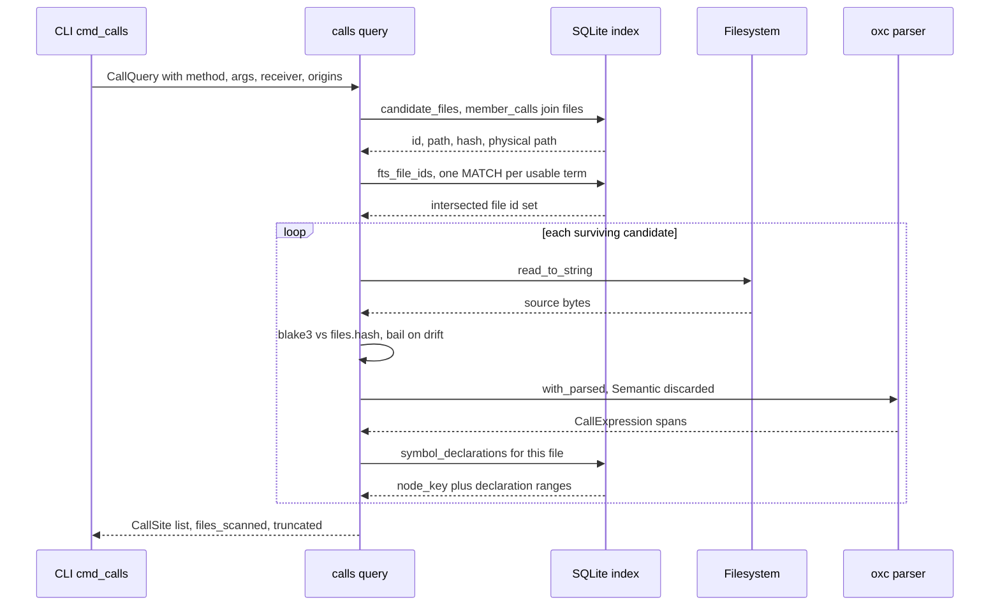
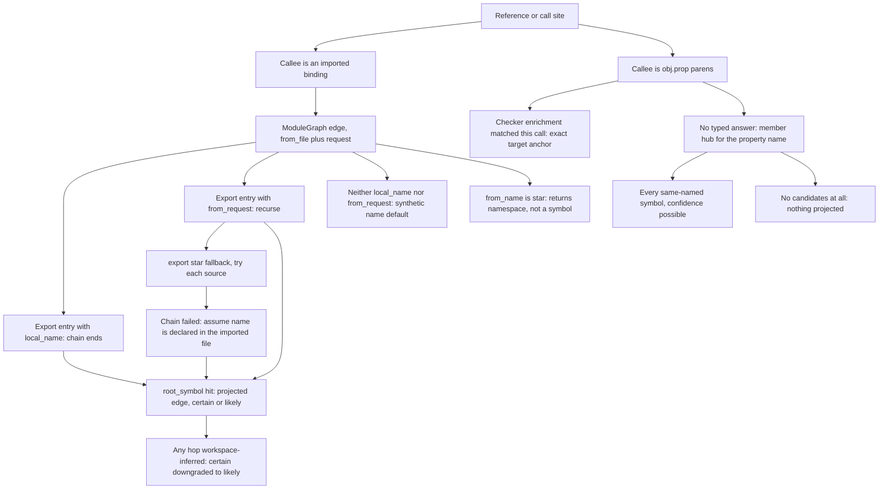
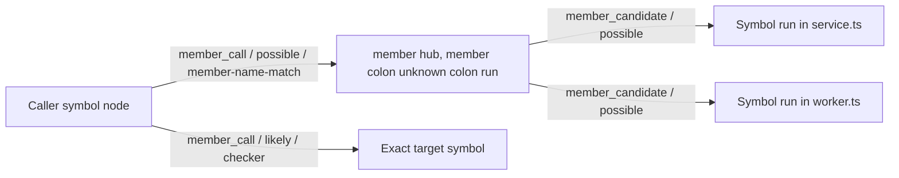

# Call graph, queries, and the agent read surface

JavaScript has no static types at parse time, so nothing in the extraction pipeline can say with certainty which function `store.insert(...)` invokes. This part of jscout is the read side that lives with that fact: `src/calls.rs` answers "where is this method called with these options" by re-parsing the source rather than trusting the index, `src/query.rs` follows export chains through the module graph and serves the tiered `who_uses` lookups whose confidence labels admit exactly how much guessing happened, and `src/surface.rs` serves the entity and repository-overview reads that an agent uses to orient, under a byte budget it computes on itself. None of these files extract anything; they consume `member_calls`, `refs`, `exports`/`module_edges`, `resolved_edges` and the entity tables, and each draws a different line about what "resolution" is allowed to mean.

## What call resolution cannot do without types

The honest ceiling is low. A property call `obj.method()` is resolvable only if you know the type of `obj`, and the indexer never computes one — [structural extraction](03-structural-extraction.md) records the syntactic receiver chain and the property name and stops. `src/heur.rs`'s `member_path` renders only `Identifier`, `this`, and `StaticMemberExpression` links, so `dbs.wave.card.insert()` yields the receiver string `dbs.wave.card`, while `arr[0].insert()` and `getDb().insert()` yield `None`. Nothing in the pipeline knows whether `dbs` is the module-level import or a shadowing local reassigned three lines earlier; nothing knows whether two files' `.run()` calls hit the same class.

Consequently the design leans on two escape hatches. The first is exactness by re-parsing: if the question is purely syntactic ("calls literally written `x.insert({merge: 'replace'})`"), `calls.rs` answers it with byte-exact spans and no type information, because the question never asked what `x` is. The second is a *global name-match hub* — every unresolved `obj.prop()` is projected as an edge into a synthetic node for `prop`, which fans out to every same-named symbol in the repository at confidence `possible`. That is deliberately a candidate set, not an answer. Closing the gap requires TypeScript's own checker, which the checker sidecar provides for the subset of a repository a `tsconfig.json` project actually type-checks.

## calls.rs: SQL narrows, the AST answers

`calls::query` (`src/calls.rs:101`) never derives its answer from index rows. `candidate_files` (`src/calls.rs:178-231`) issues one `SELECT DISTINCT` over `member_calls` joined to `files` and `LEFT JOIN package_instances`, filtered by `call.prop = ?1` and an origin allowlist, and materializes a physical path per candidate: `canonical_root` + `package_path` for dependency origin, `root.join(path)` otherwise (`src/calls.rs:213-222`). When `--arg` filters are present, `fts_file_ids` (`src/calls.rs:236-259`) runs one unqualified `chunks_fts MATCH "term"` per key and per value term containing an alphanumeric character, and intersects the resulting `chunks.file_id` sets. The intersection is per file rather than per chunk because a key and its value may legitimately land in different chunks of one file.

That prefilter is not purely an optimization, and the code does not say so. Because it *drops* candidate files whose indexed chunks fail to FTS-match every usable term, any term the FTS tokenizer splits differently — or a matching call whose text falls outside any indexed chunk — yields a false negative: a call that exists in the AST but is never parsed. `ArgFilter::parse` (`src/calls.rs:31`) splits on the **first** `=` and trims both sides, so `--arg 'name= foo'` searches for `foo` and a string literal with genuine surrounding whitespace is unmatchable.

Each surviving candidate is read from disk and its `blake3` hash compared to `files.hash`; a mismatch `bail!`s the *entire query* (`src/calls.rs:117-124`). The bail fires on the first drifted candidate in path order, so one unrelated edit — including a file under `--origin dependency` — aborts an answer that would otherwise have been correct. The justification is that the value of a `CallSite` is its byte span: `span` is the complete `CallExpression` (`src/calls.rs:63-83`), so evidence joins by containment rather than start-line equality, and a span computed against drifted text would be silently wrong against the index row that produced the candidate. `rejects_disk_drift_instead_of_answering_from_stale_index` (`src/calls.rs:505`) pins the bail deliberately.

Matching discards semantics on purpose. `parse::with_parsed` builds an oxc `Semantic`, and the closure signature `|ret, _|` throws it away (`src/calls.rs:126`) — no scopes, no bindings, and the build cost paid anyway. `CallCollector::visit_call_expression` (`src/calls.rs:300-315`) fires only for `Expression::StaticMemberExpression` callees; optional chains match because oxc walks into them. `receiver_matches` (`src/calls.rs:319-329`) splits both the rendered chain and `--receiver` on `.` and compares with slice `ends_with`, so `wave.card` matches `dbs.wave.card` but never a partial segment.

| Written as | Matches `calls insert`? | Receiver reported |
| --- | --- | --- |
| `db.insert({...})` | yes | `db` |
| `dbs.wave.card?.insert({...})` | yes | `dbs.wave.card` |
| `this.service.insert({...})` | yes | `this.service` |
| `arr[0].insert({...})` | yes | `None`, printed `<expr>` (`src/commands/core.rs:307`) |
| `db[method]({...})` | no — callee is not a static member | — |
| `insert({...})` | no — no member callee | — |

Argument filtering is equally literal. `match_arguments` (`src/calls.rs:333-356`) returns `Some((None, vec![]))` when no filters were given, so every member call matches; otherwise all filters must be satisfied by top-level properties of **one** object-literal argument. `object_matches` (`src/calls.rs:359-393`) silently skips non-`ObjectProperty` kinds, so `{...defaults, merge: 'x'}` is judged only on literally written properties — but it does *not* skip computed keys, because `PropertyKey::static_name()` names string, numeric and single-quasi keys regardless of the computed flag, so `{ ['merge']: 'replace' }` matches. `literal_text` (`src/calls.rs:397-414`) accepts only string, numeric, boolean, null and expressionless-template values, so `--arg merge=replace` can never match `{ merge: MERGE_REPLACE }`. Key-presence filters (`--arg merge` with no value) still match non-literal values and report `value: null`.

Anchors are attached after the fact: `symbol_declarations` (`src/calls.rs:263-283`) reads `graph_nodes.meta_json.declaration` for `node_kind='symbol'` in the file, and the smallest containing range wins (`src/calls.rs:144-148`). If the structural projection is absent or stale, every site silently gets `anchor: None` — no error, unlike the hash check. `end_line` uses `span[1].saturating_sub(1)` (`src/calls.rs:152`) so an exclusive span end does not spill onto the following line, and `files_scanned` is `files.len()` (`src/calls.rs:170`), the candidate count computed before `--limit` may have broken the loop. The echoed `snapshot` (`src/calls.rs:107`) is informational: there is no expected-snapshot parameter, and unlike `overview_response` the whole query runs on a bare connection with no `store::with_read_snapshot` pin — the disk-hash check is the sole freshness guard.

The sequence below is the full `jscout calls` path; the only disk read sits between two unpinned SQL statements.

`symbol_declarations` runs once per candidate *that produced sites* (`src/calls.rs:135-138`), not per candidate, and the drift check sits inside the loop rather than as a precheck — the first bad file aborts after earlier files were already parsed.

## The resolution ladder

Named-import references and member calls are resolved by completely different machinery, and it is worth seeing them as one ladder from most to least precise. `ModuleGraph::load_inner` (`src/query.rs:36-110`) reads `exports`, `module_edges` (keyed `(from_file, request)` and carrying a `resolution == "workspace-inferred"` flag), `files`, and optionally `contract_exports`, into memory. That is four full table scans, paid by every `who_uses` invocation regardless of how many symbols it resolves — the justification is that `resolve_export_inner` recurses with backtracking across star re-exports, so per-hop SQL would cost round trips proportional to chain length for every reference.

Three rungs deserve attention. `DEF` is `src/query.rs:184`: an export entry with neither `local_name` nor `from_request` resolves to the synthetic name `"default"`, which matches a `symbols` row only if a root-scope binding is literally named `default` — anonymous default exports are effectively unreachable this way. `NS` is `src/query.rs:190-192`: `export * as ns from` returns `(target, "*")`, a namespace rather than a symbol, so it can never equal a `(file_id, name)` target. `ASSUME` is `src/structural.rs:1002`, `.or_else(|| Some((target_file, name.clone())))` — when the export chain fails outright, the projection assumes the name is declared in the directly imported file rather than emitting nothing. That is a recall choice with no confidence penalty attached, and the rung most likely to fabricate an edge.

The star-re-export fallback (`src/query.rs:203-216`) carries the file's most delicate line. `inferred` is a shared `&mut bool` threaded through the recursion, so a star branch that crosses a heuristic workspace edge and then fails must restore the flag — `let before = *inferred;` at `src/query.rs:206` and `*inferred = before;` at `src/query.rs:215`. Without the restore, a dead branch would mark an unrelated successful chain as heuristic and `project_references` would downgrade its edge from `certain` to `likely` (`src/structural.rs:1029-1034`). Manual save/restore instead of a value-returning recursion is easy to break, and `src/query.rs` has no test module at all. `contract_exports` are loaded only through `load_with_contracts` (`src/query.rs:32`), used at exactly one call site (`src/structural.rs:480`), so runtime consumers never scan a type-only plane they cannot act on — at the cost of two near-identical entry points over one algorithm.

## The member-call hub

Unresolved member calls are modelled as two hops through one synthetic node per property name. `project_member_calls` (`src/structural.rs:1975-2075`) reads every `member_calls` row, looks up all symbols whose name equals the property, skips the row when there are none, creates the hub node `member:unknown:<prop>` once with `meta_json` `{"property":…, "receiver":"unknown", "candidateCount":…}` and one `member_candidate`/`possible` edge per candidate, then emits a `member_call`/`possible` edge from the *enclosing symbol* (or the file node) to the hub carrying the file id, line and the recorded `object` string.

The hub keeps edge count linear in *(sites + namesakes)* instead of their product, and it gives `hub_damping` (`src/structural.rs:3402`) a single high-degree node to suppress during graph ranking. The costs are real: every consumer must know to traverse two hops to answer "who calls this", and the hub records `"receiver": "unknown"` verbatim — the receiver chain that `member_calls` faithfully stored is thrown away at projection time, so a graph consumer cannot tell `dbs.wave.card.run()` from `x.run()`. Both hub legs are weighted 0.9 in `relation_weight` (`src/structural.rs:3367`, the `member_call`/`member_candidate` arm at `:3386`), the same as a resolved `member_call`. The `CALLER --> TARGET` edge is the checker path, which bypasses the hub entirely.

## What the checker sidecar closes, and what it does not

`project_checker_enrichments` (`src/structural.rs:2161-2313`) joins `checker_enrichments` to an `active` batch whose `source_snapshot` matches the current snapshot, to a `completed` `checker_project_runs` row, to a `files` row matched on **both** path and hash, and to the exact `member_calls` row matched on call, receiver and property spans. Only when all of that holds does it emit a `member_call` edge with provenance `checker` straight from the caller symbol to the resolved target. The sidecar supplies the missing types: it returns a `receiver_type` plus `DeclarationSite`s carrying file, span, source hash and a provenance `context` of `repo`, `types`, `lib`, `vendored` or `outside` (`src/checker/protocol.rs:229-253`).

The confidence rules are conservative in both directions. `enrich` labels a fact `likely` — never `certain` — only when the mapped target set has exactly one anchor and no declaration failed to map, otherwise `possible` (`src/checker/enrich.rs:2789-2792`); declarations outside the repository root are dropped rather than anchored (`src/checker/enrich.rs:2801`); and mapping requires the indexed symbol to *be* the declaration (same name, tightest containing span), because containment alone had previously fabricated self-edges from object-literal methods onto their enclosing function. At projection time, any project reporting `possible`, and any failed project in the occurrence's coverage set, downgrades the whole projection to `possible` (`src/structural.rs:2295-2300`).

So the sidecar upgrades a name-match candidate set into a per-call-site answer, but only for calls inside a `tsconfig.json` project it actually type-checked, only while the source hash still matches, and only up to `likely`. Everything else stays on the hub. The hub is not replaced; it is shadowed where evidence exists.

## who_uses: two entry points, five mechanisms

MCP picks the entry point by argument shape in `symbol_targets` (`src/mcp.rs:1477-1506`), which rejects passing both `symbol` and `anchor` and rejects `snapshot` outside anchor mode. The CLI `jscout who-uses` only ever takes the name path (`src/commands/core.rs:384-391`).

| Path | Source | Kind filter | Confidence | Cost |
| --- | --- | --- | --- | --- |
| Anchor pass 1 (`src/query.rs:320-347`) | `resolved_edges WHERE dst_key = anchor` | none — imports, renders, extends all count | as stored, ordered certain/likely/other | one indexed query |
| Anchor pass 2 (`src/query.rs:357-389`) | `member_candidate` joined back through `member_call` | `call` | `possible` | one join through the hub |
| Name tier 1 (`src/query.rs:493-506`) | `refs WHERE local = 1 AND file_id = ? AND target_name = ?` | as stored | as stored | one indexed query |
| Name tier 2 (`src/query.rs:509-544`) | `refs WHERE local = 0 AND target_request IS NOT NULL` — **no name filter** | as stored | as stored | every cross-file ref row, resolved in Rust |
| Name tier 3 (`src/query.rs:546-584`) | `member_calls WHERE prop = ?` — **no receiver predicate** | `call` | `possible` | one indexed query |

Pass 1 having no kind predicate is intentional: for an agent, "who uses this" includes imports, JSX renders, `extends` and entity-boundary edges, not only invocations. The price is that callers wanting invocations must post-filter on `Usage.kind`, and the pass-2 dedup on `(file, line)` (`src/query.rs:353-356`, `386-388`) is kind-blind — an unrelated `import` edge on the same line suppresses a genuine hub-attributed call. The dedup is also asymmetric: pass 2 inserts into `seen_sites` as it goes, while tier 3 builds `seen` once at `src/query.rs:548` and never adds to it, so `a.foo(); b.foo();` on one line yields two rows.

Tier 2 is the expensive and least honest tier. It fetches every cross-file `refs` row in the database with no name filter and resolves each through `graph.edge` then `graph.resolve_export` in Rust; `cmd_who_uses` calls it once per matched target. It uses the **untraced** `resolve_export` (`src/query.rs:539`), so the workspace-inferred downgrade that `project_references` applies (`src/structural.rs:1029-1034`) is absent from this path — a usage that reached the target only through a heuristic workspace edge is reported at whatever confidence the ref row carried. Tier 3 is the only way to see method dispatch without types, and it is exactly as blunt as it sounds: `jscout who-uses run` returns every `.run()` in the allowed origins as `possible`.

Target lookup differs likewise. `find_symbols_in_origins` (`src/query.rs:394-475`) splits the spec on the **last** colon (so a symbol name containing a colon is misparsed as a path filter), matches `symbols.name` exactly, applies the path part as a Rust `contains` *after* the SQL fetch, and orders `exported DESC`. The method-chunk fallback fires on `if out.is_empty()` (`src/query.rs:438`) — evaluated after the path filter, so `path:Name` where symbol rows exist but all fail the path filter still falls through to `chunks WHERE kind='method'`. One repository-level function named `run` therefore masks every class method named `run`; the fallback rewrites `kind` to `method of <scope_chain>` only when the scope chain is non-empty (`src/query.rs:467-469`).

`find_symbol_by_anchor_in_origins` (`src/query.rs:255-306`) is the exact path, and its doc comment overstates the case: `structural::resolve_anchor` does resolve colon-free anchors against file candidates and `path:name` anchors through `symbol_candidates` (`src/structural.rs:3486-3504`), but it is fail-closed on ambiguity via `unique_anchor` rather than name-blind. The file-anchor refusal is enforced downstream, not in the resolver — the rejection comes from the `node.node_kind='symbol'` predicate at `src/query.rs:276`, surfacing as `anchor … is not a symbol node` at `src/query.rs:291`. Origin validation for this path happens inside `structural::resolve_anchor_in_origins` (`src/structural.rs:3444`); every other public `query.rs` entry point calls `origin::validate_all` itself (`src/query.rs:318`, `399`, `486`, `605`).

One consumer treats the anchor/name distinction as load-bearing. `src/search.rs:1750-1765` labels a hit's `used_by` only when the hit has exactly one `sym:` anchor, counting cross-file usages via `who_uses_anchor_in_origins` — the comment states outright that repository-wide same-name reference counts are not callers of that declaration. That is this subsystem's only coupling into [retrieval](07-retrieval.md).

## The agent read surface and its self-measuring budget

`surface::entities` (`src/surface.rs:79-180`) is one CTE over `entities ⋈ entity_occurrences ⋈ files`, filtering plane, entity type, occurrence role, file role and file origin, with a case-insensitive `instr` substring over the entity name or key — no FTS, so it scans. It flags exact name matches, orders `exact DESC, occurrence_count DESC`, and takes the pre-`LIMIT` total from `count(*) OVER ()`. `load_occurrences` (`src/surface.rs:182-238`) repeats the identical predicates, which is what makes `occurrence_count` exactly the count of returnable occurrences; it fetches `occurrences_per_entity + 1` rows even though truncation is decided from the CTE count (`src/surface.rs:160`), so the extra row is redundant. `file_roles` defaults to `file_role::DEFAULT_EXPANSION` and `file_origins` to `origin::defaults()`, so test and dependency evidence is opt-in at every read entry point.

`overview_response` (`src/surface.rs:570-647`) validates fewer things than it appears to. It checks `semantic_limit` in `1..=100`, `response_byte_limit > 0`, `reconnaissance_limit <= 100`, and the detail/subject and detail/zero-limit pairings — but **never** `area_limit` or `relation_limit`, so `area_limit: 0` is legal and silently yields zero areas. Only the MCP path clamps them to 100 (`src/mcp.rs:1321-1330`); the CLI passes clap values straight through (`src/commands/mod.rs:489-502`). Everything then runs inside one `store::with_read_snapshot` SAVEPOINT (`src/surface.rs:590`), so counts, overlays and byte measurements observe a single consistent read.

`overview_unpinned` (`src/surface.rs:413-568`) issues three grouped subqueries joined to every `files` row and then filters origins in **Rust** (`src/surface.rs:462`), so a large dependency corpus is paid for even when only repository origin was requested. Two similarly named numbers come from different tables: the per-file `entity_occurrences` total is summed from `entity_sites` (`src/surface.rs:446`), while `entity_inventory` counts `entity_occurrences` (`src/surface.rs:503`). The relations query keeps edges whose `source_file_id` is NULL via `file.origin IS NULL` (`src/surface.rs:531`), so hub legs and package edges are counted under any origin selection.

The semantic overlay applies three filters, only one of which is counted. `src/surface.rs:923-951` selects non-superseded artifact ids in SQL, drops ids whose type is outside the allowlist (defaulting to `summary`, `concept`, `workflow`, `annotation` — `card` is excluded by default), loads the survivors, and increments `excluded_non_fresh` only for loaded artifacts whose `freshness != "fresh"`; superseded and type-excluded artifacts vanish silently. The type prefilter runs before `semantic::load_artifacts` because freshness loading of `summary` artifacts requires the recorded repository root to exist on disk and bails otherwise — `src/surface/tests.rs:254-320` corrupts `meta.root` on purpose to assert a card-only overlay still succeeds.

The budget is the unusual part. `rendered_bytes`, `unbudgeted_bytes` and every `omitted_*` counter are fields of the document being measured, so writing a measurement changes it. `settle_overview_bytes` (`src/surface.rs:1073-1082`) serializes with `to_string_pretty`, compares to the recorded value, writes back, up to 8 times; `settle_overview_unbudgeted_bytes` (`src/surface.rs:1061-1071`) wraps that in a second 8-iteration loop to record the untruncated size. Neither proves convergence — after 8 iterations `settle_overview_bytes` returns the measured length *without* writing it back to the field the shed loop tests, so an oscillating digit count could exit with a stale value. What enforces the limit is the `while` condition in `apply_overview_budget` (`src/surface.rs:1001`), which sheds one item at a time and re-settles after each:

| Order | Shed | Counter |
| --- | --- | --- |
| 1 | one semantic artifact | `omitted_semantic_artifacts` |
| 2 | one reconnaissance `detail` block | `omitted_reconnaissance_details` |
| 3 | one relation count | `omitted_relations` |
| 4 | one area | `omitted_areas` |
| 5 | one entity-inventory row | `omitted_entity_inventory` |
| 6 | one reconnaissance classification | `omitted_reconnaissance_classifications` |
| — | nothing left: `bail!` with the minimum envelope size | — |

That order encodes a claim worth stating plainly: under a tight limit, deterministic counted facts (relations, areas, inventory) are sacrificed *before* LLM-derived reconnaissance headlines, while those headlines' detail blocks go first. Splitting `ReconnaissanceClassification` from its `Detail` (`src/surface.rs:347-372`) is what makes step 2 possible at all. `repository_overview` is the one MCP tool that owns its own bound: both MCP (`src/mcp.rs:1338`) and the CLI (`src/commands/mod.rs:503`) print it with `to_string_pretty`, so measured bytes are delivered bytes. `calls` and `entities` instead go through the generic `render_bounded_object_arrays` (`src/mcp.rs:1232`, `1263`), and `who_uses` uses a third mechanism, `attach_symbol_resolution` (`src/mcp.rs:1508-1537`), which splices the resolution block into the compact rendering, re-settles `rendered_bytes` for up to 8 iterations, and in anchor mode **errors** rather than sheds when `response_bytes` is below the envelope (`src/mcp.rs:1530-1535`). `calls` is also the only one of the three available in the Baseline MCP profile.

## Test coverage, honestly

`src/calls.rs` keeps four `#[test]` functions inline (`src/calls.rs:416-607`), all integration-shaped — each writes a temp repo, runs `indexer::index_repo`, then queries. `multiline_option_matches_report_the_enclosing_call_span` (`src/calls.rs:435`) pins the containment rule with an option literal ten lines below the call start, plus the exclusion of a bare `insert(...)`, key-presence versus value narrowing, receiver-suffix filtering and innermost-anchor attribution. `src/surface.rs`'s tests moved to `src/surface/tests.rs` (360 lines, four tests, declared at `src/surface.rs:1109-1110`), covering the default file-role expansion excluding test evidence, `repository_area` prefixes, a real scout run whose detail block is shed by a byte limit of `rendered_bytes + 32`, and `unbudgeted_bytes == rendered_bytes` when nothing sheds.

`src/query.rs` has no `#[cfg(test)]` module, and the repository has no top-level `tests/` directory. Export-chain resolution, the star-re-export flag save/restore, all five `who_uses` mechanisms, the hub traversal and the method-chunk fallback are covered only transitively through `src/structural.rs` projection tests and MCP end-to-end tests. The closest direct coverage of the anchor path is `src/mcp/tests.rs:1104-1125`, which asserts a resolved anchor, two matched usages, one `likely` resolved call and one `possible` hub-attributed row rendered as `[10, "call", "invokeUnknown", "value.run()"]`. For a file whose most fragile line is a manual `&mut bool` restore inside a backtracking recursion, that is thin.
