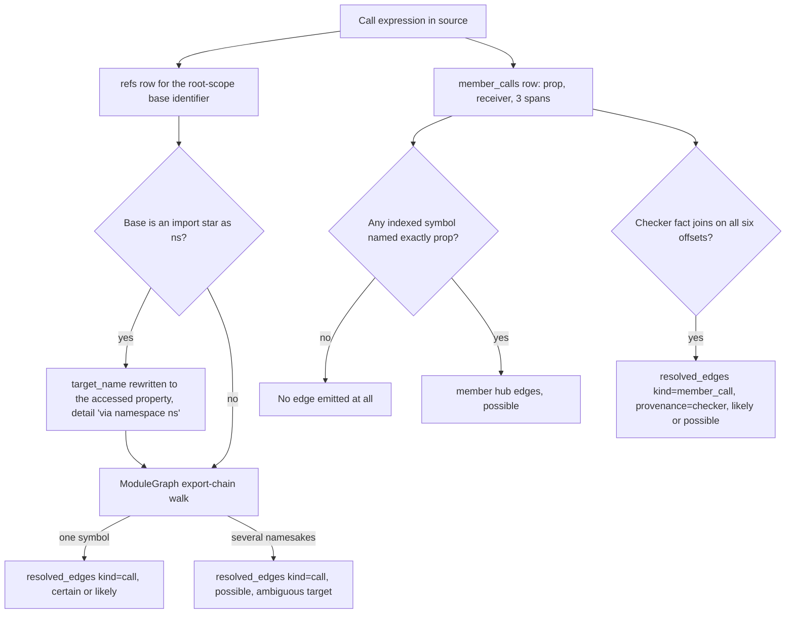
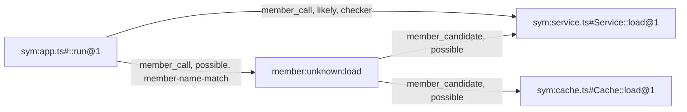
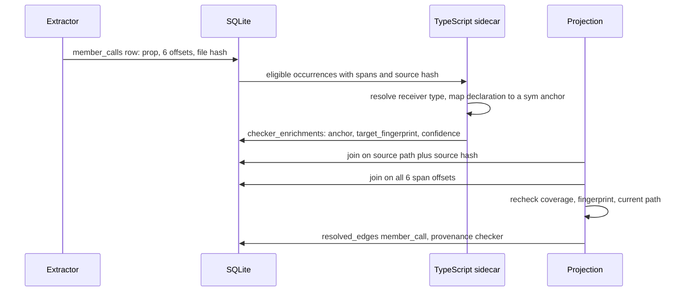

# Call graph and public surface

Answering "who calls this?" over JavaScript and TypeScript without running a type checker is a problem with no complete solution, and jscout's call layer is built around admitting that. Three separate mechanisms cover three disjoint slices of the problem: `src/graph.rs` records identifier references and resolves them through the module graph, which is exact for imports and re-exports; `src/heur.rs` records every static-member call site with byte spans and a rendered receiver chain, which is evidence but not resolution; and `src/checker/enrich.rs` ships those spans to a TypeScript sidecar that answers with a receiver type and a declaration site. `src/structural.rs` projects all three into one `resolved_edges` table where the confidence column is the only thing separating a resolved edge from a name coincidence. Sitting on top, `src/query.rs` reads the graph back for `who_uses`, `src/calls.rs` bypasses the graph entirely and re-parses source to answer exact call-site queries, and `src/surface.rs` — despite the name, not a public-API-surface computation — serves entity lookup and a byte-budgeted repository overview to agents.

## Two kinds of call evidence

Nothing in this layer parses calls twice for the same purpose. Extraction produces two independent row types per file, and a single expression can land in both.

`graph::extract` walks only root-scope bindings (`src/graph.rs:230-235`) and emits a `refs` row per resolved reference. Type-only symbols — interfaces, type aliases — are dropped before a symbol row is written (`src/graph.rs:245-247`), and references in pure type position are skipped (`src/graph.rs:266-268`). Each surviving reference is classified by `classify_reference` (`src/graph.rs:327-368`), which walks at most five oxc ancestors and returns `call` when a `CallExpression` or `NewExpression` callee span contains the reference, `render` for a JSX opening or closing element, `extend` for a superclass position, and `use` otherwise.

`heur::HeurVisitor::visit_call_expression` (`src/heur.rs:198`) emits a `member_calls` row, and only when `call.callee` is an `Expression::StaticMemberExpression`. There is no fallback: `obj[name]()` and a bare `insert()` produce nothing here.

| `member_calls` column | Source | Meaning |
| --- | --- | --- |
| `prop` | `m.property.name` | Statically written property name |
| `object` | `src/heur.rs:202-213` | Base identifier text, or `this`; `None` for any other base shape |
| `receiver` | `heur::member_path` (`src/heur.rs:295-305`) | Full static chain such as `dbs.wave.card`; `None` the moment a link is computed or a call result |
| `receiver_unbound` | `src/heur.rs:204-208` | Base identifier's oxc reference resolves to no `symbol_id` — a genuine global |
| `start`, `end` | `call.span` | Whole `CallExpression` |
| `receiver_start`, `receiver_end` | `m.object.span()` | Receiver expression |
| `property_start`, `property_end` | `m.property.span` | Property token |
| `file_id`, `chunk_id`, `line`, `end_line` | indexer | Placement |

Schema at `src/store.rs:375`, indexed on `file_id` and `prop` only. Three spans, six offsets — that is the whole occurrence identity, and it is load-bearing twice over. The full `CallExpression` span is what lets evidence be joined by containment rather than by start-line equality, so a multiline call owns every line inside it (`src/calls.rs:1-6`). And the six offsets together are the key the TypeScript sidecar's answers are matched back on (`src/structural.rs:2139-2143`).

Two properties of `receiver_unbound` are easy to over-read. It is computed only in the `Expression::Identifier` arm, so for `this.service.run()` or any non-identifier base it stays `false` by default — `receiver_unbound = 0` does not mean the base resolved to a binding. And optional chaining is not excluded: `dbs.wave.card?.insert()` still produces a row with receiver `dbs.wave.card`, pinned by the test at `src/calls.rs:572`.

## The resolution ladder

Every call site climbs as far up this ladder as the available evidence allows, and stops. The diagram traces one expression from source to a callee identity; note that a member call takes the left and right branches simultaneously — the identifier path and the member path are not alternatives.

`NONE` is the rung most likely to mislead a consumer. When a member call's property name matches no indexed symbol anywhere, `project_member_calls` emits nothing — not a weak edge, not a dangling node (`src/structural.rs:1965-1971`). Absence from the graph is not evidence that no call happened. `NSEXACT` is the opposite extreme: it is the one member-call shape the deterministic path nails exactly, and the section below explains why.

## Identifier references through the module graph

`structural::project_references` (`src/structural.rs:838-1029`) converts `refs` rows into `resolved_edges`. The source key is the innermost enclosing symbol found by `owner_at`, falling back to the file node. The target is found by asking `ModuleGraph::edge(file_id, request)` for the imported file, then `resolve_export_traced` for the defining `(file, local_name)` pair.

`ModuleGraph` (`src/query.rs:17-110`) is four full table scans into memory: `exports`, optionally `contract_exports`, `module_edges` keyed by `(from_file, request)` with a workspace-inferred flag, and `files`. Export-chain resolution is recursive with backtracking across star re-exports, so per-hop SQL would cost round trips proportional to chain length for every reference — but every `who_uses` invocation now pays those four scans up front regardless of how many symbols it will resolve.

`resolve_export_inner` (`src/query.rs:163-217`) tries exact export entries first, following aliases and `from_request`/`from_name` re-exports recursively, with a visited set as the cycle guard. Only if no exact entry matches does it try each `export *` source in order. That fallback carries a subtle piece of bookkeeping: `*inferred` is a shared mutable flag, so a star branch that crosses a heuristic workspace edge and then fails to find the name must restore the flag before trying the next source (`src/query.rs:213-215`). Without the restore, an unrelated failing branch would mark a successful chain as heuristic and downgrade its edge. The cost of that correctness is manual save/restore state instead of a value-returning recursion.

Confidence degrades along two mechanical rules at `src/structural.rs:982-993`:

| Condition | Confidence | Provenance |
| --- | --- | --- |
| Resolved name maps to more than one symbol | `possible` | `semantic+resolver-candidate` |
| Any hop crossed a `workspace-inferred` module edge **and** the ref's own confidence was `certain` | `likely` | `semantic+resolver-inferred` |
| Otherwise | the ref's own confidence, unchanged | `semantic+resolver` |

The `&& confidence == "certain"` guard matters: a ref that was already `likely` or `possible` passes through untouched rather than being "upgraded" to `likely` by the inferred branch.

## The one member shape resolved without types

For `import * as ns from "./mod"`, `classify_reference` returns the accessed property alongside the kind, and `src/graph.rs:274-278` rewrites the ref's `target_name` from `*` to that property, tagging it `via namespace <local>`. The reference then flows through the ordinary export-chain resolver and lands on the real definition. This is the only member-call shape whose callee the deterministic path identifies exactly, because the namespace object's members are the module's exports and those are recorded as data.

`project_references` carries the originating `memberCallId` into the edge detail when one exists (`src/structural.rs:1010-1011`), and `src/checker/enrich.rs:588-593` reads those ids back out to mark occurrences `deterministically_resolved`. Eligible-occurrence selection then skips them unless `--include-all` is passed (`src/checker/enrich.rs:683`), so the sidecar is never asked a question the resolver already answered.

## Name-match hubs: the untyped call graph

`structural::project_member_calls` (`src/structural.rs:1924-2025`) is the accuracy ceiling of the untyped path. It builds `candidates_by_name` from `load_symbols`, which selects `FROM symbols` with no origin, role, or file predicate at all (`src/structural.rs:598-602`) — so candidates can include dependency-origin symbols, and the origin allowlist is applied only to the *calling* file at query time. For each `member_calls` row it looks up every symbol in the index whose name equals `prop`. Zero namesakes, no edge. Otherwise it creates a hub node and wires it up.

`HUB` is global per property name — `member_key` is literally `format!("member:unknown:{name}")` (`src/structural.rs:3583-3584`), one hub for `load` across the entire repository, receiver ignored. The hub's meta records `"receiver": "unknown"` verbatim (`src/structural.rs:1984`). Modelling unresolved calls as two hops rather than a fan of direct caller-to-candidate edges keeps edge count linear in (call sites + namesakes) instead of their product, and lets `hub_damping` (`src/structural.rs:3326`) suppress a high-degree hub during neighborhood ranking. The price is that consumers must know to traverse the hub, which is why `who_uses` needs a dedicated second SQL pass.

Two details bite. `member_candidate` edges are emitted only inside the `hubs.insert(hub.clone())` guard (`src/structural.rs:1973`), so they are written once at first insertion and `candidateCount` in the hub meta reflects that first site. And the checker edge in the diagram is *added alongside* the hub edges, never replacing them — the test `checker_facts_project_per_occurrence_without_replacing_member_hubs` asserts both counts equal 1 (`src/structural.rs:4907-4922`). A consumer that does not dedupe will see the same call site twice, with different targets and different confidences.

## The checker sidecar

`project_checker_enrichments` (`src/structural.rs:2103-2265`) is the only path to receiver-typed resolution. It re-emits per-occurrence `member_call` edges from the owner symbol straight to the exact target anchor. The join is where the design lives.

The SQL join requires an active batch bound to the current snapshot, a `checker_project_runs` row with `status='completed'`, `source.path = enrichment.source_file AND source.hash = enrichment.source_hash` (`src/structural.rs:2136`), and equality on all six span offsets (`src/structural.rs:2139-2143`). Notably it does **not** join on `member_call_id`: the rowid is disposable and a future extractor ordering change must not silently discard valid facts, which the test at `src/structural.rs:4924-4935` pins by rewriting the stored id and expecting the fact to survive.

Three further guards run in Rust after the query, not in SQL. The occurrence must appear in `checker_occurrence_coverage` (`src/structural.rs:2196-2198`); `crate::checker::target_fingerprint(&target, &target_hash, target_start, target_end)` must still equal the stored fingerprint, catching a target declaration that moved since the fact was recorded (`src/structural.rs:2199-2203`); and the currently indexed path for the file id must still equal `enrichment.source_file` (`src/structural.rs:2204-2209`).

Confidence is assigned by the sidecar wrapper, not the projection: `unambiguous = target_count == 1 && outcome.unmapped_declarations == 0`, and each fact becomes `likely` or `possible` on that basis (`src/checker/enrich.rs:1897-1899`). The projection then degrades to `possible` if any contributing fact was `possible` or if the occurrence had any failed project run (`src/structural.rs:2229-2235`).

## Confidence, and the ceiling it never crosses

| Edge kind | Provenance | Confidence | Visible at default `min_confidence: "likely"` |
| --- | --- | --- | --- |
| `call`, `render`, `extend`, `use`, `import` | `semantic+resolver` | ref's own (usually `certain`) | yes |
| same | `semantic+resolver-inferred` | `likely` | yes |
| same | `semantic+resolver-candidate` | `possible` | no |
| `member_call` (caller to hub) | `member-name-match` | `possible` | no |
| `member_candidate` (hub to namesake) | `member-name-match` | `possible` | no |
| `member_call` (caller to target) | `checker` | `likely`, or `possible` on ambiguity or a failed project | `likely` yes, `possible` no |

No call edge anywhere in the system is `certain`. `certain` in `who_uses` output always means an identifier reference resolved through the module graph, never a method dispatch. The default `min_confidence` is `"likely"` for both neighborhood and path traversal (`src/structural.rs:192`, `src/structural.rs:292`), which means hub edges are invisible unless the caller explicitly lowers it — pinned by `possible_member_calls_traverse_through_candidate_hubs` (`src/structural.rs:4743-4790`), which asserts the default result contains no `member_call` or `member_candidate` edge and that lowering to `"possible"` surfaces `member:unknown:load` with both legs. Checker edges are exactly the ones that survive the default filter, which is the point of running the sidecar at all. For ranking, both member kinds weigh 0.9 against 1.0 for a resolved `call` (`src/structural.rs:3310`).

## Reading the graph back: who_uses

There are two entry points with quite different behaviour, and the MCP `who_uses` tool picks between them by argument shape (`src/mcp.rs:670-685`): an `anchor` routes to the edge-graph path, a `symbol` string to the three-tier path. The CLI `jscout who-uses` only ever takes the second (`src/main.rs:1694-1704`).

`who_uses_anchor_in_origins` (`src/query.rs:313`) runs two SQL passes. Pass 1 selects every `resolved_edges` row with `dst_key = anchor`, with no `kind` predicate at all, ordered `certain`/`likely`/other then by path and line (`src/query.rs:320-334`). "Who uses" here means every inbound relationship — imports, calls, renders, extends, entity-boundary edges — and callers who want only calls must post-filter on `Usage.kind`. Pass 2 joins `member_candidate` (whose `dst_key` is the anchor) to `member_call` (whose `dst_key` is that candidate's `src_key`, the hub) so an unresolved call is attributed to the caller's real file and line rather than to the hub, emitted as kind `call`, confidence `possible`. The dedup set `seen_sites` is `(file, line)` built from *all* pass-1 rows (`src/query.rs:353-356`), so a precise or checker edge beats a name-match candidate on the same line — but so does any unrelated import or `use` edge that happens to sit on that line. The dedup is kind-blind.

`who_uses_in_origins` (`src/query.rs:479-586`) is the fuzzy path and has three tiers:

| Tier | Query | Confidence |
| --- | --- | --- |
| 1 | `refs` where `local = 1` and `file_id`/`target_name` match | ref's own (`certain`) |
| 2 | every cross-file ref in the database, resolved in Rust through `ModuleGraph` | ref's own |
| 3 | `member_calls.prop = name`, no receiver check | `possible` |

Tier 2 is the expensive one: the SQL predicate is `WHERE r.local = 0 AND r.target_request IS NOT NULL` (`src/query.rs:514`) with no name filter whatsoever, so every cross-file reference row is fetched and resolved in Rust. Cost is O(all cross-file refs) per symbol queried, and `cmd_who_uses` calls it once per matched target. Tier 3 is the honest-but-noisy one: with no types this is the only way to see method dispatch at all, and it is labelled `possible` and deduped by `(file, line)` against the precise tiers so it cannot displace a real answer — but a query for `.get()` returns every `.get()` in the repository.

Target selection sits in `find_symbols_in_origins` (`src/query.rs:394-476`). The spec splits on the **last** `:` via `rsplit_once` into a path substring and a name, so a name containing a colon is misparsed as a path filter; the path filter itself is a plain `contains` applied in Rust after the SQL fetch (`src/query.rs:433`). Symbols are matched on exact name, ordered `s.exported DESC` first. The method-chunk fallback fires only when the symbol query returned nothing (`src/query.rs:438`), so a repository-level function named `run` masks every class method named `run`.

Anchors go through `structural::resolve_anchor_in_origins` (`src/structural.rs:3362`), which is also where the origin allowlist is validated for that path — `find_symbol_by_anchor_in_origins` does not call `origin::validate_all` itself. A stale `sym:` anchor from an earlier snapshot is reparsed and re-resolved against the current index by path, scope and name, and the returned `anchor_status` reports `exact`, `resolved` or `re-resolved` so the caller can tell what happened. The lookup joins `graph_nodes` to `symbols` on `native_table='symbols' AND native_id=symbol.id`, with `node_key` as the WHERE predicate (`src/query.rs:273-276`); a file anchor is not explicitly rejected, it simply fails `node_kind='symbol'` and surfaces as `anchor ... is not a symbol node`.

## Exact call-site queries

`src/calls.rs` does not read the call graph. It uses the index only to narrow candidate files, then re-parses those files and re-matches from scratch, because the complete `CallExpression` span, the exact static receiver chain, and the matched argument structure are not reconstructible from a chunk-level index (`src/calls.rs:1-6`).

The pipeline in `query()` (`src/calls.rs:101`): validate origins, read the snapshot, run `candidate_files` (`SELECT DISTINCT` over `member_calls JOIN files LEFT JOIN package_instances WHERE call.prop = ?1` plus the origin allowlist, `src/calls.rs:178-231`), optionally intersect with `fts_file_ids`, then for each surviving file read it from disk, compare `blake3::hash(source)` to `files.hash`, and `bail!` with `changed since indexing` on any mismatch (`src/calls.rs:119-124`). Byte spans computed from a re-parse would be meaningless against a differently-hashed index row, so a wrong span is judged worse than no answer — but that means one edited file, ordered by path, makes the whole query unusable even when the edit is unrelated to the queried method.

`fts_file_ids` (`src/calls.rs:236-259`) is skipped entirely when there are no `--arg` filters. Otherwise each key and value term containing an alphanumeric character is run as a quoted `chunks_fts MATCH`, and the resulting `chunks.file_id` sets are intersected. The intersection is per file, not per chunk — different terms may match different chunks of one file — which keeps it a recall-preserving prefilter rather than a semantic one.

`CallCollector::visit_call_expression` (`src/calls.rs:300`) matches only when the callee is a `StaticMemberExpression`, the property name equals the method, `receiver_matches` passes, and `match_arguments` returns. It calls `walk_call_expression` afterwards regardless (`src/calls.rs:314`), so nested matching calls are all reported and results within a file come out in AST traversal order rather than line order. Crucially, `parse::with_parsed` discards the `Semantic` — no scopes, no bindings. The matcher is purely syntactic; a shadowed or reassigned `dbs` is indistinguishable from the real one.

| Flag | Mechanism |
| --- | --- |
| `--receiver SUFFIX` | Both chain and suffix split on `.`, compared with slice `ends_with` (`src/calls.rs:326-328`), so `wave.card` matches `dbs.wave.card` but never a partial segment |
| `--arg KEY` | Key presence on a top-level property of one object-literal argument; `value` recorded as `None` if the value is not a literal |
| `--arg KEY=VALUE` | Compared against `literal_text` (`src/calls.rs:397-415`): strings unquoted, numbers as written, booleans, `null`, expressionless templates. Anything else returns `None`, so `{ merge: MERGE_REPLACE }` can never match `--arg merge=replace` |
| `--arg-position N` | 1-based; non-matching positions are skipped before the object test (`src/calls.rs:342-348`) |
| `--origin` | `repository`\|`workspace`\|`dependency`, default `repository,workspace` |
| `--limit` | Once `matches.len() >= limit`, `truncated` is set and both loops break |

`object_matches` skips spread elements (`src/calls.rs:367-369`), so `{...defaults, merge: 'x'}` matches only on the literally written properties. It does *not* skip all computed keys: `PropertyKey::static_name()` returns a name for string, numeric and single-quasi template keys regardless of the computed flag, so `{ ['merge']: 'replace' }` does match; only identifier or expression keys return `None`.

Anchor attribution reads `graph_nodes.meta_json.declaration` for the file and picks the smallest containing range (`src/calls.rs:144-148`), returning `None` at module level. `end_line` is `lines.line(span[1].saturating_sub(1))` (`src/calls.rs:152`); since `LineIndex::line` is 1-based, subtracting one from the exclusive span end is what keeps the reported range from spilling onto the following line. One counter is misleading: `files_scanned` is `files.len()` (`src/calls.rs:170`), the full candidate count, set after the loop broke on truncation — it overstates the work actually performed.

## What "public surface" actually means here

There is no module-, package-, or repository-level API-surface computation anywhere in this layer. The only exported/public notion is a per-symbol boolean, `symbols.exported`, set in `src/graph.rs` from ESM local export entries (`src/graph.rs:117-119`, skipping type-only entries) and from CommonJS `module.exports` assignments (`src/graph.rs:189`). It surfaces as `SymbolTarget.exported` (`src/query.rs:427`) and is used in exactly two places: as the leading sort key when resolving a symbol spec (`src/query.rs:415`), and as a display label in `cmd_who_uses` (`src/main.rs:1714`). One more consumer reads it indirectly — the checker's occurrence-selection SQL ranks a call site higher when an exported symbol or an entity occurrence encloses it (`src/checker/enrich.rs:606-613`).

## The agent read surface

`src/surface.rs` is the agent-facing read surface, wired to the MCP tools `entities` (`src/mcp.rs:876`) and `repository_overview` (`src/mcp.rs:949`), both unavailable in the Baseline tool profile.

`entities()` (`src/surface.rs:79`) is a single CTE joining `entities` to `entity_occurrences` to `files`, filtering on plane (`runtime`\|`contract`\|`general`), entity type, a case-insensitive substring over name or entity key, occurrence role, file role and file origin. It flags exact name matches, orders `exact DESC, occurrence_count DESC` before the limit, and computes the match total with `count(*) OVER ()` evaluated before `LIMIT` (`src/surface.rs:118`). `load_occurrences` then fetches `occurrences_per_entity + 1` rows to detect truncation even though `occurrences_truncated` is actually derived from the CTE's `occurrence_count` (`src/surface.rs:158-160`) — the extra row is redundant.

`overview_response` (`src/surface.rs:570`) validates its numeric limits, then runs everything inside `store::with_read_snapshot`'s SAVEPOINT so the deterministic overview, the overlays and the byte budget all observe one consistent read (`src/surface.rs:590`). `overview_unpinned` (`src/surface.rs:413`) computes per-file chunk/symbol/entity-site counts via three grouped subqueries, folds paths into areas, inventories entities by `(plane, type)`, and counts `resolved_edges` by kind. Origin filtering happens in Rust *after* the SQL has already scanned every file row and its aggregates (`src/surface.rs:462`), so a large dependency set is paid for even when only repository origin was requested.

The byte budget is the genuinely awkward part, and for a real reason. `rendered_bytes`, `unbudgeted_bytes` and every `omitted_*` counter are fields of the very document being measured, so writing a measurement changes the measurement. `settle_overview_bytes` (`src/surface.rs:1073-1082`) therefore serializes, compares, writes back and repeats — capped at 8 iterations, so it is a bounded approximation of a fixed point, not a guaranteed one. `apply_overview_budget` (`src/surface.rs:998-1059`) then sheds in a fixed order — semantic artifacts, reconnaissance details, relations, areas, entity inventory, reconnaissance classifications — calling settle once per shed item, and `bail!`s when even the minimum envelope exceeds the limit. A byte limit far below the payload therefore causes many full pretty-serializations of the entire response before the loop terminates.

## Standing limits

| Limit | Where | Consequence |
| --- | --- | --- |
| Non-static callees invisible | `src/heur.rs:199` | `obj[name]()` produces no evidence row of any kind |
| Only root-scope bindings walked | `src/graph.rs:230-235` | No `refs` rows for function-local or block-scoped declarations, so `who_uses` cannot see intra-function usage of a nested helper |
| `classify_reference` depth cap of 5 | `src/graph.rs:334-336` | A callee buried deeper degrades from `call` to `use` |
| Hub candidates unfiltered by origin | `src/structural.rs:598-602` | A member hub can link to dependency-origin symbols |
| Zero namesakes emits nothing | `src/structural.rs:1965-1971` | Absence from the graph is not evidence of no call |
| `project_entity_callers` reads `kind='call'` only | `src/structural.rs:1874` | `member_call` and checker edges never participate in entity-boundary caller collapse |
| Tier 3 has no receiver predicate | `src/query.rs:553` | Common method names dominate `who_uses` output with noise |
| `src/query.rs` has zero tests | — | Export-chain resolution, the three tiers and the hub traversal are covered only transitively, through `src/structural.rs` projection tests and `src/mcp.rs:1818` |

The last row is worth stating plainly. `src/query.rs` contains no `#[cfg(test)]` module and there is no `tests/` directory in the repository; the star-re-export flag save/restore, the tier-2 barrel walk, and the method-chunk fallback have no direct assertions anywhere.

Related reading: [structural extraction](03-structural-extraction.md) for the entity model and edge kinds these edges live beside, [storage schema](05-storage-schema.md) for the full table inventory, [sidecars](09-sidecars.md) for the checker protocol, [CLI and MCP](10-cli-and-mcp.md) for the tool surface, and [sharp edges](17-sharp-edges.md) for the risk view.
