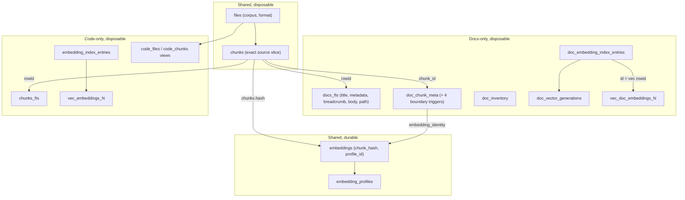
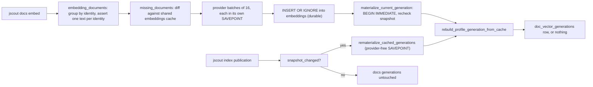
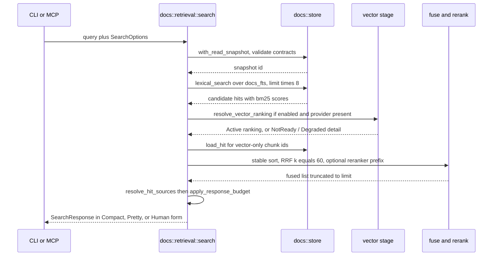

# Documentation retrieval and its storage plane

Documentation queries in jscout run out of the same SQLite file, the same structural snapshot, and the same publication transaction as code queries — but through a physically separate FTS5 table, a separate family of sqlite-vec tables, a separate readiness record, and a separate response surface. `src/docs/store.rs` (470 lines) holds the SQL: status counts, weighted BM25, single-chunk hydration. `src/docs/retrieval.rs` (2,299 lines) holds everything else: embedding materialization, the query pipeline, reciprocal-rank fusion, reranking, source re-read, and byte budgeting. Nothing in the pipeline merges a documentation hit with a code hit. This document covers the tables, the two candidate paths, how embedding identity is computed and when vectors are allowed to participate, and what the "one store, separate ranking" decision actually settled — because the previous proposal round had concluded, correctly for its own framing, that the shared database could not host an independent documentation plane.

## What the unified-storage decision settled

The G24 design originally gave documentation its own database file (`.jscout-docs.db`), its own snapshot sequence, and a `[docs.database]` configuration key. The PR #96 review killed that: the shared database has one global `SCHEMA_VERSION`, opens are gated on the structural snapshot, and a second lifecycle behind that gate was not something the store could express. The ADR at `docs/plans/g24-adr-one-store-separate-ranking-2026-08-25.md` does not reverse that conclusion — it re-scopes it. Its load-bearing sentence is that storage and ranking are independent axes: BM25 term statistics are a property of an individual FTS5 table, so one database can host any number of ranking corpora at no architectural cost. What the shared gate could not host was a second *lifecycle*. A second *corpus* was never the problem.

So the separate database, the `[docs.database]` key, and the docs-scoped snapshot sequence all died. What shipped instead is one walker, one snapshot, one index pass, one watcher, and one entity plane — with `docs_fts`, `vec_doc_embeddings_{N}`, and a `documentation_search` surface layered on top. The ownership inversion described in `03-documentation-corpus.md` is the same decision seen from the other end: `walk::repository_inventory` delegates to `docs::corpus::scan_repository`, so a single deterministic traversal produces both file lists.

The cost the ADR accepts explicitly is that a Markdown edit rotates the shared snapshot digest — full projection rebuild, checker batch invalidation, held anchors re-resolving. Its stated remedy, if measurement ever says this hurts, is digest-splitting inside the one index, never a second database. The other stated cost is one embedding model for both corpora.

## Where the rows live

Documentation files are ordinary `files` rows. `files.corpus` is a `CHECK(corpus IN ('code','docs')) NOT NULL` column and `files.format` records parser identity (`markdown` or `mdx`) independently (`src/store.rs:334-345`). Membership is an explicit column, never inferred from the presence of a sidecar. Documentation sections are ordinary `chunks` rows with `kind='markdown_section'` (or `markdown_document` for the body-empty stub), `name=NULL`, `symbols=''`, and `content` holding the exact source slice. The empty structural fields are what make documentation invisible to code's exact-definition tiers.

| table | plane | shape / purpose |
|---|---|---|
| `files` (`corpus`, `format`) | shared, disposable | corpus is ranking membership; format is parser identity; `idx_files_corpus` (`src/store.rs:345`) |
| `chunks` | shared, disposable | exact source slice, spans, hash; docs rows carry `name=NULL`, `symbols=''` |
| `code_files`, `code_chunks` | disposable views | `WHERE corpus='code'` in one schema object so no code consumer reproduces the predicate (`src/store.rs:426-437`) |
| `docs_fts` | disposable FTS5 | `(title, metadata, breadcrumb, body, path)`, `tokenize="unicode61 tokenchars '_$'"`, rowid = `chunks.id` (`src/store.rs:41-46`) |
| `doc_chunk_meta` | disposable sidecar | chunk-id keyed: title, description, `tags_json`, breadcrumb, `nearest_heading`, ordinal, `embedding_identity`, `front_matter_state` (`src/store.rs:367-380`) |
| `doc_inventory` | disposable | admission diagnostics for candidates with no `files` row at all; deliberately not foreign-keyed (`src/store.rs:441-451`) |
| `doc_embedding_index_entries` | disposable | `UNIQUE(chunk_id, profile_id)`; its rowid is the sqlite-vec rowid (`src/store.rs:766-774`) |
| `doc_vector_generations` | disposable | `PRIMARY KEY(snapshot, profile_id, dimensions, chunk_format_version)` — the readiness contract (`src/store.rs:776-782`) |
| `vec_doc_embeddings_{N}` | disposable, on demand | `vec0(embedding FLOAT[N] distance_metric=cosine, profile_id INTEGER PARTITION KEY)` (`src/docs/retrieval.rs:973-983`) |
| `embeddings` | **shared, durable** | `(chunk_hash, profile_id)` content-addressed cache — the one crossing edge between the planes |

Note the split between `chunks.content` and `docs_fts.body`: the chunk row keeps the exact source slice so spans always slice back to the file, while the FTS body column holds the *rendered* text that is actually searched. They are different strings, and the difference matters for both ranking and embedding identity.

The corpus boundary is enforced by four triggers rather than by convention (`src/store.rs:382-424`). `doc_chunk_meta_requires_docs_insert` and `..._update` raise `ABORT` unless the referenced chunk's file has `corpus='docs'`; `files_docs_sidecar_preserves_corpus` blocks flipping a file out of the docs corpus while doc metadata exists; `chunks_docs_sidecar_preserves_corpus` blocks reparenting a doc chunk onto a code file. Combined with the fact that documentation rows are routed to `insert_documentation_file` (`src/indexer.rs:909`, whose `docs_fts` insert is at `:971`) while code rows go to the `chunks_fts` insert (`src/indexer.rs:1105`), documentation cannot perturb code BM25 statistics by construction. Every documentation query nevertheless re-asserts `f.corpus='docs'` in its join — a redundant guard that a store test exercises directly by inserting a code row into `docs_fts` and asserting it is not returned (`src/docs/store.rs:409`).

The first diagram is the storage map. Look for the single edge crossing between the two column stacks — everything else is parallel by design.

`DMETA -> EMB` and `CHUNKS -> EMB` are the whole story of plane sharing: both corpora key the same durable cache under the same `embedding_profiles` row, but code keys it by `chunks.hash` (the raw source slice) and documentation keys it by `doc_chunk_meta.embedding_identity`.

## The lexical path

`store::lexical_search` (`src/docs/store.rs:180-216`) is the only always-available candidate source. It matches `docs_fts`, joins back through `chunks`, `files`, and `doc_chunk_meta`, and scores `-bm25(docs_fts, 4.0, 2.0, 2.0, 1.0, 0.25)` (`:199`) — title 4, metadata 2, breadcrumb 2, rendered body 1, path 0.25, negated so larger is better. The code plane's weighting is a different vector over different columns: `bm25(chunks_fts, 2.0, 4.0, 3.0, 1.0)` at `src/search.rs:998`, which leans on `name` and `symbols`, columns documentation rows do not populate.

User input never reaches FTS5 as syntax. `fts_query` (`src/docs/store.rs:287-296`) splits on any character that is not alphanumeric, `_`, or `$`, quotes each surviving term, and joins with ` OR `. So `needle OR NOT (` becomes three quoted terms, and a multi-word query is a **disjunction** — recall-first, leaving discrimination to the weighted BM25 and the reranker.

Results sort by `compare_hits` (`src/docs/store.rs:270-285`): score descending, then a full normative source key of `(path, source_start, source_end, blake3(rendered_body))`. The sort precedes truncation, so ties resolve identically regardless of SQLite row order or which ranking produced the candidate.

## Embedding identity and vector readiness

`docs::corpus::embedding_identity` (`src/docs/corpus.rs:280-289`) is `blake3` over a domain separator, a `has_heading` byte, the length-prefixed nearest heading, and the length-prefixed rendered body. It is deliberately independent of path and of every ancestor heading above the nearest one, so a rename or a breadcrumb edit leaves the identity — and therefore the cached vector — intact.

The text actually sent to the provider is not the rendered body alone. `provider_text` (`src/docs/corpus.rs:267-278`) is `nearest_heading + "\n\n" + body` when a heading exists, else the body. `embedding_documents` (`src/docs/retrieval.rs:632-688`) reconstructs that same expression in SQL, groups by `embedding_identity`, counts occurrences, and — critically — counts `DISTINCT` provider texts per identity and `ensure!`s the count is 1. That assertion is the contract that makes the cache content-addressable: one identity, one text, one vector, fanned out to every occurrence. It also first `ensure!`s that no non-stub docs chunk has a NULL identity (`:632-647`), pairing with the indexer's own assertion that `chunk.is_stub == chunk.embedding_identity.is_none()` (`src/indexer.rs:1011`).

Readiness is one all-or-nothing row. `rebuild_profile_generation_from_cache` (`src/docs/retrieval.rs:888-971`) deletes that profile's rows from `doc_vector_generations`, `vec_doc_embeddings_{dims}`, and `doc_embedding_index_entries` **first**, then loads one cached vector per embeddable occurrence, then returns `Ok(None)` if the count is short or any blob has the wrong length (`:938-945`). Deleting before deciding is the safety property: a not-ready outcome actively revokes prior readiness rather than leaving stale vectors behind a stale marker. Only a complete set inserts an index entry per occurrence, a `vec0` row at that entry's rowid, and one `doc_vector_generations(snapshot, profile_id, dimensions, chunk_format_version)` row. `generation_is_ready` (`:985-1005`) requires all four to match exactly.

Contrast the code plane, which records readiness as a `meta` flag `embedding_index_synced_v1:{profile_id}` (`src/embed.rs:6`) and repairs incrementally. Documentation chose snapshot-pinned and complete-or-absent, on the reasoning that a partially materialized generation returns a silently biased KNN neighborhood — a wrong answer that looks like a right one.

`vec_doc_embeddings_{dims}` exists separately from `vec_embeddings_{dims}` for a mechanical reason, not a stylistic one: sqlite-vec evaluates KNN's `k` inside the virtual table, before any join or `WHERE` can exclude code rows (`src/store.rs:764-765`). A shared table would let code rows consume the documentation `k` budget with no way to compensate. The documentation table partitions by `profile_id` only; the code table additionally partitions by file `origin`, which documentation does not need because docs rows are always `origin='repository'`.

Two write paths reach these tables, and only one of them talks to a provider.

The asymmetry at `REBUILD` matters. Under `REMAT`, an incomplete cache is an ordinary not-ready outcome and indexing continues successfully (`src/docs/retrieval.rs:815-837`). Under `MAT`, the same `None` becomes a hard error — "not every current documentation representation has a cached valid-dimension vector" (`:791-793`) — which rolls back the `BEGIN IMMEDIATE`. `docs embed` was asked to publish; `index` was not.

Two further gates are easy to miss. `rematerialize_cached_generations` runs only `if snapshot_changed` (`src/indexer.rs:684`, call at `:719`), so an index run that republishes an identical digest does not rebuild documentation generations at all. And `documentation_profiles` (`src/docs/retrieval.rs:840-865`) is not "every profile" — it is every `embedding_profiles` row whose `config_json["document_text"]` equals `CHUNK_FORMAT_VERSION`; rows that fail to parse or mismatch are skipped silently. Separately, `embed_current` skips materialization entirely when no profile resolved or `documents` is empty, reporting `occurrences_materialized=0, generation_published=false` without error (`:332-338`).

## The query pipeline

`search` (`src/docs/retrieval.rs:357-382`) validates the query, limit, and byte budget, rejects `vector_required && !vector`, then wraps `search_inner` in `crate::store::with_read_snapshot("jscout_docs_search")`. That helper is a `SAVEPOINT`/`RELEASE` pair (`src/store.rs:1138-1154`) — it pins one SQLite read view for the duration of **one call**, so a concurrent `jscout index` cannot mix planes within a response. It does not pin across calls: a `docs status` followed by a `docs search` are two separate pins and can straddle a publication.

`store::current_snapshot` (`src/docs/store.rs:59-62`) calls `validate_published_contracts` before anything else. That function checks *both* contracts (`src/store.rs:123-148`): a stale `extraction_version` fails `docs status`, `docs search`, and `docs embed` exactly as a stale `documentation_chunk_format_version` does. The documentation plane is not independent of the code contract. Because the snapshot digest itself hashes both the binary's `CHUNK_FORMAT_VERSION` and the persisted documentation marker (`src/structural.rs:450-464`), an interrupted or pre-upgrade documentation contract cannot masquerade as current.

`candidate_limit` is `limit * 8`, raised to the reranker's candidate pool (`src/docs/retrieval.rs:397-401`). It bounds the lexical fetch and the final vector truncation, but *not* the KNN itself: `vector_search` (`:1007-1105`) checks in order that the `vec_doc_embeddings_{dims}` table exists in `sqlite_master`, embeds the query through the provider and validates its profile and dimensions, asserts that `COUNT(*)` over `doc_embedding_index_entries` for the profile equals the current embeddable occurrence count (`:1054-1057`), and only then returns early if that count is zero. A corpus with nothing embeddable therefore still costs one provider query embedding. When occurrences are at most `SQLITE_VEC_MAX_K = 4_096`, `knn_vector_candidates` requests `k = occurrence_count` — every occurrence — and asserts it received exactly that many; above the ceiling it falls back to `full_distance_vector_search`, computing `vec_distance_cosine` over every cached vector. Truncation to the caller's limit happens afterwards in `finalize_vector_ranking` (`:1162-1173`). Correct in both branches, but the second is linear in corpus size on every query.

The vector stage is a five-state gate surfaced in diagnostics: `Disabled` (caller said no), `NotConfigured` (no provider), `NotReady` (no profile, or no readiness row for this snapshot), `Degraded` (the attempt errored), `Active`. Only `Active` puts the second list into fusion (`:539-543`); everything else falls back to BM25 silently unless `vector_required` is set, in which case `NotReady` and errors become hard failures (`:412-453`). The reason string survives only in `diagnostics.vector_detail`, which the compact agent transport drops — agents see the status enum and nothing more (`:171-174`).

`reciprocal_rank_fusion` (`:1240-1253`) uses positions only, never raw scores, with `RRF_K = 60.0` (`:18`). The code plane uses the same number but as a bare literal passed to its own `rrf` (`src/search.rs:1605`, `:2105`) — same value, no shared symbol. Fused output is sorted by the same score-then-source-key comparator (`:1255-1262`), so exact ties are order-independent at every stage.

The reranker draws its pool from the *fused* list (`:559`) and its document is built from path, title, description, tags, breadcrumb, and body only (`:214-226`) — no snapshot, no timestamps, nothing that would make relevance a function of freshness. One precedence quirk: `rerank=true` with an empty fused list yields `SkippedEmpty` even when no reranker is configured; `NotConfigured` is reported only when candidates exist (`:547-551`).

## Hit content, budgeting, and the three renderings

`finish_search` initializes every hit with `content = rendered_body`, `source_state = SourceMismatch`, and `source_detail = Some("not_resolved")` (`:594-595`). `resolve_hit_sources` (`:1180-1204`) then only ever *upgrades*: it captures each distinct path once, rejects absolute paths and any component that is not `Normal` or `CurDir` before touching the filesystem (`:1206-1216`), caps the read at `MAX_CAPTURE_BYTES = 4_194_304`, compares blake3 against the indexed `files.hash`, and slices *that same buffer*. A check-then-reread would be a race; there is no second read. On success the hit becomes `Current` with `source_detail` cleared. On failure the pre-set mismatch stands and only the detail string is replaced, from a closed set: `not_resolved`, `invalid_indexed_span`, `invalid_utf8_slice`, `invalid_indexed_path`, `hash_mismatch`, `oversized`, `not_regular`, `missing`, `unreadable`. The returned content is then the stored rendered body — less faithful than source, but labelled as such.

`apply_response_budget` (`:1264-1287`) re-renders the *actual* output format on each iteration and pops hits until the string fits. Compact, Pretty and Human differ enough in size that measuring the real rendering is the only way one promised limit holds for all three. A limit too small for the metadata alone errors with `response_budget_too_small: ... minimum_bytes=N` rather than returning an empty shell. The cost is quadratic re-rendering in the worst case.

`SearchHit.embedding_identity` is `#[serde(skip_serializing)]` (`src/docs/store.rs:53-54`), so it appears in none of the three renderings.

## Two surfaces, never one

Documentation results are never fused with code results. `documentation_search` is its own MCP tool (definition at `src/mcp.rs:562-579`, handler at `:1140-1190`), and when `[docs].enabled=false` it is dropped from the tool list by `definitions.retain(|tool| tool["name"] != "documentation_search")` (`src/mcp.rs:849`) *and* its one sentence is string-replaced out of the server instructions (`src/mcp.rs:511-524`). The CLI mirror is `jscout docs {status,embed,search}` (`src/commands/docs.rs:10-201`). The ADR states that a combined view, if ever built, would be an explicit interleave of two ranked lists — never statistical fusion — because the two corpora have different truth models: a code snapshot means only the current checkout exists, while prose can be stale, obsolete, or self-contradictory.

| knob | default | source |
|---|---|---|
| `docs.enabled` | `true` | `src/config/load.rs:411-435` |
| `docs.include` | `["**/*.md","**/*.mdx"]` | same |
| `docs.exclude` | `[]` | same |
| `docs.search.vector` | `true` | same |
| `docs.search.rerank` | `true` | same |
| `docs.search.limit` | `10` | same |
| `docs.search.response_bytes` | `24_000` | same |

Flag semantics are worth stating because they read backwards. CLI `--vector` is the *require* flag — `vector_required: vector` at `src/commands/docs.rs:186` — not an enable flag, and `--lexical-only` is just `--no-vector --no-rerank` via `resolve_flag` (`:210-212`). On MCP, `use_vector = require_vector || configured_vector` (`src/mcp.rs:1148-1154`), so `require_vector:true` turns vectors on regardless of `docs.search.vector=false`; only an explicit `vector:false` alongside it bails. There is no vector-only mode anywhere: lexical always runs and always enters fusion. `docs status` is also the one verb that does not fail when documentation is disabled — it prints `{"enabled":false,"active_corpus":false}` and returns `Ok` (`src/commands/docs.rs:18-27`), while `embed` and `search` bail through `ensure_docs_enabled`.

## Limits

- **Markdown edits do not trigger a watch generation.** `EventClassifier` marks source dirty only for `walk::is_indexable` paths, whose `EXTENSIONS` list is JS/TS only (`src/walk.rs:9`), so documentation is reindexed only when a code change happens to trigger a generation. Documentation-aware watch classification is G24 phase 4 and is not built; the classifier ladder is in `16-incremental-and-watch.md`.
- **Nothing temporal ships.** There is no `max_rank_movement`, no bounded reorder stage, no blame provenance, and no freshness columns on `doc_chunk_meta`. Phase 3 is unbuilt, as are `snapshot_log`, `doc_block_state`, and `doc_block_observations` — those exist only in PLAN.md and ADR prose. `PLAN.md:3184` still reads "Proposed G24" although phases 1 and 2 are on `main`.
- **`SearchHit.stub` is computed and serialized but unread.** Derived from `kind=='markdown_document'` (`src/docs/store.rs:56`), it drives no filter and no ranking adjustment. A body-empty document's stub chunk competes lexically on title, metadata, breadcrumb, and path with an empty body, and having no `embedding_identity` it can never appear in the vector ranking.
- **One deleted documentation file demotes the whole corpus to BM25.** `delete_vector_rows_for_file` drops the profile's entire `doc_vector_generations` row (`src/embed.rs:1861-1871`). Correct, since readiness is all-or-nothing, but the blast radius is the corpus until the next index or embed.
- **Description and tags are file-level values copied onto every chunk of the file** (`src/indexer.rs:1046-1049`), so identical text repeats across all of a document's hits and consumes response budget proportionally.
- **A fresh clone has lexical documentation search but no vector participation** until someone runs `jscout docs embed`. Indexing is never a provider operation by design.

## Testing

There are 14 `#[test]` functions in `src/docs/retrieval.rs`, 3 in `src/docs/store.rs`, and 27 in `src/docs/corpus.rs`. The retrieval tests are unusually end-to-end for unit tests: several build a real temporary repository, run `crate::indexer::index_repo`, and drive `search`/`embed` against the real schema (`src/docs/retrieval.rs:1534`). Two spawn a fake OpenAI-compatible embedding server over a real `TcpListener` with a fixed expected request count (`spawn_openai_embedding_server`, `:1424`), which lets a test assert exactly how many provider calls a flow makes. Pinned behaviors include: a contract mismatch blocking status, search, and embed while creating no embedding profile (`:1546`); RRF `k=60` and source-key ties (`:1609`, `:1624`); the byte budget accounting for each of the three renderings and reporting its floor (`:1660`); the reranker document carrying no snapshot or freshness (`:1731`); required vectors erroring when the provider or generation is absent (`:1757`); a provider batch failure keeping the cache but publishing no partial readiness (`:1895`); source resolution hashing and slicing one capture (`:1950`); a NUL-containing body keeping embedding identity aligned with provider text (`:1976`); final materialization rechecking the shared snapshot (`:2004`); and documentation vectors using the shared cache while staying out of the code indexes (`:2061`).
