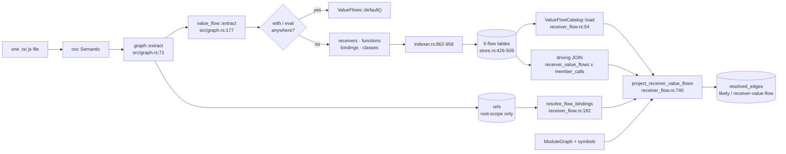
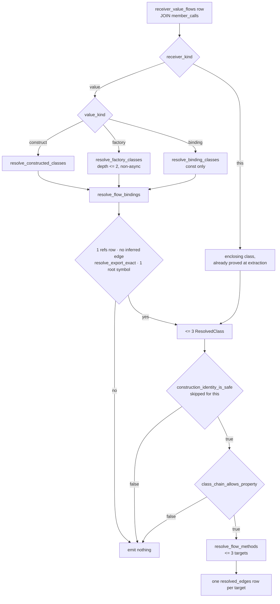

# Bounded receiver value flow

jscout erases types on purpose, which leaves one structural hole: a `member_calls` row records that something named `insert` was called on a receiver spelled `db`, and nothing in the index says which `insert` runs. The bounded receiver value-flow subsystem closes the subset of that hole that is provable from lexical binding shape alone. `src/value_flow.rs` (838 lines) runs as a pure pass over one file's oxc `Semantic` and records closed syntactic shapes — `this` inside an instance method, `new C()`, a `const` bound to one, an imported binding, a synchronous factory whose every return path yields another supported shape — into six SQLite tables. `src/structural/receiver_flow.rs` (936 lines) is the only half that crosses files: at snapshot rebuild it loads those facts, walks the module/export graph to turn each stored reference into at most three concrete classes, vetoes anything a shadowing member or an unprovable superclass chain could redirect, and emits occurrence-specific `member_call` edges straight to the method symbol at `likely` confidence with provenance `receiver-value-flow`. Occurrences it answers are then removed from the TypeScript checker's work plan outright.

## The dispatch problem, and the three answers to it

Before this landing there were two ways to answer `db.insert()`. The first is the name-match hub in `project_member_calls` (`src/structural.rs:1996`): synthesize a `member:unknown:insert` node, point the call site at it, and fan `member_candidate` edges out to every indexed symbol named `insert`, all at `possible`. The second is the TypeScript checker sidecar, which is correct but pays for a `Program` build per project and had already been measured at 284,184 eligible occurrences on n8n. Value flow adds a third answer that costs nothing beyond one AST pass and one projection stage, at the price of only ever answering receivers whose identity is *lexically* closed.

| Answer | Destination | Confidence | Provenance | Cost |
| --- | --- | --- | --- | --- |
| Name-match hub (`src/structural.rs:1996`) | `member:unknown:<prop>` hub, then every same-named symbol | `possible` | `member-name-match` | free, but useless fan-out |
| Receiver value flow (`src/structural/receiver_flow.rs:740`) | the method symbol key, 1–3 targets | `likely` | `receiver-value-flow` | one AST pass, one projection stage |
| Checker enrichment (`src/structural.rs:2185`) | declaration anchor | `likely` or `possible` | checker | a `Program` build per project |

The hub is not a universal floor. `project_member_calls` bails before emitting any node or edge when no indexed symbol shares the property name (`src/structural.rs:2037-2041`), so for a call whose property matches nothing, a value-flow edge is the *only* edge that exists rather than an upgrade over a `possible` one.

## Extraction: facts, not conclusions

`value_flow::extract` (`src/value_flow.rs:82`) is called from `graph::extract` (`src/graph.rs:177`), the per-file syntactic pass, and knows nothing about any other file. Its first act is a whole-file bailout: if any node is a `WithStatement` or any `IdentifierReference` is named `eval`, it returns `ValueFlows::default()` (`src/value_flow.rs:83-93`). The bailout is file-wide rather than scoped because sloppy-mode dynamic scope introduced at one site can redirect a binding the semantic model attributes to a lexical root from inside a nested function elsewhere in the same file; a site-local check would be unsound. The cost is bluntness — one `eval` identifier anywhere zeroes that file's flow facts.

After the bailout, `collect_member_writes` makes a single AST pass producing two write sets: properties written on each root symbol, and properties written on `this` per class (`src/value_flow.rs:298`). `collect_function_returns` (`:421`) then builds the return catalog, and the four extractors run. Only two orderings are load-bearing: returns need the binding write sets, and both `extract_classes` (`:150`) and `extract_functions` (`:460`) consult the return catalog. All four extractors take a write set and write disjoint output vectors, so classes, functions, bindings and receivers could run in any order among themselves. `extract` finishes by sorting every vector — receivers by call span, the rest by `(name, start)` — so persisted row order is stable (`src/value_flow.rs:101-113`).

The whole vocabulary of what the extractor is willing to claim is three `FlowValue` kinds (`src/value_flow.rs:27`), produced by `value_from_expression` (`:737`):

| Kind | Accepted shape | Notes |
| --- | --- | --- |
| `construct` | `new X` / `new ns.X` | callee must pass `flow_reference` |
| `factory` | `f()` / `ns.f()`, **non-optional** only | `optionalFactory?.()` is rejected |
| `binding` | an identifier declared by `ImportSpecifier` / `ImportDefaultSpecifier` | *only* imports; local consts are chased recursively instead (`:765-791`) |

Everything else yields `None`, and `None` means the extractor refuses, never "unknown, guess later". `await` is refused explicitly (`src/value_flow.rs:752-754`): thenable assimilation means even `await new C()` can produce something that is not a `C` if `C.prototype.then` exists, and proving otherwise needs types. That exclusion is expensive — async factories are exactly what DB adapters and clients look like — and those occurrences fall through to the checker. An identifier is also dropped if `symbol_is_mutated` or if any property is written on it anywhere in the file, and `extract_receivers` (`:608`) additionally skips a receiver whose called property (or `*`) appears in that symbol's write set. Only `StaticMemberExpression` callees produce a receiver flow at all, so `obj["run"]()` is silently outside the plane.

Classes are the other refusal-heavy path. `extract_classes` emits no `ClassFlow` at all for a class that is `declare`d, has runtime decorators on the class, any method, any method parameter or any property (`src/value_flow.rs:285-296`), whose binding is mutated, or whose constructor has a return summary in the catalog — an explicit `return` from a constructor means `new C()` need not yield a `C`. For classes it does emit, it accumulates `blocked_instance_members`: instance fields and accessors, computed keys (contributing the wildcard `"*"`, which blocks every property), TS parameter properties, declaration-only overloads with no bodied sibling, and every `this.x = …` write collected earlier. `instance_methods` is deliberately narrower than what `heur.rs` emits as symbols — only bodied, non-static, `MethodDefinitionKind::Method` definitions (`:217-225`) — which is what later collapses `run(a: string): void; run(a: number): void; run(v) {}` to one target instead of three.

`FunctionFlow` is a *complete* return summary or nothing. `function_returns` (`:577`) requires the body's last statement to terminate (`statement_terminates`, `:593`, recursing through blocks and both `if` arms) and every return to carry a supported value; one unsupported return suppresses the summary. `is_async` is stored rather than filtered here so projection can reject it explicitly and the fact stays auditable in SQL.

The joint between the halves is a byte offset. `FlowReference.start` (`src/value_flow.rs:18`) is the source position of the target identifier — for `ns.make()`, the *namespace base* identifier, with `name` set to the property, matching how `graph.rs` records a namespace-mediated reference with detail `"via namespace <local>"` (`src/graph.rs:287`). `flow_reference` (`src/value_flow.rs:800`) therefore rejects any symbol not in the root scope: `graph.rs` only emits `refs` rows for root-scope bindings (`src/graph.rs:239-317`), and a fact that cannot later be joined is worse than no fact. `src/store.rs:389` widened the old file-only refs index to `idx_refs_file_start(file_id, start)` for precisely this lookup.

### Storage

`src/indexer.rs:862-958` writes the four vectors into six tables, inside the single transaction that spans the whole index run (`BEGIN` at `src/indexer.rs:357`, `COMMIT` at `:508`) — symbols (`:755`) and member_calls (`:837`) precede the flow inserts, `refs` follows at `:993`. The CHECK constraints in `src/store.rs:426-509` mirror the Rust invariants rather than merely typing the columns.

| Table | Grain | Enforced shape |
| --- | --- | --- |
| `receiver_value_flows` | one row per answerable member call | `UNIQUE(file_id, call_start, call_end)`; CHECK requires exactly the `this` column set *or* exactly the `value` set (`src/store.rs:436-447`) |
| `function_return_flows` | one row per return of a complete factory | closed `value_kind` / `target_kind` vocabularies, `UNIQUE(file_id, function_start, return_index)` |
| `value_binding_flows` | root-scope `const` | PK `(file_id, binding_start)` |
| `class_value_flows` | class name plus optional superclass reference | CHECKs tie `super_name`, `super_start`, `super_kind` to null together |
| `instance_method_value_flows` | `method_start` → `class_start` | PK `(file_id, method_start)` |
| `class_member_value_flow_blockers` | the shadowing veto list | PK `(file_id, class_start, member_name)` |

All six sit on the disposable plane: the durable migration drops and recreates them (`src/store.rs:226-231`, floor `DURABLE_SCHEMA_FLOOR = 16`) and reset deletes them (`:1062-1067`).

The diagram below traces one file from parse to stored facts, then the same facts back out at snapshot rebuild. Watch where the two halves touch: only through the six tables and the `refs` offset lookup.

`VF` produces `FACTS` with no knowledge of any other file; `CAT` and `DRV` are the only readers. Note that `CAT` loads five tables — `function_return_flows`, `value_binding_flows`, `class_value_flows`, `instance_method_value_flows`, `class_member_value_flow_blockers` — while `receiver_value_flows` is the separately streamed driving query at `src/structural/receiver_flow.rs:777-788`, ordered by `(file_id, call_start, id)`.

## Projection: the resolution chain

`project_receiver_value_flows` (`src/structural/receiver_flow.rs:740`) runs inside the projection transaction between the hub stage and the checker stage (`src/structural.rs:578`). It builds the catalog once, indexes symbols by key and by file, and constructs a `methods` map from `(file_id, class_start, name)` to symbol keys by joining every symbol's `(file_id, start)` against `instance_method_value_flows` — the join that filters `heur.rs`'s one-symbol-per-`MethodDefinition` output down to the bodied non-static methods.

Every path through the resolver funnels into `resolve_flow_bindings` (`:182`), the single module hop. It looks the target offset up in `refs` with a cached statement and requires **exactly one** row (`:204`); two rows at one offset means the reference plane cannot disambiguate. It checks the `"via namespace "` detail against the stored `target_kind`, so a `member` reference is accepted only through a real namespace import and an `identifier` reference is rejected if it went through one. For a non-local target it refuses any `workspace-inferred` module edge (`graph.edge_inferred`, `:224`) and then calls `query::resolve_export_exact` (`src/query.rs:151`) rather than the ordinary resolver. That function returns `None` on an ambiguous `export *` branch, a re-export cycle, or a re-export crossing an inferred edge (`src/query.rs:162-215`) — its doc comment says outright that projections which suppress a later checker pass need a closed binding, not the graph's best structural candidate. Finally the result must be exactly one non-ambiguous root symbol (`:236`).

The three value kinds then dispatch. `resolve_constructed_classes` (`:260`) demands every resolved binding have kind `class`. `resolve_factory_classes` (`:432`) caps at `depth > 2`, demands kind `function` or `const`, refuses `is_async`, and unions the classes from every return — one unresolved return aborts the whole set. `resolve_binding_classes` (`:514`) demands kind `const` and follows the stored binding value; note it passes `depth` through unchanged, so only the factory arm increments. Cycles are cut with `visited: BTreeSet<(u8, i64, i64)>` where the `u8` tag separates the function and binding namespaces — they share the `(file_id, start)` space — and entries are removed on both success and failure paths so a diamond is not misread as a cycle. Every accumulator aborts above three classes.

The next diagram is the ladder for one occurrence. Look for the two veto gates between "a class set exists" and "an edge exists".

`THIS` short-circuits the whole left column: inside a method body the instance is the class by definition, so there is no construction site to validate and `construction_identity_is_safe` is skipped (`src/structural/receiver_flow.rs:851`). `CIS` (`:292`) walks the exact superclass chain and demands every link be a known `class_value_flows` row whose base resolves to exactly one class — which is how `extends dynamicBase()` and a constructor with an explicit `return` are rejected — and returns `false`, not an error, when it detects a construction cycle (`:305-307`). `CAP` (`:359`) is called from inside `resolve_flow_methods` (`:667-678`) and refuses the whole occurrence if any class in the chain lists the property, or `"*"`, in `class_member_value_flow_blockers`; this is the shadowing proof, not bookkeeping. `RM` (`:655`) then maps the property to keys, requiring exactly one own method; when the class has none, it resolves the superclass through `resolve_constructed_classes` and takes the base's single method, re-checking the base's blockers first (`:690-732`). Every catalog hit re-verifies `flow.class_name == class.name` (`:309`, `:373`, `:693`) — the `(file_id, start)` key alone is not accepted as identity.

Two caches make this affordable across occurrences: `construction_cache` keyed by `ResolvedClass` and `method_cache` keyed by `(sorted class set, property)` (`:774-775`). The method cache stores the negative answer too (`:889`), so a refusal is computed once per key rather than once per call site.

## The edge, and what it suppresses

Each answered occurrence produces one `resolved_edges` row per target: `kind='member_call'`, `confidence='likely'`, `provenance='receiver-value-flow'`, `source_ref_id` = the `member_calls` rowid, `src_key` = the enclosing symbol or `file:<path>`, `dst_key` = the method symbol key directly rather than a hub, and `detail_json` carrying `memberCallId`, the call/receiver/property spans, `flow`, `receiverClasses` as `<path>#<Class>`, `candidateCount`, and `occurrenceSpecific: true` (`:898-933`). `candidateCount` always equals the number of edges emitted for that occurrence. The id appears in both `source_ref_id` and `detail.memberCallId` because the two downstream consumers query different columns.

`likely` is the ceiling by construction, not by caution: alias-mediated writes, `Object.assign`/`defineProperty`, prototype mutation, awaited values and global rebinding are all outside the proof, so `certain` would be a lie (README.md:1088, PLAN.md:640-643). It matters that `likely` is also the default `min_confidence` for neighborhood and path traversal (`src/structural.rs:225`, `:325`), so these edges are visible by default while `possible` hub candidates are not.

Leaving the hub edge in place and adding a higher-confidence one avoids any stage deleting another stage's output, but it means an answered call site has two outgoing edges for the same call. `who_uses` therefore needs an explicit `NOT EXISTS` predicate to stop offering a resolved site as a possible caller of every same-named symbol: it drops hub candidates for any call whose `detail.memberCallId` already carries a `certain` or `likely` edge (`src/query.rs:516-523`). The checker side is stricter still. `project_checker_enrichments` preloads every `source_ref_id` with `provenance='receiver-value-flow' AND confidence='likely'` into a `HashSet` and `continue`s on a match (`src/structural.rs:2192`, `:2286`), and `checker::enrich::load_occurrences` runs the same query to set `Occurrence.value_flow_resolved` (`src/checker/enrich.rs:218`, `:1109`, `:1182`), which `select_eligible` treats as an unconditional exclusion sitting *outside* the `include_all` disjunction (`:1204`). `--all` widens roles and re-admits other deterministically-resolved calls but never these, and its help text says so (`src/cli.rs:518-521`). The canonical checker fact stays in `checker_enrichments` and is skipped only at projection — though that table is itself dropped by the durable migration (`src/store.rs:211`), so "still reusable" holds only within a schema generation.

## Measured behaviour

PLAN.md:1025-1058 records the validation runs. On ai-pipe, 557 answered occurrences produced 1,025 edges and cut the exhaustive checker plan from 5,158 to 4,601 occurrences; all 557 were retained against a 669/669 bidirectionally exact pre-pass checker oracle. On n8n, 14,414 occurrences produced 14,456 edges and cut selection from 284,184 to 269,770. Two performance rounds followed. Merging the two full-AST scans into one `collect_member_writes` and switching the exact-ref lookup to `prepare_cached` took isolated n8n receiver-flow projection from 906 ms to 380–385 ms with an unchanged normalized target-set digest; cold index cost rose 2.0% (19.150 s → 19.536 s over three paired release runs, with individual deltas from −3.2% to +9.7%). Then the checker projection's unindexed correlated `NOT EXISTS` over `resolved_edges` — 3,836 facts against 869,952 edges — was replaced by the preloaded id set, taking the identical restricted n8n enrichment from 374.62 s to 62.36 s with the same 6,554 selected occurrences, 14,265 queries and 3,836 facts.

## What it does and does not resolve

| Resolves | Does not resolve |
| --- | --- |
| `this.m()` in a method or an instance field/accessor initializer whose span contains the call | `this` inside a nested ordinary `function` (its own `this`); arrow functions do pass through (`src/value_flow.rs:668-690`) |
| `new C().m()`, `const c = new C(); c.m()`, aliases through further consts | any receiver reached via `await`, a conditional expression, destructuring, an object literal, or a parameter |
| imported/exported `const` singletons, one hop through `resolve_export_exact` | anything behind an ambiguous star re-export, a cycle, or a `workspace-inferred` module edge |
| namespace-mediated factories `ns.make()` | object-member factories `obj.make()` where the base is not a namespace import |
| synchronous factories to depth 2, unioning up to three classes | `async` factories; a fourth branch yields nothing at all |
| one hop of inheritance when the class has no own method | any class with a runtime decorator, a mutated binding, or a constructor that returns |
| overload sets, collapsing to the single bodied implementation | computed property access `obj["run"]()`; any property blocked by a field, accessor, parameter property or `this.x =` write in the chain |

Two adjacent behaviours are easy to state backwards. Optional *invocation* (`x.run?.()`) is deliberately retained, because it changes whether the call executes, not which function it would call; an optional *factory result* (`optionalFactory?.()`) is rejected, because it changes the value's identity (`src/value_flow.rs:748`).

The honest framing of the yield is that value flow answers construction sites, and construction sites are mostly tests: 499 of ai-pipe's 557 answered occurrences are in tests and only 9 in `server/`, and n8n's split is 9,071 of 14,414. PLAN.md:1094-1100 records that ai-pipe's server has 170 `db.*` call sites on parameters, which neither value flow nor the checker answers; the designed-but-unimplemented argument→parameter flow (PLAN.md:1150-1203) is where the remaining value sits, gated behind a measurement probe. A known over-approximation the caps do not catch: `openDatabase(path, {driver})` where the argument selects one branch still emits both adapters at `likely` (PLAN.md:1050-1052) — an `if`-chain factory unions its branches, and only a conditional *expression* is rejected outright as an unsupported shape.

## Testing, and the shape of the risk

Neither file contains a `#[cfg(test)]` module; 1,774 lines carry zero unit tests. The entire specification is 15 behavioral tests named `receiver_value_flow_*` in `src/structural/tests.rs:1607-2330`, each writing a real temp repo, running `indexer::index_repo`, and asserting on `resolved_edges` joined to `graph_nodes` — display names, `confidence`, `line`, and parsed `detail_json`. Negative coverage is where the density is: a single test at `:2027` packs roughly two dozen hostile class and factory shapes and asserts exactly one surviving edge, while separate tests pin the `await` refusal (`:1770`), `with` (`:1797`), `eval` (`:1819`), sloppy block-scoped function redeclaration (`:1843`), the four-class cliff (`:1917`), inferred module edges (`:2257`), ambiguous star re-exports (`:2207`), and removal of a fact when a `const` becomes unsupported on re-index (`:2306`). Cross-subsystem, `src/checker/enrich/tests.rs:1577` asserts an answered occurrence is dropped under both default and `--all`, and `:2575` asserts a seeded canonical checker fact stays stored while projecting zero checker edges beside the one value-flow edge. All six tables appear in the normalized cross-database digest in `src/indexer/tests.rs:1174-1210`, so any change to extracted spans or kinds breaks that ratchet.

The consequence of that structure is that a pure-function bug — in `statement_terminates`, in the blocker accumulation, in `enclosing_instance_class`'s arrow-versus-function distinction, which one test line at `src/structural/tests.rs:1625-1626` pins — is only visible if some end-to-end test happens to cover the shape. And the failure mode is asymmetric: because the checker exclusion is unconditional, a false positive here does not merely add a wrong edge, it silently *removes* an occurrence the sidecar would have answered correctly, with no `--all` escape. The `methods` map is a second undocumented coupling of the same kind: it depends on `heur.rs` emitting a symbol per `MethodDefinition` and `instance_method_value_flows` filtering to bodied non-static ones; change either side alone and overload resolution regresses silently to `own.len() != 1` → give up. Similarly, `extract_receivers` reads `member.object.get_inner_expression()` while `heur.rs`'s `visit_call_expression` uses `&m.object` directly — for a parenthesized receiver the two disagree about the object, and only the span-based join keeps the rows aligned.
