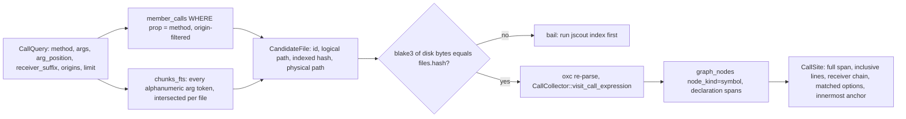
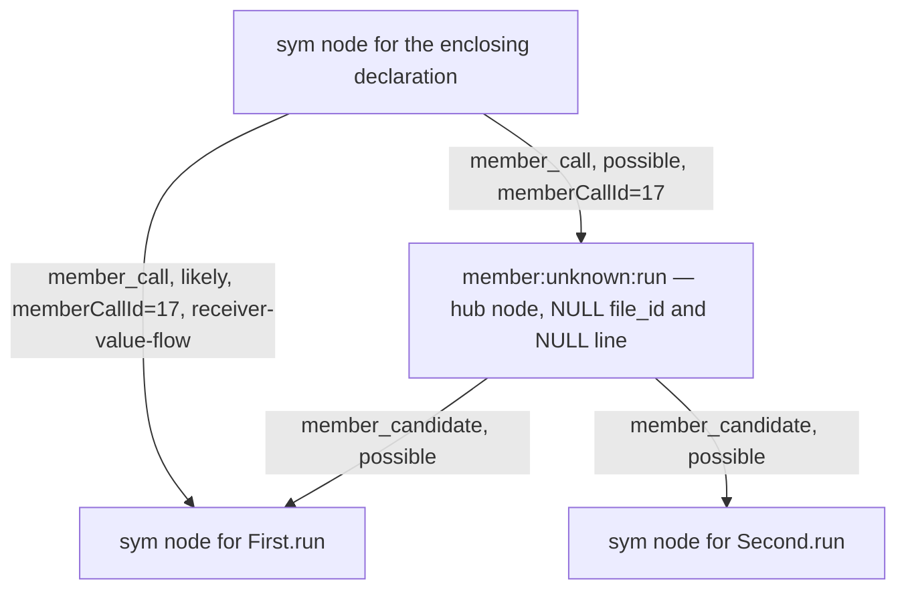
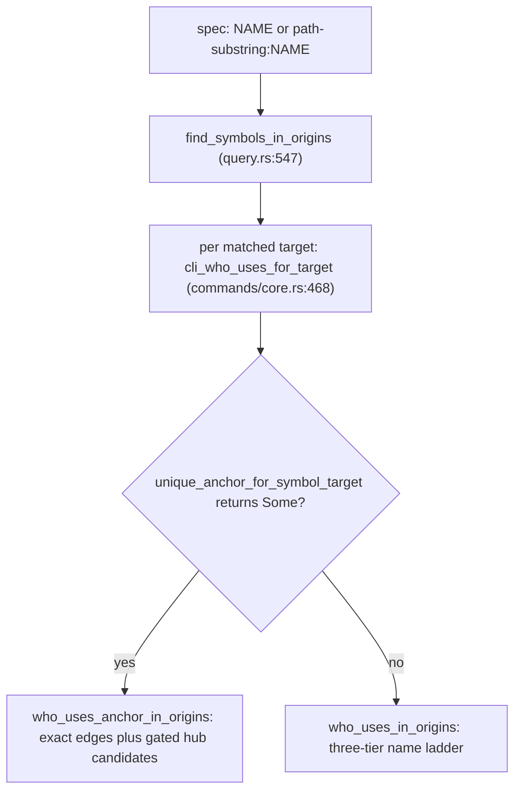

# Call graph, queries, and the agent read surface

Three files answer the questions an agent actually asks of an index: "where is this method called with these options" (`src/calls.rs`), "who uses this symbol" and "what does this export resolve to" (`src/query.rs`), and "what is in this repository" (`src/surface.rs`). None of them extracts anything; they read `member_calls`, `refs`, `exports`/`module_edges`, `graph_nodes`/`resolved_edges` and the entity tables written elsewhere. What distinguishes them is where each draws the line between a resolved fact and a name-match guess, and what it does at read time when the writer could not decide. `calls` refuses to trust the index at all beyond narrowing; `who_uses` has one exact path and one blunt fallback and now suppresses guesses that a resolver already closed; the overview never guesses but has to fit a byte budget, and chooses what to drop in a fixed order.

## `calls`: the index narrows, the parser decides

`calls::query` (`src/calls.rs:101`) never answers from stored rows. It uses the index twice, only to shrink the file set. `candidate_files` (`src/calls.rs:178`) selects `DISTINCT` files having at least one `member_calls` row whose `prop` equals the method, gated on the requested origins, and assembles a *physical* path per file: repository and workspace files are `root.join(path)`, while a `dependency:` file is `package_instances.canonical_root` joined with `files.package_path`, with a NULL in either being a hard error. So `--file-origins dependency` deliberately reads outside the repository root. `fts_file_ids` (`src/calls.rs:236`) then intersects that set with the files whose chunks match every usable argument token — per *file*, not per chunk, because a key and its value can legitimately land in different chunks of the same file (`src/calls.rs:233-235`). Tokens with no alphanumeric character are dropped, and each survivor is FTS-quoted with embedded `"` doubled (`src/calls.rs:244`).

Narrowing is a strict AND, and that is the blunt edge: a file with no `member_calls` row for the property is never re-parsed, so any call shape the extractor did not record — computed access `obj['insert']()`, a call through a bound variable, a bare `insert(...)` — is unreachable no matter what is on disk. The FTS half errs the other way: a file where `merge` appears in one function and `replace` in an unrelated one still gets re-parsed. Narrowing is a prefilter, never a decision.

Look at the fan-in on the left, the gate in the middle, and note that the anchor comes from a *third* table only after the parse succeeds.

`PARSE` decides membership: `CallCollector::visit_call_expression` (`src/calls.rs:300`) requires a `StaticMemberExpression` callee whose `property.name` equals the method, then the receiver test, then the argument filters. `DECL` only attributes: `symbol_declarations` (`src/calls.rs:263`) loads every symbol node's `meta_json.declaration` span for the file, and the anchor is the declaration with the *smallest* span containing the call (`src/calls.rs:144-148`) — `None` for a module-level call. Evidence joins by span containment throughout: `SITE.end_line` is `span[1].saturating_sub(1)` (`src/calls.rs:152`), so a ten-line call owns all ten lines and an option literal matched on the last one still reports the call, not the line.

Receiver matching is suffix-on-segments: both the static chain from `heur::member_path` and the requested suffix are split on `.` and compared with `ends_with` over the segment vectors (`src/calls.rs:325-328`), so `wave.card` matches `dbs.wave.card` but `ve.card` does not. Argument matching is stricter than it looks.

| Input | Behaviour | Where |
| --- | --- | --- |
| no `--arg` at all | every member call of the method matches; `matched_argument` is null | `src/calls.rs:337-338` |
| `--arg KEY` | presence test; matches a computed or spread value, and `MatchedOption.value` is then `None` | `src/calls.rs:31`, `:397` |
| `--arg KEY=VALUE` | compared against literal text only: strings unquoted, numbers as written (`raw`), booleans, `null`, expressionless templates | `src/calls.rs:397` |
| several `--arg` filters | all must hit top-level properties of **one** object literal; split across two arguments never counts | `src/calls.rs:340-355` |
| `--arg-position N` with no `--arg` | silently ignored — `match_arguments` returns before the position loop | `src/calls.rs:337-338` |

That last row is a real trap: `jscout calls … --arg-position 3` alone matches every `.method()` call in the repository.

### What the drift check actually guarantees

Each candidate file is read from disk and its blake3 compared to `files.hash`; a mismatch is a hard `bail!` (`src/calls.rs:119-124`). The point is that spans and line numbers must describe the bytes the user has, and the index cannot supply a call's full structure after an edit. But the guarantee is narrower than "never answers from a stale index". The scan aborts as soon as `matches.len()` reaches the limit — `truncated` is set and the inner loop breaks (`src/calls.rs:140-143`), then the outer loop (`src/calls.rs:162-164`) — so every candidate past that point is neither read nor hashed. And a file edited since indexing to *add* a call of the method never enters the candidate set at all. The honest statement is: every candidate scanned before the limit was reached is verified. `files_scanned` compounds this by reporting `files.len()` (`src/calls.rs:170`) — candidates selected, not files exhausted — so it overstates both work done and drift coverage.

## Three export ladders over one edge table

`ModuleGraph::load_inner` (`src/query.rs:36`) pulls `exports`, optionally `contract_exports`, `module_edges` keyed `(from_file, request)` with a `resolution == "workspace-inferred"` flag, and `files` paths into memory. Four table scans per invocation buys the ability to backtrack across star re-exports without per-hop SQL. `ExportEntry` (`src/query.rs:6-12`) is one shape covering local exports, defaults, re-exports, `export * as ns`, and barrels; the match arms discriminate.

| Ladder | Ambiguity | Inferred edges | Caller |
| --- | --- | --- | --- |
| `resolve_export` (`src/query.rs:128`) | first `export *` branch that hits wins | accepted silently, flag discarded | reference projection, `who_uses` name tier 2 |
| `resolve_export_traced` (`src/query.rs:135`) | same | accepted, but reports whether the *successful* chain crossed one | reference projection, for confidence demotion |
| `resolve_export_exact` (`src/query.rs:151`) | `Some` only for a candidate set of exactly one | any inferred hop is `Unsafe` → `None` | `src/structural/receiver_flow.rs:230`, only |
| `resolve_contract_export_traced` (`src/query.rs:251`) | as traced, over the documentary plane loaded only by `load_with_contracts` | as traced | structural contract resolution |

`ExactExportResolution` (`src/query.rs:324-328`) is three-valued for a reason: `Missing` is a benign dead star branch other sources may still cover, `Unsafe` short-circuits the entire resolution, and a `Candidates` set larger than one is a refusal rather than an arbitrary pick. Cycles (`src/query.rs:168-170`), a missing module edge, an inferred edge, and a malformed entry all yield `Unsafe`; a *missing exports table* for the file yields `Missing` (`src/query.rs:171-173`), which is the one case where the strict ladder is forgiving. It also refuses `export *` for the name `default`, returning `Missing`, because ECMAScript star re-exports never carry the target's default binding (`src/query.rs:217-222`).

The two recursions are near-parallel and can drift. One difference already shows: `resolve_export_exact_inner` clones `visited` per star branch (`src/query.rs:225`, `:236`), while `resolve_export_inner` shares one set across branches (`src/query.rs:301-316`), so in the lenient ladder a failed branch can leave `(file, name)` pairs marked visited for later ones. It does restore the `inferred` flag around a failed branch (`src/query.rs:308`, `:317`), so a dead branch cannot taint the inference reported for the chain that succeeded.

Why three: reference projection can afford to guess and label the guess `likely`. Receiver value flow cannot — its edge suppresses a later checker question (below), so a wrongly closed binding becomes an unchallenged fact. The cost is that the strict form loses genuine resolutions whenever the graph is merely under-resolved rather than actually ambiguous.

## The member-call hub, and un-telling its story at read time

Deterministic extraction models an unresolved `x.run()` as two edges through one synthetic node per property name: `caller --member_call--> member:unknown:run --member_candidate--> each same-named symbol` (`src/structural.rs:1996-2099`). That keeps edge count linear in (sites + namesakes) rather than their product, and gives graph ranking one high-degree node to damp. The hub is created once per property, from the first member call encountered (`src/structural.rs:2043`), with `receiver: "unknown"` in its `meta_json` — discarding the chain `member_calls` faithfully stored — and a `candidateCount` fixed at that first snapshot rather than per site.

Three producers can close a specific occurrence with an edge that bypasses the hub, all keyed by `detail_json.memberCallId`, which is `member_calls.rowid`:

| Producer | Confidence | Provenance | Site |
| --- | --- | --- | --- |
| checker projection | `certain`, downgraded to `possible` on low confidence or non-empty `failedProjects` | `checker` | `src/structural.rs:2353-2358` |
| receiver value flow | always `likely` | `receiver-value-flow` | `src/structural/receiver_flow.rs:911-927` |
| namespace-import reference projection | as the ref carried, demoted for inferred edges | `semantic+resolver*` | `src/structural.rs:1077` |

The first two are mutually exclusive per occurrence: the checker projection skips any `member_call_id` already in `value_flow_resolved` (`src/structural.rs:2286`), so value flow wins. Critically, none of them deletes the hub edges — `structural/tests.rs:1185` (`checker_facts_project_per_occurrence_without_replacing_member_hubs`) pins that. Keeping the hub means a later loss of checker facts does not silently erase the call from the graph; the price is that read-time logic has to hide the now-redundant candidates.

Look at the two edges leaving `CALLER` — same call site, same `memberCallId`, different confidence — and at which of them `SECOND` can see.

`who_uses_anchor_in_origins` (`src/query.rs:456`) runs two SQL passes into one deduped list. Pass 1 selects every `resolved_edges` row whose `dst_key` is the anchor, with **no kind predicate** — imports, renders, extends and entity edges all count as "uses" — ordered `certain`/`likely`/other, then path, line, kind, id. Note that `member_candidate` edges can never appear here: `HUB` has NULL `file_id` and NULL line (`src/structural.rs:2044-2058`), so both the `JOIN files ON file.id=COALESCE(edge.source_file_id, source.file_id)` and the `COALESCE(edge.line, source.line) IS NOT NULL` predicate exclude them. That absence is exactly why pass 2 exists.

Pass 2 joins `member_candidate` back through the `member_call` leg to recover the caller's real file and line, emits at `kind='call'`, `confidence='possible'`, and is gated by a correlated `NOT EXISTS` on `resolved_edges` (`src/query.rs:516-523`) requiring the same `src_key`, a confidence in `('certain','likely')`, `json_type(detail_json,'$.memberCallId')='integer'`, and equality of the two `memberCallId` values. In the diagram, `SECOND`'s pass 2 finds its `member_candidate` edge, joins to the `possible` hub `member_call` edge carrying `memberCallId=17`, and the subquery finds the `likely` edge from the same `CALLER` with the same id — so the site is dropped from `SECOND` entirely. The hub's own edge cannot suppress itself because it is `possible` (`src/structural.rs:2084`), outside the predicate.

The suppression is **per call site, not per anchor**, and that is the whole point. The previous `(file, line)` dedup — still applied afterwards (`src/query.rs:539`) — could only hide a candidate from the anchor that also received the closing edge. `Second#run` was being offered `first.run()` as a possible usage of itself, because the closing edge is absent from `Second#run`'s pass 1. `src/commands/core_tests.rs:9-50` is the direct proof: two same-named class methods plus a `declare const dynamic: any; dynamic.run()`, asserting per target exactly one `likely` usage and exactly one `possible` usage whose detail is `dynamic.run()`.

Three limits. The gate has no kind predicate on the closing edge: any `certain`/`likely` row from the same `src_key` carrying that `memberCallId` suppresses. Today only `member_call` and namespace-reference edges carry the key, so this is harmless, but a future producer writing `memberCallId` into an unrelated edge kind would silently blank hub candidates. Second, a checker projection downgraded to `possible` (`src/structural.rs:2329-2334`) does *not* satisfy the gate, so an occurrence the checker did resolve can still admit generic candidates, removed only by the `(file, line)` dedup. Third, the gate is origin-blind: if the checker resolved `x.run()` onto a dependency target the caller excluded by origin, the closing edge still exists and still suppresses, so a repository-scoped `who_uses` loses the site outright rather than showing it as `possible`. And `$.memberCallId` is a JSON path SQLite cannot index; the subquery narrows on `idx_resolved_edges_src(src_key, confidence, kind)` then `json_extract`s each row — on a hot property name with many namesakes, the most expensive part of anchor mode.

## Dispatch, and the name ladder behind it

`UNIQ` is `unique_anchor_for_symbol_target` (`src/query.rs:364`): it lists `graph_nodes` joined to `symbols` on `native_table='symbols' AND native_id=symbol.id`, filtered by the target's `file_id` and `name` — and, unlike `find_symbol_by_anchor_in_origins` (`src/query.rs:419`), with no `node_kind='symbol'` predicate. A single candidate on the target's declaration line wins; otherwise it is exact only if there is exactly one candidate at all, so two same-named symbols declared on one line (minified source) fall back for both.

`PER` is what changed: `cli_who_uses_for_target` is applied to *every* matched target, so `jscout who-uses run` gets exact edges for each of two namesake classes, where the earlier uniqueness gate degraded both to the name ladder. Expect two targets to report seemingly contradictory pictures of one source line — one `likely`, the other nothing — which is the correct answer.

`NAME` (`src/query.rs:632`) is unchanged and much weaker.

| Tier | Source | Confidence | Weakness |
| --- | --- | --- | --- |
| 1 (`:646`) | `refs WHERE local=1 AND file_id=? AND target_name=?` | as stored | same file only |
| 2 (`:662`) | every cross-file `refs` row *in the allowed origins* with `target_request IS NOT NULL`, resolved in Rust | as stored | no name filter in SQL; uses the untraced `resolve_export` (`:692`), losing the workspace-inferred demotion `project_references` applies |
| 3 (`:699`) | every `member_calls` row with a matching `prop` | `possible` | receiver ignored entirely |

Tier 2 does accept a ref outright when `target_file == file_id && target_name == name` (`src/query.rs:688-690`), bypassing export resolution as a defensive direct hit. Tier 3's `seen` set is built once (`src/query.rs:701`) and never inserted into, unlike pass 2 which inserts as it goes — so `a.foo(); b.foo();` on one line yields two rows in name mode and one in anchor mode.

Two consumers inherit anchor mode's behaviour. `src/search.rs:2366-2382` computes a search hit's cross-file `used_by` count through `who_uses_anchor_in_origins` when the hit has exactly one `sym:` anchor, so suppression lowers `used_by` for anchors previously credited with other namesakes' resolved calls. MCP `who_uses` (`src/mcp.rs:1072`) does **not** inherit the CLI's upgrade: `symbol_targets` (`src/mcp.rs:1515-1543`) returns a `SymbolAnchorResolution` only when the caller passed `anchor`, so a plain `symbol` spec goes straight to the name ladder. Same tool name, two resolution ladders, two different suppression behaviours.

Rendering diverges too. The CLI does not sort — it buckets into a `BTreeMap` by confidence and prints `certain`/`likely`/`possible`, preserving tier insertion order inside each bucket (`src/commands/core.rs:442-463`). `compact::who_uses_string` sorts globally by confidence rank, then target index, file, line, kind, chunk name, detail (`src/compact.rs:415-424`), drops whole targets until the envelope fits, then binary-searches a retained prefix of that sorted list (`src/compact.rs:463-486`) — so shedding is confidence-ordered, lowest first. It bails below 256 bytes (`src/compact.rs:405-407`); exact-anchor mode reserves the resolution envelope up front (`src/mcp.rs:1577-1592`).

A `Usage` (`src/query.rs:330-339`) is flat and untyped in `kind`/`confidence` so both entry points emit the same record, but two fields mean different things per path. `chunk_name` is `source.display_name` in anchor mode — the graph node's name, which for `handles_route`/`job_handler` edges is a route or job entity — and `chunks.name` in name mode. `detail` in pass 1 is `$.detail` only when it is text, and checker and receiver-value-flow `member_call` edges carry none; so a *resolved* `likely` call renders with a null detail while the *unresolved* `possible` hub row renders `object.property()`. That string is itself partial: `member_calls.object` is populated only for a bare identifier or `this` receiver (`src/heur.rs:200-213`), so `dbs.wave.card.insert()` yields a null detail even though `member_calls.receiver` holds the whole chain. `calls` uses the full chain; `who_uses` does not.

## The read surface: entities and a self-measuring overview

`surface::entities` (`src/surface.rs:79`) validates origins, file roles and planes, then ranks in a CTE by exact-name match followed by occurrence count, with a `count(*) OVER ()` window supplying the matched total. The same role/file-role/origin allowlists apply both in the ranking CTE and in `load_occurrences` (`src/surface.rs:182`), so `occurrence_count` and the returned occurrences describe one filtered population; `truncated` compares the window total against the limit. `load_occurrences` over-fetches `occurrences_per_entity + 1` (`src/surface.rs:215`) although the truncation flag comes from the CTE count, so the extra row is redundant.

`overview_response` (`src/surface.rs:570`) validates arguments — `semantic_limit` in 1..=100, a nonzero byte limit, `reconnaissance_limit` ≤ 100, detail requiring both an exact subject and a nonzero limit, then `validate_semantic_types` (`src/surface.rs:589`) — and only then opens a `SAVEPOINT` via `store::with_read_snapshot` (`src/surface.rs:590`) so every count describes one database state. Inside, it computes the deterministic overview, the optional semantic and reconnaissance overlays, seeds five `omitted_*` counters, and hands the whole response to `apply_overview_budget` (`src/surface.rs:998`), which sheds in a fixed order.

| Step | Dropped | Counter |
| --- | --- | --- |
| 1 | one semantic artifact | `omitted_semantic_artifacts` |
| 2 | one reconnaissance *detail* block, headline retained | `omitted_reconnaissance_details` |
| 3 | one relation row | `omitted_relations` |
| 4 | one area row | `omitted_areas` |
| 5 | one entity inventory row | `omitted_entity_inventory` |
| 6 | one reconnaissance *classification* | `omitted_reconnaissance_classifications` |
| 7 | nothing left — bail naming the minimum envelope | — |

Deterministic counted facts are sacrificed before untrusted LLM headlines, on the argument that an agent can cheaply re-request counts with narrower limits while the reconnaissance headline (role, confidence, conflict count, policy) is the orientation signal it cannot reconstruct. The inversion is real: under a tight budget the agent can receive an overview dominated by untrusted semantic policy with almost no deterministic counts. `src/surface/tests.rs:254` pins the *order*, not merely the fact of shedding, by computing a byte limit from a prior deterministic-only response and asserting exactly one artifact dropped with the area count preserved.

Both byte accountants are fixed-point loops, because the `response_budget` block being written sits inside the document being measured (`src/surface.rs:1061`, `:1073`) — writing `rendered_bytes` changes `rendered_bytes` by however many digits it gained. Each gives up silently after 8 iterations rather than erroring: `settle_overview_bytes` returns `Ok(len)` at `src/surface.rs:1081` *without* writing that value back. So the invariant that a successful `overview_response` fits its limit holds over the recorded counter, not over an independent re-measurement of the delivered bytes. In practice both callers print with `to_string_pretty`, the same serializer the budget measures with.

Several overview numbers mean less than they read as. `totals["entity_occurrences"]` counts rows of `entity_sites` (`src/surface.rs:446`), not `entity_occurrences`, so sites that never grouped into an entity inflate it above the sum of the inventory's counts. The relations query keeps every edge with a NULL `source_file_id` regardless of origin (`src/surface.rs:531`), and hub-sourced `member_candidate` edges have exactly that, so they are counted under every origin scoping. `totals["graph_edges"]` is summed before the `relation_limit` truncation (`src/surface.rs:547-551`) — complete, but not the sum of the visible rows. And `files_by_role` reports the deterministic `files.role`; the reconnaissance-derived effective role appears only in the overlay's `effective_file_roles` (`src/surface.rs:712-718`), and only when `reconnaissance_limit > 0`.

`reconnaissance_overlay` (`src/surface.rs:651`) distinguishes "never scouted" from "scouted, but the code moved": on zero current classifications it checks for a completed historical run and returns a `status='no_current_classifications'` overlay with a refresh hint rather than silence. The asymmetry is that an explicitly named subject with no history at all is a hard error (`src/surface.rs:679`), while an unnamed request quietly gets the status overlay — and because the whole overlay is skipped when `reconnaissance_limit` is 0, a bogus `reconnaissance_subject` is silently ignored at that limit.

Transport placement differs per tool: `repository_overview` owns its budget internally, `calls`/`entities`/`paths` shed through the generic `render_bounded_object_arrays`, and `who_uses` through `compact::who_uses_string` plus `attach_symbol_resolution`. Of the three read-surface tools only `calls` survives the Baseline profile — the filter at `src/mcp.rs:784-800` drops `entities`, `paths`, `repository_overview`, `semantic_memory`, `neighborhood` and `annotate`.

## Coverage

`src/calls.rs` carries four `#[test]` functions in an inline module (`:434`, `:504`, `:526`, `:570`), all end-to-end through `store::open` + `indexer::index_repo` on a tempdir: multiline span, anchor, receiver-suffix and argument-position behaviour; the disk-drift refusal; and two pinning stored `member_calls` spans and receiver chains including `this.service` and optional chains. `src/query.rs` has no test module, and the repository has no top-level `tests/` directory, so export-chain resolution, the star-branch flag save/restore, all three strictness levels and all five `who_uses` mechanisms are covered only transitively — `resolve_export_exact` through `receiver_flow`'s projection tests, the anchor path through the compact transport in `src/mcp/tests.rs:1201-1215`, the suppression through the single CLI test above. `src/surface/tests.rs` is a 360-line sibling with four tests over real indexed tempdirs: entity filtering plus a bounded overview (`:11`), `repository_area`'s dependency prefix handling as a pure unit (`:67`), the reconnaissance overlay across current, scoped-detail, byte-bounded, absent and stale states (`:79`), and the semantic overlay's freshness gate plus shed order (`:254`).

Two find-path gaps deserve naming. `find_symbols_in_origins` (`src/query.rs:547`) splits its spec on the *last* `:`, so a scoped or Windows-style path containing a colon lands in the name half; and its `chunks WHERE kind='method'` fallback fires when `out` is empty *after* the path-substring filter (`src/query.rs:586-591`), so a symbols query that matched rows all rejected by the path filter still falls through. That fallback is nearly dead in any case: `src/graph.rs:220-231` registers every method of a *named* class in `symbols` as `method:<Class>`, and `src/chunk.rs:286-315` emits method chunks only for oversized classes. What falls through both is a method of an anonymous class — `export default class { run() {} }` — that is not oversized: it appears in neither table and cannot be found by name.
