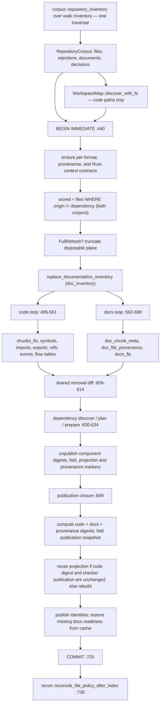

# The indexing pipeline: one run, two planes

One function, `index_repo_impl`, turns a checkout into published rows. JavaScript/TypeScript, Rust, and Markdown/MDX files are discovered by one filesystem traversal and written inside one `BEGIN IMMEDIATE`…`COMMIT`, but they do not share one invalidation digest. Code text goes to `chunks_fts`, documentation text goes to `docs_fts`, and the vector planes are disjoint. `src/publication.rs` computes code, documentation, and provenance components, then folds them into `publication_snapshot` (`meta.snapshot`). The fold is not itself a gate.

## Entry points and the single traversal

Three production functions start an index run — `incremental_refresh_repo_with_options` (`src/indexer.rs:246`), `refresh_repo_with_options` (`:264`), and `watch_full_refresh_repo_with_options` (`:283`) — alongside six `#[cfg(test)]` wrappers (`:192`, `:198`, `:215`, `:224`, `:339`, `:358`). Note that `index_repo` and `index_repo_with_options` are declared `pub` but gated behind `#[cfg(test)]`; they are not API. Seven of the nine reach `index_repo_impl` directly, differing only in three flags: `IndexMode` (`FullRefresh` vs `Incremental`), `CheckerRetention` (`Drop` vs `PreserveActiveForWatch`), and the `IndexOperation` carrying the `FileSystem` and a test-only failure injection point (`:330`).

The first act is one traversal, entered through the generic API. `corpus::repository_inventory` (`src/indexer.rs:385`) is a thin wrapper (`src/docs/corpus.rs:156-161`) that builds a `DocumentationCollector` and passes it as a consumer to `walk::repository_inventory` (`:177-178`), whose signature is `fn repository_inventory<C: RepositoryInventoryConsumer>(root, consumer) -> Result<RepositoryInventory<C::Output>>` (`src/walk.rs:187-192`). The traversal engine is `src/walk/inventory.rs:28-220`: it descends with two independent per-plane descent bits carried on every `WalkTask` (`src/walk/inventory.rs:11-23`, seeded at `:55-59`), selects code files itself (`:199-201`), and only after the stack drains calls the consumer's `finish` (`:214`), where `acquire_candidates` reads and parses every admitted document (`src/docs/corpus.rs:354-419`). Anyone looking for the code-vs-consumer descent policy will find it in `walk`, not in `corpus`; what `corpus` owns is documentation membership, capture, and parsing.

The walk returns `RepositoryInventory<T> { files, cargo_manifests, rejections, consumer }`, generic over the consumer's output so the walk layer's type surface names no documentation type. The documentation wrapper flattens that into the shape the indexer reads, retaining code files, Cargo manifests, walk rejections, documents, and admission decisions. `files` stays code-only by contract so workspace discovery, dependency discovery, and module resolution do not consume documentation paths.

Admission is decided inside that walk. The consumer's descent bit starts as `consumer.is_active()` (`src/walk/inventory.rs:58`), which the collector answers `!self.options.include.is_empty()` (`src/docs/corpus.rs:281-283`), so an empty `docs_include` costs the traversal nothing beyond one virtual call per surviving entry. Gating is extension-first: `is_document_path` accepts lowercase `.md`/`.mdx` *before* include globs are consulted (`src/docs/corpus.rs:581-585`), so an include glob that matches a `.ts` file yields an `unsupported-extension` decision (`:317-322`) rather than a second admission of a file the code plane already owns. `CorpusOptions` also carries `max_file_bytes`, defaulted to 4 MiB (`src/docs/corpus.rs:16, 34-42`), and the indexer supplies only `include`/`exclude` (`src/indexer.rs:387-391`), inheriting that cap.

Inventory and workspace rejections are folded into the `IndexOutcome` before any write (`src/indexer.rs:420-433`).

## Two closures, one commit

`conn.execute_batch("BEGIN IMMEDIATE")` at `src/indexer.rs:440` opens the transaction. Everything to `COMMIT` at `:725` — canonical replacement of both corpora, dependency synchronization, cached code-vector materialization, module resolution, structural projection, marker publication, and documentation vector rematerialization — is one SQLite commit. WAL readers keep seeing the last-good snapshot for the writer's whole duration. Each of the two closures has its own rollback arm (`:645`, `:731`), and a failed `COMMIT` rolls back too (`:726`).

The preparation closure (`:441-641`) runs in this order:

| Step | Lines | What it touches |
|---|---|---|
| Capture `previous` projection/checker identity | preparation start | Prior code/projection/resolution and checker markers |
| `ensure_format_contracts` | preparation start | Returns the changed format ids and selectively blanks affected code hashes |
| Provenance and Rust context checks | preparation start | Provenance format plus per-file Rust edition context |
| Read `stored` from `files WHERE origin!='dependency'` | before replacement | Both corpora |
| Full-refresh reset | before loops | Truncates the disposable plane only in `FullRefresh` mode |
| `replace_documentation_inventory` | before loops | `doc_inventory` wholesale |
| Code loop | first replacement loop | `files`, `chunks`, `chunks_fts`, format-specific rows |
| Documentation loop | second replacement loop | `files`, `chunks`, `doc_chunk_meta`, provenance, `docs_fts` |
| Shared removal diff | after loops | Both corpora |
| Dependency discover / plan / prepare | `:630-634` | Filesystem reads and parsing |
| Unpublish identity markers | before publication closure | `snapshot`, `code_digest`, `documentation_digest`, projection/resolution, provenance digest |

Two orderings there are load-bearing and easy to misread. First, dependency *reading and parsing* happens inside the transaction but in the preparation closure, before the markers are deleted; only `synchronize_instances` and `index_dependency_files` are publication work (`:650-651`). Doing the I/O inside the outer transaction is what lets a transient dependency failure restore the previous canonical rows and the previous markers together (comment at `:626-629`). Second, `PreviousPublication::read` captures the prior code digest, documentation digest, and resolution hash *before* the marker delete — if it ran after, neither projection reuse nor documentation-vector lifecycle comparison could work.

The publication closure then synchronizes dependency instances, inserts dependency files, materializes cached code embeddings when new occurrences were indexed, resolves module edges, publishes projection identity, computes the provenance digest, and calls `publication::Identities::compute`. Checker retention compares and, when safe, rebinds against the code digest. Structural projection reuse also compares the code digest, so a docs-only edit skips the rebuild. The four identity rows are then published together. Documentation generations are rematerialized provider-free when extraction reset, the prior documentation digest differs, or a current docs profile lacks readiness. The digest comparison also purges materialized rows for obsolete text-contract profiles that the current-profile readiness scan cannot see; this remains keyed by the documentation digest rather than by the publication fold.

Projection is skipped only when extraction did not reset, the active code contract did not change, the previous code digest equals the new one, and checker publication did not change. Otherwise it is rebuilt against the new code digest. `Identities::publish` is the single writer of `code_digest`, `documentation_digest`, `documentation_provenance_digest`, and the folded `snapshot`, avoiding divergent marker-writing branches.

## Where the planes diverge

The first diagram traces one run. Look for the single `SCAN` node feeding both loops, the point where `CODE` and `DOCS` fan out to different tables, and the fact that they rejoin at `REMOVE` and never separate again until `REMAT`.



`CODE` and `DOCS` are structurally different loops, not one loop with a branch. The code loop reads through `operation.fs`, hashes with blake3, classifies a role, derives a format, and short-circuits when hash *and* `corpus=='code'` *and* format all match (`:518-529`). Its replacement path is ordered defensively: `extract_file` runs first, outside the database (`:533`); only on `Ok` does `delete_file` then `insert_file` run (`:535-548`). On `Err` the old row is still deleted and an `"extract"` rejection recorded (`:554-559`) — the file leaves the corpus with no insert. Two further paths exist that a summary would miss: a retryable read aborts the whole index (`:503-505`), and an inventory race `continue`s *without* inserting into `seen` (`:502`), silently routing that path into the removal loop.

The documentation loop iterates `inventory.documents`, already read and parsed. Its short-circuit requires that the document's format is absent from `changed_formats`, so a Markdown or MDX contract change re-chunks unchanged bytes without touching the other formats. Its replacement path is unconditional: delete the old row, then `insert_documentation_file`. Crucially, it has **no rejection path at all**. Every `ensure!` inside insertion propagates out of the preparation closure and rolls back the whole index. One malformed captured document aborts the code refresh too: crash recovery exposes one complete publication, never new docs beside old code.

Both loops write into the same `seen` and `published` sets, and one shared rule at `:609-614` deletes anything in `existing` not in `seen` and computes `outcome.removed` from `previous_paths.difference(&published)`. In `FullRefresh` the removal loop is a no-op — `existing` is `HashMap::new()` from `:467-471` — but `previous_paths` was taken from `stored` before that substitution, so `outcome.removed` stays meaningful on both paths.

The write fan-out differs sharply:

| Corpus | Function | Tables written |
|---|---|---|
| code | `insert_file` (`src/indexer.rs:1070`) | `files`, `chunks`, `chunks_fts`, `symbols`, `imports`, `exports`, `contract_imports`, `contract_exports`, `events`, `member_calls`, `refs`, `entity_sites`, flow tables |
| docs | `insert_documentation_file` | `files`, `chunks`, `doc_chunk_meta`, `doc_file_provenance`, `docs_fts` |

`docs_fts` is a separate FTS5 table (`src/store.rs:38-46`) whose rowids are `chunks.id` values. That separation is not cosmetic: FTS5 term statistics are per-table, so admitting a documentation corpus into `chunks_fts` would move code BM25 scores. The boundary itself lives in three places at once — the `CHECK(corpus IN ('code','docs'))` constraint on `files` (`src/store.rs:337`), four triggers making `doc_chunk_meta` and `files.corpus` mutually consistent (`:382-424`), and the `code_files`/`code_chunks` views (`:429-437`). Seventeen source files read through those views rather than repeating a negative predicate: `embed.rs`, `search.rs`, `query.rs`, `recon.rs`, `mcp.rs`, `semantic.rs`, `semantic_query.rs`, `dependency.rs`, `structural.rs`, `surface.rs`, `checker/enrich.rs`, `checker/package_gate.rs`, `scouting/plan.rs`, `scouting/repository.rs`, `store.rs`, `indexer.rs`, and `embed/tests.rs`. It is the views, not the null `name` column, that keep documentation out of the deterministic exact-identifier tiers: `exact_definition_chunks` joins `code_chunks`/`code_files` (`src/search.rs:598-599, 640-641`) before `name` or `symbols` is ever consulted. Writing documentation chunks with `name=NULL` and `symbols=''` (`src/indexer.rs:958-962`) is defense in depth.

## Per-format contract clocks, separate content digests

`ensure_format_contracts` compares one marker per registered format. When a format contract changes, code rows of that format have their hashes blanked and documentation rows of that format bypass the unchanged short-circuit. The legacy `extraction_version` and `documentation_chunk_format_version` markers remain compatibility diagnostics; the per-format keys are the selective invalidation authority.

`publication::compute_code_digest` hashes the code/projection contracts and their persisted markers, active code format contracts, Rust edition context, code-file and package identity, and module resolution. `compute_documentation_digest` hashes the documentation contract and marker, active docs format contracts, and docs files as `(path, hash, format)`. Hashing producer and published markers still makes interrupted or pre-upgrade state fail closed. A documentation content change leaves the code digest stable while rotating the documentation and provenance components and their fold, so it does not invalidate code-bound checker or cursor state.

This diagram traces the publication half. The clocks converge only in the folded publication marker; their invalidation gates remain separate.

```mermaid
sequenceDiagram
  participant IDX as index_repo_impl
  participant META as meta table
  participant ROWS as files and chunks
  participant ST as structural
  participant DV as docs vector plane
  IDX->>META: ensure per-format contract markers; collect changed formats
  IDX->>META: ensure provenance format and Rust edition context
  IDX->>ROWS: replace code rows then doc rows into one seen set
  IDX->>META: unpublish component digests, fold, projection, resolution, provenance
  IDX->>ST: compute resolution hash and publish projection identity
  IDX->>IDX: compute code, documentation, provenance, and folded publication identities
  alt code digest and checker publication unchanged
    IDX->>ST: keep structural projection
  else
    IDX->>ST: rebuild projection against code digest
  end
  IDX->>META: publish all four identity rows together
  opt extraction reset or current docs generation missing
    IDX->>DV: rematerialize_cached_generations from the embeddings cache
    DV-->>IDX: per profile: ready, or silently not ready
  end
  IDX->>IDX: COMMIT
```

## How documentation vectors bind only documentation content

Documentation vectors are stored twice, with two different identities. The durable copy lives in the shared content-addressed `embeddings` table keyed by `embedding_identity`, a hash of the chunk format version, nearest heading, and rendered body. A file rename or ancestor-heading edit can therefore reuse the cached vector. Readiness is documentation-digest-scoped: `doc_vector_generations.snapshot` stores `documentation_digest`, and the row's presence signals a complete occurrence materialization for that profile.

A code-only change leaves the documentation digest and its ready generation unchanged. A documentation change produces a new documentation digest; after the identities are published inside the transaction, `rematerialize_cached_generations` clears every disposable occurrence generation and rebuilds current profiles provider-free from the durable cache. The prior/new digest comparison makes this happen even when a contract rotation means no old profile passes the current-text-contract filter. Each rebuild is all-or-nothing: an incomplete cache or invalid blob leaves the profile without a generation row and therefore NotReady.

The point of this shape is that indexing never becomes a provider operation. An incomplete cache is a normal NotReady state, not a failure. Provider calls live only in `jscout docs embed`, and the ordinary code embed path selects through `code_chunks`/`code_files` (`src/embed.rs:648, 705, 730`), so it can never request a documentation vector. `src/indexer/tests.rs:357` proves the negative by pointing the provider at `127.0.0.1:1` and asserting zero calls.

## Trust but verify at insert

`insert_documentation_file` does not trust the inventory it was handed, even though the same process produced it moments earlier. It re-checks that the identity path matches the captured document, that corpus and format are one of the documentation pair, that the captured byte length equals the parser's `byte_len`, and that a fresh blake3 of the captured bytes equals the parser's `content_hash` (`src/indexer.rs:915-932`). Per chunk it asserts contiguous global ordinals (`:976-980`), an in-bounds span (`:985-990`), a UTF-8 slice (`:991-996`), stub/embedding-identity agreement (`:1010-1015`), and — for non-stub chunks — that the stored `embedding_identity` equals a freshly computed `docs::corpus::embedding_identity(nearest_heading, rendered_body)` (`:1016-1027`).

The reason the re-derivation is worth its cost is that both hashes are computed over the *same in-memory buffer*. `CapturedDocument { bytes, file }` (`src/docs/corpus.rs:58-61`) is held from capture in `finish` through the insert, and chunk text is sliced from that same buffer (`src/indexer.rs:991`). A check-then-reread race, where the hash describes one filesystem state and the stored span another, is structurally impossible rather than merely unlikely. The embedding-identity re-derivation matters for a different reason: it is the cache key, so a mismatch between what the parser recorded and what the cache lookup would compute would silently produce a permanently NotReady generation. The tradeoff is memory — the whole documentation corpus, up to 4 MiB per file, is resident for the run — and the loss of a cheap unchanged path: an unmodified `.md` is still read and fully parsed by `acquire_candidates` (`src/docs/corpus.rs:354-419`); the hash short-circuit at `src/indexer.rs:569-574` skips only the database write.

## What resets, and what survives

`FullRefresh` is the only index mode that calls `store::reset_snapshot_state`; incremental contract invalidation is selective per format. `reset_snapshot_state` delegates to `reset_extraction_state`, which clears both corpora's disposable rows, FTS indexes, and occurrence vector tables while preserving the content-addressed embedding cache and semantic memory, then also clears package instances and the snapshot/projection markers.

`store::delete_file` (`:1290`) early-returns when the id is absent (`:1291-1299`), calls `embed::delete_vector_rows_for_file` (`:1300`), then deletes from `docs_fts` and `chunks_fts` by chunk rowid — unconditionally, because FTS5 is not foreign-key aware — before dropping the `files` row and letting cascades take `chunks` and `doc_chunk_meta`.

After the commit, `recon::reconcile_file_policy_after_index` runs (`src/indexer.rs:735`). It returns `()` and swallows errors (`src/recon.rs:498-515`): on failure it wipes `repository_file_policy` and `repository_current_classifications` and prints to stderr. It cannot fail the index.

## Limits worth naming

**`IndexOutcome` counters are corpus-blind.** `indexed`, `unchanged`, `removed`, and `chunks` mix the two corpora with no attribution; `refs` remains code-only. `rejected`/`rejections` are corpus-blind too, since inventory rejections from the documentation scanner land there. The summary line printed by `jscout index` (`src/commands/core.rs:295-303`) therefore cannot tell a user that Markdown admission changed their numbers.

**Failure visibility differs by corpus.** A code read error becomes an `IndexRejection` in the outcome; a document read error becomes a `doc_inventory` decision row with rule `read-error` (`src/docs/corpus.rs:410-416`), visible only through `jscout docs status`. `outcome.rejected` undercounts documentation problems.

**Documentation-aware watch classification is built.** The watcher carries a `DocumentationPathPolicy`, classifies admitted file and directory events as documentation signals, and refreshes that policy when configuration or ignore boundaries change. A docs-only generation can rotate the documentation/provenance identities while leaving code-bound enrichment reusable.

[`PLAN.md`](../../PLAN.md) is the normative source for numbered-gate and deferred-ledger status; this chapter records only the implemented indexing path.

**One test fixture does not match production.** `src/store.rs:2099-2103` creates `vec_doc_embeddings_2` with a `snapshot TEXT PARTITION KEY` column that `ensure_vector_table` (`src/docs/retrieval.rs:973-983`) does not create.

## What the tests pin

Indexer tests pin routing isolation, policy removal, corpus/format repair, atomic rollback, and the new identity matrix: docs-only changes preserve the code digest and checker projection, code-only changes preserve the documentation digest and ready docs vectors, and failures restore every component digest plus the fold together.
