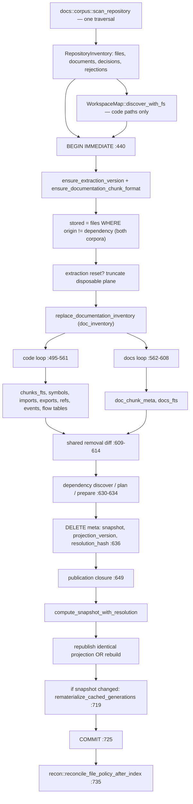
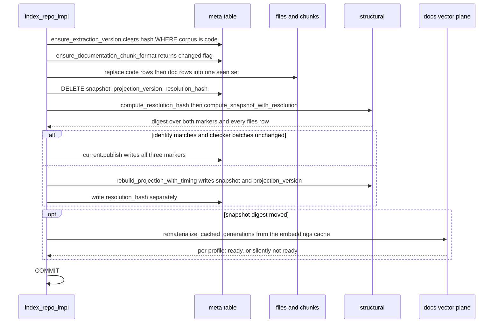

# The indexing pipeline: one run, two planes

One function, `index_repo_impl` (`src/indexer.rs:374`), turns a checkout into published rows. Since the documentation subsystem landed it covers two corpora at once: JS/TS files and Markdown/MDX files are discovered by a single filesystem traversal, written into the same `files` and `chunks` tables inside a single `BEGIN IMMEDIATE`…`COMMIT`, and covered by a single structural snapshot digest. What is *not* shared is ranking: code text goes to `chunks_fts`, documentation text goes to `docs_fts`, and the two vector planes are disjoint tables. What is also not shared is the contract clock: a code-extractor bump re-chunks only code, a Markdown-chunker bump re-chunks only documentation, and both feed one digest. The seam between "shared storage and lifecycle" and "separate ranking and versioning" is the interesting part of this file, and most of the pipeline's added complexity exists to hold that seam in place.

## Entry points and the single traversal

Three production functions start an index run — `incremental_refresh_repo_with_options` (`src/indexer.rs:246`), `refresh_repo_with_options` (`:264`), and `watch_full_refresh_repo_with_options` (`:283`) — alongside six `#[cfg(test)]` wrappers (`:192`, `:198`, `:215`, `:224`, `:339`, `:358`). Note that `index_repo` and `index_repo_with_options` are declared `pub` but gated behind `#[cfg(test)]`; they are not API. Seven of the nine reach `index_repo_impl` directly, differing only in three flags: `IndexMode` (`FullRefresh` vs `Incremental`), `CheckerRetention` (`Drop` vs `PreserveActiveForWatch`), and the `IndexOperation` carrying the `FileSystem` and a test-only failure injection point (`:330`).

The first act is one traversal. `walk::repository_inventory` (`src/indexer.rs:385`) is a 20-line adapter (`src/walk.rs:169-188`); the actual walker is `docs::corpus::scan_repository` → `scan_repository_with_capture` (`src/docs/corpus.rs:164-172`), which runs in two phases: `walk_repository()` descends with independent per-plane descent state (`src/docs/corpus.rs:331-336`), then `acquire_candidates()` reads and parses every admitted document (`:542-607`). Anyone looking for the code-vs-docs descent policy will not find it in `walk.rs` — it is in `corpus.rs`. The result is `RepositoryInventory { files, rejections, documents, documentation_decisions }` (`src/walk.rs:49-54`), where `files` stays code-only by contract (doc comment at `src/walk.rs:45-47`, construction at `:174-187`) so that `WorkspaceMap::discover_with_fs` (`src/indexer.rs:400-401`), dependency discovery, and module resolution receive exactly the input they received before documentation existed.

Admission is decided inside that walk. `documentation_active` starts as `!options.include.is_empty()` (`src/docs/corpus.rs:335`), so an empty `docs_include` costs the traversal nothing. Gating is extension-first: `is_document_path` accepts lowercase `.md`/`.mdx` *before* include globs are consulted (`src/docs/corpus.rs:496-502`), so an include glob that matches a `.ts` file yields an `unsupported-extension` decision rather than a second admission of a file the code plane already owns. `CorpusOptions` also carries `max_file_bytes`, defaulted to 4 MiB (`src/docs/corpus.rs:17, 35-42`), and the indexer supplies only `include`/`exclude` (`src/indexer.rs:387-391`), inheriting that cap.

Inventory and workspace rejections are folded into the `IndexOutcome` before any write (`src/indexer.rs:420-433`).

## Two closures, one commit

`conn.execute_batch("BEGIN IMMEDIATE")` at `src/indexer.rs:440` opens the transaction. Everything to `COMMIT` at `:725` — canonical replacement of both corpora, dependency synchronization, cached code-vector materialization, module resolution, structural projection, marker publication, and documentation vector rematerialization — is one SQLite commit. WAL readers keep seeing the last-good snapshot for the writer's whole duration. Each of the two closures has its own rollback arm (`:645`, `:731`), and a failed `COMMIT` rolls back too (`:726`).

The preparation closure (`:441-641`) runs in this order:

| Step | Lines | What it touches |
|---|---|---|
| `ensure_extraction_version` | `:442` → `:790` | Code hashes only |
| `ensure_documentation_chunk_format` | `:443` → `:822` | Returns `documentation_format_changed` |
| Read `stored` from `files WHERE origin!='dependency'` | `:444-462` | Both corpora |
| Extraction-reset decision | `:476-490` | Truncates the disposable plane |
| `replace_documentation_inventory` | `:492` → `:889` | `doc_inventory` wholesale |
| Code loop | `:495-561` | `files`, `chunks`, `chunks_fts`, structural tables |
| Documentation loop | `:562-608` | `files`, `chunks`, `doc_chunk_meta`, `docs_fts` |
| Shared removal diff | `:609-614` | Both corpora |
| Capture `previous` projection identity | `:616-624` | Read of the three markers |
| Dependency discover / plan / prepare | `:630-634` | Filesystem reads and parsing |
| `DELETE FROM meta` for three marker keys | `:636-639` | `snapshot`, `projection_version`, `resolution_hash` |

Two orderings there are load-bearing and easy to misread. First, dependency *reading and parsing* happens inside the transaction but in the preparation closure, before the markers are deleted; only `synchronize_instances` and `index_dependency_files` are publication work (`:650-651`). Doing the I/O inside the outer transaction is what lets a transient dependency failure restore the previous canonical rows and the previous markers together (comment at `:626-629`). Second, `ProjectionIdentity::read` at `:623` captures `previous` *before* the marker delete at `:636` — if it ran after, the republish check below could never fire.

The publication closure (`:649-722`) then runs dependency instance sync, dependency file insert, `embed::materialize_cached_embeddings` gated on `outcome.indexed > 0` (`:658-660`), `resolve_module_edges` (which reads through `code_files`, `src/indexer.rs:1596`/`:1647`), the `root` meta row, `compute_resolution_hash`, and `compute_snapshot_with_resolution` (`:668-669`). Checker retention is applied at `:673-678`, returning whether batches changed. The projection is then either republished or rebuilt, and finally — only if the snapshot digest moved — documentation vector generations are rematerialized at `:719`.

The republish branch requires `previous == current && !checker_batches_changed` (`:686`). A matching `ProjectionIdentity` alone is not sufficient; dropping or preserving checker batches forces the rebuild path. The two branches also write markers differently: republish calls `current.publish(conn)` and writes all three (`:695`), while the rebuild branch gets `snapshot` and `projection_version` from `rebuild_projection_with_timing` (`src/structural.rs:641, 646`) and writes `resolution_hash` separately at `src/indexer.rs:702-706`.

## Where the planes diverge

The first diagram traces one run. Look for the single `SCAN` node feeding both loops, the point where `CODE` and `DOCS` fan out to different tables, and the fact that they rejoin at `REMOVE` and never separate again until `REMAT`.

`CODE` and `DOCS` are structurally different loops, not one loop with a branch. The code loop reads through `operation.fs`, hashes with blake3, classifies a role, derives a format, and short-circuits when hash *and* `corpus=='code'` *and* format all match (`:518-529`). Its replacement path is ordered defensively: `extract_file` runs first, outside the database (`:533`); only on `Ok` does `delete_file` then `insert_file` run (`:535-548`). On `Err` the old row is still deleted and an `"extract"` rejection recorded (`:554-559`) — the file leaves the corpus with no insert. Two further paths exist that a summary would miss: a retryable read aborts the whole index (`:503-505`), and an inventory race `continue`s *without* inserting into `seen` (`:502`), silently routing that path into the removal loop.

The documentation loop iterates `inventory.documents`, already read and parsed. Its short-circuit takes an extra term — `!documentation_format_changed` (`:569`) — which is the only thing that can force re-chunking of a document whose bytes did not move. Its replacement path is unconditional: delete the old row, then `insert_documentation_file` (`:585-598`). Crucially, it has **no rejection path at all**. Every `ensure!` inside `insert_documentation_file` (`:915-932`, `:976-980`, `:985-990`, `:1010-1015`, `:1021-1026`) propagates out of the preparation closure and rolls back the whole index. One malformed captured document aborts the code refresh too. That is the price of the shared transaction, and the design accepts it deliberately: crash recovery should expose exactly one complete publication, never new docs beside old code.

Both loops write into the same `seen` and `published` sets, and one shared rule at `:609-614` deletes anything in `existing` not in `seen` and computes `outcome.removed` from `previous_paths.difference(&published)`. In `FullRefresh` the removal loop is a no-op — `existing` is `HashMap::new()` from `:467-471` — but `previous_paths` was taken from `stored` before that substitution, so `outcome.removed` stays meaningful on both paths.

The write fan-out differs sharply:

| Corpus | Function | Tables written |
|---|---|---|
| code | `insert_file` (`src/indexer.rs:1070`) | `files`, `chunks`, `chunks_fts`, `symbols`, `imports`, `exports`, `contract_imports`, `contract_exports`, `events`, `member_calls`, `refs`, `entity_sites`, flow tables |
| docs | `insert_documentation_file` (`:909`) | `files`, `chunks`, `doc_chunk_meta`, `docs_fts` |

`docs_fts` is a separate FTS5 table (`src/store.rs:38-46`) whose rowids are `chunks.id` values. That separation is not cosmetic: FTS5 term statistics are per-table, so admitting a documentation corpus into `chunks_fts` would move code BM25 scores. The boundary itself lives in three places at once — the `CHECK(corpus IN ('code','docs'))` constraint on `files` (`src/store.rs:337`), four triggers making `doc_chunk_meta` and `files.corpus` mutually consistent (`:382-424`), and the `code_files`/`code_chunks` views (`:429-437`). Seventeen source files read through those views rather than repeating a negative predicate: `embed.rs`, `search.rs`, `query.rs`, `recon.rs`, `mcp.rs`, `semantic.rs`, `semantic_query.rs`, `dependency.rs`, `structural.rs`, `surface.rs`, `checker/enrich.rs`, `checker/package_gate.rs`, `scouting/plan.rs`, `scouting/repository.rs`, `store.rs`, `indexer.rs`, and `embed/tests.rs`. It is the views, not the null `name` column, that keep documentation out of the deterministic exact-identifier tiers: `exact_definition_chunks` joins `code_chunks`/`code_files` (`src/search.rs:598-599, 640-641`) before `name` or `symbols` is ever consulted. Writing documentation chunks with `name=NULL` and `symbols=''` (`src/indexer.rs:958-962`) is defense in depth.

## Two contract clocks, one digest

`ensure_extraction_version` invalidates with `UPDATE files SET hash='' WHERE corpus='code'` (`src/indexer.rs:804`) — an oxc extractor bump never re-chunks Markdown. `ensure_documentation_chunk_format` persists `documentation_chunk_format_version` and returns a bool (`:822-839`) that only gates the documentation short-circuit — a Markdown contract bump never touches code rows.

Both, however, feed one digest. `compute_snapshot_with_resolution` (`src/structural.rs:429`) hashes the projection version, the binary constant `EXTRACTION_VERSION`, the *persisted* `extraction_version` meta row, the binary constant `docs::CHUNK_FORMAT_VERSION`, and the *persisted* `documentation_chunk_format_version` (`:434-464`), then every `files` row including `corpus` and `format` (`:465-474`). Hashing both the binary constant and the persisted marker is what makes an interrupted or pre-upgrade state fail closed rather than presenting a stale digest as current. And because `files.corpus`/`files.format` are digest inputs, a documentation-only change rotates the shared snapshot — which is exactly what invalidates checker batches and the documentation vector readiness generation.

This diagram traces the publication half, where the two clocks converge and the docs vector plane is re-derived. Watch the `alt` block: the republish branch and the rebuild branch write the three markers by different routes.

## How documentation vectors avoid coupling to the snapshot

Documentation vectors are stored twice, with two different identities. The durable copy lives in the shared content-addressed `embeddings` table keyed by `embedding_identity`, a hash of the chunk format version, the nearest heading, and the rendered body (`src/indexer.rs:1017-1026` re-derives it). A file rename, or an edit to an ancestor heading that does not change the chunk's own heading or body, reuses the cached vector. Only *readiness* is snapshot-scoped: `doc_vector_generations(snapshot, profile_id, dimensions, chunk_format_version)` (`src/store.rs:776-782`), where the presence of the row is the signal (`generation_is_ready`, `src/docs/retrieval.rs:985-995`).

So when a code change rotates the snapshot, the vectors themselves are still valid but the readiness marker is not. `rematerialize_cached_generations` (`src/docs/retrieval.rs:815`) rebuilds it inside the same transaction, under its own savepoint. It asserts the passed snapshot equals `store::current_snapshot(conn)` (`:818-821`) — which is the just-published value only because of call ordering — clears every `vec_doc_embeddings_*` table plus both generation tables (`:867-886`), and rebuilds per profile. Profiles are filtered: only those whose `config_json.document_text` equals the current `CHUNK_FORMAT_VERSION` are considered (`:856-858`); others are skipped rather than marked not-ready. Each rebuild is all-or-nothing — if the occurrence count is zero, the cached row count differs, or any blob length differs from `dimensions * 4`, it returns `None` and leaves the profile without a generation row (`:938-945`).

The point of this shape is that indexing never becomes a provider operation. An incomplete cache is a normal NotReady state, not a failure. Provider calls live only in `jscout docs embed`, and the ordinary code embed path selects through `code_chunks`/`code_files` (`src/embed.rs:648, 705, 730`), so it can never request a documentation vector. `src/indexer/tests.rs:357` proves the negative by pointing the provider at `127.0.0.1:1` and asserting zero calls.

## Trust but verify at insert

`insert_documentation_file` does not trust the inventory it was handed, even though the same process produced it moments earlier. It re-checks that the identity path matches the captured document, that corpus and format are one of the documentation pair, that the captured byte length equals the parser's `byte_len`, and that a fresh blake3 of the captured bytes equals the parser's `content_hash` (`src/indexer.rs:915-932`). Per chunk it asserts contiguous global ordinals (`:976-980`), an in-bounds span (`:985-990`), a UTF-8 slice (`:991-996`), stub/embedding-identity agreement (`:1010-1015`), and — for non-stub chunks — that the stored `embedding_identity` equals a freshly computed `docs::corpus::embedding_identity(nearest_heading, rendered_body)` (`:1016-1027`).

The reason the re-derivation is worth its cost is that both hashes are computed over the *same in-memory buffer*. `CapturedDocument { bytes, file }` (`src/docs/corpus.rs:59-62`) is held from the walk through the insert, and chunk text is sliced from that same buffer (`src/indexer.rs:991`). A check-then-reread race, where the hash describes one filesystem state and the stored span another, is structurally impossible rather than merely unlikely. The embedding-identity re-derivation matters for a different reason: it is the cache key, so a mismatch between what the parser recorded and what the cache lookup would compute would silently produce a permanently NotReady generation. The tradeoff is memory — the whole documentation corpus, up to 4 MiB per file, is resident for the run — and the loss of a cheap unchanged path: an unmodified `.md` is still read and fully parsed during the walk (`src/docs/corpus.rs:558-575`); the hash short-circuit at `:569-574` skips only the database write.

## What resets, and what survives

Two reset paths exist. `FullRefresh` calls `store::reset_snapshot_state` (`src/store.rs:1261`); an incremental run whose code hashes were mass-cleared calls `store::reset_extraction_state` (`:1211`). The latter now covers the documentation plane: it clears `doc_vector_generations`, `doc_embedding_index_entries`, `doc_chunk_meta`, `doc_inventory`, and drops and recreates *both* `docs_fts` and `chunks_fts` from the shared `*_FTS_CREATE` constants (`:1219-1250`). It also calls `embed::clear_vector_rows` (`:1212`) — which truncates the `vec_*` and `vec_doc_embeddings_*` tables — and clears the recon plane (`:1217-1218`). The content-addressed `embeddings` cache and semantic memory survive; `src/store.rs:2045` pins that.

`store::delete_file` (`:1290`) early-returns when the id is absent (`:1291-1299`), calls `embed::delete_vector_rows_for_file` (`:1300`), then deletes from `docs_fts` and `chunks_fts` by chunk rowid — unconditionally, because FTS5 is not foreign-key aware — before dropping the `files` row and letting cascades take `chunks` and `doc_chunk_meta`.

After the commit, `recon::reconcile_file_policy_after_index` runs (`src/indexer.rs:735`). It returns `()` and swallows errors (`src/recon.rs:498-515`): on failure it wipes `repository_file_policy` and `repository_current_classifications` and prints to stderr. It cannot fail the index.

## Limits worth naming

**The extraction-reset heuristic is corpus-coupled by its denominator.** `cleared` counts only rows with `corpus == CODE_CORPUS && hash.is_empty()` (`src/indexer.rs:476-479`), but the threshold is `cleared * 2 >= existing.len()` (`:481`) and `existing` holds both corpora. In a repository where documentation is more than about a third of the non-dependency files, an extractor bump that clears every code hash can fail the 50% test and fall back to per-file replacement — the pathological path the reset exists to avoid. This is the one place documentation admission changes code-path behavior, and no test covers it.

**`IndexOutcome` counters are corpus-blind.** `indexed`, `unchanged`, `removed`, and `chunks` mix the two corpora with no attribution; `refs` remains code-only. `rejected`/`rejections` are corpus-blind too, since inventory rejections from the documentation scanner land there. The summary line printed by `jscout index` (`src/commands/core.rs:295-303`) therefore cannot tell a user that Markdown admission changed their numbers.

**Failure visibility differs by corpus.** A code read error becomes an `IndexRejection` in the outcome; a document read error becomes a `doc_inventory` decision row with rule `read-error` (`src/docs/corpus.rs:598-603`), visible only through `jscout docs status`. `outcome.rejected` undercounts documentation problems.

**A `.md` edit alone does not trigger a watch generation.** `EventClassifier::classify` routes source events through `walk::is_indexable` (`src/watch.rs:521`), which accepts only the eight JS/TS extensions (`src/walk.rs:9, 14-21`), so an existing Markdown file that changes emits no signal at all. Documentation is reindexed only when a code change or a boundary event triggers a refresh. This is G24 phase 4, and it is unbuilt; `16-incremental-and-watch.md` traces the classifier ladder.

**The snapshot log does not exist.** `snapshot_log` occurs in the tree only in `PLAN.md:3266` and two design notes under `docs/plans/`, never in `src/`; the durable ledger it describes is deferred out of the numbered G24 phases. `08-storage-schema.md` covers what publication writes instead. Relatedly, `PLAN.md:3184` still heads the section "Proposed G24" although phases 1 and 2 are merged.

**One test fixture does not match production.** `src/store.rs:2099-2103` creates `vec_doc_embeddings_2` with a `snapshot TEXT PARTITION KEY` column that `ensure_vector_table` (`src/docs/retrieval.rs:973-983`) does not create.

## What the tests pin

There are 36 `#[test]` functions in `src/indexer/tests.rs`, with the documentation-integration block at lines 32-810. The negative-space tests carry the weight. `shared_index_routes_markdown_without_polluting_code_search_or_graphs` (`:33`) asserts zero documentation rows in `chunks_fts` and empty `symbols`/`imports`/`exports`/`refs`/`events`/`module_edges`/`graph_nodes`/`resolved_edges` for the Markdown file. `empty_documentation_policy_removes_the_prior_docs_corpus` (`:409`) asserts `(indexed, unchanged, removed) == (0, 1, 2)` with `main.ts` untouched. `incremental_index_repairs_explicit_corpus_and_format_mismatches` (`:457`) and its MDX sibling (`:496`) corrupt the columns directly in SQL and prove the next run repairs them even at an identical hash. `documentation_contract_change_rechunks_docs_and_rotates_the_shared_snapshot` (`:752`) is the decoupling proof: `indexed=1, unchanged=1`, the code chunk keeps its rowid, the documentation sidecar is rebuilt, and the shared snapshot rotates. `failure_after_canonical_replacement_restores_the_last_good_publication` (`:692`) uses the injection seam at `src/indexer.rs:330` to prove both planes roll back together — old snapshot, old code chunk content, and old `docs_fts` body all survive as a unit.
