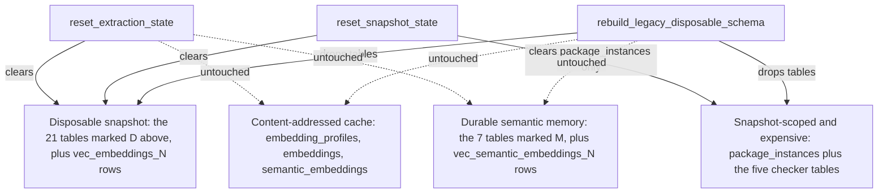
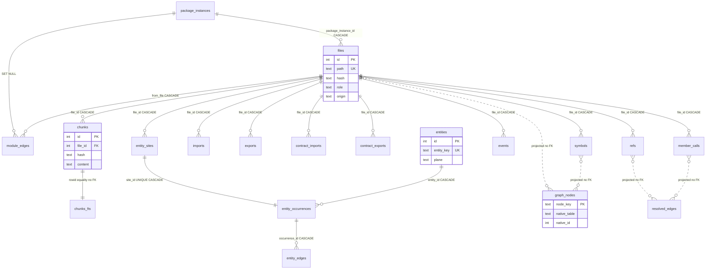
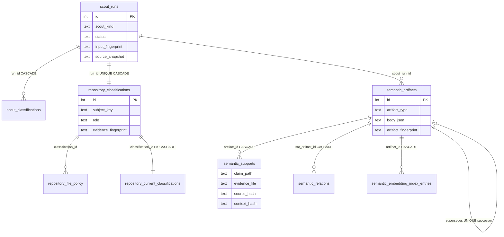
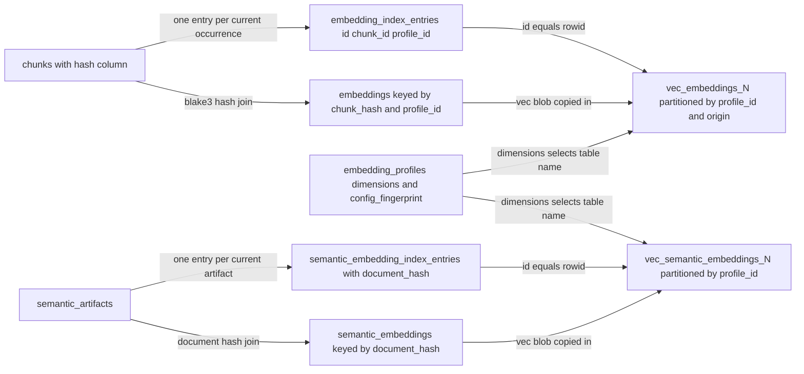

# Storage: SQLite schema, indexes, and vectors

Everything jscout knows about a repository lives in one SQLite file, `.jscout.db`, at the repository root. That file mixes two kinds of state with very different costs: rows derived deterministically from source text, which can be recomputed at fresh-index speed, and rows that cost money or minutes to produce — embedding vectors bought from a provider, LLM-generated semantic artifacts, and TypeScript-checker facts that required a full type-checked program build. The schema, the connection policy, the migration boundary, and the reset primitives all exist to make the first category cheap to throw away without touching the second. `src/store.rs` holds the entire DDL and every reset/open primitive; `src/embed.rs` owns the sqlite-vec half; `src/indexer.rs` and `src/structural.rs` are the write drivers described in [02-ingestion.md](02-ingestion.md) and [03-structural-extraction.md](03-structural-extraction.md).

## Version constants and the file on disk

There is no `PRAGMA user_version` in play — `user_version` and `application_id` stay 0. Versioning is entirely rows in a `meta(key, value)` table, and four constants gate four kinds of invalidation.

| Constant | Value | Defined | Stored in | What a bump invalidates |
|---|---|---|---|---|
| `SCHEMA_VERSION` | `"23"` | `src/store.rs:8` | `meta.schema_version` | Table shapes. Readers demand exact equality; writers accept 16–23. |
| `DURABLE_SCHEMA_FLOOR` | `16` | `src/store.rs:9` | — | Below this, `open_path` refuses to touch the file at all. |
| `PROJECTION_VERSION` | `"11"` | `src/structural.rs:12` | `meta.projection_version` | The graph projection. Also folded into the snapshot hash, so a bump invalidates every snapshot. |
| `entity::EXTRACTION_VERSION` | `"5"` | `src/entity.rs:14` | `meta.extraction_version` | Per-file extraction output. Sets `files.hash=''` on every row. Not folded into the snapshot hash. |

`meta` carries exactly eight key shapes: `schema_version`, `root`, `snapshot`, `projection_version`, `resolution_hash`, `extraction_version`, and the two per-profile sync markers `embedding_index_synced_v1:{id}` and `semantic_embedding_index_synced_v1:{id}`. Two are load-bearing beyond bookkeeping: a database counts as *published* if and only if `meta` contains both `snapshot` and `projection_version`, enforced on read-only opens by a single `EXISTS(...) AND EXISTS(...)` query (`src/store.rs:84-98`).

## Connection policy

The file lives at `root.join(".jscout.db")` (`src/store.rs:7,38-40`), with `-wal` and `-shm` siblings. Two open functions have deliberately different authority: `open_path` (`src/store.rs:105-149`) creates the file if absent, runs the migration check, then sets pragmas and calls `init_schema`; `open_path_read_only` (`src/store.rs:53-100`) refuses to create, refuses to migrate, and bails on an unpublished database.

| Setting | Writer (`open_path`) | Reader (`open_path_read_only`) | Watch connection |
|---|---|---|---|
| Open flags | default read-write-create | `SQLITE_OPEN_READ_ONLY` | read-write |
| `journal_mode` | `WAL` | inherited | inherited |
| `synchronous` | `NORMAL` | — | — |
| `foreign_keys` | `ON` | `ON` | inherited |
| `query_only` | — | `ON` | — |
| `busy_timeout` | unset (0) | unset (0) | 5s (`src/watch.rs:16,965`) |
| Schema check | 16 ≤ v ≤ 23, else bail | `v == "23"`, else bail | via writer |
| Publication check | none | both `snapshot` and `projection_version` must exist | none |

No `cache_size`, `mmap_size`, or `temp_store` tuning is set anywhere. The unset `busy_timeout` on ordinary connections is a real limit: a second writer — say a manual `jscout index` while `jscout watch` is running — gets `SQLITE_BUSY` immediately with no retry. Readers are fine under WAL.

sqlite-vec is loaded once per process, not per connection. `register_sqlite_vec` (`src/store.rs:13-25`) transmutes `sqlite_vec::sqlite3_vec_init` into the C extension-entry signature and hands it to `rusqlite::ffi::sqlite3_auto_extension` inside a `std::sync::Once`. Auto-extension registration is process-global, which is the point: the read-only, `query_only=ON` connections used by the query and MCP surfaces could not load an extension themselves, and this way they get `vec0` for free. The cost is an `unsafe` transmute plus total invisibility at the call site — any unrelated `Connection::open` in the same process silently acquires `vec0` too.

## Complete table inventory

Thirty-seven tables come from `init_schema`, plus `chunks_fts` from a shared constant and two families of dimension-named virtual tables created lazily. The Tier column is explained in the next section: **D** = disposable snapshot, **S** = snapshot-scoped but expensive, **C** = content-addressed cache, **M** = durable semantic memory.

| Table | Tier | Stores | Key columns |
|---|---|---|---|
| `meta` | mixed | Version stamps, publication and sync markers | `key` PK, `value` |
| `package_instances` | S | Workspace/dependency package identity | `canonical_root` UK, `origin`, `manifest_hash`, `status` |
| `files` | D | One row per indexed file | `path` UK, `hash`, `role`, `origin`, `package_instance_id` |
| `chunks` | D | Code chunks with full text | `file_id`, `hash`, `start`, `content` |
| `chunks_fts` | D | FTS5 mirror of chunk text | `rowid == chunks.id`; `content, name, symbols, path` |
| `symbols` | D | Declared names and declaration spans | `file_id`, `name`, `kind`, `decl_start`, `exported` |
| `exports` / `imports` | D | Runtime module bindings | `file_id`, `export_name` / `imported_name`, `request` |
| `contract_exports` / `contract_imports` | D | Type-only bindings, kept separate | same shape as above |
| `module_edges` | D | Resolved import edges | `from_file`, `to_file`, `package`, `resolution`, `type_only` |
| `refs` | D | Unresolved reference evidence | `file_id`, `kind`, `confidence`, `target_name` |
| `events` | D | Emit/listen sites | `file_id`, `role`, `name`, `method` |
| `member_calls` | D | Member-call sites, four span pairs | `file_id`, `prop`, `receiver`, call/receiver/property spans |
| `entity_sites` | D | Ungrouped per-file entity evidence | `plane`, `entity_type`, `identity_name`, `confidence` |
| `entities` | D | Canonical grouped entities | `entity_key` UK, `plane`, `entity_type` |
| `entity_occurrences` | D | Grouped site instances | `entity_id`, `site_id` UK, `file_id` |
| `entity_edges` | D | Entity-to-entity assertions | `occurrence_id`, `target_key`, `kind` |
| `graph_nodes` | D | Projection nodes | `node_key` PK, `native_table`, `native_id` |
| `resolved_edges` | D | Projection edges | `src_key`, `dst_key`, `kind`, `confidence`, `provenance` |
| `embedding_profiles` | C | Provider/model/config identity | `config_fingerprint` UK, `dimensions` |
| `embeddings` | C | Chunk vectors, content-addressed | PK `(chunk_hash, profile_id)`, `vec` |
| `semantic_embeddings` | C | Artifact vectors, content-addressed | PK `(document_hash, profile_id)`, `vec` |
| `embedding_index_entries` | D | Current chunk occurrences for KNN | `id` = vec0 rowid, UK `(chunk_id, profile_id)` |
| `vec_embeddings_{N}` | D rows | vec0 KNN index over chunks | `rowid`, `embedding FLOAT[N]`, partitions `profile_id`, `origin` |
| `checker_enrichment_batches` | S | One TypeScript-checker run | `source_snapshot`, `active` (partial UK) |
| `checker_project_runs` | S | Per-tsconfig-project status | PK `(batch_id, project_id)`, `peak_rss_bytes` |
| `checker_project_inputs` | S | Per-project input files and hashes | PK `(batch_id, project_id, input_kind, input_path)` |
| `checker_enrichments` | S | Resolved member-call targets | `source_file`, `source_hash`, 6 spans, `target_anchor` |
| `checker_occurrence_projects` | S | Per-project answer, incl. `unknown` | PK `(batch_id, member_call_id, project_id)` |
| `scout_runs` | M | One LLM run: provider, cost, status | `(scout_kind, input_fingerprint)` partial UK |
| `scout_classifications` | M | Per-anchor decision incl. exclusions | PK `(run_id, anchor_key)`, `decision` |
| `repository_classifications` | M | Immutable scope role verdicts | `run_id` UK, `subject_key`, `evidence_fingerprint` |
| `repository_file_policy` | D | Per-file effective role projection | `file_id` PK, `classification_id`, `source_hash` |
| `repository_current_classifications` | D | Current-verdict projection | `subject_key` UK, `role`, `confidence` |
| `semantic_artifacts` | M | Generated cards, workflows, summaries | `supersedes_artifact_id` (partial UK), `artifact_fingerprint` |
| `semantic_relations` | M | Artifact-to-artifact links | PK `(src, dst, relation, claim_path)`, `dst_fingerprint` |
| `semantic_supports` | M | Claim to file, line span, hash | `artifact_id`, `evidence_file`, `source_hash` |
| `semantic_embedding_index_entries` | M | Current artifact occurrences for KNN | `id` = vec0 rowid, UK `(artifact_id, profile_id)`, `document_hash` |
| `vec_semantic_embeddings_{N}` | M rows | vec0 KNN index over artifacts | `rowid`, `embedding FLOAT[N]`, partition `profile_id` |

## The disposable/durable split, concretely

There are three reset widths, and which tables each one clears is the whole story. The narrowest, `reset_extraction_state` (`src/store.rs:916-945`), is what a normal reindex uses; `reset_snapshot_state` (`src/store.rs:954-962`) adds package identity and the publication meta keys; `rebuild_legacy_disposable_schema` (`src/store.rs:156-232`) is the migration hammer and drops 29 tables outright, checker plane included.

Read this diagram for what each reset arrow reaches, and note that the checker plane survives the two in-process resets but not a schema migration.



`RE` and `RS` both leave `C` and `M` alone by construction — that is the whole justification for the two-level embedding storage below. `MIG` reaches `S` as well as `D`: the checker plane is in the drop batch (`src/store.rs:187-194`), so expensive TypeScript facts survive a same-schema rebuild but not a schema-version migration. What lets `S` survive a full refresh is `retain_checker_batches_for_snapshot` (`src/store.rs:967-973`), called at `src/indexer.rs:350`, which deletes every batch whose `source_snapshot` differs from the freshly recomputed hash — a rebuild that reproduces the exact structural identity keeps its checker facts, one that does not throws them away before projection can publish.

Two asymmetries inside `reset_extraction_state`. `symbols` is absent from its explicit `DELETE` batch and is emptied only by the cascade from `DELETE FROM files` (`src/store.rs:938`), which undercuts the "children before parents so foreign-key enforcement only checks already-emptied tables" comment at `src/store.rs:918-920` — that one delete does scan a fully populated child. And `clear_vector_rows` (`src/embed.rs:1552`) empties only `vec_embeddings_{N}`; the semantic vec0 tables are deliberately left intact, which is why artifact vectors keep answering KNN across a source reindex.

## Structural core

The disposable plane is one FK tree rooted at `files`, plus two projection tables with no foreign keys at all. Look for where the cascade arrows stop.



Three relationships there are not enforced by SQLite, and that is the point. `chunks_fts` is a plain FTS5 virtual table, not FK-aware, so the `rowid == chunks.id` identity is maintained only by two `prepare_cached` statements running in lockstep in `insert_file` (`src/indexer.rs:517-527`); every read joins on it (`src/search.rs:264-265`), and nothing would catch a drift. `graph_nodes` deliberately has no FK to `files` — its `(native_table, native_id)` pair is a soft pointer back to whichever canonical table produced the node, so the projection can be truncated and rebuilt without touching anything upstream. And `entities` tops a three-level cascade: `rebuild_projection` issues only `DELETE FROM entities` (`src/structural.rs:449`) and relies on the FKs to clear occurrences and then edges.

`insert_file` writes in a fixed order — `files`, `chunks` plus `chunks_fts`, `symbols`, `imports`, `exports`, `contract_imports`, `contract_exports`, `events`, `member_calls`, `entity_sites`, and finally `refs` (`src/indexer.rs:493-720`). The `contract_*` tables duplicate the column shape of `imports`/`exports` rather than adding a flag, per `src/store.rs:316-318`: structural call resolution must never infer execution from a type-only relationship, and separate tables make that impossible to get wrong in a join.

## Semantic memory and scouting

This half is append-only by design and has no pruning path anywhere in the codebase. Look for the two disposable projections hanging off the immutable classification history.



Two partial unique indexes carry the concurrency semantics. `idx_scout_runs_active` on `(scout_kind, input_fingerprint) WHERE status IN ('running','completed')` (`src/store.rs:647-649`) is a live claim: a second scout over identical inputs either reuses the completed run or collides with the in-flight one, and `--rebuild` must mark the old run `superseded` to release the slot. `idx_semantic_artifacts_one_successor` on `supersedes_artifact_id WHERE NOT NULL` (`src/store.rs:777-779`) forces the supersession chain to be linear rather than a DAG, which is what makes "is this the current version" answerable with a single `NOT EXISTS` subquery — inlined into semantic KNN at `src/embed.rs:1424-1428`.

`semantic_supports` anchors a claim to `(evidence_file, start_line, end_line, source_hash, context_hash)` rather than to a `chunk_id`, because chunk IDs are snapshot-local and vanish on every reindex while path plus content hash survive; the same hash doubles as the staleness detector. The cost is that support validation re-reads files from disk, so it is I/O-bound and assumes the working tree still matches the indexed snapshot.

`repository_file_policy` and `repository_current_classifications` are the disposable rows here: `recon::reconcile_file_policy` truncates and rebuilds both inside `BEGIN IMMEDIATE` (`src/recon.rs:396-399`). It is not a pure projection over `repository_classifications` — it joins `scout_runs` on `status='completed'` (`src/recon.rs:293-297`) and re-verifies each scope against the working tree, which is why it takes a `root`. It is also best-effort: `reconcile_file_policy_after_index` (`src/recon.rs:504-521`) swallows any error, clears both tables, and warns rather than failing the index, so the structural plane publishes regardless.

## The vector plane

sqlite-vec's `vec0` tables fix vector width at DDL time (`FLOAT[N]`) and carry no foreign keys, and both facts shape the design. Table names encode the dimension — `vec_embeddings_768`, `vec_semantic_embeddings_1024` — because two models with different widths cannot share a table (`src/embed.rs:924-941,943-959`). That forces string interpolation of table names into SQL, guarded by a `1..=8192` bound before construction and, when names are read back out of `sqlite_master` during migration, a numeric-only GLOB plus a Rust `is_ascii_digit` recheck (`src/store.rs:158-181`). With no foreign keys available, a regular table is made authoritative and the virtual rows are slaved to its `id`. In this diagram, note which arrows are joins on a content hash and which are rowid equalities.



`EMB` is content-addressed, so many chunks with identical text share one vector and a full disposable reindex costs zero re-embedding — chunk IDs change, chunk hashes do not. `ENT` materializes the current occurrences: `materialize_profile` inserts the entry row, takes `last_insert_rowid()`, and writes `VEC` at exactly that rowid (`src/embed.rs:1164-1199`). The price of the split is duplicated vector bytes plus a repair protocol. `sync_vector_index` (`src/embed.rs:1082-1162`) opens `SAVEPOINT jscout_vector_sync`, deletes `VEC` rows whose rowid has no matching entry, materializes new entries, then re-inserts `VEC` rows the entries table claims but `vec0` lacks — the comment calls this repairing "a virtual row lost by an older, non-transactional build." A per-profile `meta` marker records that the full audit ran once; afterwards a cheap regular-table anti-join detects new work instead (`src/embed.rs:1245-1268`). The semantic side is a separate function, `sync_semantic_vector_index` (`src/embed.rs:973-1080`), with its own savepoint and marker key; `sync_vector_index` never touches semantic tables.

Query form is exact KNN: `WHERE embedding MATCH ?1 AND k=?2 AND profile_id=?3 AND origin=?4 ORDER BY distance`, with the score handed back as `1.0 - distance` (`src/embed.rs:1492-1529`); [07-retrieval.md](07-retrieval.md) covers how those scores fuse with bm25. Partitioning by `origin` lets `vec0` prune before scanning, but a partition key cannot be matched with an `IN` list, so a multi-origin search issues one query per origin with `k = limit` each, concatenates, sorts, and truncates client-side. Recall is therefore per-origin top-k, not global top-k: searching three origins scans three times and can still miss a globally better hit if one origin dominates the neighborhood.

Embedding writes commit one `BEGIN IMMEDIATE` per HTTP batch (`src/embed.rs:720-740`) rather than one per run, so a cancelled or crashed embed keeps everything already paid for; the cost is that the database passes through many intermediate states, which is precisely why `sync_vector_index` runs afterwards and must tolerate a partially materialized index.

## Full-text search

`chunks_fts` is created from a single shared constant so its definition cannot drift between `init_schema` and the reset path (`src/store.rs:27-36`):

```
CREATE VIRTUAL TABLE IF NOT EXISTS chunks_fts USING fts5(
  content, name, symbols, path,
  tokenize="unicode61 tokenchars '_$'"
);
```

`tokenchars '_$'` keeps `snake_case` and `$`-prefixed identifiers as single tokens. It is a plain FTS5 table — not `content=` external-content, not contentless — so it stores a second full copy of every chunk's text; that duplication, not the inverted index, dominates database size. Resets `DROP TABLE chunks_fts` and recreate it rather than deleting rows, because deleting FTS5 rows one at a time rewrites the inverted index while dropping discards the shadow tables outright. Single-file deletion is manual for the same reason: `delete_file` (`src/store.rs:977-985`) removes vec0 rows, then FTS rows via `rowid IN (SELECT id FROM chunks WHERE file_id=?)`, then the `files` row — order matters, because the FTS subquery needs `chunks` to still exist. Ranking is `bm25(chunks_fts, 2.0, 4.0, 3.0, 1.0)` — name 4×, symbols 3×, content 2×, path 1×, lower is better (`src/search.rs:263`).

## Migration is one boundary, not a ladder

`open_path` compares `meta.schema_version` against the string `"23"`. Three outcomes (`src/store.rs:115-143`): equal means do nothing; a parsed value in 16–22 runs `rebuild_legacy_disposable_schema`; anything else bails with a message telling the user to preserve the old file if its embedding cache or semantic memory matters. The rebuild enumerates dimension-suffixed vec0 tables from `sqlite_master`, `DELETE`s their rows rather than dropping the tables, drops 29 disposable tables inside `BEGIN IMMEDIATE`, deletes the `root`/`snapshot`/`projection_version`/`resolution_hash`/`extraction_version` meta keys plus both sync-marker prefixes, and stamps `23`.

Both sides of the tradeoff are visible: any upgrade from 16–22 forces a full reindex and anything below 16 is a hard refusal, but in exchange there is no migration ladder to maintain, because the disposable plane recomputes at fresh-index cost and the cache and memory shapes have been stable since v16. One ad-hoc `ALTER` survives outside that path — `repository_classifications.cited_evidence_json` is backfilled if absent (`src/store.rs:822-838`), so databases from a mid-review v20 commit keep their reconnaissance history.

One textual footgun: `'23'` is hardcoded as a literal in the migration's `UPDATE meta SET value='23'` (`src/store.rs:220`) and again in the `init_schema` insert (`src/store.rs:238`), so bumping `SCHEMA_VERSION` means editing three places, or migrated databases stay stamped 23 and re-enter the migration on every open.

## Transactions and the publication boundary

The indexer wraps the reset, every file extraction, and orphan deletion in one deferred `BEGIN`, and the same transaction ends by deleting `snapshot`, `projection_version`, and `resolution_hash` from `meta` before `COMMIT` (`src/indexer.rs:237,324-327`). Canonical rows and *unpublication* therefore land atomically, so the dependency and resolution phase that follows can fail without leaving a stale graph queryable. Symmetrically, `rebuild_projection` runs `BEGIN IMMEDIATE`, truncates `resolved_edges`/`graph_nodes`/`entities`, runs its projection stages, and writes `snapshot` and `projection_version` as the last two statements before `COMMIT` (`src/structural.rs:445-556`) — publication is literally the final act. The symmetry has one hole: `resolution_hash` is written by the caller in a separate autocommit statement *after* the projection commits (`src/indexer.rs:384-388`), so a crash in that window leaves a database that passes the read-only publication check with a missing or stale `resolution_hash`.

Nested operations use named savepoints rather than `BEGIN`, because they run both standalone and inside a caller's transaction and savepoints nest while `BEGIN` does not: `jscout_vector_sync`, `jscout_vector_materialize`, and `jscout_semantic_vector_sync` in `src/embed.rs`, plus `with_read_snapshot` (`src/store.rs:842-859`), which pins a multi-statement read to one SQLite snapshot so search expansion can call neighborhood traversal without a torn view. Error handling everywhere is a manual `ROLLBACK TO` plus `RELEASE` in a repeated closure-and-match idiom.

Production only ever takes the full-refresh path. `refresh_repo_with_options` (`src/indexer.rs:150-156`) is the sole production entry point — called from `cmd_index` and from the watcher — and it always passes `IndexMode::FullRefresh`; `index_repo` and `index_repo_with_options` are `#[cfg(test)]` (`src/indexer.rs:132,140`). Several mechanisms in the file are therefore dead in production. With `FullRefresh` the `existing` map starts empty (`src/indexer.rs:204-206`), so the "at least half the files have a cleared hash, truncate instead of cascading per-file deletes" heuristic (`src/indexer.rs:229-234`) is never consulted, nothing is skipped as unchanged, and the orphan sweep is a no-op. The republish shortcut is likewise unreachable: `previous` is forced to the all-`None` identity whenever `extraction_reset` is true (`src/indexer.rs:310-318`), which is always, so `previous == current` can never hold. Those paths exist so tests can compare full-refresh output against the historical incremental algorithm; [11-incremental-and-watch.md](11-incremental-and-watch.md) traces what the watcher actually does instead.

## Indexes that exist for a specific reason

| Index | On | Why |
|---|---|---|
| `idx_chunks_hash` | `chunks(hash)` | Makes the content-addressed join `embeddings e ON e.chunk_hash=c.hash` cheap during materialization |
| `idx_events_file`, `idx_member_calls_file` | `(file_id)` | Keeps a per-file cascade delete off a full scan of a high-volume table; asserted by a `pragma_index_info` test |
| `idx_resolved_edges_src`, `_dst` | `(key, confidence, kind)` | Leads with the key and carries both filter columns, so filtered traversal either direction is index-only |
| `idx_checker_one_active_batch` | `(active) WHERE active=1` | At most one active checker batch database-wide |
| `idx_repository_classifications_evidence` | `(subject_key, evidence_fingerprint, id DESC)` | Reuses a prior verdict when the snapshot-free evidence identity matches |

## Limits and gaps

There is no `VACUUM` anywhere in `src/`, and no retention policy for any append-only table. `semantic_artifacts`, `scout_runs`, `scout_classifications`, and `repository_classifications` grow monotonically; repeated full reindexes leave free pages that SQLite reuses but never returns to the filesystem, so the file approaches a high-water mark and stays there.

`checker_enrichments.member_call_id` and `source_file_id` are integers with no foreign keys, by explicit design comment (`src/store.rs:534-538`): a projection rebuild renumbers those IDs and must not cascade-destroy facts that cost a full TypeScript program build. Re-anchoring goes through `source_file` + `source_hash` + all six span columns instead, and the projection join enforces the snapshot at read time as well as at retention time — `project_checker_enrichments` requires `batch.active=1 AND batch.source_snapshot=?1 AND run.status='completed'` (`src/structural.rs:2127-2143`), so stale checker facts cannot leak even if the retention delete were skipped. Referential integrity in this plane is convention, not enforcement.

Dynamic table names are interpolated into SQL in roughly a dozen places in `src/embed.rs`. The guards are real but live inside `vector_table()` and `semantic_vector_table()`, so any new call site that formats a name itself loses them; nothing tests that vec0 names survive an adversarial `sqlite_master` row. `module_edges` is truncated and fully rebuilt on every index run (`src/indexer.rs:956-957`) even when zero files changed, because its inputs — tsconfigs, manifests, `node_modules` layout — live outside indexed content and are covered by `resolution_hash` rather than by the snapshot hash. See [17-sharp-edges.md](17-sharp-edges.md) for the rest.

## Testing

All tests are inline `#[cfg(test)] mod tests` blocks; there is no top-level `tests/` directory. The store tests aim at the risky boundaries rather than at DDL coverage. `read_only_open_never_creates_or_migrates_an_index` builds a v14 file and asserts both the reader and the writer reject it *and* that `schema_version` is unchanged afterwards. `v16_durable_floor_preserves_cache_and_memory_while_rebuilding_snapshot_schema` seeds every durable plane at v16, reopens, and asserts exact row counts across `embedding_profiles`, `embeddings`, `semantic_artifacts`, `repository_classifications`, `repository_file_policy`, `files`, `checker_enrichment_batches`, `embedding_index_entries`, and `vec_embeddings_2` — the one test that pins the whole durable/disposable contract. `genuine_v15_embedding_schema_is_rejected_without_mutation` proves the pre-profile `embeddings` shape is refused with the file untouched, and `indexes_high_volume_evidence_tables_by_file` introspects `pragma_index_info` to assert `idx_events_file` and `idx_member_calls_file` lead with `file_id`. Uncovered: concurrent writers, `busy_timeout`, resuming a partially completed embedding run across a process restart, and the `sqlite3_auto_extension` registration itself, which is exercised only implicitly by every other test that touches a vec0 table.
