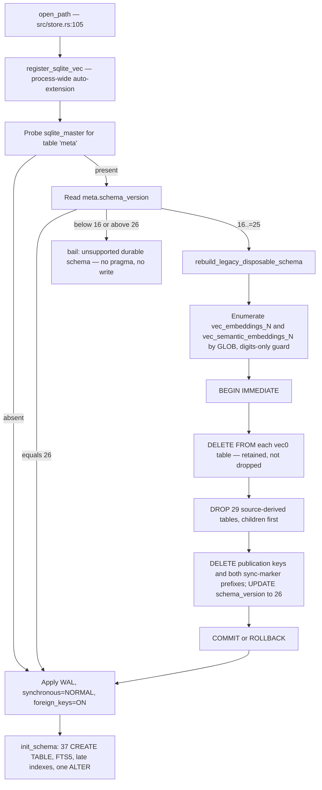
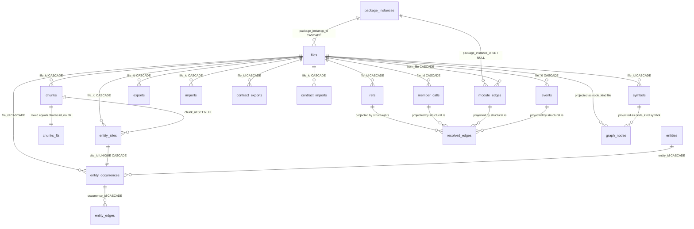
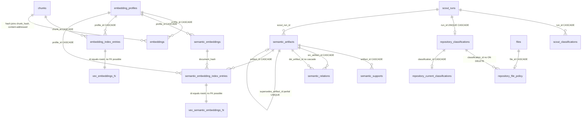

# Storage: SQLite schema, indexes, and vectors

Every fact jscout knows about a repository lives in one SQLite file, `.jscout.db`, at the repository root. That file holds 37 regular tables, one FTS5 virtual table, and a variable number of `vec0` virtual tables created on demand — one per embedding dimensionality. The schema is deliberately split into two planes: everything derivable from source (files, chunks, symbols, references, the resolved graph projection) is thrown away and recomputed on demand, while everything that cost money or model time (the content-addressed embedding cache, semantic artifacts and their supports, reconnaissance verdicts) is carried forward across schema versions. `src/store.rs` (1394 lines, of which 1042 onward are an inline `#[cfg(test)] mod tests`) owns the DDL, the connection policy, and the reset helpers; `src/embed.rs` owns the sqlite-vec plane; `src/structural.rs` and `src/indexer.rs` write the projection and publish it.

## Version stamps and the two openers

Two constants gate everything. `SCHEMA_VERSION = "26"` (`src/store.rs:8`) is the current shape; `DURABLE_SCHEMA_FLOOR = 16` (`src/store.rs:9`, private, unlike the `pub` `DB_FILE` and `SCHEMA_VERSION`) is the oldest version whose durable tables are still shape-compatible. Both are compared against the `meta.schema_version` row.

The read path is strict. `open_path_read_only` refuses to create the file (`src/store.rs:54-59`), opens with `SQLITE_OPEN_READ_ONLY`, sets `foreign_keys=ON` and `query_only=ON` (`src/store.rs:60-64`), demands `meta.schema_version` equal `"26"` exactly (`src/store.rs:78-83`), and then demands that both `meta.snapshot` and `meta.projection_version` exist before handing back a connection (`src/store.rs:84-96`). An unindexed checkout therefore fails with "has no published structural snapshot; run `jscout index`" rather than returning empty result sets that look like a real answer. It never migrates and never takes write authority, so anything that needs to bootstrap must go through the writer — which is why the MCP server holds a read-only connection for its session and opens a writer only for the one write-capable tool (see [11-mcp-surface.md](11-mcp-surface.md)).

The write path is permissive within a window. `open_path` registers sqlite-vec (`src/store.rs:106`), opens the file (`src/store.rs:107`), probes `sqlite_master` for a `meta` table (`src/store.rs:108-114`), and reads the version (`src/store.rs:116-122`). A version outside `16..=SCHEMA_VERSION.parse()` bails without applying a single pragma or writing a byte (`src/store.rs:123-140`) — the upper bound is derived from the constant, not a second literal. Only after the gate passes does it apply `journal_mode=WAL`, `synchronous=NORMAL`, `foreign_keys=ON` (`src/store.rs:144-146`) and run `init_schema`. Two tests reopen a rejected database and assert the version string and legacy row shapes are untouched (`src/store.rs:1058-1099`, `src/store.rs:1224-1284`). `register_sqlite_vec` (`src/store.rs:13-25`) transmutes `sqlite_vec::sqlite3_vec_init` into the extension-entry signature inside `unsafe` and installs it via `sqlite3_auto_extension` under a `Once`, so every `Connection::open` anywhere in the process after the first `store::open*` call inherits `vec0`, including connections that never asked for it.

## One migration boundary, not a ladder

There is no per-version migration ladder. Anything below 16 or above 26 is refused; anything in between runs `rebuild_legacy_disposable_schema` (`src/store.rs:156`), which discards the entire disposable plane and lets the current `init_schema` recreate it.

What to look for below: the gate has three exits, and only the middle one touches the file.

The `VEC` and `EMPTY` nodes are where the durable/disposable line is subtlest. The `vec0` tables are enumerated with a `GLOB` plus a `NOT GLOB '*[^0-9]*'` suffix guard (`src/store.rs:157-169`), then emptied inside the transaction after re-validating the numeric suffix in Rust (`src/store.rs:174-183`). They are retained rather than dropped because their rowids are snapshot-local `embedding_index_entries.id` values — the rows are meaningless after a rebuild, but the table shape is not (`src/store.rs:150-155`). `DROPS` covers 29 statements (`src/store.rs:185-213`), ending with `package_instances`; one of them, `checker_input_files`, names a table `init_schema` no longer creates, so it is a dead drop. Note that `semantic_embedding_index_entries` is in the drop list: a version migration discards semantic *vector materialization* even though it preserves the artifacts and their cached vectors.

Schema changes since v23 arrive for free through this mechanism because the tables are recreated: `idx_graph_nodes_native ON graph_nodes(native_id, native_table)` added at v25 (`src/store.rs:517-518`), and `idx_member_calls_file` widened from `(file_id)` to `(file_id, receiver_start, prop)` at v26 (`src/store.rs:391-392`). Two tests stamp a database back to 24 and 25, break the index, reopen, and assert `pragma_index_info` returns the exact new column order (`src/store.rs:1305-1359`) — index column order is a testable contract here. The one exception to the rebuild-everything rule is a genuine `ALTER TABLE`: `repository_classifications.cited_evidence_json` is added if `pragma_table_info` shows it missing (`src/store.rs:838-851`), because that column landed mid-review of v20 on a durable table.

The tradeoff is stated in the error text: upgrading from any of 16..25 forces a full reindex, and a v15 file is refused outright rather than best-effort migrated, so an operator with a valuable v15 embedding cache must preserve the file by hand. The version literal `'26'` is hardcoded three times — the constant (`src/store.rs:8`), the migration's `UPDATE` (`src/store.rs:220`), and the `init_schema` seed insert (`src/store.rs:238`) — so a bump that misses one leaves migrated databases stamped at the old value and re-entering the migration on every open.

## Table inventory

Plane column: **D** = disposable (rebuilt from source), **S** = snapshot-scoped (survives an extraction reset, cleared by a full refresh), **P** = projection (rebuilt by `structural::rebuild_projection`), **U** = durable (survives every reset and every in-range migration except where noted), **C** = checker plane (retained by caller policy).

| Table | Line | Plane | What it holds | Key columns |
| --- | --- | --- | --- | --- |
| `meta` | `237` | mixed | Version stamps, publication markers, vector sync markers | `key`, `value` |
| `package_instances` | `241` | S | Workspace members and `node_modules` dependencies | `canonical_root` UNIQUE, `origin`, `status` |
| `files` | `255` | D | The FK hub; nine tables cascade from it | `path` UNIQUE, `hash`, `origin`, `package_instance_id` |
| `chunks` | `266` | D | Full chunk text plus spans | `file_id`, `hash`, `content`, `start_line`/`end_line` |
| `chunks_fts` | `31` | D | FTS5 mirror of chunk content | `rowid = chunks.id`; `content`/`name`/`symbols`/`path` |
| `symbols` | `283` | D | Declarations with separate decl and body spans | `name`, `decl_start`/`decl_end`, `exported` |
| `exports` / `imports` | `299` / `308` | D | Runtime module bindings | `export_name`, `imported_name`, `request` |
| `contract_exports` / `contract_imports` | `319` / `328` | D | Type-only bindings, physically separated | same shape as above |
| `module_edges` | `336` | D | File-to-file import edges | `from_file`, `to_file` (no FK), `resolution`, `type_only` |
| `refs` | `348` | D | Pre-resolution reference evidence | `kind`, `confidence`, `target_request`, `target_name` |
| `events` | `364` | D | Event-bus emit/listen pairs | `role`, `name`, `method` |
| `member_calls` | `375` | D | Member-call sites with four span pairs | `prop`, `receiver`, `receiver_start`/`_end`, `property_start`/`_end` |
| `entity_sites` | `397` | D | Source-local entity evidence before resolution | `plane`, `entity_type`, `identity_kind`, `identity_name` |
| `entities` | `422` | P | Canonical grouped entities | `entity_key` UNIQUE, `plane`, `identity_anchor` |
| `entity_occurrences` | `433` | P | Site-to-entity join | `site_id` UNIQUE, `entity_id`, `role` |
| `entity_edges` | `454` | P | Entity assertions keyed by string | `target_key`, `kind`, `confidence` |
| `embedding_profiles` | `468` | U | Provider + model + inference config identity | `config_fingerprint` UNIQUE, `dimensions` |
| `embeddings` | `479` | U | Content-addressed code-chunk vectors | PK `(chunk_hash, profile_id)`, `vec` BLOB |
| `semantic_embeddings` | `489` | U | Content-addressed artifact-document vectors | PK `(document_hash, profile_id)` |
| `embedding_index_entries` | `496` | D | Per-occurrence vec0 rowid allocation | `id` = vec0 rowid; UNIQUE `(chunk_id, profile_id)` |
| `vec_embeddings_<d>` | `embed.rs:1128` | D | vec0 float payload for code chunks | `embedding FLOAT[d]`, `profile_id`/`origin` PARTITION KEY |
| `graph_nodes` | `505` | P | Projection node table | `node_key` PK, `native_table`, `native_id` |
| `resolved_edges` | `520` | P | Projection edge table | `src_key`, `dst_key`, `kind`, `confidence`, `provenance` |
| `checker_enrichment_batches` | `543` | C | One generation of TypeScript-checker facts | `active` (partial UNIQUE), `source_snapshot`, `plan_fingerprint` |
| `checker_project_runs` | `561` | C | Per-tsconfig-project execution record | PK `(batch_id, project_id)`, `execution_kind`, `peak_rss_bytes` |
| `checker_project_inputs` | `578` | C | Per-project input file hashes | PK `(batch_id, project_id, input_kind, input_path)`, `source_hash` |
| `checker_enrichments` | `589` | C | Resolved member-call targets | `member_call_id` (no FK), six spans, `target_anchor` |
| `checker_occurrence_projects` | `618` | C | Per-occurrence, per-project answer including `unknown` | `status`, `source_hash`, six spans |
| `scout_runs` | `638` | U | One LLM scouting invocation | `status`, `input_fingerprint`, `billing_path`, `usage_json` |
| `repository_classifications` | `672` | U | Immutable reconnaissance verdicts | `run_id` UNIQUE, `subject_key`, `role`, `evidence_fingerprint` |
| `repository_file_policy` | `701` | D | Per-file role acceleration, fresh+`likely` only | `file_id` PK, `effective_role`, `source_hash` |
| `repository_current_classifications` | `721` | D | Currently-active verdicts including neutral ones | `subject_key` UNIQUE, `role`, `conflict_files` |
| `scout_classifications` | `745` | U | Per-candidate decision including exclusions | PK `(run_id, anchor_key)`, `decision` |
| `semantic_artifacts` | `754` | U | Cards, workflows, summaries, concepts | `supersedes_artifact_id` self-FK, `artifact_fingerprint` |
| `semantic_relations` | `774` | U | Artifact-to-artifact dependencies | PK `(src, dst, relation, claim_path)`, `dst_fingerprint` |
| `semantic_supports` | `797` | U | Claim grounding in file + line span | `anchor_key`, `evidence_start_line`, `source_hash`, `context_hash` |
| `semantic_embedding_index_entries` | `817` | U | Per-artifact vec0 rowid allocation | `id` = vec0 rowid, `document_hash` |
| `vec_semantic_embeddings_<d>` | `embed.rs:1168` | U | vec0 float payload for artifacts | `embedding FLOAT[d]`, `profile_id` PARTITION KEY |

## Structural core

What to look for: a single cascade root (`files`), one table joined by rowid rather than by foreign key (`chunks_fts`), and three tables at the bottom that no extractor writes — they are projected.

Three details in that diagram carry design weight. `module_edges.to_file` is a plain `INTEGER` with no foreign key, so an edge pointing at a file that has not been inserted yet — or that lives outside the corpus entirely — survives instead of failing insertion. `contract_exports` and `contract_imports` duplicate the shape of `exports`/`imports` rather than adding a `type_only` flag, so a resolution query that forgot to check a flag cannot accidentally infer runtime execution from a type-only relationship (`src/store.rs:316-318`); the cost is a duplicated table shape, duplicated indexes, and two joins where one would do. And `chunks_fts` is the only relationship in the diagram maintained purely by hand — FTS5 tables are not foreign-key aware, so the rowid identity is established at insert (`src/indexer.rs:703`), broken explicitly on per-file delete (`src/store.rs:1000-1003`), and re-established wholesale on reset.

One conceptual column is enforced two different ways: `refs.chunk_id`, `events.chunk_id`, and `member_calls.chunk_id` are plain integers, while `entity_sites.chunk_id` and `entity_occurrences.chunk_id` are real foreign keys with `ON DELETE SET NULL`. The unenforced ones dangle after chunks are cleared, which is tolerable only because they are cleared in the same batch.

## Semantic, vector, and scouting planes

What to look for: two `vec0` tables reachable only by rowid, and a reconnaissance triangle where one durable table feeds two disposable projections.

The `embedding_index_entries` to `vec_embeddings_N` relationship is the load-bearing hack. A `vec0` table has no foreign keys and no joinable columns beyond its partition keys, so the regular table is made authoritative and its primary key *is* the virtual table's rowid; the comment stating the pattern sits at `src/store.rs:813-815` for the semantic side, and both insert paths take `last_insert_rowid()` of the entries table (`src/embed.rs:1430-1443`). Every KNN result joins back through `i.id = v.rowid`. The cost is that two tables must be kept in step by hand on every write, and every delete path must remove `vec0` rows *before* the FK cascade destroys the join table — which is why `delete_file` calls `embed::delete_vector_rows_for_file` first (`src/store.rs:998-1007`).

The reconnaissance triangle encodes overlapping information three ways on purpose. `repository_classifications` is durable and append-only because each row cost an LLM call, and its `evidence_fingerprint` is deliberately snapshot-free so a later run can reuse a verdict after an unrelated reindex. `repository_file_policy` is rebuilt from fresh, `likely`-only verdicts so a stale or hedged classification never hides or penalizes a file (`src/store.rs:698-700`). `repository_current_classifications` keeps the neutral `possible`/`mixed`/`unknown` verdicts too, so a read-only overview can explain the active policy without pretending immutable historical rows are current after a branch switch. One asymmetry: the durable table's `subject_kind` CHECK allows `'project'` while the current-classifications CHECK allows only `'package'` and `'area'` (`src/store.rs:676` vs `src/store.rs:723`), so a project-kind classification can be recorded but never projected as current. Scouting itself is covered in [08-scouting.md](08-scouting.md).

## What survives what

Three reset helpers define the split by subtraction, and each is a strict superset of the one before it.

`reset_extraction_state` (`src/store.rs:931`) calls `embed::clear_vector_rows`, then deletes 19 tables children-before-parents in one batch so foreign-key enforcement only ever scans already-emptied referencing tables (`src/store.rs:936-955`), then **drops** `chunks_fts` (`src/store.rs:956`) and recreates it from the shared constant (`src/store.rs:958`). The drop is not stylistic: an FTS5 `DELETE` must read each row to compute inverted-index deltas, while a `DROP` is O(1). That is why the DDL lives in one `CHUNKS_FTS_CREATE` constant with a comment warning that the reset must use the identical definition (`src/store.rs:27-36`). Two things survive that look like they should not: `symbols` is not in the delete list and clears only by FK cascade from `files`, which quietly breaks the children-first discipline the comment above it claims; and `clear_vector_rows` iterates `SELECT DISTINCT dimensions FROM embedding_profiles` and empties only the *code-side* `vec_embeddings_<d>` tables (`src/embed.rs:1810-1821`), so semantic vectors survive an extraction reset intact.

`reset_snapshot_state` (`src/store.rs:969`) is `reset_extraction_state` plus `DELETE FROM package_instances` and deletion of the four publication keys `root`, `snapshot`, `projection_version`, `resolution_hash`. That extra scope is the whole difference between `IndexMode::Incremental` and `IndexMode::FullRefresh`.

The durable plane — untouched by both helpers — is `embedding_profiles`, `embeddings`, `semantic_embeddings`, `semantic_embedding_index_entries`, `semantic_artifacts`, `semantic_relations`, `semantic_supports`, `scout_runs`, `scout_classifications`, `repository_classifications`, and the `vec_semantic_embeddings_<d>` tables. The checker plane survives a reset but is then subject to caller policy: `clear_checker_batches` drops everything for manual indexing, while `preserve_active_checker_batch_for_watch` deletes only `active=0` staging rows and keeps the single active batch as a hidden carry source (`src/store.rs:982-996`, chosen at `src/indexer.rs:528-534`). Both return `bool` so the indexer can force a projection rebuild when they changed something. This pair replaced the older `retain_checker_batches_for_snapshot(conn, snapshot)`.

The v16 floor is pinned by one test that seeds a v16 database with files, chunks, a profile plus a materialized vector, a semantic artifact, a scout run, a repository classification, a file-policy row, and an active checker batch, reopens it, and asserts the exact tuple `(1,1,1,1,0,0,0)` — profiles, embeddings, artifacts, and classifications survive; file policy, files, and checker batches do not — plus zero rows in both `embedding_index_entries` and `vec_embeddings_2` (`src/store.rs:1101-1200`).

## Publication, and the paths the prior analysis called unreachable

Nothing is readable until `meta.snapshot` and `meta.projection_version` land. `structural::rebuild_projection` opens `BEGIN IMMEDIATE` (`src/structural.rs:492`), deletes `resolved_edges`, `graph_nodes`, and `entities` (`src/structural.rs:494-496`), runs six projection stages, and upserts both markers inside the same transaction (`src/structural.rs:590-599`) before COMMIT (`src/structural.rs:601-608`). A failed projection therefore cannot leave a published marker over stale edges. The third marker is not atomic with them: `resolution_hash` is written at `src/indexer.rs:567-572`, *after* the projection transaction commits, so a crash in that window leaves a published snapshot with a stale or absent resolution hash — the next open recomputes and rebuilds, but the atomicity claim covers only two of the three keys.

Two optimizations in `index_repo_impl` are worth naming precisely, because a previous reading of this codebase concluded the incremental indexer was `#[cfg(test)]` and unreachable. That is no longer true. `indexer::incremental_refresh_repo_with_options` is `pub`, carries no `cfg` attribute, and is the watcher's default refresh path (`src/indexer.rs:209-222`, called from `src/watch.rs:1093`). What remains `#[cfg(test)]` is a set of wrappers over that live entry point, listed in [13-incremental-and-watch.md](13-incremental-and-watch.md); the one that matters here is `index_repo_without_extraction_reset` (`src/indexer.rs:290`), kept only so tests can prove the wholesale reset produces the same database. Both of the following therefore run in production:

- **The truncation heuristic.** The indexer counts files whose stored `hash` is empty and switches from per-file replacement to a wholesale reset when `cleared * 2 >= existing.len()` — at or above 50%, not strictly above — gated on `allow_extraction_reset && !existing.is_empty()` (`src/indexer.rs:386-399`). Hashes are blanked by `ensure_extraction_version` (`src/indexer.rs:633`) when `entity::EXTRACTION_VERSION` changes, which also drops `resolved_edges` and `graph_nodes` and unpublishes the snapshot. Cascading `delete_file` through tens of thousands of files re-scans the large evidence tables and the FTS index once per file; truncating keeps a forced re-index at fresh-index cost.
- **The unchanged-skip.** After computing `resolution_hash` and `snapshot`, if the triple `(snapshot, projection_version, resolution_hash)` matches what is already published and no checker batch changed, the indexer republishes the three markers inside `BEGIN IMMEDIATE` and returns without projecting at all (`src/indexer.rs:541-564`). This is sound because the projection is a pure function of the canonical tables: the snapshot covers extracted content and the resolution hash covers module edges, whose inputs (tsconfigs, manifests, `node_modules` layout) live outside indexed content.

Both paths are exercised on every watcher cycle. See [13-incremental-and-watch.md](13-incremental-and-watch.md) for the surrounding loop.

One further nuance: `embed::materialize_cached_embeddings` is conditional on `outcome.indexed > 0` (`src/indexer.rs:514-516`), so an index run that changed nothing does not touch the vector plane at all. And `recon::reconcile_file_policy_after_index` (`src/recon.rs:498`, called from both `src/indexer.rs:563` and `578`) returns `()`, not `Result`: on error it clears `repository_file_policy` and `repository_current_classifications`, prints a warning, and lets the index succeed with neutral policy.

## Full-text search

There is exactly one FTS5 table, `chunks_fts(content, name, symbols, path)` with `tokenize="unicode61 tokenchars '_$'"` (`src/store.rs:31-36`). Promoting `_` and `$` to word characters keeps `snake_case` and `$jquery`-style identifiers whole through tokenization, which matters because identifier search is the dominant query shape. Ranking uses `bm25(chunks_fts, 2.0, 4.0, 3.0, 1.0)` (`src/search.rs:896`) — name weighted 4×, symbols 3×, content 2×, path 1×.

The exact-identifier tier added in G17 uses FTS differently: as a bounded candidate generator only. It issues a phrase match with `LIMIT limit * 32` clamped to `32..4096`, then re-verifies case-sensitive identifier boundaries against the stored chunk text in Rust before admitting a hit (`src/search.rs:659-697`). The comment gives the reason: object-literal field keys, non-call member reads and writes, and some computed state containers never become `refs` or `member_calls` rows, so the structured tables cannot answer "where does this identifier literally appear". See [07-retrieval.md](07-retrieval.md).

## Indexes that exist for a specific reason

| Index | Table and columns | Why |
| --- | --- | --- |
| `idx_chunks_hash` (`281`) | `chunks(hash)` | Makes the content-addressed join `embeddings e ON e.chunk_hash = c.hash` cheap during vector materialization |
| `idx_events_file` (`372`) | `events(file_id)` | Keeps the per-file cascade delete off a full scan of a high-volume table |
| `idx_member_calls_file` (`391-392`) | `member_calls(file_id, receiver_start, prop)` | Widened at v26 so member-call projection joins are index-only |
| `idx_embedding_entries_profile` (`502-503`) | `embedding_index_entries(profile_id, chunk_id)` | Drives the anti-join that detects unmaterialized occurrences |
| `idx_graph_nodes_native` (`517-518`) | `graph_nodes(native_id, native_table)` | Added at v25; makes the projection-to-source reverse lookup index-only |
| `idx_resolved_edges_src` / `_dst` (`532`, `534`) | `(key, confidence, kind)` | Confidence- and kind-filtered traversal stays index-only in either direction |
| `idx_checker_one_active_batch` (`556-557`) | UNIQUE `(active) WHERE active=1` | Database-enforced "at most one active checker batch", no application logic |
| `idx_checker_enrichments_source` (`611`) | `(source_file, call_start)` | The content-based re-match join that replaces a foreign key to `member_calls` |
| `idx_scout_runs_active` (`662-664`) | UNIQUE `(scout_kind, input_fingerprint) WHERE status IN ('running','completed')` | Single-flight claim for scouting; `--rebuild` must supersede first |
| `idx_repository_classifications_evidence` (`695`) | `(subject_key, evidence_fingerprint, id DESC)` | Lets a later run reuse a verdict whose evidence has not changed |
| `idx_semantic_artifacts_one_successor` (`793-795`) | UNIQUE `(supersedes_artifact_id) WHERE NOT NULL` | Makes supersession a chain, never a tree |

Making single-flight and single-active into partial unique indexes rather than application checks means no code path can forget them; the cost is that the failure surfaces as a raw SQLite constraint error that callers must translate.

## Vector plane mechanics

`vec_embeddings_<d>` is created on demand with `embedding FLOAT[d] distance_metric=cosine, profile_id INTEGER PARTITION KEY, origin TEXT PARTITION KEY` (`src/embed.rs:1128-1132`); the semantic variant partitions only on `profile_id`, since artifacts have no file origin (`src/embed.rs:1168-1171`). Dimensions are validated `1..=8192` before being interpolated into the table name (`src/embed.rs:1103-1108`, `1158-1161`), which bounds the `vec_*_<digits>` namespace and makes the migration's GLOB enumeration total. The partition keys prefilter KNN inside the index rather than post-filtering results, which would silently shrink k — but a partition key accepts only a single equality, so origin-filtered search issues one query per requested origin and merges in Rust.

Freshness is a `meta` marker plus a cheap anti-join, not an audit. `vector_index_needs_sync` first checks for `meta['embedding_index_synced_v1:<profile_id>']`, then runs `chunks ⋈ embeddings LEFT JOIN embedding_index_entries WHERE i.id IS NULL LIMIT 1` (`src/embed.rs:1502-1531`) — index-time, versus O(vectors) for auditing every `vec0` row on every search. The invariant it depends on is that a marker may not outlive a populated table, so `ensure_vector_table` deletes every marker for that dimension before publishing a replacement (`src/embed.rs:1118-1124`) — but only when the table did not already exist (`if !existed`), not unconditionally. Because profiles of equal dimension share one `vec0` table, invalidation is by dimension, not by profile. Both `delete_vector_rows_for_file` and `clear_vector_rows` call `ensure_vector_table` (`src/embed.rs:1804`, `1818`), so a code path whose entire job is deletion can create an empty virtual table as a side effect. See [06-semantic-layer.md](06-semantic-layer.md) for how vectors are produced.

## Transactions, pragmas, and concurrency

Writes use a bare `execute_batch("BEGIN IMMEDIATE")` with a closure and manual COMMIT/ROLLBACK; the idiom recurs roughly 25 times across `src/store.rs`, `src/structural.rs`, `src/indexer.rs`, `src/recon.rs`, `src/checker/enrich.rs`, and `src/scouting/`. Reads use `store::with_read_snapshot` (`src/store.rs:858-874`), which wraps a named `SAVEPOINT` so a multi-statement read sees one SQLite snapshot. Savepoints rather than transactions, because they nest: search expansion can re-enter neighborhood traversal, which pins its own snapshot, without the inner call committing or aborting the outer one. Callers pass distinct names — `jscout_search`, `jscout_neighborhood`, `jscout_semantic_query`, `jscout_scout_plan` — and the vector plane uses the same trick for the same reason.

Every savepoint error arm discards the unwind result with `let _ = conn.execute_batch("ROLLBACK TO …; RELEASE …")` (`src/store.rs:869`, `src/embed.rs:1136-1139`, and the rest), so a failure to unwind is invisible and leaves an open savepoint on the connection. `busy_timeout` is left at SQLite's default of 0 on every connection except the watcher's, which sets 5 seconds (`src/watch.rs:17`, `1314`) — so a second CLI invocation or an MCP `annotate` racing an index run gets an immediate `SQLITE_BUSY` rather than waiting. The read-only opener sets no `journal_mode` at all; `with_read_snapshot`'s savepoint is what pins the snapshot on those connections.

## Known gaps

`store::file_source_path` (`src/store.rs:1012-1039`) is the reminder that `files.path` is a display key, not a path. Repository and workspace origins join `root + files.path`; dependency origins must join `package_instances.canonical_root + files.package_path`, because a dependency's `files.path` is a synthetic `dependency:name@version/rel` string. Any consumer treating `files.path` as a filesystem path is wrong for a third of the corpus.

`semantic_relations.dst_artifact_id` references `semantic_artifacts(id)` without `ON DELETE CASCADE` while `src_artifact_id` has it (`src/store.rs:775-776`), so deleting a summarized child artifact raises an FK error while deleting the summarizing parent succeeds. `repository_file_policy.classification_id` similarly has no `ON DELETE` clause pointing at the durable parent — harmless while classifications are immutable, an error the first time someone purges history. `semantic_relations.names_concept` is a reserved CHECK value with no writer (`src/store.rs:777-781`). And no test asserts the total table count or diffs a live schema against `init_schema`, so the drop list in the migration and the `CREATE` list in `init_schema` can drift apart silently — as `checker_input_files` already has.

Finally, a note on evidence: the repository's own checked-in `.jscout.db` is schema v4 and `eval/fixtures/structural/.jscout.db` is v6. Both are far below `DURABLE_SCHEMA_FLOOR`, so the current binary refuses both. Their `.schema` output describes a shape with `embeddings(chunk_hash, model, dim, vec)`, no `entity_*`/`checker_*`/`scout_*`/`package_instances` tables, and `member_calls` without receiver spans — it is not evidence about v26 and must not be read as such. Further rough edges are collected in [19-sharp-edges.md](19-sharp-edges.md).
