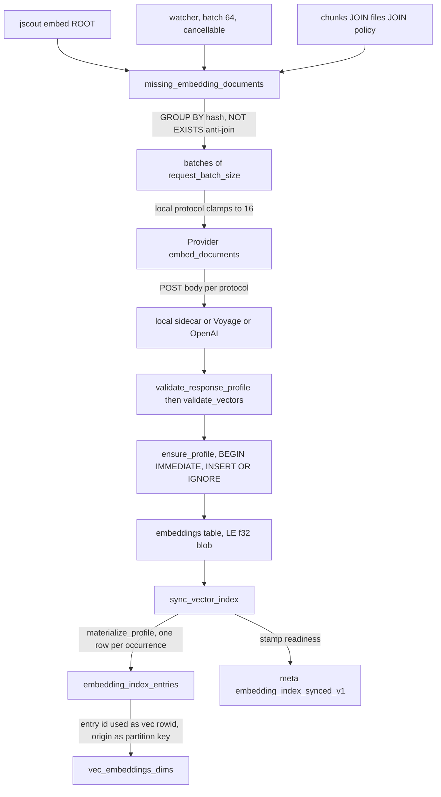
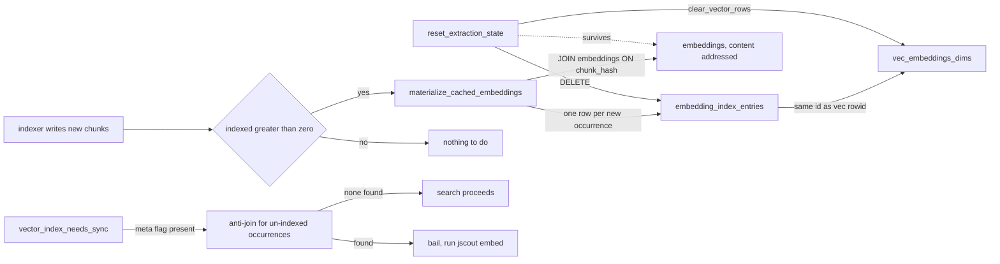
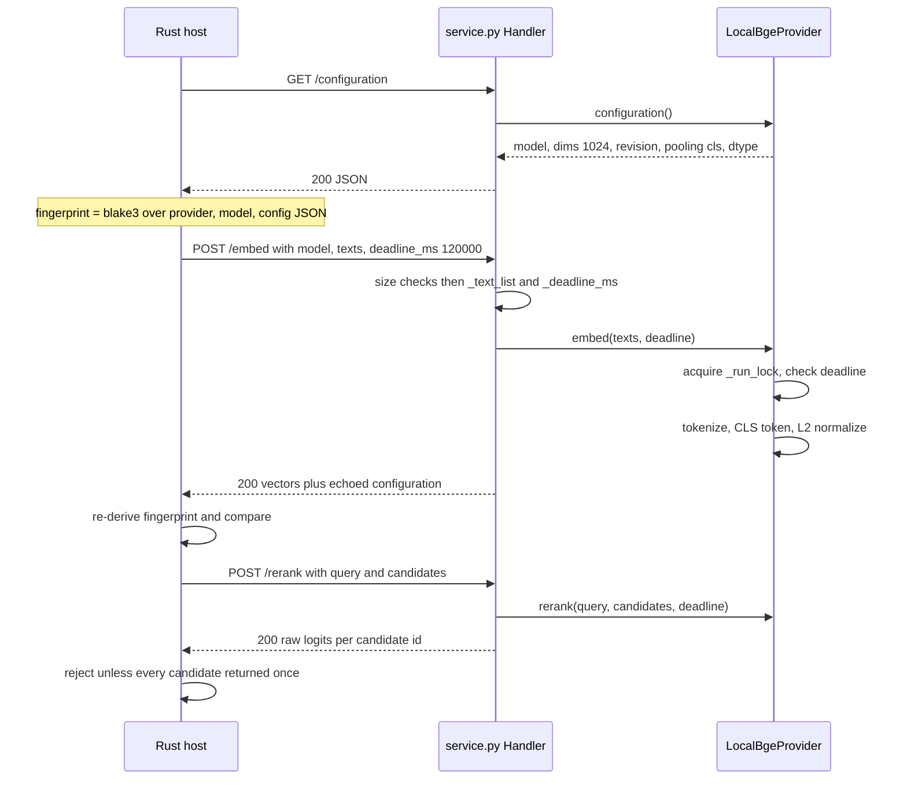

# Semantic layer: embeddings, vectors, and the inference sidecar

The semantic layer turns two kinds of text — raw code-chunk source and generated semantic artifacts — into cosine-normalized float vectors, stores them in a content-addressed SQLite cache that survives reindexing, mirrors them into per-dimension `sqlite-vec` virtual tables for KNN, and answers nearest-neighbour queries that [retrieval](07-retrieval.md) fuses with BM25. Vectors are optional throughout: every read path degrades to lexical-only when no provider is configured or when the provider fails, and reports that degradation in the response rather than hiding it. The provider is either an OpenAI-compatible HTTP endpoint, Voyage, or a bundled Python sidecar running BGE-M3 locally; that sidecar also serves the cross-encoder reranker.

## What actually gets embedded

There are two document namespaces with two different text compositions, and neither is the obvious choice.

For code chunks, `embed_text` is the entire composition (`src/embed.rs:470`): take the chunk's content, and if it exceeds 24,000 bytes, walk backwards to the nearest UTF-8 char boundary and truncate. No path, no symbol name, no scope header. Since `chunks.content` is a verbatim slice of the source file (`src/chunk.rs:470`, hashed at `src/chunk.rs:486`), the text sent to the provider is literally the source text. The doc comment gives the reason: the cache is keyed `(chunk_hash, profile_id)`, so occurrence-specific metadata folded into the text would force N duplicate occurrences of identical content to pick one arbitrary representative path, breaking dedup.

For semantic artifacts, `semantic_embedding_documents` composes one document per non-superseded row in `semantic_artifacts` (`src/embed.rs:495`). The template is fixed at `src/embed.rs:530`: the literal line `semantic artifact`, then `type: {artifact_type}`, `name: {canonical_name}`, `anchors:` followed by the newline-joined anchor list, then `body: {body_json}`. Anchors come from a correlated subquery over `semantic_supports` using `group_concat(anchor_key, char(10))` over a `SELECT DISTINCT … ORDER BY` (`src/embed.rs:500`). The comment at `src/embed.rs:527` explains the field order: generated workflow bodies can be large, the 24 KB bound eats the tail, and anchors are the bridge back to code, so placing them after the body would truncate the most useful part. The composed string then goes through the same `embed_text` bound.

| | Code chunks | Semantic artifacts |
|---|---|---|
| Text | verbatim `chunks.content` | `type` / `name` / `anchors` / `body_json` header |
| Bound | 24,000 bytes, UTF-8 safe (`src/embed.rs:470`) | same, applied to the composed string |
| Cache key | `chunks.hash` = blake3 of **full** content (`src/chunk.rs:486`) | `blake3("semantic-v1" ‖ 0x00 ‖ **truncated** text)` (`src/embed.rs:534`) |
| Format tag | `DOCUMENT_TEXT_FORMAT = "content-v2"`, in the profile config JSON (`src/embed.rs:9`); a bump forks the profile | `SEMANTIC_DOCUMENT_TEXT_FORMAT = "semantic-v1"`, inside the hash; a bump misses every row |
| Cache table | `embeddings(chunk_hash, profile_id, vec)` (`src/store.rs:476`) | `semantic_embeddings(document_hash, profile_id, vec)` (`src/store.rs:485`) |

The asymmetry in the cache-key row is load-bearing: the code hash covers text the embedder never saw, while the semantic hash covers exactly the bytes sent. So the 24,000 constant is *not* part of code-plane cache identity, and changing it would silently reuse vectors produced under the old bound; the semantic plane is immune because the constant is baked into the hashed string.

## Provider matrix

`Provider::from_env` selects strictly on `JSCOUT_EMBED_PROVIDER` (`src/embed.rs:153`). Empty or `none` returns `Ok(None)`; anything not in the table below is a hard error naming the accepted values. API keys never imply a provider.

| Protocol | Endpoint | Default model | Credential | Request body | Query prefix |
|---|---|---|---|---|---|
| `local` | `{inference base}/embed` | `BAAI/bge-m3` | none | `{model, texts, deadline_ms: 120000}` | always empty (`src/embed.rs:178`) |
| `voyage` | `https://api.voyageai.com/v1/embeddings` | `voyage-code-3` | `VOYAGE_API_KEY` (required) | `{model, input, input_type: "query"\|"document"}` | model-sniffed or `JSCOUT_QUERY_PREFIX` |
| `openai` | `https://api.openai.com/v1/embeddings`, or `JSCOUT_EMBED_URL` | `text-embedding-3-small` | `OPENAI_API_KEY`, or `JSCOUT_EMBED_KEY` when a custom URL is set | `{model, input}` | model-sniffed or `JSCOUT_QUERY_PREFIX` |

`JSCOUT_EMBED_MODEL` overrides the model for any protocol (`src/embed.rs:162`). The credential switch on the `openai` branch is deliberate (`src/embed.rs:200`): when `JSCOUT_EMBED_URL` is present, `OPENAI_API_KEY` is not read at all, so an OpenAI secret cannot leak to LM Studio, vLLM, a gateway, or a mistyped host — at the cost of a second variable to set even against a server that ignores auth. `validate_endpoint` (`src/embed.rs:138`) rejects non-http(s) schemes, empty authorities, and any `user:pass@host` form.

Query prefixes come from substring matches on the lowercased model name (`src/embed.rs:127`): `nomic-embed-code`/`coderankembed` get a "Represent this query for searching relevant code" instruction, `qwen3-embedding` a two-line `Instruct:`/`Query:` template, everything else the empty string. The prefix is applied only in `embed_query` (`src/embed.rs:339`), and the `local` arm hardcodes `query_prefix: String::new()` — so `JSCOUT_QUERY_PREFIX` is silently inert for the bundled sidecar.

## Profile identity

Every cache row is scoped to a profile. `Provider::profile` builds a protocol-specific config JSON (`src/embed.rs:227`) and `profile_fingerprint` hashes it as blake3 over `"jscout-embedding-profile\0"` followed by provider, model, and config JSON, each NUL-terminated (`src/embed.rs:449`). Every config JSON carries `document_text: DOCUMENT_TEXT_FORMAT`, which is what makes a representation change fork the profile instead of reusing wrong vectors.

For `local`, `profile()` GETs `{base}/configuration`, asserts `provider == "local"` and that the served embedding model equals the requested one (`src/embed.rs:239`), reads `embedding.dimensions`, and embeds the entire `embedding` object — model, dimensions, revision, and a nested `{pooling, normalized, max_length, dtype}` — into the config JSON, so a dtype or revision change forks the profile. Voyage and OpenAI configs carry only protocol tag, document-text tag, URL, and query prefix, and set `dimensions: None`; they learn dimensions from the first response, checked in `ensure_profile` (`src/embed.rs:886`).

`existing_profile` (`src/embed.rs:825`) is not a plain fingerprint lookup. On a miss, if the expected config's protocol is `jscout-local-v1`, it scans every profile row with the same provider and model, strips a `device` key from each stored config, and reuses the row if the remainder matches — `device` was removed from local cache identity, since MPS- and CUDA-produced vectors at the same dtype are interchangeable. Multiple legacy matches are refused rather than guessed at, and the scan runs on every fingerprint miss.

## Selecting work, and the dedup-by-content-hash mechanism

`missing_embedding_documents` (`src/embed.rs:570`) does deduplication, the cache anti-join, the origin filter, and the product filter in one statement: it selects `c.hash, MIN(c.content), COUNT(DISTINCT c.content)` from `chunks` joined to `files` and left-joined to `repository_file_policy`, anti-joins `embeddings` for the resolved profile id, and groups by `c.hash`.

The `GROUP BY` collapses every occurrence of identical content to one row, so a helper duplicated across fifty files is embedded once. `COUNT(DISTINCT c.content)` is a paranoia check: if any hash maps to more than one content string, the run bails with "refusing to cache an ambiguous embedding" (`src/embed.rs:617`), because the cache design assumes hash determines text. The product filter prefers a fresh reconnaissance policy row (`effective_role='runtime'`) and falls back to `role IN ('production','unknown')` only when no policy row exists, so `--product` degrades to a neutral guess rather than to nothing. Semantic selection just diffs the composed document list against cached `document_hash` values plus an in-batch `seen` set (`src/embed.rs:547`).

The embed path, from CLI or watcher down to the virtual table:

A few edges carry most of the design. `SEL` collapses occurrences to content hashes, so `CACHE` holds one vector per distinct content; `ENTRIES` re-expands back to occurrences, so `VEC` holds one KNN row per chunk id. `BATCH → PROV` is where the local clamp lives, and `SYNC → META` is the only thing search checks before trusting `VEC`.

## Batching, retries, and the write transaction

Batch size comes from `--batch` (default 64, `src/main.rs:86`) but is clamped to 16 whenever `provider.protocol == Protocol::Local`, on both the code path (`src/embed.rs:697`) and the semantic path (`src/embed.rs:775`). The comment at `src/embed.rs:694` derives the number from the sidecar's limits: sixteen fully expanded 24k chunks stay under the 500,000-character input cap and the 4 MiB body cap even for multibyte source. Rust bounds by *bytes* and Python counts *characters*, which is why the derivation has slack; move either constant and the boundary starts returning `413 inputs_too_large`.

`post_with_retry` (`src/embed.rs:289`) schedules exactly one attempt for `Protocol::Local` and four at 0/2s/8s/20s for remote protocols — remote failures are transient rate-limit or network events, while a local failure means the sidecar is down or the model failed to load, and retrying just multiplies a 120-second deadline. The global `ureq` timeout is `DEFAULT_LOCAL_DEADLINE_MS + 5_000` = 125 s and applies to remote agents too, even though only the local body carries `deadline_ms`. Backoff is `std::thread::sleep` on the calling thread, so a watcher embed worker blocks through up to 30 s of cumulative sleep, and cancellation is only observed between batches.

Response handling splits by protocol (`src/embed.rs:359`). Local responses must report `provider: "local"` and the same model, must have `dimensions` matching the first vector's length, and re-derive a fingerprint from the echoed model/revision/configuration; `validate_response_profile` (`src/embed.rs:1573`) compares that to the discovery fingerprint and fails if the sidecar swapped configuration mid-run. Remote responses parse `data[].embedding` and carry no fingerprint. `parse_vector` (`src/embed.rs:419`) rejects non-numeric, empty, and non-finite vectors; `validate_vectors` (`src/embed.rs:435`) checks count-versus-inputs and a uniform non-zero dimension.

Each batch writes in its own `BEGIN IMMEDIATE` … `INSERT OR IGNORE` … `COMMIT`, rolling back on error (`src/embed.rs:720`). A profile id change mid-run is fatal — `"embedding profile changed during one embed operation"` (`src/embed.rs:717`), or `"…during one semantic embed operation"` (`src/embed.rs:792`).

## Materialization and the cache-hit path

`vec0` virtual tables have no foreign keys, so integrity is carried by regular tables whose primary key *is* the virtual rowid. `embedding_index_entries(id, chunk_id, profile_id)` with `UNIQUE(chunk_id, profile_id)` (`src/store.rs:495`) owns code-plane identity; `semantic_embedding_index_entries(id, artifact_id, profile_id, document_hash)` (`src/store.rs:802`) owns the semantic side and records which document produced the vector, so a rewritten artifact's stale row is detectable.

`sync_vector_index` (`src/embed.rs:1082`) runs four steps per profile inside `SAVEPOINT jscout_vector_sync`: delete virtual rows whose rowid is not in `embedding_index_entries`; call `materialize_profile` to insert one entry row per un-indexed occurrence and mirror it into the vec table (`src/embed.rs:1164`); repair entries whose virtual row went missing under older non-transactional builds (`src/embed.rs:1114`); stamp the readiness key. The vec table is `vec0(embedding FLOAT[d] distance_metric=cosine, profile_id INTEGER PARTITION KEY, origin TEXT PARTITION KEY)` (`src/embed.rs:931`); the semantic variant omits the `origin` partition (`src/embed.rs:950`).

The cache-hit path is what makes the "disposable snapshot, durable cache" split pay off. `store::reset_extraction_state` (`src/store.rs:916`) wipes `embedding_index_entries` and every vec row via `clear_vector_rows`, but leaves `embeddings` and `semantic_embeddings` intact. After a reindex writes fresh chunk rows, `index_repo_impl` calls `materialize_cached_embeddings`, guarded by `if outcome.indexed > 0` (`src/indexer.rs:335`); it runs `materialize_profile` per profile without the repair pass, so previously-seen content becomes searchable with no provider contact.

The `RESET -.-> CACHE` edge is the whole point: nothing on the reindex path touches the provider. `MAT` joins new `chunks` rows against `CACHE` on `chunk_hash` and fills `E1`/`V1` from bytes already on disk. `CHECK` is the compensating read-side guard — `vector_index_needs_sync` (`src/embed.rs:1247`) tests the meta flag, then runs a bounded `EXISTS` anti-join for any chunk with a cached embedding but no index entry, catching a stale index without auditing every virtual row. It does not catch a virtual row corrupted after the flag was stamped; the semantic plane pays for the stronger bidirectional gap query between entries and vec rows (`src/embed.rs:1362`). Schema upgrades `DROP TABLE` both entry tables (`src/store.rs:185`), safe for the same reason: entries are derivable, the cache is not.

## Query paths

`vector_search` (`src/embed.rs:1445`) resolves the profile spec, calls `ready_search_profile` (meta flag, anti-join, and a `sqlite_master` existence check for the dimension-specific table), embeds the query, re-validates the response fingerprint, checks the query vector's length against the stored profile, and hands off to `exact_vector_search`. Each stage is timed to stderr under `JSCOUT_TIMING`.

`exact_vector_search` (`src/embed.rs:1492`) issues **one KNN statement per requested origin**, because `origin` is a `vec0` partition key and sqlite-vec applies `k` before any join — a single query with an origin predicate would let one origin starve another. Each statement uses `v.k = limit.max(1)`; merged results sort by score descending and truncate to `limit`. Score is `1.0 - distance`, i.e. cosine similarity over normalized vectors. Effective k therefore becomes `limit × origins`, and the statement is re-prepared inside the loop rather than cached.

`exact_semantic_vector_search` (`src/embed.rs:1412`) over-fetches instead: `candidate_limit = limit.max(1) * 4` capped at 4096, because the `NOT EXISTS(successor.supersedes_artifact_id = entry.artifact_id)` filter is applied *after* the KNN cut. Without headroom a superseded artifact would consume a result slot; with it, a corpus whose top hits are mostly superseded can still return short.

Failures on both paths are wrapped in `VectorFailure` with a `plane` and a `kind` (`src/embed.rs:45`). The kind selects the remediation string: `Inference` yields "start or repair the configured embedding service, then retry", `Index` falls back to a plane-specific action — `"run jscout embed <root>"` for code, `"…--semantic-only"` for memory (`src/embed.rs:97`). Profile discovery and query embedding are tagged `Inference`; readiness checks and dimension mismatches are tagged `Index`. A vector failure never fails a code search: `record_vector_ranking` (`src/search.rs:1015`) drops the ranking and sets `RetrievalStatus::vector_degraded(...)`, leaving BM25 alone in the fusion.

## Semantic-memory ranking

`rank_artifacts` (`src/semantic.rs:974`) loads `id`, `artifact_type`, `canonical_name`, and `body_json` for every candidate artifact into memory — widened by `include_superseded` — then branches. On an empty or whitespace query it returns every candidate with `rank_score: 0.0` and a `vector_disabled` status without calling the provider at all (`src/semantic.rs:1002`). Otherwise `lexical_artifact_relevance` (`src/semantic.rs:1104`) scores by token containment over lowercased name and body, with `concept`-typed artifacts scored against normalized name, definition, and aliases instead; the value is `(matches + 4·exact_name) / token_count` clamped to 1.0, and `None` — dropped by `filter_map` — when no token matches.

The vector ranking is fetched with `vector_limit.clamp(100, 1_000)` (`src/semantic.rs:1044`), overriding the caller in both directions: since `semantic_query::query` passes `limit * 5` and `exact_semantic_vector_search` multiplies by 4, the sqlite-vec `k` is always 400–4000 regardless of the requested limit. The two rankings are RRF-fused at `k = 60` and normalized by the maximum fused score. `ArtifactRetrievalScore` keeps `rank_score`, `lexical_score`, and `vector_cosine` separate (`src/semantic.rs:132`); the doc comment refuses to collapse them into one calibrated-looking relevance, because lexical containment and cosine are model- and query-specific diagnostics.

`semantic_query::query` (`src/semantic_query.rs:209`) runs exact SQL filters first (`artifact_id`, `anchor`, `related_to`, type, freshness, supersession), then intersects with the ranking. `apply_ranking` (`src/semantic_query.rs:453`) returns immediately for an empty query, but for a non-empty one it `retain_mut`s away any candidate the ranking did not return — so an `artifact_id=N` lookup with an unrelated query string returns nothing rather than the requested artifact. `apply_response_budget` (`src/semantic_query.rs:1055`) then shrinks the serialized JSON to `response_byte_limit` in a fixed sacrifice order — concept tags, largest source excerpt, relations, extra sources, supports, artifacts — counting each omission separately.

Annotation writes have their own coupling. `persist_validated_artifact` calls `mark_semantic_vector_index_stale` (`src/semantic.rs:855`), which deletes *every* `semantic_embedding_index_synced_v1:%` meta key (`src/embed.rs:965`) — with multiple profiles configured, one annotation marks all of them unready. So `annotate_request_with_provider` (`src/semantic.rs:495`) checks readiness *before* the write, publishes, then re-embeds with batch 16. The write stays successful when inference fails, since retrying it would duplicate memory; the failure surfaces as `AnnotationVectorStatus`.

## Reranking

`Reranker::from_env` (`src/search.rs:324`) uses `JSCOUT_RERANK_URL` verbatim if set, otherwise synthesizes `{inference base}/rerank` only when `JSCOUT_EMBED_PROVIDER` is exactly `local`; if neither holds it returns `None` and the stage is skipped silently. The rerank stage inside `ranked_hits` (`src/search.rs:812`) takes the top `JSCOUT_RERANK_TOP` fused ids (default 50, capped at 100, matching the sidecar's `MAX_RERANK_CANDIDATES`) and builds one document each via `reranker_document` (`src/search.rs:951`).

Unlike the embedding text, rerank documents *are* occurrence-specific: `path`, `scope`, `symbol`, `kind`, `role`, an optional deterministic/scouted role pair, `origin`, `lines`, a blank line, then content truncated to `JSCOUT_RERANK_CHARS` (default 4000) — the compensation for stripping locational signal out of the embedding. The response must contain every submitted candidate exactly once or the stage bails (`src/search.rs:367`) and the RRF order stands with status `degraded`; ids round-trip through strings, so a service returning numeric JSON ids parses zero scores and trips that check. `merge_reranked_prefix` (`src/search.rs:909`) puts reranked ids in score order ahead of the untouched RRF tail, mixing raw logits and RRF scores on one `(id, score)` axis.

## The Python sidecar

`src/inference.rs` is a thin 173-line bridge. `base_url()` (`src/inference.rs:9`) returns `JSCOUT_INFERENCE_URL` with trailing slashes stripped if set; otherwise, if neither host nor port env var is present, the constant `http://127.0.0.1:8792`; otherwise it composes host and port with `0.0.0.0` → `127.0.0.1`, `::` → `[::1]`, and bracket-wrapping for bare IPv6. `serve()` shells out to `uv run --project <dir> python service.py` (`src/inference.rs:29`), resolving the project from `--project`, then `JSCOUT_INFERENCE_PROJECT`, then cwd ancestors, then executable ancestors, looking for an `inference` directory holding both `pyproject.toml` and `service.py`. `doctor()` GETs `/health` and `/configuration` and prints endpoint, provider, device, and both models with revisions and dimensions.

`inference/service.py` is a stdlib `ThreadingHTTPServer` with four routes and no web framework. Torch is imported lazily inside `_runtime` (`inference/service.py:127`), so BM25-only installs never pay for it; device selection is MPS → CUDA → CPU with float16/float16/float32.

| Route | Request | Success | Failure codes |
|---|---|---|---|
| `GET /health` | — | `200 {status, service, provider, embedding:{model,loaded}, reranker:{model,loaded}, runtime}`, `runtime` being the configuration or `{available:false, error}` | never 503; runtime failure sits in the body |
| `GET /configuration` | — | `200 {available, provider, device, embedding:{model, dimensions:1024, revision, configuration:{pooling:"cls", normalized:true, max_length, dtype}}, reranker:{…}}` | `503 inference_unavailable` if the torch import or device probe raises |
| `POST /embed` | `{model, texts, deadline_ms}` — model must equal the served model, 1..128 non-blank texts, ≤ 500,000 chars total, deadline an `int` (not `bool`) in 100..600000 | `200 {provider, model, revision, device, dtype, dimensions, configuration, vectors, usage}` | `400 invalid_json` / `unsupported_model` / `invalid_inputs` / `invalid_deadline` / `invalid_content_length` / `empty_body`; `413 payload_too_large` (>4 MiB) or `inputs_too_large`; `503` |
| `POST /rerank` | `{model, query, candidates, deadline_ms}` — 1..100 candidates, unique non-empty string ids, non-blank texts, `len(query)·n + Σlen(text) ≤ 500,000` | `200 {provider, model, revision, device, dtype, scores, usage}` | `400 invalid_query` / `invalid_candidates` / `duplicate_candidate` / `unsupported_model`; `413 inputs_too_large`; `503` |

Rerank scores are raw cross-encoder logits (`inference/service.py:295`) — unbounded, uncalibrated, no sigmoid.

The `GET /configuration` exchange and the fingerprint note are the crux: the sidecar's declared configuration becomes part of the Rust cache key, and the `/embed` response echoes enough of it that the host can detect a swap between discovery and use. The `_run_lock` step is one lock shared by embed and rerank (`inference/service.py:123`), serializing all GPU work on purpose — a predictable queue is safer than concurrent requests exhausting MPS unified memory. Deadlines are checked before acquiring the lock and between every torch batch.

Two refusals are worth naming. `LocalBgeProvider.__init__` raises unless the embed model is exactly `BAAI/bge-m3` (`inference/service.py:108`), and since `PROVIDER = LocalBgeProvider()` runs at module import (`inference/service.py:318`), a stray `JSCOUT_EMBED_MODEL` stops the server from starting rather than returning a clean error. And `main()` refuses a non-loopback bind unless `JSCOUT_INFERENCE_ALLOW_REMOTE` is `1`/`true`/`yes` (`inference/service.py:429`). Default revisions are pinned to commit SHAs (`inference/service.py:28`) so a mutable Hugging Face `main` cannot change vector semantics under an unchanged fingerprint; since the revision reaches `/configuration`, upgrading a model forks the profile and forces a full re-embed, by design.

Remaining sidecar knobs: `JSCOUT_INFERENCE_BATCH_SIZE` (torch batch, 16), `_MAX_LENGTH` (4096, reaching the Rust fingerprint via `/configuration`), the two revision overrides, and `JSCOUT_MODEL_CACHE_ROOT`, which `setdefault`s `HF_HOME` to `~/.cache/jscout/models` (`inference/service.py:62`). [13-build-config-ci.md](13-build-config-ci.md) carries the full env-var inventory.

## Known rough edges

Beyond the truncation-versus-hash asymmetry already described (see also [17-sharp-edges.md](17-sharp-edges.md)): nothing on the Rust side filters whitespace-only chunk content, but `_text_list` (`inference/service.py:80`) rejects blank text, so one degenerate chunk fails a whole batch with `400 invalid_inputs`. `sync_semantic_vector_index` fetches each document's vector with a per-row `query_row` plus an existence probe — an O(artifacts) N+1 run on every `embed --semantic` and every annotation top-up. And `MAX_EMBED_INPUTS = 128` on the server is unreachable from the local Rust path, which clamps to 16; the two limits move independently.

Test coverage is dense where testing is cheap and absent where it needs a GPU. `src/embed.rs` carries a sqlite-vec round trip asserting distance under 0.0001, that a new occurrence of cached content invalidates materialization and `materialize_cached_embeddings` repairs it, and that deleting a file purges virtual rows while the content cache survives; a `PRAGMA query_only=true` test proves the search path never writes. `inference/test_service.py` drives everything through a `FakeProvider` so torch is never imported. Untested: the real torch path, `Handler` routing and body-size limits, `post_with_retry` backoff, the Voyage and OpenAI parsers, `Reranker::rerank`'s HTTP round trip, and cancellation in `embed_missing_interruptible`.
