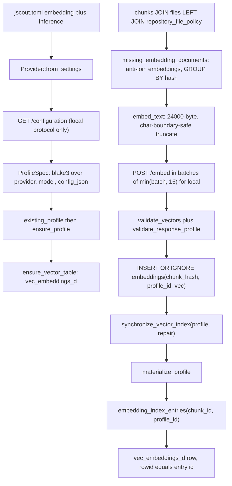
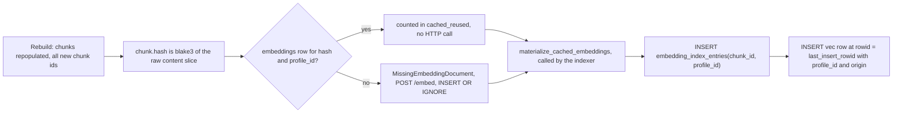
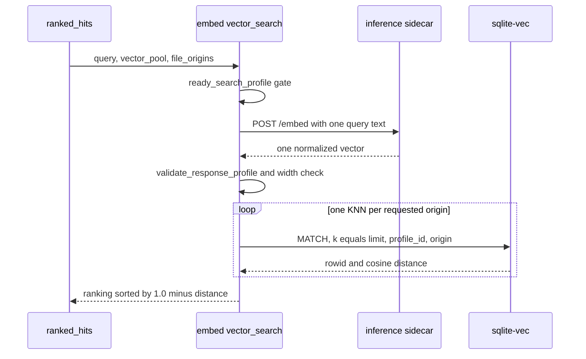

# Semantic layer: embeddings, vectors, and the inference sidecar

The semantic layer turns two kinds of text — raw chunk source and generated semantic artifacts — into float vectors through one of three HTTP protocols, stores them in a content-addressed SQLite cache, and materializes them into partitioned `sqlite-vec` virtual tables that answer k-nearest-neighbor queries during hybrid search. It exists because BM25 alone cannot find code by description, and it is built around a cache because embedding is the most expensive operation jscout performs and a full reindex must not re-pay for unchanged content. Most of what follows — what text goes over the wire, what enters the profile fingerprint, which sync tier runs — is downstream of protecting that cache.

## The two document namespaces

There are exactly two things jscout embeds, and they share nothing but the provider and the profile row: separate caches, separate `vec0` tables, separate format tags.

**Code chunks.** The embedded text is the chunk's verbatim source slice and nothing else. `embed_text` (`src/embed.rs:504`) copies the content and, if it exceeds 24,000 *bytes*, walks the cut index backwards to an `is_char_boundary` before truncating. No path header, no symbol name, no scope line, no role. The doc comment at `src/embed.rs:500-503` states this as a constraint: the cache is keyed `(chunk_hash, profile_id)` (`src/store.rs:479-484`), so occurrence-specific metadata folded into the text would force fifty identical copies of a helper to nominate one arbitrary representative path, collapsing the dedup that makes the cache worth having. The lost signal is recovered at rerank time instead: `reranker_document` (`src/search.rs:1615`) prepends `path`, `scope`, `symbol`, `kind`, `role`, `origin`, and `lines` to the same content, because a cross-encoder scores one `(query, document)` pair on the fly and no cache key constrains it (see [07-retrieval.md](07-retrieval.md)).

**Semantic artifacts.** `semantic_embedding_documents` (`src/embed.rs:538`) selects every artifact with no successor (`src/embed.rs:551-554`) and composes a fixed template at `src/embed.rs:573-576`: the literal line `semantic artifact`, then `type:`, `name:`, `anchors:` followed by the newline-joined distinct anchor keys from a correlated `group_concat(anchor_key, char(10))` over `semantic_supports` (`src/embed.rs:542-549`), and `body: {body_json}` last. The comment at `src/embed.rs:569-572` gives the ordering rationale: workflow bodies get large, the 24 KB bound eats the tail, and the anchor keys are the bridge back to code — after the body, truncation would systematically destroy the most useful part. The result passes through the same `embed_text` bound and is hashed as `blake3(SEMANTIC_DOCUMENT_TEXT_FORMAT || \0 || content)` (`src/embed.rs:577-580`).

The two format tags sit in different structures and have different blast radii. `DOCUMENT_TEXT_FORMAT = "content-v2"` (`src/embed.rs:9`) goes into the *profile config JSON* for all three protocols (`src/embed.rs:285, 294, 305`), so bumping it forks a new `embedding_profiles` row and re-embeds the whole corpus. `SEMANTIC_DOCUMENT_TEXT_FORMAT = "semantic-v1"` (`src/embed.rs:10`) sits inside the document hash, so bumping it misses every cached semantic row within the *same* profile. These are the deliberate invalidation levers, and nothing links them at compile time to the code composing the text — a composition change that forgets the bump silently reuses stale vectors.

## Provider matrix

`Provider::from_settings` (`src/embed.rs:167`) takes already-resolved settings, reading `std::env` only for API-key *values* (`src/embed.rs:198, 227, 229`); `src/embed/tests.rs:17` pins that no other environment read happens. A provider of `None` — config `"none"` or empty — returns `Ok(None)` and turns the vector plane off (`src/commands/core.rs:86-89`).

| Protocol | Endpoint | Key env (default) | Key required | Request body | Retries |
|---|---|---|---|---|---|
| `local` | `{inference.url}/embed` | none | no | `{model, texts, deadline_ms}` | 1 |
| `voyage` | `https://api.voyageai.com/v1/embeddings` (hardcoded) | `VOYAGE_API_KEY` | yes | `{model, input, input_type}` | 4 at 0/2s/8s/20s |
| `openai` (stock host) | `https://api.openai.com/v1/embeddings` | `OPENAI_API_KEY` | yes | `{model, input}` | 4 at 0/2s/8s/20s |
| `openai` (custom `embedding.url`) | the configured URL | `JSCOUT_EMBED_KEY` | no | `{model, input}` | 4 at 0/2s/8s/20s |

The key-env default flips on the presence of a custom URL, and for a custom URL the key is optional (`std::env::var(key_env).ok()`, `src/embed.rs:219-232`). The comment at `src/embed.rs:216-218` says why: a custom server is a separate credential namespace, and this stops an OpenAI secret from being posted to LM Studio, vLLM, a gateway, or a mistyped host. `validate_endpoint` (`src/embed.rs:152-165`) rejects a non-`http(s)` scheme, a missing authority, and any `@` in it.

The retry asymmetry (`src/embed.rs:325-326`) follows from what failure means: a loopback sidecar fails deterministically — not loaded, wrong model, out of memory — so retrying only burns thirty seconds, while a remote call plausibly fails transiently. The cost is that a sidecar mid-download on its first request fails the whole pass. Query prefixes are sniffed from the model name when not configured (`src/embed.rs:140-150`): `nomic-embed-code`/`coderankembed` get `"Represent this query for searching relevant code: "`, `qwen3-embedding` the two-line `Instruct:`/`Query:` form, everything else empty. `embed_query` prepends the prefix and `embed_documents` does not (`src/embed.rs:369-377`) — but the local branch hardcodes `query_prefix: String::new()` (`src/embed.rs:183-195`), silently discarding both a configured prefix and the sniffed default.

## Profile identity and dimensions

`Provider::profile()` (`src/embed.rs:250`) produces a `ProfileSpec { provider, model, fingerprint, config_json, dimensions }`. For the local protocol it issues a live `GET {base}/configuration` (`src/embed.rs:257`), rejects a non-`"local"` provider or a model mismatch, compares `revision` only when `embedding.revision` is configured (`src/embed.rs:277-284`), and takes `dimensions` from the service. The whole `embedding` object goes verbatim into the config JSON (`src/embed.rs:285-287`), so pooling, the normalization flag, `max_length`, and dtype are part of cache identity. Voyage and OpenAI store protocol, document-text tag, URL, query prefix, and revision instead, leaving `dimensions` as `None` — whatever the first response returns wins. `profile_fingerprint` (`src/embed.rs:483`) is blake3 over a NUL-delimited `"jscout-embedding-profile"`, provider, model, and config JSON.

`existing_profile` (`src/embed.rs:1005-1059`) tries an exact fingerprint match, then one legacy escape hatch: for `jscout-local-v1` profiles it re-reads candidate `config_json` rows, strips the `device` key, and accepts a structural match. The comment at `src/embed.rs:1022-1025` justifies it — device is diagnostic while dtype and every output-affecting setting stay in the fingerprint — and the function `bail!`s rather than choosing when two legacy profiles differ only by device. `ensure_profile` (`src/embed.rs:1061`) rejects `dimensions == 0` and any mismatch against the discovery-declared width, inserts `ON CONFLICT(config_fingerprint) DO NOTHING`, re-reads, re-checks the width, and creates the `vec0` table only on the insert path (`src/embed.rs:1099`).

Normalization is the Python service's job: `functional.normalize(output.float(), p=2, dim=1)` over the CLS token (`inference/service.py:254-256`). Rust checks finiteness and consistent width instead (`src/embed.rs:453, 469`), and `distance_metric=cosine` makes an unnormalized remote vector harmless anyway.

## The embed path

The diagram traces `jscout embed <root>` from configuration to a queryable vector row. Watch for two things: the fingerprint is computed *before* any text is embedded, and the durable cache write is a separate step from occurrence materialization.

`MISS` is the selection query (`src/embed.rs:613-669`). It anti-joins `chunks` against `embeddings` for the resolved profile, applies the origin flags and the `--product` filter (`policy.effective_role='runtime'`, falling back to `f.role IN ('production','unknown')` when a file has no policy row, `src/embed.rs:636-637`), groups by hash, and selects `MIN(c.content)` alongside `COUNT(DISTINCT c.content)` (`src/embed.rs:622`). If any hash maps to more than one content it bails with "refusing to cache an ambiguous embedding" (`src/embed.rs:661-665`) — the invariant the whole scheme rests on. `--product` has no freshness predicate in the query, so that property belongs to how `recon` rebuilds `repository_file_policy`, not to the embed path.

`TXT`/`POST` sit in `embed_missing_for_selection_interruptible` (`src/embed.rs:763`). Local batches are capped at `min(batch, 16)` (`src/embed.rs:797-804`) because sixteen fully expanded 24k-character chunks stay inside the sidecar's 500,000-character and 4 MiB caps even for multibyte source. Between batches the loop polls a cancel closure and, on cancel, returns `EmbeddingPassReport { canceled: true, .. }` with everything already written still durable — this is what lets the watcher abandon a superseded pass ([13-incremental-and-watch.md](13-incremental-and-watch.md)). Two per-batch invariants catch a sidecar reconfigured mid-run: the resolved profile id must not change (`src/embed.rs:823-827`), and `validate_response_profile` (`src/embed.rs:1831-1840`) recomputes the fingerprint from the response's own `model`/`dimensions`/`revision`/`configuration` fields (`src/embed.rs:410-419`) and requires equality with discovery — which works only because `configuration()` emits exactly those four keys under `embedding`, with `device` at top level.

## Content-hash dedup and the cache-hit path

The three-plane split (see [05-storage-schema.md](05-storage-schema.md)) keeps `embeddings`, `semantic_embeddings`, and `embedding_profiles` durable while dropping `embedding_index_entries` / `semantic_embedding_index_entries` on rebuild (`src/store.rs:185-186`). A full reindex therefore invalidates every chunk id but no vector.

Node `D` is where the accounting lives: `cached_reused = selected_embedding_document_count - missing` (`src/embed.rs:671-694`, computed at `793-795`), so a pass that embeds nothing still distinguishes "everything was cached" from "nothing was selected"; `cmd_embed` prints all four counters per pass (`src/commands/core.rs:99-110`). Node `F` is `materialize_cached_embeddings` (`src/embed.rs:1451`), called by the indexer after new files land: it walks every profile, ensures the table, and runs `materialize_profile`, but refuses the full audit, escalating to `sync_vector_index` only when a completion marker exists while the table is gone (`src/embed.rs:1466-1471`).

Hashing full content while truncating at 24 KB means two chunks sharing an identical first 24,000 bytes get two cache rows holding identical vectors — harmless, but the cache is not strictly deduplicated by embedded text.

## Vector storage

| Table | Key / partitions | Lifecycle |
|---|---|---|
| `embedding_profiles` | `config_fingerprint` UNIQUE, `dimensions`, `config_json` | durable (`src/store.rs:468-475`) |
| `embeddings` | PK `(chunk_hash, profile_id)`, `vec BLOB` | durable (`src/store.rs:479-484`) |
| `semantic_embeddings` | PK `(document_hash, profile_id)`, `vec BLOB` | durable (`src/store.rs:489-494`) |
| `embedding_index_entries` | `id` PK, `chunk_id` CASCADE, UNIQUE `(chunk_id, profile_id)` | dropped on rebuild (`src/store.rs:496-503, 185`) |
| `semantic_embedding_index_entries` | `id` PK, `artifact_id`, `profile_id`, `document_hash`, UNIQUE `(artifact_id, profile_id)` | dropped on rebuild (`src/store.rs:817-825, 186`) |
| `vec_embeddings_{d}` | `vec0`, `FLOAT[d]` cosine, partitions `profile_id` + `origin` | rebuilt (`src/embed.rs:1128-1132`) |
| `vec_semantic_embeddings_{d}` | `vec0`, `FLOAT[d]` cosine, partition `profile_id` | rebuilt (`src/embed.rs:1168-1171`) |

Vectors are little-endian `f32` blobs (`vec_to_blob`, `src/embed.rs:493`), width bounded to 1..=8192. There is one table per *dimension*, not per profile, so profiles of equal width share a table separated by the `profile_id` partition; the code table's extra `origin` partition is what makes the per-origin KNN loop possible. Because a `vec0` table has no foreign keys and its rowids reference snapshot-local chunk ids, the two regular entry tables are authoritative and the `vec0` rowid *is* the entry id.

`ensure_vector_table` (`src/embed.rs:1110-1146`) is the most recently hardened path on this branch (commits `4d7d916`, `b968145`). Inside `SAVEPOINT jscout_vector_table_ensure` it checks existence first and, when the table was missing, deletes every `embedding_index_synced_v1:{id}` meta key for profiles of that width *before* creating the replacement (`src/embed.rs:1119-1126`). The comment at `src/embed.rs:1116-1118` says why: the table is shared across profiles, so losing it invalidates every marker referring to it, and invalidating before publishing means a reader can never observe an empty table as synchronized (`src/embed/tests.rs:856`). `ensure_semantic_vector_table` (`src/embed.rs:1165-1174`) does none of this, resting entirely on the bidirectional gap check below.

## Three synchronization tiers

`synchronize_vector_index` (`src/embed.rs:1300`) selects one of three costs. `repair`, a missing completion marker, or a missing table all fall through to the full `sync_vector_index`; otherwise a cheap regular-table anti-join (`vector_profile_has_unmaterialized_occurrences`, `src/embed.rs:1502`) returns immediately if empty, and only when it fires does `materialize_profile` run inside `SAVEPOINT jscout_vector_incremental`. The doc comment at `src/embed.rs:1297-1299` gives the reasoning: after one complete repair the index is maintained transactionally, so auditing every `sqlite-vec` row on every pass is waste.

`sync_vector_index` (`src/embed.rs:1329`) is the audit. Per profile it deletes `vec0` rows whose rowid has no entry (`src/embed.rs:1350-1358`), runs `materialize_profile`, re-inserts `vec0` rows for entries whose row vanished (`LEFT JOIN {table} v ... WHERE v.rowid IS NULL`, `src/embed.rs:1363-1390`), and writes the `embedding_index_synced_v1:{profile_id}` marker. Both passes exist because `delete_vector_rows_for_file` and `clear_vector_rows` (`src/embed.rs:1789-1821`) remove `vec0` rows but leave entry rows behind for cascade or the disposable-table drop to catch.

`sync_semantic_vector_index` (`src/embed.rs:1188`) has a different shape because artifacts are durable rather than snapshot-local: it builds an `artifact_id -> document_hash` map for the current document set, deletes any entry whose stored hash no longer matches — which also evicts newly superseded artifacts, since they drop out of `documents` entirely (`src/embed.rs:1215-1223`) — sweeps orphan `vec0` rows, then per document reuses or inserts the entry row and inserts the `vec0` row only when absent, all inside `SAVEPOINT jscout_semantic_vector_sync`.

The cheap tier's cost: damage introduced outside jscout's transactions, or by an older build, stays invisible until someone runs `jscout embed <root> --repair` (`src/cli.rs:81-83`) — pinned as intended behavior by `src/embed/tests.rs:684`.

## Search

Both entry points time phases separately into `VectorSearchTimings { embedding_query, vector_index }` so `--timing` can separate a slow sidecar from a slow index. Each readiness failure carries its own remedy: `ready_search_profile` (`src/embed.rs:1533`) bails distinctly for "profile not materialized", "index not ready", and "table missing → `--repair`"; `ready_semantic_search_profile` (`src/embed.rs:1558`) adds a bidirectional gap check (`src/embed.rs:1617`).

Those bails never reach the user as failures. `record_vector_ranking` (`src/search.rs:1679-1694`) catches the error, prints `vector search unavailable`, and returns `RetrievalStatus::vector_degraded(...)`; the search still returns BM25 results, and `rank_artifacts` does the same on the memory side (`src/semantic.rs:1055-1063`). `VectorFailure` (`src/embed.rs:65-70`) carries an `Inference` vs `Index` kind, downcast at the top of the stack (`src/embed.rs:111-134`) so the printed action is either "start or repair the configured embedding service, then retry" or `run jscout embed <root> --repair`. The distinction surfaces only as a stderr line and a status field, so a scripted caller that ignores `retrieval.vector` cannot tell a hybrid search from a BM25-only one.

The loop is the point. `exact_vector_search` (`src/embed.rs:1755-1787`) runs one KNN per requested origin at `k = limit`, joins `embedding_index_entries` on rowid, then merges, sorts by descending score, and truncates to `limit`. A single query over all origins would apply `k` before jscout can filter, so a repository search could be filled entirely by dependency chunks; the price is `|origins|` separate `vec0` scans and a merged set up to `|origins| × limit`. `ranked_hits` passes `vector_pool`: `candidate_pool_limits` (`src/search.rs:1560-1571`) computes `pool = limit.max(10) * 5`, times four when a file-role filter is active, because `sqlite-vec` applies `k` before the joined role is visible.

`exact_semantic_vector_search` (`src/embed.rs:1680-1711`) is one KNN with `k = (limit.max(1) * 4).min(4096)` plus a `NOT EXISTS` supersession filter in the same statement (`src/embed.rs:1694-1698`), then truncate. The over-fetch pays for rows the filter may drop — redundant in the steady state, since sync already evicted superseded entries, and paid on every query for a window that only exists between a write and the next sync.

Vector output is one of two rankings fed to `rrf(k=60)` (`src/search.rs:1469, 1012-1022`), and RRF order is not final: `apply_repository_policy_penalty` reorders by a per-chunk policy penalty scaled by `1/(rank+1)` when no role filter is set (`src/search.rs:1503-1505`), and `tiered_candidates` prepends the exact-identifier intent tier (`src/search.rs:1506`).

## Supersession is a retrieval-invalidating write

`persist_validated_artifact` calls `mark_semantic_vector_index_stale` (`src/semantic.rs:860` → `src/embed.rs:1180-1186`), which deletes *every* `semantic_embedding_index_synced_v1:%` marker — global, unlike the code side's per-width, per-profile deletion. Any annotation write therefore makes `ready_semantic_search_profile` bail immediately, degrading semantic retrieval to lexical-only until a re-embed. That is why `annotate_request_with_provider` (`src/semantic.rs:500`) preflights with `semantic_vector_index_ready` (`src/embed.rs:1589`) *before* the write and tops up only when the index was healthy beforehand (`src/semantic.rs:513-535`). Per `src/semantic.rs:495-499`, the annotation stays successful even if inference then fails, because retrying the write would duplicate memory; the degraded state is reported in `AnnotationVectorStatus` instead. If the index was already degraded, or no provider is configured, nothing re-embeds and the degradation persists silently apart from that field.

## Artifact ranking

`rank_artifacts` (`src/semantic.rs:979`) loads candidate artifacts — superseded excluded unless asked — and on an empty query returns them id-descending with zero scores and `vector: "disabled"`. Otherwise it computes a hand-rolled lexical score (`lexical_artifact_relevance`, `src/semantic.rs:1110`: concepts normalized through `scouting::concept::normalize` and matched against definition plus aliases, others against lowercased name and raw body JSON, capped at 1.0), runs semantic KNN at `vector_limit.clamp(100, 1_000)` (`src/semantic.rs:1049`), filters both rankings to the allowed id set, and fuses with RRF at k=60 (`src/semantic.rs:1080-1085`), normalizing `rank_score` by the maximum. `search_with_provider` requests `limit * 5` then truncates (`src/semantic.rs:1190-1192`); `search()` asks for `memory_limit * 8` clamped to 1..100 (`src/search.rs:1057`).

`ArtifactRetrievalScore` (`src/semantic.rs:137-144`) keeps `rank_score`, `lexical_score`, and `vector_cosine` separate. The comment at `src/semantic.rs:133-136` is an explicit refusal to collapse them into a calibrated-looking relevance number, since lexical scores and cosine similarities are model- and query-specific.

## Python service HTTP contract

The `/rerank` route is reached only through `Reranker::from_settings` (`src/search.rs:955`), which materializes a reranker when `reranker.url` is set or the embedding provider is `local`, derives `{inference.url}/rerank`, and clamps `pool` to the service's `MAX_RERANK_CANDIDATES` of 100 so an over-large config never produces a 400. `inference/service.py` is a `ThreadingHTTPServer` with four routes, unchanged since the previous baseline. Bounds are module constants (`inference/service.py:32-35`): 4 MiB body, 128 embed inputs, 100 rerank candidates, 500,000 characters total; `deadline_ms` is 100..600,000, default 120,000.

| Route | Request | Response | Errors |
|---|---|---|---|
| `GET /health` | — | `{status, service, provider, embedding{model,loaded}, reranker{model,loaded}, runtime}` | none; `runtime` degrades to `{available:false,error}` when ML deps are missing (`inference/service.py:213-222`) |
| `GET /configuration` | — | `{available, provider, device, embedding{model, dimensions:1024, revision, configuration{pooling:"cls", normalized:true, max_length, dtype}}, reranker{...}}` | 503 `inference_unavailable` (`inference/service.py:189-211`) |
| `POST /embed` | `{model?, texts[1..128], deadline_ms?}` | `{provider, model, revision, device, dtype, dimensions, configuration, vectors, usage}` | 400 `invalid_json` / `unsupported_model` / `invalid_inputs` / `invalid_deadline` / `invalid_content_length` / `empty_body`; 413 `payload_too_large` / `inputs_too_large`; 503 `inference_unavailable` |
| `POST /rerank` | `{model?, query, candidates[1..100] of {id,text}, deadline_ms?}` | `{provider, model, revision, device, dtype, scores:[{id,score}], usage}` | 400 `invalid_query` / `invalid_candidates` / `duplicate_candidate`; 413 `inputs_too_large`; 503 `inference_unavailable` |

`model` is optional on both POST routes — `_requested_model` does `body.get("model", expected)` (`inference/service.py:90-94`) — but is rejected when present and unequal. Deadline overruns and non-finite output are plain exceptions that surface as 503 `inference_unavailable` through the catch-all in `do_POST` (`inference/service.py:389-393`), not distinct codes. `_text_list` rejects empty or whitespace-only inputs (`inference/service.py:83`), so a whitespace-only chunk would 400 the whole batch rather than being skipped.

The local model is pinned: `LocalBgeProvider.__init__` raises `ValueError` unless it is exactly `BAAI/bge-m3` (`inference/service.py:108-113`), and both default revisions are pinned commit SHAs (`inference/service.py:30-31`) so a mutable HuggingFace `main` cannot change vector semantics under an unchanged fingerprint. `configuration()` hardcodes `dimensions: 1024` (`inference/service.py:197`) instead of deriving it from the loaded model; it is cross-checked only at embed time against actual vector width (`src/embed.rs:400-409`). Device selection is MPS→float16, CUDA→float16, else CPU→float32 (`inference/service.py:133-138`), and one `_run_lock` serializes all inference — `inference/service.py:122-124` says a predictable queue beats concurrent requests exhausting unified memory. `main()` refuses a non-loopback bind unless `JSCOUT_INFERENCE_ALLOW_REMOTE` is truthy (`inference/service.py:427-436`), mirroring `src/config/load.rs:645-656`. See [09-sidecars.md](09-sidecars.md) for the launcher.

## Configuration keys

`.jscout.toml` is the primary source; the `JSCOUT_*` variables below are legacy fallbacks consulted only when the key is absent from config (`src/config/load.rs:238-250`). Any key resolved that way is tagged `ValueSource::LegacyEnv` (`src/config/display.rs:119-124`), which `main` prints as a migration warning before running any command (`src/main.rs:56-64`).

| Key | Legacy env | Default | Notes |
|---|---|---|---|
| `embedding.provider` | `JSCOUT_EMBED_PROVIDER` | unset | `none`/empty normalize to unset, disabling the vector plane |
| `embedding.model` | `JSCOUT_EMBED_MODEL` | `BAAI/bge-m3`, `voyage-code-3`, `text-embedding-3-small` per provider (`src/config/load.rs:539-544`) | |
| `embedding.revision` | `JSCOUT_EMBED_REVISION` | unset | asserted against `/configuration` only when set |
| `embedding.url` | `JSCOUT_EMBED_URL` | unset | legal only with `provider = "openai"` (`src/config/load.rs:561-563`) |
| `embedding.api_key_env` | — | `VOYAGE_API_KEY` / `OPENAI_API_KEY` / `JSCOUT_EMBED_KEY` | names the variable; the secret itself is never a config value |
| `embedding.query_prefix` | `JSCOUT_QUERY_PREFIX` | model-sniffed | ignored entirely by the local protocol |
| `embedding.batch` | — | 64 | capped at 16 for local at request time |
| `embedding.origins` | — | `origin::defaults()` | |

The `[inference]` and `[reranker]` blocks follow the same pattern with `JSCOUT_INFERENCE_*`, `JSCOUT_UV`, `JSCOUT_MODEL_CACHE_ROOT`, and `JSCOUT_RERANK_*` names (`src/config/load.rs:610-720`). One asymmetry there: `reranker.top` above 100 is a hard error from config but is silently clamped when it arrives from the environment, to preserve the legacy surface's historical behavior (`src/config/load.rs:691-697`).

Because `query_prefix` is unconditionally empty for the local protocol, it is also absent from the local profile's config JSON (`src/embed.rs:283-288`) while remaining fingerprinted for Voyage and OpenAI (`src/embed.rs:291-310`) — safe only as long as the local branch keeps discarding it. See [12-configuration.md](12-configuration.md).

## Known gaps

Testing here is structural rather than network-dependent. `src/embed/tests.rs` (909 lines) covers provider construction without environment reads (line 17), fingerprint sensitivity (82), legacy device-only reuse (116), UTF-8-safe truncation (172), the semantic document template (185), the format-tag fork (300), per-hash dedup (328), a fully-cached pass reporting reuse (369), and the vector-index lifecycle cluster from the last three commits (597, 684, 798, 856). Nothing exercises `inference/service.py`; its validators take an injectable provider (`inference/service.py:321, 331`) but have no test file.

Two data-integrity edges remain unhandled. `vec0` rows carry `origin` as a partition value captured at materialization time, and the only cleanup path is `delete_vector_rows_for_file` (`src/embed.rs:1789`), reached solely through `store::delete_file` — so a file whose origin changes without being deleted leaves its vector rows under the old origin and reachable only there. And the cheap sync tier's blind spot means a database damaged by an external writer reports a healthy index until someone runs `--repair`. Further items are in [19-sharp-edges.md](19-sharp-edges.md).
