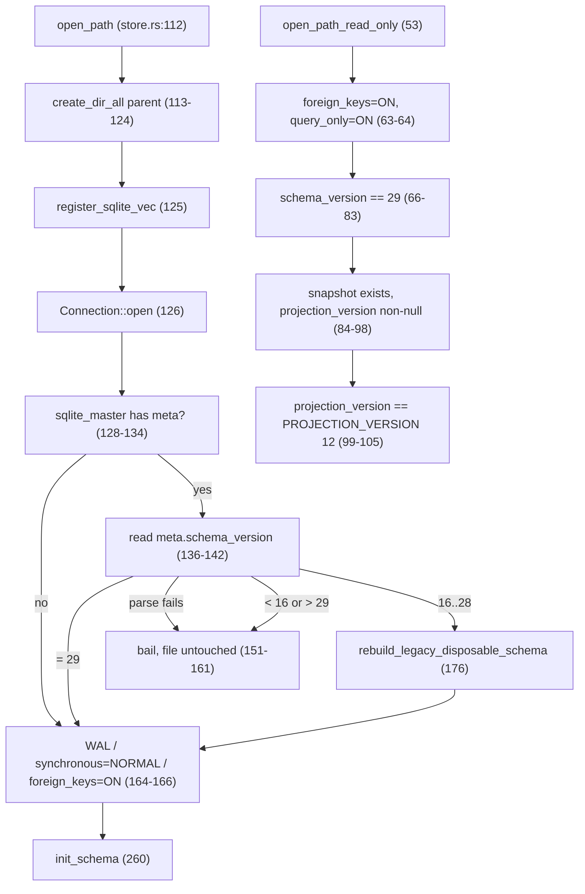
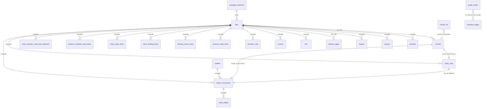
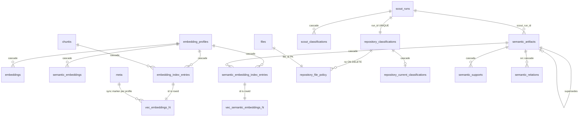

# Storage: SQLite schema, indexes, and vectors

Everything jscout persists lives in one file, `.jscout.db` (`src/store.rs:7`), and one function declares its entire shape: `init_schema` (`src/store.rs:260`) issues 43 `CREATE TABLE IF NOT EXISTS` statements plus 50 index statements in a single `execute_batch`, then creates the FTS5 mirror from a shared constant, then three late indexes, then one conditional `ALTER TABLE`. Two more table families live outside that batch — the `vec0` virtual tables created on demand by `src/embed.rs`, one per embedding dimensionality. The rest of `src/store.rs` is policy around that DDL: two connection openers with different pragma sets and different refusal rules, one migration boundary replacing a per-version ladder, and three reset helpers that draw the line between what a reindex throws away and what it must keep. Each table below is named with the plane it belongs to; the schema moved from v26 to the current v29 in this range.

## Two constants, two openers

`SCHEMA_VERSION` is `"29"` (`src/store.rs:8`); the private `DURABLE_SCHEMA_FLOOR` is `16` (`src/store.rs:9`). Both are compared against the `meta.schema_version` row — there is no migration table and no mtime heuristic. The read opener `open_path_read_only` (`src/store.rs:53`) refuses a non-file path, opens with `SQLITE_OPEN_READ_ONLY`, and applies exactly two pragmas: `foreign_keys=ON` and `query_only=ON` (`src/store.rs:63-64`). It then runs three gates: `meta.schema_version` must equal `"29"` exactly (`src/store.rs:66-83`); `meta.snapshot` must exist and `meta.projection_version` must be non-null (`src/store.rs:84-98`); and that stored projection version must equal `crate::structural::PROJECTION_VERSION`, currently `"12"` (`src/structural.rs:13`), or the open bails (`src/store.rs:99-105`). The reader never creates and never migrates, so an unindexed checkout or a typo'd path fails loudly instead of returning empty result sets that read as real answers. The cost is that a projection-algorithm bump invalidates every reader immediately, including queries that never touch a projection table.

The writer `open_path` (`src/store.rs:112`) creates the database's parent directory when the path has one (`src/store.rs:113-124`) — the change that landed in the baseline commit `4de5622`, which lets a configured out-of-tree database path work. It registers sqlite-vec (`src/store.rs:125`), opens the connection (`src/store.rs:126`), probes `sqlite_master` for `meta` (`src/store.rs:128-134`), and reads the version (`src/store.rs:136-142`). A version below the floor or above `SCHEMA_VERSION` bails before any pragma is applied and before any byte of an existing file is rewritten (`src/store.rs:151-161`), with error text telling the operator to preserve the file if its embedding cache matters. Note the asymmetry the "touches nothing" framing hides: on a *nonexistent* path, `create_dir_all` and `Connection::open` have already produced a directory tree and a zero-byte SQLite file before the version is ever read.

Those five `pragma_update` calls (`src/store.rs:63,64,164,165,166`) are the only ones in non-test code — no `mmap_size`, no `cache_size`, no `busy_timeout`. The writer connection is not fully described by them, though: `src/watch.rs:1314` calls `conn.busy_timeout(...)` immediately after `store::open_path`, so the watcher gets backoff that the MCP writer (`src/mcp.rs:274`) and the checker writer (`src/checker/enrich.rs:384`) do not. `register_sqlite_vec` (`src/store.rs:13-25`) transmutes `sqlite_vec::sqlite3_vec_init` to the C extension-entry signature inside `unsafe` and installs it via `sqlite3_auto_extension` under a `std::sync::Once`; the effect is process-global, so after the first `store::open*` call every subsequent `Connection::open` in the process has `vec0` loaded, including test fixtures that never asked.

Follow the version value through the gate below; the rebuild branch and the bail branch both sit *before* the pragma block.

`MIG` runs entirely before `PRAG`, so `foreign_keys=ON` is not in force during the migration's drops — the children-first drop order there is a convention, not an enforced constraint. `BAIL` is reachable only from `VER`, never after `PRAG`, which is what makes the "unsupported schema" error non-destructive for an existing file. The reader path shares no node with the writer path: `G1`/`G2`/`G3` have no migration escape hatch at all.

## One migration boundary, not a ladder

`rebuild_legacy_disposable_schema` (`src/store.rs:176`) is the whole upgrade story for v16 through v28. It enumerates dynamic sqlite-vec tables from `sqlite_master` with `GLOB 'vec_embeddings_[0-9]*'` plus a `NOT GLOB '*[^0-9]*'` suffix guard, and the same for `vec_semantic_embeddings_`; opens `BEGIN IMMEDIATE`; re-validates each dimension suffix in Rust before interpolating the name into SQL, because a table name cannot be a bind parameter; `DELETE`s — never `DROP`s — each vec0 table, since their rowids are snapshot-local index-entry IDs that are meaningless after a rebuild while the table *shape* stays valid; then executes 35 `DROP TABLE IF EXISTS` statements children-first (`src/store.rs:205-239`); deletes five `meta` keys (`root`, `snapshot`, `projection_version`, `resolution_hash`, `extraction_version`) plus both vector-sync marker prefixes; and stamps `UPDATE meta SET value='29'` (`src/store.rs:246`). Commit or explicit rollback follow.

The rationale is that everything below the floor line is derivable from source, so recomputing it is cheaper to write and to trust than thirteen hand-written upgrade steps, while the durable tables have been shape-stable since v16. The cost is real: upgrading from any of 16..28 forces a full reindex of a monorepo, and a v15 file is refused outright rather than best-effort migrated. Two details in the drop list are worth naming. `checker_input_files` (`src/store.rs:210`) names a table `init_schema` no longer creates — a dead drop. And the drop list is strictly wider than any runtime reset: it discards all five `checker_*` tables, `semantic_embedding_index_entries`, and `repository_current_classifications`. A schema-version upgrade therefore throws away semantic *vector materialization* even though it carefully preserves `semantic_artifacts` and `semantic_embeddings`; `jscout embed --semantic` has to repair that.

The single genuine `ALTER TABLE` in the file is the tail of `init_schema` (`src/store.rs:952-968`): if `pragma_table_info('repository_classifications')` shows no `cited_evidence_json`, add it with default `'[]'`. That column landed mid-review of v20 on a durable table, so drop-and-recreate would have destroyed reconnaissance history.

## The 43 tables

Counted from `init_schema` at `src/store.rs:263-943`. The `Plane` column is the answer to "what survives a reindex": **E** = deleted by `reset_extraction_state`; **S** = snapshot-scoped, deleted only by `reset_snapshot_state`; **C** = checker, deleted only by an explicit retention call; **D** = durable, survives every reset; **E\*** = cleared implicitly by the `files` cascade rather than by an explicit `DELETE`.

| # | Table | Line | Plane | Shape note |
|---|---|---|---|---|
| 1 | `meta` | 263 | D | `(key PK, value)`; the only mixed-plane table |
| 2 | `package_instances` | 267 | S | `canonical_root` UNIQUE, `status IN ('complete','truncated','failed')` |
| 3 | `files` | 281 | E | hub; `path` UNIQUE, `origin IN ('repository','workspace','dependency')` |
| 4 | `chunks` | 292 | E | text + spans + `hash`; `rowid` mirrors into `chunks_fts` |
| 5 | `symbols` | 309 | E\* | absent from the DELETE list; cascades from `files` |
| 6 | `exports` | 325 | E | no PK, indexed on `file_id` |
| 7 | `imports` | 334 | E | no PK, indexed on `file_id` |
| 8 | `contract_exports` | 345 | E | type-only twin of `exports` |
| 9 | `contract_imports` | 354 | E | type-only twin of `imports` |
| 10 | `module_edges` | 362 | E | `from_file` FK'd, `to_file` a plain integer |
| 11 | `refs` | 374 | E | `idx_refs_file_start(file_id, start)` since v28 |
| 12 | `events` | 392 | E | `chunk_id` carries no FK |
| 13 | `member_calls` | 403 | E | receiver/property spans; `chunk_id` carries no FK |
| 14 | `receiver_value_flows` | 426 | E | v28; two-branch CHECK, `UNIQUE(file_id, call_start, call_end)` |
| 15 | `function_return_flows` | 455 | E | v28; `UNIQUE(file_id, function_start, return_index)` |
| 16 | `value_binding_flows` | 471 | E | v28; PK `(file_id, binding_start)` |
| 17 | `class_value_flows` | 482 | E | v28; two all-or-nothing `super_*` CHECKs |
| 18 | `instance_method_value_flows` | 496 | E | v28; PK `(file_id, method_start)` |
| 19 | `class_member_value_flow_blockers` | 504 | E | v28; negative-evidence table |
| 20 | `entity_sites` | 513 | E | `plane IN ('runtime','contract','general')`; `chunk_id` FK `SET NULL` |
| 21 | `entities` | 538 | E | `entity_key` UNIQUE |
| 22 | `entity_occurrences` | 549 | E | `site_id` UNIQUE FK to `entity_sites` |
| 23 | `entity_edges` | 570 | E | `target_key` is a string, not an FK |
| 24 | `embedding_profiles` | 584 | D | `config_fingerprint` UNIQUE, `dimensions` |
| 25 | `embeddings` | 595 | D | PK `(chunk_hash, profile_id)`; content-addressed cache |
| 26 | `semantic_embeddings` | 605 | D | PK `(document_hash, profile_id)` |
| 27 | `embedding_index_entries` | 612 | E | `id` **is** the `vec_embeddings_<d>` rowid |
| 28 | `graph_nodes` | 621 | E | `node_key` TEXT PK; `file_id` has no FK |
| 29 | `resolved_edges` | 636 | E | joins `graph_nodes` by string key |
| 30 | `checker_enrichment_batches` | 659 | C | at most one `active=1` |
| 31 | `checker_project_runs` | 677 | C | `status` gained `'partial'` at v27 |
| 32 | `checker_project_inputs` | 694 | C | composite FK back to `checker_project_runs` |
| 33 | `checker_enrichments` | 705 | C | identity columns deliberately un-FK'd |
| 34 | `checker_occurrence_projects` | 734 | C | one row per project answer, `unknown` included |
| 35 | `scout_runs` | 754 | D | `status` 6 values; one live claim per input |
| 36 | `repository_classifications` | 788 | D | immutable; `run_id` UNIQUE |
| 37 | `repository_file_policy` | 817 | E | `file_id` PK; hard reference into (36) |
| 38 | `repository_current_classifications` | 837 | E | `subject_kind IN ('package','area')` only |
| 39 | `scout_classifications` | 861 | D | PK `(run_id, anchor_key)` |
| 40 | `semantic_artifacts` | 870 | D | self-referencing `supersedes_artifact_id` |
| 41 | `semantic_relations` | 890 | D | `dst_fingerprint` pins the parent's view of the child |
| 42 | `semantic_supports` | 913 | D | no PK; evidence-line CHECKs |
| 43 | `semantic_embedding_index_entries` | 933 | D | `id` **is** the `vec_semantic_embeddings_<d>` rowid |

Adding `chunks_fts` (`src/store.rs:31-36`) makes **44 named persistent tables**. Dynamic `vec0` tables are additional and unbounded: two namespaces times the number of distinct embedding dimensionalities, created by `src/embed.rs:1128` and `src/embed.rs:1168`.

There are 53 explicit indexes — 50 in the main batch, three in the tail batch at `src/store.rs:946-949` covering `files(origin)`, `files(package_instance_id)`, and `module_edges(package_instance_id)`. Three are `CREATE UNIQUE INDEX`, and all three are partial, each encoding a singleton invariant: `idx_checker_one_active_batch ... WHERE active = 1` (`src/store.rs:672`), `idx_scout_runs_active ... WHERE status IN ('running','completed')` (`src/store.rs:778`), and `idx_semantic_artifacts_one_successor ... WHERE supersedes_artifact_id IS NOT NULL` (`src/store.rs:909`). The first is a backstop rather than sole enforcement — `src/checker/enrich.rs:3494` demotes competing batches explicitly before promoting a new one.

## Structural core

`files` is the hub; roughly twenty tables cascade from it. The asymmetries are the thing to look at: which `chunk_id` columns carry a foreign key and which do not.

Three edges in that diagram are dotted because they are not foreign keys at all. `chunks_fts` to `chunks` is convention only — FTS5 is not FK-aware, which is why `delete_file` (`src/store.rs:1120`) removes FTS rows explicitly by `rowid IN (SELECT id FROM chunks WHERE file_id=?)` before letting the `files` cascade run, and why `reset_extraction_state` drops and recreates the table instead of deleting from it. `graph_nodes` to `resolved_edges` joins on `src_key`/`dst_key` strings, so a dangling edge is representable. And `refs.chunk_id`, `events.chunk_id`, and `member_calls.chunk_id` are plain integers with no FK, while `entity_sites.chunk_id` and `entity_occurrences.chunk_id` carry `REFERENCES chunks(id) ON DELETE SET NULL` — an inconsistency, not a design.

The six value-flow tables (14–19) are all span-keyed rather than name-keyed, so an occurrence-specific lookup is a primary-key probe. Their table-level CHECKs encode the extraction contract: `receiver_value_flows` (`src/store.rs:438-446`) makes the `this` shape and the `value` shape mutually exclusive and each fully populated, so a half-populated row is unrepresentable and the absence of a row unambiguously means the extractor gave up (`src/store.rs:423-425`). `function_return_flows` follows the same rule at function granularity: a function appears only when every one of its returns is a supported shape (`src/store.rs:452-454`).

## Semantic, vector, and scouting planes

The relationship worth tracing here is the four-part chain from a cached vector to a searchable one: cache table, index-entry table, vec0 table, and a sync marker in `meta`.

`vec_embeddings_N` is `vec0(embedding FLOAT[N] distance_metric=cosine, profile_id INTEGER PARTITION KEY, origin TEXT PARTITION KEY)`; `vec_semantic_embeddings_N` drops the `origin` partition key because semantic artifacts have no file origin. One table serves every profile at a given dimensionality, hence the `profile_id` partition; the `origin` partition lets an origin-filtered KNN run as one query per requested origin instead of over-fetching and post-filtering. Because `vec0` has no foreign keys, `embedding_index_entries` and `semantic_embedding_index_entries` are regular tables that own materialization identity, and `meta` holds `embedding_index_synced_v1:<profile_id>` and `semantic_embedding_index_synced_v1:<profile_id>` markers. `ensure_vector_table` deletes every marker for a dimensionality *before* publishing a replacement table (`src/embed.rs:1120-1133`), or a reader would treat an empty table as synchronized.

The classification triangle is three tables for one concept because the lifetimes differ: `repository_classifications` is durable and immutable, one row per scout run, with a deliberately snapshot-free `evidence_fingerprint`; `repository_current_classifications` answers "which verdict is current for this membership", true only for one snapshot; `repository_file_policy` is a per-file acceleration rebuilt from fresh, `likely` verdicts only. Two rough edges follow. `repository_file_policy.classification_id` (`src/store.rs:819`) has no `ON DELETE` clause, so a disposable projection holds a blocking NO ACTION reference into durable history. And `repository_classifications.subject_kind` permits `'project'` (`src/store.rs:791`) while `repository_current_classifications.subject_kind` permits only `'package'` and `'area'` (`src/store.rs:840`), so a project-kind verdict can be stored and can never surface in the current projection.

## The FTS5 mirror

`chunks_fts` is defined once as a constant (`src/store.rs:31-36`) precisely because `reset_extraction_state` drops and recreates it and the two definitions must not drift: `fts5(content, name, symbols, path, tokenize="unicode61 tokenchars '_$'")`. The tokenizer setting keeps `my_var` and `$el` as single tokens, which is what JS identifiers need. It is a *standalone* FTS5 table — not `content=''`, not external-content — so chunk text is stored twice, once in `chunks.content` and once inside the index. That doubles the source-text footprint, and it buys `highlight()` working without a contentless-rowid dance, which the G22 exhaustive path depends on.

The column order is load-bearing in two consumers that address columns positionally: `bm25(chunks_fts, 2.0, 4.0, 3.0, 1.0)` at `src/search.rs:998` weights content/name/symbols/path, and `highlight(chunks_fts, 0, ?3, ?4)` at `src/search.rs:1114` hardcodes column 0 as content. Reordering the columns in the constant would silently reweight ranking and highlight the wrong column, with no compile-time or runtime error.

## What a reset destroys and what it keeps

Three helpers, three widths. `reset_extraction_state` (`src/store.rs:1047`) calls `crate::embed::clear_vector_rows`, then issues 25 `DELETE FROM` statements (`src/store.rs:1053-1077`), drops `chunks_fts`, and recreates it from the constant. Its purpose, stated in the doc comment: when an extractor-version change clears every file hash, cascading `delete_file` through tens of thousands of files re-scans the large evidence tables and the FTS index once per file, so truncating wholesale keeps a forced re-index at fresh-index cost. `src/indexer.rs:388-393` picks it when at least half the stored files have empty hashes. `reset_snapshot_state` (`src/store.rs:1091`) is that plus `DELETE FROM package_instances` and removal of four `meta` keys — note it does *not* delete `extraction_version`, which the legacy migration does. `clear_checker_batches` (`src/store.rs:1104`) empties `checker_enrichment_batches`, cascading to all four child tables; `preserve_active_checker_batch_for_watch` (`src/store.rs:1113`) deletes only `active=0` staging rows, keeping the last active batch as a hidden carry source for the next watch generation.

Dropped on reset: everything marked **E** in the inventory — the source-derived plane, the six value-flow tables, the entity plane, `graph_nodes`/`resolved_edges`, `embedding_index_entries`, and the two disposable policy projections. Surviving: `meta` minus its publication keys, `embedding_profiles`, `embeddings`, `semantic_embeddings`, `semantic_embedding_index_entries`, `scout_runs`, `scout_classifications`, `repository_classifications`, the three `semantic_*` tables, and — subject to caller policy, not to these helpers — the five `checker_*` tables.

Three caveats the "truncate children-first" framing hides. `symbols` is not in the delete list at all; it is cleared by the `DELETE FROM files` cascade, the exact per-row cost the helper exists to avoid. The list is not strictly children-first either: `DELETE FROM files` (`src/store.rs:1075`) precedes `resolved_edges` and `graph_nodes`, safe only because `graph_nodes.file_id` (`src/store.rs:627`) has no foreign key. And `clear_vector_rows` (`src/embed.rs:1810`) empties only `vec_embeddings_<d>`, never `vec_semantic_embeddings_<d>` — correctly, since semantic memory is durable — and calls `ensure_vector_table` first, so a reset on a database missing a vec0 table *creates* it before emptying it.

## v26 to v29

Three bumps, and only one of them changed a table.

| Bump | Commit | DDL change |
|---|---|---|
| 26→27 | `434cb1a` | `checker_project_runs.status` CHECK widened to include `'partial'`; nothing else |
| 27→28 | `6a93b0d` | six value-flow tables, three new indexes, `idx_refs_file` → `idx_refs_file_start(file_id, start)`, and the read-only projection-version gate |
| 28→29 | `7626888` | none — only the three version literals |

v27→v28 is where the schema actually grew: the six value-flow tables arrived together, each added to the DDL, to the migration's drop list, and to the reset's delete list. The `idx_refs_file` swap exists so receiver-value projection can resolve a binding by exact source span rather than scanning a file's refs. The same commit added the third read-only gate — comparing stored `projection_version` to `structural::PROJECTION_VERSION` — a class of rejection that did not exist at v26.

The v28→v29 bump contains zero DDL change; reading the schema diff alone would suggest it is a no-op. It exists to force a rebuild of `chunks_fts` row *content*, because `src/indexer.rs` gained `fts_content()` (`src/indexer.rs:676-685`), which replaces embedded NUL bytes with spaces. FTS5 indexes text after an embedded NUL, but `highlight()` could omit the bytes between that NUL and a later match, which broke the G22 exhaustive locator's absolute match lines. Since the fix lives in what gets written rather than in what the table looks like, the only way to invalidate stale rows was a version bump. The version literal `29` appears three times — `src/store.rs:8`, `:246`, `:264` — and a bump that misses the migration `UPDATE` would leave migrated databases stamped at the old value, re-entering migration on every open.

## Pinned reads

`with_read_snapshot` (`src/store.rs:974`) wraps a multi-statement read in a named `SAVEPOINT`, releasing on success and `ROLLBACK TO … ; RELEASE` on error. Savepoints rather than `BEGIN` because they nest — search expansion calls neighborhood traversal, and both want a pinned snapshot — and a savepoint that writes nothing works on a `query_only` connection. There are eight call sites but only seven distinct names: `src/scouting/plan.rs:70` and `src/scouting/plan.rs:1448` both pass `"jscout_scout_plan"`; the rest are `jscout_search` (`src/search.rs:1636`), `jscout_neighborhood` (`src/structural.rs:2479`), `jscout_repository_overview_pack` (`src/surface.rs:590`), `jscout_semantic_query` (`src/semantic_query.rs:530`), `jscout_card_plan` (`src/scouting/plan.rs:264`), and `jscout_concept_plan` (`src/scouting/plan.rs:608`).

## Limits

Two lists must stay in sync with the DDL by hand — the 35 drops and the 25 deletes — and a table added to `init_schema` without being added to both silently survives a reset it should not. There is no `VACUUM`, no `ANALYZE`, and no `INSERT INTO chunks_fts(chunks_fts) VALUES('optimize')` anywhere in the crate, so a repeatedly reset database keeps its high-water page count and an unmerged FTS b-tree, and the query planner runs without table statistics. Checker facts store `source_file`, `source_hash`, and six raw span integers instead of foreign keys (`src/store.rs:657-658`: a projection rebuild must not cascade through canonical checker facts), which makes a retained batch re-validatable against a snapshot in which no old row ID exists — at the price of no database-level guarantee that a `member_call_id` still refers to anything.

Coverage in `src/store.rs` is 13 `#[test]` functions (`src/store.rs:1163-1641`), 478 test lines against 1162 production lines. A shared `index_columns` helper (`src/store.rs:1173`) reads `pragma_index_info` in seqno order, making index *column order* a directly asserted contract. The refusal tests are the load-bearing ones: `read_only_open_never_creates_or_migrates_an_index` (`src/store.rs:1181`) asserts a missing file is not created and a v14 database is rejected by both openers with its version string unchanged; `genuine_v15_embedding_schema_is_rejected_without_mutation` (`src/store.rs:1348-1389`) reopens a real v15 embedding-cache shape and checks its row count and `model`/`dim` columns survive the refusal; `writer_open_creates_a_missing_database_parent` (`src/store.rs:1214`) pins the baseline commit's asymmetry; and `v28_fts_mirror_requires_writer_rebuild` (`src/store.rs:1442`) stamps a seeded database back to 28 and asserts the migration leaves zero chunks and zero `chunks_fts` rows.
