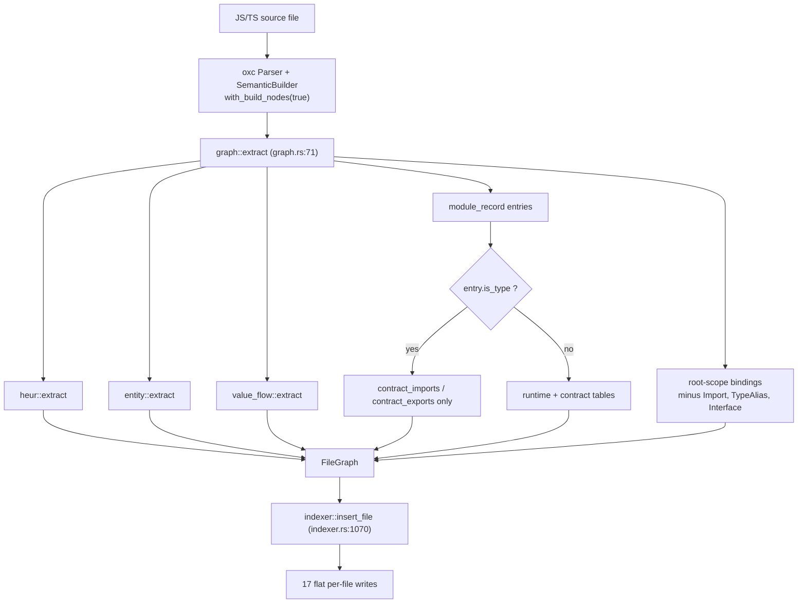
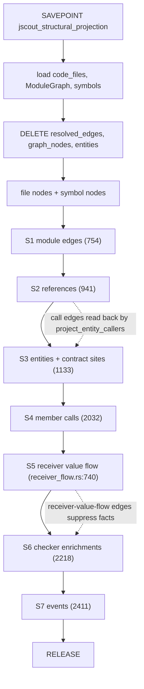
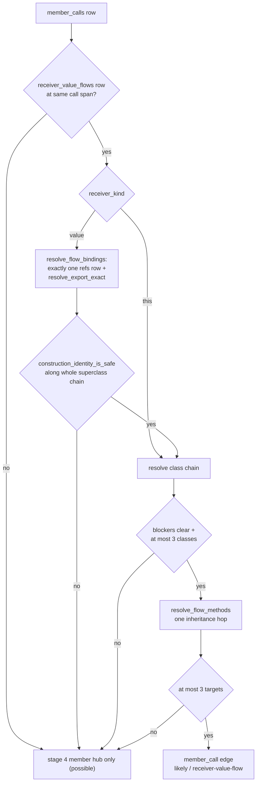

# Structural extraction, projection, and value flow

jscout turns each JavaScript/TypeScript file into flat, source-local rows — symbols, imports, exports, references, member calls, events, entity sites, value flows — using exactly one oxc parse, and then resolves those rows against the repository-wide module graph into a disposable `graph_nodes` / `resolved_edges` traversal graph. The split is deliberate: extraction knows nothing about any other file and can be cached per file hash, while projection is rebuilt when its code-bound inputs change. Rust is also in the code corpus, but follows its own lexical extractor and per-format contract rather than this oxc structural path. Layered on top are TypeScript's separate contract plane and a bounded value-flow pass that proves receiver identity for a minority of member calls.

## The two halves and their version constants

JavaScript/TypeScript extraction runs inside `parse::with_parsed`, which parses with oxc — JSX forced on for every JavaScript source type — and builds `Semantic` with `with_build_nodes(true)` because reference classification walks node ancestors. `graph::extract` is the ECMA entry point selected by `indexer::extract_file`. It reads oxc's `module_record` directly for imports and exports and calls `heur::extract`, `entity::extract`, and `value_flow::extract`. The result is one owned `FileGraph` which `indexer::insert_file` flattens across the source-local structural tables. None of those extractor modules mentions `rusqlite` or another file's contents.

Projection is `structural::rebuild_projection_with_timing` (`src/structural.rs:508`). The two halves carry separate version constants because they change at different rates:

| Constant | Value | Location | Bump invalidates |
| --- | --- | --- | --- |
| `entity::EXTRACTION_VERSION` | `"7"` | `src/entity.rs:14` | JavaScript and TypeScript format contracts; changing it reparses those rows and invalidates the code projection |
| `structural::PROJECTION_VERSION` | `"12"` | `src/structural.rs:13` | Only the disposable graph, via the snapshot digest |

`EXTRACTION_VERSION` lives in `entity.rs` but governs the JavaScript and TypeScript per-file outputs, value flow included, and is hashed into the code digest through those format contracts. Rust has a separate extractor-version marker and edition context; documentation has its own format contracts.

Look at the `FORK` node and at `SYMS`: those two are the entirety of type erasure at the row level. Everything else in the diagram is shape-preserving.

## Type erasure and the contract plane

TypeScript is dropped from the runtime plane at five mechanical points in `src/graph.rs`. Import entries are pushed into `contract_imports` unconditionally but into `imports` only when `!entry.is_type` (88-91). The same split governs local exports (117-124), indirect re-exports (146-150), and star exports (171-174). Root bindings whose symbol flags intersect `TypeAlias | Interface` are skipped entirely (254-256) — and so is any binding flagged `Import`, which never becomes a symbol node at all (`if !is_import`, 248). Resolved references whose `flags().is_type_only()` are skipped (274-278). The comment on `FileGraph.contract_imports` states the reason bluntly: the contract vectors are kept separate "so they cannot affect call projection" (`src/graph.rs:55-57`).

Erased does not mean lost. `entity::extract` receives `exported_contract_locals` — the *type-inclusive* export set (`src/graph.rs:176`) — so exported-signature extraction still sees type-only exports, and `EntityVisitor` re-emits the type layer as contract-plane entity sites. Projection then quarantines that plane. `project_contract_site` (`src/structural.rs:1513`) stamps `"documentary": true` into the entity meta, the occurrence detail, and the edge detail, and no contract edge kind appears in `workflow_direct_kind` (3095), `workflow_general_association_kind` (3099), or `workflow_runtime_boundary_kind` (3113), so workflow traversal cannot step through one. Contract sites also resolve through their own export chain, `ModuleGraph::resolve_contract_export_traced` (`src/query.rs:251`), documented as keeping type-only bindings from influencing runtime reference projection.

The contract plane is a full second projection path, not a flag on the first: it has its own catalog (`ContractCatalog`, `src/structural.rs:67`), its own target resolver (`resolve_contract_targets`, 1718), its own node key spaces (`contract_definition_key` 3749, `contract_reference_key` 3757), and five of its own edge kinds. The cost is real duplication — a symbol that is both a runtime class and a contract schema appears twice in the node inventory, and two export-resolution implementations must be kept in step.

## Entity site inventory

`EntitySite` (`src/entity.rs:17`) is deliberately flat: plane, entity type, role, identity kind (`literal` or `reference`), identity name and byte offset, optional target name and offset, span, extractor, provenance, confidence, and a free-form JSON detail. Extraction records *where evidence sits and which recognizer fired*; grouping sites under snapshot-canonical entities is projection's job. The `entity_sites` table pins the vocabulary with CHECK constraints on plane, identity kind, and confidence (`src/store.rs:657`).

| Plane | Entity type | Role(s) | Extractor(s) | Confidence |
| --- | --- | --- | --- | --- |
| runtime | `registry` | `registered_handler`, `dispatch_site` | `twenty-define-logic-function`, `twenty-logic-function-dispatch` | likely |
| runtime | `data_lifecycle` | `lifecycle_listener`, `lifecycle_producer` | `twenty-database-event-trigger`, `graphql-mutation-lifecycle` | likely |
| runtime | `job` | `job_handler`, `job_producer` | `queue-cron-call`, `queue-worker-constructor`, `job-handler-decorator` | likely |
| runtime | `di_token` | `provider`, `injection_site` | `di-provider-object`, `di-inject-decorator` | likely |
| general | `route` | `route_handler` | `http-router-call`, `http-route-decorator` | likely |
| general | `graphql_operation` | `graphql_operation`, `graphql_handler` | `graphql-client-operation`, `graphql-operation-decorator` | likely |
| general | `environment_variable` | `environment_read` | `environment-api-call`, `process-env-member`, `process-env-computed-member` | likely |
| general | `config_key` | `config_read` | `configuration-api-call` | likely |
| general | `feature_flag` | `feature_flag_check` | `feature-flag-call` | likely |
| general | `database_resource` | `database_read`, `database_write`, `database_acquire` | `database-api-call` | likely |
| general | `external_host` | `external_host_call` | `static-url-call` | likely |
| contract | `interface`, `type_alias`, `enum` | `contract_declaration` | `contract-declaration` (provenance `type-declaration`) | certain |
| contract | `schema` | `contract_declaration` | `contract-declaration` (provenance `validation-schema-pattern` / `dto-schema-pattern`) | likely |
| contract | `reference` | `parameter_contract`, `return_contract`, `contract_reference` | `typescript-contract-reference` (provenance `type-syntax`) | certain |
| contract | `decorator` | `decorator_use` | `decorator-contract` (provenance `decorator-syntax`) | certain |

Trust is assigned by the push helper, not by the recognizer: `push_general` hardcodes `confidence: "likely"` for every framework and convention recognizer (`src/entity.rs:150`), while `push_contract_references` hardcodes `"certain"` (203) because a type annotation *is* the syntax it claims to be. `push_contract_declaration` takes trust as a parameter (176-177), which is how interfaces land at `certain` and Zod/DTO schema guesses at `likely`. `TypeReferenceVisitor` drops 27 builtin wrappers (`is_builtin_contract_wrapper`, `src/entity.rs:1121`) and any in-scope type parameter, so `Promise<User>` yields exactly one reference.

## The confidence lattice

Three levels, ranked by `confidence_rank` (`src/structural.rs:3710`) and weighted by `confidence_weight` (3440):

| Level | Rank | Weight | Meaning in practice |
| --- | --- | --- | --- |
| `certain` | 2 | 1.0 | Syntax or an exact resolver chain proves it |
| `likely` | 1 | 0.6 | A named convention fired, or a hop went through inference |
| `possible` | 0 | 0.3 | Name match or ambiguous fan-out; honest guesswork |

`lower_confidence` (`src/structural.rs:2018`) is the meet, applied on the entity and contract paths so a projected edge is never more confident than any input it composed. `project_references` downgrades inline instead of calling it: ambiguous root targets fan out one `possible` edge per candidate with provenance `semantic+resolver-candidate`, and a workspace-inferred module hop or export chain drops `certain` to `likely` with provenance `semantic+resolver-inferred` (1086-1099). Whole planes are pinned by construction — member-name-match edges are always `possible` (2100, 2118), string-event edges always `possible` (2481), receiver value-flow edges always `likely` (`src/structural/receiver_flow.rs:926`). Traversal applies a blunter gate on top: workflow logical steps drop any incident edge below `likely` before kind dispatch (2806).

## Projection: seven stages inside one savepoint

`rebuild_projection_with_timing` opens `SAVEPOINT jscout_structural_projection` rather than `BEGIN IMMEDIATE`, so projection replacement is atomic both standalone and inside the indexer's outer publication transaction. It loads files, the module graph, and symbols; deletes `resolved_edges`, `graph_nodes`, and `entities`; inserts file and symbol nodes; and runs seven projection stages. It does not publish identity metadata. Success releases the savepoint; error rolls back to it and re-raises. The three loads happen inside the savepoint, so the write lock is held across them.

The two dotted arrows are the load-bearing orderings. `project_entity_callers` (1969) queries `resolved_edges WHERE kind='call'` — rows that exist only because S2 already ran — to collapse producer helpers into `produces_lifecycle_via` / `produces_job_via` edges. And S6 pre-scans `resolved_edges` for `provenance='receiver-value-flow' AND confidence='likely'` (2228-2235) and skips any checker fact whose `member_calls` rowid is in that set (2322); running S5 after S6 would emit two `member_call` edges for one call site.

Eight node kinds are minted: `file` (540), `symbol` (552), `package` (831, 880), `entity` (1236), `contract` (1601), `member_hub` (2080), `event_hub` (2439), `event_site` (2451). Symbol keys are `sym:{path}#{scope}::{name}@{ordinal}` (`symbol_key`, 3819) with the ordinal assigned positionally after a re-sort by path, scope, name, `decl_start`, and finally rowid (`load_symbols`, 697-736).

## Edge kind inventory

| Stage | Kind | Confidence | Provenance |
| --- | --- | --- | --- |
| S1 | `contains_module` | certain | `dependency-index` |
| S1 | `import` / `imports_types` | certain, or likely when workspace-inferred | `resolver`, `workspace`, `workspace-inferred`, and `type-` prefixed variants |
| S1 | `imports_package` / `imports_package_types` | same as the import it accompanies | same |
| S2 | `call`, `render`, `extend`, `use`, `reexport` | certain; likely if inferred; possible if ambiguous | `semantic+resolver`, `+-inferred`, `+-candidate` |
| S3 runtime/general | `dispatches`, `produces_lifecycle`, `produces_job`, `injects`, `invokes_graphql`, `reads_env`, `reads_config`, `reads_resource`, `writes_resource`, `acquires_resource`, `checks_flag`, `calls_host` | site confidence | the site's own provenance |
| S3 runtime/general | `registered_handler`, `lifecycle_listener`, `job_handler`, `provides`, `handles_route`, `handles_graphql` | meet of site confidence and target ambiguity | site provenance, or `registration-site-fallback` / `provider-site-fallback` |
| S3 collapse | `produces_lifecycle_via`, `produces_job_via` | meet of occurrence and call confidence | `entity-boundary-collapse` |
| S3 contract | `declares_contract`, `accepts_contract`, `returns_contract`, `decorated_by`, `references_contract` | site confidence | site provenance, `documentary: true` in detail |
| S4 | `member_candidate`, `member_call` | possible | `member-name-match` |
| S5 | `member_call` | likely | `receiver-value-flow` |
| S6 | `member_call` | site confidence, forced to possible on any failed project | `checker` |
| S7 | `contains_event` | certain | `syntax` |
| S7 | `emits`, `listens` | possible | `string-event` |

Two behavioral notes that a kind table alone hides. `handles_route` carries a full `relation_weight` of 1.0 (3449) but appears in *none* of the three workflow kind tables, so HTTP route registrations rank highly in neighborhood queries yet are invisible to workflow traversal. And `resolved_edges.source_ref_id` is overloaded: S2 writes a `refs.id` (1124), while S5 (`receiver_flow.rs:929`) and S6 (2391) write a `member_calls` rowid. The S6 suppression scan works only because it also filters on provenance.

Projection is not uniformly conservative about targets. `project_references` genuinely emits nothing when zero targets resolve (1083). But `project_member_calls` looks each property up in `candidates_by_name` — a repo-wide symbol-name index (2040-2049) — and mints a `member_candidate` edge to every same-named symbol anywhere in the repo, which is target invention by name alone, made honest only by the `possible` label and the `member:unknown:{prop}` hub that makes the ambiguity structurally visible. And in `project_entities`, a registration or provider site whose target does not resolve substitutes the site's own source symbol as the target (1365-1375) rather than emitting nothing; only inline route and GraphQL handlers from non-decorator extractors are dropped outright (1348-1360), leaving the route findable but not traversable.

## The bounded receiver value-flow pass

Member calls are the densest ambiguity in the graph, and stage 4's answer — a hub with N `possible` candidates — is deliberately weak. The value-flow pass exists to convert a minority of those call sites into a single proven target. Extraction (`src/value_flow.rs:82`) records only closed lexical shapes, and refuses everything else:

- **File-wide bailout.** If any `WithStatement` node or any `eval` identifier reference exists anywhere in the file, `extract` returns `ValueFlows::default()` (87-93). A dynamic environment can redirect bindings the semantic model associates with a lexical root, including inside nested functions, so a site-local bailout would be unsound. One `eval` costs the whole file.
- **`this` receivers.** `enclosing_instance_class` (668) accepts `this` only inside a non-static, non-decorated method or instance field of a named class; a nested ordinary function has its own `this` and terminates the walk.
- **Value receivers.** `value_from_expression` (737) accepts `new C()`, a non-optional call (as a `factory`), a `const` binding whose initializer is itself supported, and an import specifier (as a `binding`). It refuses `await` outright (754) with the comment that thenable assimilation means `await new C()` does not prove a `C`, and refuses any symbol that is mutated or has member writes (758-760).
- **Class safety.** A class is excluded if it is `declare`, carries runtime decorators, has a returning constructor, or is a mutated symbol (163-175). Instance properties, accessors, parameter properties, computed keys, getters, setters, and `this.x =` writes all become entries in `blocked_instance_members`, with `"*"` meaning any computed member (191-262).
- **Factories.** `function_returns` (577) yields a summary only when the body's last statement terminates and every return value is itself supported; one unsupported return suppresses the whole summary.

Every output vector is sorted before it leaves extraction (101-112). The `receiver_value_flows` table enforces the two disjoint row shapes with a SQL CHECK — a `this` row carries class identity and no value fields, a `value` row carries value identity and no class fields (`src/store.rs:582-590`) — and the table comment states the reading rule: absence means the extractor deliberately gave up, and projection never fills a missing fact by name alone (`src/store.rs:567-569`).

Projection finishes the job in `src/structural/receiver_flow.rs`. `resolve_flow_bindings` (182) requires *exactly one* `refs` row at the target byte offset, enforces that a `member` target came through a namespace import and an `identifier` target did not (210-217), refuses workspace-inferred module edges, and resolves through `ModuleGraph::resolve_export_exact` (`src/query.rs:151`) — a stricter resolver that returns `Some` only for a single candidate and refuses heuristic edges and ambiguous `export *` branches. Its doc comment names the reason: this stage suppresses a later checker pass and therefore needs a closed binding, not the graph's best structural candidate. `resolve_export_exact` has exactly one caller, at `receiver_flow.rs:230`.

Follow the `HUB` node: every refusal path lands on the same place, the stage-4 hub, so a failed proof degrades to ordinary ambiguity rather than silence. Note also that the `F` gate is skipped entirely for `this` receivers (`receiver_flow.rs:851`), so `this.method()` inside a class extending a mixin call still projects while the same class constructed as a value does not.

The caps are hard and small: at most 3 receiver classes (282, 497, 572), at most 3 method targets (685, 729), factory and binding recursion depth at most 2 (442), and cycle-visited sets on every recursive walk. Superclass chains are walked to a root with no superclass and blocker sets are checked along the entire chain (`class_chain_allows_property`, 359), but method inheritance itself resolves only one hop (655-732) — a method defined two levels above the receiver class yields nothing.

What the pass cannot resolve, stated plainly: anything awaited, optional calls, computed members, object-literal receivers, values not bound at root scope, async factories, mixin superclasses, classes with runtime decorators or returning constructors, any class whose symbol is mutated, and any binding whose export chain is heuristic or ambiguous. `extract_functions` additionally skips any root-scope function name declared more than once (468-503), so one sloppy-mode block-scoped redeclaration disables the factory summary for that whole name.

## Why value flow excludes occurrences from the checker plan

A `likely` receiver-value-flow edge is a *closed* answer, not a lead, which is why the exclusion downstream is unconditional. Stage 5 writes `source_ref_id = member_calls rowid` on every edge it emits (`receiver_flow.rs:929`). `checker::enrich::load_occurrences` (`src/checker/enrich.rs:1099`) runs a query at 1109 collecting every `source_ref_id` from `resolved_edges WHERE confidence='likely' AND provenance='receiver-value-flow'` and marks those occurrences `value_flow_resolved`. `select_eligible` (1196) then filters them out at 1204 with `!occurrence.value_flow_resolved` — unconditionally, ahead of every other predicate. The adjacent line 1205 gates `deterministically_resolved` behind `options.include_all`; `value_flow_resolved` has no such escape hatch, so `--include-all` cannot bring a value-flow-resolved call site back into the checker plan. Stage 6 enforces the same decision from the other side, dropping stale checker facts for those occurrences (2322).

Stage 6 has more gates than the pre-scan. The driving query requires `batch.source_snapshot=?1` (2255), `run.status IN ('completed','partial')` (2259), `source.hash=enrichment.source_hash` (2261), and all six byte offsets to match the live `member_calls` row (2263-2269). Past the query, a `checker_occurrence_coverage` entry must exist (2325) — itself requiring a matching run status and file hash (2176-2185) — the target fingerprint must match (2328-2332), and the current path must equal the recorded one (2336). Any failed project forces the projected confidence down to `possible` (2367-2369).

## Snapshot identity and the limits of determinism

`publication::compute_code_digest` now owns structural identity. Under a code-specific domain it hashes `PROJECTION_VERSION`, the code extraction contract and persisted marker, active code-format contracts, optional Rust edition context, every `files` row with `corpus='code'` plus joined package identity, and the module-resolution hash. Documentation contracts and rows are absent. `structural::current_snapshot` is retained as the public code-facing name but delegates to `publication::current_code_digest`.

Structural projection reads the `code_files` view, and `ModuleGraph` does the same, so documentation rows never become graph nodes or participate in export resolution. Some projection queries still join raw `files`; doc rows are excluded by downstream membership in the code-file map rather than by each SQL predicate. Editing one `.md` file rotates the documentation and provenance components and their fold but not the code digest, so it does not force projection rebuild or evict checker edges solely because prose changed.

The rebuilt graph is also not byte-deterministic. `load_files` runs `SELECT id, path FROM code_files ORDER BY path` but collects into a `HashMap<i64, String>` (686-695), and the file-node insertion loop iterates that map directly (`for (file_id, path) in &files`, 539). Rust's `HashMap` iteration order varies per process, so the row order and assigned rowids of file nodes are not reproducible across runs. The *set* of rows is deterministic; symbol nodes are fine, since `load_symbols` re-sorts by path (719-723). Relatedly, the package lookup query in `project_module_edges` (957-963) carries no `ORDER BY`, harmless only because it fills a map.

## Remaining sharp edges

`EntityVisitor.static_strings` is file-global and single-pass (`src/entity.rs:49-52`), so a constant declared *after* its use site does not fold — `router.get(ROUTE, h)` above `const ROUTE = '/x'` yields no route site. `classify_reference` walks at most five ancestors (`src/graph.rs:336-345`), so a reference wrapped in deeper expression scaffolding falls through to `use` even when it is really a call. `graph_degree` (3431) counts every `resolved_edges` row regardless of plane, so a heavily-typed symbol looks like a hub even when none of that degree is runtime; workflow steps compensate by pinning `hub_floor = 1.0` (2817) with a comment saying exactly that. The `projected_edges` dedupe set (1155, keyed by source/target/kind) covers only the runtime and general arms of `project_entities` — `project_contract_site`'s insert is guarded only by `source != entity_key` (1677), and stage 5 does not dedupe across occurrences, so repeated sites in one symbol each add a row and inflate degree. Decorator sites attach forward to the next declaration only for three extractors and only within 512 bytes (`site_source_symbol`, 1693-1715). And symbol ordinals are positional, so inserting a second same-named symbol earlier in a file shifts every later ordinal and can silently rebind a stored anchor.

Testing sits almost entirely at the integration level. There is no unit-test module in `value_flow.rs`, `graph.rs`, or `heur.rs`; `src/entity/tests.rs` holds 10 recognizer unit tests that parse a source string and assert on the returned `Vec<EntitySite>`, and `src/structural/tests.rs` holds 39 tests that build a real temp repo, run `indexer::index_repo`, and assert on the projected graph. Fifteen of those are `receiver_value_flow_*` cases and function as the specification for the bounded pass — each acceptance shape and each refusal above has a named test, including the three-class accept / four-class reject boundary and removal of an edge when a `const` becomes unsupported. `src/checker/enrich/tests.rs:2621` asserts the value-flow suppression query; `src/indexer/tests.rs:1917` asserts the extracted `receiver_value_flows` rows; and `snapshot_hashes_file_corpus_and_parser_format` (`src/structural/tests.rs:56`) mutates `files.format` and `files.corpus` directly and pins three distinct digests apart.
