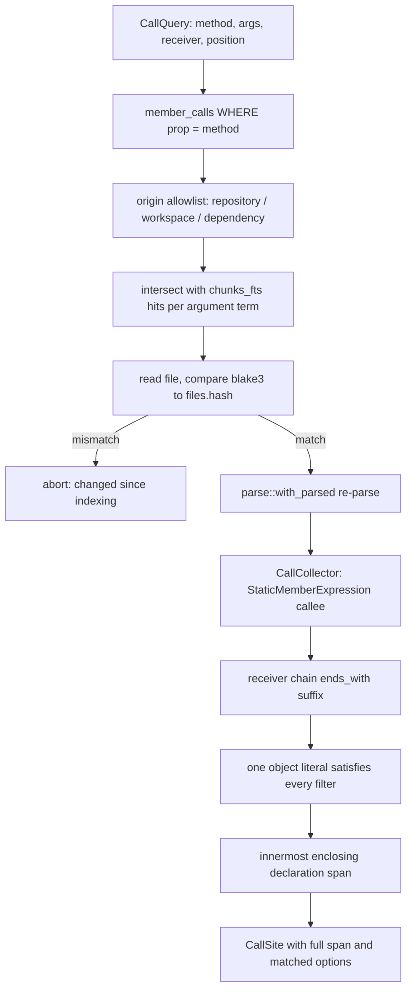
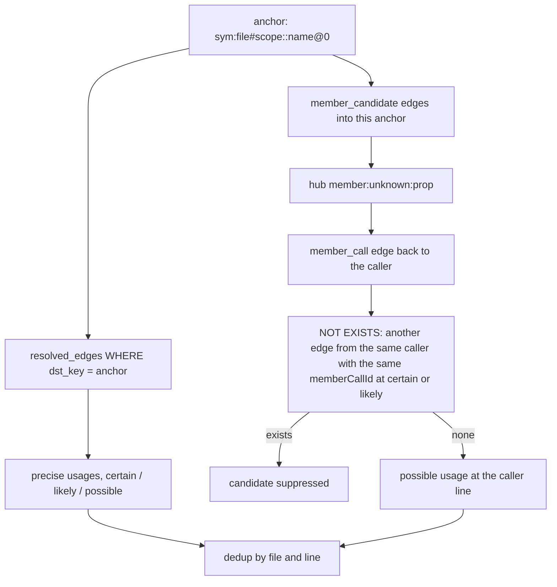
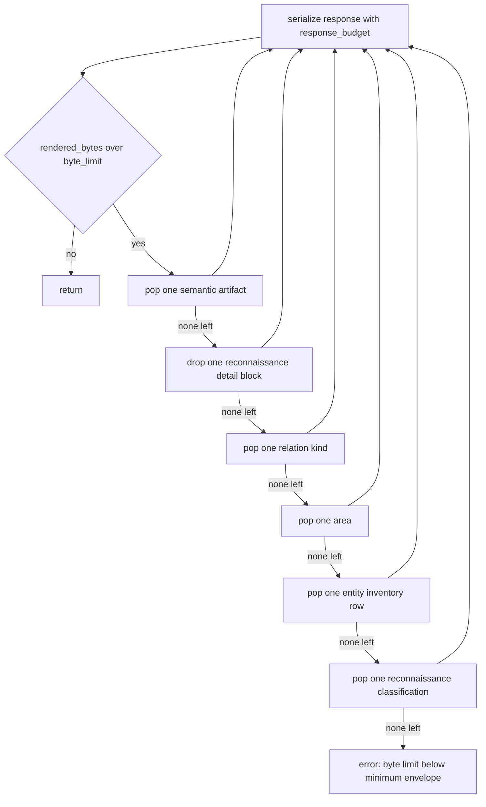

# Call graph, queries, and the agent read surface

Three modules sit between the projected graph and whatever an agent actually reads. `src/calls.rs` answers "where is this method called with these options" by treating the index as a filter and the working tree as the source of truth: it narrows candidate files with SQL, then re-parses each one so every answer carries a real `CallExpression` span. `src/query.rs` holds the module graph in memory, follows export chains through barrels and star re-exports, and turns a symbol or an anchor into a list of usages with explicit confidence. `src/surface.rs` renders two bulk views — an entity lookup and a repository overview — and, in the overview's case, sheds content in a fixed order until the serialized JSON fits a byte limit. Each of the three makes a different bet about precision: `calls` refuses to answer from the index alone, `query` ships two export resolvers with deliberately different tolerance for ambiguity, and `surface` accepts lossy truncation as long as the loss is counted.

| Module | Lines | Reached from | Reads |
| --- | --- | --- | --- |
| `src/calls.rs` | 608 | `jscout calls` (`src/commands/core.rs:331`), MCP `calls` (`src/mcp.rs:1379`) | `member_calls`, `chunks_fts`, `graph_nodes`, plus the files on disk |
| `src/query.rs` | 799 | `who_uses`, `events`, symbol resolution (`src/commands/core.rs:421`, `src/mcp.rs:1203`), projection (`src/structural.rs:518`) | `exports`, `contract_exports`, `module_edges`, `code_files`, `refs`, `member_calls`, `resolved_edges` |
| `src/surface.rs` | 1110 | MCP `entities` (`src/mcp.rs:1401`), `repository_overview` (`src/mcp.rs:1474`), `jscout overview` (`src/commands/mod.rs:514`) | `entities`, `entity_occurrences`, `code_files`, `resolved_edges`, `semantic_artifacts`, `repository_current_classifications` |

## `calls`: the index narrows, the parser decides

`calls::query` (`src/calls.rs:101`) runs four stages before it believes anything. First, `candidate_files` (`src/calls.rs:178`) selects distinct files that hold at least one `member_calls` row whose `prop` equals the method name, joined to `package_instances` so a dependency file can be reconstructed as `canonical_root + package_path` rather than `root + path` (`src/calls.rs:214-222`). Second, `fts_file_ids` (`src/calls.rs:236`) intersects that set with the files whose indexed chunks contain every usable argument token — one FTS5 `MATCH` per term, intersected per *file* and not per chunk, because a key and its value can legitimately land in different chunks of the same file (`src/calls.rs:233-235`). Terms without an alphanumeric character are dropped, and each term is double-quoted with internal quotes doubled so operator syntax cannot leak into the MATCH expression (`src/calls.rs:244`).

Third comes the drift gate. Each candidate file is read from disk and its blake3 hash compared against `files.hash`; a mismatch aborts the whole query with "changed since indexing" (`src/calls.rs:119-124`). Fourth, the file is parsed again through `parse::with_parsed` (`src/parse.rs:26`) and walked by `CallCollector` (`src/calls.rs:299`).

The re-parse is the point of the module. `member_calls` rows carry spans and a receiver chain, but not argument structure; matching `--arg merge=replace` against a *stored* row would mean matching text, and matching text against a multiline call means guessing which lines belong to it. By re-parsing, every match reports the complete `CallExpression` span (`src/calls.rs:307`), and evidence joins by containment: the anchor is the declaration whose `graph_nodes.meta_json.declaration` span (`src/structural.rs:563`) contains the call span and is smallest — the innermost enclosing declaration (`src/calls.rs:144-148`). `end_line` is computed from `span[1].saturating_sub(1)` so it names the line of the call's last byte rather than the line after it (`src/calls.rs:152`). The regression test writes a call whose matched option literal sits ten lines below the callee and asserts the reported range is `(2, 12)` (`src/calls.rs:477`).

Note that `HASH` sits before `PARSE`: no answer is ever produced from a file whose bytes differ from the indexed hash. Note also that `IDX` and `FTS` only ever *shrink* the set — neither can add a call site the index missed.

Matching is intentionally narrow. `CallCollector::visit_call_expression` requires the callee to be an `Expression::StaticMemberExpression`, so computed calls (`obj['insert']()`) and bare calls (`insert({...})`) never match; the test asserts the bare `insert(...)` in the same file is excluded (`src/calls.rs:466-467`). The receiver comes from `heur::member_path` (`src/heur.rs:295`), which builds a dotted chain from identifiers, `this`, and static members only — a call on a call result yields `None`, and `--receiver` then rejects it (`src/calls.rs:323-325`). `--arg` filters must all match top-level properties of *one* object literal (`src/calls.rs:359`), and a value comparison only succeeds against literal text: strings unquoted, numbers as written, `true`/`false`/`null` spelled out, and templates only when they have no interpolations (`src/calls.rs:397-414`). A key with no `=` matches on presence regardless of the value's shape.

Two limits are worth stating. `files_scanned` reports `files.len()` (`src/calls.rs:170`) — the candidate count after narrowing, not the number of files actually read, since the loop breaks as soon as `limit` matches accumulate (`src/calls.rs:162-164`). And the drift gate only covers candidates: a file edited to *add* a call that has not been indexed yet is never a candidate, so it is silently missed rather than reported as stale. `jscout calls` is the only query in this group that touches the working tree at all.

## Export chains: two resolvers, two appetites for risk

`ModuleGraph::load` (`src/query.rs:25`) pulls `exports`, `module_edges`, and `code_files` into hash maps; `load_with_contracts` (`src/query.rs:32`) additionally pulls `contract_exports`, and exists so runtime-only consumers such as `who_uses` do not pay to scan a documentary plane they cannot use. Each edge stores `(Option<target>, bool)` where the bool records that `module_edges.resolution` was `workspace-inferred` (`src/query.rs:88`) — the heuristic mapping from a package name to a workspace directory, which the projection is never allowed to call `certain`.

The permissive resolver is `resolve_export_inner` (`src/query.rs:267`). It walks exact export entries first, returning `(file, local_name)` for a local export, `(file, "default")` for a default export with no local binding, and recursing through `from_request` for a re-export; `export * as ns from` returns the namespace pseudo-name `"*"` (`src/query.rs:292-295`). Failing an exact hit, it tries each `export *` source in table order and returns the first branch that succeeds, restoring the `inferred` flag before moving on so a failed branch cannot taint a later success (`src/query.rs:301-318`). Cycles terminate via a shared `visited` set.

The strict resolver is `resolve_export_exact` (`src/query.rs:151`), and its whole reason to exist is that one caller — `receiver_flow::resolve_flow_bindings` (`src/structural/receiver_flow.rs:230`) — mints an edge that *suppresses* a later checker pass, so it needs a closed binding rather than the graph's best guess. It returns a three-state `ExactExportResolution` (`src/query.rs:324`) and accepts an answer only when the candidate set has exactly one member (`src/query.rs:153-155`).

| Behaviour | `resolve_export` / `_traced` | `resolve_export_exact` |
| --- | --- | --- |
| Ambiguous `export *` sources | first branch that resolves wins (`src/query.rs:303-318`) | every branch explored on a cloned `visited`; more than one distinct result yields `None` (`src/query.rs:224-246`) |
| `workspace-inferred` edge | followed; sets the `inferred` flag (`src/query.rs:289-291`) | `Unsafe`, resolution abandoned (`src/query.rs:191-193`, `229-231`) |
| Missing module edge | branch fails, others still tried | `Unsafe` (`src/query.rs:194-196`) |
| Cycle | that branch returns `None` | `Unsafe` — poisons the whole resolution (`src/query.rs:168-170`) |
| `default` through `export *` | followed | refused: `export * from` never re-exports a default (`src/query.rs:217-222`) |

That last row is a real asymmetry, not just a tuning difference. The permissive path has no `default` guard, so a default import routed through a barrel's `export *` can be attributed to the target module's default export even though ECMAScript does not re-export it. The consequence is confined to `who_uses` output, where a spurious usage is a listed line an agent can check; the strict path, whose result silences a downstream checker, refuses it.

`resolve_contract_export_traced` (`src/query.rs:251`) runs the same permissive walk over the `contract_exports` map, keeping type-only bindings from influencing runtime reference projection while still letting the contract plane resolve its own chains.

## `who_uses`: exact edges first, then name-shaped guesses

Two entry points exist. `who_uses_anchor_in_origins` (`src/query.rs:456`) takes a canonical node key such as `sym:path#scope::name@0` (`src/structural.rs:3819`) and reads the projection directly: every `resolved_edges` row whose `dst_key` is that anchor, joined through `graph_nodes` and `files`, ordered `certain` before `likely` before everything else (`src/query.rs:476`). This is the precise tier — the confidence and provenance were decided during projection, not here.

Then comes the member-hub pass. Deterministic extraction cannot know what `x.run()` resolves to, so `project_member_calls` (`src/structural.rs:2032`) represents each unresolved member call as two edges through a shared hub node keyed `member:unknown:{prop}` (`src/structural.rs:3741`): a `member_call` edge from the caller to the hub, carrying `memberCallId`, `object`, `property`, and `candidateCount` in `detail_json`, and one `member_candidate` edge from the hub to *every* symbol in the repository with that name. Both are `possible`. The second query in `who_uses_anchor_in_origins` (`src/query.rs:502-524`) joins hub candidates back to their caller edges so the reported file and line are the call site's, not the hub's — and suppresses a candidate whenever any other edge from the same caller with the same `memberCallId` already reached `certain` or `likely` (`src/query.rs:516-523`). Without that `NOT EXISTS`, a call the value-flow pass or the checker had already closed would still be offered as a possible caller of every other same-named symbol.

`src/commands/core_tests.rs:9` pins the behaviour: two classes each declare `run()`, two receivers are constructed and called, and one `dynamic.run()` is unresolvable. Each target gets exactly one `likely` usage (its own resolved receiver) and exactly one `possible` usage — `dynamic.run()` — because the two resolved calls are suppressed as candidates of the other class.

The legacy path, `who_uses_in_origins` (`src/query.rs:632`), takes `(file_id, name)` and works in three tiers: same-file `refs` with `local = 1` and a matching `target_name`; cross-file `refs` with a `target_request`, each resolved in Rust through `graph.edge` and `resolve_export` and kept only when the chain lands exactly on `(file_id, name)` (`src/query.rs:685-696`); and finally every `member_calls` row with a matching `prop`, emitted as `possible` minus sites already seen (`src/query.rs:699-737`). Tier 2 has no name predicate in SQL — it scans every cross-file reference in the database and filters in memory, so its cost scales with the repository, not with the symbol.

Both paths dedup on `(file, line)`, not on span (`src/query.rs:498-501`, `src/query.rs:701`). Two distinct usages on one line collapse to one. That matches how results are displayed but does lose information.

The two entry points are not wired identically. The CLI upgrades to the anchor path whenever `unique_anchor_for_symbol_target` (`src/query.rs:364`) finds exactly one symbol node for the target — preferring a declaration-line match, falling back to a single candidate, and returning `None` on ambiguity (`src/commands/core.rs:477-481`). The MCP tool does not: it uses the anchor path only when the caller passed `anchor` rather than `symbol` (`src/mcp.rs:1202-1206`, `src/mcp.rs:1634`). So the same lookup by name returns hub-suppressed results from the CLI and unsuppressed tier-3 results over MCP.

One naming wrinkle in `find_symbols_in_origins` (`src/query.rs:547`): the comment says class methods are not root symbols, but `graph::extract` does push a `SymbolRow` per class method with kind `method:{Class}` (`src/graph.rs:220-231`). The `code_chunks` fallback (`src/query.rs:591-627`) therefore fires only when the symbol query returns nothing at all — for method-shaped chunks the class-method extractor never produced a symbol row for.

## The read surface: entities and the overview budget

`surface::entities` (`src/surface.rs:79`) is one CTE. It joins `entities` to `entity_occurrences` to `files`, applies five independent allowlists (plane, entity type, occurrence role, file role, file origin) each expressed as `?N is empty OR value IN (SELECT value FROM json_each(?M))`, and ranks by exact-name match, then occurrence count, then plane/type/name (`src/surface.rs:99-122`). `count(*) OVER ()` computed inside the CTE gives the true matched total before `LIMIT`, so `truncated` is honest (`src/surface.rs:118`, `src/surface.rs:178`). Per-entity occurrences are loaded separately with the same filters and a `limit + 1` fetch (`src/surface.rs:215`), ordered `certain` first and then by path and byte offset.

`overview_unpinned` (`src/surface.rs:413`) builds three inventories: per-area file/chunk/symbol/occurrence counts, where the area is derived by `repository_area` (`src/surface.rs:1084`) from path shape alone — `dependency:` prefixes keep their scope and package, `packages`/`apps`/`services` keep one or two segments, `src` keeps one, everything else collapses to its first segment; an entity inventory grouped by plane and type; and an edge-kind histogram over `resolved_edges` that admits edges with a null `source_file_id` unconditionally, since those have no file to filter by (`src/surface.rs:531`). `overview_response` (`src/surface.rs:570`) wraps all of it in `store::with_read_snapshot` so the semantic and reconnaissance overlays observe the same database state as the counts.

The reconnaissance overlay (`src/surface.rs:651`) is the LLM-derived plane, and it is labelled as such: `trust` is always the literal `"untrusted_semantic_policy"` (`src/surface.rs:682`, `src/surface.rs:830`). When no current classification matches but a completed scout run produced one historically, the overlay returns with `status: "no_current_classifications"` and a refresh hint naming `jscout scout repository`, rather than silently returning nothing (`src/surface.rs:681-693`) — the `stale` assertion in `src/surface/tests.rs:257` covers exactly this after a new file lands. `policy` is derived, not stored: only a `likely` classification with a known role becomes `"active"`, everything else is `"neutral"` (`src/surface.rs:792-800`).

Then `apply_overview_budget` (`src/surface.rs:998`) serializes the whole response and drops content until it fits.

The ladder is a ranking, and it is worth reading in reverse. `S1` goes first because generated summaries are the most speculative payload. But `S6` — the compact reconnaissance classification rows — survives *longer* than `S5`, the deterministic entity inventory: under real pressure the untrusted overlay's headline rows outlive counts derived purely from extraction. Every drop increments a named counter (`omitted_semantic_artifacts`, `omitted_relations`, `omitted_areas`, `omitted_entity_inventory`, `omitted_reconnaissance_details`, `omitted_reconnaissance_classifications`) so a consumer can tell what it is missing (`src/surface.rs:388-400`), and if nothing is left to shed the call fails loudly rather than returning an oversized payload (`src/surface.rs:1053-1056`).

Measuring the size is itself circular: writing `rendered_bytes` into the response changes the response's length. `settle_overview_bytes` (`src/surface.rs:1073`) iterates to a fixed point, capped at eight rounds, and `settle_overview_unbudgeted_bytes` (`src/surface.rs:1061`) does the same for the "what would this cost unbudgeted" field. Non-convergence within eight rounds is not reported — the reported byte count can be off by a digit's width in that case, which the loop's bound makes unlikely but does not exclude. `repository_overview` is also the only tool in this group that budgets itself; `calls`, `entities`, `events`, and `outline` are trimmed generically at the MCP layer by `render_bounded_object_arrays` (`src/mcp.rs:1750`), which just pops array tails until the pretty-printed value fits.

## Corpus boundaries and residual imprecision

`code_files` is a view (`src/store.rs:429`) selecting `files WHERE corpus = 'code'`, and it is the boundary that keeps the Markdown plane out of code answers. These three modules use it unevenly: `ModuleGraph::load` (`src/query.rs:98`), `find_symbols_in_origins` (`src/query.rs:563`), and the overview's inventories (`src/surface.rs:441`, `src/surface.rs:506`) go through the view; `calls::candidate_files` (`src/calls.rs:191`), `who_uses`, `events_in_origins`, and `surface::entities` join the raw `files` table. Nothing leaks today, because `member_calls`, `refs`, `events`, `symbols`, and `entity_occurrences` rows only ever exist for code-corpus files, and documentation chunks are never mirrored into `chunks_fts` (`src/store.rs:38-40`) — but the guarantee lives in the writers, not in these queries.

Three residual imprecisions are structural rather than incidental. Member-hub candidates are name matches over the whole repository, so `possible` really means "some symbol somewhere shares this name"; the `candidateCount` in `detail_json` (`src/structural.rs:2126`) is the only signal of how weak the match is, and `who_uses` does not surface it. Every hub edge carries the same 0.9 kind weight as a resolved `member_call` (`src/structural.rs:3468`), so weight does not separate them either — confidence does. And the anchor path returns precise usages sorted by confidence followed by hub candidates sorted among themselves, which means the returned `Vec<Usage>` is not globally ordered; `compact::who_uses_string` (`src/compact.rs:401`) re-sorts before rendering and the CLI regroups by confidence (`src/commands/core.rs:445-450`), so any new consumer must do its own ordering rather than trusting the vector.
