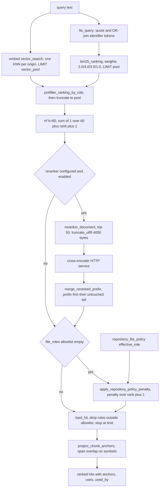
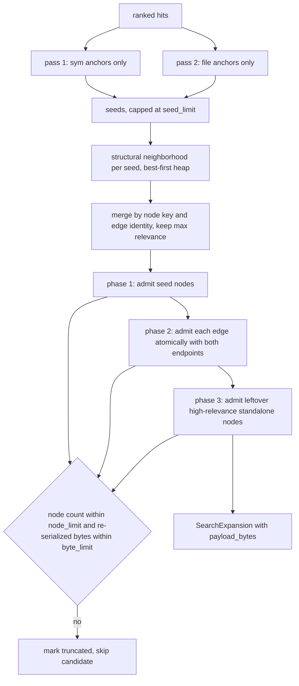

# Retrieval: anchors, fusion, expansion, and ranking

`search::search` (`src/search.rs:390`) is the one function that turns a natural-language or identifier query into a bounded JSON envelope an agent can act on. It runs two independent candidate generators over the chunk table — an FTS5 BM25 query and an exact sqlite-vec KNN scan — fuses their *orderings* with Reciprocal Rank Fusion, optionally re-sorts the fused list with a cross-encoder and again with a reconnaissance-derived repository-role penalty, then converts surviving chunk ids into hits carrying snapshot-scoped graph anchors. On top of that it can walk the structural graph outward from those anchors into a context pack, attach model-authored semantic memory only where that memory's evidence connects to the returned code, and finally shed material in a fixed priority order until the serialized response fits a byte limit. Everything below happens inside a single pinned read snapshot, so every anchor handed back refers to one consistent version of the graph.

## Entry, validation, and the pinned snapshot

Before touching data, `search` validates four allowlists and three numeric bounds: `file_roles` and `expansion.file_roles` against `file_role::ALL`, `file_origins` and `expansion.file_origins` against the origin vocabulary (`src/search.rs:396-399`), `memory_graph_depth <= 8` (`src/search.rs:400`), `memory_graph_node_limit` in `1..=20000` (`src/search.rs:403`), and `memory_limit` in `1..=100` — the last one only when `include_memory` is true (`src/search.rs:410`), so a caller that disables memory can pass any `memory_limit` unchecked.

The body is then wrapped in `store::with_read_snapshot(conn, "jscout_search", …)` (`src/search.rs:413`), a named SQLite SAVEPOINT (`src/store.rs:843`) pinning every subsequent statement to one snapshot, and `structural::current_snapshot(conn)` is read once (`src/search.rs:414`) and stamped onto the result. Expansion re-enters `structural::neighborhood`, which opens its own `jscout_neighborhood` savepoint (`src/structural.rs:2375`); savepoints nest, so this is safe, but the snapshot is recomputed once per seed and compared against the outer one via `expected_snapshot` (`src/search.rs:1499`), turning a mid-read snapshot change into a hard error rather than a silently stale pack. The snapshot is also held open across the cross-encoder HTTP call, whose client timeout is 125 s (`src/search.rs:349`) — a hung rerank service keeps a read transaction open for two minutes.

## Candidate generation

Pool sizes come from `candidate_pool_limits` (`src/search.rs:896`): `pool = max(limit, 10) * 5`, and when a role allowlist is present the vector pool is `pool * 4`. The overfetch exists because sqlite-vec applies KNN's `k` inside the index, before jscout can join `files.role`; without it a selective role filter would shrink the vector ranking after the fact and tilt RRF toward BM25. The cost is a 4x larger vector scan on every role-filtered query. `candidate_pool_limits(8, false) == (50, 50)` and `(8, true) == (50, 200)` are asserted directly in tests (`src/search.rs:1736`).

Lexical ranking is `bm25_ranking` (`src/search.rs:251`). `fts_query` (`src/search.rs:242`) splits the query on every character that is not alphanumeric, `_`, or `$`, wraps each surviving token in double quotes, and OR-joins them. Quoting is what makes arbitrary user text safe — no input can become FTS5 syntax — but OR-joining with no minimum-should-match means a long English question matches nearly every chunk containing any one common token; only BM25 ordering and the pool cap keep that tractable. If no token survives the split, `bm25_ranking` returns an empty vector (`src/search.rs:259`) rather than erroring, and fusion proceeds over the vector ranking alone.

The SQL orders by `bm25(chunks_fts, 2.0, 4.0, 3.0, 1.0)` (`src/search.rs:263`). Those four weights map positionally onto the FTS5 columns declared as `content, name, symbols, path` (`src/store.rs:33`), so `name` gets 4.0, `symbols` 3.0, `content` 2.0, `path` 1.0. The column order is load-bearing and undocumented at the call site: reordering the virtual table would silently score symbols as names. Origin filtering is three boolean parameters expanded from `origin_flags` (`src/search.rs:306`); role filtering is `file.role IN (SELECT value FROM json_each(?6))` guarded by an `is_empty` flag (`src/search.rs:271`).

Vector ranking calls `embed::vector_search` (`src/embed.rs:1445`), which resolves the embedding profile, embeds the query, checks the returned dimensionality against the stored profile, and hands off to `exact_vector_search` (`src/embed.rs:1492`). That runs **one KNN statement per origin**, each with `v.k = limit`, concatenates, sorts descending, and truncates to `limit` — three origins issue three queries fetching up to `3 * vector_pool` rows before truncation. The score stored is `1.0 - distance` (`src/embed.rs:1519`), not a cosine similarity read directly. A failure here does not abort the search: `record_vector_ranking` (`src/search.rs:1015`) records `RetrievalStatus::vector_degraded` with a repair hint string, and fusion continues lexical-only.

## Fusion

Both rankings pass through `prefilter_ranking_by_role` (`src/search.rs:923`) and are then truncated to `pool` (`src/search.rs:806-807`). The prefilter returns immediately when `file_roles` is empty (`src/search.rs:928`), and BM25 candidates were already role-filtered in SQL, so in practice it only prunes the vector ranking — exactly why the 4x overfetch exists. When it does run, it issues one `prepare_cached` query per candidate.

`rrf(&rankings, 60.0)` (`src/search.rs:378`, called at `809`) sums `1/(60 + rank + 1)` across rankings and sorts descending. Only positions enter the sum; the BM25 value and the vector score are discarded. That removes any need to calibrate two incompatible scales, at the cost of throwing away magnitude entirely — a vector hit dramatically better than everything else contributes the same `1/61` as a marginal top-1 lexical hit. That lost information is much of why a cross-encoder stage exists at all.

## Cross-encoder rerank

`Reranker::from_env` (`src/search.rs:324`) returns `Some` only if `JSCOUT_RERANK_URL` is set, or if `JSCOUT_EMBED_PROVIDER` is literally `local`, in which case the URL is derived as `{inference::base_url()}/rerank`. A remote embedding provider silently gets no reranker.

| Variable | Default | Meaning |
| --- | --- | --- |
| `JSCOUT_RERANK_URL` | unset | Enables the stage; overrides the derived local URL |
| `JSCOUT_RERANK_MODEL` | `BAAI/bge-reranker-v2-m3` | Sent as `model` in the request body |
| `JSCOUT_RERANK_TOP` | `50`, `min`'d to `100` | Fused-list prefix length sent for scoring |
| `JSCOUT_RERANK_CHARS` | `4000` | Per-candidate document budget |
| `JSCOUT_TIMING` | unset | Prints `bm25`, `embed-query+sqlite-vec`, `rerank(n)` stage timings to stderr |

Each candidate is rendered by `reranker_document` (`src/search.rs:951`) into a header block — `path`, `scope` (package name, else the first path component, else `(root)`), `symbol` (or `(anonymous)`), `kind`, `role`, optionally `deterministic_role` and `scouted_scope_role` when a policy row exists, `origin`, `lines` — followed by a blank line and the chunk content, then passed to `truncate_utf8` (`src/search.rs:1382`), which cuts on a UTF-8 boundary **by bytes**. `JSCOUT_RERANK_CHARS` is therefore a byte budget the header eats into, so the effective content window is below 4000 and shrinks as paths get longer.

The request body is `{model, query, deadline_ms: 120000, candidates:[{id, text}]}` with ids stringified; the response must be `{scores:[{id, score}]}`. `Reranker::rerank` bails if `out.len() != candidates.len()` or the returned id set differs from the sent one (`src/search.rs:369`) — a partial score set would silently drop candidates from the merge, so failing loudly and degrading to RRF order is the safer trade, at the cost of wasting an entire round-trip on one malformed response. A third path is worth naming: an `Ok` response whose score array is empty falls into the `Ok(_) => {}` arm (`src/search.rs:838`), which does nothing, leaving `reranker: "disabled"` — indistinguishable in the envelope from "no reranker configured". Only a transport or completeness error yields `"degraded"`.

On success, `merge_reranked_prefix` (`src/search.rs:909`) puts the reranked ids first and appends the fused entries not present in that set, so the tail is never lost. The consequence is that a relevant candidate at fused rank 51+ can never be promoted, and that the emitted `Hit.score` field now carries two incomparable scales in one response: raw cross-encoder values for the prefix, RRF values (~0.016 scale) for the tail.

## Repository-policy re-order

When and only when the caller supplied no `file_roles` allowlist, `apply_repository_policy_penalty` (`src/search.rs:870`) re-sorts the whole fused list by `recon::chunk_policy_penalty(chunk) / (rank + 1)` descending, ties broken by original rank (`src/search.rs:883-888`). `chunk_policy_penalty` (`src/recon.rs:630`) joins `repository_file_policy` and looks up `effective_role` in `policy_penalty` (`src/recon.rs:644`), defaulting to 1.0 when no policy row exists — one SQL query per fused entry, up to `pool` queries, executed after reranking.

Dividing by `rank + 1` makes this a rank-decayed nudge rather than a veto: a strong runtime hit at rank 12 can overtake a weak tooling hit at rank 3, but a decisively better match at rank 0 keeps its position. It runs *after* rerank by design — moving it earlier would let inferred policy decide which candidates the cross-encoder ever sees — and it reorders without touching `score`, so **the returned hit list is frequently not sorted by the `score` field it publishes**. Any consumer thresholding on `score` is broken by construction. Skipping the stage under an explicit `file_roles` request treats that request as the stronger signal (penalizing test files inside a test-only search would be wrong), at the price of role-filtered searches getting no reconnaissance-informed ordering at all.

## Every scoring factor

Two role-penalty tables live in this pipeline over two different vocabularies. `recon::policy_penalty` takes semantic *scope* roles produced by the reconnaissance model; `file_role::penalty` takes deterministic *artifact* roles derived from paths and content. They look alike and are not.

| Factor | Site | Value |
| --- | --- | --- |
| BM25 column weights | `src/search.rs:263` | content 2.0, name 4.0, symbols 3.0, path 1.0 |
| Vector score | `src/embed.rs:1519` | `1.0 - distance` |
| RRF constant `k` | `src/search.rs:809` | `60.0`; contribution `1/(k + rank + 1)` |
| Candidate pool | `src/search.rs:897` | `max(limit, 10) * 5` |
| Vector overfetch | `src/search.rs:901` | `pool * 4` when role-filtered |
| Rerank prefix | `src/search.rs:815` | 50, capped at 100 |
| Policy penalty (scope roles) | `src/recon.rs:644` | runtime 1.0, tooling 0.45, documentation 0.4, test 0.3, generated 0.1, anything else 1.0 |
| Policy rank decay | `src/search.rs:878` | `penalty / (rank + 1)` |
| Confidence weight | `src/structural.rs:3282` | certain 1.0, likely 0.6, possible 0.3, unknown 0.0 |
| Distance decay | `src/structural.rs:3322` | `0.75^(depth - 1)` |
| Hub damping | `src/structural.rs:3326` | `1 / log2(degree + 2)` |
| File-role penalty (artifact roles) | `src/file_role.rs:94` | production/none 1.0, unknown 0.75, documentation 0.4, test 0.3, fixture 0.2, generated 0.1, anything else 0.0 |
| Score rounding | `src/structural.rs:3331` | 6 decimal places |
| Memory `rank_score` | `src/semantic.rs:1079,1088` | RRF `k=60` over lexical + vector, divided by the max so it lands in 0..1 |
| Rendered support cap | `src/search.rs:16` | 8, non-compact only, no option override |

Relation kinds carry their own weights (`src/structural.rs:3291`):

| Weight | Kinds |
| --- | --- |
| 1.0 | `call`, `render`, `extend`, `dispatches`, `registered_handler`, `produces_lifecycle`, `produces_lifecycle_via`, `lifecycle_listener`, `produces_job`, `produces_job_via`, `job_handler`, `injects`, `provides`, `handles_route`, `handles_graphql` |
| 0.9 | `invokes_graphql`, `reads_resource`, `writes_resource`, `member_call`, `member_candidate` |
| 0.8 | `acquires_resource`, `reads_env`, `reads_config`, `checks_flag`, `calls_host` |
| 0.75 | `import`, `reexport` |
| 0.7 | `decorated_by`, `emits`, `listens` |
| 0.65 | `accepts_contract`, `returns_contract`, `references_contract` |
| 0.6 | `imports_types`, `imports_package_types`, `contains_event` |
| 0.55 | `declares_contract` |
| 0.5 | everything else |

## The pipeline end to end

The diagram below traces one query through candidate generation, fusion, the two optional re-orderings, and hit shaping. Note that both re-ordering stages are conditional, and that the policy stage reads a table written by an entirely different subsystem.

`PRE` only bites the vector list; `MERGE` is where the two score scales get mixed; `PEN` is where output order stops matching `Hit.score`. `LOAD` re-checks the role allowlist against `files.role` (`src/search.rs:858`) and breaks once `limit` hits are collected, so work downstream of `RRF` scales with the pool, not the result count.

## Hit shaping and anchors

`load_hit` (`src/search.rs:1031`) fetches path, deterministic `files.role`, origin, chunk kind/name/span/content/symbols, and `repository_file_policy.effective_role` (surfaced as `repository_role`) in one row, then issues up to four more queries: `project_chunk_anchors`, one `uses` query, and one `COUNT(*)` per declared symbol for the first three symbols.

`project_chunk_anchors` (`src/search.rs:1393`) joins `symbols` to the chunk by span overlap (`s.decl_start < c.end AND s.decl_end > c.start`) and then to `graph_nodes` on `native_table='symbols'`. If the chunk has a name, it first tries symbols whose `name` and `scope_chain` match the chunk exactly; failing that it takes every overlapping symbol; failing that it emits the single fallback `file:<path>` (`src/search.rs:1432`). Anchors are therefore either `sym:` graph node keys or that one `file:` form, and compact follow-up shaping branches on the prefix (`src/compact.rs:187`), so a new anchor form would break follow-up generation. A hit with more than one anchor is treated as ambiguous and emits no follow-up object at all (`src/compact.rs:165`) — copy-safety over convenience.

`uses` is up to six distinct `target_name (kind)` strings from `refs` with `kind IN ('call','render','extend')` and `confidence='certain'` (`src/search.rs:1079`). `used_by` counts, for each of the first three whitespace-separated symbols, rows in `refs` `WHERE target_name = ?1 AND chunk_id != ?2` (`src/search.rs:1092`) — a **global name match** with no origin, role, or resolution filter, including other chunks in the same file despite the source comment claiming "from other files". Names like `run`, `get`, or `handler` produce wildly inflated `N sites` figures. The snippet is the first four lines of chunk content.

Filtering everywhere tests the deterministic `files.role`, but compact output renders `repository_role` when present (`src/compact.rs:175`). A file the reconnaissance model reclassified as `test` still passes a `production` allowlist, and is then displayed with the role that did not gate it.

## Expansion

`expand_hits` (`src/search.rs:1446`) rejects zero limits, then picks seeds in **two passes** over the ranked hits: the first pass admits only anchors that do *not* start with `file:`, the second admits only those that do (`src/search.rs:1467-1489`). Import and module chunks frequently outrank the implementation they mention, and letting their `file:` fallbacks consume all three seed slots turned context packs into import listings. A genuinely file-level question now gets its file seeds only after every symbol anchor is exhausted. Seeds are capped at `seed_limit` (default 3) and role-filtered on the hit's deterministic role.

Each seed calls `structural::neighborhood` with `direction: "both"`, `depth` (default 1), `min_confidence` (default `likely`), `node_limit`/`edge_limit`, the expansion role allowlist (default `production, unknown`), the origin allowlist, and `penalize_file_roles: true`. Inside, the traversal is a **best-first `BinaryHeap` walk, not BFS** (`src/structural.rs:2438`). Each queued step carries four running *floors* — confidence, relation, hub, role — each updated with `min` along the path, and scores as `confidence_floor * relation_floor * distance_decay(next_depth) * hub_floor * role_floor` (`src/structural.rs:3253-3260`). Popping in score order means the pack fills with the highest-relevance relations first and truncation removes the weakest, not the deepest. Reaching `edge_limit` breaks the loop and sets `truncated`; a new node beyond `node_limit` is skipped while the loop continues (`src/structural.rs:2443-2450`). Because those limits are then applied a *second* time across the merged pack, `seed_limit = 3` with `node_limit = 40` can visit 120 nodes before the global cap discards most of them.

Per-seed results merge into two hash maps keyed by node key and by the edge identity tuple `(source, target, kind, file, line)`, keeping the maximum relevance on collision (`src/search.rs:1491-1537`), are sorted by relevance descending with a deterministic key tiebreak, and are admitted under **one global budget** in three phases.

Phase ordering is the whole point of `A2`. The earlier nodes-first loop could exhaust the byte budget before admitting a single relation, producing relationship-free "context packs"; admitting an edge together with any missing endpoint, and only then filling remaining space with standalone nodes, guarantees relations survive. The cost sits at `CH`: every admission trial clones the current node and edge vectors and calls `expansion_parts_bytes` (`src/search.rs:1359`), which re-serializes the entire trial set — quadratic in pack size with a full-JSON constant factor.

Phase 3 deliberately admits nodes that are neither seeds nor edge endpoints, which matters later: `prune_expansion_nodes` (`src/search.rs:1307`) retains only seeds and edge endpoints and is called from exactly one place, immediately after the response budget pops an edge (`src/search.rs:1175`). The first shed edge therefore takes every legitimately admitted standalone definition with it.

## Memory attachment

`select_attached_memory` (`src/search.rs:481`) starts from a candidate list produced by `semantic::search_with_provider` with `candidate_limit = memory_limit * 8` clamped to `1..=100` (`src/search.rs:431`). Seeds are every hit anchor plus every hit's `file_anchor`; `hit_files` collects the hit paths. Attachment is graded into three tiers, and anything that reaches none of them is dropped outright.

| Tier | Condition | Site |
| --- | --- | --- |
| 0 | A support's `anchor` is one of the hit anchors, or its `evidence_file` is a hit file | `src/search.rs:511-515` |
| 1 | A support's anchor sits at graph distance `1..=memory_graph_depth` from a hit anchor; the nearest such support wins | `src/search.rs:525-536` |
| 2 | The artifact is joined by a `semantic_relations` row to some tier-0/1 artifact | `src/search.rs:548-588` |

Distances come from `memory_graph_distances` (`src/search.rs:692`): a chunked BFS over `resolved_edges` treated as undirected, restricted to `confidence IN ('certain','likely')`, frontier sliced into batches of 400, with a per-statement `LIMIT node_limit * 4 + 1`. Rows are ordered by `edge.id`, so hitting that limit truncates arbitrarily rather than dropping the least useful edges; both that and the node-limit hit set `graph_truncated`. The origin predicate is `(src.file_id IS NULL OR src_file.origin IN …) AND (dst.file_id IS NULL OR dst_file.origin IN …)` (`src/search.rs:729-732`) — graph nodes with no backing file bypass the origin allowlist entirely. Tier 1 requires `distance > 0` while the map seeds hit anchors at 0, so an artifact whose only support *is* a hit anchor is caught by the tier-0 check instead; the two conditions are load-bearing together and neither works alone.

Sorting is `(tier asc, rank_score desc, original rank asc)` (`src/search.rs:591-607`), so tier dominates: a weak-scoring but directly-anchored artifact outranks a high-scoring one two hops away. `diversify_memory_ties` (`src/search.rs:628`) then scans forward for runs of same-tier candidates whose `rank_score` is **bit-identical** (`.to_bits()`, `src/search.rs:651`) and within each run repeatedly picks the candidate scoring highest on a two-point novelty measure — one point for an unseen `artifact_type`, one for an unseen `support_key`. Exact bit equality means near-ties are untouched.

`status` becomes `no_connected_memory` when nothing connects — "nothing attached to *these hits*", not "memory is empty". The whole block is suppressed rather than reported when the corpus is empty (`let attachment = (retrieval.corpus_artifacts > 0).then_some(attachment);`, `src/search.rs:443`), so that status only ever appears when artifacts exist.

## The response budget

`apply_response_budget` (`src/search.rs:1124`) measures by actually serializing the envelope — `compact::search_rendered_bytes` in compact mode, `serde_json::to_string_pretty` otherwise (`src/search.rs:1342`) — so the same `response_byte_limit` measures a different document per mode. Because `rendered_bytes` is itself a field inside the payload, writing the number changes the size; `settle_rendered_bytes` (`src/search.rs:1320`) iterates to a fixed point up to 8 rounds and `capture_unbudgeted_bytes` (`src/search.rs:1331`) wraps that in another 8. Neither errors on non-convergence; both return the last value, so a published `rendered_bytes` can be a non-fixed-point estimate.

Before the loop, non-compact responses cap *total* rendered semantic supports at 8 via `cap_semantic_supports` (`src/search.rs:1269`), allocating one row per artifact before a second to avoid first-artifact monopolization. Compact mode skips this because it renders only the first support anyway. The cap has no option override, so diagnostic output deliberately shows an unrepresentative slice of the evidence.

The shed loop then removes exactly one item per iteration, re-serializing the whole envelope each time, in this order:

| Step | Action | Site |
| --- | --- | --- |
| 1 | Pop the last semantic artifact while more than one remains | `src/search.rs:1148` |
| 2 | Pop a support from the last artifact with more than one | `src/search.rs:1153` |
| 3 | Pop the final artifact | `src/search.rs:1163` |
| 4 | Pop the last expansion edge, then `prune_expansion_nodes` | `src/search.rs:1172-1178` |
| 5 | Remove the last non-seed expansion node | `src/search.rs:1181` |
| 6 | Compact only: clear `include_followups` on the last eligible hit | `src/search.rs:1192` |
| 7 | Pop the last hit while more than one remains | `src/search.rs:1205` |
| 8 | Pop one `used_by`, then one `uses`, then one surplus anchor | `src/search.rs:1211-1237` |
| 9 | Truncate the longest snippet by `max(overshoot, 128)` bytes | `src/search.rs:1240-1257` |
| 10 | Error with the minimum envelope size | `src/search.rs:1259` |

The ordering encodes a priority: source-backed code is the primary product, explicitly requested structural context outranks an optional untrusted attachment, and edges go before their endpoints because node-first shedding produced relationship-free packs. The top hit's *identity* is never removed, but its fields are not protected — steps 6, 8, and 9 all use `.rev().find(…)`, which lands on the top hit once it is the only one left. Under a small enough limit the response degenerates to one truncated snippet; if even that does not fit, `search` errors rather than returning an empty result.

## Surfaces and defaults

The MCP `semantic_search` tool (`src/mcp.rs:597`) maps arguments onto `SearchOptions`. Two gates depend on the tool profile: `include_memory` requires `profile == ToolProfile::Structural` (`src/mcp.rs:620`), as does `include_neighborhood_followups` (`src/mcp.rs:633`), and `expand` is rejected outright in the baseline profile (`src/mcp.rs:604`). Rendering is `compact: !debug` (`src/mcp.rs:632`) with the branch at `src/mcp.rs:664-668`. The CLI (`src/main.rs:1446`) mirrors the same options.

Defaults come from `SearchOptions::default` (`src/search.rs:82`) — `limit` 10, `response_byte_limit` 24000, origins repository+workspace, `memory_limit` 4, `memory_graph_depth` 2, `memory_graph_node_limit` 2000, `rerank` true — and `ExpansionOptions::default` (`src/search.rs:33`): `depth` 1, `seed_limit` 3, `node_limit` 40, `edge_limit` 120, `byte_limit` 24000, `min_confidence` `likely`, roles production+unknown.

## Testing and gaps

`src/search.rs` carries 13 `#[test]` functions in an inline `mod tests` (from `src/search.rs:1653`), all against real tempdir repositories indexed by `indexer::index_repo` — no mocked SQLite. They assert pool arithmetic exactly (`1736`), rerank splicing on a 60-item fused list with a 50-item prefix (`1742`), anchor projection to `sym:a.ts#::greet@1` (`1762`), the single global expansion budget (`1797`), memory tiering down to the exact selected id order (`1885`), four response-budget behaviors (`2019`, `2047`, `2108`, `2180`), the 8-support cap (`2225`), role filtering including the exact `reranker_document` header lines (`2298`), and a `documentation`-path runtime file outranking a `src` tooling file once policy exists (`2396`).

Gaps concentrate on the network and fusion paths. Nothing exercises the `Reranker` HTTP client — no fake server — so the exact-candidate-set bail at `src/search.rs:369` and the silent empty-array arm at `838` are both untested. No test drives a live `embed::Provider`, so `rrf` is never observed fusing two real rankings and has no direct unit test either. `memory_graph_distances` truncation flags are never asserted, the 8-round fixed-point loops have no non-convergence test, and `diversify_memory_ties`' novelty scoring is exercised only incidentally.

Related reading: [`05-storage-schema.md`](05-storage-schema.md) for the FTS5 and vector tables, [`06-semantic-layer.md`](06-semantic-layer.md) for embedding profiles and `semantic::rank_artifacts`, [`03-structural-extraction.md`](03-structural-extraction.md) for the entities behind `sym:` anchors, and [`17-sharp-edges.md`](17-sharp-edges.md) for the quadratic admission loop.
