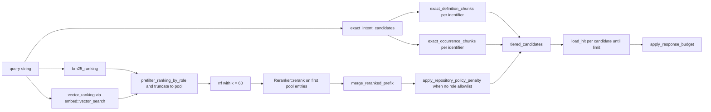
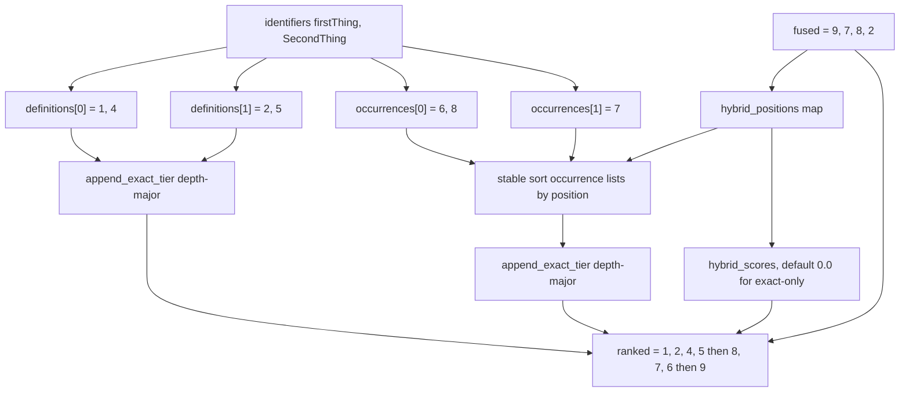
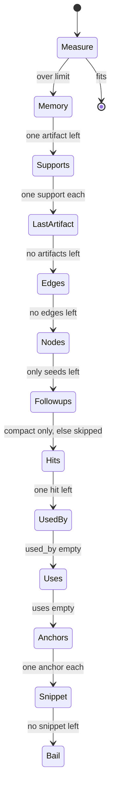

# Retrieval: exact-identifier intent, fusion, expansion, and ranking

Retrieval turns one query string into a byte-bounded JSON envelope of ranked code chunks. It runs three ordered tiers: a deterministic exact-identifier tier that answers "where is `NextTypesPlugin`" from SQL alone, then a hybrid tier that fuses BM25 and vector KNN by reciprocal rank, optionally re-orders the fused prefix with a cross-encoder, and optionally demotes candidates whose files a repository scout classified as tooling, test, or generated. Survivors become `Hit` rows carrying snapshot-scoped anchors, outgoing `uses` edges, and anchor-resolved `used_by` counts; graph expansion and semantic memory attach on request; and a shed loop trims the envelope to a byte ceiling by repeatedly serializing it. Nearly all of this lives in `src/search.rs` (2,734 lines), with the agent-facing projection in `src/compact.rs`.

## Entry, validation, and the pinned snapshot

`search::search` (`src/search.rs:1024`) validates the two role allowlists against `file_role::ALL` and the two origin allowlists against `origin::ALL`, then bounds `memory_graph_depth` at 8, `memory_graph_node_limit` in `1..=20000`, and — only when `include_memory` is set — `memory_limit` in `1..=100` (`src/search.rs:1030-1046`). The validation is narrower than it looks: `origin::validate_all` rejects an empty origin list (`src/origin.rs:11`) while `file_role::validate_all` accepts one, `response_byte_limit == 0` is only caught inside `apply_response_budget` after all retrieval work has run (`src/search.rs:1793-1796`), and every expansion bound is checked inside `expand_hits` (`src/search.rs:2159-2171`), so an invalid expansion config passes silently unless `options.expand` is set.

Everything else runs inside `store::with_read_snapshot(conn, "jscout_search", …)` (`src/search.rs:1047`), a `SAVEPOINT` released on `Ok` and rolled back on `Err` (`src/store.rs:858-874`). Because SQLite defers a read transaction until its first statement, the snapshot pins at the first BM25 read, not at the savepoint. The structural snapshot id is stamped once (`src/search.rs:1048`) and re-checked by expansion via `expected_snapshot`. Consequence: the cross-encoder HTTP round-trip, whose client timeout is 125 s (`src/search.rs:983`), happens with that read transaction open.

## The exact-identifier tier (G17)

The structural change that defines current retrieval is that `ranked_hits` computes exact candidates *before* any lexical or vector work: `exact_intent_candidates` at `src/search.rs:1436`, BM25 not until `src/search.rs:1444`. The exact pool never passes through RRF, the reranker, or the policy penalty; it is prepended to the fused list at the very end by `tiered_candidates(exact, &fused)` (`src/search.rs:1506`), after `apply_repository_policy_penalty` at `src/search.rs:1504`. Fusion, reranking, and policy are structurally confined to the hybrid tail: they cannot displace an exact match, because tier membership is fixed before they run.

The design reason is that RRF discards magnitudes: a "boost" for an exact name match would still be a rank nudge competing against 50-250 fused candidates, outvotable by an embedding or a cross-encoder. The cost is that `Hit.score` stops being a ranking key — an exact-only chunk that never appeared in the hybrid pool reports `score: 0.0` (`src/search.rs:876`) while ranked first.

In the diagram below, notice that `EXACT` is computed at the far left, before `BM25`, but consumed at the far right, after `POLICY`.

`RRF`, `RR`, and `POLICY` only ever reorder the list that reaches `TIER` as its third input. `DEFS` and `OCCS` reach `TIER` untouched by any of them, with one asymmetry described below where `TIER` reads positions out of the post-policy list to sort occurrences among themselves.

### Token admission

`exact_intent_tokens` (`src/search.rs:371`) splits the query on anything that is not ASCII alphanumeric, `_`, or `$` (`identifier_tokens`, `src/search.rs:388`), then applies a two-mode filter. If the whole query reduces to exactly one legal identifier token, that token is admitted unconditionally. Otherwise each token must additionally be *code-shaped*: `is_code_shaped_identifier` (`src/search.rs:413`) accepts a leading `_` or `$`, an embedded `_` or `$`, a leading uppercase letter, or any non-initial uppercase letter — camelCase, PascalCase, snake_case, `$`-sigil. `is_identifier_token` (`src/search.rs:402`) enforces a legal JS identifier start. Duplicates are deduplicated with insertion order preserved.

The filter keeps *multi-word* prose out of the absolute tier, not all prose. `exact_intent_tokens("development cache behavior")` is empty and `"find createRouteTypesManifest and NextTypesPlugin in root_layout files"` yields exactly `["createRouteTypesManifest", "NextTypesPlugin", "root_layout"]` — but `exact_intent_tokens("insert")` yields `["insert"]`, pinned at `src/search/tests.rs:160`. A one-word query is an explicit lookup regardless of shape, so `authentication` enters the tier; conversely an all-lowercase identifier inside a sentence (`router` in "how does the router work") gets no exact tier at all.

| Query shape | Admission rule | Occurrence cap per identifier |
|---|---|---|
| Exactly one identifier token | Unconditional (`is_single_identifier_intent`, `src/search.rs:397`) | `per_identifier_limit` (= `options.limit`) |
| Multiple tokens | Token must pass `is_code_shaped_identifier` | 1 |
| No legal identifier tokens | Tier is empty, hybrid only | — |

### Definitions

`exact_definition_chunks` (`src/search.rs:481`) unions two SQL sources under the same origin-flag triple and role-allowlist predicate as `bm25_ranking` (`src/search.rs:499-502`, `542-545`, `901-904`), so the exact tier can never surface a chunk the hybrid tier was forbidden to return. The first query selects chunks whose `chunk.name` equals the identifier under `COLLATE BINARY`, forcing `name_priority = 0` and `export_priority = 1`. The second joins `symbols` to their containing chunk by declaration containment (`chunk.start <= symbol.decl_start AND symbol.decl_start < chunk.end`) and derives `name_priority` from name equality, `export_priority` from `symbol.exported`. Rows from both are merged in Rust and sorted by `(name_priority, export_priority, span, path, start, id)` (`src/search.rs:574-582`) — named-and-exported first, then tightest span, then an alphabetical path tiebreak with no relevance signal involved — then truncated to `limit`. `per_identifier_limit` is `options.limit` for *both* exact queries, so a single identifier's definitions can fill the entire response; only occurrences carry the mixed-query cap of 1.

### Occurrences

`exact_occurrence_chunks` (`src/search.rs:596`) unions three structured tables — `refs.target_name`, `member_calls.prop`, `entity_sites.target_name`, all `COLLATE BINARY` — grouped by chunk and ordered by `(MIN(path), MIN(position), chunk_id)`. Those tables deliberately omit object-literal keys, non-call member reads and writes, and some computed state containers, which is exactly the category of name a developer searches for. So when the structured pass returns fewer than `limit` rows (`src/search.rs:664`), FTS5 becomes a bounded candidate generator: it matches the quoted identifier, pulls `limit * 32` rows clamped to `[32, 4096]` (`src/search.rs:678`), and admits a chunk only if `contains_code_identifier` (`src/search.rs:705`) confirms it in the stored source.

That verifier is a hand-rolled byte-level lexer over six states — Code, single-quoted, double-quoted, template, line comment, block comment — that requires the match to occur in Code state with non-identifier bytes on both sides (`is_identifier_continue_byte`, `src/search.rs:786`). So `state.collectedRootParams = next` matches, `const collectedRootParamsExtra` does not, and neither `// collectedRootParams` nor `'collectedRootParams'` does (`src/search/tests.rs:172-188`). The lexer models neither regex literals, nor JSX text, nor `${}` substitutions: an apostrophe inside a regex or JSX text flips it into the single-quoted state and swallows the following code. The gate covers only the FTS fallback — the structured union is admitted with no lexical check, relying on those columns being parser-derived.

### The occurrence admission cap and its ordering trap

In `exact_intent_candidates` (`src/search.rs:428`) `occurrence_limit` is `per_identifier_limit` for a pure single-identifier query and **1** otherwise (`src/search.rs:440-444`). One occurrence is enough to establish exact coverage, and a common incidental type would otherwise consume the whole result budget with call sites and hide the hybrid matches the prose half of the query asked for. The price is that a mixed query can never enumerate usages; the caller must issue a bare-identifier search or use `who_uses`.

The order of the three steps matters. Occurrences are fetched at the full `per_identifier_limit`, filtered against the definition set (`src/search.rs:468`), and only then truncated to `occurrence_limit` (`src/search.rs:470`). A definition chunk frequently also contains an occurrence; truncating first could yield exactly that row, which then gets filtered out, leaving zero occurrences even though non-definition occurrences exist. The cost is up to `limit` rows of discarded SQL work per identifier.

### Tier assembly and multi-identifier coverage

`ExactIntentCandidates` (`src/search.rs:345-350`) keeps `definitions` and `occurrences` as `Vec<Vec<i64>>` parallel to `identifiers` rather than flattening them; that grouping is what makes coverage reservation possible.

`tiered_candidates` (`src/search.rs:790`) builds `hybrid_scores` and `hybrid_positions` maps from the fused list, then performs one asymmetric fix-up: each identifier's *occurrence* list is stably re-sorted by hybrid position, keying present-in-hybrid chunks as `(0, position)` and absent ones as `(1, usize::MAX)` (`src/search.rs:806-812`). Since those positions are read after `merge_reranked_prefix` and after the policy penalty, reranker and policy judgement do reorder *inside* the `ExactOccurrence` tier — they just cannot move a chunk out of it. Definitions are not re-sorted; they keep the SQL priority order, on the reasoning that the reranker has no better information than "named, exported, tightest span". Two adjacent tiers therefore use different ordering philosophies, and nothing in the output reveals which produced a given position.

`append_exact_tier` (`src/search.rs:847`) is the coverage mechanism: it iterates depth-major — `for depth in 0..max_len`, then across identifiers (`src/search.rs:856-860`) — so every identifier contributes its first definition before any contributes a second, and a four-identifier query at `limit = 4` returns exactly one definition per identifier. When a chunk is already ranked, the new identifier is appended to that hit's `matched_identifiers` instead of duplicating the row (`src/search.rs:861-872`), so one chunk can be credited to several identifiers and `chunk_id` stays unique across the response.

The following diagram traces the interleave that `exact_tiers_survive_hostile_hybrid_order_and_cover_identifiers` (`src/search/tests.rs:193`) pins. Watch how `OCC1` and `OCC2` are reordered by the hybrid list while `DEF1`/`DEF2` are not.

`RR1` emits `[1, 2, 4, 5]` as `ExactDefinition` — one per identifier at depth 0, then depth 1. `SORT` turns `[6, 8]` into `[8, 6]` because `8` sits at hybrid position 2 and `6` is absent, so `RR2` emits `[8, 7, 6]` as `ExactOccurrence`. Only `9` remains from `HYB`, appended as `Hybrid`.

## The hybrid tier

`candidate_pool_limits` (`src/search.rs:1560`) sets `pool = max(limit, 10) * 5` and, when a role allowlist is present, `vector_pool = pool * 4`. The overfetch exists because `exact_vector_search` (`src/embed.rs:1755`) issues one `k`-limited KNN statement per origin against the sqlite-vec table with no `files.role` join at all — sqlite-vec applies `k` before jscout can inspect the role, so a selective filter would otherwise starve the vector leg and tilt RRF toward BM25. `prefilter_ranking_by_role` (`src/search.rs:1587`) then filters both rankings in Rust, one `SELECT file.role` per candidate; for BM25 that is a no-op, since BM25 already filters roles in SQL.

`bm25_ranking` (`src/search.rs:884`) builds an OR-joined, individually-quoted token query via `fts_query` (`src/search.rs:362`) so no user input can be FTS syntax, and returns an empty ranking when tokenization yields nothing (`src/search.rs:891-893`) — a punctuation-only query still runs the exact tier. Vector scores are `1.0 - distance` (`src/embed.rs:1779`), and a vector failure is non-fatal: `record_vector_ranking` (`src/search.rs:1679`) records `vector: "degraded"` plus a repair action and the pipeline continues lexical-only. `rrf` (`src/search.rs:1012`) fuses by `1/(60 + rank + 1)`, discarding both the BM25 magnitude and the cosine similarity.

Every hardcoded weight in the ranking path:

| Weight | Value | Applies to | Site |
|---|---|---|---|
| BM25 `content` column | 2.0 | lexical rank | `src/search.rs:896`, columns `src/store.rs:32` |
| BM25 `name` column | 4.0 | lexical rank | `src/search.rs:896` |
| BM25 `symbols` column | 3.0 | lexical rank | `src/search.rs:896` |
| BM25 `path` column | 1.0 | lexical rank | `src/search.rs:896` |
| RRF `k` | 60.0 | fusion | `src/search.rs:1469` |
| Vector score | `1.0 - distance` | fusion input | `src/embed.rs:1779` |
| Policy penalty `runtime` / `tooling` / `documentation` / `test` / `generated` | 1.0 / 0.45 / 0.4 / 0.3 / 0.1 | fused re-sort | `src/recon.rs:638` |
| Policy rank decay | `penalty / (rank + 1)` | fused re-sort | `src/search.rs:1541` |
| Artifact-role penalty `production` / `unknown` / `documentation` / `test` / `fixture` / `generated` / other | 1.0 / 0.75 / 0.4 / 0.3 / 0.2 / 0.1 / 0.0 | expansion relevance | `src/file_role.rs:95` |
| Edge confidence `certain` / `likely` / `possible` | 1.0 / 0.6 / 0.3 | expansion relevance | `src/structural.rs:3358` |
| Relation kind | 1.0 down to 0.5 by kind | expansion relevance | `src/structural.rs:3367` |
| Distance decay | `0.75^(depth-1)` | expansion relevance | `src/structural.rs:3398` |
| Hub damping | `1 / log2(degree + 2)` | expansion relevance | `src/structural.rs:3402` |
| Path priority: boundary or cross-file / direct / other | 0 / 1 / 2 | expansion path sort | `src/search.rs:2552-2557` |

Two role-penalty tables with near-identical shapes operate on different vocabularies and are both consulted in one request: `recon::policy_penalty` takes model-derived scope roles and ranks hits; `file_role::penalty` takes deterministic artifact roles and feeds neighborhood relevance when `penalize_file_roles` is set.

## Cross-encoder rerank

`Reranker::from_settings` (`src/search.rs:955`) — not `from_env`; construction now reads the `src/config` subsystem, with `JSCOUT_RERANK_*` surviving only as legacy fallbacks in `src/config/load.rs:682-718` — returns `Some` only when `reranker.url` is configured, or when `embedding.provider == "local"`, in which case the URL is derived as `{inference.url}/rerank`. A remote embedding provider with no explicit `reranker.url` silently gets no reranker. Defaults: model `BAAI/bge-reranker-v2-m3`, `top` 50 (clamped to 100 at construction), `max_chars` 4000. `SearchOptions::default()` sets `rerank: true` but `reranker: None`, so the stage is inert unless a caller resolves one.

The stage (`src/search.rs:1472-1502`) renders the first `reranker.pool` fused entries through `reranker_document` (`src/search.rs:1615`), whose header carries path, scope, symbol, kind, effective role, deterministic role, scouted scope role, origin, and line span before the chunk content, then truncates the *whole document* to `max_chars` bytes — so the effective content window is smaller than the nominal 4000. It POSTs `{model, query, deadline_ms: 120000, candidates}` and bails unless the response covers exactly the sent id set once each (`src/search.rs:1000-1006`); that error path sets `reranker: "degraded"`. `merge_reranked_prefix` (`src/search.rs:1573`) puts the reranked prefix first and appends the untouched tail, so a partial rerank never loses candidates. An `Ok` response with an empty `scores` array falls into the `Ok(_) => {}` no-op arm (`src/search.rs:1489`), leaving `reranker: "disabled"` — indistinguishable from never configured. After the merge the fused list mixes raw cross-encoder scores in the prefix with RRF values around 0.016 in the tail.

## Repository policy

`apply_repository_policy_penalty` (`src/search.rs:1534`) runs **only when the caller supplied no role allowlist** (`src/search.rs:1503`): an explicit role filter is a stronger, caller-owned statement of intent than a model-derived scope classification, and re-penalizing inside an already-narrowed set would fight the caller. The consequence is that role-filtering callers silently lose recon-derived ranking entirely, with no way to request both. When it runs, it re-sorts the fused list by `recon::chunk_policy_penalty(chunk_id) / (rank + 1)` descending, ties broken by original rank, issuing one SQL query per fused candidate (up to `pool`, i.e. 50 at the default limit) after the reranker has already run. The exact tier bypasses it entirely, so an exact definition in a `generated` or `test` scope — penalties 0.1 and 0.3 — outranks every hybrid hit, surfacing exactly the code the policy plane was built to demote.

## Hit materialization

`load_hit` (`src/search.rs:1697`) reads the chunk row joined to `files` and `repository_file_policy`, carrying `match_reason` and `matched_identifiers` through from the candidate. `uses` is up to 6 distinct `target_name (kind)` strings from `refs` restricted to `kind IN ('call','render','extend') AND confidence='certain'`. `used_by` is anchor-resolved: only when the chunk projects to exactly one `sym:` anchor does it call `query::who_uses_anchor_in_origins` and count usages in other files (`src/search.rs:1746-1763`). The repository-wide same-name count that used to fill this field — which inflated common names like `run` or `handler` — survives only as `approximate_name_usage_occurrences` (`src/search.rs:1107`), whose doc comment forbids rendering it as `used_by`; it is consumed only by MCP telemetry. Multi-anchor and file-anchored hits now show no `used_by` at all.

`project_chunk_anchors` (`src/search.rs:2099`) prefers symbols matching both name and `scope_chain`, falls back to every span-overlapping symbol, and finally to `file:<path>`. The role allowlist is re-checked after loading against `files.role` (`src/search.rs:1519`), catching a stale ranking row — but it compares the deterministic role, not `effective_role`, so a scout override affects display and the policy penalty, never filtering. `load_hit` applies no origin predicate; origin filtering exists solely in the ranking and exact-tier SQL. Exactly one hit per response gets the copy-safe follow-up argument object — the first with at most one anchor (`src/search.rs:1528-1530`) — and `compact_hit` suppresses follow-ups on multi-anchor hits (`src/compact.rs:236-239`), since an ambiguous anchor cannot be pasted into a tool call safely.

## Expansion

`expand_hits` (`src/search.rs:2152`) picks seeds in two passes over the ranked hits — symbol anchors first, `file:` fallbacks second (`src/search.rs:2177-2200`) — because import and module chunks often outrank the implementation they mention, and letting those fallbacks consume every seed turns expansion into an import listing. Expansion applies its own role allowlist, defaulting to `file_role::DEFAULT_EXPANSION = ["production", "unknown"]`, so it is role-filtered by default even when primary hits are not. Per-seed `structural::neighborhood` results merge keeping maximum relevance per node and edge identity.

Selection runs under one global node/edge/byte budget. `select_path_projection` (`src/search.rs:2438`) is a multi-source maximum-bottleneck traversal in which each reached node keeps a single deterministic predecessor (`PathReach`), turning the induced neighborhood into a bounded forest. Candidate paths sort by `priority` (boundary or cross-file 0, direct 1, other 2), then score, depth, key, so structural boundaries beat deep same-file chains; one path per uncovered root is then partitioned to the front (`src/search.rs:2591-2597`) so a multi-symbol search cannot drop an entry point merely because another seed has many high-scoring neighbors. In `neighborhood` projection the forest is computed first and `select_neighborhood_projection` (`src/search.rs:2328`) widens it with ranked fan-out under the leftover budget. Admission is quadratic: each trial clones the node and edge vectors and re-serializes them through `expansion_parts_bytes`, for up to `edge_limit` (default 120) candidates.

## The response byte budget

`apply_response_budget` (`src/search.rs:1793`) measures by actually serializing the envelope — `compact::search_rendered_bytes` in compact mode, `serde_json::to_string_pretty` otherwise — and sheds until it fits under the default 24,000-byte ceiling. Because `rendered_bytes` is a field inside the document it measures, the measurement is self-referential; `settle_rendered_bytes` (`src/search.rs:2026`) and `capture_unbudgeted_bytes` (`src/search.rs:2037`) each iterate for at most 8 rounds and neither errors on non-convergence, so a published `rendered_bytes` can be a non-fixed-point estimate. For the diagnostic path, `SearchSectionBytes::reserved()` fills every field with `usize::MAX` so the envelope is budgeted at maximum digit width and later real values can only shrink it.

The ladder below is the shed order in `src/search.rs:1814-1939`. Read it top-down: each step retries the whole loop.

`Memory` sheds lower-ranked semantic artifacts before any code hit or requested expansion, reflecting that memory is an optional attachment. `Edges` pops the least relevant relationship and then calls `prune_expansion_nodes`, which retains only seeds and edge endpoints — so the first shed edge also discards every standalone high-relevance node `select_neighborhood_projection` deliberately admitted. `Hits` requires `result.hits.len() > 1` (`src/search.rs:1883`), so the top-ranked hit is never dropped; below that only its fields are trimmed. `Bail` is a hard error naming the minimum envelope size (`src/search.rs:1936-1939`).

## Compact exposure of the match reason

`compact::search_value` (`src/compact.rs:52`) writes `"default_match": "hybrid"` once at envelope level (`src/compact.rs:63`); `compact_hit` (`src/compact.rs:201`) emits `"match"` only when the reason differs from `Hybrid` (`src/compact.rs:214`) and `"matched_identifiers"` only when non-empty. Spending ~20 bytes per hit to restate the default would compete directly against snippet content, so per-hit bytes go only to the exceptional tiers. A consumer reading only `hits[]` sees no `match` field on most hits and must know to fall back to `default_match`. The diagnostic representation always serializes `match` (`#[serde(rename = "match")]`, `src/search.rs:315-316`).

## Known disagreements between the tiers

The two legs of a single query disagree on case sensitivity: `chunks_fts` uses `unicode61` tokenization with case folding (`src/store.rs:33`), while every exact-tier query uses `COLLATE BINARY`. So `usestate` will BM25-match `useState` but can never enter the exact tier. Cost is also unconditional — `exact_intent_candidates` runs with `per_identifier_limit = options.limit` on every search, so a four-identifier query at `limit = 10` can execute eight identifier queries plus up to four FTS fallback scans of ~320 byte-scanned rows before a single BM25 row is fetched.

Retrieval is pinned as behavior against real temp-dir repositories indexed by `indexer::index_repo`, in `src/search/tests.rs` (1,277 lines). G17 has three pins: `exact_identifier_intent_does_not_promote_plain_prose` (`src/search/tests.rs:159`) unit-tests token admission and the lexer; `exact_tiers_survive_hostile_hybrid_order_and_cover_identifiers` (`src/search/tests.rs:193`) asserts the interleave and tier boundaries against an adversarial hybrid order; and `exact_identifier_search_precedes_examples_and_preserves_ambiguity` (`src/search/tests.rs:221`) builds a repo with two same-named classes, a caller, and a decoy whose only content is the identifiers inside a string literal, then asserts four-identifier coverage at `limit = 4`, exclusion of the decoy, both ambiguous definitions for a bare `NextTypesPlugin`, exactly one occurrence for a mixed query, and an object-literal key reachable only through the FTS-plus-lexer fallback.

Related: [05-storage-schema.md](05-storage-schema.md) for `chunks_fts` and `refs`; [08-scouting.md](08-scouting.md) for where `effective_role` comes from; [11-mcp-surface.md](11-mcp-surface.md) for `semantic_search` option construction; [19-sharp-edges.md](19-sharp-edges.md) for the cross-subsystem traps.
