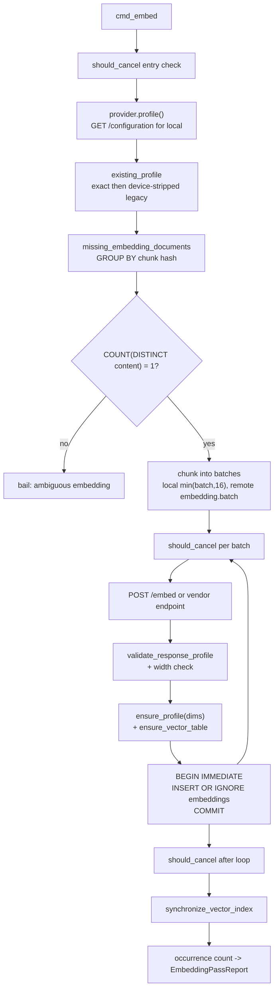
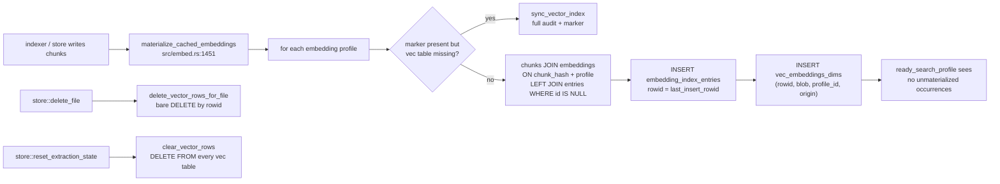

# Semantic layer: embeddings, vectors, and the inference sidecar

jscout's vector plane turns two disjoint document namespaces — verbatim chunk source and composed semantic-artifact text — into content-addressed float32 vectors, caches them in regular SQLite tables keyed by content hash and embedding profile, materializes each current *occurrence* of that content into a per-width `sqlite-vec` virtual table partitioned by profile and file origin, and serves origin-partitioned KNN whose ranking is fused with BM25 by reciprocal rank fusion and optionally reordered by a cross-encoder. Three provider protocols are supported; only one of them is a local process, a Python sidecar behind four loopback HTTP endpoints that loads PyTorch lazily so BM25-only installs never pay for it. The design's recurring theme is that expensive artifacts (vectors, cross-encoder scores) are cached or refused rather than partially trusted, and that every failure in this plane degrades the search rather than failing it.

## What actually gets embedded

The code document is the chunk's source slice and nothing else. `embed_text` (`src/embed.rs:504`) copies the content and, above 24,000 **bytes**, walks the cut index backwards to a `is_char_boundary` before truncating. The doc comment immediately above (`src/embed.rs:500-503`) states the reason no path, symbol, or role header is prepended: the durable cache is keyed `(chunk_hash, profile_id)` (`src/store.rs:595`), so occurrence-specific metadata folded into the text would force fifty identical copies of a helper to nominate an arbitrary representative path, and dedup would collapse. The cost is real — the embedding cannot distinguish two byte-identical helpers in different packages — and the lost signal is reinjected only at rerank time, where no cache key constrains the text.

The semantic document is a fixed template built per artifact by `semantic_embedding_documents` (`src/embed.rs:538`): the literal `semantic artifact`, then `type:`, `name:`, `anchors:` followed by newline-joined distinct `semantic_supports.anchor_key` values from a correlated `group_concat`, and `body:` (the raw `body_json`) last (`src/embed.rs:574-577`). The comment at `src/embed.rs:569-572` gives the ordering rationale: workflow bodies grow without bound, `embed_text`'s 24 KB cut eats the tail, and the anchors are the bridge back to code, so they must precede the generated prose. The query for these documents excludes any artifact that has a successor (`WHERE NOT EXISTS(... supersedes_artifact_id=artifact.id)`), so superseded memory is never embedded at all.

Two version tags gate reuse, and they deliberately sit at different depths. `DOCUMENT_TEXT_FORMAT = "content-v2"` (`src/embed.rs:9`) is folded into the profile config JSON for all three protocols (`src/embed.rs:285, 294, 304`), so bumping it forks an entirely new `embedding_profiles` row and orphans every cached vector. `SEMANTIC_DOCUMENT_TEXT_FORMAT = "semantic-v1"` (`src/embed.rs:10`) is hashed into the semantic document hash instead, so bumping it misses only semantic rows within the same profile. Nothing links either constant to the composing code at compile time; a forgotten bump silently reuses vectors from an older representation.

## Provider matrix

`Provider::from_settings` (`src/embed.rs:167`) refuses to let a credential select a provider — the `embedding.provider` string decides, and an unknown value bails. `validate_endpoint` (`src/embed.rs:152`) requires an absolute http(s) URL with a host and no `user@` userinfo.

| | `local` | `voyage` | `openai` |
|---|---|---|---|
| Endpoint | `{inference.url}/embed` | `https://api.voyageai.com/v1/embeddings` (fixed) | `embedding.url`, else `https://api.openai.com/v1/embeddings` |
| Request | `{model, texts[], deadline_ms:120000}` | `{model, input[], input_type:"query"\|"document"}` | `{model, input[]}` |
| Response read | `vectors[][]` + `dimensions` + `model`/`provider`/`revision`/`configuration` | `data[].embedding` | `data[].embedding` |
| Key env | none | `embedding.api_key_env` else `VOYAGE_API_KEY`, **required** | `OPENAI_API_KEY` on the default host (required); `JSCOUT_EMBED_KEY` and **optional** as soon as `embedding.url` is set (`src/embed.rs:216-232`) |
| Query prefix | forced empty (`src/embed.rs:192`) | configured, else model-derived | configured, else model-derived |
| Dimensions | read from `GET /configuration` up front | learned from the first response | learned from the first response |
| Retries | 1 attempt | 4 attempts, sleeps 0/2s/8s/20s | 4 attempts, same schedule |

The key-namespace switch is the sharpest piece of that table: the moment a custom `embedding.url` is configured, the default key environment changes so an OpenAI secret is never forwarded to LM Studio, vLLM, a gateway, or a mistyped host. `default_query_prefix` (`src/embed.rs:141`) derives an instruction prefix from the model name for `nomic-embed-code`/`CodeRankEmbed` and `qwen3-embedding`, and returns empty otherwise. `embedding.query_prefix` is resolved for every provider (`src/embed.rs:178-181`) but the local arm overwrites it with `String::new()`, so a configured prefix is silently ignored on the bundled service — local queries and documents are embedded identically. Retries run on the calling thread under a single `ureq` agent whose global timeout is `DEFAULT_LOCAL_DEADLINE_MS + 5_000` = 125 s (`src/embed.rs:331-336`); a cold local model load that exceeds that fails the whole batch with no second attempt.

## Profile identity and dimensions

A profile is `blake3("jscout-embedding-profile\0" || provider || model || config_json)` (`profile_fingerprint`, `src/embed.rs:483`), stored as `embedding_profiles.config_fingerprint UNIQUE` (`src/store.rs:584`). For the local protocol the config JSON embeds the service's whole `/configuration` `embedding` object verbatim — model, `dimensions`, revision, and `configuration{pooling, normalized, max_length, dtype}` — after `profile()` asserts `provider=="local"`, model equality, and revision equality when `embedding.revision` is configured (`src/embed.rs:250-289`). Every local embed response is then re-fingerprinted from its own echoed metadata and compared against the discovery fingerprint (`validate_response_profile`, `src/embed.rs:1831`), which catches a service restarted onto a different device dtype or model mid-pass.

`existing_profile` (`src/embed.rs:1005`) resolves by exact fingerprint first, then — only for `jscout-local-v1` — falls back to matching provider+model against stored config JSON with the `device` key stripped, because device is diagnostic while dtype and every output-affecting setting stay in the fingerprint. A CPU-built cache is therefore reusable on MPS. If two such legacy rows match, the operation hard-fails with a manual-cleanup message rather than picking one (`src/embed.rs:1052-1058`). `ensure_profile` (`src/embed.rs:1061`) rejects a response width that disagrees with a configured width, inserts the row, and freezes `dimensions` for good.

## The embed pass

`jscout embed <root>` (`cmd_embed`, `src/commands/core.rs:78`) opens the database for write, bails outright when `embedding.provider` is unset, and runs the code pass unless `--semantic-only`; the semantic pass runs only under `--semantic` or `--semantic-only`, and `--repair` conflicts with `--semantic-only` at the CLI layer (`src/cli.rs:82`). Look at the diagram for where the cancellation checks sit, and for the fact that the vec-table write happens after the durable insert, not with it.

`missing_embedding_documents` (`src/embed.rs:613`) groups `chunks` by hash and filters three ways: an anti-join against `embeddings` for the resolved profile, origin flags (`repository`/`workspace`/`dependency`), and product policy — under `--product` a row survives only when `repository_file_policy.effective_role='runtime'`, or, with no policy row at all, when `files.role IN ('production','unknown')`. It then refuses to proceed when a hash maps to more than one distinct content (`src/embed.rs:661-665`), because caching one arbitrary body under a colliding hash would poison every occurrence. `cached_reused` in the report is the eligible document count minus `missing`, which is what makes cache effectiveness visible on the CLI line.

Cancellation is checked three times, not two: once before `provider.profile()` (`src/embed.rs:776-781`), which is what makes a superseded watch generation cheap enough to skip the discovery HTTP call entirely, once per batch, and once after the loop. `run_embedding_interruptible` and `run_semantic_embedding_interruptible` (`src/watch.rs:1101-1128`, `1130-1156`) drive it from a worker thread with an `AtomicBool`. A cancelled pass returns `occurrences_synced: 0` and skips index synchronization, so freshly bought vectors can sit in the durable cache unmaterialized until a later completed pass.

## Storage: three layers per width

| Layer | Table | Key | Lifetime |
|---|---|---|---|
| Durable cache (code) | `embeddings` | `(chunk_hash, profile_id)` → little-endian f32 blob | survives disposable rebuild |
| Durable cache (semantic) | `semantic_embeddings` | `(document_hash, profile_id)` | survives disposable rebuild |
| Occurrence identity (code) | `embedding_index_entries` | `id` PK = vec0 rowid, `(chunk_id, profile_id)` UNIQUE | dropped on rebuild |
| Occurrence identity (semantic) | `semantic_embedding_index_entries` | `id` PK = vec0 rowid, `(artifact_id, profile_id)` UNIQUE, plus `document_hash` | dropped on rebuild |
| KNN index (code) | `vec_embeddings_{dims}` | vec0, `profile_id` + `origin` PARTITION KEY, cosine | emptied on rebuild |
| KNN index (semantic) | `vec_semantic_embeddings_{dims}` | vec0, `profile_id` PARTITION KEY, cosine | emptied on rebuild |
| Completion marker | `meta` rows | `embedding_index_synced_v1:{id}`, `semantic_embedding_index_synced_v1:{id}` | cleared on rebuild |

Widths are restricted to `1..=8192` (`src/embed.rs:1103`, `1158`) and one vec table is shared by every profile of that width. That sharing is why `ensure_vector_table` (`src/embed.rs:1110`) deletes *every* completion marker for that dimension before creating a missing table: a reader must never see a freshly created empty table as synchronized. The cost is that a new profile at an existing width forces an unrelated profile into a full re-sync.

Schema upgrade preserves the expensive half. `rebuild_legacy_disposable_schema` (`src/store.rs:176`) runs for any database between `DURABLE_SCHEMA_FLOOR = 16` and `SCHEMA_VERSION = "29"` inclusive (outside that range it bails and tells the user to preserve the file), empties every `vec_embeddings_*`/`vec_semantic_embeddings_*` table, drops both `*_index_entries` tables and the whole source-derived plane, deletes both families of sync markers — and keeps `embedding_profiles`, `embeddings`, `semantic_embeddings`. So the v26→v29 move costs a re-materialization, not a re-embed. One drift hazard: the final statement is `UPDATE meta SET value='29'`, a hardcoded literal rather than `SCHEMA_VERSION` (`src/store.rs:246`).

## The cache-hit path

Re-materialization is the common case in practice: a reindex assigns new `chunks.id` values, so occurrence rows and vec rows must be rebuilt even when not one vector changed. Watch for the fact that this path never touches HTTP, and for the two different entry points into it.

`materialize_cached_embeddings` has exactly two callers, `src/indexer.rs:516` and `src/store.rs:1281`; it wraps its work in `SAVEPOINT jscout_vector_materialize` so it nests inside a caller's transaction. `delete_vector_rows_for_file` (`src/embed.rs:1789`) and `clear_vector_rows` (`src/embed.rs:1810`) do not — they issue bare `DELETE`s, and each has a single caller (`src/store.rs:1121` and `src/store.rs:1048` respectively). The expensive audit stays with `jscout embed`: `synchronize_vector_index` (`src/embed.rs:1300`) escalates to the full `sync_vector_index` only when `--repair` is passed, the marker is absent, or the vec table is gone; otherwise it runs the cheap anti-join and materializes just the new occurrences. The full path additionally deletes orphaned vec rows and reinserts vec rows whose `embedding_index_entries` row survived but whose virtual row did not — repairing a non-transactional legacy build without discarding occurrence identity.

Readiness is checked before every vector search. `ready_search_profile` (`src/embed.rs:1533`) requires a resolvable profile, no unmaterialized occurrences (`vector_index_needs_sync` → `vector_profile_has_unmaterialized_occurrences`, `src/embed.rs:1502-1530`), and an existing vec table. `ready_semantic_search_profile` (`src/embed.rs:1558`) additionally checks gaps in *both* directions between entries and vec rows. Both `bail!`, but no user ever sees a failed search from them: `record_vector_ranking` (`src/search.rs:2295`) prints `vector search unavailable: …` to stderr and returns `RetrievalStatus::vector_degraded(...)`, and `rank_artifacts` (`src/semantic.rs:1049-1062`) does the same with "using lexical order". The search completes BM25-only or lexical-only, with a remediation action string in the response.

## Retrieval

`exact_vector_search` (`src/embed.rs:1755`) issues one KNN statement **per requested origin**, each with `k = limit`, then merges, sorts by cosine (`1.0 - distance`) and truncates to `limit`. `origin` is a vec0 PARTITION KEY, and sqlite-vec applies `k` before jscout can join file metadata, so a single global query would let a large dependency corpus consume the entire budget. The price is N statements per search and a merged list that is only a superset of the true global top-k. The same "k is applied too early" problem drives `candidate_pool_limits` (`src/search.rs:2176`): `pool = max(limit,10)*5`, and the vector pool is quadrupled when a file-role filter is active, because role is not a partition key and post-KNN filtering would starve the vector ranking and tilt RRF toward BM25.

`ranked_hits` (`src/search.rs:2044`) runs `exact_intent_candidates` first as tier-0 input to `tiered_candidates`, then BM25, then — if a provider exists — the vector ranking. Each ranking is role-prefiltered and truncated to `pool` *before* fusion; `rrf` (`src/search.rs:1585`) then sums `1/(60 + rank + 1)` across rankings. The optional cross-encoder stage takes the fused prefix of `reranker.pool` = `reranker.top.min(100)` (`src/search.rs:1540`, matching the sidecar's `MAX_RERANK_CANDIDATES`; `reranker.top` defaults to 50 and is rejected above 100 from config, clamped from env, `src/config/load.rs:685-697`).

This is where the metadata dropped from the embedding comes back. `reranker_document` (`src/search.rs:2231`) composes `path/scope/symbol/kind/role`, optionally `deterministic_role` and `scouted_scope_role` when a scouted policy exists, then `origin` and `lines`, a blank line, and the chunk content, and truncates with `truncate_utf8` — whose `max_chars` budget (default 4000) is applied in **bytes** (`src/search.rs:2804`), so multibyte source gets less context than the name implies. A cross-encoder scores one `(query, document)` pair live and no cache key constrains it, which is exactly why the occurrence metadata is affordable here and not in `embed_text`. `Reranker::rerank` requires the returned id set to equal the sent set and the counts to match (`src/search.rs:1574-1578`); anything less discards the whole expensive result and leaves RRF order with `reranker="degraded"`. A response with an empty `scores` array is a third case that falls through `Ok(_) => {}` (`src/search.rs:2106`) — neither active nor degraded, RRF order silently retained. `merge_reranked_prefix` (`src/search.rs:2189`) then places the reranked prefix ahead of the untouched tail. Finally, `apply_repository_policy_penalty` runs only when no role filter is set (`src/search.rs:2119-2121`).

G22's exhaustive lexical mode is structurally outside all of this: `search` bails if exhaustive is requested with a provider, rerank, expand, or memory attachment (`src/search.rs:1628-1632`, CLI `conflicts_with_all` at `src/cli.rs:98`), reports `RetrievalStatus::vector_disabled()`, and stamps `EffectiveSearchPosture{vector:false, rerank:false, …}`.

## Semantic artifacts, supersession, and staleness

`exact_semantic_vector_search` (`src/embed.rs:1680`) over-fetches with `k = min(limit*4, 4096)` and applies the `NOT EXISTS(successor)` filter *after* the KNN, then truncates to `limit` — the over-fetch exists precisely because stale index entries for superseded artifacts consume k slots. `rank_artifacts` (`src/semantic.rs:979`) clamps its vector limit to `100..=1000` (`src/semantic.rs:1049`) and fuses that ranking with a hand-rolled lexical relevance (`lexical_artifact_relevance`, `src/semantic.rs:1110`; token overlap over name and body, with a ×4 bonus for an exact name match, concept-normalized for `concept` rows) through the same RRF-60, then normalizes by the maximum. `rank_score`, `lexical_score`, and `vector_cosine` stay separate fields on purpose — the comment at `src/semantic.rs:133-136` declines to collapse a model-specific cosine into a calibrated-looking relevance.

There is an asymmetry here worth naming. `rank_artifacts` takes `include_superseded: bool` and its SQL is `WHERE ?1 OR NOT EXISTS(...)`, forwarded from `semantic_query::query` (`src/semantic_query.rs:548`) and exposed as a user-facing flag on both the CLI (`src/cli.rs:299`) and MCP (`src/mcp.rs:677`). But the semantic KNN filters superseded rows unconditionally, so with `include_superseded=true` a superseded artifact can only ever be surfaced lexically, never by vector. Detail mode (`artifact_id` set) bypasses the flag entirely (`src/semantic_query.rs:956`). `search_with_provider` hardcodes `false` (`src/semantic.rs:1190`).

Every artifact insert calls `mark_semantic_vector_index_stale` (`src/semantic.rs:860`), which deletes *all* markers matching `semantic_embedding_index_synced_v1:%` (`src/embed.rs:1180`), not just the writing profile's. A new non-superseded artifact changes the indexed document set, and a partially indexed corpus would silently omit new memory from vector recall — so the plane self-demotes to lexical until `jscout embed --semantic` runs. One scout run therefore leaves semantic vector retrieval degraded, and nothing except the interactive annotate path repairs it. That path, `annotate_request_with_provider` (`src/semantic.rs:500`), checks readiness *before* the write, publishes the artifact, and only then tops the index up with `embed_semantic_missing(conn, provider, 16)`. It reports `vector_memory` as one of four states — `active`, `degraded` with a remediation action, or `disabled` with `action: None` when no provider is configured — rather than failing the annotation, because retrying a failed write would duplicate memory (`src/semantic.rs:495-499`).

## The Python service contract

`inference/service.py` is a `ThreadingHTTPServer` with a four-route `Handler` (`inference/service.py:365`). Models load lazily behind `_load_lock`; all GPU work is serialized behind a single `_run_lock` acquired with the caller's remaining deadline (`_acquire_run`, `inference/service.py:225-228`) and the deadline is rechecked before and after every batch forward.

| Route | Request | Response | Limits and errors |
|---|---|---|---|
| `GET /health` | — | `{status:"ok", service, provider, embedding{model,loaded}, reranker{model,loaded}, runtime}` | readable with no ML deps; `runtime` becomes `{available:false, error}` |
| `GET /configuration` | — | `{available, provider:"local", device, embedding{model, dimensions:1024, revision, configuration{pooling:"cls", normalized:true, max_length, dtype}}, reranker{model, revision, configuration}}` | `503 {error:"inference_unavailable"}` when torch is missing |
| `POST /embed` | `{model?, texts[], deadline_ms?}` | `{provider, model, revision, device, dtype, dimensions, configuration, vectors[][], usage}` | 1..=128 texts, none blank, total ≤ 500,000 chars, body ≤ 4 MiB, deadline 100..600000 ms |
| `POST /rerank` | `{model?, query, candidates:[{id,text}], deadline_ms?}` | `{provider, model, revision, device, dtype, scores:[{id,score}], usage}` — Rust reads only `scores` | 1..=100 candidates, unique non-empty ids, `len(query)*n + Σlen(text)` ≤ 500,000 |

`model` is optional in both POST bodies: `_requested_model` (`inference/service.py:90`) defaults the field to the configured model and raises `unsupported_model` only when it is present and different. Error codes are `invalid_json`, `invalid_inputs`, `inputs_too_large` (413), `invalid_deadline`, `invalid_query`, `invalid_candidates`, `duplicate_candidate`, `payload_too_large` (413); any unexpected exception becomes `503 inference_unavailable` (`inference/service.py:391-393`).

The local model is hard-pinned. `LocalBgeProvider.__init__` raises unless `JSCOUT_EMBED_MODEL == "BAAI/bge-m3"` (`inference/service.py:108-113`) — other models belong to the OpenAI-compatible provider — and both default revisions are pinned commit SHAs (`inference/service.py:30-31`) so a mutable Hugging Face `main` cannot change vector semantics under an unchanged cache fingerprint. The dense vector is BGE-M3's CLS token, L2-normalized (`inference/service.py:254-256`). Device selection is `mps` > `cuda` > `cpu` with float16/float16/float32 (`inference/service.py:133-138`). Note that `/configuration`'s `dimensions: 1024` is a hardcoded literal (`inference/service.py:197`), never read from the loaded model; it is only cross-checked against the actual vector length at embed time.

`jscout inference serve` (`src/inference.rs:10`) resolves the project directory, then spawns `<inference.uv> run --project <dir> python <dir>/service.py` with the `JSCOUT_*` environment exported. The executable is configurable (`inference.uv`, default `"uv"`, `JSCOUT_UV`) and the script path is absolute. `jscout inference doctor` GETs `/health` and `/configuration` and prints device, embedding model/revision/dimensions, and reranker model/revision. The sidecar refuses a non-loopback bind unless `JSCOUT_INFERENCE_ALLOW_REMOTE` is set (`inference/service.py:430-436`). The Rust side has a similar check (`src/config/load.rs:649-655`), but it fires only when `inference.host` came from the config file — a non-loopback host supplied via `JSCOUT_INFERENCE_HOST` passes Rust untouched and is caught only by Python.

The query path pays two round trips per search on the local provider: `vector_search` calls `provider.profile()` (a `GET /configuration`) before `embed_query` (`src/embed.rs:1721-1730`). That is what buys the discovery-vs-response fingerprint check, but it is a fixed per-query latency cost.

## Limits worth knowing

Remote batches use the configured `embedding.batch` (default 64) with no size accounting, while the local arm caps at 16 specifically to stay under the 500,000-character and 4 MiB boundaries (`src/embed.rs:797-804`); a remote batch of large chunks can exceed a vendor's request limit. OpenAI-compatible requests never send a `dimensions` parameter, and nothing verifies model or revision server-side — `embedding.revision` is only a fingerprint label for remote providers, so a silently upgraded hosted model reuses the same profile row and mixes vector generations in one index. `_text_list` rejects any blank or whitespace-only input with `400 invalid_inputs`, failing the whole batch rather than the one input. And `VectorFailure`/`VectorFailureKind` are private and the two `*_failure_action` helpers are `pub(crate)` (`src/embed.rs:58-66`, `128-134`), so the typed degradation vocabulary is crate-internal, not an API surface.

Test coverage is mechanism-level, not provider-level: 17 `#[test]` functions in `src/embed/tests.rs` cover fingerprint sensitivity, device-only legacy reuse, per-content-hash selection, product-policy fallback, endpoint credential rejection, incremental vs. full sync, missing-table recovery, and the empty-table marker invalidation — but no test drives a real embedding provider, and search tests stub the vector ranking (`src/search/tests.rs:115-118`). `inference/test_service.py` covers request validation, deadline bounds, model rejection, and the pinned revisions against a `FakeProvider`, never loading torch.
