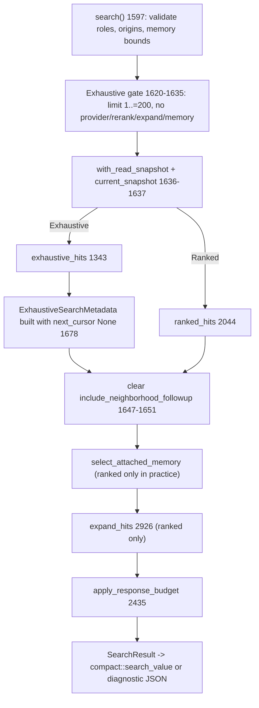
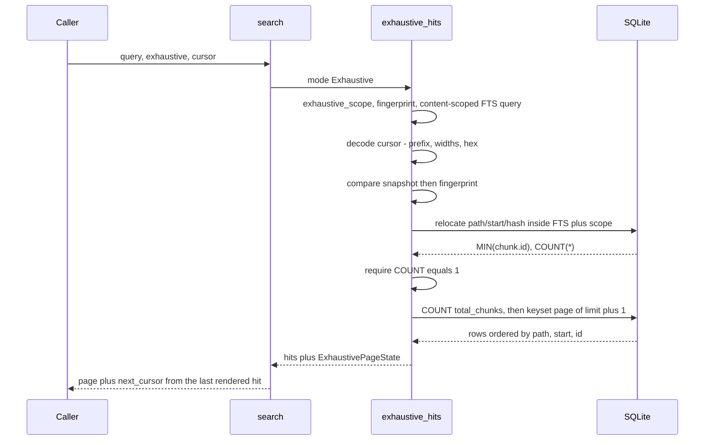
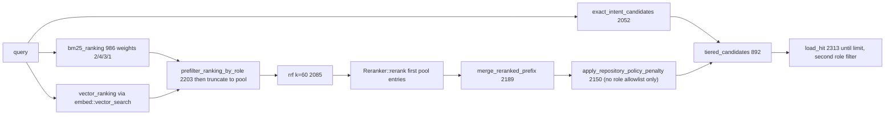

# Retrieval: exhaustive mode, exact identifiers, and hybrid ranking

`search::search` (`src/search.rs:1597`) turns one query string into one byte-bounded JSON envelope along one of two paths. The default is ranked hybrid retrieval: an exact-identifier tier computed before anything else, prepended after BM25 and vector rankings are fused by reciprocal rank fusion, optionally reranked by a cross-encoder and penalized by repository policy. The second path, added by G22, is exhaustive lexical traversal — every chunk whose stored source content matches, deterministically ordered, returned as bare locators with absolute match lines and paged by a cursor that identifies chunks by content rather than by row id. Both paths rejoin for memory attachment, expansion, and the shedding loop that fits the response inside a byte limit, which is why exhaustive mode forbids the ranked stages rather than skipping them. Read at `4de5622`: `src/search.rs` (3,508 lines), `src/search/tests.rs` (2,099 lines, 29 tests), `src/compact.rs`.

## Two modes behind one entry point

`SearchMode` (`src/search.rs:155`) has two variants: `Ranked` (the `Default`) and `Exhaustive { cursor: Option<String> }`. Putting the cursor inside the mode makes it impossible to pass a continuation token without asking for exhaustive traversal. `search()` validates role and origin allowlists, then `memory_graph_depth <= 8` and `memory_graph_node_limit` in `1..=20000` **unconditionally**, and `memory_limit` in `1..=100` only when `include_memory` is set (`src/search.rs:1603-1618`), before matching on the mode.

The exhaustive gate is two bails (`src/search.rs:1620-1635`): `options.limit` must be in `1..=MAX_EXHAUSTIVE_PAGE_SIZE`, and `provider.is_some() || options.rerank || options.expand || options.include_memory` is an error — *"exhaustive search requires vector, rerank, expand, and include_memory to be disabled."* Both callers pre-neutralize the posture rather than tripping that second bail. MCP's `search_options_from_args` errors first if the caller **explicitly** set `vector`, `rerank`, `expand`, or `include_memory` to `true` alongside `exhaustive` (`src/mcp.rs:842-849`), then forces each to `false` when building `SearchOptions` (`src/mcp.rs:851-908`); the CLI does the same with `!exhaustive && resolve_flag(…)` (`src/commands/mod.rs:240-247`). So the posture half is a defensive invariant. The *limit* half is not: `resolve_search_limit` (`src/search.rs:22`) returns an explicit limit unmodified — including `0` or `10_000` — so a typed `limit: 201` reaches `src/search.rs:1623` and is rejected there.

The asymmetry precisely: `resolve_search_limit` clamps only when `requested` is `None` — `None` under exhaustive becomes `configured.min(200)`, `None` otherwise `configured`, `Some(n)` passes through. A repository configured `search.limit = 500` for ranked retrieval still runs exhaustive search at 200-row pages instead of erroring, while a caller who typed a number is told it was not honored (`src/search/tests.rs:974`); nothing in the response distinguishes the two provenances. Neutralization is also partial — only the four posture fields are forced, so a configured `memory_nodes: 0` still fails an exhaustive request that never touches memory.

The diagram below places the single branch; look for `apply_response_budget` sitting downstream of both arms.

`GATE` runs before `SNAP`, so a contradictory request costs no SQLite work. `EX` and `RK` converge at `NFU`; `MEM` and `EXP` are no-ops for exhaustive only because `GATE` guaranteed their flags are false. `META` carries three `#[serde(skip)]` fields into `BUD` so the budget loop can re-derive the cursor without re-querying.

## G22: what an exhaustive page claims, and how it keeps the claim

`exhaustive_hits` (`src/search.rs:1343`) runs a fixed sequence of steps against the read savepoint.

**Scope canonicalization and the fingerprint.** `exhaustive_scope` (`src/search.rs:1159`) calls `normalized_allowlist` (`src/search.rs:1151`), which intersects the caller's roles with `file_role::ALL` and origins with `origin::ALL` *in the canonical constant order*, dropping duplicates; a request naming every role collapses `query_roles` to empty and echoes `SearchScopeFileRoles::All`, serialized as `"all"` (`src/search.rs:175`). `exhaustive_request_fingerprint` (`src/search.rs:1184`) then blake3-hashes a domain tag, the raw query bytes, and those normalized roles (literal `all` when empty) and origins, each NUL-terminated. Canonicalizing first is what makes `["workspace","repository","workspace"]` and `["repository","workspace"]` fingerprint identically (`src/search/tests.rs:887`); it also erases a distinction, since a cursor issued under an explicit six-role allowlist stays valid for a request with no role list and vice versa.

**The FTS query.** `exhaustive_fts_query` (`src/search.rs:469`) is `fts_query_for_column(q, Some("content"))` (`src/search.rs:454`): each identifier-ish token becomes `content:"token"`, OR-joined, so no user input reaches FTS5 as syntax. Ranked BM25 uses the same builder with `column = None` (`src/search.rs:465`), so it also matches the `name`, `symbols`, and `path` FTS columns. Restricting exhaustive to `content` *is* the mode's semantic promise — "every chunk whose source text contains this," not "every chunk whose filename mentions it." The other columns would admit chunks with no textual occurrence, hence no `match_lines` to report, and would make `total_chunks` count something else. Visible consequence: a path-only needle that ranked search answers returns zero exhaustive hits and `total_chunks = 0` (`src/search/tests.rs:993`).

**The count and the page.** A `COUNT(*)` over the same predicate with no cursor term gives `total_chunks` (`src/search.rs:1378-1400`) — the completeness claim for the whole traversal, never re-derived after shedding, so `returned < total_chunks` is normal on every page including the last. The page query (`src/search.rs:1405-1421`) selects `options.limit + 1` rows ordered `file.path, chunk.start, chunk.id` under the keyset predicate `(file.path, chunk.start, chunk.id) > (?7, ?8, ?9)`; `has_more = selected.len() > options.limit`, then truncate. Keyset rather than `OFFSET` because the triple totally orders the match set and an offset would rescan.

### Why cursors are content identity, not row ids

`ExhaustiveCursorPosition` (`src/search.rs:1047`) is `{ path, start, hash }`, `hash` being the chunk's blake3 content hash. `encode_exhaustive_cursor` (`src/search.rs:1232`) emits six dot-separated fields:

| Field | Width | Source |
| --- | --- | --- |
| `jscout-exhaustive-v2` | literal | `EXHAUSTIVE_CURSOR_PREFIX`, `src/search.rs:1044` |
| structural snapshot | 64 hex | `structural::current_snapshot` |
| request fingerprint | 64 hex | `exhaustive_request_fingerprint` |
| path | 2 hex per byte | `encode_cursor_path`, `src/search.rs:1205` |
| start offset | `{:016x}` | `chunk.start` |
| content hash | 64 hex | `chunk.hash` |

Hex-encoding the path byte-by-byte is what lets `decode_exhaustive_cursor` (`src/search.rs:1245`) split on `.` at all — a path containing a dot cannot desynchronize the fields. The decoder rejects a seventh field, a wrong prefix, any wrong field length, or any non-hex digit, all as `"invalid exhaustive search cursor"`, then produces exactly **two** distinguishable failures: `"exhaustive search cursor snapshot changed: expected …, current …"` and `"exhaustive search cursor does not match the query and scope"` (`src/search.rs:1279-1287`). A changed query and a changed scope are indistinguishable; both collapse into the fingerprint message. The `start < 0` guard at `src/search.rs:1294` is unreachable — `i64::from_str_radix` over 16 unsigned hex digits returns `PosOverflow` above `7fff…`.

Row ids are disposable, and `exhaustive_search_pages_the_complete_lexical_chunk_set_and_binds_its_cursor` (`src/search/tests.rs:377`) constructs both failure modes an id cursor would hit. Index a repository with an extra file, remove the file, reindex: the snapshot equals the original, but the old cursor's row id now belongs to a *different* chunk, so an id cursor resumes at the wrong place. Edit a file and revert it exactly: the snapshot is restored, but the old row id no longer exists, so an id cursor fails on a behaviorally equivalent database. Both resume correctly at `c.ts`.

`exhaustive_cursor_position` (`src/search.rs:1304`) re-queries for the chunk matching the FTS predicate **and** `file.path = ? AND chunk.start = ? AND chunk.hash = ?` inside the current scope, requiring `COUNT(*) == 1` and bailing identically on zero (no longer in scope) and on more than one (ambiguous). Snapshot equality is checked first, so this is a within-snapshot relocation, not a resync; it resolves the logical position to a current row id purely so the keyset comparison can use `chunk.id` as tiebreaker. Two chunks in one file with identical start offset and content hash — conceivable for zero-length or duplicated spans — therefore make a cursor unusable rather than ambiguous-but-resolvable.

### Highlighting: marker collision and the losslessness bail

`match_lines` is the exhaustive analogue of a snippet: instead of showing text it names the absolute file lines carrying at least one match. Producing it needs FTS5's `highlight()`, which needs marker strings that cannot occur in source.

`exhaustive_highlight_markers` (`src/search.rs:1079`) starts from `\u{1e}jscout-match-start\u{1f}` and `\u{1e}jscout-match-end\u{1f}` (`src/search.rs:1076-1077`: ASCII record and unit separators bracketing a namespaced literal) and, if *any* selected row's content contains either candidate, appends one `-` to the infix and retries. Termination is guaranteed only by the page being finite — eventually the candidate outgrows every string on it — not by a bound (`src/search.rs:1096-1097`). `exhaustive_match_lines_survive_source_sentinels_and_nul_bytes` (`src/search/tests.rs:1123`) writes the literal sentinel into a source file and still gets the correct line. Collision detection scans the canonical `chunk.content` on `ExhaustiveHitRow` (`src/search.rs:1073`) while `highlight()` runs over the NUL-sanitized mirror — two corpora, safe only because `'\0' -> ' '` cannot synthesize a marker.

`exhaustive_highlights` (`src/search.rs:1102`) issues one `highlight(chunks_fts, 0, ?3, ?4)` over the selected chunk ids and bails if `by_chunk.len() != rows.len()`: *"exhaustive search could not highlight every selected chunk"* (`src/search.rs:1125`), with a redundant per-row repeat at `src/search.rs:1467`. The page query and the highlight query are separate `MATCH` evaluations; if they disagreed about the match set, the mode would emit a hit with empty `match_lines` and quietly break its own completeness contract. Failing the whole request is chosen over a plausible-looking incomplete answer.

`exhaustive_match_lines` (`src/search.rs:1130`) walks the highlighted string counting `\n` bytes between start markers, seeded from `chunk.start_line`, suppressing a line equal to the previous one — so a line with three matches reports once. Uniqueness across the list follows from `highlight()` emitting markers in document order, not from an explicit set. The arithmetic holds only if the FTS mirror's newline positions equal the canonical chunk's: `fts_content` (`src/indexer.rs:676`) replaces embedded NUL with a **space**, not with nothing, because FTS5 indexes text after a NUL but `highlight()` can drop the bytes between it and a later match. `SCHEMA_VERSION = "29"` exists for that change, but only half-rejects: `open_path_read_only` refuses a v28 database (`src/store.rs:78-81`), while the writer sends anything from `DURABLE_SCHEMA_FLOOR = 16` up through `rebuild_legacy_disposable_schema` and restamps (`src/store.rs:143-161`). Consumers reject; the indexer rebuilds.

### The exhaustive hit and its projection

Exhaustive rows build `Hit` with `score: 0.0`, `match_reason: Lexical`, empty `matched_identifiers`/`snippet`/`uses`/`used_by`, and `match_lines: Some(...)` (`src/search.rs:1478-1497`). Anchors come from `project_exhaustive_anchors` (`src/search.rs:2842`), the batched form of per-hit `project_chunk_anchors` (`src/search.rs:2891`), both sharing `select_chunk_anchors` (`src/search.rs:2817`). A missing entry falls back to `vec![file_anchor]` (`src/search.rs:1470`), so an exhaustive hit always has at least one anchor — which is what makes the downstream `anchors.len() <= 1` predicate meaningful.

The complete copy-safe follow-up argument object is granted at most once, on the first page only: `if cursor.is_none() && let Some(hit) = hits.iter_mut().find(|hit| hit.anchors.len() <= 1)` (`src/search.rs:1499-1502`). Continuation pages carry only tool-name lists (`src/search/tests.rs:704`). An agent paging a large set needs the call template once; repeating a full argument object per hit per page would eat the budget the locators need. The cost: an agent resuming from a stored cursor never sees a complete template.

`compact_exhaustive_hit` (`src/compact.rs:288`) renders `at`, `kind`, `match_lines`, one `anchor` or `anchors`, and — unless `locator_only`, and only when `anchors.len() <= 1` — `followups`. It omits `symbol`, `snippet`, `matched_identifiers`, `uses`, `used_by`, `role`, and `origin`; the last two are echoed once at page level in `scope`. Unlike `compact_hit`, which emits `role` for non-production roles and `origin` for dependency files (`src/compact.rs:278-284`), a test-role or dependency exhaustive hit is therefore indistinguishable from a production one at hit level. `search_value` sets `default_match = Lexical` for exhaustive (`src/compact.rs:53`) and inserts `effective`, `scope`, `total_chunks`, `returned`, `truncated`, `next_cursor` into the envelope (`src/compact.rs:74-84`).

### Budget: the locator floor and the binary-searched minimum

`ExhaustiveSearchMetadata` (`src/search.rs:199`) is `#[serde(flatten)]`ed into `SearchResult` (`src/search.rs:235`). Three `#[serde(skip)]` fields exist only for the budget loop: `request_fingerprint`, `selected_positions` (the position triple of every *selected* row, before shedding), and `page_had_more`. `next_cursor` starts as `None`; `refresh_exhaustive_metadata` (`src/search.rs:2410-2433`) recomputes it at the top of every shed iteration as `truncated = page_had_more || returned < selected_positions.len()`, encoding the cursor *when truncated* from `selected_positions[returned - 1]` — the last hit the caller actually receives, so a terminal page that renders everything it selected carries `next_cursor: None`. That is what makes shedding safe: dropping a page's tail rewinds the cursor to the last rendered hit, so no chunk is skipped. `exhaustive_budget_locator_floor_advances_from_the_last_rendered_hit` (`src/search/tests.rs:728`) requests `limit: 3`, renders only `a.ts`, and asserts the continuation returns exactly `["b.ts","c.ts","d.ts"]`.

`ResponseBudget.exhaustive_locator_only` (`src/search.rs:338`, `#[serde(skip)]`) is a whole-response flag rather than per-hit state: `search_value` passes it to every `compact_exhaustive_hit`. In the shed order it sits between the compact followup-argument step — which clears `include_followups` only on hits with `anchors.len() <= 1`, matching the emission guard (`src/search.rs:2536-2544`) — and the pop-a-hit step (`src/search.rs:2566`). Once the complete handoff is gone, all remaining tools-only hints go at once, before any locator is dropped. Its guard requires `compact`; diagnostic JSON has no followups projection, so that transport falls through to hit-popping and reports a different floor at the same byte limit. The comment at `src/search.rs:2548-2553` states the invariant: an exhaustive page keeps at least one *complete* locator or fails, and anchors are never truncated — `src/search.rs:2590` guards anchor-popping with `result.exhaustive.is_none()`, because a shortened anchor is not an exact handle.

`apply_response_budget` (`src/search.rs:2435`) clones the pre-shed result when exhaustive, runs `apply_response_budget_once`, and on failure returns the typed `ResponseBudgetTooSmall { byte_limit, minimum_bytes }` (`src/search.rs:215`); ranked search still gets an untyped anyhow error (`src/search.rs:2453-2455`). Nothing in production downcasts the type — `downcast_ref::<ResponseBudgetTooSmall>` appears only in `src/search/tests.rs` — so at the MCP boundary the floor travels inside its `Display` text, `response_budget_too_small: … minimum_bytes=M`. `minimum_exhaustive_response_bytes` (`src/search.rs:2743`) computes that floor by **binary search over byte limits**: prove feasibility at `usize::MAX`, then bisect `[1, rendered_at_max]`, re-running the full shedding pass on a fresh clone of the *pre-shed* baseline at each probe. A single measurement cannot work, for two reasons pinned by `exhaustive_budget_floor_handles_terminal_and_diagnostic_envelopes` (`src/search/tests.rs:799`): a terminal page can *grow* when a hit is shed, because shedding adds an opaque `next_cursor` and omission accounting, so rendered size is not monotone in retained hits; and diagnostic JSON serializes `byte_limit` itself, so the floor must account for the digits the retry introduces. Cloning before shedding also makes the initial full response and the empty response candidates (`src/search/tests.rs:853`). Every budget test asserts the tight boundary: retrying at exactly `minimum_bytes` succeeds with `rendered_bytes == minimum_bytes`, `minimum_bytes - 1` fails reporting the same floor. The price is `O(log N)` deep clones of a possibly 200-hit `SearchResult`, and `byte_limit == 0` is only noticed after all retrieval has run (`src/search.rs:2436-2438`).

Measuring "rendered size" is itself a fixed point, because `rendered_bytes` is a serialized field of the thing being measured. `settle_rendered_bytes` (`src/search.rs:2698`) iterates up to 8 times; `settle_search_response` (`src/search.rs:2712`) wraps it in another 8-iteration loop for diagnostic mode, where `transport_sections` (from `compact::search_section_bytes`, `src/compact.rs:23`) is also serialized; `capture_unbudgeted_bytes` (`src/search.rs:2729`) wraps *that* in a third — three nested loops in diagnostic mode, one in compact. Placeholder widths are unacceptable (`src/search.rs:2708-2711`) because the advertised retry floor must be the exact transport the caller receives.

## G17: the exact-identifier tier

`ranked_hits` (`src/search.rs:2044`) computes `exact_intent_candidates` (`src/search.rs:2052`) *before* BM25. The exact pool never passes through RRF, the reranker, or the policy penalty; `tiered_candidates` (`src/search.rs:892`) prepends it at the very end. RRF discards magnitudes, so a "boost" for an exact name match would still be a rank nudge outvotable by an embedding among 50-250 candidates; a hard partition is used instead. The consequence: `Hit.score` stops being a ranking key — an exact-only chunk reports `score: 0.0` (`src/search.rs:978`) while ranked first.

Token admission (`exact_intent_tokens`, `src/search.rs:473`): a query reducing to exactly one legal identifier admits it unconditionally; otherwise every token must also be *code-shaped* per `is_code_shaped_identifier` (`src/search.rs:515`) — leading or embedded `_` or `$`, a leading uppercase, or any non-initial uppercase. The occurrence cap is `per_identifier_limit` for a single-identifier query and **1** otherwise (`src/search.rs:544-548`), so exact coverage inside ranked mode is depth-capped. Occurrences are fetched at the full limit, filtered against the definition set, and only then truncated (`src/search.rs:565-573`); truncating first could surface the one row that is also a definition, filter it, and leave zero occurrences.

`exact_definition_chunks` (`src/search.rs:583`) unions `chunk.name = ? COLLATE BINARY` with symbols joined to their containing chunks and sorts by `(name_priority, export_priority, span, path, start, id)`. `exact_occurrence_chunks` (`src/search.rs:698`) unions `refs.target_name`, `member_calls.prop`, and `entity_sites.target_name`; when that returns fewer than `limit` rows, FTS5 acts as a bounded generator — `limit * 32` clamped to `[32, 4096]` (`src/search.rs:780`) — whose candidates must pass `contains_code_identifier` (`src/search.rs:807`), a six-state byte lexer (Code, single/double/template quote, line/block comment) requiring the match in Code state with non-identifier bytes on both sides. That lexer models neither regex literals, JSX text, nor `${}` substitutions: an apostrophe in a regex or in JSX prose flips it into the single-quoted state and swallows the following code. It gates only the FTS fallback; the structured union is admitted unchecked. `append_exact_tier` (`src/search.rs:949`) iterates depth-major, so every identifier contributes its first definition before any contributes a second.

## The hybrid tail

`EX` is computed first and consumed last: `BM` through `PP` produce the hybrid remainder that `TC` appends *behind* the exact tiers. `candidate_pool_limits` (`src/search.rs:2176`) sets `pool = limit.max(10) * 5` and quadruples the vector pool under a role allowlist, because sqlite-vec applies `k` before the joined file role is visible and a selective filter would otherwise starve the vector leg and tilt RRF toward BM25. `embed::vector_search` (`src/embed.rs:1713`) runs one `MATCH … AND k = limit` per origin, converts distance to `1.0 - distance`, merges and re-truncates; failure degrades `RetrievalStatus` rather than failing the search. `rrf` (`src/search.rs:1589`) sums `1/(60 + rank + 1)`. `Reranker::rerank` (`src/search.rs:1545`, private) serializes candidate ids as **strings** and parses them back via `as_str()?.parse()` — a numerically-typed id is silently dropped by `filter_map` and then trips the exactly-once check (`src/search.rs:1574-1577`). Failure sets `reranker=degraded` and keeps RRF order; the 125-second client timeout (`src/search.rs:1556`) elapses with the read savepoint open.

The tier partition is less absolute than it sounds: `tiered_candidates` (`src/search.rs:902-913`) stably re-sorts each identifier's *occurrence* list by hybrid position, so reranker and policy judgement move chunks *within* the tier while never moving one out of it. Definitions keep SQL priority order, on the theory that the reranker knows nothing better than "named, exported, tightest span" — two adjacent tiers with different ordering philosophies and no output field saying which produced a position. `ranked_hits` also applies a *second* role filter after `load_hit` (`src/search.rs:2135-2137`), on top of the SQL predicate and `prefilter_ranking_by_role`.

## Constants

| Constant | Value | Site |
| --- | --- | --- |
| `MAX_EXHAUSTIVE_PAGE_SIZE` | 200 | `src/search.rs:13` |
| `DEFAULT_RESULT_LIMIT` | 10 | `src/search.rs:12` |
| `DEFAULT_RESPONSE_BYTE_LIMIT` | 24_000 | `src/search.rs:11` |
| memory graph depth, default / max | 2 / 8 | `src/search.rs:14,16` |
| memory graph nodes, default / max | 2_000 / 20_000 | `src/search.rs:15,17` |
| `DEFAULT_TOTAL_RENDERED_SUPPORT_LIMIT` | 8 | `src/search.rs:18` |
| expansion paths, default / max | 8 / 50 | `src/search.rs:19,20` |
| memory result limit | `1..=100` | `src/search.rs:1617` |
| `EXHAUSTIVE_CURSOR_PREFIX` | `jscout-exhaustive-v2` | `src/search.rs:1044` |
| `EXHAUSTIVE_MATCH_START` / `_END` | `\u{1e}jscout-match-start\u{1f}` / `…-end…` | `src/search.rs:1076-1077` |
| cursor field widths | 64 / 64 / 2·len(path) / 16 / 64 hex | `src/search.rs:1232,1269-1284` |
| BM25 column weights (content, name, symbols, path) | 2.0, 4.0, 3.0, 1.0 | `src/search.rs:998` |
| RRF `k` | 60.0 | `src/search.rs:1589`, called at `src/search.rs:2085` |
| candidate pool | `limit.max(10) * 5`, ×4 for vectors under a role filter | `src/search.rs:2176-2185` |
| reranker pool / default `top` / `max_chars` | `top.min(100)` / 50 / 4000 | `src/search.rs:1540`, `src/config/load.rs:686,716` |
| reranker deadline / client timeout | 120_000 ms / 125 s | `src/search.rs:1549,1556` |
| exact FTS fallback window | `limit * 32` clamped to `[32, 4096]` | `src/search.rs:780` |
| mixed-query occurrence cap | 1 | `src/search.rs:544-548` |
| policy penalties (runtime/tooling/documentation/test/generated) | 1.0 / 0.45 / 0.4 / 0.3 / 0.1, divided by `rank + 1` | `src/recon.rs:638-646`, `src/search.rs:2158` |
| snippet shed step | `max(overshoot, 128)` bytes | `src/search.rs:2610` |
| serialization fixed points | 8 rounds, nested ×3 in diagnostic mode | `src/search.rs:2698,2712,2729` |
| `SCHEMA_VERSION` / `DURABLE_SCHEMA_FLOOR` | 29 / 16 | `src/store.rs:8,9` |

## Limits worth naming

A cursor plus a query that compiles to an empty FTS expression is a hard error (`src/search.rs:1356`), while the same empty query with no cursor returns an empty page with `total_chunks = 0` (`src/search.rs:1364-1374`) — one input, two outcomes, decided by paging state. A zero-match page is a valid, non-truncated response, so the "one complete locator or fail" invariant binds only pages that had hits. The MCP tool `semantic_search` (`src/mcp.rs:486`) declares only `"minimum": 1` for `limit`; the 200 ceiling lives in its description string and is enforced solely at `src/search.rs:1623`, unlike sibling tools that declare real maxima. Every G22 compact-projection assertion lives in `src/search/tests.rs` — `src/compact/tests.rs` (815 lines, 16 tests) has none.
