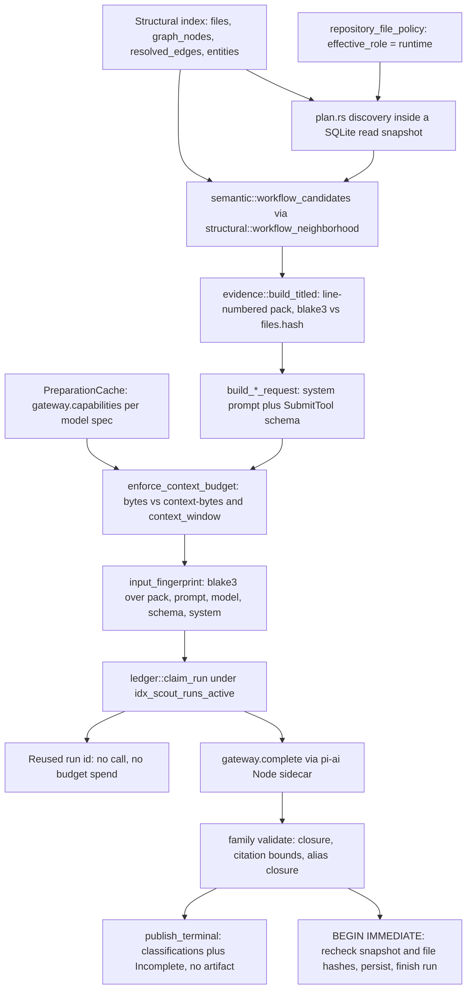
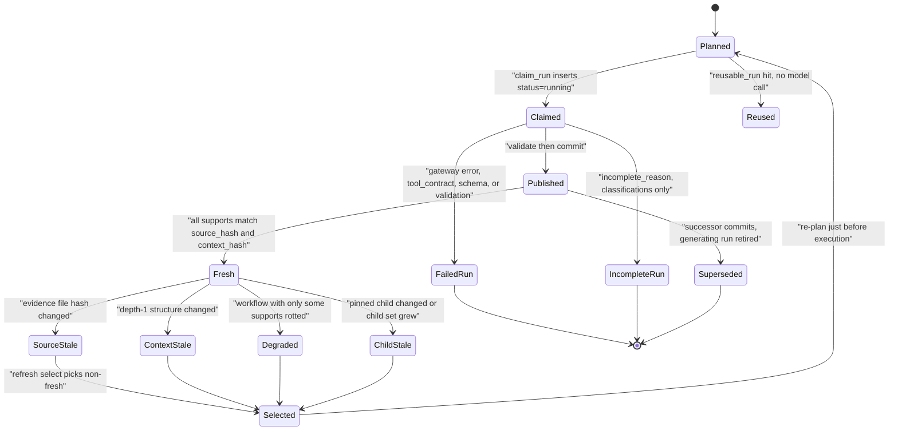

# Scouting: LLM-derived semantic artifacts

Scouting is the part of jscout that spends money. Everything else — parsing, the entity graph, the call graph, chunking, embeddings — is derived deterministically from source and can be thrown away and rebuilt. Scouting instead sends bounded slices of that index to a language model through the pi-ai gateway sidecar and stores the prose that comes back as *semantic artifacts*: symbol cards, workflow classifications, hierarchical summaries, domain concepts, and (in a separate, non-artifact form) repository role classifications. The governing rule, stated in the module header at `src/scouting/mod.rs:1-6`, is that the model may explain a candidate set but never extend it — "candidate expansion is a Rust change, not model improvisation." Every family runs the same four stages, plan → prepare → execute → publish, with a JSON-Schema submit tool whose enums are built from the planner's output and a Rust validator that repeats every constraint and is authoritative regardless of what the schema accepted.

## The five families at a glance

| Family | Module | Prompt version | Submit tool | Subject identity | Persisted to |
|---|---|---|---|---|---|
| Repository classification | `src/scouting/repository.rs` | `repository-recon/v2` | `submit_repository_classification` | package / directory area / TS project | `repository_classifications` plus `repository_file_policy` |
| Workflow | `src/scouting/workflow.rs` | `workflow-scout/v1` | `submit_workflow_classification` | a seed set and its candidate closure | artifacts + supports |
| Card | `src/scouting/card.rs` | `card-scout/v1` | `submit_symbol_card` | one symbol anchor | artifacts + supports |
| Summary | `src/scouting/summary.rs` | `summary-scout/v1` | `submit_scope_summary` | `file:<path>` / `module:<pkg>` / `repo` | artifacts + supports + `summarizes` relations |
| Concept | `src/scouting/concept.rs` | `concept-scout/v1` | `submit_concept` | an NFKC-normalized vocabulary string | artifacts + `related_to` relations, no supports |

Prompt versions and tool names are constants at `src/scouting/card.rs:16`, `src/scouting/concept.rs:21`, `src/scouting/workflow.rs:15`, `src/scouting/summary.rs:17`, `src/scouting/repository.rs:30`; the tables themselves are described in [05-storage-schema.md](05-storage-schema.md). The repository family is the odd one out in every dimension: it writes immutable policy rows rather than artifacts, has no supersession lineage, runs its own execute loop, and is the only family whose output feeds back into the *planning* of the other four. Nothing in `src/mcp.rs` or `src/agent.rs` references `scouting::` — scouting is CLI-only, so no MCP tool or agent turn can trigger a call that costs money.

## The pipeline

The diagram traces one card or workflow subject from the structural index to a committed artifact. Watch where the gateway first appears (PREPARE, not EXECUTE), and the two places a subject leaves without an artifact but with a ledger row.



Two nodes contradict a natural reading of the module's own docs. `src/scouting/plan.rs:1-3` says planning "never starts the gateway and never makes a model call" — true of PLAN, but PREPARE does call it: every `prepare_*` goes through `PreparationCache::model` (`src/scouting/mod.rs:207-254`), which issues one `capabilities` round-trip per distinct model spec so the context window and `max_tokens` cap are real numbers rather than guesses. And CLAIM sits *before* CALL deliberately: a `scout_runs` row in `running` state exists before any bytes leave the process, so a crash leaves an attributable row that `sweep_orphaned_runs` reclaims after 24 hours (`ORPHAN_SWEEP_MINUTES` at `src/scouting/mod.rs:38`, swept at the top of every batch entry point including `src/scouting/repository.rs:1022`).

## Repository reconnaissance

`jscout scout repository` classifies subjects, not symbols: workspace packages and directory areas discovered from the index, plus TypeScript projects enumerated by launching the checker sidecar as a child process — `crate::checker::launch`, then `capabilities`, then `plan_members` over the file list in chunks of 512 (`src/scouting/repository.rs:373-411`), gated by `--checker-timeout` and `--sidecar-path` (protocol details in [09-sidecars.md](09-sidecars.md)).

Evidence is a JSON pack rather than numbered source: aggregate language/chunk/surface counts plus up to `REPRESENTATIVE_FILE_LIMIT` = 8 evenly spread members' outlines, module boundaries, entities and on-disk configuration files, each item labeled `E001`, `E002`, … (`src/recon.rs:14`, `src/scouting/repository.rs:551`). The submit tool takes one role from `recon::ROLES` — `runtime`, `tooling`, `documentation`, `test`, `generated`, `mixed`, `unknown` — plus a confidence, a 3–600 character explanation, and citations restricted to those `E###` ids (`src/scouting/repository.rs:160-187`). `validate` re-checks the role, forces `unknown` to `possible`, rejects unknown citation ids, and repairs duplicates and excess citations (`src/scouting/repository.rs:189-248`). Per-file heuristic role labels are deliberately withheld so the model cannot launder the existing heuristic back as independent evidence.

A `mixed` verdict means "this subject is not one thing." Rather than accept a coarse label, `execute` subdivides into immediate child directories plus a `:direct` residual subject for loose files, sorts children by descending member count, and pushes them to the *front* of the work queue (`src/scouting/repository.rs:1076-1136`) — the parent already established that its classification is insufficient, so refining it should beat unrelated pending subjects for the remaining budget. `--max-depth` (default 3) and `--max-subjects` are the only brakes, and hitting either sets `auto_limit_reached` rather than failing. A subject that blows `--context-bytes` is skipped *and still subdivided* (`src/scouting/repository.rs:1041-1058`), making repository the only family where a budget skip makes forward progress.

Repository runs deviate from the shared pipeline in four ways. They publish through `recon::persist_classification`, so `artifact_id` is always `None`, with no artifact fingerprint, supersession or successor lineage. Their pre-publication check is not `semantic::validate_annotate_input` but a re-derivation of the subject's `evidence_fingerprint` (`src/scouting/repository.rs:1266-1298`); on drift they record `Incomplete`/`inputs_changed` and return `Ok`, where the workflow path returns `Err` and aborts. Deserialization and validation fold into one arm with error code `validation` — there is no `schema` code here. And they carry a second reuse mechanism independent of the run ledger: `current_classification` matches `(subject_key, evidence_fingerprint)` against completed runs (`src/scouting/repository.rs:508-533`). `repository::plan` also does not open a read snapshot, unlike the four planners in `src/scouting/plan.rs`.

The payoff is the feedback edge. At the end of `execute`, `recon::reconcile_file_policy` rebuilds the disposable `repository_file_policy` projection (`src/scouting/repository.rs:1093`), whose `effective_role='runtime'` is what `plan::automatic_seeds` and `plan::automatic_card_subjects` use to decide which files are worth scouting, and what `recon::effective_runtime` uses to filter workflow candidates (`src/semantic.rs:303-308`). Only fresh, `likely` scope classifications reach it — stale, `possible`, `mixed` and `unknown` results never hide or penalize a file (`src/store.rs:683-685`).

## Workflow: candidate closure

A workflow artifact answers "what is this cross-file path, and which of these symbols are load-bearing in it?" The candidate set is computed before the model sees anything. `semantic::workflow_candidates` (`src/semantic.rs:258-354`) resolves each seed to a current anchor, then delegates to `structural::workflow_neighborhood` — a best-first heap expansion over logical steps with confidence, relation and hub floors, distance decay, a runtime-boundary crossing bonus and high-degree hub suppression, bounded by `WORKFLOW_TRAVERSAL_NODE_LIMIT` = 100 and `WORKFLOW_TRAVERSAL_EDGE_LIMIT` = 400 (`src/semantic.rs:16-17`). Non-symbol and non-runtime nodes are dropped, the rest sorted seed-first then by relevance and truncated to `candidate_limit ≤ MAX_WORKFLOW_CANDIDATES` = 31 (`src/semantic.rs:15`).

Both truncation flags matter. `src/scouting/plan.rs:113` skips a seed group when `traversal_truncated || candidate_truncated` — exhausting the node/edge budget is an independent failure from exceeding the candidate cap, and either means the neighborhood was only partially explored. In explicit mode that is a `bail!`; in automatic mode a reported skip. The submit tool pins `anchor` to a literal `enum` of the candidate anchors and encodes the included-versus-excluded shapes as a `oneOf` (`src/scouting/workflow.rs:28-105`); the comment at `src/scouting/workflow.rs:24-27` is explicit that models comply better when the schema forbids the invalid shape, but Rust validation remains authoritative. `workflow::validate` requires every candidate to be classified exactly once — no duplicates, no omissions — and at least one to be `defining`. Every decision, exclusions included, goes to `scout_classifications`; exclusions never become supports, so they are diagnosis rather than evidence.

## Card: one claim, one citation set

A card describes one symbol whose identity came from the index. `CardSubject` (`src/scouting/card.rs:34-41`) carries the anchor, display name, file and declaration line range; the model chooses nothing about the subject. Every schema field is a `{text | term, evidence[]}` pair built by `claim_schema` (`src/scouting/card.rs:105-131`), so an unsupported claim is not expressible. `purpose` is the only required claim, nullable only alongside `incomplete_reason`; `architectural_role`, `domain_terms`, `side_effects`, `invariants` and `failure_modes` are optional and the prompt instructs the model to *omit* rather than guess them (`src/scouting/mod.rs:2798-2812`). Omitted fields stay out of the body entirely (`src/scouting/card.rs:444-474`) — an empty array would otherwise become a claim path with nothing supporting it. The prompt also forbids restating signatures, deterministic entities, or the depth-1 edges shipped as context, on the grounds that those are already indexed.

Citation repair is where ordering is load-bearing. `claim` (`src/scouting/card.rs:404-443`) hard-fails above `MAX_RANGE_REPAIR_INPUT` = 12 submitted ranges, deduplicates in model order, and returns the *full* deduplicated list. Only after `validate` has checked every deduped range against the subject file's line count does `repair_claim` (`src/scouting/card.rs:398-402`) truncate to `MAX_RANGES_PER_CLAIM` = 4. Reversing those steps would let an out-of-file fifth range be silently dropped instead of failing the card; the test at `src/scouting/card.rs:579-599` holds that ordering. Three constants interact and only a comment documents the dependency.

## Summary: bottom-up over artifacts

Summaries never read source. `summary::SummaryChild` (`src/scouting/summary.rs:41-52`) carries a `C1…Cn` reference, the child's id, name, body JSON, confidence, and its `artifact_fingerprint` pinned at planning time; the schema's `children` arrays are enums over those references (`src/scouting/summary.rs:98-116`). File summaries take current cards and workflows attached to every file their supports cite; module summaries take current file summaries grouped onto workspace packages; the repository summary takes module summaries plus file summaries no package owns.

The hierarchy is gated on lower-level completeness, strictly. `discover_summary_scopes` (`src/scouting/plan.rs:1298`) gates a module when any child-bearing file it owns lacks a current file summary, or when an existing file summary no longer covers that file's current child set; the repository scope is gated the same way over modules. One missing file summary gates a whole module; one un-summarized module gates the whole repository scope. The rationale (`src/scouting/plan.rs:1360-1366`) is that a hierarchy publishing around a missing scope produces an overview confidently wrong about the part it never saw. The cost is that with a small `--max-calls` budget the top may never become reachable, and the reason surfaces only as one gate-skip string. In automatic mode gates attach to the plan as skips; in explicit mode the same condition becomes a `bail!`.

Scopes are refused whole rather than truncated: `MAX_SUMMARY_CHILDREN` = 64, raised to `MAX_REPOSITORY_CHILDREN` = 256 for the repository level (`src/scouting/plan.rs:1149-1153`, where the comment notes n8n alone has 77 workspace packages). Truncating a child set would publish prose that silently omits evidence; the tradeoff is that a large monorepo scope can be permanently un-scoutable. Every planned child becomes a `summarizes` relation and — cited or not — a whole-artifact input dependency with an empty `claim_path`: the model saw it and chose what to keep, so its later change must stale the parent.

## Concept: deterministic identity, exhaustive aliases

A concept's identity is a string, not an anchor. `concept::normalize` (`src/scouting/concept.rs:39-41`) applies NFKC, lowercases, and collapses whitespace, deliberately preserving punctuation — `invoice-id` and `invoice id` stay different concepts until an independently validated merge says otherwise. `NORMALIZER_VERSION` (`src/scouting/concept.rs:23`) is hashed into the input fingerprint so a normalizer change invalidates every concept run. Vocabulary is admitted from exactly two pointers: a current workflow's `/name`, and a current card's `/domain_terms/<i>`. `add_vocabulary_claim` (`src/scouting/plan.rs:722-734`) returns early when the supports list for that exact JSON pointer is empty — "Unsupported prose is not vocabulary." Groups over `MAX_CONCEPT_CHILDREN` = 64 children, 32 aliases or 160 supports are refused whole (`src/scouting/plan.rs:309-316`), since splitting one would create several artifacts sharing a deterministic identity.

Alias handling is mechanical rather than a judgment call. `concept::validate` (`src/scouting/concept.rs:355-401`) requires each returned alias to normalize to the canonical key, to be an enumerated source spelling, to appear exactly once, and — the strict part — to cite *precisely* the set of source artifacts observing that spelling, no more and no fewer; any observed spelling the model omits fails the whole run with a closure error. Because providers return exhaustive sets in arbitrary order, validation then sorts aliases and builds a `path_remap` from submitted `/aliases/<old>` to canonical `/aliases/<new>`, rewriting the model's candidate claim paths in place (`src/scouting/concept.rs:405-445`) so provider ordering cannot perturb the artifact fingerprint. Any future concept claim family using indexed pointers must be added to that remap or its fingerprints will vary run to run.

Concepts store no source spans of their own. Exact coordinates stay on the child artifacts and reach the concept through `related_to` relations; copying a vocabulary span onto an LLM-written definition would erase the semantic hop and overstate what that source line proves.

## Evidence anchoring

Anchoring means three mechanisms, all deterministic. The pack: `evidence::build_titled` (`src/scouting/evidence.rs:43-111`) reads each candidate file from disk, compares its blake3 against the indexed `files.hash`, bails with "changed since indexing" on drift, then renders an anchor listing plus each file as `%5d | line` numbered source with entity annotations, recording each file's line count in `EvidencePack.files`. The schema: anchors, child references and source references are literal enums. The validators: card citations must fall inside the subject file's recorded line count, summary and concept claims must cite planned references, and every claim must carry at least one citation.

Card packs also append `evidence::structural_context` — depth-1 in/out resolved edges, capped at `CONTEXT_EDGES_PER_DIRECTION` = 40 per direction (`src/scouting/evidence.rs:113-180`). That block is explicitly non-citable, because only the subject's declaring file ships as numbered source; nothing in the schema stops a model citing a line it inferred from it, and only the line-count bound catches obvious cases. It is concatenated into the pack's `rendered` string, so it participates in `card_input_fingerprint` — a change in a subject's neighbours re-runs the card even though those edges can never be cited.

## The run ledger and input fingerprints

`src/scouting/ledger.rs` is the cost-accounting and concurrency core. A partial unique index makes "one live claim per input" a database invariant across processes:

```sql
CREATE UNIQUE INDEX idx_scout_runs_active
  ON scout_runs(scout_kind, input_fingerprint)
  WHERE status IN ('running', 'completed');
```

(`src/store.rs:645-649`.) `claim_run` (`src/scouting/ledger.rs:72-153`) opens its own `BEGIN IMMEDIATE`. It first retires any completed run whose artifact already has a successor — that run still occupies the unique slot but must not satisfy reuse, and retiring it is what makes an A→B→A revert republish correctly. It then either supersedes (under `--rebuild`), returns `Reused(run_id)`, or inserts a `running` row; a constraint violation on the insert means a concurrent process owns these inputs and the call fails loudly rather than duplicating a paid request. `reusable_run` (`src/scouting/ledger.rs:174-194`) deliberately treats a completed run with *no* recorded artifact as reusable, since refusing it would leave the unique slot occupied forever — so an artifact deleted out of band makes that run reuse-as-success permanently, returning `artifact_id: None` every time.

Input fingerprints are per-family blake3 digests, and the differences are load-bearing:

| Family | Hashes | Snapshot? |
|---|---|---|
| Workflow (`src/scouting/mod.rs:2954`) | candidate snapshot, joined resolved seeds, candidate fingerprint, rendered pack, prompt version, model, reasoning, tier, base_url, protocol, max_tokens, tool schema, system prompt | Yes |
| Card (`src/scouting/mod.rs:2993`) | anchor, file, rendered pack, then the same tail | No |
| Summary (`src/scouting/mod.rs:2727`) | scope key, level, rendered pack, then the same tail | No |
| Concept (`src/scouting/mod.rs:2763`) | canonical name, rendered pack, normalizer version, then the same tail | No |

The three snapshot-free fingerprints carry doc comments saying why (`src/scouting/mod.rs:2988-2992`, `2722-2726`, `2760-2762`): the rendered pack already pins the subject's file content, its depth-1 context, or every child body and fingerprint, so an unrelated repository edit must reuse the completed run instead of buying an identical card again. The `source_snapshot` column and the publication-time recheck carry the provenance and safety the fingerprint no longer does. Workflow keeps the snapshot because its candidate set is a graph traversal any edit can change. Reuse is checked *before* the call budget in every batch loop (`src/scouting/mod.rs:806-812`; `src/scouting/repository.rs:1065-1069`) — `--max-calls` is a spend limit, and charging a free reuse against it would make repeated runs of the same command produce fewer artifacts each time.

## Budgets and failure routing

`reserve_output_and_measure` (`src/scouting/mod.rs:2904-2917`) sets `max_tokens = 2048 + 512 × output_units`, clamped by the model's reported `max_tokens`, then serializes the request and returns its byte length. `enforce_context_budget` (`src/scouting/mod.rs:2919-2952`) fails with `ContextBudgetExceeded` when those bytes exceed `--context-bytes` (default 240 000), and again when bytes plus reserved output exceed the model's context window — using UTF-8 byte length as an upper bound on input tokens, because pi-ai exposes no common tokenizer and an average bytes/token divisor undercounts punctuation-heavy code. It is roughly 3–4× conservative, so packs that would fit are refused on smaller-context models, and the error quotes a "token" count that is really a byte count. Automatic mode converts the error into a reported skip; explicit mode propagates it. `--dry-run` shares the measurement function but not identical arithmetic: `dry_run_report` passes no `max_tokens` cap (`src/scouting/mod.rs:517-521`), so when a real run would clamp the reservation `request_bytes` differs; dry run also skips the context-window and reuse checks, and says so in its `notes` array.

Gateway failures route through a block duplicated verbatim in four executors and once more in `src/scouting/repository.rs`. `GatewayError::Canceled` selects `RunOutcome::Canceled` for the ledger row and everything else selects `Failed`, but the status does not decide the batch — the `remote_timeout` guard does (`src/scouting/mod.rs:3220-3222`). Only `GatewayError::Remote` with `code == "timeout"` returns a subject-local failed report and lets the batch continue; everything else, cancellation included, returns `Err` and aborts. The comment at `src/scouting/mod.rs:1124-1132` explains: a remote timeout means the gateway aborted one request and sent a correlated terminal frame, so the connection stays synchronized, whereas the local frame-deadline `Timeout` loses request correlation and would mis-attribute later responses — and before that distinction existed, one slow card killed 98 already-published artifacts. It rests on a provider-supplied string, so a gateway that renames the code turns every slow request back into a batch abort.

## Publication

`semantic::validate_annotate_input` (`src/semantic.rs:641-778`) re-checks snapshot equality, supersession legality, exact current anchors, anchor-to-file agreement, on-disk file hash currency, span bounds, and that no support is more confident than the artifact. It does *not* see relations — that contract is checked separately by `validate_relation_contract`, called from `persist_validated_artifact`. Then a `BEGIN IMMEDIATE` transaction re-checks `structural::current_snapshot` and every evidence file's indexed hash, runs family-specific rechecks, persists artifact + supports + relations, retires the predecessor's generating run, records classifications, and finishes the run — one commit. Any recheck failure rolls back, records `Incomplete`/`publication_recheck` separately, and writes nothing partial.

The transaction is also where predecessor resolution happens for cards and summaries: `annotate_input.supersedes` is *assigned* inside it when `None` (`src/scouting/mod.rs:1600-1614`, `2552-2566`), because "one current artifact per subject" rests on a unique partial index on `supersedes_artifact_id` (`src/store.rs:777-779`) and resolving earlier would let a concurrent publisher slip a second current artifact in beside it. Concepts cannot use that trick: they pin their predecessor before the call, re-check the lineage right after `claim_run` (`src/scouting/mod.rs:1780-1789`), and compare `current_concept_for_key` against the planned predecessor inside the transaction, bailing on mismatch — a same-name concept published mid-flight is a result this run never planned against. The asymmetry means the concept path can `bail!` where the card path merely rolls back.

## Lifecycle, freshness, and refresh

The state machine covers one semantic artifact and its generating run together. `incomplete` and `failed` are terminal for the run but release the input fingerprint; `completed` holds it.



Staleness is computed in `src/semantic.rs`, not in scouting. Each support stores `source_hash` and `context_hash`; a changed file makes it `source-stale`, changed depth-1 structure `context-stale` (`src/semantic.rs:1577-1584`). An artifact with all-fresh supports is fresh; a *workflow* with some fresh supports degrades rather than stales; everything else stales. `child_adjusted_freshness` (`src/semantic.rs:1637-1700`) folds in the `dst_fingerprint` pinned on every relation — a missing, superseded or changed child stales the parent, a merely degraded child degrades it — plus two set-membership checks no fingerprint can catch: the `ChildStale` edge above also fires when a summary's scope gains a new child, or a concept's vocabulary group gains a matching card, even though every pinned child is intact.

`refresh::select` (`src/scouting/refresh.rs:60-145`) is correspondingly simple: current, model-generated `workflow`/`card`/`summary`/`concept` artifacts, minus the fresh ones, minus those whose `config_json` no longer parses through `replay_config` (`src/scouting/refresh.rs:149-170`). No family-specific staleness rule appears in `src/scouting/refresh.rs` at all. Artifacts predating stored replay configuration are reported as `unsupported_legacy`; an explicitly requested id that is not a current generated artifact is a `bail!`, not a skip. `RefreshConfig` stores the deterministic *input* — seeds, anchor, scope key, normalized term — never resolved child ids, so refresh rebuilds the current child set rather than replaying a stale one.

`scout_refresh` (`src/scouting/mod.rs:721-870`) sorts targets card/workflow → file summary → module summary → repository summary → concept, then re-plans each immediately before executing it: a summary prepared against a child the same command is about to replace would reuse its own stale run, so just-in-time planning lets parents see successors published moments earlier. The cost is that preparation cannot be batched or overlapped with model latency. Repository classifications have no refresh path at all — `refresh::select` never queries them, so they go stale silently until a fresh `jscout scout repository` run reclassifies. Two user-facing messages are out of step with the code: `src/main.rs:2031` prints "cannot refresh pre-G5 artifacts", leaking an internal gate label, and `src/main.rs:2037` omits concepts from "no stale or degraded generated workflows, cards, or summaries to refresh", which refresh does handle. Staleness under the watcher is covered in [11-incremental-and-watch.md](11-incremental-and-watch.md).

## CLI surface and exit semantics

The full flag inventory lives in [10-cli-and-mcp.md](10-cli-and-mcp.md); what matters here is how subjects are chosen and how the budget is spelled.

| Subcommand | Subject selection | Call budget |
|---|---|---|
| `scout repository` | automatic | `--max-calls` required, accepts `all`; also `--max-subjects`, `--warn-subjects` 512, `--max-depth` 3 |
| `scout workflows` | `--seed` repeatable, else automatic | required without `--seed`; `--depth` 2, `--candidate-limit` 31 |
| `scout cards` | `--anchor` repeatable, else automatic | required without `--anchor`; one run per anchor |
| `scout summaries` | `--level` plus `--scope`, else all three levels bottom-up | required; spans all levels |
| `scout concepts` | `--term` repeatable exact term, else automatic | required without `--term` |
| `scout refresh` | `--artifact` repeatable, else all non-fresh | required; retains each run's original model and config |

All six accept `--model`, `--reasoning` (falling back to `JSCOUT_LLM_REASONING`), `--service-tier`, `--timeout` (300 s), `--context-bytes` (240 000), `--rebuild`, `--dry-run`, `--database` and `--gateway-path` (`src/main.rs:524-766`). `scout_batch_exit` (`src/main.rs:2049-2062`) fails the process when any subject's status is `failed`; incomplete refusals, budget skips, over-context skips and unresolvable skips exit zero, so scripts can key on exit status without treating a model's honest refusal as an error.

## Where the complexity concentrates

`src/scouting/mod.rs` is 6523 lines, of which roughly half (from line 3277) is 42 integration tests driving a scripted fake gateway against a real temp repo and a real SQLite database. The other half holds four near-identical ~250-line executors: the gateway-error block, `usage_json` construction, `billing_path` correction, tool-name check, deserialization check, validation check, incomplete branch and publication transaction are copy-pasted four times, including the remote-versus-local timeout comment verbatim at `src/scouting/mod.rs:1124-1132`, `1440-1448`, `1799-1807` and `2357-2365`. Any change to that logic must be applied four times, or five counting `src/scouting/repository.rs:1159-1192`.

Smaller edges, several catalogued further in [17-sharp-edges.md](17-sharp-edges.md): `current_concept_for_key` (`src/scouting/mod.rs:2045-2089`) loads every current concept artifact and JSON-parses each body to compare aliases, once per concept execution, with no index support; `scout_workflows` (`src/scouting/mod.rs:281-306`) is `#[cfg(test)]`-only, the real path always being `scout_workflow_plan`; `MAX_DISK_EVIDENCE_CHARS` = 12 000 truncates repository config evidence while the citation line range still reports the truncated count, so a citation can point past what the model saw; and `src/scouting/workflow.rs` has zero tests of its own, so its `annotate_input` support fan-out — one `/description` support per defining participant — is exercised only indirectly. The prompt strings are never asserted on anywhere, so a prompt edit contradicting its own schema would pass the entire suite.
