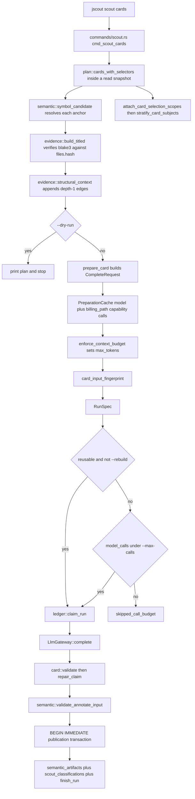
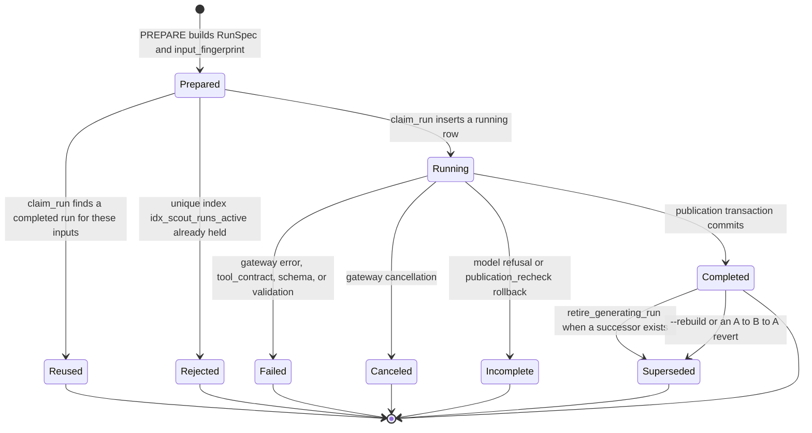

# Scouting: LLM-derived semantic artifacts

Scouting is the only part of jscout that spends money. It takes slices of the deterministic index — a symbol and its declaring file, a bounded call-graph traversal, a set of already-published child artifacts, a directory's configuration files — renders them into byte-deterministic evidence packs, asks a model to classify or describe them through a synthetic submit tool whose enums are exactly the planner's candidate list, and writes the result back as a `semantic_artifacts` row with per-claim provenance. The module header states the rule the whole subsystem is built around: every model call is recorded in the run ledger before it can publish anything, and "candidate expansion is a Rust change, not model improvisation" (`src/scouting/mod.rs:1-6`). Nothing in `src/mcp.rs` or `src/agent.rs` references `scouting`, so no MCP tool call and no agent turn can trigger a paid run — scouting is exclusively a `jscout scout …` CLI operation.

## Five families, one four-stage pipeline

Five artifact families share PLAN → PREPARE → EXECUTE → PUBLISH and differ only in what the deterministic input is. Four of them (workflow, card, summary, concept) produce `semantic_artifacts` rows and are refreshable; the fifth (repository reconnaissance) produces immutable policy rows and is not.

| Family | Deterministic input | Submit tool | Output | Persistence |
| --- | --- | --- | --- | --- |
| Workflow | Bounded traversal closure from seed symbols (`WorkflowCandidateSet`) | `submit_workflow_classification` (`workflow.rs:28`) | Name, description, one decision per candidate | `semantic_artifacts` + `semantic_supports` |
| Card | One symbol anchor, its declaring file, depth-1 structural context | `submit_symbol_card` (`card.rs:46`) | Purpose (required) plus optional role/invariants/domain terms, each with evidence ranges | `semantic_artifacts` + `semantic_supports` |
| Summary | Current child artifacts at `file:` / `module:` / `repo` scope | `submit_scope_summary` (`summary.rs:57`) | Scope overview citing child references | `semantic_artifacts` + `semantic_relations` (`summarizes`) |
| Concept | A normalized vocabulary group over workflow names and card domain terms | `submit_concept` (`concept.rs:121`) | Definition, aliases, source decisions — no name field | `semantic_artifacts` + `semantic_relations` (`related_to`) |
| Repository | A package / directory area / TS project and its JSON evidence pack | `submit_repository_classification` (`repository.rs:161`) | One of seven roles plus cited `E###` evidence ids | `repository_classifications` → `repository_file_policy` |

The submit schemas are generated per request, not static. Anchors, child references, source references and evidence ids appear as literal JSON Schema `enum`s built from the planner's output, and conditional shapes (included → role + evidence, excluded → reason) are encoded as `oneOf`. The comment at `workflow.rs:24-27` is explicit that the schema exists because models comply better when the invalid shape is structurally forbidden — Rust validation remains authoritative regardless of what the provider accepted.

The flowchart below traces the card path, the thinnest of the four generative families. Watch for the two gateway round-trips that happen before any generation call, and for the reuse check sitting *before* the budget gate.

`PLAN` never touches the gateway (`plan.rs:1-3`), but `PREP` does twice: `PreparationCache::model` (`mod.rs:234`) fetches capabilities, and `cache.billing_path` (`mod.rs:1490`, implementation at `mod.rs:255-261`) issues a second `capabilities(None)` round-trip for any provider other than `openai-codex`. The `PLAN` doc comment's claim that planning "never starts the gateway" is true of `plan.rs` itself and misleading about the stage boundary.

## PLAN: deterministic subject discovery

`plan::workflows` (`plan.rs:63`) runs inside `store::with_read_snapshot` and asks `semantic::workflow_candidates` for a bounded traversal closure per seed group. A candidate set with `traversal_truncated || candidate_truncated` is a hard `bail!` in explicit mode and a reported skip in automatic mode — a partially explored neighborhood is not a workflow boundary, and the two flags exist separately because exhausting the traversal budget is a different failure from exceeding the candidate cap (`src/semantic.rs:238-249`). Automatic seeds come from runtime boundary edges plus exported symbols in conventional entry files, ordered tier-primary with confidence-weighted in-degree as tiebreak. Card discovery inverts that ordering — weight primary, boundary-ness as tiebreak — with a comment recording that tier-first ordering on a Next.js snapshot burned the entire cap on examples and dev infrastructure.

`plan::concepts` (`plan.rs:607`) groups vocabulary from exactly two JSON pointers: a current workflow's `/name` and a current card's `/domain_terms/<i>`. `add_vocabulary_claim` (`plan.rs:969-981`) returns early when that exact pointer carries no support — "unsupported prose is not vocabulary," so a body string that merely resembles a term cannot enter a group. `plan::summaries` (`plan.rs:1439`) discovers scopes bottom-up and *gates* parents on lower-level completeness (`plan.rs:1607-1730`): one child-bearing file without a current, still-covering file summary gates its whole module, and one un-summarized module gates the repository scope. The tradeoff is stated in the code — a hierarchy that publishes around a missing scope produces an overview confidently wrong about the part it never saw — but the cost is real: with a small `--max-calls` budget the top of the hierarchy may never be reachable, and the reason surfaces only as a single gate-skip string.

Child sets are refused whole rather than truncated: `MAX_CONCEPT_CHILDREN = 64`, `MAX_CONCEPT_ALIASES = 32`, `MAX_CONCEPT_SOURCE_SUPPORTS = 160` (`plan.rs:556-563`), `MAX_SUMMARY_CHILDREN = 64` and `MAX_REPOSITORY_CHILDREN = 256` (`plan.rs:1397`, `1401`). Repository classification is the exception: `repository::validate` (`repository.rs:226-241`) silently drops duplicate citations and truncates beyond `MAX_CITATIONS`, recording `excess_citations_truncated` rather than failing.

## G18: task-directed card selection

Card planning gained a third mode. `plan::cards_with_selectors` (`plan.rs:259`) now branches on `CardSelectors { anchors, files, reconnaissance_subjects }`: `explicit` when `--anchor` is supplied, `targeted` when `--file` or `--subject` is (`plan.rs:266-300`), `automatic` otherwise. The load-bearing rule is at `plan.rs:331` — `if selected.is_empty() && mode != "targeted"` bails, so a targeted selection that resolves to nothing returns an empty plan instead of silently widening to repository-wide discovery. That is the difference between "scout these three files" and "scout everything because your three files did not match."

Every card subject now carries a `selection_scope` (`plan.rs:171`), resolved in priority order by `attach_card_selection_scopes` (`plan.rs:394-421`): the file's `repository_file_policy.subject_key`, else a neutral `recon::current_scope_memberships` entry, else a structural `structural:<origin>:<area>` fallback derived from the first path segment (`plan.rs:424-431`). `stratify_card_subjects` (`plan.rs:434-471`) then round-robins across those scope queues under `CARD_LIMIT = 1024`, so a bounded cap covers every scope before deepening one. The field's own doc comment insists the scope "never changes artifact identity or confidence" — it is purely an allocation and accounting bucket. Plan-time `CardScopeCoverage { discovered, selected, omitted }` (`plan.rs:202-207`) is carried into execution-time `CardScopeExecutionCoverage` (`mod.rs:146-158`), which adds `reused`, `model_calls`, `completed`, `incomplete`, `failed`, `skipped_call_budget` and `skipped_context_budget`, and is printed per scope by `print_scout_batch` (`src/commands/scout.rs:285-299`). The residual weakness is that within a scope ordering is still weight-descending, so a repository with many tiny scopes spends its budget breadth-first even when one subsystem deserves depth.

## Evidence packs and anchoring

`evidence::build_titled` (`src/scouting/evidence.rs:44`) reads each candidate file from disk, compares its blake3 to the `files.hash` recorded at index time, and bails with "changed since indexing" on drift (`evidence.rs:56-70`). It then renders the anchor listing, entity annotations, and `%5d | line` numbered source (`evidence.rs:81-110`). The pack is byte-deterministic precisely so it can be hashed into the input fingerprint, and its `files: BTreeMap<path, FileEvidence{hash, line_count}>` map carries both the line counts every validator bounds citations against and the hashes the publication transaction rechecks.

Depth-1 structural context is a sharp edge. It is concatenated into the card pack's `rendered` (`plan.rs:357-360`) and therefore participates in `card_input_fingerprint`, so a change in a subject's *neighbors* re-runs the card even though those edges are explicitly non-citable (`evidence.rs:115-118`) and only the subject's declaring file ships as numbered source. Nothing in the schema prevents a model citing a line it inferred from that context block; only the line-count bound catches obvious cases.

## Fingerprints, reuse, and the call budget

`reserve_output_and_measure` (`mod.rs:2979`) sets `max_tokens = 2048 + 512 × output_units`, clamped to the model's reported `max_tokens`, and returns the serialized byte length. `enforce_context_budget` (`mod.rs:2994`) rejects over `--context-bytes` and again when byte length treated as a token upper bound plus reserved output exceeds the model's context window. The comment at `mod.rs:3014-3016` admits the substitution is deliberate — pi-ai exposes no common tokenizer — but UTF-8 bytes overstate tokens by roughly 3-4x, so packs that would comfortably fit are refused on smaller-context models and the error message quotes a "token" count that is really a byte count.

Four fingerprint functions exist, and their asymmetry is the core of reuse economics. Workflow (`mod.rs:3029`) includes `candidate_set.snapshot` because a graph traversal is snapshot-sensitive — any edit can change the candidate set. Card (`mod.rs:3068`), summary (`mod.rs:2802`) and concept (`mod.rs:2838`) are deliberately snapshot-free, documented at `mod.rs:3062-3067`, `2798-2801` and `2835-2837`: the rendered pack already pins the subject's file content and depth-1 context (card) or every child body and child fingerprint (summary, concept), so an unrelated repository edit must reuse the completed run rather than buy an identical artifact again. The cost is that reuse can hand back an artifact whose `source_snapshot` is old; provenance and safety move entirely onto the run's recorded snapshot and the publication-time recheck.

Every batch loop tests reuse before the budget: `let reusable = !options.rebuild && ledger::reusable_run(conn, &prepared.spec)?.is_some();` at `mod.rs:362` (workflow), `450` (card), `536` (concept), `2247` (summary) and `repository.rs:1069`. `--max-calls` is a spend limit, and charging a free reuse against it would make repeated invocations of the same command yield fewer artifacts each time. The `!options.rebuild` conjunct is the caveat: under `--rebuild` nothing is reusable, so every prepared item consumes budget and can be blocked. `--max-calls` requiredness also varies — `Option<usize>` on `workflows`, `cards` and `concepts`; a required `usize` on `summaries`, `repository` and `refresh`; `repository` additionally accepts the literal `all` through `parse_positive_count_or_all` (`src/cli.rs:606-607`). Explicit card scouting with no `--max-calls` defaults to the anchor count, while automatic or targeted card scouting without it is a hard error (`src/commands/mod.rs:843-855`).

## The ledger: one live claim per input

The lifecycle below is what `scout_runs` records. Look at where a paid call can end without an artifact, and at `superseded`, which no caller writes directly.

`ledger::claim_run` (`ledger.rs:72`) opens `BEGIN IMMEDIATE` and first retires any completed run whose artifact already has a successor (`ledger.rs:79-89`). That run occupies the unique in-flight slot but must not satisfy reuse, which is exactly what makes an A→B→A revert republish rather than return the stale successor. It then either supersedes under `--rebuild` (`ledger.rs:91-97`), returns `Reused`, or inserts a `running` row. A constraint violation on the partial unique index `idx_scout_runs_active` over `(scout_kind, input_fingerprint) WHERE status IN ('running','completed')` (`src/store.rs:661-664`) means another process owns these inputs, and the call fails loudly rather than double-paying (`ledger.rs:132-140`). A ledger row therefore exists in `running` state before any bytes leave the process; a crash leaves an attributable row that `sweep_orphaned_runs` reclaims after `ORPHAN_SWEEP_MINUTES = 24 * 60` (`mod.rs:38`, `ledger.rs:255-265`), called at the head of every batch entry point.

`reusable_run` (`ledger.rs:179-194`) contains a deliberate exception worth naming: it also reuses a completed run with *no recorded artifact at all* (`artifact.id IS NULL`), documented at `ledger.rs:176-178` as necessary so the unique in-flight slot cannot deadlock. The consequence is that an artifact deleted out of band makes that run reuse-as-success permanently, returning `artifact_id: None` on every subsequent invocation with no path back short of `--rebuild`.

## EXECUTE: failure routing

The card executor calls `gateway.complete(&request, options.policy.timeout)` at `mod.rs:1537` and finishes the run `Canceled`/`Failed` with the gateway's error code at `mod.rs:1539-1554`. Contract failures route by shape and each records a *failed* ledger row plus a subject-local report while the batch continues: an unexpected tool name gives error code `tool_contract` (`mod.rs:1569-1592`), a deserialization failure `schema` (`mod.rs:1593-1610`), a `card::validate` rejection `validation` (`mod.rs:1613-1633`). A model refusal carrying `incomplete_reason` takes `publish_terminal` with `model_incomplete` (`mod.rs:1635-1654`) — the classifications are kept, no artifact is created. A refusal and an artifact are mutually exclusive by construction: `incomplete_reason` alongside any claim is a validation error (`card.rs:219-244`, `summary.rs:166-178`, `concept.rs:289-302`), and each family's `annotate_input` bails if called on an incomplete value (`card.rs:484`, `summary.rs:319`, `concept.rs:860`).

Gateway errors are the exception to subject-local handling. `subject_local_gateway_failure` (`mod.rs:3304`) returns true only for `GatewayError::Remote` with code `timeout` or `tool_contract`, on the grounds that those carry a correlated terminal frame and leave the connection synchronized (`mod.rs:3299-3303`). Everything else — local frame-deadline timeouts, cancellation, all infrastructure failures — returns `Err` and aborts the batch, discarding no already-committed work but stopping the run. The distinction rests on a provider-supplied string; a gateway that renamed the code would turn every slow request back into a batch abort.

## Two-layer validation and the publication transaction

Layer one is the family validator (`workflow::validate`, `card::validate`, `summary::validate`, `concept::validate`, `repository::validate`), authoritative regardless of what the JSON Schema accepted. Its central job is candidate closure: every submitted anchor or reference must be in the planner's enum (`workflow.rs:198-204`, `summary.rs:268-276`, `concept.rs:658-660`, `repository.rs:229-231`), and workflow and concept additionally require *exhaustive* coverage of the planned set (`workflow.rs:308-320`, `concept.rs:805-814`). Generated claims never exceed confidence `likely` (`workflow.rs:277-278`, `card.rs:497-498`), and summaries and concepts are capped down to `possible` when any child or child support is `possible` (`summary.rs:326-330`, `concept.rs:868-878`).

Two validator details are worth calling out. Card citation handling deduplicates and validates the *full* submitted range list before truncating to `MAX_RANGES_PER_CLAIM = 4` (`card.rs:24`, `398-400`, `428-430`); reversing that order would let an out-of-file fifth range be silently dropped instead of failing the card, and `MAX_RANGE_REPAIR_INPUT = 12` hard-fails above the repair bound (`card.rs:420-425`). Concept validation sorts aliases canonically and rewrites the model's `/aliases/<n>` claim paths through a path remap (`concept.rs:405-445`), because alias identity is a deterministic input and providers return the exhaustive set in arbitrary order — without canonicalization, provider ordering would perturb the artifact fingerprint. Any future concept claim family using indexed JSON pointers must be added to that remap or its fingerprints will vary run to run.

Layer two is `semantic::validate_annotate_input` (`src/semantic.rs:646`), which re-resolves every anchor to its exact current form, re-reads each evidence file from disk and compares blake3 against `files.hash`, bounds every span, and rejects a stale snapshot; failure records `inputs_changed` and returns `Err` (`mod.rs:1656-1674`). Then the publication transaction re-checks a third time under the write lock. For cards, `conn.execute_batch("BEGIN IMMEDIATE")` at `mod.rs:1677` is followed by a current-snapshot check and a per-evidence-file hash recheck (`mod.rs:1679-1691`), in-transaction resolution of `annotate_input.supersedes` (`mod.rs:1696-1710`) so no second current card can be published beside it, `semantic::persist_validated_artifact` (`mod.rs:1711`, `semantic.rs:789`), `retire_generating_run` (`1725`), `record_classifications` (`1727`), `finish_run(Completed)` (`1728`), and `COMMIT` at `1733`. On failure the transaction rolls back and the run is recorded `incomplete` with reason `publication_recheck` (`mod.rs:1737-1745`) — the paid call stays attributable and nothing is published.

The rechecks are family-specific, not uniform. The card path above is the thinnest. Summaries additionally re-verify every child's pinned `artifact_fingerprint` and re-derive the whole expected child set via `semantic::expected_summary_child_ids` (`mod.rs:2592-2625`), aborting if a child was added or removed while the call was in flight; concepts do the same for source artifacts and `expected_concept_child_ids` (`mod.rs:2033-2060`). Concept lineage is handled differently again: the predecessor is pinned before the call (`mod.rs:1843`), re-checked immediately after `claim_run` (`mod.rs:1871-1882`), and a mismatch is a `bail!`. Cards and summaries instead rely on in-transaction supersession (`mod.rs:1696-1710`, `2626-2641`) backed by the unique partial index on `supersedes_artifact_id` (`src/store.rs:791-793`).

Concepts also carry no `semantic_supports` rows at all. They link claims to fingerprinted child artifacts through `related_to` relations, because copying a vocabulary span directly onto an LLM-written definition would erase the semantic hop and overstate what the source line proves (`concept.rs:848-853`). Provenance still reaches source lines, but through one extra join. Every planned child is recorded as a whole-artifact dependency with an empty `claim_path` even when uncited (`summary.rs:350-362`, `concept.rs:900-908`), so a later change to a child the model saw but did not cite still stales the parent.

## Staleness and refresh

`refresh::select` (`refresh.rs:61`) picks current, non-fresh, model-generated artifacts by joining `semantic_artifacts` to `scout_runs` where `artifact.artifact_type = run.scout_kind`, restricted to `('workflow','card','summary','concept')`, with no successor. It then parses each run's `config_json` back into a `RefreshConfig`. Every variant stores the deterministic *input* — seeds and depth, an anchor, a level and scope key, a term — and never resolved child ids, so refresh rebuilds the current child set rather than replaying a stale one. Artifacts predating recorded configuration land in `unsupported_legacy`.

`scout_refresh` (`mod.rs:818`) sorts targets card/workflow → file summary → module summary → other summary → concept (`mod.rs:838-852`) and re-plans each target immediately before executing it (`mod.rs:853-903`). The comment at `mod.rs:833-836` gives the reason: a summary prepared against a child the same command is about to replace would reuse its own stale run, so just-in-time re-planning lets parents see successors published moments earlier. The cost is that preparation cannot be batched or overlapped with model latency, serializing plan work between calls.

Repository classifications have no refresh path at all — they are excluded from `refresh::select`'s `scout_kind` filter — so a stale scope classification silently keeps driving `repository_file_policy` until a fresh `jscout scout repository` run reclassifies it. Two user-facing strings are also out of step with the code: `src/commands/scout.rs:200` prints "cannot refresh pre-G5 artifacts", leaking an internal gate label, and `src/commands/scout.rs:205` says "no stale or degraded generated workflows, cards, or summaries to refresh" while refresh also handles concepts.

## Repository reconnaissance and the one feedback edge

Reconnaissance is structurally the odd family. `repository::plan` (`repository.rs:252`) discovers package, directory-area and TypeScript-project subjects, launching the checker sidecar for the last of these (`repository.rs:374-451`). Its evidence is structured JSON rather than numbered source — `RepositoryEvidencePack` with `E001`-style item ids forming the citation enum (`repository.rs:68-96`). Per-file heuristic role labels are deliberately withheld and folded into `handwritten` (`repository.rs:633-638`) so the model cannot launder the existing heuristic back as independent evidence; the tradeoff is less signal about co-located tests and fixtures, which the system prompt has to compensate for in prose (`repository.rs:826`).

`repository::execute` (`repository.rs:1018`) drives a `VecDeque` rather than a flat prepared list, and subdivides on two triggers, not one: a `mixed` verdict (`repository.rs:1081-1094`) and a `ContextBudgetExceeded` during prepare (`repository.rs:1044-1066`) — the only family that always converts a budget overrun into a skip *and* refines the subject. `enqueue_subdivisions` (`repository.rs:1101-1139`) pushes children onto the *front* of the queue in descending member order, on the reasoning that the parent has already established its coarse classification is insufficient. Both paths are bounded by `--max-depth` and `--max-subjects`; over-cap children go to `skipped_unresolvable` with `auto_limit_reached` set (`repository.rs:1122-1129`), and subject explosion produces a warning rather than truncation via `--warn-subjects` (`src/commands/scout.rs:55-84`). Because subdivision shares both bounds with the initial plan, a deep mixed tree can starve the rest of the discovered subjects.

Classifications are written by `recon::persist_classification` as immutable rows — no artifact id, no supersession — and the loop finishes with `recon::reconcile_file_policy` (`repository.rs:1096`), which rebuilds `repository_file_policy` from fresh, `likely` scope classifications only (`src/recon.rs:283`; the schema comment at `src/store.rs:696-699` explains the intent). That table is exactly what `plan::automatic_seeds` and `plan::automatic_card_subjects` read to decide which files are worth scouting, and what `attach_card_selection_scopes` reads for `selection_scope` — the one feedback edge in the subsystem, where model output steers later model spend. `recon::reconcile_file_policy_after_index` (`src/recon.rs:498`) clears both `repository_file_policy` and `repository_current_classifications` and falls back to neutral defaults on error, so scouting's policy output degrades silently rather than blocking indexing.

## Gaps

Structural duplication is the standing cost. The four executors in `mod.rs` (`execute_prepared_workflow` at 1199, `_card` at 1509, `_concept` at 1825, `_summary` at 2397) plus `repository::execute_one` still repeat the same ~250-line skeleton five times — gateway-error block, `usage_json` construction, billing-path correction, tool-name check, deserialization check, validation check, incomplete branch, publication transaction. The verbatim remote-vs-local timeout comment that used to be copied alongside it now lives once as `subject_local_gateway_failure`'s doc, but the structure did not follow.

Test coverage is uneven in a specific way. 43 integration tests in `src/scouting/tests.rs` drive a scripted `FakeGateway` against a real temp repository and real SQLite, and they cover the hard races directly — `summary_publication_refuses_a_child_added_mid_flight`, `concept_publication_rechecks_a_concurrent_same_identity_concept`, `card_publication_loses_the_snapshot_race_without_a_partial_write`, `reverting_the_subject_republishes_over_the_stale_successor`, and the timeout routing split `remote_timeout_fails_one_subject_and_the_batch_continues` versus `local_frame_timeout_remains_batch_fatal`. But `src/scouting/workflow.rs` is the only scouting file with no test module of its own, so its support fan-out (`workflow.rs:381-387`) is exercised only indirectly, and no test asserts on any prompt string (`mod.rs:2698-2708`, `2755-2769`, `2874-2889`, `2926-2937`, `repository.rs:826`) — a prompt edit contradicting its own schema would pass the entire suite.

Three smaller edges: `current_concept_for_key` (`mod.rs:2129`) loads every current concept artifact and JSON-parses each body to compare normalized aliases, once per concept execution, with no index support, and treats more than one matching lineage as a hard bail rather than a merge. `MAX_DISK_EVIDENCE_CHARS = 12_000` truncates repository configuration evidence (`repository.rs:587`) while `line_count` is computed from the truncated content, so an `E###` citation's line range describes the truncation rather than the file. And `plan::package_prefixes` (`plan.rs:1807`) returns an empty vector when `WorkspaceMap::discover` fails (`plan.rs:1816-1818`), making every module scope vanish — deliberate for read-only reconnaissance, but a broken workspace manifest degrades summaries to file and repository levels with no diagnostic.

Related: [05-storage-schema.md](05-storage-schema.md) for `semantic_artifacts` and freshness, [06-semantic-layer.md](06-semantic-layer.md) for support and relation persistence, [09-sidecars.md](09-sidecars.md) for the gateway and checker processes, [10-cli-and-commands.md](10-cli-and-commands.md) for the `scout` command surface, and [19-sharp-edges.md](19-sharp-edges.md).
