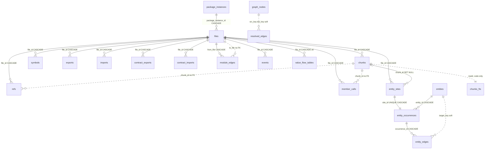
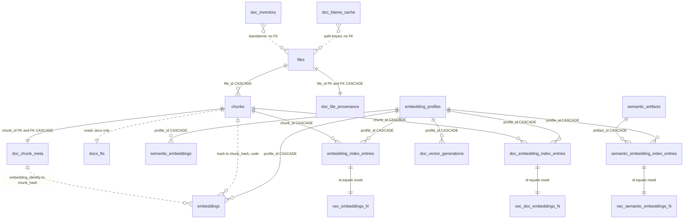
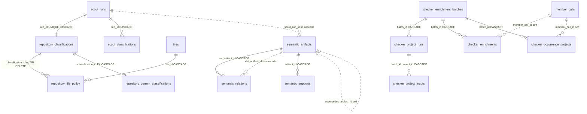

# Storage: SQLite schema, indexes, and vectors

Everything jscout persists lives in one file per repository, `.jscout.db`, behind one schema version and one atomic index publication. `SCHEMA_VERSION` is `"34"` and `DURABLE_SCHEMA_FLOOR` is `16`; compatible older files keep durable cache/memory while their disposable state is rebuilt, and newer or too-old files are refused. The disposable index exposes code, documentation, and provenance component identities plus their folded `publication_snapshot`. The fold is not itself a gate.

## Four gates on every read

`open`/`open_path` (`src/store.rs:52`, `:153`) are the writer paths. They create parent directories, register sqlite-vec once through `sqlite3_auto_extension` (`:13`, guarded by a `Once` because the registration `transmute`s the init symbol and is process-global), set `journal_mode=WAL`, `synchronous=NORMAL`, `foreign_keys=ON`, and run `init_schema`, which is safely repeatable because every object is `IF NOT EXISTS`.

`open_read_only`/`open_path_read_only` create and migrate nothing. The file must already be a regular file; the connection is opened `SQLITE_OPEN_READ_ONLY` with `foreign_keys=ON` and then `query_only=ON`; and four gate groups pass in this order before the handle is returned:

| Gate | Compared against | Source |
| --- | --- | --- |
| `meta.schema_version == "34"` | `store::SCHEMA_VERSION` | `src/store.rs` |
| `meta.projection_version` exists and matches | `structural::PROJECTION_VERSION` | `src/store.rs` |
| legacy and active per-format producer contracts match | extraction, documentation, and registered format contracts | `store::validate_published_contracts` |
| code, documentation, provenance, and folded publication identities all exist and the fold verifies | `publication::Identities::read` | `src/publication.rs` |

Producer-contract gates live in `validate_published_contracts`; identity completeness and fold consistency live in `Identities::read`. A read surface must never reinterpret code or Markdown rows produced by an incompatible contract. All failures point to indexing as the repair.

The gates are meaningful because the writer removes the component digests, folded marker, projection/resolution markers, and provenance digest before recomputing them, inside the same `BEGIN IMMEDIATE` that covers the whole write. `Identities::publish` writes the four identity rows together. A concurrent reader sees the previous complete publication until commit, never the unpublished intermediate state.

## The 49 regular tables

Column-level detail is in the schema batch in `src/store.rs`; this inventory names each table and whether it survives an in-place upgrade.

| Table | Plane | Survives legacy rebuild |
| --- | --- | --- |
| `meta` | contract | yes (disposable keys pruned) |
| `package_instances` | snapshot | no |
| `files` | snapshot | no |
| `chunks` | snapshot | no |
| `doc_chunk_meta` | docs | no |
| `doc_file_provenance` | docs provenance | no |
| `doc_blame_cache` | docs provenance cache | no |
| `doc_inventory` | docs | no |
| `symbols` | structural | no |
| `exports` | structural | no |
| `imports` | structural | no |
| `contract_exports` | structural | no |
| `contract_imports` | structural | no |
| `module_edges` | structural | no |
| `refs` | occurrence | no |
| `events` | occurrence | no |
| `member_calls` | occurrence | no |
| `receiver_value_flows` | flow | no |
| `function_return_flows` | flow | no |
| `value_binding_flows` | flow | no |
| `class_value_flows` | flow | no |
| `instance_method_value_flows` | flow | no |
| `class_member_value_flow_blockers` | flow | no |
| `entity_sites` | entity | no |
| `entities` | entity | no |
| `entity_occurrences` | entity | no |
| `entity_edges` | entity | no |
| `embedding_profiles` | **durable cache** | yes |
| `embeddings` | **durable cache** | yes |
| `semantic_embeddings` | **durable cache** | yes |
| `embedding_index_entries` | vector occurrence | no |
| `doc_embedding_index_entries` | vector occurrence | no |
| `doc_vector_generations` | vector readiness | no |
| `graph_nodes` | projection | no |
| `resolved_edges` | projection | no |
| `checker_enrichment_batches` | checker | no |
| `checker_project_runs` | checker | no |
| `checker_project_inputs` | checker | no |
| `checker_enrichments` | checker | no |
| `checker_occurrence_projects` | checker | no |
| `scout_runs` | **durable memory** | yes |
| `repository_classifications` | **durable memory** | yes |
| `repository_file_policy` | scout projection | no |
| `repository_current_classifications` | scout projection | no |
| `scout_classifications` | **durable memory** | yes |
| `semantic_artifacts` | **durable memory** | yes |
| `semantic_relations` | **durable memory** | yes |
| `semantic_supports` | **durable memory** | yes |
| `semantic_embedding_index_entries` | vector occurrence | no |

Ten tables survive an in-place upgrade: `meta` plus nine durable ones. Note `semantic_embedding_index_entries` is *dropped* by the legacy rebuild (`src/store.rs:255`) even though `reset_extraction_state` preserves it — the two truncation surfaces are not the same set.

Alongside the tables: 51 ordinary `CREATE INDEX IF NOT EXISTS` statements plus three partial `CREATE UNIQUE INDEX IF NOT EXISTS` statements. The unique indexes enforce one live checker batch, one live claim per scout input, and one successor per superseded artifact.

`init_schema` also carries one production in-place `ALTER TABLE`, adding `repository_classifications.cited_evidence_json` when absent. That column landed while v20 was under review, so databases from an early v20 commit hold durable reconnaissance history a version bump would discard; a `pragma_table_info` probe plus one `ALTER` is cheaper than declaring them unreadable.

## The structural core

Look for two things in the diagram below: how much hangs directly off `files.id` with `ON DELETE CASCADE` (solid lines), and how many references are plain integers or text keys with no foreign key at all (dotted lines). The dotted ones are deliberate — a projection rebuild must not cascade into canonical rows.

`value_flow_tables` stands for the six closed syntax-and-binding tables (`src/store.rs:570`–`:656`), each keyed to `files(id)` with cascade and carrying heavy `CHECK` constraints — `receiver_value_flows` forces either the `this` shape (class name and start set, value and target NULL) or the value shape, plus `UNIQUE(file_id, call_start, call_end)`. Absence of a row means the extractor deliberately declined; the checks make a half-populated row unrepresentable rather than quietly ambiguous.

The dotted `chunks` edges are worth staring at: `refs.chunk_id`, `events.chunk_id`, and `member_calls.chunk_id` are bare integers, while `entity_sites.chunk_id` and `entity_occurrences.chunk_id` do reference `chunks(id) ON DELETE SET NULL`. Same-looking columns, different enforcement. `graph_nodes` and `resolved_edges` (`:784`, `:799`) go further — every key column is plain `TEXT`/`INTEGER`, because the projection is rebuilt wholesale and foreign keys would make each rebuild cascade back into canonical tables.

## The documentation plane and the vector families

Documentation shares `files`, `chunks`, and `embeddings` with code, and gets its own everything else. Look for where the shared spine ends: `chunks` is the last table both corpora write, after which the two paths diverge into `chunks_fts` versus `docs_fts` and `vec_embeddings_N` versus `vec_doc_embeddings_N`.

**`files.corpus` is the only source of truth.** At v31 `files` gained two mandatory columns with no defaults — `corpus TEXT NOT NULL CHECK(corpus IN ('code','docs'))` and `format TEXT NOT NULL CHECK(length(trim(format)) > 0)` (`src/store.rs:337`–`:338`) — so every writer must classify explicitly rather than inherit a guess. Two views, `code_files` and `code_chunks` (`:429`, `:434`), hold the corpus predicate in one schema object instead of asking a dozen consumers to reproduce `corpus='code'`. Four triggers (`:382`–`:427`) make the classification unforgeable in both directions: `doc_chunk_meta` cannot be attached to a code chunk, a file with sidecar rows cannot be moved out of the docs corpus, and a doc chunk cannot be reparented to a non-docs file. The alternative — inferring membership from `chunks.kind` or from the presence of `doc_chunk_meta` — would make the sidecar a second, contradictory authority; the cost is trigger evaluation on every `files`/`chunks` update.

**Two BM25 corpora, never mixed.** `chunks_fts(content, name, symbols, path)` and `docs_fts(title, metadata, breadcrumb, body, path)` are defined as `const` strings (`src/store.rs:31`, `:41`) with the same `unicode61 tokenchars '_$'` tokenizer, because `reset_extraction_state` drops and recreates them and must use the byte-identical definition. Both use `chunks.id` as rowid, so their rowid spaces overlap; code chunks are only ever written to `chunks_fts` (`src/indexer.rs:1105`) and documentation chunks only to `docs_fts` (`src/indexer.rs:971`), and every `docs_fts` read joins back through `files` with `corpus='docs'`. `src/docs/store.rs:199` ranks with `-bm25(docs_fts, 4.0, 2.0, 2.0, 1.0, 0.25)`. The separation exists so admitting a large `docs/` tree cannot shift the term statistics code search depends on.

**One cache, two key meanings.** `embeddings` is keyed `(chunk_hash, profile_id)` (`:739`). For code, `chunk_hash` is `chunks.hash`, a blake3 of the raw source slice; for documentation it is `doc_chunk_meta.embedding_identity`, a blake3 over nearest heading plus rendered body (`src/indexer.rs:1016`). Keying documentation on rendered content lets identical passages across files share one vector and keeps the cache valid when surrounding raw bytes move; the cost is that `embeddings.chunk_hash` has two meanings distinguishable only by which join produced the row.

**Three vec0 families, created per dimension.**

| Family | Shape | Rowid source | Defined at |
| --- | --- | --- | --- |
| `vec_embeddings_{N}` | `embedding FLOAT[N] cosine`, `profile_id` and `origin` PARTITION KEY | `embedding_index_entries.id` | `src/embed.rs:1169`–`:1174` |
| `vec_doc_embeddings_{N}` | `embedding FLOAT[N] cosine`, `profile_id` PARTITION KEY | `doc_embedding_index_entries.id` | `src/docs/retrieval.rs:977`–`:981` |
| `vec_semantic_embeddings_{N}` | `embedding FLOAT[N] cosine`, `profile_id` PARTITION KEY | `semantic_embedding_index_entries.id` | `src/embed.rs:1204`–`:1209` |

`N` is validated to `1..=8192` before interpolation (`src/embed.rs:1128`–`:1131`). vec0 tables carry no foreign keys, so the three regular entries tables are authoritative and their `id` *is* the vec0 rowid. Documentation gets a separate family rather than a `corpus` partition key because sqlite-vec applies KNN's `k` before any relational filter could run — sharing one table would let code rows consume a documentation query's entire `k` budget. Only the code family partitions on `origin`, which lets origin-filtered code search push that filter below KNN.

**Documentation readiness is all-or-nothing.** `doc_vector_generations` has primary key `(snapshot, profile_id, dimensions, chunk_format_version)`, where `snapshot` stores the documentation digest. A row exists only when every embeddable documentation occurrence has a valid cached vector. One missing vector demotes that profile to BM25, while a code-only publication leaves a ready docs generation untouched. Code and semantic vectors use profile sync markers instead.

`doc_inventory` (`:442`) deliberately has no primary key and no foreign key to `files`: it records every membership decision for the current snapshot — subjects `directory`/`file`/`entry` and rules from `hard-skip` through `oversized` to `indexed` — and rejected paths by definition have no `files` row. Its `path_base64`/`path_encoding` columns carry non-UTF-8 paths whose display `path` is not authoritative.

## Scouting, checker, and semantic memory

Here the thing to look for is the boundary between durable and disposable running *through* one feature: a scout classification is immutable history, but the two projections that make it queryable are thrown away every rebuild.

`repository_file_policy.classification_id` references `repository_classifications(id)` with no `ON DELETE` clause at all (`:983`), so a disposable projection row can in principle block deletion of a durable classification — safe only because `reset_extraction_state` clears the projection first. The checker plane stores occurrence identity as source file, source hash, and byte spans rather than as foreign keys to `member_calls`, so a projection rebuild cannot cascade into canonical checker facts and watch carry-forward can re-validate by content after the referenced rows were deleted and recreated. The cost: referential integrity there is a code invariant, not a database one, and a stale `member_call_id` is caught only by the projection's own validation.

`artifact_fingerprint` (`src/store.rs:1170`) gives each artifact its content identity: blake3 over the domain tag `jscout-semantic-artifact`, provenance fields, and every support group in sorted order, with each scalar NUL-terminated and each group terminated by `\x01` so the concatenation is unambiguous.

## Two reset surfaces, and what each keeps

`reset_extraction_state` exists because cascading `delete_file` across tens of thousands of files re-scans the large evidence tables and the FTS index once per file. It calls `embed::clear_vector_rows`, deletes the source-derived tables children-first, then drops and recreates both FTS tables from `CHUNKS_FTS_CREATE`/`DOCS_FTS_CREATE`. `symbols` is *not* in the delete list — it is emptied by the foreign-key cascade from `DELETE FROM files`, so the routine is correct only with `foreign_keys=ON`. Durable embedding and semantic/scout state survives.

`reset_snapshot_state` is that plus `DELETE FROM package_instances` and removal of the snapshot/projection markers. `FullRefresh` is the only index mode that invokes it. Incremental producer-contract changes instead invalidate rows selectively by format; there is no reset-percentage heuristic.

`clear_vector_rows` (`src/embed.rs:1875`) is asymmetric too. Code vec tables are enumerated from `embedding_profiles.dimensions` via `ensure_vector_table` — which *creates* the table as a side effect of clearing it — while documentation vec tables are found by GLOB over `sqlite_master`. A `vec_embeddings_N` left behind for a dimension with no surviving profile is therefore never emptied. Neither routine touches `vec_semantic_embeddings_*`, since semantic artifacts survive snapshot rebuilds.

`clear_checker_batches` and `preserve_active_checker_batch_for_watch` (`:1274`, `:1283`) express the manual-versus-watch checker retention policy as two one-line statements: delete every batch, or delete only `active=0` and keep one hidden active batch as a carry source.

`delete_file` is the per-file path and is idempotent — an existence probe returns early if the row is already gone. It removes vec0 rows, then both FTS mirrors by rowid (FTS5 is not FK-aware), then the `files` row, letting cascades take the rest. Removing a documentation vector row clears the profile generation transiently; the same index publication rematerializes a complete generation from cache when all remaining documentation identities are present.

## v29 to v34, and the legacy rebuild

`git log -S` shows `SCHEMA_VERSION` moving from `"29"` straight to `"31"` in one commit, `e3229ad "feat: add unified Markdown retrieval"` — the string `"30"` never appears in `src/store.rs`. v30 is nonetheless load-bearing: it is inside the durable rebuild window, and `v30_rebuild_installs_explicit_file_classification` pins reconstruction of a pre-`corpus`/`format` file table. v31 introduced the unified documentation corpus; v34 adds per-format contracts, provenance sidecars, and component publication identities.

`rebuild_legacy_disposable_schema` is the migration boundary: it preserves durable embedding and semantic/scout history while dropping source-derived rows, vec occurrence materialization, checker batches, and publication markers. The v33→v34 transition deliberately requires this rebuild because old durable `source_snapshot` values and checker rows were keyed to the former global digest; a read-only open fails closed until a writer rebuilds and `jscout index` publishes the new identity quartet.

The tradeoff of a single boundary instead of a migration ladder: everything below the cache line is recomputable from the checkout, so recreating it is cheap and always correct, but a future *durable*-plane change has no in-place path at all — it needs an explicit export/import or a cache-compatibility decision. Files below 16 or above 34 are refused outright, with an error telling the user to preserve the old file if its embedding cache or semantic memory matters.

## The snapshot log does not exist

There is no `snapshot_log` table and no snapshot history. `meta.snapshot` is the current folded publication marker; `code_digest`, `documentation_digest`, and `documentation_provenance_digest` are its current components. The deferred block-observation ledger still does not exist.

Publication order is the closest thing to a log, and it is strict. Projection identity is published, component digests are computed, projection/checker reuse is settled against the code digest, and then `Identities::publish` installs all components plus the fold. Provider-free docs rematerialization validates the newly published documentation digest before rebuilding. All of it sits inside the outer `BEGIN IMMEDIATE`, so those markers exist for the internal rebuild but are not visible to another connection until commit.

## Limits worth knowing

`with_read_snapshot` (`src/store.rs:1138`) pins a multi-statement read to one SQLite snapshot via a named `SAVEPOINT` and nests safely — `docs::store::status` uses it as `jscout_docs_status`. Its error path is best-effort: the `ROLLBACK TO … ; RELEASE …` result is discarded with `let _ =`, so a failed rollback is swallowed.

`register_sqlite_vec` is idempotent via `Once`, but the registration is process-global: any connection opened anywhere in the process after the first `store::open` has vec0 available whether or not it went through this module.

`doc_chunk_meta.ordinal` does not hold the chunk's document ordinal. `src/indexer.rs:1040` writes the chunk's *same-heading* ordinal into it; the contiguous document ordinal is asserted during indexing and never stored.

Two naming traps: the `store.rs` test at `:2099` builds `vec_doc_embeddings_2` with an extra `snapshot TEXT PARTITION KEY` column that production never creates (the real shape is `src/docs/retrieval.rs:977`–`:981`), and two distinct functions are named `ensure_vector_table` — `src/embed.rs:1151` for code, which adds the `origin` partition key and invalidates sync markers on first creation, and `src/docs/retrieval.rs:973` for docs, which does neither.

Schema behavior is tested against real temporary SQLite files rather than mocks, covering legacy rejection and rebuild boundaries, read-gate order and error text, file classification constraints, view-column equality against the base tables, and documentation reset behavior.
