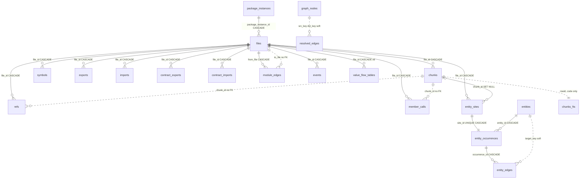
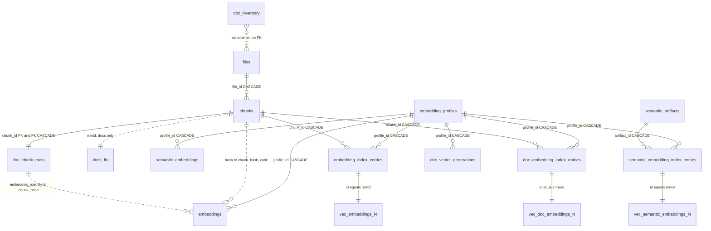
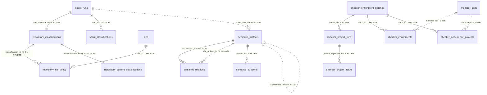

# Storage: SQLite schema, indexes, and vectors

Everything jscout persists lives in one file per repository, `.jscout.db` (`src/store.rs:7`), and the whole storage layer is one module: a connection factory, one idempotent `init_schema` batch, one compatibility boundary, and a handful of truncation routines. There are no per-version migration steps. `SCHEMA_VERSION` is `"31"` (`src/store.rs:8`) and `DURABLE_SCHEMA_FLOOR` is `16` (`:9`); those two numbers encode the entire upgrade policy — anything in `[16, 31)` gets its source-derived half dropped and recreated, anything outside is refused. The file holds three lifecycles under one version: a disposable structural snapshot (now spanning a code corpus and a documentation corpus), a durable content-addressed embedding cache, and durable semantic memory from scouting. Forty-seven regular tables, two FTS5 virtual tables, two views, four triggers, fifty-seven named indexes, and three dynamically named sqlite-vec families implement that split.

## Four gates on every read

`open`/`open_path` (`src/store.rs:52`, `:153`) are the writer paths. They create parent directories, register sqlite-vec once through `sqlite3_auto_extension` (`:13`, guarded by a `Once` because the registration `transmute`s the init symbol and is process-global), set `journal_mode=WAL`, `synchronous=NORMAL`, `foreign_keys=ON`, and run `init_schema`, which is safely repeatable because every object is `IF NOT EXISTS`.

`open_read_only`/`open_path_read_only` (`:59`, `:63`) create and migrate nothing. The file must already be a regular file; the connection is opened `SQLITE_OPEN_READ_ONLY` with `foreign_keys=ON` and then `query_only=ON` (`:73`–`:74`); and four checks must pass before the handle is returned:

| Gate | Compared against | Source |
| --- | --- | --- |
| `meta.schema_version == "31"` | `store::SCHEMA_VERSION` | `src/store.rs:88` |
| `meta.snapshot` exists and `meta.projection_version` matches | `structural::PROJECTION_VERSION` = `"12"` | `src/store.rs:94`–`:113`, `src/structural.rs:13` |
| `meta.extraction_version` matches | `entity::EXTRACTION_VERSION` = `"7"` | `src/store.rs:132`, `src/entity.rs:14` |
| `meta.documentation_chunk_format_version` matches | `docs::CHUNK_FORMAT_VERSION` = `"documentation-v1"` | `src/store.rs:139`, `src/docs/mod.rs:11` |

The last two live in `validate_published_contracts` (`src/store.rs:123`–`:145`); a missing key reads as the literal `"missing"` and fails. The documentation-format gate is new at v31: a read surface must never reinterpret Markdown rows produced by an older chunker. All four failures print the same repair instruction, because indexing is the only repair path.

The gates are meaningful because the writer unpublishes before it republishes. The indexer's preparation closure ends with `DELETE FROM meta WHERE key IN ('snapshot','projection_version','resolution_hash')` (`src/indexer.rs:636`–`:639`), inside the same `BEGIN IMMEDIATE` that covers the whole write, so a reader sees either the previous complete publication or nothing.

## The 47 tables

Column-level detail is in the schema batch (`src/store.rs:313`–`1134`); this inventory names each table, where it is defined, and whether it survives an in-place upgrade.

| Table | Line | Plane | Survives legacy rebuild |
| --- | --- | --- | --- |
| `meta` | 315 | contract | yes (six keys pruned) |
| `package_instances` | 319 | snapshot | no |
| `files` | 333 | snapshot | no |
| `chunks` | 347 | snapshot | no |
| `doc_chunk_meta` | 368 | docs | no |
| `doc_inventory` | 442 | docs | no |
| `symbols` | 453 | structural | no |
| `exports` | 469 | structural | no |
| `imports` | 478 | structural | no |
| `contract_exports` | 489 | structural | no |
| `contract_imports` | 498 | structural | no |
| `module_edges` | 506 | structural | no |
| `refs` | 518 | occurrence | no |
| `events` | 536 | occurrence | no |
| `member_calls` | 547 | occurrence | no |
| `receiver_value_flows` | 570 | flow | no |
| `function_return_flows` | 599 | flow | no |
| `value_binding_flows` | 615 | flow | no |
| `class_value_flows` | 626 | flow | no |
| `instance_method_value_flows` | 640 | flow | no |
| `class_member_value_flow_blockers` | 648 | flow | no |
| `entity_sites` | 657 | entity | no |
| `entities` | 682 | entity | no |
| `entity_occurrences` | 693 | entity | no |
| `entity_edges` | 714 | entity | no |
| `embedding_profiles` | 728 | **durable cache** | yes |
| `embeddings` | 739 | **durable cache** | yes |
| `semantic_embeddings` | 749 | **durable cache** | yes |
| `embedding_index_entries` | 756 | vector occurrence | no |
| `doc_embedding_index_entries` | 767 | vector occurrence | no |
| `doc_vector_generations` | 776 | vector readiness | no |
| `graph_nodes` | 784 | projection | no |
| `resolved_edges` | 799 | projection | no |
| `checker_enrichment_batches` | 822 | checker | no |
| `checker_project_runs` | 840 | checker | no |
| `checker_project_inputs` | 857 | checker | no |
| `checker_enrichments` | 868 | checker | no |
| `checker_occurrence_projects` | 897 | checker | no |
| `scout_runs` | 917 | **durable memory** | yes |
| `repository_classifications` | 951 | **durable memory** | yes |
| `repository_file_policy` | 980 | scout projection | no |
| `repository_current_classifications` | 1000 | scout projection | no |
| `scout_classifications` | 1024 | **durable memory** | yes |
| `semantic_artifacts` | 1033 | **durable memory** | yes |
| `semantic_relations` | 1053 | **durable memory** | yes |
| `semantic_supports` | 1076 | **durable memory** | yes |
| `semantic_embedding_index_entries` | 1096 | vector occurrence | no |

Ten tables survive an in-place upgrade: `meta` plus nine durable ones. Note `semantic_embedding_index_entries` is *dropped* by the legacy rebuild (`src/store.rs:255`) even though `reset_extraction_state` preserves it — the two truncation surfaces are not the same set.

Alongside the tables: 54 `CREATE INDEX IF NOT EXISTS` plus three partial `CREATE UNIQUE INDEX IF NOT EXISTS` statements. The three unique ones encode constraints table-level uniqueness cannot express — `idx_checker_one_active_batch ON checker_enrichment_batches(active) WHERE active=1` (`:835`), `idx_scout_runs_active ON scout_runs(scout_kind, input_fingerprint) WHERE status IN ('running','completed')` (`:941`), and `idx_semantic_artifacts_one_successor` (`:1072`). One live checker batch, one live claim per scout input, one successor per superseded artifact.

`init_schema` also carries exactly one in-place `ALTER TABLE`, adding `repository_classifications.cited_evidence_json` when absent (`src/store.rs:1117`–`:1132`). That column landed while v20 was under review, so databases from an early v20 commit hold durable reconnaissance history a version bump would discard; a `pragma_table_info` probe plus one `ALTER` is cheaper than declaring them unreadable.

## The structural core

Look for two things in the diagram below: how much hangs directly off `files.id` with `ON DELETE CASCADE` (solid lines), and how many references are plain integers or text keys with no foreign key at all (dotted lines). The dotted ones are deliberate — a projection rebuild must not cascade into canonical rows.

`value_flow_tables` stands for the six closed syntax-and-binding tables (`src/store.rs:570`–`:656`), each keyed to `files(id)` with cascade and carrying heavy `CHECK` constraints — `receiver_value_flows` forces either the `this` shape (class name and start set, value and target NULL) or the value shape, plus `UNIQUE(file_id, call_start, call_end)`. Absence of a row means the extractor deliberately declined; the checks make a half-populated row unrepresentable rather than quietly ambiguous.

The dotted `chunks` edges are worth staring at: `refs.chunk_id`, `events.chunk_id`, and `member_calls.chunk_id` are bare integers, while `entity_sites.chunk_id` and `entity_occurrences.chunk_id` do reference `chunks(id) ON DELETE SET NULL`. Same-looking columns, different enforcement. `graph_nodes` and `resolved_edges` (`:784`, `:799`) go further — every key column is plain `TEXT`/`INTEGER`, because the projection is rebuilt wholesale and foreign keys would make each rebuild cascade back into canonical tables.

## The documentation plane and the vector families

Documentation shares `files`, `chunks`, and `embeddings` with code, and gets its own everything else. Look for where the shared spine ends: `chunks` is the last table both corpora write, after which the two paths diverge into `chunks_fts` versus `docs_fts` and `vec_embeddings_N` versus `vec_doc_embeddings_N`.

**`files.corpus` is the only source of truth.** At v31 `files` gained two mandatory columns with no defaults — `corpus TEXT NOT NULL CHECK(corpus IN ('code','docs'))` and `format TEXT NOT NULL CHECK(length(trim(format)) > 0)` (`src/store.rs:337`–`:338`) — so every writer must classify explicitly rather than inherit a guess. Two views, `code_files` and `code_chunks` (`:429`, `:434`), hold the corpus predicate in one schema object instead of asking a dozen consumers to reproduce `corpus='code'`. Four triggers (`:382`–`:427`) make the classification unforgeable in both directions: `doc_chunk_meta` cannot be attached to a code chunk, a file with sidecar rows cannot be moved out of the docs corpus, and a doc chunk cannot be reparented to a non-docs file. The alternative — inferring membership from `chunks.kind` or from the presence of `doc_chunk_meta` — would make the sidecar a second, contradictory authority; the cost is trigger evaluation on every `files`/`chunks` update.

**Two BM25 corpora, never mixed.** `chunks_fts(content, name, symbols, path)` and `docs_fts(title, metadata, breadcrumb, body, path)` are defined as `const` strings (`src/store.rs:31`, `:41`) with the same `unicode61 tokenchars '_$'` tokenizer, because `reset_extraction_state` drops and recreates them and must use the byte-identical definition. Both use `chunks.id` as rowid, so their rowid spaces overlap; code chunks are only ever written to `chunks_fts` (`src/indexer.rs:1105`) and documentation chunks only to `docs_fts` (`src/indexer.rs:971`), and every `docs_fts` read joins back through `files` with `corpus='docs'`. `src/docs/store.rs:199` ranks with `-bm25(docs_fts, 4.0, 2.0, 2.0, 1.0, 0.25)`. The separation exists so admitting a large `docs/` tree cannot shift the term statistics code search depends on.

**One cache, two key meanings.** `embeddings` is keyed `(chunk_hash, profile_id)` (`:739`). For code, `chunk_hash` is `chunks.hash`, a blake3 of the raw source slice; for documentation it is `doc_chunk_meta.embedding_identity`, a blake3 over nearest heading plus rendered body (`src/indexer.rs:1016`). Keying documentation on rendered content lets identical passages across files share one vector and keeps the cache valid when surrounding raw bytes move; the cost is that `embeddings.chunk_hash` has two meanings distinguishable only by which join produced the row.

**Three vec0 families, created per dimension.**

| Family | Shape | Rowid source | Defined at |
| --- | --- | --- | --- |
| `vec_embeddings_{N}` | `embedding FLOAT[N] cosine`, `profile_id` and `origin` PARTITION KEY | `embedding_index_entries.id` | `src/embed.rs:1169`–`:1174` |
| `vec_doc_embeddings_{N}` | `embedding FLOAT[N] cosine`, `profile_id` PARTITION KEY | `doc_embedding_index_entries.id` | `src/docs/retrieval.rs:977`–`:981` |
| `vec_semantic_embeddings_{N}` | `embedding FLOAT[N] cosine`, `profile_id` PARTITION KEY | `semantic_embedding_index_entries.id` | `src/embed.rs:1204`–`:1209` |

`N` is validated to `1..=8192` before interpolation (`src/embed.rs:1128`–`:1131`). vec0 tables carry no foreign keys, so the three regular entries tables are authoritative and their `id` *is* the vec0 rowid. Documentation gets a separate family rather than a `corpus` partition key because sqlite-vec applies KNN's `k` before any relational filter could run — sharing one table would let code rows consume a documentation query's entire `k` budget. Only the code family partitions on `origin`, which lets origin-filtered code search push that filter below KNN.

**Documentation readiness is all-or-nothing.** `doc_vector_generations` (`:776`) has primary key `(snapshot, profile_id, dimensions, chunk_format_version)`, and a row exists only when `rebuild_profile_generation_from_cache` found a cached vector of exactly the right blob width for every embeddable documentation chunk. It returns `Ok(None)` — a normal not-ready state, never an error — if any vector is missing, if any blob width is wrong, or if there are no embeddable chunks at all (`src/docs/retrieval.rs:938`–`:946`). At query time `resolve_vector_ranking` checks `generation_is_ready` first and falls back to BM25-only when the row is absent (`:502`–`:509`); a second, defensive count check inside `vector_search` (`:1040`–`:1057`) instead degrades to `VectorStatus::Degraded` and propagates the error only under `--vector-required` (`:441`–`:444`). One missing vector therefore demotes a whole profile, and an interrupted `jscout docs embed` yields lexical-only results until rerun. Code and semantic vectors use a different mechanism entirely — `meta` keys `embedding_index_synced_v1:{profile_id}` and `semantic_embedding_index_synced_v1:{profile_id}`.

`doc_inventory` (`:442`) deliberately has no primary key and no foreign key to `files`: it records every membership decision for the current snapshot — subjects `directory`/`file`/`entry` and rules from `hard-skip` through `oversized` to `indexed` — and rejected paths by definition have no `files` row. Its `path_base64`/`path_encoding` columns carry non-UTF-8 paths whose display `path` is not authoritative.

## Scouting, checker, and semantic memory

Here the thing to look for is the boundary between durable and disposable running *through* one feature: a scout classification is immutable history, but the two projections that make it queryable are thrown away every rebuild.

`repository_file_policy.classification_id` references `repository_classifications(id)` with no `ON DELETE` clause at all (`:983`), so a disposable projection row can in principle block deletion of a durable classification — safe only because `reset_extraction_state` clears the projection first. The checker plane stores occurrence identity as source file, source hash, and byte spans rather than as foreign keys to `member_calls`, so a projection rebuild cannot cascade into canonical checker facts and watch carry-forward can re-validate by content after the referenced rows were deleted and recreated. The cost: referential integrity there is a code invariant, not a database one, and a stale `member_call_id` is caught only by the projection's own validation.

`artifact_fingerprint` (`src/store.rs:1170`) gives each artifact its content identity: blake3 over the domain tag `jscout-semantic-artifact`, provenance fields, and every support group in sorted order, with each scalar NUL-terminated and each group terminated by `\x01` so the concatenation is unambiguous.

## Two reset surfaces, and what each keeps

`reset_extraction_state` (`src/store.rs:1211`) exists because cascading `delete_file` across tens of thousands of files re-scans the large evidence tables and the FTS index once per file. It calls `embed::clear_vector_rows`, `DELETE`s from 29 tables children-first, then drops and recreates both FTS tables from `CHUNKS_FTS_CREATE`/`DOCS_FTS_CREATE`. `symbols` is *not* in the delete list — it is emptied by the foreign-key cascade from `DELETE FROM files`, so the routine is correct only with `foreign_keys=ON`. Survivors: `embedding_profiles`, `embeddings`, `semantic_embeddings`, `semantic_embedding_index_entries`, `package_instances`, the five checker tables, `scout_runs`, `scout_classifications`, `repository_classifications`, the three `semantic_*` tables, and `meta`.

`reset_snapshot_state` (`:1261`) is that plus `DELETE FROM package_instances` and removal of the four publication meta keys. The indexer picks between them at `src/indexer.rs:481`–`:487`: `FullRefresh` takes the wider one, an incremental pass the narrower one once extractor-version churn crosses a threshold. That threshold is asymmetric — the numerator counts only `corpus='code'` files with a blanked hash, but the denominator is every non-dependency file, documentation included (`:476`–`:482`).

`clear_vector_rows` (`src/embed.rs:1875`) is asymmetric too. Code vec tables are enumerated from `embedding_profiles.dimensions` via `ensure_vector_table` — which *creates* the table as a side effect of clearing it — while documentation vec tables are found by GLOB over `sqlite_master`. A `vec_embeddings_N` left behind for a dimension with no surviving profile is therefore never emptied. Neither routine touches `vec_semantic_embeddings_*`, since semantic artifacts survive snapshot rebuilds.

`clear_checker_batches` and `preserve_active_checker_batch_for_watch` (`:1274`, `:1283`) express the manual-versus-watch checker retention policy as two one-line statements: delete every batch, or delete only `active=0` and keep one hidden active batch as a carry source.

`delete_file` (`:1290`) is the per-file path and is idempotent — an existence probe returns early if the row is already gone. It removes vec0 rows, then both FTS mirrors by rowid (FTS5 is not FK-aware), then the `files` row, letting cascades take the rest. One wrinkle: `delete_vector_rows_for_file` clears `doc_vector_generations` for the entire profile whenever any documentation vector row for that file is removed (`src/embed.rs:1867`–`:1870`), so deleting a single file demotes every documentation generation for that profile to not-ready.

## v29 to v31, and the legacy rebuild

`git log -S` shows `SCHEMA_VERSION` moving from `"29"` straight to `"31"` in one commit, `e3229ad "feat: add unified Markdown retrieval"` — the string `"30"` never appears in `src/store.rs`. v30 is nonetheless load-bearing: it sits inside the durable window `[16, 31)`, so a writer rebuilds such a file rather than refusing it, and the test `v30_rebuild_installs_explicit_file_classification` (`src/store.rs:1678`) pins that by hand-building a v30 `files` table without `corpus`/`format`. The v31 delta over v29 is four new tables (`doc_chunk_meta`, `doc_inventory`, `doc_embedding_index_entries`, `doc_vector_generations`), two new `files` columns, a second FTS5 table, two views, four triggers, a second vec0 family, and the documentation-contract gate. The snapshot digest changed with it: `compute_snapshot_with_resolution` (`src/structural.rs:429`) moved its domain tag from `jscout-structural-snapshot-v2` to `-v4` — skipping v3 — hashes both contract constants alongside their published `meta` values, and includes `f.corpus` and `f.format` in the per-file tuple, so a contract mismatch cannot preserve an apparently current digest.

`rebuild_legacy_disposable_schema` (`:217`–`:311`) is the whole migration story. It collects the three vec0 families by GLOB over `sqlite_master`, then in one `BEGIN IMMEDIATE` re-validates each name's suffix digit-by-digit (table names cannot be bound as SQL parameters) and empties each; then one `execute_batch` drops both views and 40 tables, deletes six `meta` keys plus both `%_synced_v1:%` marker families, and stamps `schema_version='31'`. Vector tables are emptied rather than dropped because their rows materialize snapshot-local entry rowids and are worthless, while the vec0 table itself is dimension-shaped state the next materialization would recreate anyway. The drop list still names `checker_input_files`, a table the current schema no longer creates — deliberate, since a v16-era file may have one.

The tradeoff of a single boundary instead of a migration ladder: everything below the cache line is recomputable from the checkout, so recreating it is cheap and always correct, but a future *durable*-plane change has no in-place path at all — it needs an explicit export/import or a cache-compatibility decision. Files below 16 or above 31 are refused outright, with an error telling the user to preserve the old file if its embedding cache or semantic memory matters.

## The snapshot log does not exist

There is no `snapshot_log` table, and no snapshot history of any kind. The single publication marker is the `meta` row keyed `snapshot`. PR #102's branch name (`g24-snapshot-log`) is misleading: its commits touch `PLAN.md` and the two G24 design documents only. `snapshot_log` (sequence, digest, published-at), `doc_block_state`, and `doc_block_observations` are described at `PLAN.md:3266` and in `docs/plans/g24-adr-one-store-separate-ranking-2026-08-25.md:25` as *deferred* durable-plane tables for a block-observation ledger, gated on the cache-compatibility decision any durable change requires.

Publication order is the closest thing to a log, and it is strict. Either `current.publish(conn)` (unchanged inputs, `src/indexer.rs:695`) or `structural::rebuild_projection_with_timing` writes `meta.snapshot` and `meta.projection_version`, followed by the explicit `resolution_hash` insert at `src/indexer.rs:702`–`:707`; only then does `:718`–`:720` call `docs::retrieval::rematerialize_cached_generations`. The order is forced, not stylistic: that function opens with an `ensure!` that `store::current_snapshot(conn)` already equals the snapshot it was handed (`src/docs/retrieval.rs:818`–`:822`). All of it sits inside the outer `BEGIN IMMEDIATE`, so the new marker exists for the docs rebuild but is not yet visible to any reader.

## Limits worth knowing

`with_read_snapshot` (`src/store.rs:1138`) pins a multi-statement read to one SQLite snapshot via a named `SAVEPOINT` and nests safely — `docs::store::status` uses it as `jscout_docs_status`. Its error path is best-effort: the `ROLLBACK TO … ; RELEASE …` result is discarded with `let _ =`, so a failed rollback is swallowed.

`register_sqlite_vec` is idempotent via `Once`, but the registration is process-global: any connection opened anywhere in the process after the first `store::open` has vec0 available whether or not it went through this module.

`doc_chunk_meta.ordinal` does not hold the chunk's document ordinal. `src/indexer.rs:1040` writes the chunk's *same-heading* ordinal into it; the contiguous document ordinal is asserted during indexing and never stored.

Two naming traps: the `store.rs` test at `:2099` builds `vec_doc_embeddings_2` with an extra `snapshot TEXT PARTITION KEY` column that production never creates (the real shape is `src/docs/retrieval.rs:977`–`:981`), and two distinct functions are named `ensure_vector_table` — `src/embed.rs:1151` for code, which adds the `origin` partition key and invalidates sync markers on first creation, and `src/docs/retrieval.rs:973` for docs, which does neither.

Schema behavior is tested against real temporary SQLite files rather than mocks — 19 `#[test]` functions in the `store.rs` test module (`:1347`–`2171`), covering the v14 rejection that leaves the file byte-identical, the v16 floor with its exact survivor tuple, the v20 `ALTER`, all three publication gates in sequence with their error text, the v30 rebuild, the four `files` classification rejections, view-column equality against the base tables, and the documentation reset that ends with everything projection-side gone and the `embeddings` row kept.
