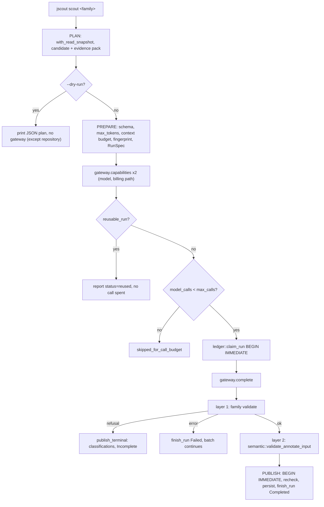
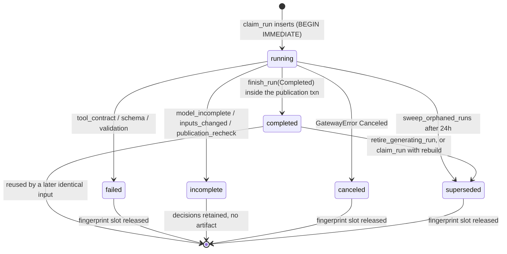
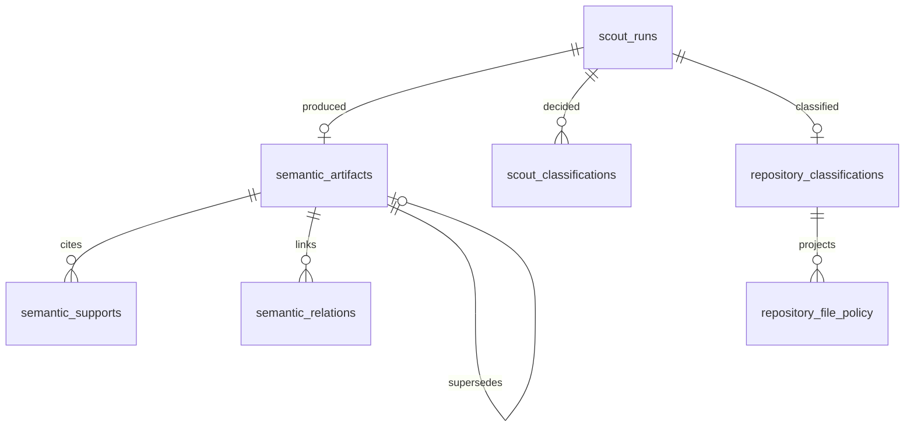

# Scouting: LLM-derived semantic artifacts

Scouting is the only part of jscout that spends money. It takes the deterministic index, slices it into byte-reproducible evidence packs, asks a model to classify or describe each slice through a synthetic submit tool whose enumerations are the planner's own candidate list, validates the answer twice in Rust, and commits the artifact together with its ledger row in a single transaction. The module header states the rule the rest of the subsystem exists to enforce: every model call is recorded in the run ledger before it can publish anything, and "candidate expansion is a Rust change, not model improvisation" (`src/scouting/mod.rs:1-6`). Five artifact families share one four-stage pipeline — PLAN, PREPARE, EXECUTE, PUBLISH — and differ only in what the deterministic input is and what a published result supersedes.

## Five families, one pipeline

Four families write `semantic_artifacts` rows and are refreshable. The fifth, repository reconnaissance, writes immutable `repository_classifications` rows plus a disposable `repository_file_policy` projection; the schema comment calls it policy metadata, not semantic graph memory (`src/store.rs:783-787`). Every entry point is a `jscout scout …` subcommand in `src/commands/scout.rs` (312 lines, six subcommands); nothing in `src/mcp.rs` or `src/agent.rs` reaches into `scouting`.

| Family | Deterministic input | Submit tool | Artifact identity | Persisted as |
| --- | --- | --- | --- | --- |
| workflow | bounded traversal closure from seeds (`semantic::workflow_candidates`) | `submit_workflow_classification` | none (no implicit predecessor) | artifact + supports |
| card | one resolved symbol anchor (`semantic::symbol_candidate`) | `submit_symbol_card` | `canonical_name` = anchor | artifact + supports |
| summary | current child artifacts in a scope | `submit_scope_summary` | scope key (`file:<path>`, `module:<pkg>`, `repo`) | artifact + `summarizes` relations |
| concept | vocabulary group over workflow `/name` and card `/domain_terms/<i>` | `submit_concept` | normalized canonical key | artifact + `related_to` relations |
| repository | package / area / TS-project subject with a JSON evidence pack | `submit_repository_classification` | subject key, immutable | `repository_classifications` → `repository_file_policy` |

Prompt versions are per family and fold into the reuse key (`workflow-scout/v1`, `card-scout/v1`, `summary-scout/v1`, `concept-scout/v1`, `repository-recon/v2`). Sizes: `mod.rs` 3,365 lines, `plan.rs` 1,904, `repository.rs` 1,848, `concept.rs` 925, `card.rs` 753, `summary.rs` 535, `workflow.rs` 448, `ledger.rs` 442, `evidence.rs` 280, `refresh.rs` 229.

## PLAN: deterministic discovery, no gateway

`plan.rs:1-3` states that planning never starts the gateway and never makes a model call. Each planner runs inside `store::with_read_snapshot`, a named SAVEPOINT (`src/store.rs:974-990`), so discovery sees one consistent database even across dozens of queries.

`plan::workflows` (`plan.rs:63`) asks `semantic::workflow_candidates` for a bounded closure per seed group. Truncated traversal or a truncated candidate set is a hard `bail!` in explicit mode and a reported skip in automatic mode — a partially explored neighborhood is not a workflow boundary. Automatic seeds come from runtime boundary edges plus exported symbols in conventional entry files, capped at `AUTO_SEED_LIMIT = 256` (`plan.rs:21`), ordered tier-primary with confidence-weighted in-degree as tiebreak.

`plan::cards_with_selectors` (`plan.rs:259`) branches three ways on `CardSelectors`: `explicit` (`--anchor`), `targeted` (`--file` / `--subject`), and `automatic`. The load-bearing line is `plan.rs:331`: `if selected.is_empty() && mode != "targeted"` bails. Targeted selection that resolves to nothing therefore returns an empty plan silently rather than widening to repository-wide discovery — deliberate, but easy to mistake for "nothing to scout" (a targeted `--file` that is not indexed does still bail, `plan.rs:498`). Card ordering inverts the workflow rule: weight primary, boundary tier as tiebreak, with the comment at `plan.rs:1161-1168` recording why — on the Next.js evaluation snapshot, tier-first ordering filled the entire cap with boundary endpoints from `examples/` and dev infrastructure while the most-referenced production symbols were never selected. Automatic subjects are then stratified round-robin across selection scopes (`stratify_card_subjects`, `plan.rs:434`) up to `CARD_LIMIT = 1024`, so one large package cannot starve every other scope. Scope attachment via `repository_file_policy.subject_key` → neutral recon membership → synthetic `structural:<origin>:<area>` runs only in the automatic branch (`attach_card_selection_scopes`, `plan.rs:394`); targeted mode assigns `anchor:`/`file:`/bare subject keys of its own, and explicit mode assigns `anchor:<resolved>`.

`plan::concepts` (`plan.rs:607`) groups vocabulary from exactly two JSON pointers — a current workflow's `/name` and a current card's `/domain_terms/<i>` — and `add_vocabulary_claim` (`plan.rs:969`) returns early when that exact pointer carries no support, so unsupported prose never becomes vocabulary. Before any spend, a group is refused on freshness plus five bounds in order (`plan.rs:645-678`): any non-fresh child, `concept::MAX_CANONICAL_CHARS` (120), `MAX_CONCEPT_CHILDREN` (64), `MAX_CONCEPT_ALIASES` (32), per-alias `MAX_ALIAS_CHARS` (120), `MAX_CONCEPT_SOURCE_SUPPORTS` (160). Groups are refused whole; the refusal string says so explicitly, because splitting an over-cap group would create several concepts with the same deterministic identity.

`plan::summaries` (`plan.rs:1439`) discovers scopes bottom-up and gates parents on lower-level completeness. One child-bearing file without a current, still-covering file summary gates its whole module; one un-summarized module gates the `repo` scope (`plan.rs:1645-1690`). The tradeoff is stated in the code — a hierarchy that publishes around a missing scope produces an overview confidently wrong about the part it never saw — and the cost is real: with a small `--max-calls` the top of the hierarchy may be unreachable, and the only signal is one gate-skip string per gated scope. Gate skips are reported only in automatic mode; explicit mode `bail!`s with "summary scope `X` is not ready" (`plan.rs:1455-1457`). Child caps are level-dependent: `MAX_SUMMARY_CHILDREN = 64` for file and module, `MAX_REPOSITORY_CHILDREN = 256` for the repository scope (`plan.rs:1397`, `plan.rs:1401`).

## PREPARE: schema, budget, fingerprint

`prepare_workflow` (`mod.rs:1141`), `prepare_card` (`mod.rs:1449`), `prepare_concept` (`mod.rs:1761`), and `prepare_summary` (`mod.rs:2335`) share a shape: build a `CompleteRequest`, resolve model capabilities, enforce the context budget, compute the input fingerprint and request hash, resolve a billing path, assemble a `RunSpec`.

Three of the four submit-tool schemas are generated per request from planner output, with the closed sets as literal `enum` arrays: `workflow::submit_tool_schema(anchors)` (`workflow.rs:28`), `summary::submit_tool_schema(child_references)` (`summary.rs:57`), `concept::submit_tool_schema(source_references)` (`concept.rs:121`). Cards are the exception — `card::submit_tool_schema()` takes no arguments (`card.rs:46`) and `build_card_request` calls it bare (`mod.rs:2871`), because card evidence is line-range objects rather than a closed id set; the bound is enforced only in Rust against the pack's `line_count` (`card.rs:268-292`). Concept aliases are likewise free-form strings in the schema, closed in Rust by an exact-spelling check ("the model cannot invent aliases", `concept.rs:361-364`). The comment at `workflow.rs:24-27` gives the reason for schema generation at all: models comply better when the invalid shape is structurally forbidden, and Rust validation remains authoritative regardless of what the provider accepted. The cost is that the serialized schema is folded into the input fingerprint, so any wording change invalidates every cached run for that family.

`reserve_output_and_measure` (`mod.rs:2979`) sets `max_tokens = 2048 + 512 × output_units`, capped by the model, then measures the serialized request. `enforce_context_budget` (`mod.rs:2994`) refuses over `--context-bytes`, and when the gateway reports a context window it uses the request's UTF-8 byte length as the input-token ceiling — the comment at `mod.rs:3013-3016` explains that pi-ai exposes no common tokenizer and an average bytes/token divisor undercounts punctuation-heavy code. This systematically over-refuses: packs that would fit comfortably are reported over budget, and only the `--context-bytes` half of the check is visible in a dry run.

The input fingerprint is the reuse key. Card, summary, and concept fingerprints are deliberately snapshot-free — the rendered pack already pins everything the model saw, so an unrelated repository edit must reuse the completed run (`mod.rs:3063-3067`). The workflow fingerprint is not: `mod.rs:3039` folds `candidate_set.snapshot` in, so any re-index invalidates every completed workflow run's reuse even when the candidate set is byte-identical. There are tests for card and summary reuse across unrelated changes and deliberately none for workflows. All four also fold prompt version, model spec, reasoning, service tier, gateway `base_url`, `PROTOCOL_VERSION`, `max_tokens`, the tool schema, and the system prompt.

PREPARE is also where the gateway is first touched, twice: `PreparationCache::model` fetches capabilities (`mod.rs:234`), and `cache.billing_path` issues a second `capabilities(None)` round-trip for every provider except `openai-codex` (`mod.rs:255-273`). So the "planning never starts the gateway" claim is true of `plan.rs` and misleading about the stage boundary.

What to look for in the pipeline diagram: the single admission point where reuse is tested before budget, and the three separate exits — reuse, subject-local failure, refusal — that never reach publication.

`ADMIT` sits above `BUDGET` in every runner (`mod.rs:362`, `450`, `536`, `909`, `2247`, `repository.rs:1068`) because `--max-calls` is a spend limit, not a throughput limit. The consequence is that dry-run `would_call: false` is advisory — an item marked as skipped may still run once an earlier item turns out reusable, and every report carries that as a note string. `--rebuild` bypasses `ADMIT` entirely: every site reads `!options.rebuild && ledger::reusable_run(...)`, and `claim_run(conn, spec, true)` supersedes the completed run before inserting.

The runners are not uniform in when they prepare. `scout_workflow_plan` (`mod.rs:330`), `scout_card_plan` (`mod.rs:396`), and `scout_concept_plan` (`mod.rs:505`) prepare everything up front and then loop; `scout_summaries` (`mod.rs:2234`), `scout_refresh` (`mod.rs:852`), and `repository::execute` (`repository.rs:1043`) prepare each subject inline inside the same loop. Dry-run dispatch differs too: `cmd_scout_summaries` goes straight to `summary_dry_run_report`, which plans internally per level, and `cmd_scout_repository` launches a real `ProcessGateway` before printing (`scout.rs:61-73`) because `repository::dry_run_report` calls `prepare` to compute reuse.

## The ledger owns the input

`ledger::claim_run` (`ledger.rs:72`) runs its own `BEGIN IMMEDIATE` and leans on a partial unique index — `CREATE UNIQUE INDEX idx_scout_runs_active ON scout_runs(scout_kind, input_fingerprint) WHERE status IN ('running','completed')` (`src/store.rs:777-780`). A concurrent scout of the same input either gets `RunClaim::Reused` or fails loudly against the in-flight row; there is no application-level lock. Three subtleties live here. A completed run whose artifact has since gained a successor is force-retired to `superseded` before the reuse check, so an A→B→A input cycle can reclaim its slot (`ledger.rs:79-89`). A completed run *without* a recorded artifact stays reusable forever — `reusable_run` is `artifact.id IS NULL OR NOT EXISTS(successor)` (`ledger.rs:179-190`) — because refusing it would strand the unique slot with no way to claim a replacement. And a previous rebuild that superseded the run and then failed still hands the retry its predecessor (`ledger.rs:101-104`).

What to look for in the lifecycle diagram: `completed` is the only reusable state, and it is not strictly terminal.

`finish_run` only updates rows whose status is `running`, which makes that first transition one-way. The `completed → superseded` edge, though, happens outside it via raw `UPDATE`s in `claim_run` (`ledger.rs:80-86`, `91-96`) and `retire_generating_run` (`ledger.rs:196-204`), so a run can undergo a second status change after its nominally terminal one. Every non-`completed` terminal state releases the fingerprint for a fresh attempt.

## Two layers of validation

Layer one is family-specific and enforces the closed contract: every candidate classified exactly once, no unknown anchor / child / source / evidence id, evidence ranges inside the pack's `line_count`, per-claim citations, and body byte caps below `semantic::MAX_BODY_BYTES` (12,000). The bail strings are literal about it — "the model cannot add anchors" (`workflow.rs:201`), "the model cannot add children" (`summary.rs:274`), "the model cannot add sources" (`concept.rs:659`). Refusal exclusivity — an `incomplete_reason` beside any claim is contradictory output, not a partial artifact — is enforced in card (`card.rs:221-243`), summary (`summary.rs:167-178`), and concept (`concept.rs:290-302`), but *not* in workflow: `workflow::validate` returns early on a non-empty reason and silently discards any submitted name, description, and decisions (`workflow.rs:166-177`).

Layer two is `semantic::validate_annotate_input` (`src/semantic.rs:646`), shared with agent annotation: current snapshot, exact current anchors, anchor-belongs-to-evidence-file, on-disk blake3 against `files.hash`, positive ordered spans inside the file's line count, support confidence at least the artifact's, duplicate-support rejection, and — the check most easily missed — that each support's `claim_path` actually resolves in the body, with `/name` as the sole exemption (`semantic.rs:693-698`).

| Failure | Ledger outcome | `error_code` | Batch effect |
| --- | --- | --- | --- |
| tool name mismatch | Failed | `tool_contract` | subject-local, call spent |
| deserialization | Failed | `schema` | subject-local |
| layer-1 contract | Failed | `validation` | subject-local |
| validated refusal | Incomplete | `model_incomplete` | decisions kept, no artifact |
| layer-2 rejection | Incomplete | `inputs_changed` | `Err`, batch aborts with a re-index instruction |
| publication recheck | Incomplete | `publication_recheck` | rollback, `Err` |

Gateway errors split by whether the connection stayed synchronized. `subject_local_gateway_failure` (`mod.rs:3304-3306`) admits only `GatewayError::Remote` with code `timeout` or `tool_contract`, because those carry a correlated terminal frame; local frame timeouts and infrastructure failures remain batch-fatal, which means one transport hiccup discards every remaining prepared subject.

## Publication: one transaction, one recheck

Every publication opens `BEGIN IMMEDIATE`, rechecks inside it, and commits artifact, supports or relations, `scout_classifications`, and `finish_run(Completed)` atomically. `semantic::persist_validated_artifact` deliberately takes no transaction control (`semantic.rs:789`) so the caller owns the boundary.

| Family | Rechecked under the write lock | Predecessor resolution |
| --- | --- | --- |
| workflow | snapshot + every evidence file hash | only from `claim_run` or an explicit refresh id |
| card | snapshot + every evidence file hash (`mod.rs:1677-1691`) | inside the txn by `canonical_name` (`mod.rs:1696-1710`) |
| summary | each relation's pinned `dst_fingerprint` + `expected_summary_child_ids` (`mod.rs:2585-2625`) | inside the txn by scope key (`mod.rs:2627-2641`) |
| concept | each source fingerprint + `expected_concept_child_ids` + lineage (`mod.rs:2030-2071`) | pinned before the call (`mod.rs:1843`), rechecked after `claim_run` and again in the txn |
| repository | `refresh_state` evidence fingerprint after the call (`repository.rs:1252`), then persist under `BEGIN IMMEDIATE` (`repository.rs:1297`) | none; classifications are immutable |

Concept lineage is the strictest of the five because accepting a same-name concept published mid-flight would overwrite a result this run never planned against. Workflow is the loosest: with no in-transaction predecessor lookup, a re-indexed repository can leave the previous workflow artifact current beside a new one for the same seeds until a refresh runs. `current_concept_for_key` (`mod.rs:2129`) also scans and JSON-parses the body of every current concept twice per run and bails on multiple matching lineages rather than merging — an alias collision hard-blocks that concept, and no merge path exists.

Persistence shape:

`semantic_relations` carries `claim_path`, `dst_fingerprint`, and a relation in `('summarizes','names_concept','related_to')`. Summaries emit `summarizes`, concepts emit `related_to`. Every planned child becomes an empty-`claim_path` relation whether cited or not (`summary.rs` `annotate_input`), so a child the model chose not to cite still stales the parent and still blocks publication when it changes. A `possible` child caps the whole artifact, its claim relations, and its whole-input dependencies at `possible`. A unique index on `supersedes_artifact_id` keeps lineage a chain rather than a tree.

## Reconnaissance: the one immutable family

`repository::plan` launches the checker sidecar to enumerate TypeScript project subjects and truncates its own subject set at `max_subjects`, recording `omitted_subjects` (`repository.rs:266-274`). `execute` drives a `VecDeque` worklist; a `mixed` role — or a `ContextBudgetExceeded` from `prepare` while `depth < max_depth` (`repository.rs:1043-1064`) — calls `subdivide` and pushes children onto the *front* of the queue in descending member count, because the parent has already established that its coarse classification is insufficient. The cost is that one deeply mixed subtree can absorb the whole budget before broad, shallow subjects are classified. Evidence is JSON with `E%03d` ids that become the schema enum, and current heuristic file roles are withheld from the pack (`repository.rs:1-4`) so a path-derived guess cannot be laundered into a model-attested classification.

Reconnaissance is also the one place model output is silently repaired rather than refused: duplicate citations are dropped and citations past `MAX_CITATIONS = 8` are truncated (`repository.rs:226-241`), surfacing only as `citation_duplicates_removed` / `citation_excess_truncated` inside `report.decisions` (`repository.rs:1337-1347`). Past `MAX_CITATION_REPAIR_INPUT = 32` it hard-bails, and an unknown citation id bails immediately. Cards have a narrower repair boundary of their own: `repair_claim` truncates to `MAX_RANGES_PER_CLAIM = 4`, but only after every submitted range has passed the file-bound check, and more than `MAX_RANGE_REPAIR_INPUT = 12` ranges fails the claim outright (`card.rs:398-436`). Submitting five valid ranges silently keeps four; submitting five where the fifth is out of file fails the card.

The recon evidence fingerprint is snapshot-free by construction (`recon.rs:189-226`): every member path participates in membership identity, but only the bounded representative files contribute content hashes — plus every `DiskInput` path and hash, so package.json / tsconfig / README-class evidence is hashed in full. Execution ends with `recon::reconcile_file_policy`, and the card and workflow planners then read `repository_file_policy.effective_role` and `.subject_key` back — a feedback loop from reconnaissance into selection.

## Staleness and refresh

Freshness is computed on read (`semantic.rs:1653` and around it): per-support source-stale and context-stale, folded with pinned child fingerprints and, for summaries and concepts, with whether the *current* deterministic child set still matches the stored empty-claim-path dependencies. `refresh::select` (`refresh.rs:61`) picks current, non-fresh, model-generated artifacts whose `config_json` still parses into a replay shape; both queries constrain `run.scout_kind IN ('workflow','card','summary','concept')`, so reconnaissance has no refresh path at all. Runs with no recorded configuration, or a shape that no longer parses, are reported `unsupported_legacy` rather than replayed against a guess.

`RefreshConfig` stores the minimal deterministic input — seeds and depth, an anchor, a level and scope, a term — never a snapshot of the result, so a replacement summary re-plans against the children that are current now. `scout_refresh` (`mod.rs:818`) sorts by dependency rank (workflow/card 0, file 1, module 2, repository 3, concept 4) then artifact id, and prepares each target just-in-time immediately before executing it, so a summary sees successors published seconds earlier in the same command. The price is that preparation is interleaved with gateway calls: a mid-batch abort leaves later targets unprepared, and the batch cannot be planned entirely up front the way initial scouts are. `scout_summaries` behaves similarly by default, running all three levels in one invocation and re-planning each level after the previous one published (`mod.rs:2218-2229`), which is why `summary_dry_run_report` flags its higher levels as provisional.

## Limits worth knowing

`--scope` requires an explicit `--level` and fails rather than guessing, because scope keys are level-specific (`mod.rs:2223-2224`). The gateway's resolved `billing_path` overwrites the provisional one with a bare `UPDATE scout_runs` outside any transaction (`mod.rs:1260` and three parallel sites), so a crash in that window leaves a `running` row until the orphan sweep reclaims it — 24 hours by default (`ORPHAN_SWEEP_MINUTES`, `mod.rs:38`). `ledger::claim_run` documents that callers must not hold a transaction, but nothing enforces it; the constraint is comment-only (`ledger.rs:69-72`). And `scout_workflows`, the single-subject entry point, is `#[cfg(test)]` only — production always goes through `scout_workflow_plan`.

Coverage is 89 inline tests, concentrated on adversarial paths: 43 in `src/scouting/tests.rs`, 12 in `plan/tests.rs`, 11 in `concept/tests.rs`, 8 in `repository.rs`, 7 in `card.rs`, 3 in `ledger.rs`, 2 each in `summary.rs` and `evidence.rs`, 1 in `refresh.rs`. `workflow.rs`, `plan.rs`, and `mod.rs` carry none of their own. The integration tests drive a faked `LlmGateway` over a real tempdir repository indexed by `indexer::index_repo`, so plan, prepare, ledger, validation, and publication all execute against real SQLite — which is what makes the concurrency tests (`card_publication_loses_the_snapshot_race_without_a_partial_write`, `summary_publication_refuses_a_child_added_mid_flight`, `concept_publication_rechecks_a_concurrent_same_identity_concept`) meaningful rather than mocked.

The subsystem is byte-identical to the 2026-08-22 baseline: `git diff 854bff1..4de5622 -- src/scouting/` is empty, and the v26→v29 schema move added only value-flow tables. The practical consequence is asymmetric — existing databases still need a full re-index to reach v29, which invalidates completed *workflow* run reuse via the snapshot-bound fingerprint while card, summary, and concept runs survive the bump untouched.
