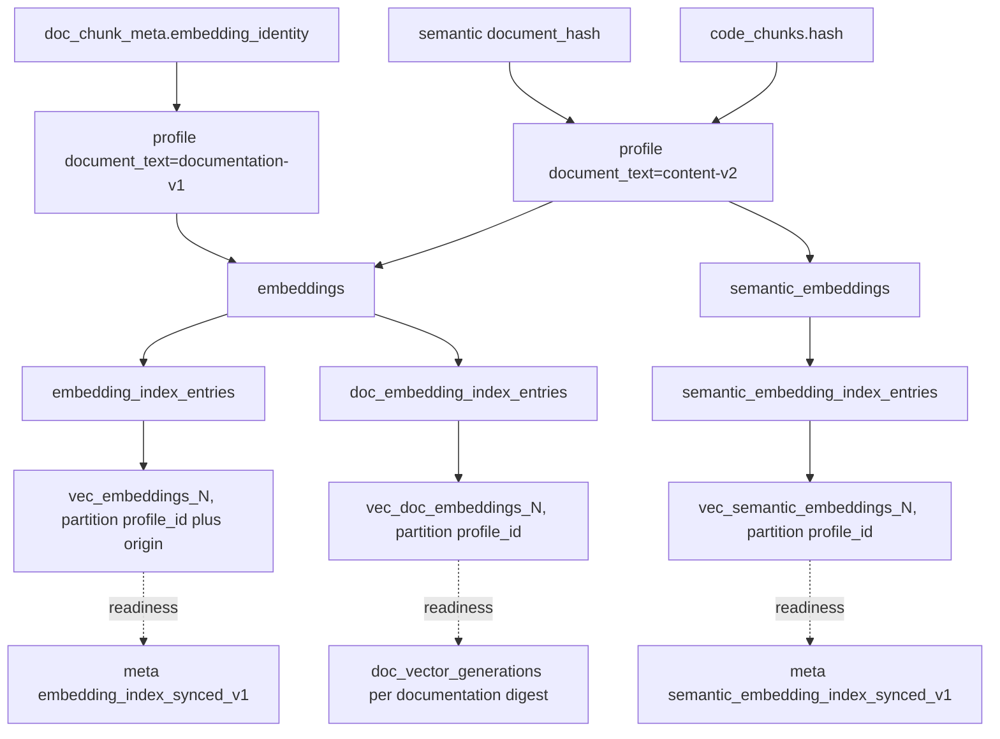
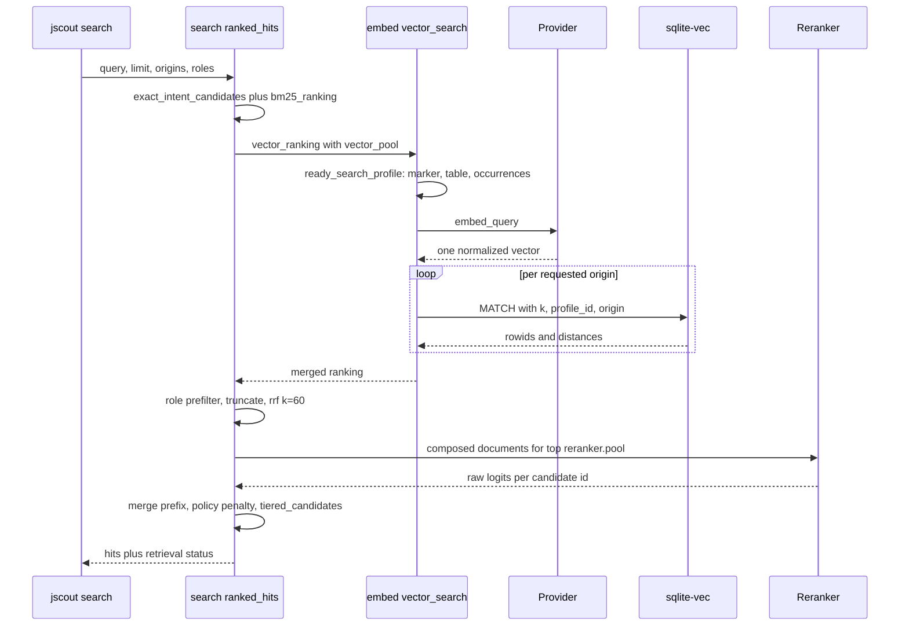

# Semantic layer: embeddings, vectors, and the inference sidecar

jscout turns text into vectors through exactly one abstraction — `embed::Provider` — and routes those vectors into three occurrence planes that share a single durable cache table and a single profile registry. Code chunks are embedded from their raw content and nothing else, so a content hash can key the cache; the path, scope, symbol, and role the vector never saw are reinjected at cross-encoder rerank time, where no cache key constrains the text. Semantic memory artifacts compose their own document but reuse the *same* profile row as code; documentation is the only plane that forks a distinct profile, and it does so by changing one field of the profile's config JSON. Around this sit a pluggable provider matrix (a loopback Python sidecar, Voyage, and anything OpenAI-compatible), a sqlite-vec materialization layer whose rowids are owned by ordinary SQLite tables, per-origin KNN to work around sqlite-vec applying `k` before any join, and a degradation ladder that always returns BM25 results with a named repair command rather than failing the query.

## Two documents per chunk, on purpose

`embed_text` (`src/embed.rs:529`) returns the chunk's content verbatim, truncated at 24,000 **bytes** with a backward walk to the nearest `is_char_boundary` (`src/embed.rs:531-539`). The doc comment above it (`src/embed.rs:525-528`) states the constraint: the durable cache is keyed `(chunk_hash, profile_id)` (`src/store.rs:739-745`), and `chunk_hash` is a blake3 of content. Folding an occurrence-specific path or scope into the embedded text would force fifty byte-identical helper occurrences to nominate an arbitrary representative path, collapsing content-hash dedup into one vector per occurrence. `src/embed/tests.rs:181` pins this negatively — it asserts the embedded text does *not* contain `// file:`, a header an earlier format prepended.

The dropped metadata comes back at rerank time. `reranker_document` (`src/search.rs:2254`) composes `path / scope / symbol / kind / role / origin / lines`, a blank line, and the content (`src/search.rs:2312-2314`), adding `deterministic_role` and `scouted_scope_role` when a `repository_file_policy.scope_role` exists. It is truncated by `truncate_utf8` (`src/search.rs:2827`), which — like `embed_text` — takes a **byte** budget: `reranker.max_chars`, default 4000 (`src/config/load.rs:762-767`). So the cross-encoder sees a rich, occurrence-specific document; the bi-encoder sees bare source. The cost is that the vector cannot distinguish two byte-identical helpers in different packages, and only a reachable reranker recovers the distinction.

## The provider matrix

`Provider::from_settings` (`src/embed.rs:167`) is explicit-only. The comment at `src/embed.rs:19-20` is the rule: API keys never select a provider, and `OPENAI_API_KEY` is never forwarded to a custom endpoint. Three protocols exist.

| | `local` | `voyage` | `openai` |
|---|---|---|---|
| URL | `{inference.url}/embed` | fixed `https://api.voyageai.com/v1/embeddings` | `https://api.openai.com/v1/embeddings` or a validated `embedding.url` |
| Default model | `BAAI/bge-m3` | `voyage-code-3` | `text-embedding-3-small` (`src/config/load.rs:589-594`) |
| Credential | none | `VOYAGE_API_KEY`, required | `OPENAI_API_KEY`; `JSCOUT_EMBED_KEY` **optional** when `embedding.url` is set (`src/embed.rs:216-232`) |
| Body | `{model, texts, deadline_ms}` | `{model, input, input_type}` | `{model, input}` (`src/embed.rs:404-416`) |
| Query/document split | none | `input_type: query \| document` | none |
| Attempts | 1 | 4 at 0/2s/8s/20s | 4 at 0/2s/8s/20s (`src/embed.rs:329-335`) |
| Response fingerprint | yes | no | no |

Two details carry weight. The credential-namespace split means pointing `embedding.url` at LM Studio, vLLM, a gateway, or a mistyped host cannot leak an OpenAI secret to it; `validate_endpoint` (`src/embed.rs:152`) also rejects non-http(s) schemes and any authority containing `@`. The retry asymmetry encodes a judgement: a local sidecar that is down will not come back within 20 seconds, while a rate-limited API will. The price is that a local service merely slow to load a model on first request gets no second attempt.

`default_query_prefix` (`src/embed.rs:141`) substring-matches the model name to inject the instruction prefixes nomic/CodeRankEmbed and Qwen3 embeddings expect — dead weight on the default path, since `from_settings` hard-codes `query_prefix: String::new()` for `provider = "local"` (`src/embed.rs:192`), discarding any configured `embedding.query_prefix`. Only the remote providers ever prepend one.

## Profile identity, and why documentation forks but semantic memory does not

`profile_for` (`src/embed.rs:254`) builds a protocol-specific config JSON that always carries a `document_text` field, then blake3-fingerprints `(provider, model, config_json)`. For `local` it first GETs `{base}/configuration`, asserts `provider == "local"`, model agreement, and revision agreement when configured, reads `dimensions` from the service, and embeds the service's entire `embedding` object verbatim into the config JSON (`src/embed.rs:283-293`) — so any field the service reports becomes part of profile identity. Voyage and OpenAI carry `dimensions: None` and learn dimensionality from the first response.

`document_text` is the fork point. Code passes `DOCUMENT_TEXT_FORMAT = "content-v2"` (`src/embed.rs:9`); documentation passes `docs::CHUNK_FORMAT_VERSION = "documentation-v1"` (`src/docs/mod.rs:11`). Same provider, same model, two profile rows, two disjoint vector spaces inside one `embedding_profiles` table — `src/embed/tests.rs:300` asserts exactly that.

Semantic memory is the exception. `embed_semantic_missing_interruptible` calls `provider.profile()` (`src/embed.rs:938`), which resolves to `content-v2` — the **same profile row and profile id as code**. `SEMANTIC_DOCUMENT_TEXT_FORMAT = "semantic-v1"` (`src/embed.rs:10`) is not in the profile at all; it is hashed into each artifact's `document_hash` (`src/embed.rs:602-605`). Bumping the semantic format therefore invalidates only semantic rows, while bumping the code or docs format forks a whole profile and forces a full re-embed. Semantic documents are cheap and few, code chunks are not — but the consequence is that there are two profiles here, not three, and one of them is shared.

`ensure_profile` (`src/embed.rs:1086`) inserts the row and calls `ensure_vector_table`. `existing_profile` (`src/embed.rs:1030`) carries one compatibility path: legacy `jscout-local-v1` profiles differing only by a `device` key are reused rather than duplicated (`src/embed/tests.rs:116`), and an ambiguous multi-match refuses to guess (`src/embed.rs:1077-1083`) — unrecoverable in place for anyone who created two such profiles on two machines.

The diagram below shows how the planes share storage. Look for the two edges that both land on `CACHE`, and for `PCODE` feeding both the code cache and the semantic cache.

`CACHE` holds both code chunk hashes and documentation embedding identities; the only separator is `profile_id`, which differs solely through the `document_text` field. `VCODE` is the only vec0 family with an `origin` partition key, because only code files have an origin.

## Selection, dedup, and batching

`missing_embedding_documents` (`src/embed.rs:638`) groups by `code_chunks.hash`, anti-joins `embeddings` for the profile, applies origin flags, and for `--product` requires `repository_file_policy.effective_role='runtime'` with a `role IN ('production','unknown')` fallback when no policy row exists. It selects `MIN(c.content)` alongside `COUNT(DISTINCT c.content)` and **bails** when a hash maps to more than one content (`src/embed.rs:686-690`) rather than caching an ambiguous vector.

The query reads the `code_chunks` view (`src/store.rs:434`), which is `chunks JOIN code_files` where `code_files` is `files WHERE corpus='code'` (`src/store.rs:429`). That view is why a documentation chunk cannot enter the code vector plane even under a `chunks.hash` collision — `src/embed/tests.rs:608` forces exactly that collision between a `.ts` chunk and a `.md` chunk and asserts only the code chunk materializes. But nothing *structural* enforces it: `embedding_index_entries.chunk_id` references the raw `chunks` table (`src/store.rs:758`) and there is no trigger. The invariant holds because every writer query happens to select through `code_chunks`/`code_files` (`src/embed.rs:647-648`, `1450-1452`); the delete path joins raw `chunks` (`src/embed.rs:1831`, `1849`) and is safe only as a consequence.

Local requests cap at 16 per batch (`src/embed.rs:825-829`): sixteen fully expanded 24k-byte chunks stay inside the sidecar's `MAX_INPUT_CHARS = 500_000` and its 4 MiB body cap. Anyone reading the sidecar's `MAX_EMBED_INPUTS = 128` will overestimate the achievable batch. Each batch opens its own `BEGIN IMMEDIATE`, writes `INSERT OR IGNORE INTO embeddings`, and commits, so an interrupted pass leaves completed vectors durably cached. `should_cancel` is checked between batches and surfaces as `canceled` — watch relies on this (`src/watch.rs:1148`). In the report, `cached_reused` counts *representations* reused rather than occurrences, and `occurrences_synced` is the total selected occurrence count for the profile (`src/embed.rs:721-745`), not the number this pass synchronized.

## Materialization and the marker-ordering hazard

`vec_embeddings_{dims}` is `vec0(embedding FLOAT[d] distance_metric=cosine, profile_id INTEGER PARTITION KEY, origin TEXT PARTITION KEY)` (`src/embed.rs:1169-1173`). vec0 has no foreign keys, so `embedding_index_entries.id` *is* the vec0 rowid and the ordinary table owns identity; sync and repair reconcile against it.

One table per dimensionality serves every profile of that dimensionality, which creates a hazard: publishing a fresh empty vec0 table while a completion marker still exists would let a reader treat an empty index as synchronized. `ensure_vector_table` (`src/embed.rs:1151-1167`) therefore deletes every `embedding_index_synced_v1:<id>` meta key for that dimensionality *before* the `CREATE VIRTUAL TABLE`, inside a savepoint.

`synchronize_vector_index` (`src/embed.rs:1336`) picks the cheap path deliberately: a full `sync_vector_index` runs only when `repair` was requested, or the completion marker is absent, or the vec0 table has vanished. Otherwise a regular-table anti-join asks whether the profile has unmaterialized occurrences; if not it returns immediately, and if so `materialize_profile` (`src/embed.rs:1447`) inserts only the new entry rows and their vec0 counterparts, carrying `code_files.origin` into the partition column. The indexer has a provider-free hook of its own: when `outcome.indexed > 0`, the publication transaction calls `materialize_cached_embeddings` (`src/indexer.rs:658-660`), reusing cached vectors for newly indexed occurrences without contacting any provider.

## Per-origin KNN

`exact_vector_search` (`src/embed.rs:1791`) issues **one** KNN query per requested origin, each with `v.k=?2 AND v.profile_id=?3 AND v.origin=?4`, then merges, sorts by score (`1.0 - distance`) descending, and truncates. sqlite-vec applies `k` before any joined predicate can be inspected, so a single query would let `dependency` chunks consume the budget a caller wanted spent on `repository`. The same constraint appears one level up in `candidate_pool_limits` (`src/search.rs:2196`): the base pool is `limit.max(10) * 5`, and a role filter quadruples the *vector* pool, because a selective role filter applied after KNN would starve the vector ranking and tilt RRF toward BM25. The cost of both is up to 3× the KNN work per query plus a merge and sort in Rust.

## Semantic memory and supersession

`semantic_embedding_documents` (`src/embed.rs:563`) composes `semantic artifact / type / name / anchors / body_json` and deliberately places the distinct `semantic_supports.anchor_key` values *before* `body_json`: workflow bodies are unbounded and the 24 KB cut would otherwise eat the anchors, which are the bridge back to code (`src/embed.rs:594-597`).

Semantic memory is code-bound for invalidation. Atomic semantic query/read responses and `annotate` carry the current code digest as top-level `snapshot` plus `publication_snapshot`, the fold of the code, documentation, and provenance components. The fold is not itself a freshness or write gate. Newly persisted semantic artifacts, scout runs, and repository classifications store the code digest as `source_snapshot` behind the `code-v1:` domain prefix; legacy values remain opaque provenance rather than being compared across digest domains.

Supersession is filtered at three points, and they are not equivalent. `semantic_embedding_documents` unconditionally excludes artifacts with a successor (`src/embed.rs:576-579`), and so does `exact_semantic_vector_search` (`src/embed.rs:1731-1734`), which over-fetches `k = limit * 4` capped at 4096 to survive its own filter. But `rank_artifacts` (`src/semantic.rs:990-993`) makes the predicate *conditional* on an `include_superseded` flag threaded from `semantic_query::QueryOptions`, so under `--include-superseded` a superseded artifact can rank lexically but can never return through vectors. `rank_artifacts` also clamps the caller's vector limit to `[100, 1000]` (`src/semantic.rs:1049`), discarding most of `semantic_query`'s computed `limit * 5`.

Freshness is maintained by hash: `sync_semantic_vector_index` (`src/embed.rs:1224`) deletes any entry whose stored `document_hash` no longer matches the artifact's current hash, from both the entry table and the vec0 table (`src/embed.rs:1251-1259`). Publishing an artifact calls `mark_semantic_vector_index_stale` (`src/semantic.rs:860`), which deletes *all* semantic sync markers, not just the affected profile's. `annotate_request_with_provider` (`src/semantic.rs:500`) preflights readiness before the write so an interactive annotation is never dragged into a full-corpus embed, then tops up with `embed_semantic_missing(conn, provider, 16)` only when the plane was healthy beforehand; a post-write inference failure downgrades `vector_memory` to `degraded` and keeps the annotation, because retrying would duplicate memory. Both `Ok(false)` ("no profile yet") and `Err(..)` ("service down") map to `degraded`, and the distinction survives only in the suggested action string (`src/semantic.rs:513-524`).

## Reranking, and what runs after it

`Reranker::from_settings` (`src/search.rs:1528`) returns `Some` only when `reranker.url` is configured or `embedding.provider == "local"`, in which case it derives `{inference.url}/rerank`. `pool` is `reranker.top.min(100)`; `reranker.top` defaults to 50 and is rejected above 100 in config, clamped when set by env (`src/config/load.rs:735-746`). `Reranker::rerank` (`src/search.rs:1545`) POSTs `{model, query, deadline_ms, candidates:[{id, text}]}`, reads only the `scores` array, and demands that the returned id set equal the sent set *and* the counts match, discarding the entire result otherwise (`src/search.rs:1579-1582`). Ties break on incoming order, and `merge_reranked_prefix` (`src/search.rs:2209`) places the reranked prefix ahead of the untouched RRF tail.

Three things about that stage are easy to misread. The returned scores are raw cross-encoder logits — unbounded, not probabilities, not comparable across models — so a reranker that scores everything negative still overrides the RRF prefix. An `Ok` response whose `scores` array is empty falls through the `Ok(_) => {}` arm (`src/search.rs:2126`): neither `active` nor `degraded`, with RRF order silently retained. And the reranker is *not* the last ordering stage: `apply_repository_policy_penalty` re-sorts the whole fused list whenever no role filter is set (`src/search.rs:2139-2141`), and `tiered_candidates` prepends exact-intent candidates that never passed through RRF or the cross-encoder at all.

The following sequence shows a ranked code query end to end. Watch the `loop` block — that is the per-origin KNN — and note that the two `S->>S` steps after the reranker reply are the ones that can reorder its output.

This path is reached only in `SearchMode::Ranked`; exhaustive mode hard-errors if a provider, rerank, expand, or memory is enabled (`src/search.rs:1648-1652`).

## The Python HTTP contract

`src/inference.rs:10` launches `uv run --project <dir> python service.py`, passing host, port, batch size, max length, model, revision, and cache location as `JSCOUT_*` environment variables; `resolve_project` (`src/inference.rs:117`) locates the project by walking ancestors of the cwd and then of the executable. `inference/service.py` is a stdlib `ThreadingHTTPServer` with four routes.

| Route | Contract |
|---|---|
| `GET /health` | `{status, service, provider, embedding:{model, loaded}, reranker:{model, loaded}, runtime}`; stays answerable without ML dependencies by catching a `configuration()` failure into `{available:false, error}` (`inference/service.py:219-222`) |
| `GET /configuration` | `{available, provider, device, embedding:{model, dimensions:1024, revision, configuration:{pooling:"cls", normalized:true, max_length, dtype}}, reranker:{…}}`; `503 {error:"inference_unavailable", detail}` with `detail` truncated when torch is missing (`inference/service.py:376`) |
| `POST /embed` | `{model, texts, deadline_ms}` → `{provider, model, revision, device, dtype, dimensions, configuration, vectors, usage}`; model must match exactly (`inference/service.py:90-94`) |
| `POST /rerank` | `{model, query, candidates:[{id,text}], deadline_ms}` → `{provider, model, revision, device, dtype, scores:[{id,score}], usage}` |

Limits: 4 MiB body, 128 embed inputs, 100 rerank candidates, 500,000 total characters, `deadline_ms` in `[100, 600000]`. Torch is imported lazily (`inference/service.py:130`) so BM25-only installs never pay for it; device selection is MPS→float16, CUDA→float16, else CPU→float32 (`:133-138`). A single `_run_lock` serializes all inference, because a predictable queue is safer than concurrent requests exhausting unified memory on MPS (`:123-124`); deadlines are checked when acquiring the lock and between batches. The bind refuses a non-loopback host unless `JSCOUT_INFERENCE_ALLOW_REMOTE` is truthy (`:430-436`). The embed model is hard-pinned — any `JSCOUT_EMBED_MODEL` other than `BAAI/bge-m3` raises at construction (`:109-113`) — and both HF revisions are pinned to commit SHAs so a mutable `main` cannot change vector semantics under an existing fingerprint (`:28-31`).

Only the local protocol closes the loop on drift. `embed_texts` re-derives a fingerprint from the response's echoed `model` / `dimensions` / `revision` / `configuration` (`src/embed.rs:435-449`) and `validate_response_profile` (`src/embed.rs:1911`) rejects the batch if it differs from the one seen at discovery. That check is fragile in one respect: `serde_json` is built with `preserve_order` (`Cargo.toml:28`), `profile_for` copies the service's `embedding` object verbatim, and `embed_texts` reconstructs it with a fixed key order — so adding or reordering a key in `service.py::configuration()` would not merely fork the profile, it would make every local embed fail with "configuration changed between discovery and embedding". Voyage and OpenAI-compatible responses carry no fingerprint, so a remote endpoint silently swapping the served model behind the same name is undetectable except through dimensions, which are themselves guarded three ways: `validate_vectors` rejects non-uniform lengths within one response (`src/embed.rs:478-507`), the write loop bails per vector against the resolved profile (`src/embed.rs:857-859`), and a mid-pass profile id change aborts the operation (`src/embed.rs:848-852`).

## How documentation relates

The documentation plane shares almost everything above the storage line and little below it. Shared: `embed::Provider`, `ProfileSpec`/`ResolvedProfile`, `validate_response_profile`, `vec_to_blob`, the `embeddings` cache table, the `[embedding]` settings block, and `search::Reranker` verbatim. `jscout docs embed` refuses to run without the repository's configured provider, with an error that names the asymmetry: BM25 documentation search does not need one (`src/commands/docs.rs:80-92`). Separate, each for a stated reason:

- **Cache keys are not chunk hashes.** `embedding_identity` (`src/docs/corpus.rs:280`) is a domain-separated, length-prefixed blake3 over `(nearest_heading, rendered_body)`, and the provider text is `heading + "\n\n" + body` (`src/docs/corpus.rs:267`). This is the one genuinely *composed* embedding input in the system — permissible precisely because the identity hash is computed over the same composition rather than over raw file bytes. Those identities are written into the `embeddings.chunk_hash` column under the docs profile (`src/docs/retrieval.rs:313-318`).
- **Occurrences live in their own tables.** `doc_embedding_index_entries` and `vec_doc_embeddings_{d}`, partitioned by `profile_id` only. `src/store.rs:765-766` gives the reason directly: sqlite-vec applies `k` before a relational corpus filter can run, so mixing corpora in one vec0 table would let code chunks consume the docs result budget. The cost is duplicated lifecycle code — docs re-implements `existing_profile`, `ensure_profile`, and `ensure_vector_table`, with a stricter collision check requiring provider, model, and config JSON to agree verbatim on a fingerprint match (`src/docs/retrieval.rs:731-734`).
- **Readiness is a generation row, not a meta marker.** `doc_vector_generations(snapshot, profile_id, dimensions, chunk_format_version)` stores the documentation digest in its `snapshot` column. Docs vectors must be exactly current with that digest. Index publication rematerializes from the durable cache when extraction reset, the documentation digest changed, or any current docs profile lacks a ready generation; an incomplete cache is a normal NotReady state. The digest transition also purges obsolete-contract occurrence rows whose profiles no longer enter the readiness scan. Code-only publications therefore leave an already-ready documentation generation untouched, while a full refresh can restore one provider-free even when the documentation digest did not change.
- **Retrieval is full-corpus, not top-k.** `vector_search` (`src/docs/retrieval.rs:1007`) re-audits completeness at query time (`occurrence_count == expected`, `:1054-1057`), sets `k = occurrence_count` when that fits under `SQLITE_VEC_MAX_K = 4096`, and asserts `candidates.len() == k` (`:1098-1102`); above 4096 it falls back to a `vec_distance_cosine` scan over the cache (`:1106`). Determinism is bought with cost linear in corpus size on every query, and with brittleness: one missing vec0 row turns the whole docs vector leg into an error rather than a shorter list.
- **Batching clamps unconditionally.** `embed_current` uses `batch.min(16)` for every protocol (`src/docs/retrieval.rs:282`), unlike the code and semantic passes which clamp only for `Protocol::Local`.

Docs search reports three vector outcomes rather than two — `NotReady` (no profile, or no generation for the current documentation digest) is distinct from `Degraded` (an error), and `vector_required` converts either into a hard failure. Its `reranker_document` composes `path / title / description / tags / breadcrumb` and the rendered body, then goes to the same `/rerank` endpoint.

## Degradation, and what it does not tell you

Failures are classified into `VectorFailure { plane, kind: Inference | Index }` (`src/embed.rs:66`) so the operator gets a command rather than a stack trace: an inference failure says "start or repair the configured embedding service, then retry", an index failure says `jscout embed <root> --repair` for code or `--semantic-only` for semantic. Search returns BM25 results in every case. The catch-all arm (`src/embed.rs:112-122`) maps *any* unclassified error to the index action, so an unexpected failure is reported as needing a repair pass even when repair is irrelevant. Three other edges are worth carrying:

- `delete_vector_rows_for_file` deletes **all** `doc_vector_generations` rows for the affected profile, not just the current documentation digest's. One deleted `.md` file invalidates that profile's documentation vector readiness until the publication path rematerializes a complete cached generation or `docs embed` supplies the missing representation.
- `rebuild_profile_generation_from_cache` (`src/docs/retrieval.rs:888`) deletes the profile's generation row, entries, and vec0 rows *first* (`:894-905`) and only then checks whether the cache is complete (`:938-945`), so a failed rebuild demolishes a previously ready generation. `expected == 0` also returns `None`: a repository with no embeddable documentation occurrences is never "ready".
- `clear_vector_rows` (`src/embed.rs:1875`) empties `vec_embeddings_*` and every `vec_doc_embeddings_*` but never touches `vec_semantic_embeddings_*`, because semantic memory is durable across resets. It calls `ensure_vector_table` first, so a reset on a database with no code vec0 table creates one in order to empty it.

Finally, the format constants — `DOCUMENT_TEXT_FORMAT`, `SEMANTIC_DOCUMENT_TEXT_FORMAT`, `docs::CHUNK_FORMAT_VERSION` — are plain strings with no compile-time link to the functions composing the corresponding text. Changing a composition function without bumping its constant silently reuses vectors from the old representation, and nothing in the build notices.

## Testing

`src/embed/tests.rs` holds 19 `#[test]` functions, all against real temp-directory SQLite databases opened through `crate::store::open` with hand-written inserts rather than mocks. There is no HTTP fake, so provider request and response handling is covered only indirectly — `Provider` struct literals that never call out — or negatively, via `endpoint_failures_name_the_url` (`src/inference.rs:169`) hitting a closed port. The load-bearing cases are `document_embedding_text_is_content_addressed_and_utf8_bounded:172` (content-only text and the char-boundary cut, exercised with 20,000 multibyte characters), `embedding_profile_versions_the_document_text_format:300`, `missing_embeddings_are_selected_once_per_content_hash:336`, `documentation_hash_collision_never_materializes_in_code_vectors:608`, the incremental/repair pair at `:753` and `:840`, and `failed_marker_invalidation_does_not_publish_an_empty_vector_table:1012`. `inference/service.py` has no test file in the repository — its request validation is written as pure functions taking an injectable provider, so it is testable but untested here — and nothing exercises the Voyage or OpenAI wire formats end to end.
