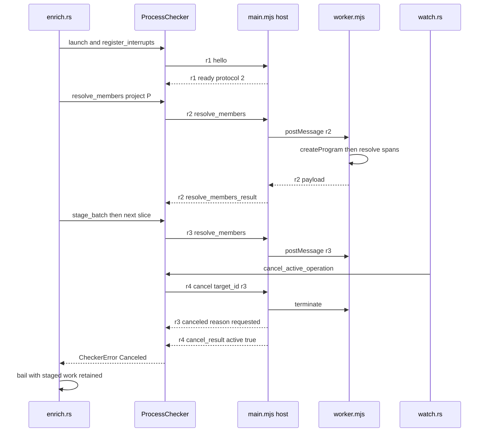
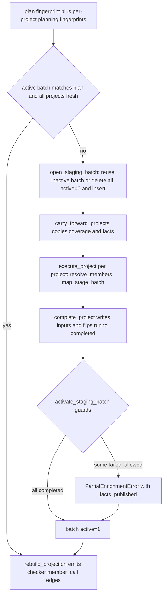
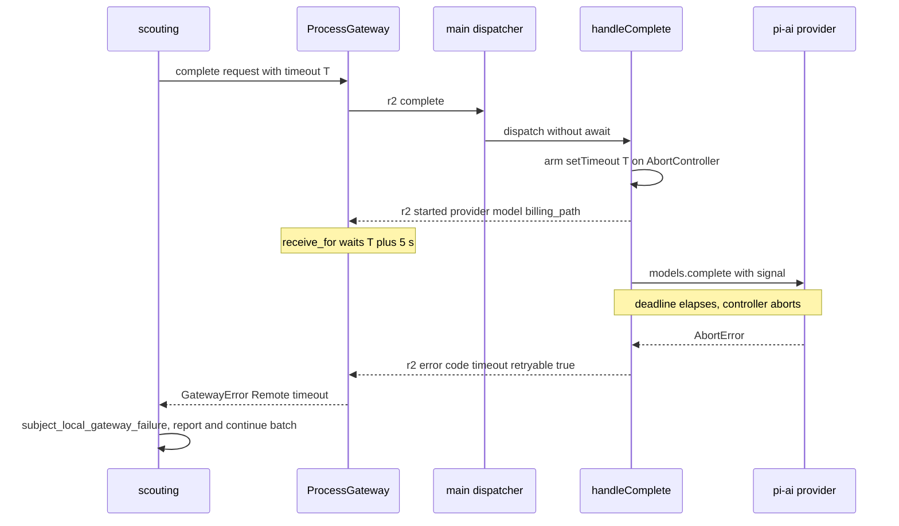

# Sidecar processes: the TypeScript checker and the LLM gateway

jscout is a Rust program that needs two answers it cannot compute in-process: what TypeScript's type checker says a `receiver.method()` call resolves to, and what a language model returns for a structured prompt. Both come from Node child processes spoken to over a versioned, one-request-at-a-time JSONL protocol on stdin/stdout. The checker sidecar (`checker/`, driven by `src/checker/`) loads a real `ts.Program` and answers member-resolution queries; the pi-ai gateway (`gateway/`, driven by `src/llm/`) owns provider registration, credentials, retries, and the request deadline. In both cases Rust keeps everything durable — request correlation, local timeouts, cancellation routing, reply validation, and all database state — so a crashed or killed child costs at most the in-flight request, never the accumulated work.

## One frame shape, two protocols

Every message on either wire is one JSON object on one line, tagged `{protocol, id, kind, ...}`. Rust flattens an `Outbound` enum into that envelope with `serde(tag = "kind")` and a serializer that stamps the compiled protocol constant (`src/checker/protocol.rs:277-290`, `src/llm/protocol.rs:216-229`); the Node sides stamp the same field in `writeMessage` (`checker/src/protocol.mjs:6-8`, `gateway/src/protocol.mjs:50-52`). Request ids come from a per-client `AtomicU64` rendered `r{n}` starting at `r1`, so the handshake is always `r1` (`src/checker/process.rs:107`, `src/llm/process.rs:126`). The checker speaks protocol 2 (`src/checker/protocol.rs:3`), the gateway protocol 1 (`src/llm/protocol.rs:8`), and neither negotiates: a `ready` reporting a different number aborts the connection outright (`src/checker/process.rs:296-302`, `src/llm/process.rs:271-278`). Version skew between a jscout binary and a stale sidecar checkout therefore fails at handshake rather than in the middle of a batch.

The transport code on the Rust side is near-identical in both clients. `spawn` pipes all three stdio handles, moves stdout into a thread that deserializes each non-blank line into `Inbound` and pushes it down an `mpsc` channel, and moves stderr into a thread that reprints lines with a `typescript-checker:` or `pi-ai-gateway:` prefix (`src/checker/process.rs:239-278`, `src/llm/process.rs:203-251`). A malformed line is terminal by construction: the reader thread sends the error and returns, so the channel disconnects and every later receive observes `ChildExited`. There is deliberately no framing recovery — a reader that cannot find the next message boundary has no safe way to resynchronize.

| Property | Checker | Gateway |
|---|---|---|
| Command | `node <sidecar> <repo-root>` (`src/checker/process.rs:240-244`) | `node <gateway>` with a curated env (`src/llm/process.rs:203-214`) |
| Protocol constant | 2 | 1 |
| Line cap | 4 MiB, answered with an `oversized_line` error; the reader keeps going (`checker/src/protocol.mjs:4,14-16`) | 16 MiB, treated as unrecoverable: error frame, stderr line, `exit(1)` (`gateway/src/protocol.mjs:9`, `gateway/src/main.mjs:86-91`) |
| Line splitting | `readline` interface (`checker/src/protocol.mjs:32-36`) | manual `Buffer.indexOf(0x0a)` with a byte guard (`gateway/src/protocol.mjs:22-47`) |
| Handshake timeout | 30 s (`src/checker/process.rs:17`) | 30 s (`src/llm/process.rs:26`) |
| Per-request timeout | caller-supplied; expiry kills the child (`src/checker/process.rs:494-499`) | remote deadline plus a 5 s local grace (`src/llm/process.rs:426-428`) |
| Concurrency | one active request; a second gets `busy` (`checker/src/main.mjs:84-88`) | one active completion; a second gets `busy` (`gateway/src/server.mjs:143-150`) |
| Shutdown | `shutdown` then 500 ms `try_wait` poll, then kill (`src/checker/process.rs:511-528`) | same shape, 20 ms poll interval (`src/llm/process.rs:488-504`) |
| Restart on failure | none | none |

Neither client restarts a child. `ProcessGateway::poisoned()` exists only under `#[cfg(test)]` (`src/llm/process.rs:388-391`) and `ProcessChecker`'s `poisoned` is a private field read only in `Drop`; the invariant that a poisoned client is not reused holds by construction rather than by a check. Enrichment spawns a fresh sidecar per project and propagates the error upward, and scouting continues a batch only for remote error codes that never poison (see below). Recovery is delegated entirely to the durable staging ledger described later.

## The checker wire protocol

| Kind | Payload | Reply | Notes |
|---|---|---|---|
| `hello` | — | `ready {versions{sidecar,node,protocol}}` | Answered by the host without touching the worker (`checker/src/main.mjs:94-105`) |
| `capabilities` | — | `capabilities_result` | TypeScript version and source, per-project summaries with purpose and evidence, configuration problems |
| `plan_members` | `files: [repo-relative]` | `plan_members_result` | Per-file `project_ids` / `excluded_project_ids` plus `tooling_fallback`; no Program is built (`checker/src/worker.mjs:592`) |
| `resolve_members` | `project_id`, 1–512 queries of byte spans | `resolve_members_result` | Reply carries `checker_input_fingerprint`, one result per query in request order, and `resources` (`checker/src/worker.mjs:678-711`) |
| `validate_project` | `project_id`, `fingerprint` | `validate_project_result` | Must follow `resolve_members` in the same worker or fails `project_not_loaded` (`checker/src/worker.mjs:714-717`) |
| `cancel` | `target_id` | `canceled` + `cancel_result` | Two frames with different ids (`checker/src/main.mjs:114-124`) |
| `shutdown` | — | `shutdown_result` then `exit(0)` | Host terminates the worker first (`checker/src/main.mjs:125-132`) |
| `resolve_member`, `validate_inputs` | — | — | Implemented in Node; the first is `#[cfg(test)]`-only in Rust (`src/checker/protocol.rs:13-16`), the second has no Rust `Outbound` variant at all |

The last row is real drift, not an oversight of the table: the Node wire surface is strictly larger than the surface production Rust speaks, and `resolve_member` duplicates roughly fifty lines of `resolveInProject` (`checker/src/worker.mjs:737-788`) to serve a request only tests send.

## Host and worker inside the checker

`checker/src/main.mjs` is a protocol host and nothing more — its header comment says so. It parses a line, refuses a second concurrent request with `busy`, records `{id, kind}` as `active`, and `postMessage`s the whole frame to a `worker_threads` Worker running `worker.mjs`, stamping the reply with the original id when it comes back (`checker/src/main.mjs:47-91`). That split exists because `ts.createProgram` and checker queries block for seconds; a single-threaded host could not answer `cancel` or `shutdown` while the type checker was running. The price is that cancellation is implemented as `worker.terminate()` (`checker/src/main.mjs:114-122`), which destroys the built Program, the tsconfig discovery cache, and every cached `SourceFile` — a canceled project always resumes from Program construction, and a subsequent `validate_project` fails `project_not_loaded`.

Worker failures are correlated back onto the active request rather than dropped. A Worker `error` becomes `error {code: "checker_crash"}` whose detail has every occurrence of the repository root replaced with `<repository>` and is truncated to 64 KiB (`checker/src/main.mjs:40-45, 56-67`); a silent worker exit becomes `checker_exit` (`:68-78`). The one failure with no protocol frame is the host's own `uncaughtException` handler, which writes `jscout-checker: protocol host failed` to stderr and exits 1 (`checker/src/main.mjs:157-160`) — Rust sees only a disconnected channel and reports `ChildExited` with no diagnosis.

Inside the worker, exactly one `ts.Program` exists per process, enforced from both directions: a second project id raises `project_switch` (`checker/src/worker.mjs:433-437`), and `validate_project` raises `project_not_loaded` unless a Program is loaded for that id (`:714-717`). That constraint is what shapes `execute_project` in Rust — spawn a fresh sidecar, drain the project's batches, validate, drop (`src/checker/enrich.rs:2181-2299`) — and it exists because keeping several Programs alive made peak memory proportional to every overlapping tsconfig a repository-wide run touched.

The diagram below traces one project's execution and the supersession cancel path. Watch for the two-frame cancel reply, and for the fact that `terminateWorker` and the `canceled` frame precede any acknowledgement to the canceller.

`ProcessChecker::receive_for` (`src/checker/process.rs:459-492`) loops until it sees a frame whose id equals the awaited one. Any other id poisons the client with `message for unexpected request id`. The single tolerated interloper is `cancel_result`, and the checker discards its contents entirely — `let _ = (target_id, active);` at `src/checker/process.rs:468-473` — so a cancel that arrived too late (`active: false`) is indistinguishable from one that landed. In the trace above the `canceled` frame for `r3` is what actually terminates the wait; `r4`'s acknowledgement is consumed and thrown away.

## Cancellation: three flags versus one bool

The gateway keeps one `INTERRUPT_PENDING: AtomicBool` (`src/llm/process.rs:32`); the first Ctrl-C sends a `cancel` naming whatever id sits under the active-request lock, and a second exits 130 (`src/llm/process.rs:83-101`). The checker needs more, because two different callers must be able to cancel it and they must not be confused: an operator SIGINT and a superseded watcher generation. `CancellationFlags` holds `interrupt`, `operation`, and `operation_delivered` in one process-global static (`src/checker/process.rs:23-69`). `cancel_active_operation` sets `operation`, and if the cancel has already been delivered it returns without re-sending — otherwise every newly registered per-project sidecar would receive a stale watcher cancel (`src/checker/process.rs:182-192`). The separate `operation` bit also stops enrichment at its next project boundary when no request is registered yet (`src/checker/enrich.rs:615-617`).

`begin_interrupt_scope` (`src/checker/process.rs:197-201`) installs the ctrlc handler and then resets the three flags. The installation is backed by a process-wide `OnceLock` (`src/checker/process.rs:21, 144-153`), so the handler is installed once per process and only the reset is per-pass. Each per-project sidecar re-registers itself as the cancel target without clearing an interrupt already raised (`src/checker/process.rs:321-326`). Because `ctrlc::set_handler` can succeed only once per process and each client keeps its own `OnceLock` and control static, whichever subsystem registers first owns SIGINT — a command that used both sidecars would route interrupts to only one of them.

## Failure classification and what "retryable" means

A project error is not simply propagated. `enrich` first asks whether cancellation is pending or the error is `CheckerError::Canceled`, in which case the whole pass aborts with staged work retained (`src/checker/enrich.rs:669-675`). Otherwise it classifies the failure, writes `failed` coverage rows for every occurrence of that project, and continues to the next project (`src/checker/enrich.rs:676-692`).

| Error | Disposition | Why |
|---|---|---|
| `Remote{code}` in `busy` plus 15 errno strings (`EIO`, `ENOMEM`, `ETIMEDOUT`, `ECONNRESET`, …) | retryable | Transient OS/host conditions (`src/checker/enrich.rs:757-780`) |
| `Spawn`, `Io`, `Timeout` | retryable | Launch and transport failures may heal without a new snapshot |
| `ChildExited` | **terminal** | A child exit is a crash, including a V8 heap abort; classifying it terminal keeps the watcher out of an uncapped phase-retry loop (`src/checker/enrich.rs:781-795`) |
| `Protocol`, `Canceled` | terminal | Correlation is no longer trustworthy, or the operator asked to stop |
| any other remote code | terminal | Deterministic per-project problems such as a broken tsconfig |

Classifying `ChildExited` as terminal is a deliberate inversion of the usual instinct, and the tradeoff is stated in the comment: a genuinely transient crash now waits for changed inputs before it is retried. The watcher consumes this through `is_terminal_partial_failure`, downcasting the concrete `PartialEnrichmentError` to decide whether to finish the generation as `Partial` or re-enter the retry loop (`src/watch.rs:929, 948-952`).

The two clients also differ on what a local timeout does. The checker's `timeout()` sets `poisoned` and immediately kills and reaps the child (`src/checker/process.rs:494-499`), on the theory that a sidecar that missed its deadline is holding a multi-gigabyte Program hostage. The gateway's timeout path only sets `poisoned` and returns (`src/llm/process.rs:365-368`); the child is killed later by `Drop`.

## Carry-forward, membership validation, and freshness caching

Watch-driven enrichment runs with `carry_forward = !force_full` (`src/watch.rs:1169, 1191`). `carry_forward_projects` copies coverage rows and facts out of the previous active batch instead of re-asking TypeScript (`src/checker/enrich.rs:1639-2008`). It is a no-op if the new batch already has staged rows (`:1647-1655`), and it locates the previous batch by `active=1` plus matching checker version, source, and protocol — deliberately ignoring `source_snapshot`, because the whole point is to carry across a snapshot roll. Occurrences are matched on `OccurrenceIdentity` (path, file hash, four span pairs) rather than `member_calls.rowid`, which is not stable across a structural refresh (`src/checker/enrich.rs:159-205`), and then rebound to whatever rowid the new snapshot assigned.

A carried answer is authorized only if, for every owning project: the owner's planning fingerprint is unchanged, its external inputs still hash-match, coverage status is `resolved` or `unknown`, an `unknown` carries no facts, and every fact's target still recomputes the same fingerprint (`src/checker/enrich.rs:1824-1868`). If any one owner fails, every owner of that occurrence is added to `projects_requiring_check`, so cross-project ambiguity is recomputed from one coherent answer set rather than a mixture of old and new evidence. Only `input_kind='absolute'` inputs are carried; repository inputs are excluded on purpose, because a source edit is handled fact-by-fact instead of invalidating the entire Program (`src/checker/enrich.rs:1681-1687`).

`InputFreshnessCache` (`src/checker/enrich.rs:262-290`) memoizes one blake3 digest per absolute path for the duration of one `enrich` invocation. Shared TypeScript lib and `@types` files appear in dozens of project manifests, and without it a repository with twenty tsconfigs re-read and re-hashed the same megabytes twenty times. Unreadable files are cached as `None` so a deleted input is not re-stat'ed per project. The cache feeds both `project_complete_and_fresh` (`src/checker/enrich.rs:2010-2046`), which lets an already-completed project be skipped on resume, and the carry-forward freshness check.

Membership validation moved into the sidecar's execution path. `resolveMembers` now checks every query file against the project's parsed `fileNames` set and throws `project_mismatch` otherwise (`checker/src/worker.mjs:687-698`), rather than re-running its own `owningProjects` heuristic. The comment states the reason plainly: the Rust planner may deliberately promote an owner the sidecar's coarse purpose heuristic had put in `excluded_project_ids`, because recon classifications override that heuristic (`src/checker/enrich.rs:1246-1307`). Re-running the heuristic at execution time would reject exactly those requests. Hash verification stays bilateral — Rust re-hashes every selected file before any `resolve_members` leaves the process (`src/checker/enrich.rs:437`), the worker independently re-reads and re-hashes each query file and throws `hash_mismatch` (`checker/src/worker.mjs:626`), and `validate_project` re-reads every Program input in Node (`checker/src/worker.mjs:718-726`) while activation re-hashes every stored input again in Rust.

## Backpressure and the staging ledger

Backpressure on the checker wire is entirely request-side and fixed. `execute_project` shrinks each slice to at most 128 queries and at most 1 MiB by speculatively encoding the frame with a fake id `size-check` and halving until it fits, then still handles a remote `oversized_batch` by halving again (`src/checker/enrich.rs:2178-2224`). The two mechanisms overlap because only the request size is knowable locally: the worker refuses a reply over 1 MiB (`checker/src/worker.mjs:708-710`) and only it can detect that. Reported `resources.rss_bytes` and `heap_used_bytes` are tracked as peaks, printed, and stored in `checker_project_runs`, but never fed back into sizing — the limits are constants.

Recovery is a ledger, not a reconnect. Everything the next invocation needs — what was planned, what completed, which inputs were valid — is durable across five tables, so the unit of recovery is a whole `enrich` run rather than a connection.

`activate_staging_batch` runs inside `BEGIN IMMEDIATE` and refuses in five ways before flipping the flag (`src/checker/enrich.rs:2511-2687`): the structural snapshot must still match; there may be no `pending` runs, and no `failed` runs unless partial activation was requested; there must be at least one `completed` run, unconditionally; a batch with zero facts may not replace a previously active batch bound to the same snapshot; and no run may claim `completed` while `completed_occurrences != selected_occurrences`. It then re-verifies every stored input hash and every target fingerprint, applies cross-project ambiguity demotion as one SQL `UPDATE` over `member_call_id` groups (`:2625-2636`), and prunes superseded inactive batches. Note the ordering on a partial failure (`src/checker/enrich.rs:693-701`): the batch is activated and the projection rebuilt *before* `PartialEnrichmentError` is returned, so the graph gains the surviving facts and the `failed` coverage rows at the same moment — and those failed rows are exactly what forces `possible` confidence in `structural::project_checker_enrichments` (`src/structural.rs:2296-2300`).

## The gateway wire protocol

| Kind | Payload | Reply | Notes |
|---|---|---|---|
| `hello` | — | `ready {versions{gateway,pi_ai,node,protocol}}` | Sets `state.greeted`; `protocol: 1` is a hardcoded literal, not `PROTOCOL_VERSION` (`gateway/src/server.mjs:72`) |
| `capabilities` | optional `model` | `capabilities_result` | Provider counts plus, for a named model, api/base_url/context window/billing path and a 10 s auth *configuration* check — never a provider request (`gateway/src/server.mjs:105-139`) |
| `complete` | model, messages, exactly one `tool`, optional `reasoning`/`timeout_ms`/`max_tokens`/`session_id`/`provider_options` | `started` then `result` | `started` is emitted before any network wait so Rust records the resolved billing path even if the call later fails |
| `cancel` | `target_id` | `cancel_result {target_id, active}` | Aborts the controller; the completion's own catch emits `canceled` (`gateway/src/server.mjs:191-200`) |
| `shutdown` | — | `shutdown_result` then `exit(0)` | The only kind that does not require `hello` |
| `error` | — | `{code, message, retryable, capacity}` | Message passes `sanitizeErrorMessage` then truncates to 2000 bytes (`gateway/src/protocol.mjs:58-100`) |

`main.mjs` dispatches without awaiting, precisely so a `cancel` line can be handled while a `complete` promise is pending (`gateway/src/main.mjs:75-85`). The registry is built lazily on first use, so a `hello` handshake and its version report still succeed when custom-provider configuration is invalid; the configuration error surfaces on the first request that actually needs providers (`gateway/src/server.mjs:44-62`).

The next diagram traces a completion whose remote deadline fires. Watch for who owns the deadline and how the two receives are bounded.

Rust waits `timeout + 5 s` on each of the two receives (`src/llm/process.rs:426-439`), and `complete()` supplies that grace as an argument to `complete_with_grace` with the comment that the gateway owns the real timeout. The margin exists so the remote `error {code: "timeout"}` wins the race against the local deadline, and the difference matters: a remote timeout leaves the connection synchronized, so `subject_local_gateway_failure` (`src/scouting/mod.rs:3304-3306`) lets scouting fail one subject and keep going, while a local `GatewayError::Timeout` poisons the client and takes the whole batch down. The distinction is invisible in the error text and rests entirely on that five seconds holding.

## Retry accounting

The gateway disables SDK retries with `maxRetries: 0` (`gateway/src/completion.mjs:366-367`) and owns one visible policy, so attempts cannot multiply invisibly beneath the reported count. `completeWithRetry` loops, classifies each failure, and retries only when the classified `CompletionError` carries `retryable` and the attempt index is below `policy.maxRetries`, sleeping an exponential backoff that is itself abortable (`gateway/src/completion.mjs:311-348`). Every `tool_contract` violation — no submit-tool call, more than one, a wrong tool name, non-JSON or non-object arguments — is now `retryable: true` (`gateway/src/completion.mjs:139-176`), so a contract miss costs a retry rather than failing the subject. In production `state.retryPolicy` is never set (`gateway/src/main.mjs:60-67`), so `retryPolicy(undefined)` falls back to `DEFAULT_RETRY_POLICY`: two retries, 500 ms base, 2 s cap (`gateway/src/completion.mjs:18-22`).

The accounting is weaker than the code's shape suggests. `addUsage` (`gateway/src/completion.mjs:113-126`) exists to sum token counts and cost across attempts, but the accumulation `usage = addUsage(usage, normalizeUsage(message.usage))` sits on the success path immediately before `return` (`gateway/src/completion.mjs:333-335`); a failed attempt throws past it and contributes nothing. In practice the accumulator can only ever hold one attempt's usage, and `attempts` is the only field in `result` that reflects retries at all. So a run reporting `attempts: 3` reports the tokens of the third call, not of all three — the ledger stores `usage`, `stop_reason`, `attempts`, `response_model`, and `base_url` into `scout_runs.usage_json` (`src/scouting/mod.rs:1249-1255`) with that understatement baked in.

Retry classification rests on `classifyProviderFailure` (`gateway/src/completion.mjs:210-289`), roughly sixty substring and regex tests against provider prose. Billing and quota wording maps to a terminal `billing` code; 429s, rate limits, `overloaded`, and `capacity` map to a retryable `capacity` code. A provider phrasing a quota error unfamiliarly falls through to non-retryable `provider`, and the connection tier matches bare words broadly enough to reclassify unrelated failures as retryable. `requiredToolChoice` (`gateway/src/completion.mjs:189-206`) maps each pi-ai API to `required` or `any`, but returns `undefined` for `azure-openai-responses` and any unknown API, so those providers get no forced-tool mode and depend entirely on the bounded `tool_contract` retry.

## Environment, providers, and credentials

Rust hands the gateway a curated environment rather than letting it inherit one (`src/llm/process.rs:160-192`). `JSCOUT_PI_AI_AUTH_FILE` is always injected from `llm.auth_file`; `JSCOUT_PI_AI_OPENAI_BASE_URL` and a serialized `JSCOUT_PI_AI_OPENAI_COMPATIBLE_PROVIDERS` array are injected when configured; and when `llm.api_key_env` names something other than `OPENAI_API_KEY`, Rust reads that variable and forwards its value to the child as `OPENAI_API_KEY`, failing the launch loudly if it is unset. Provider configuration is thereby typed, validated repository configuration rather than ambient process state — at the cost of Rust briefly holding a secret in memory to pass it on, and of a missing named variable being a hard launch failure instead of a lazy auth error. `launch` also resolves node through `config::resolve_node_setting` and enforces Node ≥ 22.19.0 before spawning (`src/llm/process.rs:285-296`, `src/llm/config.rs:14, 135-155`); the gateway repeats the floor check itself before importing pi-ai, so an unsupported runtime produces one controlled diagnostic instead of an adapter syntax error (`gateway/src/main.mjs:33-51`).

`gateway/src/registry.mjs` decides provider and billing identity. `billingPath` returns `plan` for `openai-codex`, `custom` for any registered custom provider, and `api` otherwise (`gateway/src/registry.mjs:101-105`); scouting treats the gateway-reported value as authoritative over its own provisional label. Custom OpenAI-compatible providers are validated field by field, given an optional `apiKeyEnv`, and registered with zero cost values and — when keyless — a placeholder API key, because the OpenAI SDK rejects an empty client key even against an unauthenticated local server (`gateway/src/registry.mjs:180-194`). The structural consequence is that `cost_total` for a custom provider is always 0; the `custom` billing path carries no cost signal. Credentials never cross the wire in either direction: `auth_source` is a category label only (`gateway/src/completion.mjs:395-398`), and `JsonCredentialStore` guards writes with a lock directory carrying a heartbeat and a 60 s staleness reclaim (`gateway/src/registry.mjs:367-406`) whose own comment concedes that atomic rename protects readers from torn JSON but does not by itself stop two gateway processes from overwriting each other's provider entries.

## Known rough edges

`plan_members` is sent as a single unchunked frame containing every eligible file plus every watcher-dirty file (`src/checker/enrich.rs:382-388`). If that line exceeds the checker's 4 MiB cap, the host answers with `id: ""`, which `receive_for` treats as a wrong-id reply and poisons the client with `message for unexpected request id` rather than reporting the size problem. `src/scouting/repository.rs` chunks the same call at 512 files; enrichment does not.

`open_staging_batch` executes `DELETE FROM checker_enrichment_batches WHERE active=0` before inserting a new batch when no reusable one matches (`src/checker/enrich.rs:1584`), so changing plan shape — a different `--max-occurrences`, adding `--all`, or a changed file set — discards resumable staging from the previous plan. Independently, `preserve_active_checker_batch_for_watch` deletes every inactive batch on a watcher refresh (`src/store.rs:991-994`), destroying in-progress staging; and because projection requires `batch.source_snapshot` to equal the current snapshot, the preserved batch's edges vanish from the graph between the refresh and the next successful enrich phase. Checker enrichment visibly lags structural refresh under watch, by design, with a 24-hour `CHECKER_DRIFT_FLUSH_INTERVAL` forcing a full re-check to bound the ambient type drift that carry-forward cannot see (`src/watch.rs:20, 101-108, 691-694`).

Two error paths swallow their evidence. The gateway's top-level dispatch catch binds the failure and never reads it, replying with a generic `internal` error and writing nothing to stderr (`gateway/src/main.mjs:79-85`); the checker host's `uncaughtException` handler does the same with one opaque line. And `gateway/src/completion.mjs:379` reads `request.cache_retention`, a field `CompleteRequest` (`src/llm/protocol.rs:26-42`) does not have — the option is unreachable from Rust.

Testing never crosses the two protocol implementations. Rust client tests drive `/bin/sh` fakes that echo canned frames keyed on `"kind":"..."` patterns with hard-coded ids `r1`/`r2`/`r3` (`src/checker/process.rs:537-673`, `src/llm/process.rs:530-809`), so any change to id allocation silently invalidates them. `src/checker/enrich/tests.rs` exercises the ledger and mapping against a real SQLite store with synthetic answers, and `checker/test/sidecar.test.mjs` and `gateway/test/gateway.test.mjs` spawn the real sidecars from JavaScript clients. `cargo test` runs without Node installed, which is the point; the cost is that no test spawns either real sidecar over stdio from Rust.

Related: [02-ingestion.md](02-ingestion.md) · [05-storage-schema.md](05-storage-schema.md) · [08-scouting.md](08-scouting.md) · [12-configuration.md](12-configuration.md) · [13-incremental-and-watch.md](13-incremental-and-watch.md) · [19-sharp-edges.md](19-sharp-edges.md)
