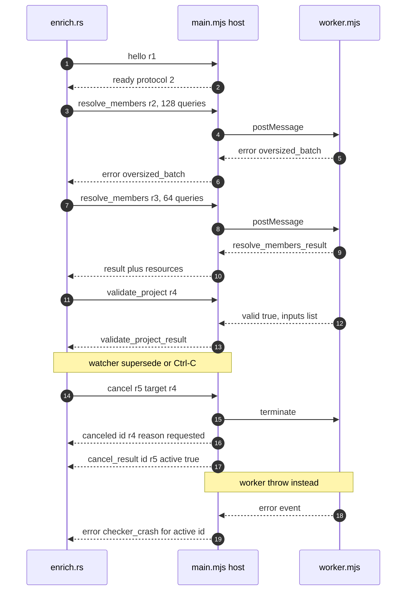
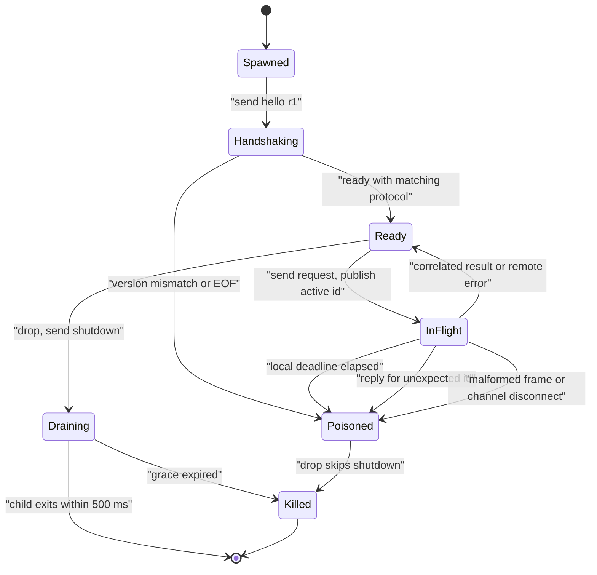
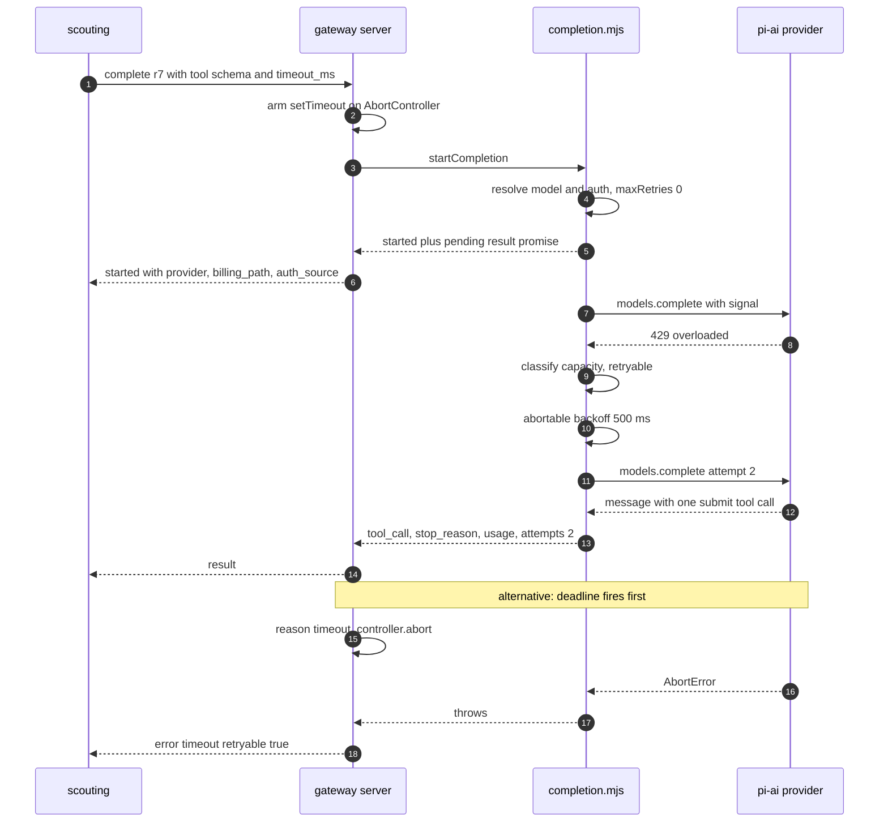

# Sidecar processes: the TypeScript checker and the LLM gateway

jscout is a Rust program that needs two things Rust cannot supply in-process: the answer to "what does `x.foo()` actually resolve to under this repository's tsconfig graph", which only the TypeScript compiler API can give, and a call to a model provider with credentials attached, which lives in the JS ecosystem inside `@earendil-works/pi-ai`. Both are obtained by spawning a Node child process and talking to it over one JSON object per line on stdin/stdout. The two sidecars share a transport shape — a versioned envelope, string request ids, one request in flight, a `hello`/`ready` handshake — and share nothing above it: the checker reads the repository and never touches the network, the gateway touches the network and never reads the repository or the database (`gateway/src/main.mjs:2-7`). Rust keeps ownership of everything that must survive a crash: timeouts, cancellation, validation of every reply, and persistence.

## What each process is

| | TypeScript checker | pi-ai gateway |
| --- | --- | --- |
| Entry | `node checker/src/main.mjs <root>` (`src/checker/process.rs:239-254`) | `node gateway/src/main.mjs` (`src/llm/process.rs:160-173`) |
| Protocol version | 2 (`checker/src/protocol.mjs:3`) | 1 (`gateway/src/protocol.mjs:8`) |
| Callers | `jscout enrich`, `jscout checker doctor` (`src/checker/enrich.rs`, `src/checker/mod.rs:67`) | `jscout scout` family, `jscout llm doctor` (`src/scouting/mod.rs`, `src/llm/mod.rs:127`) |
| Line reader | `readline` interface, `crlfDelay: Infinity` (`checker/src/protocol.mjs:33`) | manual `Buffer` split on `0x0a` (`gateway/src/protocol.mjs:22`) |
| Line cap | 4 MiB, replies `oversized_line` and keeps reading (`checker/src/protocol.mjs:15`) | 16 MiB, reports and calls `process.exit(1)` (`gateway/src/protocol.mjs:32`, `gateway/src/main.mjs:87-92`) |
| `hello` gating | none — any kind dispatches immediately | `capabilities`/`complete`/`cancel` only (`gateway/src/server.mjs:74,78,82,98`) |
| Blocking work | isolated in a `worker_threads` Worker | none; every path awaits |
| stderr prefix in Rust | `typescript-checker:` (`src/checker/process.rs:276`) | `pi-ai-gateway:` (`src/llm/process.rs:200`) |

The line-cap asymmetry is a real behavioral difference, not a cosmetic one. The gateway treats an oversized line as unrecoverable corruption — after it, the reader cannot know where the next message starts, so it refuses to resynchronize and dies. The checker's `readline` already knows the frame boundary, so it can answer `oversized_line` with a blank id and continue. The checker's own guard is therefore mostly advisory; the actual size discipline lives in Rust's request sizing and the worker's response cap.

## Discovery, spawn, and the Node floor

Both sidecars resolve their Node binary through the same function, so a `jscout enrich` failure names the checker rather than the gateway (`src/llm/config.rs:146-175`). Resolution is `JSCOUT_NODE` if it names an existing file, else the first `node`/`node.exe` on `PATH`. jscout then actually runs `node --version` and parses a strict three-part semver, refusing anything below 22.19.0 (`src/llm/config.rs:177-200`). The gateway repeats the check inside Node before importing pi-ai, so an unsupported runtime produces one controlled diagnostic instead of an adapter syntax error (`gateway/src/main.mjs:44-50`).

| Variable | Consumed by | Effect |
| --- | --- | --- |
| `JSCOUT_NODE` | Rust, both sidecars | Node executable; must be an existing file (`src/llm/config.rs:15,147`) |
| `JSCOUT_CHECKER_SIDECAR` | Rust | Absolute path to `checker/src/main.mjs`; `--sidecar-path` wins (`src/checker/mod.rs:13-23`) |
| `JSCOUT_PI_AI_GATEWAY` | Rust | Path to `gateway/src/main.mjs`, a file path and never a shell command; `--gateway-path` wins (`src/llm/config.rs:14,77`) |
| `JSCOUT_LLM_MODEL` | Rust | `provider:model` spec, default `openai-codex:gpt-5.6-terra` (`src/llm/config.rs:16`) |
| `JSCOUT_LLM_REASONING` | Rust | Reasoning effort passed through in `complete` (`src/llm/config.rs:13,64`) |
| `JSCOUT_PI_AI_AUTH_FILE` | Gateway process | Credential store path, default `~/.pi-ai/auth.json` (`gateway/src/server.mjs:19,22`) |
| `JSCOUT_PI_AI_OPENAI_COMPATIBLE_PROVIDERS` | Gateway process | JSON array of custom providers, validated for id/baseUrl/models with duplicate and built-in collision rejection (`gateway/src/server.mjs:20`, `gateway/src/registry.mjs:165`) |
| `JSCOUT_PI_AI_OPENAI_BASE_URL` | Gateway process | Base-URL override for built-in `openai` (`gateway/src/server.mjs:21`) |

Only the variables that affect sidecar discovery and spawn are listed here; [13-build-config-ci.md](13-build-config-ci.md) carries the full environment inventory.

Sidecar-file discovery is deliberately narrow: CLI flag, then env var, then a path beside the running binary, plus one development fallback that only triggers when the binary sits in `target/debug` or `target/release` under a directory literally named `target` (`src/checker/mod.rs:28-40`). An installed binary cannot accidentally pick up a checkout.

## The envelope and request ids

Every frame in both directions is `{protocol, id, kind, ...}`. On the Rust side the encoders flatten a message enum into that envelope; the JS side stamps `protocol` in `writeMessage` (`checker/src/protocol.mjs:7`, `gateway/src/protocol.mjs:51`). Ids are allocated from a per-process `AtomicU64` and formatted as `r{n}` starting at `r1`, so `hello` is always `r1` (`src/checker/process.rs:107`, `src/llm/process.rs:122-123`).

A dedicated Rust thread reads the child's stdout line by line, deserializes into the `Inbound` enum, and pushes each result down an `mpsc` channel; a malformed line becomes a terminal `Protocol` error and the reader thread returns, so the channel disconnects and every subsequent receive sees `ChildExited` (`src/checker/process.rs:259-273`, `src/llm/process.rs:179-195`). A second thread drains stderr and re-prints each line with a prefix — stderr is human diagnostics only and is never parsed.

The handshake is version equality, not negotiation. Rust sends `hello`, waits up to 30 s, and rejects any `ready` whose `versions.protocol` differs from the compiled constant (`src/checker/process.rs:295-302`, `src/llm/process.rs:221-228`). The gateway's `ready` reports a hardcoded `protocol: 1` rather than a value derived from its own state (`gateway/src/server.mjs:71`), which means the version claim and the parser's expectation are two separate literals in the same file.

## Checker protocol, message by message

| Kind | Direction | Payload | Reply |
| --- | --- | --- | --- |
| `hello` | out | — | `ready {versions: {sidecar, node, protocol}}` (`checker/src/main.mjs:95-104`) |
| `capabilities` | out | — | `capabilities_result {capabilities}` with TypeScript identity, project summaries, configuration problems, and the fixed `question` string |
| `plan_members` | out | `files: [repo-relative]` | `plan_members_result` with per-file `project_ids`, `excluded_project_ids`, `tooling_fallback`, plus the TypeScript identity; no Program is built |
| `resolve_members` | out | `project_id`, 1–512 `queries` of byte spans plus `indexed_hash` | `resolve_members_result` with per-query answers, `checker_input_fingerprint`, and `resources` (`checker/src/worker.mjs:666-694`) |
| `validate_project` | out | `project_id`, `fingerprint` | `validate_project_result {valid, inputs: [{path, source_hash}]}` (`checker/src/worker.mjs:697`) |
| `cancel` | out | `target_id` | `canceled` for the target if it was active, then `cancel_result {target_id, active}` (`checker/src/main.mjs:114-123`) |
| `shutdown` | out | — | `shutdown_result`, then the host pauses stdin and exits 0 (`checker/src/main.mjs:125-132`) |
| `resolve_member` | out, tests only | one `query` | `resolve_member_result`; the Rust variant is `#[cfg(test)]` (`src/checker/protocol.rs:14`) |
| `validate_inputs` | — | `entries` | Implemented in host and worker (`checker/src/main.mjs:110`, `checker/src/worker.mjs`) but has **no** Rust `Outbound` variant; only the Node test suite ever sends it |
| `error` | in | `{code, message}` | terminal for the correlated id |

Two of these rows are dead weight on the production path. `resolve_member` duplicates roughly fifty lines of `resolveInProject` in the worker for a request Rust only sends from tests, and `validate_inputs` has no Rust caller at all. They are live code, exercised by `checker/test/sidecar.test.mjs`, but they mean the wire surface the Node side maintains is strictly larger than the one Rust speaks.

Error codes split cleanly by which process produced them. The host emits `protocol`, `protocol_version`, `oversized_line`, `busy`, `unsupported`, `checker_crash`, and `checker_exit`. The worker emits `outside_root`, `query_file_missing`, `hash_mismatch`, `invalid_span`, `span_mismatch`, `project_not_found`, `project_mismatch`, `project_switch`, `project_not_loaded`, `oversized_batch`, `protocol`, `unsupported`, and a catch-all `checker_failure` when a thrown value has no `code` (`checker/src/worker.mjs:838`).

## Inside the checker: a protocol host plus one worker

`main.mjs` does no TypeScript work. It parses a line, checks `active`, and forwards the message to a `worker_threads` Worker; the worker's reply is stamped with the original id and written back. The split exists because `ts.createProgram` and checker queries block for seconds and would otherwise make `cancel` and `shutdown` unanswerable. The cost is that cancellation is implemented by `worker.terminate()`, which destroys the built Program, the tsconfig discovery cache, and every cached SourceFile buffer — a canceled project always resumes from Program construction.

The diagram below traces one project's full lifecycle, including the two failure branches Rust must distinguish: an oversized response that is retryable by halving, and a worker crash that is not. Watch how `cancel` produces two frames with different ids.

The `oversized_batch` loop at steps 4–7 is the only true retry in the checker path: `execute_project` catches `CheckerError::Remote` with that code and halves `end` before resending, provided more than one query remains (`src/checker/enrich.rs:1355-1360`). Before that it already tries to avoid the round trip by speculatively encoding the whole frame with a fake id `size-check` and halving until the encoded length fits 1 MiB (`src/checker/enrich.rs:1329-1345`) — an entire serialization performed purely to measure a length. Steps 15–17 show the crash path: the Worker's `error` event is turned into a correlated `error` frame with code `checker_crash`, its stack scrubbed of the repository root and truncated to 64 KiB (`checker/src/main.mjs:40-45,56-67`), and a silent exit becomes `checker_exit` with the exit code (`checker/src/main.mjs:68-79`). Both are correlated to the active id, so Rust sees a normal terminal reply rather than EOF.

That correlation has one hole. The host's `uncaughtException` handler writes a single opaque line to stderr and exits 1 (`checker/src/main.mjs:157-160`), producing no frame at all — Rust observes only a disconnected channel and reports `ChildExited`.

## One Program per process, and why enrich spawns so many

`resolve_members` builds exactly one TypeScript `Program` per worker; asking the same worker for a second project raises `project_switch` (`checker/src/worker.mjs:424`). `validate_project` is the mirror constraint: it throws `project_not_loaded` unless it follows `resolve_members` in the same worker (`checker/src/worker.mjs:699`). Together these force the enrichment loop's shape — `execute_project` spawns a **fresh** sidecar process for each project, registers it as the Ctrl-C target, drains all of that project's batches, and finishes with `validate_project` before the process is dropped (`src/checker/enrich.rs:1320-1421`). The tradeoff is explicit: peak memory otherwise scaled with every overlapping tsconfig in a repo-wide run, and the price is one process spawn plus a full tsconfig discovery and Program construction per project.

Request sizing is fixed at 128 queries or 1 MiB encoded, whichever binds first (`src/checker/enrich.rs:1317-1318`), sitting comfortably inside the worker's own 1–512 query bound and its 1 MiB response cap. Nothing about it adapts to observed latency or the reported `rss_bytes`/`heap_used_bytes`, which Rust records as peaks and prints but never feeds back into batch sizing.

## Backpressure: there is none

Neither protocol has windowing, credits, or flow control. The entire mechanism is the one-request rule plus four independent size caps.

| Bound | Value | Site |
| --- | --- | --- |
| Rust request batch | 128 queries | `src/checker/enrich.rs:1317` |
| Rust request bytes | 1 MiB encoded | `src/checker/enrich.rs:1318` |
| Worker query count | 1–512 | `checker/src/worker.mjs:669-672` |
| Worker response bytes | 1 MiB, else `oversized_batch` | `checker/src/worker.mjs:691-693` |
| Checker line | 4 MiB | `checker/src/protocol.mjs:4` |
| Gateway line | 16 MiB, then exit | `gateway/src/protocol.mjs:9` |

The one-request rule is enforced on both ends of both protocols. The checker host replies `busy` when `active` is set (`checker/src/main.mjs:85-88`); the gateway replies `busy` when `state.active` is set (`gateway/src/server.mjs:142-149`). In neither case does the `busy` reply disturb the request already running — the newcomer is rejected and the incumbent proceeds. On the Rust side the same rule appears as a poisoning condition: a reply whose id is not the awaited one is a protocol failure, not something to buffer (`src/checker/process.rs:474-480`, `src/llm/process.rs:286-292`). The single exception both clients make is `cancel_result`, which is consumed and skipped so a control-plane acknowledgement does not derail a data-plane wait. The checker's arm literally discards its contents with `let _ = (target_id, active);` (`src/checker/process.rs:468-472`), so a cancel that reports `active: false` — meaning the target had already finished — is indistinguishable from one that landed.

## Timeouts, cancellation, and poisoning on the Rust side

Both clients converge on the same connection state machine, drawn below. The thing to look for is that `Poisoned` is absorbing and that entering it changes what `Drop` does.

`Poisoned` has one meaning: request correlation is no longer trustworthy, so the client must be discarded rather than reused. It is set on a local timeout, a wrong-id reply, a malformed frame, a write failure, and a channel disconnect (`src/checker/process.rs:474-490`, `src/llm/process.rs:277-305`). The checker goes further and kills the child immediately on timeout rather than waiting for `Drop` (`src/checker/process.rs:494-499`). In `Drop`, a non-poisoned client sends `shutdown`, polls `try_wait` for a 500 ms grace, and only then kills; a poisoned one skips straight to `kill` (`src/checker/process.rs:511-527`, `src/llm/process.rs:418-433`).

Cancellation is where the two diverge. The checker distinguishes two sources with three atomics — `interrupt` for an operator Ctrl-C, `operation` for a watcher generation being superseded, and `operation_delivered` so a redundant cancel is not re-sent (`src/checker/process.rs:25-69`). The distinction matters because a second Ctrl-C exits the process with code 130 (`src/checker/process.rs:155-158`), while a superseded watcher generation must only end the current enrichment; `src/watch.rs` calls `cancel_active_operation()` for exactly that. Both routes end in the same wire message: `cancel {target_id}` addressed to whatever id is currently published under the active-request lock.

Both clients install their own Ctrl-C handler through a `OnceLock` around `ctrlc::set_handler`, and each keeps its own `INTERRUPT_CONTROL` static (`src/checker/process.rs:21-23`, `src/llm/process.rs:27-29`). `ctrlc::set_handler` can only succeed once per process, so whichever subsystem registers first owns SIGINT; a command that used both sidecars would route interrupts to only one of them.

## Gateway protocol, message by message

| Kind | Direction | Payload | Reply |
| --- | --- | --- | --- |
| `hello` | out | — | `ready {versions: {gateway, pi_ai, node, protocol: 1}}` (`gateway/src/server.mjs:69-71`) |
| `capabilities` | out | optional `model` | `capabilities_result {providers: {builtin, custom}, model?}` where `model` carries context window, max tokens, reasoning, service-tier support, `billing_path`, and auth category (`gateway/src/server.mjs:104-138`) |
| `complete` | out | `model`, `reasoning?`, `system?`, `messages`, one `tool` schema, `timeout_ms?`, `max_tokens?`, `session_id?`, `provider_options` (`src/llm/protocol.rs:25-41`) | `started` then `result` |
| `started` | in | `provider`, `model`, `api`, `base_url`, `billing_path`, `auth_source` | — |
| `result` | in | `tool_call {name, arguments}`, `stop_reason`, `usage`, `attempts`, `response_model` | — |
| `cancel` | out | `target_id` | `cancel_result {target_id, active}`, plus `canceled` on the aborted completion (`gateway/src/server.mjs:190-198`) |
| `shutdown` | out | — | `shutdown_result`, then `state.exit(0)`; ungated by `hello` (`gateway/src/server.mjs:85-89`) |
| `error` | in | `{code, message, retryable, capacity}` | terminal |

Error codes are `protocol`, `unknown_kind`, `busy`, `invalid_request`, `unsupported_option`, `unknown_model`, `auth`, `timeout`, `tool_contract`, `billing`, `capacity`, `connection`, `context_limit`, `provider`, `configuration`, `internal`, and `oversized_line`. Only `capacity` and `connection` ever carry `retryable: true` from the classifier (`gateway/src/completion.mjs:188,235`); the gateway's own `timeout` frame sets `retryable: true` separately (`gateway/src/server.mjs:177`). Every payload that leaves the gateway passes through `sanitizeErrorMessage`, which strips bearer/basic tokens, `api_key`-style assignments, `sk-`/`gh*_`/`xox*`/`AIza` shaped strings, and credentials, query secrets and fragments inside URLs, then truncates to 2000 bytes (`gateway/src/protocol.mjs:58-99`). Provider text is mapped to controlled messages before it ever reaches that function; the redaction is defense in depth.

## One completion, end to end

The trace below shows the two-frame response and the two ways a completion can end badly. Note that `started` is emitted before anything is awaited from the provider, and that the retry loop lives entirely inside the gateway.

Retry policy is 2 retries with a 500 ms base doubling to a 2000 ms ceiling (`gateway/src/completion.mjs:18-22,256-258`), and the backoff sleep is itself abortable so a cancel during a wait rejects immediately rather than after the delay (`gateway/src/completion.mjs:260-276`). The SDK is called with `maxRetries: 0` deliberately, so nothing can multiply attempts beneath the reported `attempts` count (`gateway/src/completion.mjs:311-315`). Classification is `classifyProviderFailure`, roughly sixty substring and regex tests against provider prose, ordered billing → capacity → auth → context limit → connection, with a terminal `provider` fallthrough (`gateway/src/completion.mjs:159-238`). That table is the weakest link in the chain: a provider that words a quota error unfamiliarly falls through to non-retryable `provider`, and the connection tier matches bare words like `socket`, `terminated`, and `internal error` broadly enough to reclassify unrelated failures as retryable.

The submit-tool contract is enforced before anything is returned: the final message must contain exactly one tool call, its name must match the declared tool, and its arguments must parse to a JSON object; text alongside the call is dropped and hidden reasoning is never forwarded (`gateway/src/completion.mjs:117-155`). Usage is normalized to token counts plus a single `cost_total`, coercing non-finite values to zero (`gateway/src/completion.mjs:96-111`). Custom OpenAI-compatible providers are registered with a hard-coded placeholder key and zero cost values (`gateway/src/registry.mjs:182,190`), so their `cost_total` is structurally always 0.

## Where the timeout is owned, and why it matters upstream

The completion deadline is armed inside the gateway as a `setTimeout` that sets `reason = "timeout"` and aborts the controller (`gateway/src/server.mjs:154-160`); the catch block turns that reason into `error {code: "timeout", retryable: true}` (`gateway/src/server.mjs:173-178`). Rust deliberately waits longer than it asked for — `timeout + 5 s` on each of the two receives — so the remote frame arrives before the local deadline (`src/llm/process.rs:357,369`).

That five-second margin carries real consequence. `remote_timeout` is true only for `GatewayError::Remote` with code `timeout`, and it means the gateway aborted one request while the connection stayed synchronized, so scouting fails that single subject and continues the batch (`src/scouting/mod.rs:1133-1140`, `src/scouting/mod.rs:3220`). A local `GatewayError::Timeout` poisons the client, correlation is lost, and the whole batch aborts. The comment at the branch records what motivated the split: one slow subject had previously killed ninety-eight already-published artifacts. The distinction is invisible in the error text and depends entirely on the grace margin holding.

## Crash recovery, or its absence

Neither client restarts a sidecar. `ProcessGateway::poisoned()` exists but is `#[allow(dead_code)]` with a comment naming a restart policy as a follow-up layer that has not been built (`src/llm/process.rs:318-323`). On the checker side, a `checker_crash` or `checker_exit` propagates out of `execute_project` as a project failure; the project's staged work is discarded and every one of its occurrences is marked failed, even though the host would happily create a new Worker on the next dispatch (`checker/src/main.mjs:47-48`). Recovery is instead pushed into the staging ledger: enrichment stages facts into inactive tables and resumes from a plan fingerprint on the next run, so the recovery unit is a whole `jscout enrich` invocation rather than a connection. That design is covered in [11-incremental-and-watch.md](11-incremental-and-watch.md) and [05-storage-schema.md](05-storage-schema.md); what matters here is that the transport layer has no notion of reconnecting.

## How the two implementations are tested against each other

They are not. The Rust suite drives `/bin/sh` fake sidecars that echo canned frames — four tests for the checker client covering cancellation-flag semantics, remote error codes, timeout killing the child, and crash-versus-cancel as distinct outcomes (`src/checker/process.rs:537-674`), and five for the gateway covering the happy path, remote error propagation, interrupt-driven cancel mid-completion, child death, and malformed frames failing closed with poisoning asserted (`src/llm/process.rs:477-666`). The fakes hard-code the ids `r1`, `r2`, `r3`, so any change to id allocation silently invalidates them. The Node suites spawn the real sidecars but drive them from a JavaScript client: thirteen integration tests in `checker/test/sidecar.test.mjs` and twenty in `gateway/test/gateway.test.mjs`. The upside is that `cargo test` runs without Node installed; the cost is that the two protocol implementations are each verified against the written spec and never against one another, and that no test spawns the real gateway binary over stdio at all — so `gateway/src/main.mjs`'s version gate, lazy import, dispatch catch, and overflow exit are all untested.

One of those untested paths is worth naming: the dispatch catch binds the failure and never reads it, replying with a generic `internal` error and writing nothing to stderr (`gateway/src/main.mjs:79-85`). A bug in `handleMessage` that escapes its own try/catch therefore leaves no trace anywhere.
