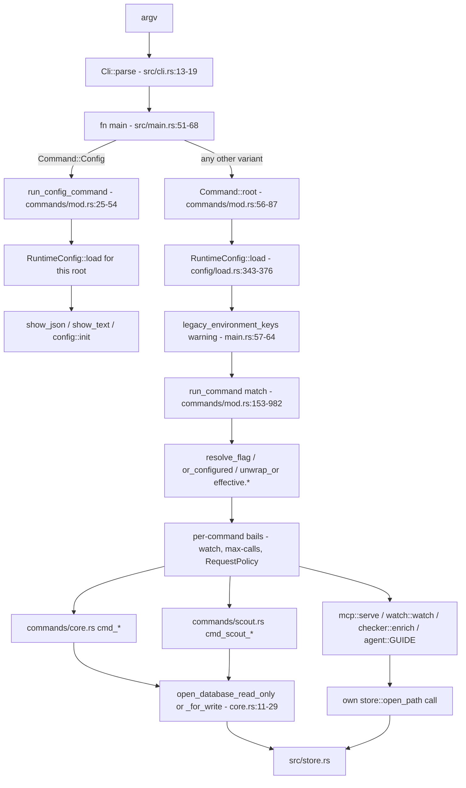
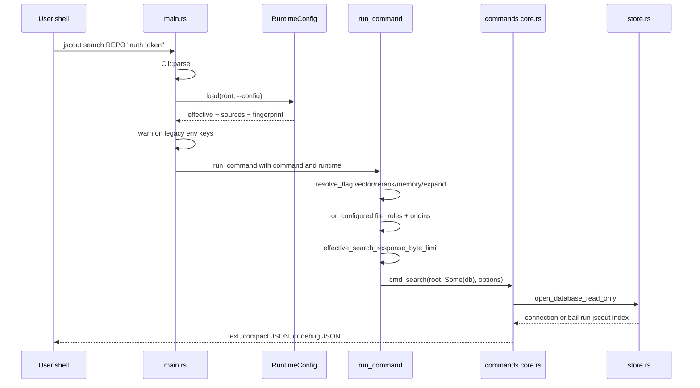

# Command line: cli.rs, commands, and dispatch

`jscout` ships as a single binary whose entire user surface is a clap-derived enum. The declaration of that enum — every command, every flag, every doc comment that becomes help text — lives in `src/cli.rs`; the code that interprets it lives in `src/commands/`. Between them sits a 79-line `src/main.rs` that parses argv, splits the `config` subcommand out before any configuration exists, loads exactly one `RuntimeConfig`, warns about settings still arriving through the legacy environment surface, and hands both the parsed command and the loaded configuration to a single exhaustive match. The split exists because flag defaults moved: most scalar options no longer carry a clap `default_value_t` and instead resolve against `.jscout.toml` at the dispatch site, which requires a place to do that resolution that is neither the declaration nor the command body.

## What main.rs does, in order

`src/main.rs:51-68` is the whole of `fn main`. Step one is `Cli::parse()` (`src/main.rs:52`), which either exits with clap's own usage error (status 2) or yields a `Cli`. Step two is a two-arm match on `cli.command`: `Command::Config { command }` goes straight to `run_config_command(command, cli.config.as_deref())` (`src/main.rs:53-54`) with no configuration loaded at all. Step three, for every other variant, is `config::RuntimeConfig::load(command.root(), cli.config.as_deref())?` (`src/main.rs:56`). Step four is a stderr line naming every setting whose value came from an environment variable rather than the TOML file, built from `runtime.legacy_environment_keys()` (`src/main.rs:57-64`, implemented at `src/config/display.rs:119-124` by filtering the provenance map for `ValueSource::LegacyEnv`) and pointing at `config::FILE_NAME`, which is `.jscout.toml` (`src/config.rs:16`). Then `run_command(command, &runtime)`.

Dispatching `Config` first is deliberate: `config validate` and `config init` have to work on a repository whose `.jscout.toml` is malformed, version-mismatched, or absent. `RuntimeConfig::load` bails on a `version` other than `1` (`src/config/load.rs:360-366`) and on an explicit `--config` path that does not exist (`src/config/load.rs:371`), so loading before dispatch would make the diagnostic commands fail with exactly the error they exist to report. The cost is an `unreachable!("configuration commands are dispatched first")` arm inside `run_command` (`src/commands/mod.rs:156`), a `Command::root()` arm for `Config` that is dead code (`src/commands/mod.rs:84`), and the fact that the legacy-environment warning never fires for `config` commands — though `config show` still lists `legacy-env` in its own `sources:` block.

The rest of `main.rs` is 38 `mod` declarations (`src/main.rs:5-43`) plus a thirty-ninth, `#[cfg(test)] mod main_tests` (`src/main.rs:78-79`), two crate-level lint attributes (`src/main.rs:1-3`), and a `#[cfg(test)]` re-export block (`src/main.rs:70-76`) whose only purpose is to make `resolve_flag`, `or_configured`, `effective_search_response_byte_limit`, `render_cli_neighborhood`, and `render_semantic_memory_text` reachable from `src/main_tests.rs`.

## Where the configuration root comes from

`RuntimeConfig::load` needs a directory. It gets one from `Command::root()` — an inherent impl that is *not* in `cli.rs` but in `src/commands/mod.rs:56-87`, keeping `cli.rs` free of behavior that interprets the enum. Sixteen repository commands hand back their own positional `root`; `Checker { command: CheckerCommand::Doctor { root, .. } }` reaches into the nested variant (`src/commands/mod.rs:75-77`); `Scout` and `Config` delegate to sibling `root()` impls on their nested enums (`src/commands/mod.rs:78`, `:84`, defined at `:97-108` and `:89-95`). Two cases are irregular. `Llm` and `Inference` return `Some(Path::new("."))` (`src/commands/mod.rs:82`), so `jscout llm doctor` reads `./.jscout.toml` from the current working directory rather than from any repository — surprising when the diagnostic is run from outside the tree it is meant to diagnose. `AgentGuide { install: None }` returns `None` (`src/commands/mod.rs:83`), the single path where `RuntimeConfig::load` runs rootless; `database.path` then stays the bare relative `.jscout.db` instead of a root-joined absolute path (`src/config/load.rs:378-386`).

## cli.rs versus commands/

`src/cli.rs` is 878 lines of declaration: `Cli` (`src/cli.rs:13-19`) carrying the new `#[arg(long, global = true)] config: Option<PathBuf>` and the subcommand; the 22-variant `Command` enum (`src/cli.rs:22-548`); and five nested subcommand enums — `ConfigCommand` (`:551-570`), `CheckerCommand` (`:573-585`), `ScoutCommand` (`:588-836`), `LlmCommand` (`:839-849`), `InferenceCommand` (`:852-865`). Seventeen direct leaves plus thirteen nested leaves give thirty invocable command paths. The file contains one function, `parse_positive_count_or_all` (`src/cli.rs:867-878`), which maps a case-insensitive `all` to `usize::MAX` and rejects `0`; only `scout repository --max-calls` and `--max-subjects` use it. It is not, however, entirely policy-free: several clap defaults are evaluated by calling into domain modules at parse time — `origin::defaults()` (`src/cli.rs:183`, `:441`), `semantic_query::DEFAULT_SOURCE_BYTE_LIMIT` (`:304`), `semantic::MAX_WORKFLOW_CANDIDATES` (`:377`, `:672`), `scouting::repository::DEFAULT_MAX_DEPTH` (`:622`) — and two flags carry inline `value_parser` enumerations (`:152`, `:274`). Default policy is therefore split between `cli.rs` and `src/config/load.rs`.

`src/commands/mod.rs` (982 lines) is the dispatch layer: `run_config_command` (`:25-54`), the three `root()` impls, the three resolution primitives, and `run_command`'s 830-line match (`:153-982`). `src/commands/core.rs` (533 lines) holds the deterministic `cmd_*` bodies and their renderers plus the two database openers. `src/commands/scout.rs` (312 lines) holds the six generative drivers, `print_scout_batch`, and `scout_batch_exit`. Notably `src/commands/` has no `tests.rs` — unlike the eighteen modules that adopted a sibling `tests.rs`, the CLI's tests live in `src/main_tests.rs`.

## Three resolution primitives, and one that is hand-written

`run_command` binds `let configured_database = runtime.effective.database.path.as_path()` once (`src/commands/mod.rs:154`) and then threads `database.as_deref().unwrap_or(configured_database)` through every variant that has a `--database` flag. Boolean and list options go through three helpers.

| Helper | Signature | Rule |
|---|---|---|
| `resolve_flag` (`src/commands/mod.rs:115-117`) | `(enable, disable, configured) -> bool` | `if disable { false } else { enable || configured }` |
| `or_configured` (`src/commands/mod.rs:121-127`) | `(Vec<T>, &[T]) -> Vec<T>` | non-empty CLI list replaces the configured list wholesale; never appends |
| `effective_search_response_byte_limit` (`src/commands/mod.rs:129-135`) | `(Option<usize>, usize, bool) -> usize` | `--debug-json` with no explicit `--response-bytes` yields `usize::MAX` |

`resolve_flag` exists because once a boolean's default comes from configuration, a bare `--x` can only turn something on; a repository that sets `search.rerank = true` needs `--no-rerank` to disable it for one invocation. Every paired flag carries reciprocal `conflicts_with` in clap (`src/cli.rs:52/56`, `104/107`, `122/125`, `128/131`, `143/146`, `256/259`, `391/394`, `397/400`, `406/410`, `413/416`), so the `(enable, disable) = (true, true)` row is unreachable from the command line — `resolve_flag` still handles it (disable wins) and `src/main_tests.rs:13-32` pins all eight rows. Search is the exception to the plain-pair shape: `--lexical-only` is folded into the *disable* argument of two calls, `resolve_flag(vector, lexical_only || no_vector, …)` and `resolve_flag(rerank, lexical_only || no_rerank, …)` (`src/commands/mod.rs:238-239`), with reciprocity supplied by `conflicts_with_all` on the positive flags rather than by a two-way pair.

`--deps` / `--no-deps` is a *list* pair and does not use either helper. Both `index` (`src/commands/mod.rs:161-167`) and `watch` (`:552-558`) spell out a three-branch `if`: `--no-deps` yields an empty vector, an empty CLI list falls back to the configured list, and a non-empty CLI list wins. The semantics match `or_configured` plus a clearing flag, but the code is duplicated rather than factored.

`--debug-json` going unbounded is a deliberate tradeoff: diagnostic JSON that is silently truncated at the agent-facing 24 KB budget is useless as a diagnostic, so a `--debug-json` search on a large repository can emit an arbitrarily large payload. `src/main_tests.rs:361-391` pins the behavior.

## Dispatch path

The diagram below traces one process from argv to a database connection. Look for the two exits from `MAIN` — the config short-circuit on the left, the configured path on the right — and for the fact that `RUN` is the only node that reads `RuntimeConfig` fields.

`DIRECT` is the branch worth noticing: `mcp`, `watch`, and `enrich` never call the `commands/core.rs` openers. `checker::enrich` resolves the path itself (`src/checker/enrich.rs:330-333`), `watch` opens per phase through `open_phase_database` (`src/watch.rs:1308-1315`), and `mcp` opens read-only at startup and lazily upgrades to a write connection only when the `annotate` tool is actually selected under `ToolProfile::Structural` (`src/mcp.rs:274`, with the comment explaining that retrieval-only sessions must not take a writer lock).

## Complete command inventory

`ROOT` is a positional `PathBuf` unless noted. `--config PATH` is global on every command. **cfg** marks a default that comes from `RuntimeConfig`; a bare number or string marks a clap `default_value_t` / `default_value`.

| Command | Options | Default source notes |
|---|---|---|
| `config show ROOT` | `--json` | dispatched before config loading; loads its own (`commands/mod.rs:27-35`) |
| `config validate ROOT` | — | prints config path plus blake3 fingerprint (`:36-47`) |
| `config init ROOT` | — | writes the embedded template with `create_new`; refuses to overwrite |
| `stats ROOT` | — | never opens SQLite |
| `chunks ROOT` | `--filter SUBSTR` | JSONL to stdout, per-file skips to stderr |
| `index ROOT` | `--database` cfg, `--deps A,B` cfg `index.dependencies`, `--no-deps` | deps pair is hand-resolved (`:161-167`) |
| `embed ROOT` | `--database` cfg, `--batch` cfg 64, `--origin` cfg `embedding.origins`, `--product`, `--semantic`, `--semantic-only`, `--repair` | `--semantic-only` conflicts with `--product`/`--semantic`; `--repair` conflicts with `--semantic-only` |
| `search ROOT QUERY` | `--database` cfg, `-k/--limit` cfg 10, `--file-role` cfg, `--origin` cfg, `--memory`/`--no-memory` cfg false, `--memory-limit` cfg 4, `--memory-depth` cfg 2, `--memory-nodes` cfg 2000, `--response-bytes` cfg 24000, `--vector`/`--no-vector` cfg true, `--rerank`/`--no-rerank` cfg true, `--lexical-only`, `--json`, `--debug-json`, `--expand`/`--no-expand` cfg false, `--expand-depth` cfg 1, `--expand-mode` cfg `paths`, `--expand-seeds` cfg 3, `--expand-paths` cfg 8, `--expand-nodes` cfg 40, `--expand-edges` cfg 120, `--expand-bytes` cfg 24000, `--expand-min-confidence` cfg `likely`, `--expand-file-role` cfg production,unknown | every scalar is `Option<T>`; no clap defaults remain |
| `events ROOT [NAME]` | `--origin` clap `repository,workspace` | **no `--database` flag**; uses `configured_database` (`:306`) |
| `calls ROOT METHOD` | `--arg K\|K=V`, `--arg-position`, `--receiver`, `--origin` clap default, `--limit` 200, `--json`, `--database` cfg | `--limit` is one of the few surviving clap defaults |
| `mcp ROOT` | `--database` cfg, `--telemetry` cfg `telemetry.file`, `--request-log` cfg, `--profile` cfg `structural`, `--source-view` cfg `full`, `--result-transport` cfg `auto` | all four policy strings parsed at `:362-364` |
| `annotate ROOT INPUT.json` | `--database` cfg | write connection; prints publication JSON |
| `memory ROOT [QUERY=""]` | `--vector`/`--no-vector` cfg `search.vector`, `-k` 20, `--type`, `--freshness`, `--artifact ID`, `--view`, `--debug`, `--anchor`, `--file`, `--reconnaissance-subject`, `--related-to`, `--include-superseded`, `--source`, `--source-limit` 1, `--source-depth` 8, `--source-bytes` 2000, `--origin` clap default, `--response-bytes` 24000, `--supports-per-artifact`, `--relation-limit` 40, `--concept-tag-limit` 40, `--database` cfg | only `--vector` and `--database` consult config; `--view` defaults to Compact for an exact read without `--debug`, else Full (`:428-432`), and `--supports-per-artifact` to 1 in that case, else 8 (`:433-439`) |
| `overview ROOT` | `--origin` clap default, `--area-limit` 20, `--relation-limit` 30, `--semantic`, `--semantic-limit` 8, `--semantic-type`, `--reconnaissance-limit` 12, `--reconnaissance-subject`, `--reconnaissance-detail`, `--response-bytes` 24000, `--database` cfg | pure clap defaults except the database |
| `workflow-candidates ROOT SEEDS…` | `--snapshot`, `--depth` 2, `--candidate-limit` 31, `--database` cfg | seeds `required = true` |
| `watch ROOT` | `--database` cfg, `--embed`/`--no-embed` cfg false, `--product`/`--no-product` cfg false, `--deps`/`--no-deps` cfg, `--enrich`/`--no-enrich` cfg false, `--enrich-timeout` cfg 300, `--sidecar-path` cfg fallback, `--debounce-ms` cfg 2000, `--reconcile-seconds` cfg 600 | four validations after resolution (`:562-575`) |
| `who-uses ROOT SPEC` | `--json`, `--origin` clap default | **no `--database` flag** (`:612`); `exit(1)` on no match |
| `neighborhood ROOT ANCHOR` | `--snapshot`, `--depth` 1, `--direction both`, `--node-limit` 50, `--edge-limit` 200, `--min-confidence likely`, `--kind`, `--file-role`, `--origin` clap default, `--response-bytes` (`Option`), `--debug-json` | **no `--database` flag** (`:629`); any `--file-role` also sets `penalize_file_roles` (`:641`) |
| `agent-guide` | `--install ROOT` | prints or installs the compiled-in SKILL.md |
| `enrich ROOT` | `--timeout` 300, `--file`, `--package`, `--member`, `--role`, `--max-occurrences` (none), `--all`, `--dry-run`, `--full`, `--sidecar-path` cfg fallback, `--database` cfg | `carry_forward: false` is hardcoded (`:687`) |
| `checker doctor ROOT` | `--timeout` 30, `--sidecar-path` cfg fallback | |
| `llm doctor` | `--model` cfg `llm.model`, `--gateway-path` | config root is `"."` |
| `inference serve` | `--project DIR` | reads inference/embedding/reranker settings |
| `inference doctor` | `--url` | falls back to `inference.url` |
| `scout repository ROOT` | `--max-calls N\|all` **required**, `--max-subjects` `all`, `--warn-subjects` 512, `--max-depth` 3, `--checker-timeout` 30, `--sidecar-path`, plus shared model block | the only user of `parse_positive_count_or_all` |
| `scout workflows ROOT` | `--seed`…, `--max-calls` optional, `--depth` 2, `--candidate-limit` 31, plus shared | bails without `--max-calls` when seeds are empty (`:795-801`) |
| `scout cards ROOT` | `--anchor`…, `--file`…, `--subject`…, `--max-calls` optional, plus shared | `--max-calls` required for automatic *or* file/subject selection (`:843-855`) |
| `scout summaries ROOT` | `--max-calls` **required**, `--level`, `--scope`…, plus shared | |
| `scout concepts ROOT` | `--term`…, `--max-calls` optional, plus shared | defaults to `terms.len()` (`:932-938`) |
| `scout refresh ROOT` | `--artifact ID`…, `--timeout` 300, `--max-calls` **required**, `--context-bytes` 240000, `--dry-run`, `--database`, `--gateway-path` | no `--model`/`--reasoning`/`--service-tier`/`--rebuild` |

Shared scout model block: `--model` (cfg `llm.model`, builtin `openai-codex:gpt-5.6-terra`, `src/llm/config.rs:12`), `--reasoning` (cfg `llm.reasoning`), `--service-tier`, `--timeout` 300, `--context-bytes` 240000, `--rebuild`, `--dry-run`, `--database` cfg, `--gateway-path`.

The `--max-calls` arity is the most confusing part of the surface and is uneven on purpose. `repository`, `summaries`, and `refresh` declare `max_calls: usize` with no default, so clap rejects a missing value with exit 2 before `run_command` runs at all. `workflows`, `cards`, and `concepts` declare `Option<usize>` and derive it from seed, anchor, or term counts, bailing with three differently worded messages when the run would be fully automatic. Only `repository` accepts the literal `all`, and because its `value_parser` already rejects `0`, `RequestPolicy::new`'s `max_calls == 0` bail (`src/llm/config.rs:188-190`) is unreachable on that one path.

## Database acquisition

`open_database_for_write` and `open_database_read_only` (`src/commands/core.rs:11-29`) are two-line dispatchers: `Some(path)` selects `store::open_path{,_read_only}`, `None` selects `store::open{,_read_only}(root)`. Since `run_command` always passes `Some(database.as_deref().unwrap_or(configured_database))` for commands that have the flag, the `None` arm is effectively reached only from the three commands that lack one — and those pass `configured_database` positionally instead.

The read-only opener is the interesting half. `store::open_path_read_only` (`src/store.rs:53-99`) refuses to create anything: a missing file, an unreadable or mismatched `meta.schema_version`, or a missing `snapshot`/`projection_version` pair each bail with a message ending in "run `jscout index`". The rationale is stated in the doc comment at `src/store.rs:46-48` — a typo in a path or an unindexed checkout must not silently produce an empty database that looks usable. `SCHEMA_VERSION` is compared as a string, not a number, so version ordering is lexical if anyone ever reasons about it.

The sequence makes the ordering constraint visible: every flag is resolved against configuration *before* the connection is opened, so a failure to resolve (an invalid `--expand-mode`, a rejected `--min-confidence`) costs nothing and reports as a plain error rather than as a database problem.

## Validation clap cannot express

Cross-field checks run inside `run_command`, after resolution and before delegation, because they involve values that may come from either source. `watch` performs four in a row (`src/commands/mod.rs:562-575`): product-only embedding without embedding enabled, a zero enrichment timeout, a zero debounce, and a reconcile interval that does not strictly exceed debounce. The same four invariants are also checked inside the loader (`src/config/load.rs:873-886`), so a bad `.jscout.toml` fails at load and a bad flag combination fails at dispatch — duplicated logic, but the alternative would let a CLI override reintroduce a state the config layer already rejected. Elsewhere: `mcp` parses three policy strings (`:362-364`), `search` parses the expansion projection (`:285-287`), `calls` parses each `--arg` filter (`:318-321`), and every generative command constructs a `RequestPolicy` that rejects a zero timeout, call budget, or context budget (`src/llm/config.rs:184-199`). One documented constraint is *not* enforced here: `memory --source` says "requires `--artifact`" in its help text (`src/cli.rs:294`) but the check lives downstream in `semantic_query::query`, so it surfaces as a runtime error with status 1 rather than a clap usage error with status 2.

## Errors and exit codes

`fn main` returns `anyhow::Result<()>`, so any `Err` is rendered by the Rust runtime as `Error:` followed by the context chain on stderr, with exit status 1; clap's own parse failures exit 2. Three call sites bypass that path with `std::process::exit`.

| Site | Code | Effect |
|---|---|---|
| `src/commands/core.rs:387` | 1 | `cmd_who_uses` prints `no symbol found for '…'` and exits directly when `find_symbols_in_origins` returns nothing |
| `src/llm/process.rs:85` | 130 | Ctrl-C handler installed by `ProcessGateway::launch`, taken on a *second* interrupt after cancellation was already requested |
| `src/checker/process.rs:157` | 130 | the identical pattern for the checker sidecar |

The two interrupt handlers are defensible — a second Ctrl-C should terminate even if the cooperative cancellation path is wedged — but `cmd_who_uses` is a plain inconsistency: it runs no destructors, produces a bare stderr line instead of an `Error:` chain, and is the only command in the binary that reports "nothing matched" as a process failure at all.

Scout commands add their own convention. `scout_batch_exit` (`src/commands/scout.rs:217-230`) counts reports with `status == "failed"` and bails only if the count is nonzero — and it runs *after* `print_scout_batch` (`:232-312`) has already emitted the full per-subject report. Its doc comment states the policy explicitly: scripts and agents key on exit status, so failed subjects must fail the process, while incomplete refusals and reported budget skips are designed outcomes that exit 0. The consequence is that one failed subject out of forty is indistinguishable by exit code from total failure; the distinction exists only in the text already printed.

`--dry-run` short-circuits before the Node gateway is launched on five of the six scout commands (`src/commands/scout.rs:25-31`, `:98-106`, `:131-137`, `:154-160`, `:178-191`), which is a cost-control invariant worth localizing. `scout repository` is the exception: its dry-run branch launches the gateway anyway (`src/commands/scout.rs:61-73`) because `dry_run_report` needs model metadata and a billing path from it. `scout refresh` also has non-dry-run early returns that precede the gateway — it prints `skipped fresh artifacts` and the pre-G5 unsupported list, then returns `Ok` when the target set is empty (`src/commands/scout.rs:192-208`).

## What is tested, and what is not

There is no `tests/` integration directory. CLI coverage is `src/main_tests.rs` (493 lines, eleven tests), reachable only because `main.rs:70-76` re-exports the helpers under `#[cfg(test)]` and `commands/mod.rs:137-151` adds `#[cfg(test)]` thunks for the two renderers. Two tests exercise real logic — the eight-row `resolve_flag` truth table and `or_configured`'s replace-not-append rule — and one pins `effective_search_response_byte_limit`'s unbounded debug case. The remaining eight call `Cli::try_parse_from` and then destructure the resulting variant, asserting field values: they pin the shape of the contract (that `--lexical-only` and `--rerank` parse independently, that `search` and `embed` accept external database paths, that `scout repository --max-calls all` still carries its warning threshold), not the behavior of any command. Configuration resolution itself is covered separately in `src/config/tests.rs`. Nothing in the test suite runs `run_command`, so the per-command validations, the three `--max-calls` derivations, and the database-acquisition branching are unexercised by unit tests.

Two smaller gaps sit in the same area. `agent-guide --install` and `config init` both refuse to overwrite an existing file — `agent::install` pre-checks `target.exists()` *and* uses `create_new(true)` (`src/agent.rs:14-26`) — with no `--force` on either, so recovering from a stale template means deleting it by hand. And the three commands without a `--database` flag now pick up `runtime.effective.database.path` (`src/commands/mod.rs:306`, `:612`, `:629`) where they previously hardcoded the repo-local file; a configured `database.path` therefore changes their behavior with no CLI signal, while an evaluation harness that passes `--database` to `search` still has no way to point `events`, `who-uses`, or `neighborhood` at the same file.

See [12-configuration.md](12-configuration.md) for the loader and provenance model, [11-mcp-surface.md](11-mcp-surface.md) for the tool surface `jscout mcp` exposes, and [08-scouting.md](08-scouting.md) for what the scout drivers do after the gateway launches.
