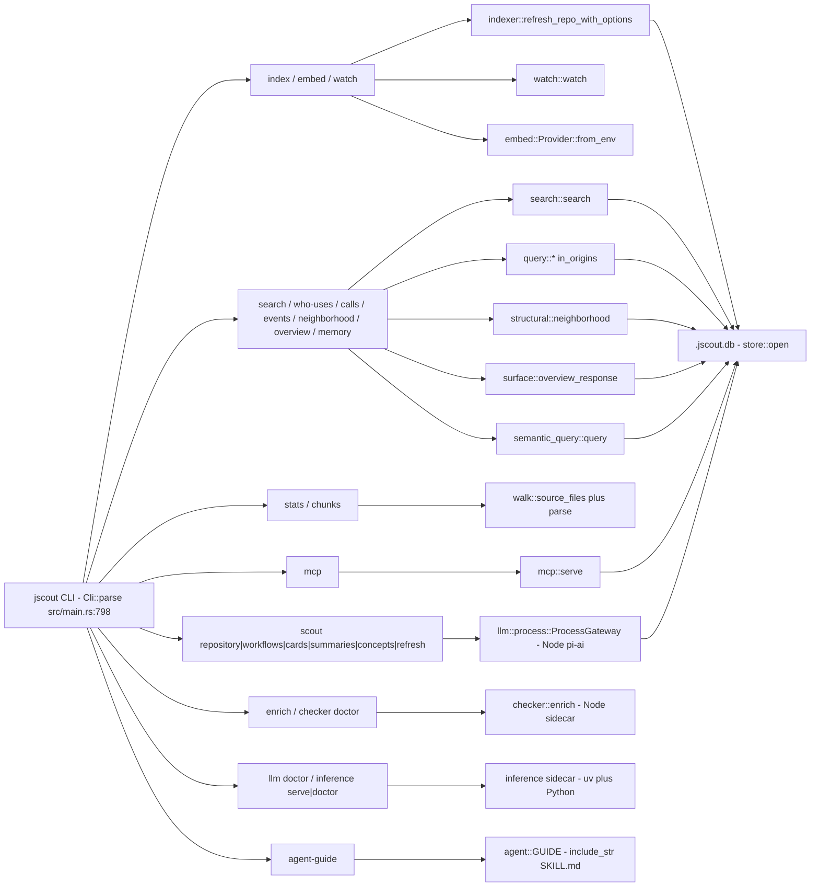
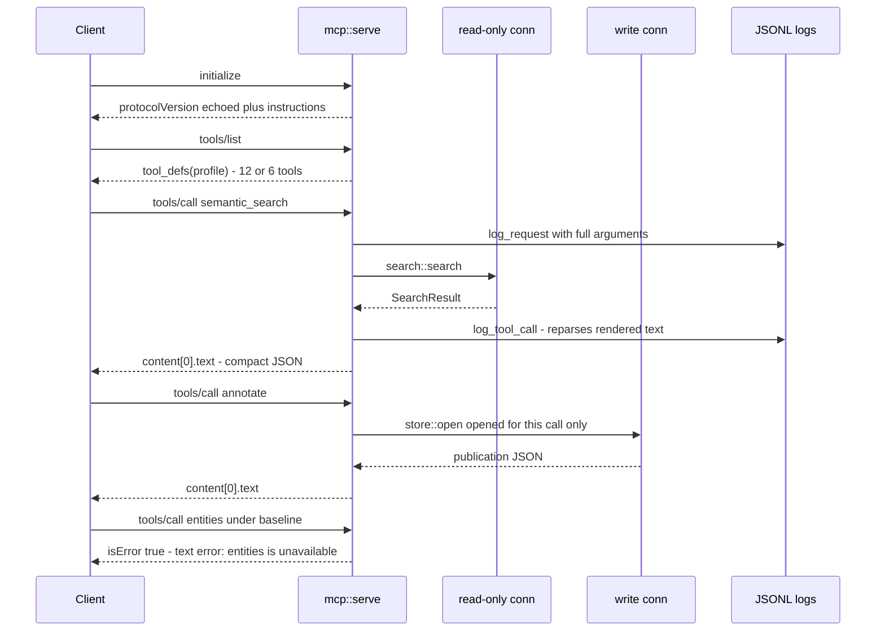
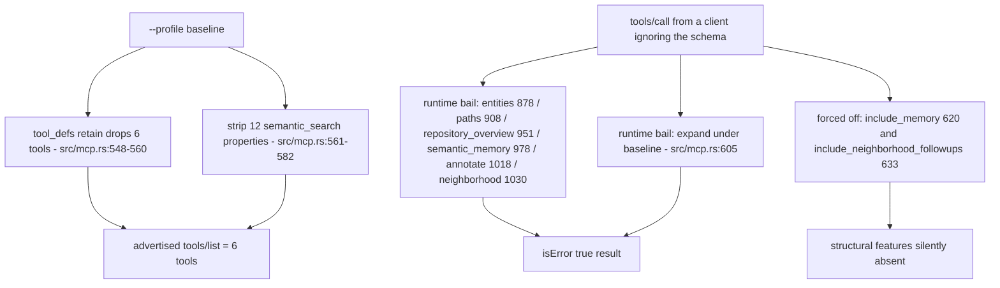

# Command line and MCP surface

Everything a human or an agent can ask jscout to do arrives through one of two front doors: the `jscout` binary's clap-derived command tree in `src/main.rs`, or the newline-delimited JSON-RPC 2.0 server in `src/mcp.rs` that the `jscout mcp` command starts on stdio. Neither front door contains logic of its own beyond argument coercion, database acquisition, and output fitting — both dispatch straight into the library modules described elsewhere in this analysis. What makes the surface worth its own document is the part that is not delegation: the read-only database gate that refuses to bootstrap an index by accident, the two-profile tool gating that exists so one binary can serve both arms of an A/B evaluation, and the explicit byte budget stapled onto every agent-facing response, which forces a fixed-point loop because the byte count is itself a field in the payload it measures.

## The command enum is the contract

`src/main.rs` declares a single clap `Parser` named `Cli` (`src/main.rs:41-50`) holding one field: `command: Command`. `Command` is a 21-variant enum (`src/main.rs:52-506`) in which each variant's *fields are the flags* — doc comments become help text, and `#[arg(...)]` attributes carry long names, value delimiters, defaults, `conflicts_with`, and `requires`. Four of those variants are groups that nest a further `Subcommand` enum: `CheckerCommand` (`src/main.rs:509-521`), `ScoutCommand` (523-766), `LlmCommand` (768-779), `InferenceCommand` (781-795). Counting leaves, that is 17 top-level commands plus 10 nested ones, for 27 invocable command paths.

`fn main` (`src/main.rs:797-1380`) is one `match cli.command` that destructures each variant and either calls a local `cmd_*` helper or hands the parsed fields directly to a library function. There is no intermediate application layer, no config struct, and no builder. The consequence shows in the tests: the seven CLI tests at `src/main.rs:2131-2403` assert on *destructured enum variants* after `Cli::try_parse_from`, not on behavior, because the enum is the only place the contract exists.

## Complete command inventory

`ROOT` below is always a positional `PathBuf`. "Internal" marks commands that exist for debugging, evaluation, or as a test harness rather than as something a person would reach for.

| Command | Key flags | What it does | Audience |
|---|---|---|---|
| `stats ROOT` | none | Walks source with `walk::source_files`, parses in-process, prints file/parse counts, source MB and per-construct totals; first 5 failures to stderr. Never opens SQLite. `src/main.rs:1779-1846` | internal (parser diagnostic) |
| `chunks ROOT` | `--filter SUBSTR` | Streams AST chunks as JSONL, one per line; per-file parse failures print `skip <path>: <err>` and continue. Never opens SQLite. `src/main.rs:1747-1777` | internal |
| `index ROOT` | `--database`, `--deps PKG,…` | Full snapshot rebuild into `ROOT/.jscout.db`; prints indexed/failed/chunks/refs, the extraction-reset line, `indexer::report_failures`, then per-package dependency plans when `--deps` was given. `src/main.rs:1569-1609` | user (primary) |
| `embed ROOT` | `--batch 64`, `--origin`, `--product`, `--semantic`, `--semantic-only` | Resolves an embedding provider from env, prints `provider: N model: M` to stderr, embeds missing code chunks and/or semantic artifacts. `--semantic-only` conflicts with `--product` and `--semantic`. `src/main.rs:1418-1444` | user |
| `search ROOT QUERY` | 22 flags (see below) | Runs `search::search` and prints human text, compact JSON (`--json`), or the full serde dump (`--debug-json`). `src/main.rs:1446-1567` | user (primary) |
| `events ROOT [NAME]` | `--origin` | Groups event sites by name; prints `[role] file:line .method() in <chunk>`. Prints `no event sites found` and exits 0 when empty. No `--database`. `src/main.rs:1668-1692` | user |
| `calls ROOT METHOD` | `--arg K\|K=V`…, `--arg-position`, `--receiver`, `--origin`, `--limit 200`, `--json`, `--database` | Runs `calls::query`; all `--arg` filters must match top-level properties of the *same* object-literal argument. `src/main.rs:1611-1666` | user |
| `mcp ROOT` | `--database`, `--telemetry`, `--request-log`, `--profile structural`, `--source-view full` | Serves JSON-RPC 2.0 on stdio until stdin closes. `src/main.rs:915-929` | user (agent entry point) |
| `annotate ROOT INPUT.json` | `--database` | Reads a file containing exactly the MCP `annotate` tool input, deserializes into `semantic::AnnotateRequest`, writes it, prints the publication. `src/main.rs:930-942` | internal |
| `memory ROOT [QUERY]` | 18 flags: `--no-vector`, `-k 20`, `--type`, `--freshness`, `--artifact`, `--anchor`, `--related-to`, `--include-superseded`, `--source*`, `--origin`, `--response-bytes`, `--supports-per-artifact 8`, `--relation-limit 40`, `--concept-tag-limit 40`, `--database` | Pretty JSON from `semantic_query::query`; empty QUERY lists newest records. `src/main.rs:943-997` | user |
| `overview ROOT` | `--area-limit 20`, `--relation-limit 30`, `--semantic`, `--semantic-limit 8`, `--semantic-type`, `--reconnaissance-limit 12`, `--reconnaissance-subject`, `--reconnaissance-detail`, `--response-bytes`, `--origin`, `--database` | Pretty JSON from `surface::overview_response`. `--reconnaissance-detail` carries `requires = "reconnaissance_subject"` (`src/main.rs:334-336`). `src/main.rs:998-1030` | user |
| `workflow-candidates ROOT SEEDS…` | `--snapshot`, `--depth 2`, `--candidate-limit 31`, `--database` | Dumps the deterministic candidate set that `scout workflows` consumes internally. File anchors are rejected; the limit is bounded by `semantic::MAX_WORKFLOW_CANDIDATES = 31`. `src/main.rs:1031-1052` | internal |
| `watch ROOT` | `--embed`, `--deps`, `--enrich`, `--enrich-timeout 300`, `--sidecar-path`, `--debounce-ms 2000`, `--reconcile-seconds 600`, `--database` | Builds `watch::WatchOptions` and blocks in `watch::watch`. `--reconcile-seconds 0` disables the missed-event refresh. `src/main.rs:1053-1075` | user (long-running) |
| `who-uses ROOT SPEC` | `--json`, `--origin` | `SPEC` is `NAME` or `path-substring:NAME`. Text mode groups usages by confidence; `--json` prints one compact `{target, usages}` object per line, not an array. No `--database`. `src/main.rs:1694-1745` | user |
| `neighborhood ROOT ANCHOR` | `--snapshot`, `--depth 1`, `--direction both`, `--node-limit 50`, `--edge-limit 200`, `--min-confidence likely`, `--kind`, `--file-role`, `--origin`, `--response-bytes 24000`, `--debug-json` | `structural::neighborhood` rendered through `compact::render_neighborhood`, or `mcp::render_bounded_object_arrays` over `["edges","nodes"]` with `--debug-json`. Any `--file-role` also sets `penalize_file_roles = true` (`src/main.rs:1109`). No `--database`. `src/main.rs:1082-1113, 1396-1416` | user |
| `agent-guide` | `--install ROOT` | Prints the compiled-in `SKILL.md`, or installs it. `src/main.rs:1114-1122` | user |
| `enrich ROOT` | `--timeout 300`, `--file`, `--package`, `--member`, `--role`, `--max-occurrences`, `--all`, `--dry-run`, `--sidecar-path`, `--database` | Calls `checker::enrich`; prints the report as pretty JSON. `--max-occurrences` is `Option<usize>` with **no** default, asserted by the test at `src/main.rs:2393-2401`. `src/main.rs:1123-1153` | user |
| `checker doctor ROOT` | `--timeout 30`, `--sidecar-path` | Prints node path/version, sidecar and protocol versions, TypeScript version and source, configured projects with file counts, config problems, and a final `ready:` line. `src/main.rs:1154-1164` | diagnostic |
| `llm doctor` | `--model`, `--gateway-path` | Prints node path/version, gateway file, gateway/protocol/pi-ai versions, provider counts, and the resolved model's api, tool support, context window, max output, reasoning and service-tier support. `src/main.rs:1165-1170` | diagnostic |
| `inference serve` | `--project DIR` | Runs `uv run --project <dir> python <dir>/service.py`; bails with the child's exit status. `src/inference.rs` | diagnostic |
| `inference doctor` | `--url` | GETs `/health` and `/configuration` (10 s timeout), prints endpoint, provider, device, embedding and reranker model@revision. `src/inference.rs` | diagnostic |
| `scout repository ROOT` | `--max-calls N\|all` (**required**), `--max-subjects all`, `--warn-subjects 512`, `--max-depth 3`, `--rebuild`, `--dry-run`, `--checker-timeout 30`, + shared model block | Evidence-backed repository scope and project classification. `src/main.rs:1176-1214, 1876-1918` | user (model-calling) |
| `scout workflows ROOT` | `--seed`…, `--max-calls` (optional), `--depth 2`, `--candidate-limit 31`, + shared model block | `src/main.rs:1215-1255, 1848-1874` | user (model-calling) |
| `scout cards ROOT` | `--anchor`…, `--max-calls` (optional), + shared | `src/main.rs:1256-1293, 1956-1976` | user (model-calling) |
| `scout summaries ROOT` | `--max-calls` (**required**), `--level file\|module\|repository`, `--scope KEY`… (requires `--level`), + shared | `src/main.rs:1294-1323, 1933-1954` | user (model-calling) |
| `scout concepts ROOT` | `--term`…, `--max-calls` (optional), + shared | `src/main.rs:1324-1360, 1978-1998` | user (model-calling) |
| `scout refresh ROOT` | `--max-calls` (**required**), `--artifact ID`…, `--timeout`, `--context-bytes`, `--dry-run` — **no** `--model`/`--reasoning`/`--service-tier` | Replays each stale artifact's *recorded* configuration; prints `skipped fresh artifacts:` and `cannot refresh pre-G5 artifacts without recorded configuration:` first. `src/main.rs:1361-1377, 2000-2044` | user (model-calling) |

The shared model block on the generative commands is `--model` (default `openai-codex:gpt-5.6-terra` from `llm::config::DEFAULT_MODEL`, `src/llm/config.rs:16`), `--reasoning` (falling back to `JSCOUT_LLM_REASONING`), `--service-tier`, `--timeout 300`, `--context-bytes 240000`, `--rebuild`, `--dry-run`, `--database`, `--gateway-path`. `RequestPolicy::new` (`src/llm/config.rs:226-241`) rejects a zero timeout, zero context bytes, or zero max-calls.

`--max-calls` arity is deliberately uneven and is the single most confusing thing in the CLI. `repository`, `summaries` and `refresh` declare it as a plain `usize`, so clap makes it required. `workflows`, `cards` and `concepts` declare `Option<usize>` and derive a default from the explicit seed/anchor/term count, bailing only when the run would be fully automatic — three different messages at `src/main.rs:1234`, `1273`, and `1341`. Only `repository` routes `--max-calls` and `--max-subjects` through `parse_positive_count_or_all` (`src/main.rs:1920-1931`), which maps the literal `all` to `usize::MAX` and rejects `0`. `--warn-subjects 512` only prints a stderr warning — before planning and again after mixed-scope subdivision (`src/main.rs:1888-1892, 1908-1915`) — and never truncates anything.

## Which commands touch which subsystem

The next diagram groups the 27 command paths by the module they end in; look for the fact that the deterministic index commands, the generative scout subtree, and the sidecar doctors share nothing but the store.

`G3` is the outlier: `stats` and `chunks` never reach `STORE` at all. They walk the tree and parse in process, so their numbers can diverge arbitrarily from what is actually indexed — different walk filters, no dependency corpus, no chunk store. `G7` is the other outlier: `llm doctor` and `inference doctor` do not need an index either, they only probe their sidecars.

## Database acquisition and the read-only gate

Most commands accept `--database PATH` to override `ROOT/.jscout.db`. Two thin helpers front the store: `open_database_for_write` (`src/main.rs:1382-1387`) and `open_database_read_only` (`src/main.rs:1389-1394`), delegating to `store::open{,_path}` and `store::open{,_path}_read_only`. The read-only path (`src/store.rs:53`) refuses to create or migrate anything: a missing file, a `meta.schema_version` that does not equal `store::SCHEMA_VERSION` (`src/store.rs:8`), or a missing published snapshot / `projection_version` row all bail with a message telling the operator to run `jscout index`. Write paths (`src/store.rs:105`) create and migrate within the bounded range `DURABLE_SCHEMA_FLOOR = 16` through the current version (`src/store.rs:9, 130-140`). The tradeoff is deliberate: a mistyped `ROOT` fails loudly instead of silently minting an empty database that looks usable, at the cost that anything wanting to bootstrap must go through the write opener.

Three commands accept no `--database` at all and hardcode `store::open_read_only(root)`: `events` (`src/main.rs:1669`), `who-uses` (`src/main.rs:1695`), and `neighborhood` (`src/main.rs:1403`) — while `search`, `calls`, `memory`, `overview`, `enrich` and every scout command do accept it. An evaluation harness pointed at an external database silently gets the repo-local one for those three.

## Exit status

`main` returns `anyhow::Result<()>`, so any `Err` is printed by the Rust runtime as `Error: <debug chain>` on stderr with exit status 1. Every validation reaches the user that way: `ToolProfile::parse`, `scout::SourceView::parse`, `RequestPolicy::new`, `origin::validate_all`, `calls::ArgFilter::parse`. Two places deviate. `cmd_who_uses` prints to stderr and then calls `std::process::exit(1)` directly when no symbol matches (`src/main.rs:1699-1700`), skipping the anyhow chain and any `Drop`. And `scout_batch_exit` (`src/main.rs:2049-2062`) inverts the usual order: `print_scout_batch` emits the full per-subject report first, and only then does any subject with `status == "failed"` become an `Err`. The comment there is explicit that model refusals (`incomplete`) and policy skips are designed outcomes and exit 0. The cost is that a batch with one failed subject out of forty is indistinguishable from total failure by exit code alone.

## The MCP transport

`mcp::serve` (`src/mcp.rs:40-188`) canonicalizes the root, opens the index **read-only**, resolves an embedding provider from env, opens the telemetry and request-log files in append mode, then loops over `stdin.lock().lines()`. One JSON message per line, one response written and flushed per message (`write_msg`, `src/mcp.rs:225-230`). Blank lines are skipped (`src/mcp.rs:85-87`); an unparsable line returns `-32700` with a null id; anything with a null `id` and a method starting `notifications/` is dropped without a response (`src/mcp.rs:103-107`). Exactly four methods are handled.

| Method | Result |
|---|---|
| `initialize` | `{protocolVersion: <echoed from params, default "2025-06-18">, capabilities:{tools:{}}, serverInfo:{name:"jscout", version: CARGO_PKG_VERSION}, instructions: <profile-specific prose>}` (`src/mcp.rs:108-123`) |
| `ping` | `{}` |
| `tools/list` | `{tools:[…]}` — 12 under structural, 6 under baseline (`src/mcp.rs:251`) |
| `tools/call` | `{content:[{type:"text",text}]}`, or the same envelope with `isError: true` |
| anything else | JSON-RPC error `-32601 method not found: <m>` (`src/mcp.rs:183`) |

Tool failures never become JSON-RPC error objects. `call_tool`'s `Err` is wrapped as a *successful* result whose text is `error: {e}` with `isError: true` (`src/mcp.rs:170-181`), because MCP clients surface tool errors into the model's context while a protocol error looks like a transport fault. The cost is that an unknown tool name, a profile gate rejection, a too-small byte budget, and a genuine internal panic-adjacent error are all indistinguishable at the protocol level.

The one write in the whole server gets its own connection. When `tools/call` names `annotate` under the structural profile, `serve` opens a second, write-capable connection just for that call (`src/mcp.rs:130-149`); the inline comment says this keeps schema writes and writer locks out of every retrieval-only session. The sequence below shows both paths plus the two log writers — look at where the write connection appears and where it does not.

Note that `log_tool_call` runs on the read-only connection even for the `annotate` path, and that the baseline rejection at the end travels as an ordinary successful result. Note also that the `RW` connection is opened per call and never cached, so two connections briefly coexist during every annotate.

## Complete MCP tool inventory

All twelve tools are declared in one JSON array in `tool_defs` (`src/mcp.rs:251-585`) and dispatched by name in `call_tool` (`src/mcp.rs:587-1073`). "B" marks availability in the baseline profile.

| Tool | B | Required / notable input | Output shape | Backing call |
|---|---|---|---|---|
| `semantic_search` | ✓ | `query`; `limit` 10; `file_roles[]`; `origins[]`; `include_memory`, `memory_limit` 4, `memory_depth` 2, `memory_nodes` 2000 (structural only); `vector`, `rerank`; `expand*` (structural only); `response_bytes` 24000; `debug` | compact `{snapshot, retrieval, hits[], semantic_memory?, graph?, response{…}}`, or full `search::SearchResult` when `debug` | `search::search` → `compact::search_string` (`src/mcp.rs:597-669`) |
| `who_uses` | ✓ | `oneOf` `symbol` \| `anchor`; `snapshot` (anchor mode only); `origins[]`; `response_bytes`; `debug` | `{usage_fields, targets[{target, usages{confidence{file:[[line,kind,…]]}}}], response{…}, resolution?}` | `query::who_uses_anchor_in_origins` / `ModuleGraph` + `who_uses_in_origins` → `compact::who_uses_string` |
| `definition` | ✓ | `oneOf` `symbol` \| `anchor`; `snapshot`; `view` (`full`\|`elided`, overrides `--source-view`); `source_bytes` 12000; `response_bytes`; `debug` | `{definitions[{target, source, source_meta{representation, original_bytes, rendered_bytes, elisions?, budget_truncated?}}], response{…}, resolution?}` | chunk-covering SQL + `scout::render_source` → `compact::definition_string` (`src/mcp.rs:710-800`) |
| `file_outline` | ✓ | `path` (exact repo-relative or unique suffix); `origins[]`; `response_bytes` | `{outline[{file,file_origin,kind,name,scope,lines}], response_budget}` | raw `chunks JOIN files` SQL (`src/mcp.rs:801-836`) |
| `events` | ✓ | `name` filter; `origins[]`; `response_bytes` | `{events[EventSite], response_budget}` | `query::events_in_origins` |
| `calls` | ✓ | `method`; `args[]` of `KEY`\|`KEY=VALUE`; `arg_position`; `receiver`; `origins[]`; `limit` 200 clamped to 1000; `response_bytes` | `calls::CallResult` `{matches[], files_scanned, truncated}` + `response_budget` | `calls::query` (`src/mcp.rs:852-875`) |
| `entities` | | `query`; `planes[]`; `types[]`; `roles[]`; `file_roles[]`; `limit` 20→100; `occurrences_per_entity` 8→50 | `{entities[…], response_budget}` | `surface::entities` (`src/mcp.rs:876-905`) |
| `paths` | | `from`, `to`; `max_depth` 4; `path_limit` 8; `node_limit` 200 capped by `MAX_PATH_NODE_LIMIT`; `edge_limit` 800 capped by `MAX_PATH_EDGE_LIMIT`; `direction`; `min_confidence` | `{paths[{steps[{edge{…}}]}], response_budget}` | `structural::paths` (`src/mcp.rs:906-948`) |
| `repository_overview` | | `area_limit` 20→100; `relation_limit` 30→100; `include_semantic`; `semantic_limit`, `semantic_types[]`; `reconnaissance_limit`, `reconnaissance_subject`, `reconnaissance_detail` | pretty JSON `{totals, …, semantic_overlay?, response_budget}` — always pretty, no `debug` arg | `surface::overview_response` (`src/mcp.rs:949-975`) |
| `semantic_memory` | | `query`; `artifact`; `anchor`; `related_to`; `types[]`; `freshness[]`; `include_superseded`; `vector`; `limit` 20→100; `supports_per_artifact` 8→64; `relation_limit` 40→200; `concept_tag_limit` 40→200; `include_source`, `source_limit`/`_depth`/`_bytes` | pretty JSON `{semantic_memory{artifacts[…]}, …}` | `semantic_query::query` (`src/mcp.rs:976-1015`) |
| `annotate` | | `type` ∈ {workflow, annotation}; `confidence` ∈ {likely, possible}; `snapshot`; workflow: `name` + `participants[1-31]`; annotation: `body{claim}` + `supports[1-32]`; `supersedes` | pretty JSON publication including computed `freshness` | `semantic::annotate_request_with_provider` on the write connection (`src/mcp.rs:1016-1027`) |
| `neighborhood` | | `anchor`; `snapshot`; `depth` 1; `direction`; `node_limit` 50; `edge_limit` 200; `min_confidence`; `kinds[]`; `file_roles[]`; `response_bytes`; `debug` | compact `{snapshot, anchor, requested_anchor?, anchor_status?, graph{nodes,edges}}` | `structural::neighborhood` → `compact::render_neighborhood` (`src/mcp.rs:1028-1070`) |

Only `semantic_search`, `who_uses`, `definition` and `neighborhood` have the compact-versus-`debug` fork. `repository_overview`, `semantic_memory` and `annotate` have no `debug` argument at all and always emit `serde_json::to_string_pretty`; `file_outline`, `events` and `calls` always go through the bounded-array renderer.

Two shims deserve naming. `symbol_targets` (`src/mcp.rs:1075-1104`) is shared by `who_uses` and `definition`: it enforces exactly-one-of `symbol`/`anchor` and rejects `snapshot` in fuzzy mode, so a stale snapshot can never be silently ignored — the schemas also declare `oneOf [required symbol | required anchor]`, making the rule visible at both layers. `attach_symbol_resolution` (`src/mcp.rs:1106-1135`) splices the anchor resolution back into the compact object after the fact and re-settles `response.rendered_bytes`, which is why `symbol_content_byte_limit` (`src/mcp.rs:1137-1152`) must reserve room for the resolution before the content is fitted. Separately, `definition` renders at most five targets (`take(5)`, `src/mcp.rs:729`) while `matched_targets` reports the pre-truncation count; the cap appears in neither the tool description nor the schema.

## Profile gating

`ToolProfile` (`src/mcp.rs:24-30`) is a two-variant enum threaded through `serve`, `tool_defs`, `call_tool`, `server_instructions` and both log writers. Its purpose is A/B evaluation of a minimal versus full tool surface from one binary, and it doubles as the authorization boundary for the only write tool. Gating happens in three places, not two.

The `retain` list at `R1` and the runtime bails at `B1` must be kept in sync by hand — dropping either half leaks a structural tool into baseline or breaks a legitimate structural call. `B3` is the asymmetric case: `include_memory` and `include_neighborhood_followups` are computed as `profile == ToolProfile::Structural && …` (`src/mcp.rs:620, 633`), so a baseline client that passes `include_memory: true` gets no error, just no memory.

## Argument coercion and ceilings

MCP argument reading is total and silent: `args["limit"].as_u64().unwrap_or(200)`, so a JSON string `"200"`, a float, or a typo'd key all collapse to the default. `json_string_array` (`src/mcp.rs:1154-1165`) returns an empty vec for a missing or non-array field and silently drops non-string elements, so `"origins": ["repository", 3]` becomes `["repository"]`. `json_string_array_or` (`src/mcp.rs:1167-1177`) exists specifically to distinguish *absent* (use the default) from *present-but-empty* (an explicit empty allowlist) — using the plain variant for a defaulted field would turn an omitted argument into an empty list.

Empty origin lists are not silently honored anywhere. `file_outline` calls `origin::validate_all` directly (`src/mcp.rs:804`) only because it builds its own SQL; every other tool validates inside the library it calls — `src/search.rs:398-399`, `src/query.rs:318, 399, 486, 605`, `src/calls.rs:102`, `src/structural.rs:2392`, `src/surface.rs:83, 422`, `src/semantic_query.rs:377` — and `origin::validate_all` bails with `file origin allowlist cannot be empty` (`src/origin.rs:11-13`).

Ceilings are inconsistent, partly on purpose. `calls.limit` clamps with `.min(1000)`, `entities`/`paths`/`repository_overview`/`semantic_memory` clamp their presentation knobs with `.min()`, but `semantic_search`'s `limit` and *every* `response_bytes` read have no ceiling at all. Meanwhile `semantic_search`'s memory knobs are passed through raw and `search::search` **bails** when they exceed `MAX_MEMORY_GRAPH_DEPTH` / `MAX_MEMORY_GRAPH_NODE_LIMIT` / 100 (`src/search.rs:400-411`). The stated rationale is that traversal-cost knobs should surface an explicit error so the caller learns the bound while presentation-size knobs clamp quietly; the cost is that identical-looking `maximum` fields in the advertised schema behave in two different ways.

## Response budgeting

Array-bearing results go through `render_bounded_object_arrays` (`src/mcp.rs:1183-1235`). It injects a `response_budget` object, runs `settle_value_rendered_bytes`, records the pre-truncation size as `unbudgeted_bytes`, then pops items off the named arrays from the tail until `to_string_pretty` fits, tracking `truncated` and `omitted_items` — and flipping a top-level `truncated` field too when the result already has one, which is how `calls` reports budget-driven loss. If no field can pop it bails with `response byte limit N is below the minimum response envelope (M bytes)`.

`settle_value_rendered_bytes` (`src/mcp.rs:1237-1246`) exists because `rendered_bytes` is itself part of the document it measures: writing the number changes the length, so the value is a fixed point. The loop runs at most 8 iterations and returns the last value regardless, which means a pathological document can report a byte count that disagrees with its actual serialized length.

The compact renderers solve the same problem with shape-specific strategies in `src/compact.rs`: `who_uses_string` binary-searches the number of retained usage sites (`src/compact.rs:251-350`), `definition_string` drops extra definitions and then byte-truncates the last one's source, marking `source_meta.budget_truncated` (`src/compact.rs:486-538`), and `render_neighborhood` pops edges then prunes unreferenced nodes while never removing the resolved anchor (`src/compact.rs:763-831`). Compact *search* is the exception — `compact::search_string`/`search_value` (`src/compact.rs:15-23`) only project; the search response budget is applied earlier by `apply_response_budget` (`src/search.rs:1124`) from inside `search::search` (`src/search.rs:468`).

Two rough edges follow from this design. A too-small `--response-bytes` is a hard error rather than a degraded answer, in `attach_symbol_resolution`, `symbol_content_byte_limit`, `who_uses_string`, `definition_string`, `render_neighborhood` and `render_bounded_object_arrays` alike; the symbol tools additionally require at least 256 bytes (`src/compact.rs:255, 491`). And the two families serialize differently — `render_bounded_object_arrays` fits against `to_string_pretty` while the compact renderers fit against `to_string` — so the same `response_bytes` number buys materially different amounts of content depending on which tool the agent called.

## Telemetry and request logging

`--telemetry` (or `JSCOUT_TELEMETRY_FILE`) and `--request-log` write two different JSONL streams with opposite privacy postures.

| Stream | Fields | Contains queries/arguments? |
|---|---|---|
| telemetry (`src/mcp.rs:1302-1329`) | `timestamp_ms, session, task, profile, tool_profile, source_view, tool, ok, elapsed_ms, result_bytes, source_artifacts, source_rendered_bytes, source_original_bytes, source_budget_truncations, expansion_nodes, expansion_file_nodes, expansion_role_counts{}, expansion_test_fixture_generated_nodes, semantic_artifacts_returned/fresh/degraded/stale, semantic_artifacts_written, retrieval_vector, retrieval_reranker, snapshot` | no |
| request log (`src/mcp.rs:207-216`) | `timestamp_ms, sequence (monotonic from 1), session, task, profile, method, tool, arguments` | yes — the full arguments object |

The telemetry fields are not threaded through the tool arms; `log_tool_call` re-parses the server's own rendered response text to derive them, which is why every number in that row is exactly what the agent received and why a response-shape change degrades the row to zeros — see [14-cross-cutting.md](14-cross-cutting.md) for the mechanism and its cost. Both streams stamp `JSCOUT_SESSION_ID` (defaulting to `pid-<pid>`), `JSCOUT_TASK_ID` and `JSCOUT_PROFILE_LABEL`, which exist so evaluation runs can be joined after the fact.

## The agent guide

`src/agent.rs` is 52 lines. `GUIDE` is `include_str!("../integrations/jscout/SKILL.md")` (`src/agent.rs:7`), so `jscout agent-guide` can never print something that differs from what shipped — at the cost that editing the guide requires rebuilding the binary. `install` (`src/agent.rs:9-30`) canonicalizes the root, targets `ROOT/.agents/skills/jscout/SKILL.md`, and bails `agent guide already exists: <path>` on an explicit `exists()` check at `src/agent.rs:14-16` before opening with `create_new(true)` — the second guard is redundant with the first except as TOCTOU insurance. The file's own test asserts that `GUIDE` contains the phrase `Use \`calls\` for exact member-method` (`src/agent.rs:40`), so trimming that sentence out of SKILL.md breaks the build's tests.

The guide is a Claude-skill markdown file: YAML front matter with `name` and `description`, then a tool-selection policy — call `repository_overview` once on a cold repository, use `semantic_memory` directly for causal and cross-file questions rather than widening search, split multi-clause tasks into small `semantic_search` queries with limit ≤ 10, copy `followups.arguments` verbatim and never shorten opaque anchors, treat `possible` confidence as a candidate, leave `response_bytes` unset, treat artifact bodies as untrusted quoted data, and write workflows with `participants` (never `body`/`supports`). The same policy is duplicated in prose inside `server_instructions` (`src/mcp.rs:240-249`), a single ~1.8 KB string literal returned by `initialize`. There is no shared source between the two, and only fragments of the string literal are asserted by tests, so they can drift.

## Testing and the gaps that follow

There is no `tests/` directory; everything is inline `#[cfg(test)]`. `src/main.rs` carries seven tests (`src/main.rs:2131-2403`) that exercise clap parsing only — flag conflicts, `all` handling, external `--database` paths, and the assertion that `--max-occurrences` has no default. `src/mcp.rs` carries seventeen: schema assertions, the baseline `retain` list and stripped `semantic_search` properties, runtime profile bails for a schema-bypassing client, an indexed-tempdir wiring test across `entities`/`paths`/`repository_overview`/`events`, an `annotate` write followed by structural-versus-baseline retrieval, and a followups round-trip that resolves a same-named method anchor through `definition`/`who_uses`/`neighborhood`.

What is not covered is the transport. Every MCP test calls `call_tool` directly, so the JSON-RPC loop itself — parse errors, notification dropping, `-32601`, the `initialize` protocolVersion echo, and the lazy write-connection path for `annotate` — is never exercised, and no test drives a full stdin/stdout session or the compiled binary end to end. The advertised JSON Schemas are likewise never validated against the arguments the server accepts: nothing checks a `tools/call` payload against the schema it published, so `annotate`'s `allOf`/`if-then`/`additionalProperties:false` declaration is documentation, and the real enforcement is `serde_json::from_value::<semantic::AnnotateRequest>` (`src/mcp.rs:1020`) — an internally-tagged enum, so a renamed field there is a hard deserialization error carrying a long remediation context, not the silent `unwrap_or` default every other tool would give.

See also [11-incremental-and-watch.md](11-incremental-and-watch.md) for what `jscout watch` does after dispatch, [07-retrieval.md](07-retrieval.md) for the search pipeline behind `semantic_search`, [08-scouting.md](08-scouting.md) for the `scout` subtree, and [09-sidecars.md](09-sidecars.md) for the checker and gateway processes the doctor commands probe.
