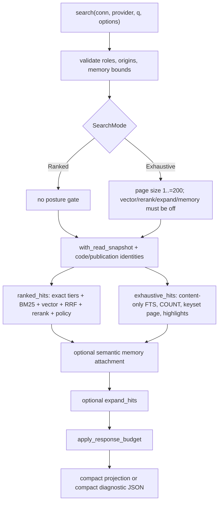
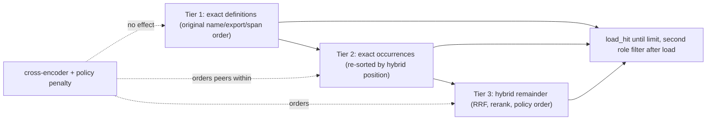

# Code retrieval: exhaustive mode, exact identifiers, hybrid ranking

`search::search` (`src/search.rs:1617`) is a single public function with two mutually exclusive retrieval bodies and one shared tail. The ranked body fuses a BM25 ranking and a vector KNN ranking with reciprocal rank fusion, optionally reorders the fused prefix with a cross-encoder, demotes non-runtime files by a scout-derived policy penalty, and then *prepends* a separately computed pool of exact identifier matches so the exact tiers cannot be outvoted by either ranker. The exhaustive body (gate G22) abandons ranking entirely: it runs one FTS5 predicate scoped to the source-content column, counts the full match set, and walks it in `(path, start, id)` order under a content-bound cursor, emitting locator-only hits with per-line match positions. Both bodies converge on optional memory attachment, optional graph expansion, and a shedding loop that fits the serialized envelope into a byte budget. Everything in this file operates over the `code` corpus; documentation is a parallel pipeline reached through a different tool, described in `04-documentation-retrieval.md`.

## One entry, two bodies

Validation happens before any SQL runs. Four allowlist checks — roles and origins for hits, roles and origins for expansion — fire first (`src/search.rs:1623-1626`), and `origin::validate_all` additionally rejects an empty origin list outright (`src/origin.rs:10-12`), since an empty list would silently match nothing rather than everything. Memory graph depth (`<= 8`) and node limit (`1..=20_000`) are checked unconditionally; `memory_limit` (`1..=100`) only when `include_memory` is set (`src/search.rs:1627-1639`).

`SearchMode` (`src/search.rs:155`) carries the continuation token inside the `Exhaustive` variant, so no caller can supply a cursor without also asking for traversal. The exhaustive arm is two bails (`src/search.rs:1640-1655`): page size in `1..=MAX_EXHAUSTIVE_PAGE_SIZE` (200), and `provider.is_some() || rerank || expand || include_memory` rejected. Note the asymmetry — the `Ranked` arm enforces nothing, so a ranked `limit: 0` is legal and simply returns zero hits.

Look at where the two branches diverge and where they rejoin.

`SNAP` is `store::with_read_snapshot(conn, "jscout_search", ...)`, a savepoint that rolls back on error. `Identities::read` supplies the code digest as the response's top-level `snapshot` and the component fold as top-level `publication_snapshot`; the code digest is also embedded in every exhaustive cursor. The fold is not itself a freshness or invalidation gate. Both branches reach `BUD` — but only the exhaustive branch can fail there with a typed error, and only the exhaustive branch has metadata that must be recomputed after each shed.

## Posture negotiation differs between the two callers

The library-level gate is defensive, not the user-facing error, because both surfaces normalize posture first — and they do it differently. MCP `search_options_from_args` **rejects** the request when `vector`, `rerank`, `expand`, or `include_memory` is *explicitly* `true` alongside `exhaustive` (`src/mcp.rs:906-913`), and forces off only what would have come from configured defaults. The CLI forces silently, via `!exhaustive && resolve_flag(...)` on each of the four (`src/commands/mod.rs:254-261`). So the same flag combination is an error over MCP and a quiet downgrade on the command line.

Two further MCP behaviors are easy to miss. `tool_defs` strips input-schema properties from `semantic_search` in the Baseline profile (`src/mcp.rs:864-870`), so the advertised parameter list is profile-dependent, and an explicit `expand: true` in Baseline is an error rather than a downgrade (`src/mcp.rs:915-920`). And `effective_search_response_byte_limit` returns `usize::MAX` when the CLI runs with `--debug-json` and no explicit `--response-bytes` (`src/commands/mod.rs:141-147`), which makes the entire shedding pipeline inert on that path.

## The ranked pipeline

`ranked_hits` (`src/search.rs:2064`) computes the G17 exact pool *first* and consumes it *last*.

`exact_intent_candidates` (`src/search.rs:530`) admits only identifier-shaped tokens. A query that reduces to exactly one legal identifier is admitted unconditionally; otherwise every token must additionally be *code-shaped* — leading or embedded `_`/`$`, a leading uppercase, or any non-initial uppercase (`is_code_shaped_identifier`, `src/search.rs:515`). That second test is what stops ordinary prose from manufacturing an exact tier out of words like `render` or `state`. The occurrence cap is `per_identifier_limit` for a pure identifier query and **1** otherwise (`src/search.rs:535-543`): a mixed natural-language query gets one exact occurrence per identifier, enough to establish coverage without letting one common incidental type consume the whole result budget. Occurrences are fetched at the full limit, filtered against the definition set, and only then truncated (`src/search.rs:565-577`) — truncating first could retain a row that is also a definition, filter it, and leave zero occurrences.

`exact_definition_chunks` (`src/search.rs:583`) unions `chunk.name = ? COLLATE BINARY` with symbols joined to their containing chunks and orders by `(name_priority, export_priority, span, path, start, id)`. As of `e3229ad` both of its statements read through the `code_chunks`/`code_files` views, closing the one place a docs-corpus chunk carrying a `name` could have entered. `exact_occurrence_chunks` (`src/search.rs:698`) unions `refs.target_name`, `member_calls.prop`, and `entity_sites.target_name`, grouped by chunk and ordered by `MIN(path), MIN(position), chunk_id`. Only when that structured union falls short of the limit does it fall back to FTS5 as a bounded candidate generator — `limit * 32` clamped to `[32, 4096]` (`src/search.rs:780`) — whose rows must each pass `contains_code_identifier` (`src/search.rs:807`), a six-state byte lexer requiring the whole-token match to occur in Code state, outside strings, templates, and comments.

Meanwhile the hybrid leg runs. `candidate_pool_limits` (`src/search.rs:2196`) sets `pool = limit.max(10) * 5` and quadruples the vector pool when a role allowlist is present, because sqlite-vec applies KNN's `k` before the joined `file.role` is visible; without the surplus a selective role filter starves the vector ranking and tilts RRF toward BM25. `bm25_ranking` (`src/search.rs:986`) runs `bm25(chunks_fts, 2.0, 4.0, 3.0, 1.0)` over the OR-joined quoted-token query from `fts_query_for_column` (`src/search.rs:454`) — the only escaping in the module, and the reason no user input ever reaches FTS5 as syntax. `embed::vector_search` (`src/embed.rs:1749`) issues one `MATCH ... AND k = limit` per origin against `vec_embeddings_{dims}`, joined through `embedding_index_entries` and `code_chunks` (`src/embed.rs:1804-1806`), converting distance to `1.0 - distance`. Vector failure downgrades `RetrievalStatus` rather than failing the search.

Both rankings are role-prefiltered and truncated to `pool`, then fused by `rrf` (`src/search.rs:1605`), which sums `1/(60 + rank + 1)` — called at `src/search.rs:2105`. The cross-encoder then reranks the first `reranker.pool` fused entries (`src/search.rs:2110-2137`). `Reranker::rerank` (`src/search.rs:1545`) posts `{model, query, deadline_ms: 120_000, candidates: [{id: "<i64 as string>", text}]}` with a 125-second global client timeout, requires every candidate back exactly once, and breaks score ties by incoming position so ordering is deterministic. A failure is non-fatal: the caller sets `retrieval.reranker_degraded()`, prints a stderr note, and falls back to RRF order (`src/search.rs:2127-2130`). `merge_reranked_prefix` (`src/search.rs:2209`) places the reranked prefix ahead of every fused candidate not in it, dropping nothing.

`apply_repository_policy_penalty` (`src/search.rs:2170`) then re-sorts by `recon::chunk_policy_penalty(chunk) / (rank + 1)` — and runs **only when `options.file_roles` is empty** (`src/search.rs:2139-2141`), so supplying any role allowlist silently disables scout-derived demotion.

Finally `tiered_candidates` (`src/search.rs:892`) assembles the answer. Read the next diagram for which tiers the reranker and policy penalty are allowed to touch:

The dotted edges are the point. Only `occurrences` is stably re-sorted against `hybrid_positions` (`src/search.rs:902-914`); `exact.definitions` reaches `append_exact_tier` in its original order, untouched by reranker or policy. The hybrid remainder is appended unconditionally behind both exact tiers (`src/search.rs:934-945`), so a hybrid match can never be lifted above an exact definition. `append_exact_tier` (`src/search.rs:949`) interleaves depth-major across identifiers, so in a multi-identifier query every identifier contributes its first hit before any contributes a second.

A consequence: `Hit.score` stops being the ranking key. An exact-tier candidate that never appeared in the hybrid pool reports `score: 0.0` (`src/search.rs:978`) while ranked first, and the field mixes RRF sums with reranker scores depending on which stage last touched it. There is no output field naming the tier that produced a position — only `match` (`ExactDefinition | ExactOccurrence | Lexical | Hybrid`, `src/search.rs:430`), which the compact transport omits when it equals the envelope's `default_match`.

## Every scoring factor and constant

| Factor / constant | Value | Where |
| --- | --- | --- |
| BM25 column weights (content, name, symbols, path) | `2.0, 4.0, 3.0, 1.0` | `src/search.rs:998` |
| RRF constant `k` | `60.0` | `src/search.rs:1605`, called at `:2105` |
| RRF contribution | `1/(k + rank + 1)`, summed across rankings | `src/search.rs:1605-1612` |
| Vector score | `1.0 - distance` (cosine distance from sqlite-vec) | `src/embed.rs:1749` |
| Candidate pool | `limit.max(10) * 5` | `src/search.rs:2197` |
| Vector overfetch under a role allowlist | `pool * 4` | `src/search.rs:2201-2205` |
| Reranker pool | `reranker.top.min(100)`; `top` defaults to 50 | `src/search.rs:1540`, `src/config/load.rs:735-746` |
| Reranker document truncation | `reranker.max_chars`, default 4000 | `src/config/load.rs:762-766` |
| Reranker model default | `BAAI/bge-reranker-v2-m3` | `src/config/load.rs:750-755` |
| Reranker deadline / client timeout | `120_000 ms` in body, `125 s` global | `src/search.rs:1553`, `:1560` |
| Repository policy penalty | runtime 1.0, tooling 0.45, documentation 0.4, test 0.3, generated 0.1 | `src/recon.rs:638-646` |
| Policy sort key | `penalty / (rank + 1)`, ties by original rank | `src/search.rs:2172-2186` |
| Exact occurrence cap, mixed query | 1 per identifier | `src/search.rs:539-543` |
| Exact occurrence cap, pure identifier query | `limit` | `src/search.rs:539-543` |
| FTS fallback candidate window | `limit * 32` clamped to `[32, 4096]` | `src/search.rs:780` |
| Default result limit | 10 | `src/search.rs:12` |
| Max exhaustive page size | 200 | `src/search.rs:13` |
| Default response byte limit | 30,000 | `src/search.rs:17` (`DEFAULT_RESPONSE_BYTE_LIMIT`); explicit config/call limits override |
| Memory candidate pool | `memory_limit * 8` clamped to `[1, 100]` | `src/search.rs:1674` |
| Memory graph depth / nodes | default 2 / 2,000; max 8 / 20,000 | `src/search.rs:14-17` |
| Rendered support cap (diagnostic only) | 8 | `src/search.rs:18` |
| Expansion path limit | default 8, max 50 | `src/search.rs:19-20` |
| Cursor prefix | `jscout-exhaustive-v3` | `src/search.rs` |
| Snippet truncation step | `max(overshoot, 128)` bytes | `src/search.rs:2631-2633` |

Defaults from configuration: `search.vector` and `search.rerank` are `true`, `attach_memory` and `expansion.enabled` are `false` (`src/config/model.rs:90-104`).

## G22 exhaustive mode

`exhaustive_hits` (`src/search.rs:1343`) drops ranking, snippets, `uses`, `used_by`, and scoring, and offers one thing instead: a complete, deterministically paged match set.

**Scope canonicalization.** `exhaustive_scope` canonicalizes roles, origins, and formats into registry order and collapses full allowlists where the response schema permits `"all"`. `exhaustive_request_fingerprint` blake3-hashes a domain tag, the raw query, and the normalized role, origin, and format lists. The `scope` object echoed to the caller (`corpus: "indexed_chunks"`, `file_roles`, `origins`, `formats`) states what completeness was claimed over. It does not repeat the code digest; the one authoritative value is the response's top-level `snapshot`.

**The FTS query is content-only.** `exhaustive_fts_query` (`src/search.rs:469`) is `fts_query_for_column(q, Some("content"))`, while ranked BM25 matches unscoped across `content, name, symbols, path`. This restriction *is* the mode's promise: the other columns admit chunks with no textual occurrence in the source, which would leave nothing to report as `match_lines` and would make `total_chunks` count something other than what it claims. The tradeoff is that the two modes do not match the same set — a path-only or symbol-only needle that ranked search answers returns zero exhaustive hits and `total_chunks: 0`. If the query reduces to no tokens at all, the function short-circuits to zero hits before any COUNT or paging (`src/search.rs:1364-1375`); with a cursor and an empty query it bails instead (`src/search.rs:1355-1357`).

**Paging.** A `COUNT(*)` over the same predicate yields `total_chunks` (`src/search.rs:1379-1398`) before paging and before shedding, so `returned < total_chunks` is normal on every page including the last. The page query fetches `limit + 1` rows ordered `file.path, chunk.start, chunk.id` under a keyset predicate `(file.path, chunk.start, chunk.id) > (?, ?, ?)` (`src/search.rs:1420`). `chunk.id` is the tie-breaker — `(path, start)` alone is not unique — and the resulting triple is unique and totally ordered, so no chunk can be skipped or duplicated. `has_more` is `selected.len() > options.limit` (`src/search.rs:1456`).

**Cursors.** `ExhaustiveCursorPosition` is `{path, start, hash}` — a chunk's logical identity, not its row id, because row ids are disposable across index passes. `encode_exhaustive_cursor` emits `jscout-exhaustive-v3 . snapshot(64 hex) . fingerprint(64 hex) . path(2 hex per byte) . start(16 hex) . hash(64 hex)`; the path is hex-encoded byte-by-byte because a path containing a dot would desynchronize field parsing. The fingerprint covers query, roles, origins, and formats. Decoding validates prefix, field count, and every field width before comparing snapshot and fingerprint, then re-resolves the position to exactly one row.

**Match lines.** `exhaustive_highlight_markers` (`src/search.rs:1079`) starts from `\u{1e}jscout-match-start\u{1f}` and appends `-` until no selected chunk's source contains either marker, so source bytes can never be mistaken for a marker. It terminates only because a page is finite; there is no iteration bound. `highlight(chunks_fts, 0, start, end)` supplies positions, and `exhaustive_match_lines` (`src/search.rs:1130`) counts newlines between markers from `chunk.start_line`, suppressing repeats so a line with three matches is reported once. If highlighting misses any selected chunk the whole request fails (`src/search.rs:1123-1125`) — a hit with empty `match_lines` would silently break the completeness contract.

**Hits.** Each hit carries `score: 0.0`, `MatchReason::Lexical`, empty snippet/uses/used_by, projected anchors, and `match_lines`. Compact output keeps the locator (`at`, kind, match lines, and one anchor or an explicit ambiguous anchor list) but emits no per-hit `followups` scaffolding. A caller constructs an exact follow-on from the returned anchor plus the response's top-level code snapshot and preserves any explicit origin/format filters from its own request.

## Fitting the byte budget

`apply_response_budget` (`src/search.rs:2458`) rejects a zero limit, clones the pre-shed result when exhaustive, and runs `apply_response_budget_once` (`src/search.rs:2483`). That function first calls `refresh_exhaustive_metadata` and `capture_unbudgeted_bytes` (`src/search.rs:2486-2487`) — `unbudgeted_bytes` is the pre-shed size reported in the envelope — then caps total semantic supports at 8 *only in diagnostic mode* (`src/search.rs:2495-2497`), then loops. The ladder, sheddable-first:

1. lowest-ranked semantic artifact, then a redundant support, then the last artifact
2. an expansion edge (then prune orphan nodes, refresh path counts), then a non-seed expansion node
3. a hit from the tail, never the last one
4. a `used_by` entry, then a `uses` entry
5. an anchor — guarded by `result.exhaustive.is_none()`, so an exhaustive locator is never shortened
6. truncate the largest snippet by `max(overshoot, 128)`
7. give up

Memory is an untrusted optional attachment; expansion was requested but is secondary to source-backed hits; the last hit plus its anchor are the response's only irreducible content. `refresh_exhaustive_metadata` (`src/search.rs:2433`) reruns at the top of every iteration, recomputing `truncated = page_had_more || returned < selected_positions.len()` and re-encoding `next_cursor` from the last *rendered* hit — so shedding a page's tail rewinds the cursor rather than losing chunks.

Measurement is a nested fixed point because `rendered_bytes`, `unbudgeted_bytes`, and diagnostic `transport_sections` are serialized fields of the thing being measured. The caller's `byte_limit` is now `#[serde(skip)]` and does not consume output. `settle_rendered_bytes` sits inside `settle_search_response` (which adds compact-section accounting only for diagnostics) inside `capture_unbudgeted_bytes`. Compact therefore has two nested fixed points; diagnostic has three. Every public JSON path uses compact serialization.

When shedding fails, exhaustive mode returns the typed `ResponseBudgetTooSmall { byte_limit, minimum_bytes }` (`src/search.rs:214`), whose floor comes from `minimum_exhaustive_response_bytes` (`src/search.rs:2766`) — a binary search over byte limits, deep-cloning the pre-shed result at every probe. The floor is exact in both directions: retrying at `minimum_bytes` succeeds with `rendered_bytes == minimum_bytes`, and one byte below fails reporting the same floor (`src/search/tests.rs:807`, `:878`, `:932`). Rendered size is not monotone in retained hits — shedding a hit from a *terminal* exhaustive page adds an opaque `next_cursor` plus omission accounting — which is exactly why one measurement cannot establish the floor (`src/search.rs:2763-2765`, `src/search/tests.rs:878`). Ranked mode has no typed floor; it returns an untyped error, and nothing in production downcasts `ResponseBudgetTooSmall`, so the number travels as text.

## Documentation does not enter this path

Documentation results are served entirely separately. Docs chunks live in `chunks` with `files.corpus = 'docs'`, but the indexer mirrors them only into `docs_fts`, never into `chunks_fts` (`src/store.rs:31-46`, `src/indexer.rs:971` vs `:1105`), so every `chunks_fts MATCH` in `src/search.rs` is code-only by construction. `documentation_search` (`src/mcp.rs:1140`) and `jscout docs search` (`src/cli.rs:578`) call `docs::retrieval::search` (`src/docs/retrieval.rs:357`), which builds its own BM25 over `docs_fts`, its own vector ranking over `vec_doc_embeddings_N`, its own fusion (`RRF_K = 60.0` independently redefined at `src/docs/retrieval.rs:18`), and its own byte budget. It borrows exactly two things from this module: the `Reranker` client and `merge_reranked_prefix`, which is why `e3229ad` widened both to `pub(crate)`. The MCP tool is stripped from `tool_defs` entirely when docs are disabled (`src/mcp.rs:849`). See `04-documentation-retrieval.md`.

The boundary is enforced in three places rather than one, and their strengths differ. Only `exact_definition_chunks` reads through the `code_chunks`/`code_files` views; code vector search joins `code_chunks`. Everything else in this file still relies partly on the insert-side split keeping docs rows out of `chunks_fts` and out of code relation tables. Any future writer that mirrors docs into `chunks_fts` would open the code path silently. Per-site tests pin known paths, and the MCP differential test enforces the system property: index the same repository without and with Markdown/MDX, normalize only the two top-level identity values, and require every code/semantic read surface to remain byte-identical. A third check asserts `embedding_index_entries ⋈ doc_chunk_meta = 0`.

One naming trap follows from all this: `file_roles: ["documentation"]` is **not** documentation retrieval. It selects *code* files whose path contains a `docs`, `documentation`, `.storybook`, or `stories` component, or a `.stories.`/`.story.` marker (`src/file_role.rs:75-80`) — a heuristic orthogonal to `files.corpus`.

## Limits

- `Hit.score` is not comparable across tiers and should not be shown as calibrated relevance.
- `contains_code_identifier` models neither regex literals nor JSX text nor `${}` substitutions. An apostrophe inside a regex or in JSX prose flips the lexer into its single-quoted state and swallows the following code. It gates only the FTS fallback; the structured union is admitted unchecked.
- The reranker serializes candidate ids as strings and parses them back with `as_str()?.parse()` (`src/search.rs:1571-1577`). A service returning a numeric `id` is dropped by `filter_map`, then trips the exactly-once check, degrading the whole rerank stage rather than failing loudly. The HTTP call runs with the read savepoint open, for up to 125 seconds.
- `resolve_search_limit` (`src/search.rs:22`) passes an explicit limit through untouched and clamps only an *omitted* configured limit under exhaustive, so `limit: 201` reaches the mode gate and errors there.
- A cursor is scope-canonicalized before fingerprinting, so a cursor issued under an explicit all-six-role allowlist stays valid for a request with no role list, and vice versa; the distinction is erased.
- `compact_exhaustive_hit` (`src/compact.rs:288`) omits `role` and `origin`, which `compact_hit` emits when non-default (`src/compact.rs:278-284`) — so a test-role or dependency exhaustive hit is indistinguishable from a production one at hit level. Those are echoed once at page level in `scope`.
- Compact and diagnostic transports still have different exact byte floors because their response shapes differ, even though both now serialize without pretty-print whitespace.
- `minimum_exhaustive_response_bytes` performs O(log N) deep clones of a result that may hold 200 hits, all on the failure path; `byte_limit == 0` is only noticed after all retrieval has already run (`src/search.rs:2459-2461`).
- The G17 "syntax-aware exact occurrences" residual described in `PLAN.md` is not built: `exact_occurrence_chunks` orders purely by `(path, position, chunk_id)` with no notion of executable versus contract versus import/export occurrence kind, there is no import/export collapsing with an omitted count, and a pure identifier query still fills spare slots with hybrid candidates.

## Testing

Search and compact tests cover deterministic paging, cursor invalidation by code digest, exact retry floors, exact-tier ordering, compact size targets, absence of `followups`, omission of caller byte limits, and exactly one top-level response identity block. The exhaustive floor test verifies the retained locator still carries `at` plus an anchor and that continuation starts at the correct next chunk. There is no fuzzing; `contains_code_identifier` is exercised through targeted cases only, and the reranker is driven by injected closures rather than HTTP.
