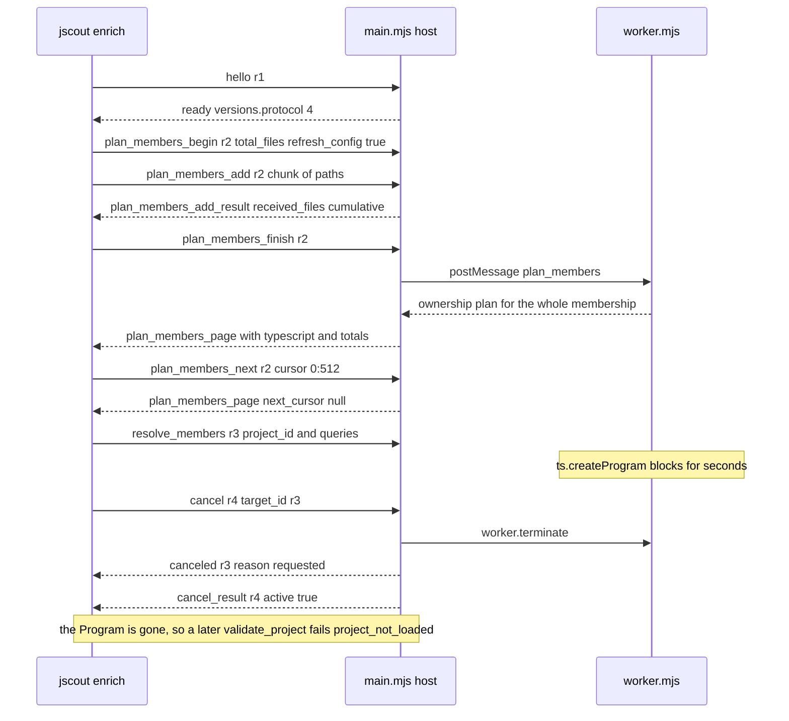
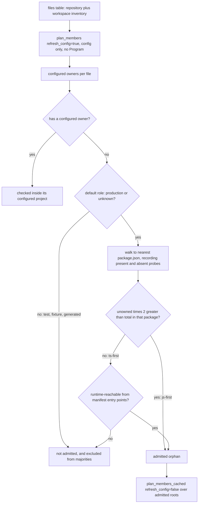
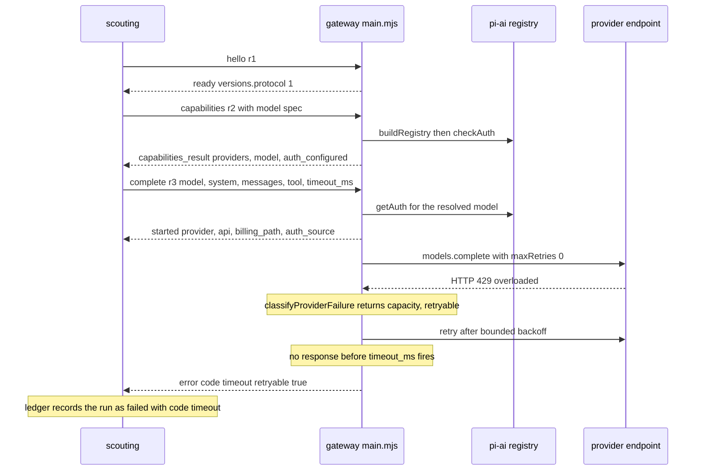

# Sidecar processes: the TypeScript checker and the LLM gateway

jscout keeps two capabilities out of the Rust binary entirely: TypeScript's own type checker, and every generative model provider. Both live in Node child processes launched by the Rust side, both speak one JSON object per line over stdio with a `{protocol, id, kind, ...}` envelope, and in both cases Rust owns everything durable — request correlation, timeouts, cancellation, reply validation, and all SQLite writes — while Node owns only the thing it uniquely can do. The two protocols are separately versioned: the checker is at `PROTOCOL_VERSION = 4` (`src/checker/protocol.rs:3`) after ownership planning became a streamed, paged session; the gateway is still at `1` (`src/llm/protocol.rs:8`). Both wire protocols are walked message by message below; most of the recent complexity landed on the checker side, in the enrichment campaign built on top of protocol 4.

## Two sidecars, one shape

| | checker | LLM gateway |
|---|---|---|
| Entry point | `checker/src/main.mjs <repo-root>` | `gateway/src/main.mjs` |
| Protocol version | 4 (`src/checker/protocol.rs:3`) | 1 (`src/llm/protocol.rs:8`) |
| Node floor | 22.19.0, verified before spawn (`src/checker/mod.rs:62`) | same check, same function (`src/llm/config.rs:14`) |
| Path resolution | `--sidecar-path` → `sidecars.checker` → beside the binary → `target/{debug,release}` sibling (`src/checker/mod.rs:13-43`) | `--gateway-path` → `sidecars.gateway` → beside the binary → dev sibling (`src/llm/config.rs:51-95`) |
| Line cap | 4 MiB (`src/checker/process.rs:22`) | 16 MiB (`gateway/src/protocol.mjs:9`) |
| Concurrency | one request at a time; a second gets `busy` (`checker/src/main.mjs:134-141`) | one completion at a time; a second gets `busy` (`gateway/src/server.mjs:145-149`) |
| Internal split | protocol host + `worker_threads` worker | single process, async dispatch |
| Doctor command | `jscout checker doctor` (`src/checker/mod.rs:68`) | `jscout llm doctor` (`src/llm/mod.rs:127`) |
| Lifecycle | fresh process per project; `Drop` sends `shutdown`, then kills after 500 ms | one process per scout command; same `Drop` protocol |

Node resolution and version verification are literally shared: `checker::launch` calls `crate::llm::config::resolve_node_setting` and `verify_node_version` (`src/checker/mod.rs:62-63`), so the gateway's config module is the single place that knows what "a usable Node" means.

## The checker wire protocol (version 4)

There is no negotiation. The client sends `hello`, and a `ready` whose `versions.protocol` is not exactly 4 aborts the connection (`src/checker/process.rs:366-383`); the handshake budget is `HELLO_TIMEOUT` = 30 s (`src/checker/process.rs:19`).

| Outbound | Inbound | Contract |
|---|---|---|
| `hello` | `ready{versions{sidecar,node,protocol}}` | Answered by the host without touching the worker; sidecar version is `0.4.0` (`checker/src/main.mjs:20`). |
| `capabilities` | `capabilities_result` | TypeScript identity (`repository` or `bundled`), every configured project with `file_count`/`purpose`/`purpose_reasons`/`membership_fingerprint`/`config_fingerprint`, configuration problems. |
| `plan_members_begin{total_files,refresh_config}` | `plan_members_ready{total_files}` | Opens an upload session. `refresh_config=false` reuses the worker's cached discovery. |
| `plan_members_add{files}` | `plan_members_add_result{received_files}` | `received_files` is cumulative; duplicates, non-strings, overshoot, or out-of-sequence frames fail the session (`checker/src/main.mjs:167-197`). |
| `plan_members_finish` | — | Requires exactly `total_files` uploaded; only now does the worker compute ownership and grouping. |
| `plan_members_next{cursor}` | `plan_members_page{...}` | Cursor-paged result; `next_cursor` is `sectionIndex:itemIndex` or null (`checker/src/protocol.mjs:105`). |
| `resolve_members{project_id,project_files,queries}` | `resolve_members_result` | 1–512 queries worker-side (`checker/src/worker.mjs:1030`), 128 client-side (`src/checker/enrich.rs:2677`); `project_files` is required and ≤150 for `inferred:` ids. |
| `validate_project{project_id,fingerprint}` | `validate_project_result{valid,inputs}` | Must follow `resolve_members` in the same worker or fails `project_not_loaded` (`checker/src/worker.mjs:1096-1099`). |
| `cancel{target_id}` | `canceled` on the target id **and** `cancel_result` on the cancel's own id | Two frames, two ids (`checker/src/main.mjs:277-289`). |
| `shutdown` | `shutdown_result` | Host clears the plan session, terminates the worker, pauses stdin, exits 0. |
| — | `error{code,message}` | `busy`, `protocol`, `protocol_version`, `unsupported`, `oversized_line`, `oversized_plan_frame`, `oversized_batch`, `hash_mismatch`, `span_mismatch`, `project_switch`, `project_mismatch`, `project_not_loaded`, `checker_failure`, `checker_crash`, `checker_exit`, among others. The repository root is masked as `<repository>` and messages are truncated. |

Two of these do not exist on the Rust side: `resolve_member` (singular) is `#[cfg(test)]`-only in `Outbound` (`src/checker/protocol.rs:21-24`) and `validate_inputs` has no `Outbound` variant at all, though `checker/src/main.mjs:263` and `checker/src/worker.mjs:1197-1219` implement it. That is dead protocol surface that still has to be maintained.

The interesting change is that `plan_members` is no longer one frame. Rust normalizes the path list (sorted by UTF-16 code units, duplicates rejected — `src/checker/process.rs:141`), packs it into ≤900 KiB payload chunks (`:155`), pre-measures every frame against a 1 MiB plan cap (`:182`), and sends the whole `begin`/`add*`/`finish`/`next*` session under **one** reused request id via `send_with_id`. That deliberately breaks the otherwise-universal one-id-per-frame rule, and it exists so the session id doubles as the cancel target. Verification of the paged reply is exhaustive and hand-written (`src/checker/process.rs:498-625`): the first page alone may carry `typescript` and `totals`, running counts may never exceed totals, ownership rows must arrive in exactly the uploaded order, project ids may not repeat, cursors may not repeat, a non-final page must make progress, and the final concatenation must equal the upload exactly.

Frame budgets layer: 4 MiB line cap, then 1 MiB per plan frame, then a 900 KiB payload budget for the chunker and the pager. The enforcement is asymmetric, though. Rust checks `MAX_PROTOCOL_LINE_BYTES` only when writing (`src/checker/process.rs:122-127`); its stdout reader is a plain `BufReader::lines()` with no cap (`:330-344`), so inbound frames are unbounded on the Rust side and only Node's `parseMessage` caps what it reads.

What to look for in the next diagram: the plan session's shared request id `r2`, the fact that no TypeScript work happens until `plan_members_finish`, and the cancel path where two frames come back on two different ids.

The host/worker split visible as `H` and `W` exists precisely because `ts.createProgram` blocks: a single-threaded host could not answer `cancel` or `shutdown` mid-typecheck. The price is that cancellation is `worker.terminate()`, which destroys the Program, the tsconfig discovery cache, and every cached SourceFile — a canceled project resumes from Program construction. After `cancel`, `canceledPlanId` (`checker/src/main.mjs:247`) suppresses stray `plan_members_*` frames carrying the dead session id, and it is cleared only by the next `plan_members_begin` (`:154`), so every subsequent frame for that id is dropped, not just one.

## The enrichment campaign

`checker::enrich` (`src/checker/enrich.rs:374`) opens the store, reads the structural snapshot, loads member-call occurrences (`:1099`), and filters them (`select_eligible`, `:1196`). Eligibility is where the new value-flow plane couples in: an occurrence already resolved at `likely` by `provenance='receiver-value-flow'` is dropped (`:1109-1116`), non-checker deterministic resolutions are dropped unless `--all`, and an occurrence is required to have a `runtime_namesake` — a same-named symbol in a runtime-role file — with the rest counted as `foreign_namesake`. If nothing survives, the sidecar is never launched.

### Two-pass planning and the package gate

Pass one covers the *entire* first-party inventory (`package_gate::inventory_paths`, `src/checker/enrich.rs:431-438`) with `refresh_config=true`. It is configuration-only: no Program is built. `package_gate::evaluate` (`src/checker/package_gate.rs:166`) then decides which files with no configured TypeScript owner are worth checking at all. Pass two (`plan_members_cached`, `refresh_config=false`, `:468`) covers only admitted orphans plus eligible-occurrence files plus dirty files, reusing the sidecar's discovery snapshot so the config walk is not paid twice. Rust cross-checks TypeScript identity between the two views (`:469-473`), then drops the planner (`:474`) — note the drop happens *before* the remaining cross-checks: exact request/response file-set equality (`:475-486`), `same_configured_ownership` per file (`:487-494`), and `validate_fresh` (`:495`) all run against the already-collected pass-2 result.

What to look for below: the two independent admission routes, and the fact that role filtering happens before the majority is computed, so tests and fixtures neither enlarge the denominator nor get admitted.

The `MAJ` node is `PackageCounts::js_first` (`src/checker/package_gate.rs:110-112`): `unowned_default * 2 > total_default`, a strict majority computed only over default-role files. The `REACH` node resolves manifest entry points — `main`, every non-`types` `exports` condition, `bin`, and source-looking tokens pulled out of `scripts` by a shell tokenizer — into indexed files through extension variants and `dist/**` → `src/**` mirror variants, then BFSes `module_edges` with `type_only=0`. Admission is `include_all OR (default_role AND (js_first OR reachable))` (`src/checker/package_gate.rs:207-221`).

The rationale for splitting on package rather than on the repository is that an orphan `.js` inside a mostly-TypeScript package is usually a deliberate exclusion — build output, a config file, a one-off script — and typechecking it produces noise; in a JS-first package the missing tsconfig is normal and enrichment is exactly where the value is. Reachability exists to rescue the minority orphan that is nevertheless a real entry point. The cost is a large untyped heuristic surface with no ground truth: misjudging it silently widens or narrows which files are ever typechecked, and the only signal is a report counter. Occurrences whose file has only inferred owners and was not admitted are dropped by `gate_inferred_projects` (`:1316`) as `occurrences_skipped_inferred_project`.

### The freshness contract and absent boundaries

Every input the checker depends on is recorded with a blake3 digest — except the ones that do not exist, which are recorded as the literal sentinel `ABSENT_INPUT_HASH = "absent:v1"` (`src/checker/package_gate.rs:11`, `src/checker/enrich.rs:20`, `checker/src/worker.mjs:36`). An absent `package.json` is as load-bearing as a present one: creating a closer manifest changes both the package majority and inferred scope membership. So `GatePlan::validate_fresh` re-hashes every observed manifest and asserts every absent probe is *still* absent (`src/checker/package_gate.rs:38-72`); `verify_source_hash` treats an appeared file as a hard error, "checker input appeared after planning" (`src/checker/enrich.rs:3541-3548`); and the worker's `validate_project` marks inputs invalid when an `absent:v1` probe now `lstat`s successfully (`checker/src/worker.mjs:1103-1105`). `validate_fresh` runs three times — before final planning (`:495`), before staging reuse (`:611`), and again inside the activation transaction (`:3319`) — plus `revalidate_package_gate` (`:1587`) relaunches a sidecar and re-runs the whole inventory plan after project work. `InputFreshnessCache` (`:305-341`) keeps one digest per path per invocation, because shared TypeScript lib and `@types` files appear in dozens of project manifests; a missing file caches as the sentinel and an unreadable one as `None`.

### Grouped inferred scopes and family semantics

Orphan roots are grouped by `(nearest package directory, compiler family)` into `inferred:<pkg>#<family>` projects (`groupedInferredProjects`, `checker/src/worker.mjs:408`). Family is a pure function of extension and nearest `package.json` `type`: `.jsx`/`.tsx` → `bundler-jsx`, `.mjs`/`.mts` → `node-esm`, `.cjs`/`.cts` → `node-cjs`, otherwise the package's `type` decides (`:295-301`). Each family maps to explicit compiler options — NodeNext module and resolution for the node families, ESNext plus Bundler resolution for JSX, `allowJs` on and `checkJs` off throughout (`checker/src/inferred-options.mjs`). Because an inferred project has no tsconfig, its effective options *are* its configuration, so they are folded into the config fingerprint (`checker/src/worker.mjs:530-534`), and `validateProject` re-runs `nearestPackage` on every root so a newly created closer manifest or a retargeted symlink invalidates the Program (`:1116-1125`).

Groups above `INFERRED_ROOT_CAP` = 150 roots are split into deterministic bins packed from bounded directory units, with bin labels like `<top>~<n>` appended to the scope id (`checker/src/worker.mjs:428-455`). Grouping replaced one-Program-per-orphan-file, which made Program count proportional to file count; the cap bounds peak memory per worker. The tradeoff shows up in identity: adding one file to a >150-root group can reshuffle bins, changing scope ids and invalidating that whole group's cached enrichment even though no code changed. Rust independently rechecks the cap and the reported file count (`src/checker/enrich.rs:1420-1434`) and ships the exact root list on every `resolve_members`, since the disposable worker must rebuild an identical Program.

### Overload grouping and closed candidate sets

`symbolDeclarations` collapses overload noise sidecar-side (`checker/src/worker.mjs:837-867`): if the symbol has a declaration that `isImplementationOfOverload`, that one node wins; a declaration-only overload set (an interface method or a `.d.ts` with five signatures) collapses to whatever `getResolvedSignature` chose for this call. Without this, one logical target looked like five and got demoted past the candidate threshold. When the resolved signature is not among the symbol's declarations the code falls back to `declarations[0]` — a silent guess (`:861-864`).

`map_occurrence` (`src/checker/enrich.rs:3567`) then assigns confidence: `likely` requires a *closed* candidate set of one to three distinct mapped target anchors with zero unmapped declarations (`:3644-3646`); anything wider, or anything with an unmapped declaration, is `possible`. Interface and union receivers legitimately produce two or three real implementations, and forcing them to `possible` discarded usable signal. The same threshold is re-applied across projects in one activation `UPDATE` with `count(DISTINCT target_anchor)>3` (`:3448`), which means the magic 3 lives in two places that must move together — and any move requires bumping `CHECKER_SEMANTICS_FINGERPRINT` (currently `jscout-checker-semantics-v4`) so legacy batches cannot be carried.

### Staging, zero-fact reuse, and the projection skip

Facts stage into five tables — `checker_enrichment_batches`, `checker_project_runs`, `checker_project_inputs`, `checker_occurrence_projects`, `checker_enrichments` — with at most one active batch enforced by `idx_checker_one_active_batch` (`src/store.rs:672`). Activation is a single `BEGIN IMMEDIATE` (`:3308`) that re-validates the gate, re-checks the snapshot, rejects pending runs, requires at least one run with status `completed` *or* `partial` (`:3348-3358`), re-hashes every stored input, rechecks every target fingerprint, and demotes cross-project ambiguity before flipping `active`.

Two behaviours matter for cost. First, `reusable_completed_batch` (`:1758`) accepts not only the active batch but a *completed inactive zero-fact marker* — `active=0`, non-empty `checker_input_fingerprint`, no enrichment rows — whose every project run completed with `completed == selected` and whose inputs still hash-match; a hit returns immediately with no sidecar work at all. Second, when a batch stages zero facts and a previous active batch exists, activation stamps the inactive batch's fingerprint and returns `publication_changed = false` (`:3477-3490`) rather than replacing the publication with nothing. Since `rebuild_projection` is called only when `publication_changed` (`:853`, `:872`), a no-op run now skips the projection rebuild entirely. A narrowed plan — filters, a small watch delta — can validly resolve to no facts, and both erasing real edges and rebuilding an unchanged projection are pure loss. The marker is fragile, though: only the non-empty `checker_input_fingerprint` distinguishes it from abandoned staging, and `open_staging_batch` deletes all inactive batches when a differently-shaped plan opens.

## The LLM gateway

`gateway/src/main.mjs` is a transport adapter over `@earendil-works/pi-ai` 0.84.1. It is explicitly not an agent: no tool execution, no repository access, no SQLite (`gateway/src/main.mjs:3-7`). Rust owns prompts, schemas, validation, persistence, and the run ledger; the gateway owns providers, credentials, and request execution (`src/llm/mod.rs:1-6`).

| Outbound | Inbound | Contract |
|---|---|---|
| `hello` | `ready{versions{gateway,pi_ai,node,protocol}}` | Must be first; every later kind throws `protocol` otherwise (`gateway/src/server.mjs:99-101`). Protocol ≠ 1 aborts (`src/llm/process.rs:272`). |
| `capabilities{model?}` | `capabilities_result{providers,model?}` | Builtin provider count plus sorted custom ids; with a model spec, `describeModel` plus `billing_path`, `auth_configured`, `auth_type`, `auth_source`. `model: null` means unknown spec. |
| `complete{model,system,messages,tool,timeout_ms,max_tokens,session_id,provider_options,reasoning}` | `started` then `result`, or `error`/`canceled` | Two replies on one id: `started` is emitted before any network wait (`gateway/src/server.mjs:170`). |
| `cancel{target_id}` | `cancel_result{target_id,active}` plus `canceled` on the target | Aborts the `AbortController` only if the target is the active completion. |
| `shutdown` | `shutdown_result` | Aborts the active completion, replies, exits 0. |
| — | `error{code,message,retryable,capacity}` | `busy`, `protocol`, `unknown_kind`, `invalid_request`, `unknown_model`, `auth`, `billing`, `capacity`, `context_limit`, `connection`, `provider`, `tool_contract`, `timeout`, `configuration`, `oversized_line`, `internal`. |

The registry is built lazily on first use, so `hello`/`ready` and its version report succeed even when custom-provider configuration is invalid; the configuration error then surfaces on the first request that needs providers (`gateway/src/server.mjs:48-52`). Configuration reaches the child only through three environment variables set at spawn: `JSCOUT_PI_AI_AUTH_FILE`, `JSCOUT_PI_AI_OPENAI_BASE_URL`, `JSCOUT_PI_AI_OPENAI_COMPATIBLE_PROVIDERS` (`src/llm/process.rs:161-190`), with a non-default `llm.api_key_env` read from the parent environment and forwarded as `OPENAI_API_KEY`. `billingPath` labels the resolved route `plan` for `openai-codex`, `custom` for a configured OpenAI-compatible provider, `api` otherwise (`gateway/src/registry.mjs:101`), and the ledger takes the gateway's label as authoritative over its own provisional guess (`src/scouting/mod.rs:1257-1262`).

What to look for next: `started` arriving before the provider is contacted, the retry loop living entirely in the gateway, and the timeout being enforced remotely with the client only holding a grace margin.

The `started` frame exists so Rust can observe the resolved provider, API, endpoint, and billing path *before* any network wait — a scout that later times out still has an accurate record of where the money would have gone. The retry loop between `G` and `V` is the only visible one: `startCompletion` sets `maxRetries: 0` on the pi-ai options so adapter and SDK retries cannot multiply invisibly underneath the gateway's own policy of two retries with 500 ms → 2 s exponential backoff (`gateway/src/completion.mjs:18-22`, `:367`). `classifyProviderFailure` (`:210-288`) maps free-text provider errors onto stable categories with fixed retryability: `billing` and `auth` and `context_limit` never retry, `capacity` and `connection` do. That classifier is a long chain of substring and regex tests over provider prose — robust to nothing except the strings it already knows.

Two structured-output rules are enforced sidecar-side. `requiredToolChoice` maps each pi-ai API onto that provider's forced-tool mode (`required` for the OpenAI family and Mistral, `any` for Anthropic/Bedrock/Google), and deliberately returns `undefined` for Azure and unknown adapters rather than sending an unverified option (`gateway/src/completion.mjs:189-201`). `extractSubmission` (`:132-180`) then requires the final message to contain exactly one call of the declared submit tool with object arguments; zero calls, several calls, a wrong name, or non-JSON arguments all become retryable `tool_contract` errors. Text alongside the call is dropped and hidden reasoning is never forwarded.

Error text passes through `sanitizeErrorMessage` (`gateway/src/protocol.mjs:58-73`) before it reaches the wire: bearer/basic headers, `api_key`/`token`/`secret` assignments, recognizable key shapes (`sk-`, `ghp_`, `xox…`, `AIza…`), and URL credentials, query parameters matching `key|token|secret|password|auth`, and fragments are all redacted, then the message is truncated to 2000 bytes. The comment on that function is honest about its role: it is defense in depth, not the primary control — provider failures are supposed to be mapped onto controlled messages before they get there.

Rust's client mirrors the checker's structure: one stdout deserializer thread feeding an `mpsc` channel, one stderr reprint thread prefixing `pi-ai-gateway:`, ids allocated `r{n}` from an `AtomicU64` (`src/llm/process.rs:228-250`). `receive_for` fails the request on any frame with an unexpected id, with one exception — a `cancel_result` is consumed silently unless it reports `active` for a request other than the one being awaited (`:345-357`). `complete_with_grace` sets the wire timeout to the request timeout plus 5 s so the gateway's own `timeout` error arrives instead of a local one (`:432-439`).

## Limits

- `ctrlc::set_handler` succeeds only once per process, and the checker and the gateway each keep their own `OnceLock` and control static (`src/checker/process.rs:28-30`, `src/llm/process.rs:31-33`). A command that uses both routes SIGINT to whichever registered first.
- A local checker timeout kills and reaps the child immediately (`src/checker/process.rs:780-785`), on the theory that a late sidecar is holding a multi-gigabyte Program. There is no partial-progress salvage for the in-flight batch.
- Checker backpressure is request-side and constant — 128 items and 1 MiB per `resolve_members`, with reactive halving on a remote `oversized_batch`. The `rss`/`heap` peaks the worker reports are printed and stored in `checker_project_runs` but never fed back into sizing.
- A checker JSON parse error with no plan session in flight is answered with `id: ""` (`checker/src/main.mjs:311`), which `receive_for` reports as "message for unexpected request id" rather than as the parse failure it is. The gateway has the same shape (`gateway/src/main.mjs:70-73`).
- On a partial checker failure the batch is activated and the projection rebuilt *before* `PartialEnrichmentError` is returned (`src/checker/enrich.rs:843-861`), so the caller receives an error describing a graph that has already changed.
- `capabilities` and `plan_members` have a second consumer that does not follow the gate path's rules: `src/scouting/repository.rs:385-398` launches its own sidecar and plans ownership in `files.chunks(512)`, deliberately splitting the inventory into independent calls, which is exactly what `enrich.rs:1552-1555` documents as unsafe for grouping identity.
- No test spawns the real checker sidecar over stdio from Rust. Rust-side protocol tests drive a `/bin/sh` fake that echoes canned frames keyed on `"kind":"..."` with hard-coded ids `r1`/`r2`/`r3`, so any change to id allocation silently invalidates them; the real sidecar is exercised only from JavaScript in `checker/test/sidecar.test.mjs`. The gateway has the same arrangement (`write_fake_gateway`, `src/llm/process.rs:538`).
