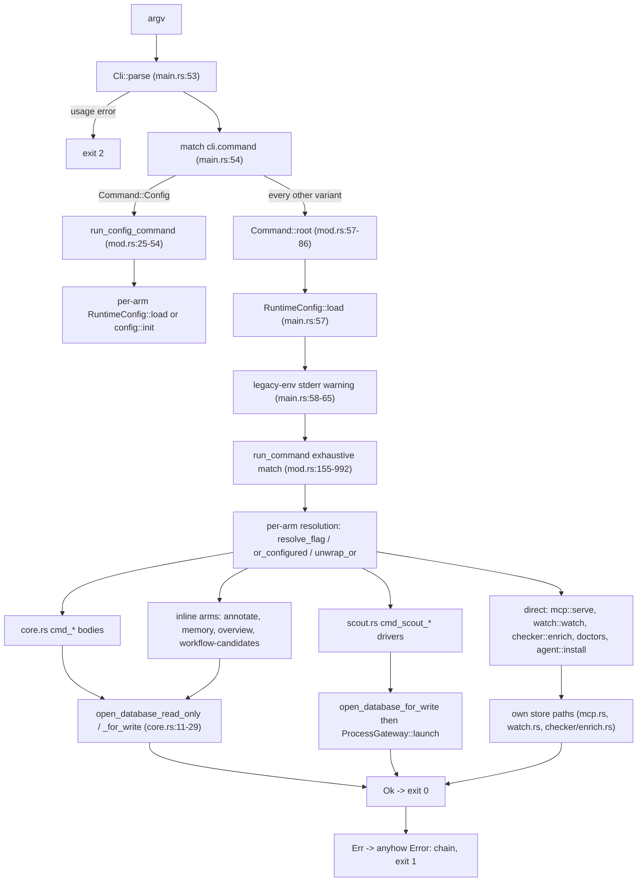
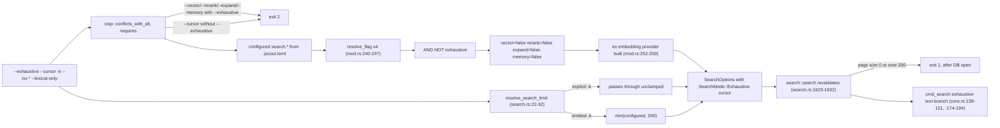

# Command line: cli.rs, commands, and dispatch

`jscout` is a single binary whose entire user contract is a clap-derived enum. The declaration lives in `src/cli.rs` (885 lines, one `Cli` struct, a 22-variant `Command` enum, five nested subcommand enums, and one value parser); the interpretation lives in `src/commands/`. `src/main.rs` is 80 lines and does four things: parse argv, split `config` out before any configuration exists, load exactly one `RuntimeConfig` for everything else, and call `run_command`. `run_command` (`src/commands/mod.rs:153-993`) is one 840-line exhaustive match whose job is not execution but *resolution* — turning each `Option<T>` flag into a concrete value by consulting `runtime.effective.*`, because most scalar options deliberately carry no clap default. Execution then happens in deterministic bodies in `src/commands/core.rs`, generative drivers in `src/commands/scout.rs`, four arms implemented inline, or direct calls into `mcp`, `watch`, `checker`, `llm`, `inference`, and `agent`.

## The 80-line entry point

`src/main.rs` is almost all module declarations: 39 `mod` statements at `:5-44` (one of them `#[cfg(test)] mod test_fs`) plus `#[cfg(test)] mod main_tests` at `:79-80`, for 40 module declarations total. Two crate-level lint attributes sit at `:1-3`, and a `#[cfg(test)]` re-export block at `:71-77` lifts `resolve_flag`, `or_configured`, `effective_search_response_byte_limit`, `render_cli_neighborhood`, and `render_semantic_memory_text` out of `commands` so `src/main_tests.rs` can reach them. `fn main` occupies `:52-69`.

The body is a two-arm match. `Cli::parse()` (`src/main.rs:53`) either exits with clap's own usage error — process status 2, before any jscout code runs — or yields a `Cli`. `Command::Config { command }` then goes straight to `run_config_command(command, cli.config.as_deref())` (`:55`) with **no** `RuntimeConfig` loaded. That is deliberate: `config validate`, `config show`, and `config init` have to work against a `.jscout.toml` that is malformed, version-mismatched, or absent, and `RuntimeConfig::load` bails on the first two (`src/config/load.rs:361-372`). Loading first would make the diagnostic fail with exactly the error it exists to report. Each `ConfigCommand` arm therefore loads its own configuration (`src/commands/mod.rs:28`, `:37`) or calls `config::init` (`:49`).

Every other variant takes the second arm: `command.root()` supplies a directory, `config::RuntimeConfig::load(root, cli.config.as_deref())` produces the single runtime (`src/main.rs:57`), `runtime.legacy_environment_keys()` (`src/config/display.rs:119-124`, a filter over the provenance map for `ValueSource::LegacyEnv`) produces a one-line stderr warning when any setting still arrives through the compatibility environment surface (`:58-65`), and `run_command` runs. The price of the short-circuit is visible in two places: `run_command`'s match is exhaustive only because of `Command::Config { .. } => unreachable!("configuration commands are dispatched first")` (`src/commands/mod.rs:156`), and `Command::root()` still has a live-looking `Config` arm (`:84`) that `main` can never reach.

`RuntimeConfig::load` canonicalizes the root and fails there — "repository root does not exist" (`src/config/load.rs:344-349`) — so a bad `ROOT` is the earliest real failure after clap, reported before any command body starts. Note the asymmetry that follows: the *canonicalized* root is kept inside the config, while `run_command` still hands each command the raw `root` from argv. A second asymmetry sits next to it: `--config` pointing at a missing file is a hard error (`:370-372`), but a missing `ROOT/.jscout.toml` silently yields defaults.

What to look for in the dispatch diagram: the single `RuntimeConfig::load`, the config bypass on the left, and the four distinct delegation targets that fan out of `run_command`.

The `RESOLVE` node is the only place in the binary that reads `RuntimeConfig` fields for the deterministic commands; `CORE` bodies receive already-resolved scalars. The exceptions are `cmd_embed` and the six `cmd_scout_*` drivers, which take `&RuntimeConfig` themselves because they construct an embedding provider or a Node gateway from it. `DIRECT` matters for a different reason: `mcp::serve`, `watch::watch`, and `checker::enrich` never touch the `core.rs` openers and open the database through their own module paths, so any behavior change in the openers does not reach them.

## Where the config root comes from

`Command::root()` is an inherent impl placed in `src/commands/mod.rs:56-87` rather than in `cli.rs`, which keeps the declaration file free of interpretation. Sixteen repository commands return their positional `root` directly; `Checker { command: CheckerCommand::Doctor { root, .. } }` reaches into the nested variant (`:75-77`); `Scout` and `Config` delegate to sibling `root()` impls (`:97-108`, `:89-95`). Two irregular cases survive. `Llm` and `Inference` return `Some(Path::new("."))` (`:82`), so `jscout llm doctor` reads `./.jscout.toml` from the current working directory rather than from any repository — surprising when diagnosing a tree you are not standing in. And `AgentGuide { install: None }` returns `None` (`:83`), the only rootless load in the binary; with no root, the configured database path degrades to the bare relative literal `.jscout.db` (`src/config/load.rs:379-386`).

## The three flag-resolution primitives

Because scalar defaults moved out of clap, three small helpers carry nearly all of the resolution work.

| Helper | Signature | Rule |
|---|---|---|
| `resolve_flag` (`src/commands/mod.rs:115-117`) | `const fn(enable, disable, configured) -> bool` | `if disable { false } else { enable || configured }` |
| `or_configured` (`:121-127`) | `fn(Vec<T>, &[T]) -> Vec<T>` | non-empty CLI list replaces the configured list wholesale; never appends |
| `effective_search_response_byte_limit` (`:129-135`) | `fn(Option<usize>, usize, bool) -> usize` | `requested.unwrap_or(if debug_json { usize::MAX } else { configured })` |

`resolve_flag`'s asymmetry is the consequence of moving defaults into configuration: once a boolean's default comes from `.jscout.toml`, a bare `--x` can only ever enable, so a repository that sets `search.rerank = true` can be overridden only with `--no-rerank`. Every paired flag also carries reciprocal `conflicts_with` in clap (`src/cli.rs:110-113`, `:128-138`, `:149-153`, `:262-266`, `:397-423`), which makes the `(true, true)` row unreachable from argv; `resolve_flag` still defines it as disable-wins.

`or_configured`'s replace-not-append rule is what makes `--origin dependency` mean "only dependency" rather than "also dependency". The `--deps`/`--no-deps` pair fits neither helper: it is a list pair with a clearing flag, spelled out as the same three-branch `if` in two places — `index` at `src/commands/mod.rs:165-171` and `watch` at `:563-569` — duplicated rather than factored. Scalars use the plain shape `opt.unwrap_or(runtime.effective.…)`, and the database path uses `database.as_deref().unwrap_or(configured_database)` against the single binding at `:154`.

## Command inventory and where each default comes from

Twenty-two `Command` variants: 17 direct leaves plus 5 grouping variants whose nested enums add 13 leaves (config 3, checker 1, scout 6, llm 1, inference 2), for 30 invocable command paths. `--config` is `global = true` (`src/cli.rs:13-19`), so it may appear after any subcommand.

| Command | Positional | Notable options | Default source |
|---|---|---|---|
| `stats ROOT` | root | — | n/a; never opens a database |
| `chunks ROOT` | root | `--filter` | n/a; never opens a database |
| `index ROOT` | root | `--database`, `--deps`/`--no-deps` | config (`index.dependencies`, `database.path`) |
| `embed ROOT` | root | `--database`, `--batch`, `--origin`, `--product`, `--semantic`, `--semantic-only`, `--repair` | config (`embedding.batch`, `embedding.origins`) |
| `search ROOT QUERY` | root, query | see the search table below | config throughout; no clap defaults |
| `events ROOT [NAME]` | root, name | `--origin` | **clap** `origin::defaults()` (`src/cli.rs:189`); no `--database` |
| `calls ROOT METHOD` | root, method | `--arg`, `--arg-position`, `--receiver`, `--origin`, `--limit`, `--json`, `--database` | clap (`--limit` 200, `:212`; `--origin` defaults) + config db |
| `mcp ROOT` | root | `--database`, `--telemetry`, `--request-log`, `--profile`, `--source-view`, `--result-transport` | config (`mcp.*`, `telemetry.*`) |
| `annotate ROOT INPUT` | root, input | `--database` | config db |
| `memory ROOT [QUERY]` | root, query (`default_value = ""`) | `--artifact`, `--view`, `--source*`, `--relation-limit`, `--concept-tag-limit`, `--origin`, `--database` | mostly **clap** (`-k` 20, `--source-depth` 8, `--relation-limit` 40, …) |
| `overview ROOT` | root | `--area-limit`, `--relation-limit`, `--semantic*`, `--reconnaissance*`, `--response-bytes`, `--database` | **clap** (20 / 30 / 8 / 12 / 24 000) |
| `workflow-candidates ROOT` | root | `--seeds`, `--snapshot`, `--depth`, `--candidate-limit`, `--database` | **clap** (2, `semantic::MAX_WORKFLOW_CANDIDATES`) |
| `watch ROOT` | root | `--embed`/`--no-embed`, `--product`/`--no-product`, `--deps`/`--no-deps`, `--enrich`/`--no-enrich`, `--enrich-timeout`, `--debounce-ms`, `--reconcile-seconds`, `--database` | config (`watch.*`) |
| `who-uses ROOT SPEC` | root, spec | `--json`, `--origin` | **clap** origins; no `--database` |
| `neighborhood ROOT ANCHOR` | root, anchor | `--depth`, `--direction`, `--node-limit`, `--edge-limit`, `--min-confidence`, `--kind`, `--file-role`, `--origin`, `--response-bytes`, `--debug-json` | **clap** (1, `both`, 50, 200, `likely`); no `--database` |
| `agent-guide` | — | `--install ROOT` | n/a; rootless without `--install` |
| `enrich ROOT` | root | `--timeout` (clap 300), `--files`, `--packages`, `--members`, `--roles`, `--max-occurrences`, `--all`, `--dry-run`, `--full`, `--sidecar-path`, `--database` | clap timeout, config sidecar/node/db |
| `config show\|validate\|init ROOT` | root | `--json` on `show` | loads its own config per arm |
| `checker doctor ROOT` | root | `--timeout` (clap 30), `--sidecar-path` | clap + config sidecar |
| `llm doctor` | — | `--model`, `--gateway-path` | config (`llm.model`); root is `"."` |
| `inference serve\|doctor` | — | `--project` / `--url` | config (`inference.*`); root is `"."` |
| `scout repository\|workflows\|cards\|summaries\|concepts\|refresh ROOT` | root (+ seeds/anchors/terms/artifacts) | `--model`, `--reasoning`, `--service-tier`, `--timeout` 300, `--max-calls`, `--context-bytes` 240 000, `--rebuild`, `--dry-run`, `--database`, `--gateway-path` | clap for timeout/context, config for model via `llm::config::resolve_model_setting` |

`search` is the command where the config-first policy is total. Every one of these has **no** clap default and resolves against `runtime.effective.search.*`: `-k/--limit` (10), `--response-bytes` (24 000), `--vector` (true), `--rerank` (true), `--memory` (false), `--expand` (false), `--expand-depth`, `--expand-mode`, `--expand-seeds`, `--expand-paths`, `--expand-nodes`, `--expand-edges`, `--expand-bytes`, `--expand-min-confidence`, `--expand-file-role`, `--memory-limit` (4), `--memory-depth` (2), `--memory-nodes` (2 000), `--file-role` (empty), `--origin` (`[repository, workspace]`); the values in parentheses come from `SearchSettings::default` (`src/config/model.rs:63-79`). The tradeoff is stated plainly by `--help`: it shows no default for any of them, so the effective value is discoverable only through `jscout config show`. Note the split: `search` and `embed` are the only commands that consult `runtime.effective.*.origins`; `events`, `calls`, `memory`, `overview`, `who-uses`, and `neighborhood` take `origin::defaults()` evaluated at parse time inside the clap attribute, so a repository that narrows `search.origins` does not narrow those six.

The claim that `cli.rs` holds no policy is therefore only mostly true. `origin::defaults()`, `semantic::MAX_WORKFLOW_CANDIDATES`, `semantic_query::DEFAULT_SOURCE_BYTE_LIMIT` / `DEFAULT_RESPONSE_BYTE_LIMIT` / `DEFAULT_CONCEPT_TAG_LIMIT`, and `scouting::repository::DEFAULT_MAX_DEPTH` are all evaluated at parse time from inside the attribute macros.

## Exhaustive search at the CLI

Two flags implement G22's second search mode. `--exhaustive` is declared `conflicts_with_all = ["vector", "rerank", "expand", "memory"]` (`src/cli.rs:97-99`); `--cursor TOKEN` is declared `requires = "exhaustive"` (`:100-102`); and `-k/--limit`'s help became "Max ranked results, or page size in exhaustive mode" (`:94-96`).

Dispatch does not trust clap to enforce the mode, because clap only blocks the explicit *positive* forms. All four stage booleans are ANDed with `!exhaustive` (`src/commands/mod.rs:240-247`), so a `.jscout.toml` with `search.vector = true` cannot re-enable vector retrieval under `--exhaustive`. Since the embedding provider is built only when `vector` survives (`:252-259`), an exhaustive run never resolves a provider at all — the one non-flag object still constructed unconditionally is `search::Reranker::from_settings` (`:282-286`), harmlessly unused because `rerank` is false. `search::search` re-asserts the same invariant and bails if it is violated (`src/search.rs:1628-1632`).

What to look for below: which decisions clap makes, which dispatch makes, and which are deferred into `search::search` after the database is already open.

The `LIM` split is the sharp part. `search::resolve_search_limit(exhaustive, limit, configured.limit)` (`src/commands/mod.rs:273`, defined `src/search.rs:22-32`) clamps only the *omitted* case to `MAX_EXHAUSTIVE_PAGE_SIZE = 200` (`src/search.rs:13`); an explicit `--limit 0` or `--limit 500` passes through and fails inside `search::search` (`:1623-1627`) as a runtime error with exit 1, after the database has been opened. `--lexical-only` is absent from `--exhaustive`'s conflict list, so it parses harmlessly alongside it, as do `--memory-limit`, `--memory-depth`, `--memory-nodes`, and all nine `--expand-*` options — all silently inert under exhaustive mode.

Text rendering diverges too. `cmd_search` prints an `exhaustive: returned=… total_chunks=… truncated=… page_size=…` line, the serialized `scope`, and `next cursor: …` when one exists (`src/commands/core.rs:139-151`); each hit then renders as a bare locator plus `match_lines=` and its anchors, skipping snippet, score, name, uses, and used_by (`:174-194`). The FTS5 highlight markers used to compute those absolute line numbers never leave `search.rs` — the CLI only ever prints numbers. The response-budget floor surfaces as a plain anyhow error whose message begins `response_budget_too_small:` and carries `minimum_bytes` (`src/search.rs:215-230`); it cannot fire on a `--debug-json` run that omits `--response-bytes`, because `effective_search_response_byte_limit` makes the limit `usize::MAX` there. That unbounded-debug rule exists because diagnostic JSON silently truncated at the 24 KB agent budget is useless as a diagnostic; the cost is that a `--debug-json` search on a large repository can emit an arbitrarily large payload.

## who-uses

`cmd_who_uses` (`src/commands/core.rs:409-466`) opens read-only, loads the module graph (`:417`), and resolves the spec with `query::find_symbols_in_origins` (`:418`, defined `src/query.rs:547`). On an empty result it prints `no symbol found for '…'` to stderr and calls `std::process::exit(1)` (`:421`).

Each target is then resolved independently by `cli_who_uses_for_target` (`:468-479`): `query::unique_anchor_for_symbol_target` (`src/query.rs:364-393`) prefers a declaration-line match and otherwise accepts a single file+name symbol node; on success the exact projected-edge path `who_uses_anchor_in_origins` (`src/query.rs:456`) runs, otherwise the name-plus-module-graph path `who_uses_in_origins` (`:632`). The `target_is_unique` gate that used to force multi-match specs down the fuzzy path is gone, so two same-named symbols now each get their own exact edges. That became correct only because `who_uses_anchor_in_origins` now suppresses generic `member_candidate` hubs for any call already closed at `certain` or `likely` by an occurrence-specific edge, via a `NOT EXISTS` correlated on `detail_json.$.memberCallId` (`src/query.rs:517-524`) — a resolved `first.run()` no longer shows up as a `possible` caller of `Second.run`. `ModuleGraph::load` still runs unconditionally at `core.rs:417` even when every target takes the exact path and the graph is never consulted.

## Database acquisition

Two three-line helpers front the store: `open_database_for_write` and `open_database_read_only` (`src/commands/core.rs:11-29`), each `Some(path) -> store::open_path{,_read_only}(path)` and `None -> store::open{,_read_only}(root)`. `run_command` always passes `Some(...)` for commands that have `--database`, so the `None` arm is reachable only in principle. Callers are the `core.rs` bodies, the four inline arms in `run_command` — `Annotate` (`src/commands/mod.rs:385`), `Memory` (`:426`), `Overview` (`:496`), `WorkflowCandidates` (`:526`) — and all six scout drivers, which open for write.

The read-only opener (`src/store.rs:53-107`) refuses to create anything: it bails when the file is missing ("…; run `jscout index` first"), when `meta.schema_version != SCHEMA_VERSION` (`"29"`, compared as a *string*), when there is no published snapshot or projection version, and when the projection version does not match `structural::PROJECTION_VERSION`. It also sets `query_only`. The write opener (`src/store.rs:112-169`) first creates the database's parent directory tree (`:113-124`, added at `4de5622`) so a `--database` or configured path pointing into a not-yet-existing directory works instead of failing with a bare SQLite error; the cost is that a typo'd write path silently materializes directories. It is not a migration ladder: for a stored version between `DURABLE_SCHEMA_FLOOR` (16) and 29 it calls `rebuild_legacy_disposable_schema` and re-inits (`:143-162`), and outside that window it bails with "unsupported durable schema".

Three commands have no `--database` flag at all — `events` (`src/commands/mod.rs:317`), `who-uses` (`:623`), `neighborhood` (`:638-640`) — yet all three now silently use `runtime.effective.database.path`. An eval harness that points `search --database` at an out-of-tree file has no way to point those three at the same file. Two more, `stats` and `chunks`, take no database argument because they never open one: `cmd_stats` (`src/commands/core.rs:517`) and `cmd_chunks` (`:485`) walk and re-parse the tree from disk, ignoring `database.path` entirely.

## Validation that clap cannot express, and where it lands

The dispatch layer carries every cross-field check clap has no vocabulary for: `watch`'s four bails on product-without-embed, zero enrich timeout, zero debounce, and reconcile-not-exceeding-debounce (`src/commands/mod.rs:573-586`) — which duplicate the identical checks in the loader (`src/config/load.rs:873-886`), necessary so a CLI override cannot reintroduce a state the config layer rejects, but two copies to keep in sync; the three `--max-calls` derivations for `scout workflows`, `cards`, and `concepts` (`:806-812`, `:854-866`, `:943-949`); the MCP policy-string parses (`:373-375`); `calls::ArgFilter::parse` (`:329-332`); and `llm::config::RequestPolicy::new` plus `resolve_model_setting` in the scout arms.

`--max-calls` arity is uneven by design: `repository`, `summaries`, and `refresh` declare it as a bare `usize` (`src/cli.rs:614`, `:762`, `:829`), so clap rejects a missing value with exit 2; `workflows`, `cards`, and `concepts` declare `Option<usize>` (`:671`, `:721`, `:800`) precisely so dispatch can derive it from seed, anchor, or term counts, bailing with three differently worded messages when the selection is automatic. Only `repository` accepts the literal `all`, through `parse_positive_count_or_all` (`src/cli.rs:874-885`, used at `:613` and `:622`), which maps a case-insensitive `all` to `usize::MAX` and rejects zero.

Two validation paths land later than the flag suggests. `--expand-mode` carries `value_parser = ["paths", "neighborhood"]` (`src/cli.rs:158`), so a bad value is a clap usage failure at exit 2 and the `ExpansionProjection::parse` call at `src/commands/mod.rs:296-298` is belt-and-braces. `--expand-min-confidence`, by contrast, is an unvalidated `Option<String>` (`src/cli.rs:177`) passed straight through (`src/commands/mod.rs:305-306`); the only check is `confidence_rank` inside `structural::neighborhood` (`src/structural.rs:2492`), reached per seed from `src/search.rs:2982` — after the database is open, after lexical search has run, and only if expansion is enabled and produced seeds. An invalid value combined with `--no-expand` is silently ignored. `neighborhood --min-confidence` (`src/cli.rs:472`) has the same ordering. And the ordering claim "options are resolved before any database is opened" holds only for `Search`: `Memory` opens at `:426` and then resolves flags, builds a provider, and parses `--view` (`:430-440`); `Overview` (`:496`), `WorkflowCandidates` (`:526`), and `Annotate` (`:385`) open first too, and `cmd_embed` opens for write before constructing its provider — so "no embedding provider configured" can surface after a database error rather than before it.

## Exit codes

| Code | Source |
|---|---|
| 0 | `Ok(())` from `run_command` or `run_config_command` |
| 1 | any `Err` — anyhow prints `Error:` plus the context chain to stderr |
| 1 | `cmd_who_uses` on "no symbol found" via `std::process::exit(1)` (`src/commands/core.rs:421`) |
| 1 | a scout batch with at least one failed subject, via `scout_batch_exit`'s `bail!` |
| 2 | clap parse or usage failure, including missing `--max-calls` on the three required-arity scout commands |
| 130 | second Ctrl-C in either sidecar (`src/llm/process.rs:85`, `src/checker/process.rs:228`) |

The `who-uses` exit is the odd one: it is the only command in the binary that reports an empty result as process failure, it runs no destructors, and it emits a bare stderr line instead of an anyhow chain. `scout_batch_exit` (`src/commands/scout.rs:217-230`) does not exit directly — it counts reports with `status == "failed"` and `bail!`s with "{failed} of {n} scouting subject(s) failed; see the report above", reaching exit 1 through `main`. Its doc comment states the policy: incomplete refusals and budget skips are designed outcomes and exit 0, because scripts and agents key on exit status. One failed subject out of forty is therefore indistinguishable by exit code from total failure; the distinction lives only in the already-printed report, which `print_scout_batch` (`:232-312`) emits first. "Prints first" holds only on the executed path — every `--dry-run` branch returns before both functions (`scout.rs:25-31`, `:61-73`, `:98-106`, `:131-137`, `:154-160`, `:178-191`), and `cmd_scout_refresh` also returns early on an empty selection (`:204-207`). `scout repository` is the deliberate exception to the dry-run gateway short-circuit: it launches the Node gateway anyway (`:61-73`) because its `dry_run_report` needs model metadata and a billing path.

## What the tests actually cover

There is still no `tests/` integration directory. CLI coverage is `src/main_tests.rs` (533 lines, 12 tests), reachable only because of the `#[cfg(test)]` re-exports at `src/main.rs:71-77` and the two thunks at `src/commands/mod.rs:137-151`. Three tests exercise real logic: the eight-row `resolve_flag` truth table (`:14-33`), `or_configured`'s replace-not-append rule (`:36-44`), and the unbounded `--debug-json` case (`:401-431`). The other nine call `Cli::try_parse_from` and destructure, pinning the parse contract rather than behavior — including `exhaustive_search_parses_cursor_paging_and_rejects_explicit_stage_enables` (`:193-229`), which asserts that `--cursor` without `--exhaustive` is a parse error and that each of `--vector`, `--rerank`, `--memory`, `--expand` conflicts with `--exhaustive`.

`src/commands/core_tests.rs` (51 lines, one test) is the first test file under `src/commands/`, attached at `src/commands/core.rs:481-483` via `#[path]`. It is the only CLI-adjacent test that touches a real database: it writes a two-class TypeScript file into a tempdir, indexes it, and asserts that `cli_who_uses_for_target` returns exactly one `likely` usage per target and exactly one `possible` usage — the genuinely dynamic `dynamic.run()` — for both, which is the precise property the removed `target_is_unique` gate used to prevent. Nothing in the suite runs `run_command`, so the per-command cross-field validations, the three `--max-calls` derivations, and the database-acquisition branching are unexercised by unit tests. Configuration resolution is covered in `src/config/tests.rs`, exhaustive paging semantics in `src/search/tests.rs`.

## Remaining rough edges

`enrich` hardcodes `carry_forward: false` (`src/commands/mod.rs:698`); only the watch path sets it true, so a manual `jscout enrich` cannot reuse carried-forward checker results. Neither `agent-guide --install` nor `config init` has a `--force`, and `agent::install` (`src/agent.rs:9-30`) both pre-checks `exists()` and uses `create_new(true)`, so recovering from a stale installed guide means deleting it by hand. `memory --source` documents "requires --artifact" in its help text (`src/cli.rs:300-302`) but the check lives downstream in `semantic_query::query`, so it surfaces as a runtime error (status 1) instead of a clap usage error (status 2). And `SCHEMA_VERSION` is a string compared for equality (`src/store.rs:8`), which is fine for the equality test the read-only opener performs but would order wrongly the moment anyone compared versions lexically.
