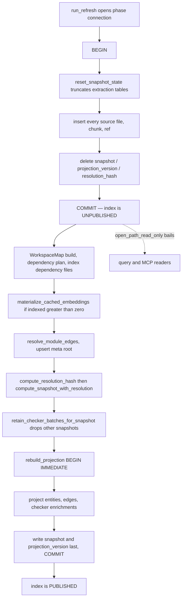
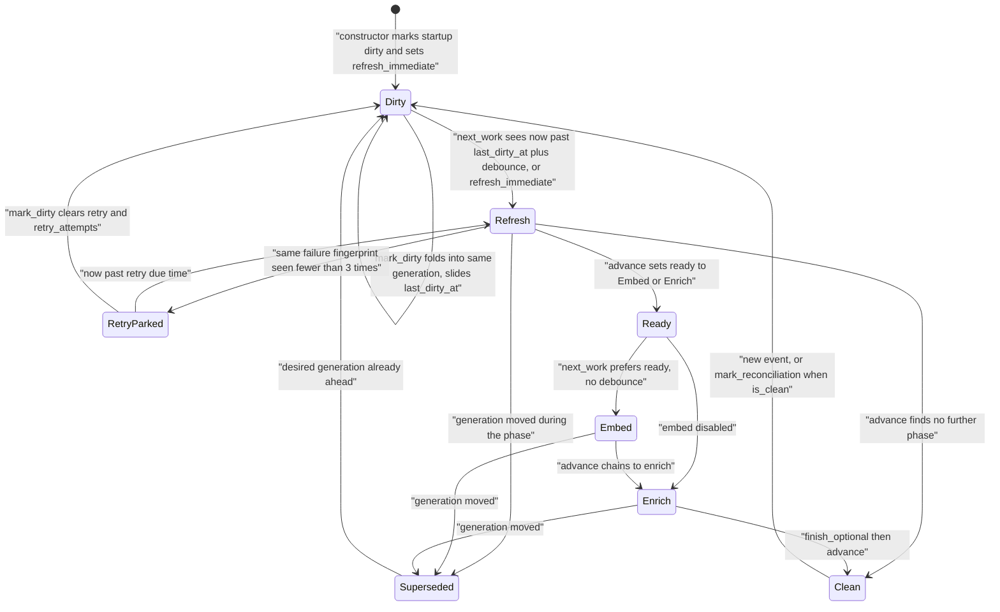
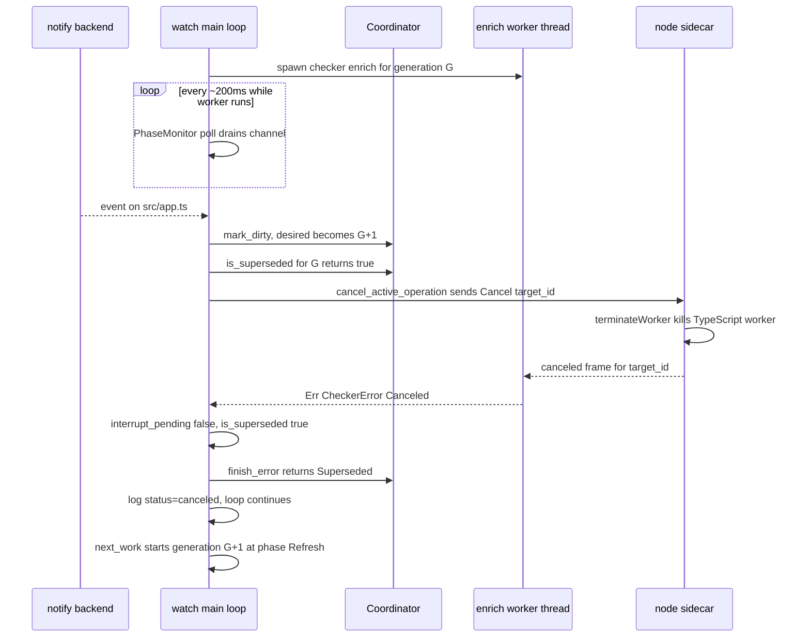

# Incremental indexing and the file watcher

`jscout watch` keeps an index database in step with a working tree by converting raw `notify` filesystem events into a monotonically numbered sequence of *generations*, each running a full re-index followed by optional embedding and TypeScript-checker enrichment phases. There is no per-file incremental reindex on this path: a generation truncates every extraction-derived table and refills it from disk. What makes that affordable is not diffing but scheduling — a hand-rolled debounce that folds bursts of edits into one generation, an integer generation stamp that lets a newer edit preemptively cancel an older generation's in-flight work, and a publication gate that makes the database unreadable for the whole window in which it is inconsistent rather than exposing a partially rebuilt graph.

## The watch path never diffs

`run_refresh` (`src/watch.rs:784-801`) opens its own connection and calls `indexer::refresh_repo_with_options`, which is hard-wired to `IndexMode::FullRefresh` (`src/indexer.rs:150-156`). Inside `index_repo_impl`, that mode does two things. First, it skips loading the `existing` file map entirely (`src/indexer.rs:204-206`), leaving an empty `HashMap` so every file on disk looks new. Second, it forces `extraction_reset = true` regardless of the hash-clearing heuristic (`src/indexer.rs:233-235`), which routes to `store::reset_snapshot_state` (`src/store.rs:954-965`).

`reset_snapshot_state` calls `reset_extraction_state` (`src/store.rs:916`) and additionally deletes `package_instances` and the `root`/`snapshot`/`projection_version`/`resolution_hash` meta rows. `reset_extraction_state` clears vector rows, then issues one `execute_batch` of `DELETE FROM` statements ordered children-before-parents (`src/store.rs:921-942`) so foreign-key enforcement only ever checks already-emptied tables; `chunks_fts` is `DROP`ped and recreated rather than deleted from. The doc comment (`src/store.rs:904-915`) gives the reason: cascading `store::delete_file` through tens of thousands of files re-scans the large evidence tables and the FTS index once per file, whereas truncate-and-refill keeps a forced re-index at fresh-index cost.

The genuinely incremental algorithm still exists — the `existing` hash map, `store::delete_file` per changed file, the `seen` set that catches disappeared files (`src/indexer.rs:263-303`) — but only reachable through `index_repo_with_options` and the `#[cfg(test)]` `index_repo_without_extraction_reset` (`src/indexer.rs:129-175`), which survive as a differential oracle proving the wholesale reset produces the same database as historical per-file replacement.

What *is* incremental is the layer beneath. The content-addressed embedding cache and semantic memory (`scout_*`, `semantic_*`) are not touched by the reset and are rematerialized by `crate::embed::materialize_cached_embeddings`, gated on `outcome.indexed > 0` (`src/indexer.rs:334-336`). Checker batches whose `source_snapshot` matches the recomputed snapshot survive via `store::retain_checker_batches_for_snapshot`, which is itself conditional on `mode == IndexMode::FullRefresh` (`src/indexer.rs:346-350`, `src/store.rs:967-973`) — true for every watch refresh, but not an unconditional step of the indexer. `workspace::WorkspaceMap::build` is stateless and re-derived from disk each refresh (`src/indexer.rs:329`), so there is no workspace cache to invalidate.

The cost of this design is unavoidable and visible: watch latency scales with repository size, not with change size. The `ProjectionIdentity` fast path that would let an unchanged repository republish its existing projection rows (`src/indexer.rs:358-382`) can never fire under `watch`, because the reset deliberately zeroes `previous` to all-`None` (`src/indexer.rs:310-318`) — the rows it would republish were wiped. That fast path exists for the manual `jscout index` command only.

## The unpublished window

Consistency is enforced by making the index unreadable while it is being rebuilt, not by careful ordering of partial writes. One transaction opens at `src/indexer.rs:237` and commits at `src/indexer.rs:327`, spanning the truncate, every file/chunk/ref insert, and a `DELETE FROM meta WHERE key IN ('snapshot','projection_version','resolution_hash')` (`src/indexer.rs:323-326`). On the full-refresh path that explicit `DELETE` is redundant — `reset_snapshot_state` already removed those rows — and is load-bearing only for the incremental path.

Readers open through `store::open_path_read_only`, which queries for the existence of both `snapshot` and `projection_version` and bails with `has no published structural snapshot; run \`jscout index\`` when either is missing (`src/store.rs:84-98`). Everything after the COMMIT is therefore allowed to fail without exposing a stale or half-built graph: workspace rebuild, dependency discovery/planning/`synchronize_instances`, dependency file indexing, cached-embedding rematerialization, `resolve_module_edges`, the `meta('root')` upsert, and snapshot computation (`src/indexer.rs:329-345`). The markers are republished only as the last two statements inside `rebuild_projection`'s `BEGIN IMMEDIATE` block (`src/structural.rs:445`, `:542-551`).

This diagram traces one refresh generation; note where the index stops being readable and where it becomes readable again.

Every node between `F` and `N` runs against a database no reader can open. `K` protects retained checker facts: it deletes every batch whose `source_snapshot` differs from the newly computed one *before* `L` can publish anything, so a failed projection cannot leave stale checker edges reachable. The tradeoff: there is no read-your-last-good-snapshot mode, so queries and MCP clients get hard failures during every watch generation rather than stale-but-consistent reads.

One consequence of `K` deserves its own note. A full refresh truncates and re-inserts `member_calls`, so its rowids are reassigned even when the snapshot hash is byte-identical. `project_checker_enrichments` therefore joins retained checker facts on source path plus source hash plus six call/receiver/property offsets (`src/structural.rs:2128-2148`), with `enrichment.member_call_id` used only as the key into the coverage map, and filters on `batch.active=1 AND batch.source_snapshot=?1` (`src/structural.rs:2129-2131`). Six equality predicates with no supporting index is the price; before commit `7c98074` the join keyed on `call.rowid` and silently dropped every retained fact on every watch generation.

## Admission control: which events count

Every event flows through `EventClassifier::classify` (`src/watch.rs:343-380`), which maps a batch of paths to at most one reason string and short-circuits on the first match. The precedence order encodes the policy.

| Order | Test | Result |
|---|---|---|
| 1 | Path is the database or its `-wal`/`-shm`/`-journal` sibling (`src/watch.rs:323-336`) | skipped — this is what stops the watcher re-triggering on its own writes |
| 2 | Path is a git control (`.gitmodules`, resolved `.git/HEAD`) | `git:<rel>` |
| 3 | Path is a registered external exact target or under an external prefix | `external:<abs>` |
| 4 | `is_noise`: any component in `node_modules`, `.git`, `dist`, `build`, `.next`, `coverage`, `out` (`src/watch.rs:1030-1043`) | skipped |
| 5 | `is_relevant`: `walk::is_indexable`, or `package.json`, four lockfiles, `tsconfig*.json`/`jsconfig*.json`, `.gitmodules`, `*.d.ts`/`.d.mts`/`.d.cts` (`src/watch.rs:1005-1028`) | `source:<rel>` |
| 6 | Path is not an existing regular file | sets `saw_uncertain` → `unknown-event` |
| — | Empty path list | `unknown-event` |
| — | `notify` error instead of an event (`src/watch.rs:906-909`) | `watch-error:<error>` |

Rule 3 running before rule 4 is the only reason an edit to an explicitly selected dependency under `node_modules/pkg` registers at all; a test covers exactly that (`src/watch.rs:1394-1409`). Rule 6 is a deliberate fail-open: `notify` cannot report the type of something that no longer exists, so a delete, a rename, or a backend rescan all force a rebuild rather than being dropped, while existing regular files with irrelevant extensions are safe to ignore precisely because their existence proves they are not deletes. The cost is that directory renames and any transient path trigger a full rebuild — combined with the full-refresh cost, the main source of wasted work.

Two details in the filter read oddly. `is_relevant` calls `walk::is_indexable`, which explicitly returns `false` for `.d.ts`/`.d.mts`/`.d.cts` (`src/walk.rs:12-16`), then adds those suffixes back with its own check (`src/watch.rs:1025-1027`) — declaration files are not indexed but do change checker project ownership. And `is_noise` duplicates `walk::SKIP_DIRS` (`src/walk.rs:8`) without quite matching it: `is_noise` also excludes `.git`, which `SKIP_DIRS` omits, and nothing enforces the relationship. `git_control_paths` (`src/watch.rs:1045-1072`) resolves `.git` through the worktree `gitdir:` indirection when `.git` is a file, then watches `HEAD` under the resolved directory; it is computed once at classifier construction (`src/watch.rs:332`) and never refreshed, so a worktree switch leaves the HEAD watch pointed at the old gitdir until restart.

## The Coordinator state machine

`Coordinator` (`src/watch.rs:73-311`) holds all scheduling policy and is pure: no `Instant`, no filesystem, no database. The driver supplies monotonic `Duration` values and executes the `Work` it returns, which is what lets the scheduling tests run instantly and deterministically (comment at `src/watch.rs:70-72`). `Work { generation: u64, phase: Phase }` is `Copy`, and the generation stamp is the entire cancellation mechanism — every `finish_*` method begins with `if work.generation != self.desired_generation { return Superseded }` (`src/watch.rs:216-218`, `:243-245`, `:252-254`).

`mark_dirty` (`src/watch.rs:119-141`) implements coalescing with one predicate: `desired_generation` increments only if it already equals `completed_generation` (the cycle is finished) or the current desired generation already has `active`/`ready`/`retry` work attached. Otherwise the event merely slides `last_dirty_at` and adds a reason. Either way it clears `ready`, `retry`, `retry_attempts`, `cycle_snapshot`, `cycle_degraded`, and sets `refresh_immediate = false`. So N edits arriving during the debounce window all fold into one queued generation and push the deadline out; an edit arriving while a generation is executing creates G+1 and instantly supersedes G.

`next_work` (`src/watch.rs:149-190`) is the dispatcher. It returns `None` if anything is active; drops `ready`/`retry` belonging to a stale generation; then prefers `ready` (phase chaining, no debounce), then a due `retry`, then fresh `Refresh` work gated by `now >= last_dirty_at + debounce` unless `refresh_immediate` is set. `refresh_immediate` is set exactly twice: by `Coordinator::new` after its synthetic `mark_dirty(0, "startup")` (`src/watch.rs:114-116`), and by `mark_reconciliation` (`src/watch.rs:143-147`).

`Ready` is not a waiting state in the debounce sense — `next_deadline` returns `Duration::ZERO` whenever `ready` or `active` is set (`src/watch.rs:192-199`), so the next loop iteration picks it up immediately. The `RetryParked → Dirty` transition matters: an event during a backoff wait cancels the parked retry outright, because `mark_dirty` clears `retry` and `retry_attempts` unconditionally. `Superseded` is not a state the coordinator sits in; it is the value `finish_*` returns after `clear_active`, and the loop falls through to `next_work`, which starts the newer generation. Backoff itself is per phase: `schedule_retry` (`src/watch.rs:261-276`) increments a `BTreeMap<Phase,u32>` counter and computes `500ms << (attempts-1)`, capped at 30 s.

## Degraded generations

Partial refreshes get separate treatment from hard errors. `failure_fingerprint` (`src/watch.rs:987-1002`) blake3-hashes the sorted `path\0stage\0error` triples from `IndexOutcome::failures`. `finish_refresh` (`src/watch.rs:219-236`) compares it against `stable_failure`: the guard is `if repeats < STABLE_FAILURE_THRESHOLD` with the threshold at 3, so the first and second identical fingerprints schedule retries (500 ms then 1 s) and the **third** sets `cycle_degraded` — two retries, not three.

Degrading does not stop anything. `finish_refresh` falls through to `advance(work)`, so Embed and Enrich still run and `completed_generation` still advances; `degraded` only changes the final word of the completion log line, `watch generation=N status=degraded` (`src/watch.rs:936-942`). `stable_failure` deliberately survives `mark_dirty`, so a permanently unreadable file costs the two retries once rather than every generation (`src/watch.rs:1310-1340`). The corresponding hazard: a transient failure producing the same fingerprint three times — a file briefly locked by a build tool — is prematurely declared permanent, and only a *different* failure, a success, or a periodic reconciliation clears it.

## The interruptible-phase pattern

Refresh is uninterruptible. It is one bounded transaction plus a projection rebuild, and abandoning it midway would leave the index unpublished with no obvious recovery point. Embed and Enrich each spend unbounded time outside the process — network calls to an embedding provider, TypeScript program construction in the sidecar — so both are worth preempting.

Both use the same shape (`src/watch.rs:803-829`, `:831-868`). The phase body moves to a `thread::spawn`ed worker with its own database connection from `open_phase_database` (5 s busy timeout, `src/watch.rs:959-967`); the main thread loops `while !worker.is_finished()`, calling `monitor.poll()`, checking `monitor.is_superseded()`, then sleeping `OPTIONAL_PHASE_POLL` (100 ms). `PhaseMonitor::poll` (`src/watch.rs:879-894`) does a `recv_timeout(100ms)` on the notify channel followed by a full `drain_events`, so events arriving during a long phase are classified and folded into the coordinator while the worker runs. Because `poll` itself blocks up to 100 ms and is *then* followed by a 100 ms sleep, the supersession check runs at worst about five times a second, not ten. Embed delivers the cancel by flipping an `Arc<AtomicBool>` that `embed::embed_missing_interruptible` reads at each provider batch boundary, returning `(done, total, canceled)` (`src/embed.rs:702-705`), guarded only by `debug_assert!(!canceled || coordinator.is_superseded(work))` at `src/watch.rs:649`; Enrich calls `checker::process::cancel_active_operation()`, which reaches into the sidecar.

The ordering invariant that makes this safe differs between phases, and the difference is easy to miss. For Refresh, `drain_events` must run *after* the phase returns and *before* `finish_refresh` — the second call at `src/watch.rs:600` — or an edit landing during the refresh would fail to supersede it, publishing an index that does not match disk with no follow-up generation queued. Embed and Enrich have no post-phase drain; they rely on `PhaseMonitor` having drained continuously plus the fact that `finish_optional` only sets `ready`, and `next_work` discards a `ready` belonging to a stale generation at the top of the next iteration (`src/watch.rs:153-158`).

## Checker cancellation semantics

Before commit `7c98074`, `cancel_active_operation` was an alias for `request_interrupt_cancellation`, so a watcher-initiated cancel set the same global bit as an operator SIGINT. Two things broke: the enrich error handler in `watch()` checks `interrupt_pending()` and returns `Ok(())` to shut the process down, so a rapid edit during enrichment killed `jscout watch`; and `handle_interrupt` calls `std::process::exit(130)` when `request_interrupt_cancellation` returns false (`src/checker/process.rs:155-159`), so a watcher cancel silently consumed the operator's first Ctrl-C. The fix splits process-global state into three atomics inside one `CancellationFlags` static (`src/checker/process.rs:25-69`).

| Flag | Set by | Read by |
|---|---|---|
| `interrupt` | operator SIGINT via `request_interrupt_cancellation` (`src/checker/process.rs:161-166`) | `interrupt_pending()` — `watch()` keys process shutdown off this alone |
| `operation` | `cancel_active_operation` (`src/checker/process.rs:179-192`), never by SIGINT | `cancellation_pending()` (union with `interrupt`) — `enrich` keys work abortion off this |
| `operation_delivered` | `mark_operation_cancel_delivered` after a Cancel frame lands | `cancel_active_operation`, to stop re-sending |

`operation_delivered` is a delivery latch, not a suppression flag. `cancel_active_operation` is polled roughly five times a second while the enrich worker runs; `CheckerControl::cancel_active` returns `Ok(false)` when no request id is registered (`src/checker/process.rs:129-142`), so the cancel frame is retried until it lands on an in-flight request and only then latched — which stops it spamming `Cancel` frames at the per-project sidecars that `execute_project` keeps re-registering. `begin_interrupt_scope` (`src/checker/process.rs:197-201`) installs the Ctrl-C handler and *then* resets all three flags, once per top-level enrich pass, called at `src/checker/enrich.rs:206`.

`enrich` polls `cancellation_pending()` at three points: each project boundary (`src/checker/enrich.rs:339`), before activation (`src/checker/enrich.rs:394`), and inside `project_was_interrupted` when classifying a project error (`src/checker/enrich.rs:445`). All three bail with "staged work retained", so an interrupted pass resumes rather than restarts, backed by `completed_occurrences`/`reset_project_staging`/`mark_project_pending` (`src/checker/enrich.rs:344-355`) and `project_complete_and_fresh`, which re-hashes every recorded tsconfig input.

The `terminateWorker` step is real preemption, not cooperative polling: `main.mjs` runs TypeScript in a worker thread precisely so `case "cancel"` can kill a blocking program construction and emit `canceled` for the target id (`checker/src/main.mjs:114-124`). The Rust side turns that into `CheckerError::Canceled`, and `receive_for` skips the stray `cancel_result` frame while waiting for it (`src/checker/process.rs:466-473`) — discarding the sidecar's `active` boolean with `let _ = (target_id, active);`, so Rust relies only on whether `cancel_active` found a registered request id. Terminating loses all in-memory program state for that project; the staging-batch and per-project-resume design is what makes redoing it acceptable.

The three-way triage at `src/watch.rs:714-740` is what the split flag model buys: `interrupt_pending()` true logs `interrupted` and returns `Ok(())`; otherwise `is_superseded(work)` logs `canceled` and lets the next generation proceed; otherwise `finish_error` schedules a backoff retry. A fourth case is not distinguished: a partial enrich (`!failed_projects.is_empty()`, `src/checker/enrich.rs:397-406`) calls `activate_staging_batch(…, allow_failed_projects=true)` and `rebuild_projection` — publishing the batch — and *then* bails, so the watcher logs `status=failed` and schedules a retry for a generation whose projection was already successfully republished. Against a concurrent index change, `activate_staging_batch` re-reads `current_snapshot` inside `BEGIN IMMEDIATE` and aborts if it moved (`src/checker/enrich.rs:1626-1630`), so an out-of-band refresh during enrichment fails closed.

Ctrl-C handling is entirely checker-owned. `install_interrupt_handler` runs only from `begin_interrupt_scope` and `register_interrupt_control`, so without `--enrich` the watcher has no SIGINT handler and dies on default semantics. Even with `--enrich`, `handle_interrupt` exits 130 unless `cancel_active_request()` actually reached a registered sidecar, so Ctrl-C during a Refresh or Embed phase kills the process rather than draining to the `interrupt_pending()` return path.

## External watch targets and reconciliation

The root is watched recursively before any indexing happens (`src/watch.rs:501-507`), so events during a long first pass queue in the unbounded channel rather than being lost. Everything *outside* the root goes through `WatchRegistry::reconcile` (`src/watch.rs:420-481`), which filters targets with `!target.watch_path.starts_with(root)` — the recursive root watch already covers in-root paths, and double-watching would duplicate events. `WatchTarget` splits `watch_path` (what `notify` is told to watch) from `path` (what the classifier matches): for exact-file targets the watch path is the *parent* directory, because most backends cannot watch a single file reliably and a file that does not yet exist cannot be watched at all. `reconcile` unwatches removed paths, upgrades `NonRecursive` to `Recursive` on a mode conflict by unwatch-then-rewatch, and counts per-path failures — after three the log says `degraded` instead of `retrying`, but retries continue on every reconcile and nothing marks the cycle degraded for lost coverage (`src/watch.rs:464-477`).

`collect_watch_targets` (`src/watch.rs:1093-1139`) starts from `git_watch_targets(root)`, adds a recursive `Prefix` target on each dependency `package_instances.canonical_root` plus an exact target on `root/locator`, and adds exact targets for `checker_project_inputs` rows of the *active* batch whose resolved path falls outside the root. It opens through `store::open_path_read_only`, so it fails whenever the index is unpublished — on a first run, or mid-rebuild — and the caller falls back to git targets alone (`src/watch.rs:519`). With `--enrich`, `Checker`-sourced targets from the previous cycle are carried across a refresh (`src/watch.rs:583-595`) so tsconfig coverage survives the window before enrichment republishes them.

Periodic reconciliation (`--reconcile-seconds`, default 600) recovers from missed notifications and degraded external coverage. `next_reconcile` starts as `None` (`src/watch.rs:526`) and is re-armed only in `report_finish` on `FinishState::Complete` (`src/watch.rs:936-944`), anchoring the timer to generation *completion* rather than process start or timer fire — the explicit reason (`src/watch.rs:523-525`) is that a long generation would otherwise fire the timer immediately on completion and create a back-to-back refresh loop. The main loop takes it only when `coordinator.is_clean()` (`src/watch.rs:545-548`). That guard has a side effect: when the deadline comes due while a retry is parked, the reconciliation is neither taken nor rescheduled, so `deadline` stays in the past and the idle branch spins on `recv_timeout(1ms)` (`src/watch.rs:748-757`) until the cycle completes.

`validate_options` (`src/watch.rs:771-782`) rejects a zero debounce and a non-zero `reconcile_interval <= debounce`, which would schedule reconciliations that can never start; the enrich-timeout check is conditional on `options.enrich_on_change`, so a zero timeout is accepted when `--enrich` is off. The full flag inventory is in [the CLI document](10-cli-and-mcp.md) (`src/main.rs:363-391`). One flag has startup-order significance: `--embed` builds the provider at `src/watch.rs:493-499`, before the watcher is registered, so a missing or invalid `JSCOUT_EMBED_PROVIDER` fails immediately rather than mid-generation.

## Test coverage and what it does not reach

All watcher tests are inline in `src/watch.rs:1189-1493`. Seven drive the pure `Coordinator` — startup immediacy and phase ordering, supersession during refresh, bounded backoff with exact 500 ms/1 s assertions, the degraded rule and its survival across generations, reconciliation timing, and coalescing. Four cover the classifier and relevance filters; one covers option validation. One end-to-end database test, `refresh_phase_replaces_the_complete_file_set` (`src/watch.rs:1475-1492`), indexes `a.ts`, deletes it, adds `b.ts`, refreshes, and asserts `SELECT path FROM files` yields exactly `['b.ts']` — proving deletion propagates through the full-refresh path. The cancellation fix has two unit tests: `watcher_cancellation_is_distinct_from_operator_interrupt` exercising `CancellationFlags` directly (`src/checker/process.rs:609-625`), and the `member_call_id` perturbation assertion inside `checker_facts_project_per_occurrence_without_replacing_member_hubs` (`src/structural.rs:4924-4946`).

Nothing exercises `watch()` itself. The driver loop, the `notify` integration, the ordering of `drain_events` relative to `finish_refresh`, `PhaseMonitor`, `WatchRegistry::reconcile`, and both interruptible wrappers are untested; no test asserts that a real filesystem event produces a generation. Most conspicuously, the exact scenario `7c98074` was fixing — an event landing mid-enrichment, the sidecar receiving a `Cancel`, `enrich` bailing with staged work retained, the watcher logging `canceled` rather than `interrupted`, and the next generation proceeding — is verified only by its two constituent unit tests, never end to end.

Several rough edges follow from that gap. `Coordinator::cycle_snapshot` is dead state: assigned at `src/watch.rs:235`, cleared at `:139` and `:294`, never read — the refresh snapshot string is threaded through `finish_refresh`'s signature purely to be stored and discarded. `clear_active` uses a `debug_assert_eq!` (`src/watch.rs:256-259`), so in release builds a mismatched finish would silently clear the wrong active slot. The classifier's `external_prefixes` check uses `path.starts_with(prefix)` against `package_instances.canonical_root` taken verbatim from the database, so a dependency root whose canonical form differs from the path `notify` reports gets misclassified as `node_modules` noise and dropped. And `watch()` returns `Ok(())` on channel disconnect (`src/watch.rs:760`, `:766`), so a dead notify backend is indistinguishable from a clean shutdown: no error, no log line.

Related reading: [ingestion](02-ingestion.md) for what a refresh actually walks and parses, [storage schema](05-storage-schema.md) for the tables the reset truncates, [sidecars](09-sidecars.md) for the full checker protocol, and [sharp edges](17-sharp-edges.md) for the cross-subsystem risk inventory.
