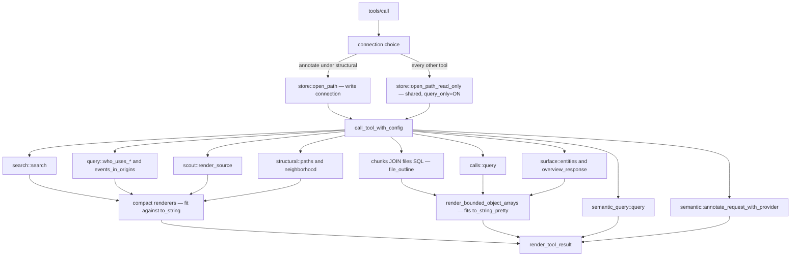
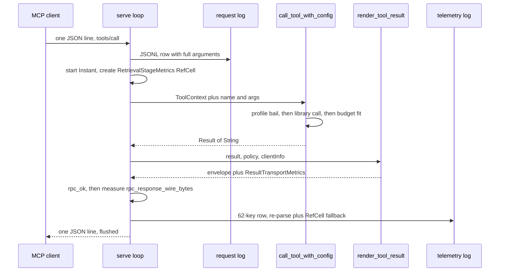

# The MCP surface

`jscout mcp` turns a built index into a stdio server that agents talk to over newline-delimited JSON-RPC 2.0. It exposes twelve tools — search, usage, definition, outline, events, call sites, entities, graph paths, repository overview, semantic memory, annotation writes, and neighborhood traversal — each with a published JSON Schema, each fitted to an explicit response byte budget, and each gated by a two-value tool profile. The server exists because the retrieval work in [06-semantic-layer.md](06-semantic-layer.md) and [07-retrieval.md](07-retrieval.md) is only useful if an agent can reach it without shelling out, and because every response has to fit a context window that the agent, not the index, owns. Almost all of it lives in one file: `src/mcp.rs` is 2,055 lines, with 23 tests split out into `src/mcp/tests.rs`.

## Transport and framing

`mcp::serve` (`src/mcp.rs:145-152`) takes the repository root, a database path, optional telemetry and request-log paths, a `ServeOptions` struct (`src/mcp.rs:50-55`), and a borrowed `config::RuntimeConfig`. Its prologue canonicalizes the root, hashes the running executable with blake3 into a `binary_fingerprint` (`src/mcp.rs:158-159`, `1880-1896`), opens the index through `store::open_path_read_only` (`src/mcp.rs:160`), and builds retrieval machinery from configuration rather than from the environment: `embed::Provider::from_settings` and `search::Reranker::from_settings` both read `runtime.effective.{embedding,inference,reranker}` (`src/mcp.rs:161-167`). Provider construction is fallible and aborts `serve` on error; the reranker is a plain `Option` and simply stays absent. Telemetry and request-log files are opened create+append, and `collect_telemetry` is set iff a telemetry file was configured (`src/mcp.rs:168-188`).

`open_path_read_only` is stricter than its name suggests (`src/store.rs:53-98`). It refuses a missing file, sets `foreign_keys=ON` and `query_only=ON`, then applies three further hard checks: `meta.schema_version` must be readable, must equal `SCHEMA_VERSION`, and both `meta.snapshot` and `meta.projection_version` must exist. A half-written or schema-drifted database fails at startup with an actionable message instead of producing wrong answers per call.

Framing is one JSON value per input line and one flushed JSON value per output line (`write_msg`, `src/mcp.rs:380-385`). Blank lines are skipped. An unparsable line produces `-32700 parse error: …` with a null id and is *not* written to the request log, because logging happens after `serde_json::from_str` succeeds. Any message with a null `id` whose method begins with `notifications/` is consumed with no response. `request_sequence` increments before the notification check (`src/mcp.rs:196-220`), so the request log preserves true arrival order across notifications and unknown methods alike.

| Method | Result | Notes |
| --- | --- | --- |
| `initialize` | `protocolVersion`, `capabilities.tools`, `serverInfo`, `instructions` | Echoes the client's requested `protocolVersion`, defaulting to `"2025-06-18"`; never validated or negotiated |
| `ping` | `{}` | |
| `tools/list` | `{ "tools": [...] }` | Array from `tool_defs(profile)`, wrapped in an object (`src/mcp.rs:264`) |
| `tools/call` | tool-result envelope | Dispatches, renders, then logs |
| anything else | `-32601 method not found: <m>` | |

## What `initialize` advertises

The `initialize` result is the server's whole self-description, and it is deliberately verbose. Beyond `name` and `version`, `serverInfo` carries `binaryFingerprint`, `configurationFingerprint` (`runtime.fingerprint`), the resolved `database` path, a `configuration` block of `{path, loaded, reload: "restart-required"}`, a `retrievalDefaults` block echoing the effective `vector`/`rerank`/`memory`/`expansion`/`expansionMode`/`limit`/`responseBytes`, and a `resultTransport` block of `{policy, selected, textFallback}`. The `instructions` field is a long, profile-specific prose payload from `server_instructions` (`src/mcp.rs:472-481`) that tells the agent when to reach for `repository_overview` versus `semantic_memory`, what `workspace` and `repository` mean in an origin filter, and that semantic bodies are quoted repository data rather than instructions. That blob is a real part of the contract: it is the only place the tool-selection policy is stated.

`reload: "restart-required"` is honest about a limitation. Configuration is read once in the prologue and the binary fingerprint is hashed once; nothing in `serve` re-reads `.jscout.toml` or reopens the index. A client that notices `configurationFingerprint` changing between sessions is the only drift detector there is.

## Result transport

`ResultTransportPolicy` is `auto | text | structured`, parsed from `mcp.result_transport` (default `auto`, `src/config/load.rs:794-811`) or the `--result-transport` flag (`src/cli.rs:215-237`). Only `parse` is public; `resolve` takes `self` by value and returns the private `AppliedResultTransport` (`src/mcp.rs:75-83`, `87-100`). `Auto` upgrades to structured **only** when `clientInfo.name == "codex-mcp-client"` and the version is at least 0.147.0 (`src/mcp.rs:117-124`; `version_at_least` at `129-143` strips a `-prerelease` suffix and requires all three numeric components to parse). MCP publishes no capability bit for structured tool results, so the choice can only be inferred from identity — and the inline comment says the pairing was verified against a paired live probe. The cost is that every other client, including future ones that do support `structuredContent`, stays on text until someone edits the allowlist and rebuilds.

`render_tool_result` (`src/mcp.rs:405-470`) re-parses the tool's own rendered string. On success in structured mode it emits both `content[0].text` — the original string, not double-encoded — and `structuredContent` holding the parsed value, so a client that ignores one sees an identical payload in the other. If the string is not JSON it silently downgrades to text and sets `structured_parse_failed`. The duplication is measured, not hidden: `mcp_fallback_text_bytes` and `mcp_tool_result_wire_bytes` in telemetry are roughly a factor of two apart whenever structured transport is applied. This is the G20b structured-content compatibility experiment; PLAN.md is explicit that no aggregate byte claim is made before the fixed and staged replays run (`PLAN.md:2267-2275`).

## Tool inventory

Every tool returns a single JSON string that becomes the text content. `debug: true`, where accepted, bypasses the compact renderer entirely and returns raw diagnostic JSON on a different (or absent) budget path — the same tool name yields a materially different shape.

| Tool | Required input | Notable optional input | Profile | Backing call | Rendered shape |
| --- | --- | --- | --- | --- | --- |
| `semantic_search` | `query` | `limit`, `file_roles`, `origins`, `vector`, `rerank`, `include_memory`, `memory_{limit,depth,nodes}`, `expand`, `expand_mode`, `expand_{depth,seeds,paths,nodes,edges,bytes,min_confidence,file_roles}`, `response_bytes`, `debug` | both (schema narrowed under baseline) | `search::search` | `compact::search_string`: `{snapshot, retrieval?, default_match, hits[], semantic_memory?, graph?, response?}` |
| `who_uses` | `symbol` xor `anchor` | `snapshot`, `origins`, `response_bytes` (24000), `debug` | both | `query::who_uses_in_origins` / `who_uses_anchor_in_origins` | `{usage_fields, targets[], response{…}}`, plus `resolution` in anchor mode |
| `definition` | `symbol` xor `anchor` | `snapshot`, `origins`, `view`, `source_bytes` (12000), `response_bytes` (24000), `debug` | both | chunk lookup + `scout::render_source` | `{definitions[], response{…}}` (`src/compact.rs:685`) |
| `file_outline` | `path` | `origins`, `response_bytes` (24000) | both | direct `chunks JOIN files` SQL | `{outline[], response_budget{…}}` |
| `events` | — | `name`, `origins`, `response_bytes` (min 1) | both | `query::events_in_origins` | `{events[], response_budget{…}}` |
| `calls` | `method` | `args`, `arg_position`, `receiver`, `origins`, `limit` (200), `response_bytes` | both | `calls::query` | `calls::` result with `matches[]` bounded |
| `entities` | — | `query`, `planes`, `types`, `roles`, `file_roles`, `origins`, `limit` (20), `occurrences_per_entity` (8) | structural | `surface::entities` | result with `entities[]` bounded |
| `paths` | `from`, `to` | `snapshot`, `max_depth` (4), `path_limit` (8), `node_limit` (200), `edge_limit` (800), `direction`, `min_confidence`, `kinds`, `file_roles` | structural | `structural::paths` | result with `paths[]` bounded |
| `repository_overview` | — | `area_limit`, `relation_limit`, `include_semantic`, `semantic_{limit,types}`, `reconnaissance_{limit,subject,detail}` | structural | `surface::overview_response` | pretty-printed library result; budget applied inside `surface` |
| `semantic_memory` | — | `query`, `artifact`, `view`, `anchor`, `file`, `reconnaissance_subject`, `related_to`, `types`, `freshness`, `supports_per_artifact`, `source_*`, `debug` | structural | `semantic_query::query` | pretty-printed library result; budget applied inside `semantic_query` |
| `annotate` | `type`, `confidence`, `snapshot` | `name`, `participants`, `body`, `supports`, `supersedes` | structural, **write** | `semantic::annotate_request_with_provider` | pretty-printed publication; **no byte budget at all** |
| `neighborhood` | `anchor` | `snapshot`, `depth`, `direction`, `node_limit`, `edge_limit`, `min_confidence`, `kinds`, `file_roles`, `origins`, `response_bytes`, `debug` | structural | `structural::neighborhood` | `compact::render_neighborhood`, or `["edges","nodes"]` bounded under `debug` |

`semantic_memory`'s `view` selector is the G20a compact-artifact projection: broad calls return handles, `view=body` returns the complete body plus one evidence locator, `view=full` returns provenance, hashes, and relations. `supports_per_artifact` is not a flat default any more — it resolves to 1 for compact/body exact reads and 8 otherwise (`src/mcp.rs:1353-1364`). `semantic_search` gained `expand_mode` (`paths` | `neighborhood`) and `expand_paths`, making a ranked path forest the default expansion projection rather than raw fan-out.

The compact search projection also carries the G17 exact-identifier tier outward. `search::MatchReason` is `exact_definition | exact_occurrence | hybrid` (`src/search.rs:337-343`); the response declares `default_match: "hybrid"` once (`src/compact.rs:63`) and each hit carries a `match` field only when its reason differs (`src/compact.rs:214-216`), plus an optional `matched_identifiers` array (`src/compact.rs:217-219`). A hit promoted by exact-identifier intent is therefore distinguishable from one the reranker produced, at the cost of two bytes per ordinary hit and nothing when the whole result set is hybrid.

The diagram below maps `tools/call` onto the modules it reaches. Look for the connection split at the top — one shared read-only handle serves eleven tools, and only `annotate` gets a second, write-capable one — and for the two byte-budget paths at the bottom.

`SEMQ` and `SEMW` bypass both budget helpers: `semantic_memory` and `repository_overview` enforce their limits inside the library (`src/mcp.rs:1338`, `1416`), and `annotate` has no limit at all (`src/mcp.rs:1418-1428`). `SURFACE` appears on both sides of that split because `entities` is bounded by the MCP helper while `overview_response` is not.

## Profile gating

`ToolProfile` is `Baseline | Structural`, default `structural` (`src/mcp.rs:20-41`, `src/config/load.rs:794`). Baseline exists to give evaluation A/B arms a smaller surface, and gating happens in four places that must be kept in sync by hand.

1. **Advertise.** `tool_defs`'s `retain` drops `entities`, `paths`, `repository_overview`, `semantic_memory`, `neighborhood`, and `annotate` from the published list (`src/mcp.rs:782-798`).
2. **Narrow.** It also deletes fourteen `semantic_search` properties — the four memory knobs and ten `expand*` knobs — from the advertised `inputSchema` (`src/mcp.rs:799-822`).
3. **Enforce.** Each structural tool arm `bail!`s before touching the database for a client that ignores the schema: `entities` at 1241, `paths` at 1271, `repository_overview` at 1314, `semantic_memory` at 1341, `annotate` at 1419, `neighborhood` at 1431. `expand: true` under baseline bails inside `search_options_from_args` (`src/mcp.rs:835-837`).
4. **Degrade silently.** `include_memory` and `include_neighborhood_followups` are computed as `profile == Structural && …` (`src/mcp.rs:856-859`, `874`), so a baseline caller passing `include_memory: true` gets no error and no memory.

The asymmetry between (3) and (4) is deliberate but undocumented in the schema: `expand` is loud, `include_memory` is quiet, so a shared agent prompt that always sets `include_memory` stays runnable across both arms while an expansion request — which would change the answer shape — fails visibly.

`annotate` is the only write. When `tools/call` names it under the structural profile, `serve` opens a second connection with `store::open_path` for that one call and discards it afterwards (`src/mcp.rs:270-293`). The inline comment states the intent: keep schema writes and SQLite writer locks out of every retrieval-only session. Two consequences follow. `store::open_path` runs `journal_mode=WAL`, `synchronous=NORMAL`, a legacy-schema rebuild if versions differ, and `init_schema` — so the first `annotate` of a session performs schema writes and can flip journal mode. And `log_tool_call` still queries the *read-only* handle for its snapshot fallback (`src/mcp.rs:320`), not the connection the call actually used.

## Arguments, defaults, and the configuration layer

`search_options_from_args` (`src/mcp.rs:827-921`) folds `config::SearchSettings` in as the default layer, which is why almost no `semantic_search` property carries a schema `default` and every description reads "omit to use repository configuration". `configured_origins` (`src/mcp.rs:1581-1587`) and `json_string_array_or` (`src/mcp.rs:1569-1579`) distinguish an absent key (use configuration) from a present one (use the array, even if empty). One binary can then honor per-repository retrieval policy without lying in its published schema — but an agent reading `tools/list` cannot tell what `limit` or `response_bytes` it will actually get. The effective values appear only in `initialize`'s `retrievalDefaults`.

Argument reading is total and silent. `args["limit"].as_u64().unwrap_or(default)` means a stringified `"200"`, a float, or a misspelled key all collapse to the default with no diagnostic. `json_string_array` (`src/mcp.rs:1556-1567`) filters non-string elements, so `["repository", 3]` silently becomes `["repository"]`. The advertised JSON Schemas — including `annotate`'s `allOf`/`if`-`then` and `additionalProperties: false` — are never validated against accepted arguments; the only real enforcement is `serde_json::from_value::<semantic::AnnotateRequest>` (`src/mcp.rs:1422`), which at least produces a long remediation message showing the complete expected workflow object.

Per-tool byte defaults are inconsistent. `semantic_search` and `file_outline` fall back to `search::DEFAULT_RESPONSE_BYTE_LIMIT` (24,000) or to configuration, while `events` (`src/mcp.rs:1213`), `calls`, `entities`, `paths`, `repository_overview`, `semantic_memory`, and `neighborhood` all hard-code the literal `24_000`. They agree today only because the constant happens to be 24,000.

## Byte budgeting

Two families coexist. Array-bearing tools go through `render_bounded_object_arrays` (`src/mcp.rs:1593-1645`, now `pub(crate)` and reused by the CLI neighborhood renderer at `src/commands/core.rs:56`). It bails immediately on a zero limit, injects a `response_budget{byte_limit, rendered_bytes, unbudgeted_bytes, truncated, omitted_items}` envelope, settles the self-referential `rendered_bytes` (`settle_value_rendered_bytes`, `src/mcp.rs:1647-1656`), records the pre-truncation size as `unbudgeted_bytes`, then loops: each iteration pops **one** item — `fields.iter().any(…pop()…)` short-circuits on the first named array that still has items — mirrors a top-level `truncated` flag if the payload has one, updates `omitted_items`, and re-settles. When nothing remains to pop it fails with the envelope's minimum size.

The compact renderers in `src/compact.rs` are the second family and fit against `to_string`, not `to_string_pretty`. The same `response_bytes` therefore buys materially different amounts of content depending on which tool was called. `who_uses_string` binary-searches the retained usage prefix and bails at `src/compact.rs:392`; `definition_string` sheds whole targets, then truncates the single remaining source and stamps `source_meta.budget_truncated`, bailing at `603`, `608`, and `613`; `render_neighborhood` bails at `996`. A budget too small to hold the envelope is a hard error everywhere, never a degraded answer — the argument being that an agent should learn its budget is wrong rather than silently receive a stub.

Exact-anchor calls reserve envelope room before fitting. `symbol_content_byte_limit` (`src/mcp.rs:1539-1554`) subtracts the serialized resolution plus 64 bytes and bails below 256; `attach_symbol_resolution` (`src/mcp.rs:1508-1537`) splices `resolution` back in and re-settles `response.rendered_bytes`. All of these settle loops cap at eight iterations and return the last value without asserting convergence, so `rendered_bytes` is a bounded best-effort number, not a guaranteed fixed point — a pathological document can report a size that disagrees with its own serialized length.

## Telemetry, request logging, and error surfacing

Two JSONL streams, with opposite privacy properties. `log_request` (`src/mcp.rs:345-378`) writes one row per parsed incoming message — `{timestamp_ms, sequence, session, task, profile, method, tool, arguments}` — where `arguments` is the complete, unredacted tool input including natural-language queries. `log_tool_call` (`src/mcp.rs:1675-1878`) writes a 62-key row per tool call (`src/mcp.rs:1808-1871`) containing no queries and no result payloads: version and fingerprints, client name and version, transport policy and applied transport, the four wire-byte counters, source and expansion and semantic-artifact counts, retrieval stage statuses, seven duration fields, and the canonical section-byte breakdown. Both stamp `JSCOUT_SESSION_ID` (default `pid-<pid>`) and `JSCOUT_TASK_ID`. Both also stamp `profile` from `JSCOUT_PROFILE_LABEL` when it is set, which means the request log's `profile` is an evaluation label, not necessarily the MCP profile; telemetry carries the true value separately as `tool_profile` (`src/mcp.rs:1817`).

Telemetry field sourcing is now two-channel. Payload-shape numbers are extracted by re-parsing the server's own rendered text (`definition_source_metrics`, `expansion_role_metrics`, `semantic_artifact_metrics`, and direct `value["retrieval"][…]` reads), which means a response-shape change silently degrades those fields to zeros rather than failing. Stage timings and statuses cannot be recovered that way because the compact projection omits them, so `RetrievalStageMetrics` (`src/mcp.rs:936-954`) is threaded as a `RefCell` through `ToolContext` and filled by the `semantic_search` and `semantic_memory` arms; every `retrieval_*` field reads `parsed.or_else(|| in-process)`. One field is measurement-only: `name_only_usage_occurrences` runs an extra `refs` scan per hit and is computed solely when a telemetry file is configured, so it is unrecoverable after the fact in any untelemetered session.

Tool failures never become JSON-RPC error objects. An `Err` is rendered as a *successful* result whose single text content is `error: {error}` with `isError: true` (`src/mcp.rs:445-458`), because MCP clients feed tool errors into the model's context while protocol errors read as transport faults and are usually hidden. The price is that unknown tool names, profile-gate rejections, too-small byte budgets, empty-origin validation failures, and genuine internal errors are indistinguishable at the protocol layer.

The sequence below traces one `tools/call` from line to line. Look at where the request log is written — before dispatch and before the notification check — and at `rpc_response_wire_bytes`, which can only be filled after the response is framed.

Note the ordering constraint the diagram makes visible: telemetry is written *after* the response value exists but *before* it is put on the wire, so `log_tool_call` can measure the framed size while still re-parsing the same rendered string the client will receive.

## Configuration and flags

| Surface | Flag | Config key | Default | Environment override |
| --- | --- | --- | --- | --- |
| Tool profile | `--profile` | `mcp.profile` | `structural` | none |
| Definition source view | `--source-view` | `mcp.source_view` | `full` | none |
| Result transport | `--result-transport` | `mcp.result_transport` | `auto` | none |
| Telemetry path | `--telemetry` | `telemetry.file` | unset | `JSCOUT_TELEMETRY_FILE` (legacy) |
| Request-log path | `--request-log` | `telemetry.request_log` | unset | none |
| Database path | `--database` | resolved database | `ROOT/.jscout.db` | — |

All four MCP-shaping flags are `Option<String>` with no clap default (`src/cli.rs:215-237`), so the `Command::Mcp` arm can fall back to configuration (`src/commands/mod.rs:336-367`), and `parse` validation happens once at construction. The three `mcp.*` keys pass `None` for `env_name` in the resolver (`src/config/load.rs:794-811`), so unlike much of the rest of the configuration described in [12-configuration.md](12-configuration.md) they have no legacy environment fallback at all. The request log, notably, can be enabled by configuration alone — a repository's `.jscout.toml` can start recording every query an agent sends.

## What the tests do not cover

All 23 tests in `src/mcp/tests.rs` call internal functions directly through a `#[cfg(test)]` `call_tool` shim (`src/mcp.rs:2025-2052`) that builds a `ToolContext` with default search settings, no reranker, and telemetry off. They cover schema shape assertions, the baseline retain list and the fourteen stripped properties, runtime bails for a schema-bypassing client, config-defaults-versus-explicit-argument resolution, transport resolution across four client identities, structured/text/error rendering including the parse-failure fallback, request-log row contents, byte budgets on six tools, an `annotate` write followed by structural-versus-baseline retrieval, follow-up round trips, and the three telemetry extractors.

Nothing drives the stdio JSON-RPC loop. The `-32700` path, notification dropping, `-32601`, the `protocolVersion` echo, the `serverInfo` block, the lazy write-connection branch, and `log_tool_call`'s full 62-key record are all untested, and no test validates a `tools/call` payload against the schema the server itself published. Given that the schemas are documentation rather than enforcement, that last gap is the one that matters most: a schema and its arm can drift apart without any test noticing.
