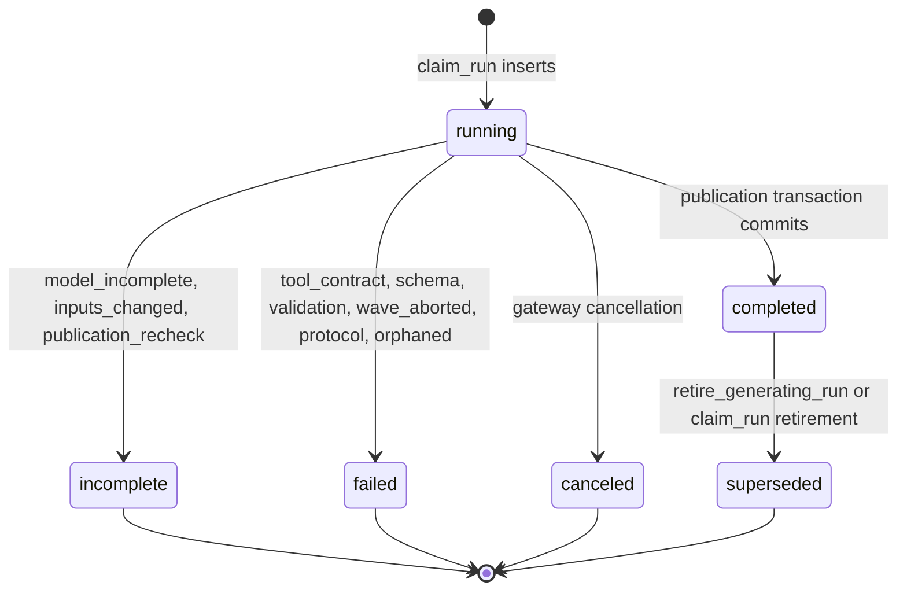
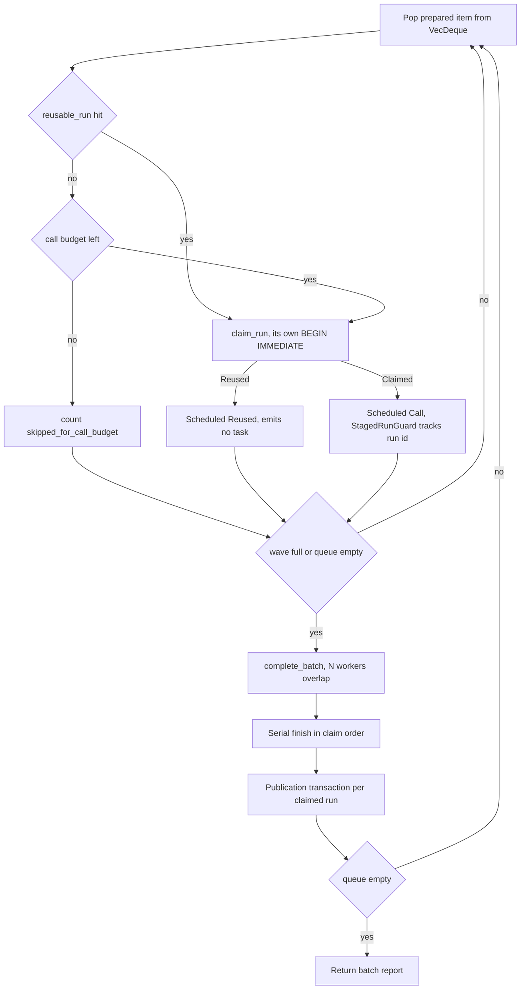
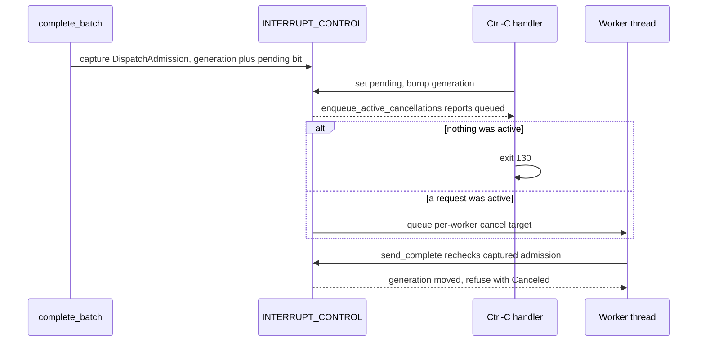

# Scouting: LLM-derived semantic artifacts

Scouting is the only part of jscout that calls a language model, and it is built so the model can decide but never invent. A deterministic planner produces a candidate set from the index; a preparation step renders a byte-stable evidence pack and a submit-tool JSON Schema that literally enumerates the legal anchors; a run ledger claims the exact inputs under a partial unique index before any request leaves the process; Rust validates the response twice; and publication rechecks its own inputs inside `BEGIN IMMEDIATE` before an artifact, its supports, its classifications, and the run's terminal transition commit together. The recent change is that model calls can now overlap: `llm.max_concurrency` (default 1) turns each family's straight-line loop into a wave loop where up to N provider waits run in parallel on a pool of one-request child processes, while every claim, validation, and publication stays serial on the single SQLite connection.

## The five families and where their output lives

All five share the skeleton — plan, prepare, claim, dispatch, validate, publish — but differ in subject identity, closure rule, and persistence.

| Family | Contract module | `scout_kind` | Prompt version | Published as |
| --- | --- | --- | --- | --- |
| Workflow | `src/scouting/workflow.rs` | `workflow` | `workflow-scout/v1` (`src/scouting/workflow.rs:15`) | `semantic_artifacts` type `workflow` plus `semantic_supports`; `relations` is `&[]` (`mod.rs:1882`) |
| Card | `src/scouting/card.rs` | `card` | `card-scout/v1` (`card.rs:16`) | type `card`, per-claim supports; `relations` is `&[]` (`mod.rs:2186`) |
| Summary | `src/scouting/summary.rs` | `summary` | `summary-scout/v1` (`summary.rs:17`) | type `summary` plus `semantic_relations` rows (`mod.rs:3184`) |
| Concept | `src/scouting/concept.rs` | `concept` | `concept-scout/v1` (`concept.rs:21`) | type `concept` plus `related_to` relations (`mod.rs:2568`) |
| Repository recon | `src/scouting/repository.rs` | `repository` | `repository-recon/v2` (`repository.rs:30`) | immutable `repository_classifications` (`src/store.rs:951`), projected into `repository_current_classifications` and `repository_file_policy` |

The first four write into the semantic graph and participate in supersession lineage. Repository reconnaissance does not: its rows are policy metadata, immutable, keyed by a snapshot-free `evidence_fingerprint` covering exact subject membership plus selected content, so a classification survives a disposable snapshot rebuild (`store.rs:947-971`).

## Candidate closure

`src/scouting/mod.rs:1-6` states the rule the whole subsystem exists to enforce: "The model cannot add anchors: candidate expansion is a Rust change, not model improvisation." Closure is encoded twice. In the request, the synthetic submit tool's schema pins the anchor field to `"enum": anchors` (`workflow.rs:58`), so a schema-respecting provider cannot emit an unknown participant. In validation, the same set is rechecked: concept candidate sources are looked up in a `known` map and an unrecognized source bails with "the model cannot add children" (`concept.rs:695-700`); summary claims must cite planned children (`summary.rs:250-288`). Schema-level closure is an optimization; the Rust check is the guarantee.

Evidence is equally deterministic. `EvidencePack` (`src/scouting/evidence.rs:21`) renders line-numbered source with entity annotations and depth-1 structural context, and keeps a `BTreeMap<path, FileEvidence{hash, line_count}>`. The rendered text is hashed into the input fingerprint, so it must be byte-deterministic (`evidence.rs:1-3`, tested at `evidence.rs:232-237`); `line_count` bounds every span the model returns; `hash` is what publication rechecks.

Before a request is fingerprinted it must fit. `reserve_output_and_measure` (`mod.rs:3517`) sets `max_tokens` to `2048 + 512 * output_units` capped by the gateway-reported `capabilities.max_tokens`, then measures the serialized request. `enforce_context_budget` (`mod.rs:3532`) refuses it against `--context-bytes`, and, when a context window is reported, against `request_bytes + output_tokens` — using UTF-8 byte length as the input token ceiling because pi-ai exposes no common tokenizer (`mod.rs:3549-3552`). That is deliberately conservative and can refuse a request that would have fit. The dry-run reports call the same arithmetic, which is why plan output and real enforcement cannot drift.

## Fingerprints, the ledger, and reuse

Four fingerprint functions (`mod.rs:3567`, `:3606`, `:3340`, `:3376`) hash the rendered pack, prompt version, model spec, reasoning, service tier, resolved `base_url`, `PROTOCOL_VERSION`, the reserved `max_tokens`, the tool schema, and the system prompt. Only the workflow fingerprint also hashes the structural snapshot and the candidate-set fingerprint (`mod.rs:3577-3579`). Card, summary, and concept fingerprints are snapshot-free on purpose (`mod.rs:3599-3603`): their pack already pins the exact content they depend on, so an unrelated edit elsewhere in the repository reuses the completed run instead of buying an identical artifact again. The cost is that reuse can hand back an artifact whose recorded `source_snapshot` is older than the current one; freshness computation, not reuse, is what surfaces that.

`ledger::claim_run(conn, spec, rebuild)` (`src/scouting/ledger.rs:72`) owns its own `BEGIN IMMEDIATE` — callers must not hold a transaction. It first retires any completed run whose artifact already gained a successor, covering the A→B→A case where a stale row would otherwise both block the slot and satisfy reuse (`ledger.rs:76-89`). With `rebuild` set it supersedes the completed run and never returns `Reused`, which is why every wave site pairs `!options.rebuild && reusable_run(...)` with the claim (`mod.rs:646-647`). Otherwise `reusable_run` (`ledger.rs:179`) admits a completed run whose artifact is still current **or** which recorded no artifact at all — refusing the second case would leave the unique in-flight slot occupied with no way to claim a replacement (`ledger.rs:174-178`).

The concurrency control is one index, not a lease:

```sql
CREATE UNIQUE INDEX idx_scout_runs_active
  ON scout_runs(scout_kind, input_fingerprint)
  WHERE status IN ('running', 'completed');
```

(`store.rs:941-943`.) A second live claim on the same inputs hits a constraint violation and `claim_run` bails with "another … scout run is already in progress" (`ledger.rs:129-135`). This holds across processes, which is why every failure path must reach a terminal state: a stranded `running` row blocks its inputs until `sweep_orphaned_runs` retires it, and every entry point calls that sweep with a 24-hour threshold first (`mod.rs:38`, `ledger.rs:255`).

Look at which transitions leave the index and which do not:



Only `running` and `completed` occupy the unique slot, so `incomplete`, `failed`, `canceled`, and `superseded` all release the fingerprint for a later attempt. `superseded` is the one status never produced through `RunOutcome` (`ledger.rs:41-46` has four variants); it is set by raw `UPDATE`s in `claim_run` and `retire_generating_run` (`ledger.rs:199-207`) and is admitted by the table's `CHECK` (`store.rs:920-922`). `finish_run` only transitions from `running` and errors otherwise (`ledger.rs:218-224`), so a double terminalization is loud.

## Two layers of validation

Layer one is family-local and decides whether the model met its contract. `workflow::validate` (`workflow.rs:161`) enforces candidate closure, at least one defining participant, evidence spans inside the pack's line counts, and mutual exclusivity of refusal and classification. `card::validate` (`card.rs:209`) requires a supported purpose, per-claim evidence, list caps, case-insensitive de-duplication, and a 10 KB body cap; its bounded repair is ordered carefully — `claim()` rejects more than `MAX_RANGE_REPAIR_INPUT` ranges outright, every submitted range is checked against the source file, and only then does `repair_claim` truncate to `MAX_RANGES_PER_CLAIM` (`card.rs:398-430`). An out-of-range citation past the cap therefore fails the whole card rather than being silently dropped. `concept::validate` (`concept.rs:277`) enforces NFKC-normalized alias closure over enumerated spellings and exact per-source citation.

Layer two is `semantic::validate_annotate_input` (`semantic.rs:646`), shared with the `annotate` command. It checks snapshot currency, supersede-type legality and that the target is not already superseded, artifact-versus-support confidence ordering, that every `claim_path` other than `/name` resolves in the body (`semantic.rs:691-696`), exact current anchors, anchor-to-file agreement, on-disk hash equality with the index, and span bounds.

The two layers route failures differently, and that asymmetry is the design. Layer-one failures are the model's fault: the run is recorded `failed` with `tool_contract`, `schema`, or `validation`, a subject-local report is returned, and the batch continues. Layer-two failures mean the repository moved under the run: `publish_terminal` records `incomplete/inputs_changed` — classifications and the terminal transition in their own transaction (`mod.rs:3642-3655`) — and then returns `Err`, aborting the command. A moving repository is not something the next subject will survive either.

## Publication

Each `finish_claimed_*` opens `BEGIN IMMEDIATE` and rechecks its inputs *inside* the write transaction rather than trusting preparation-time state. Workflow rechecks the structural snapshot and every evidence file's hash against the `files` table (`mod.rs:1861-1880`); summary rechecks exact child fingerprints and the complete expected child set (`mod.rs:3121`); concept rechecks the child set cardinality (`mod.rs:2543-2550`) and then the lineage against the predecessor pinned before the call (`mod.rs:2551-2559`). Only then does `persist_validated_artifact` run — deliberately without transaction control (`semantic.rs:789`) — followed by `retire_generating_run`, `record_classifications`, and `finish_run(Completed)`. Any bail rolls back and records `incomplete/publication_recheck`, which is also batch-fatal.

Two details qualify the "one transaction or none" story. First, one ledger write happens outside it: after the call returns, a bare `UPDATE scout_runs SET billing_path=?` records the gateway-authoritative billing path (`mod.rs:1737-1740` and three parallel sites). Second, the one-successor rule is backed by a database index as well as by in-transaction lookups — `idx_semantic_artifacts_one_successor` on `semantic_artifacts(supersedes_artifact_id)` (`store.rs:1072-1074`) — so a concurrent publisher would hit a constraint violation rather than forking the lineage.

Subject identity resolution is not uniform. Card and summary resolve their supersede target inside the publication transaction (`mod.rs:2167-2181`, `:3163-3177`). Concept resolves it *before* the model call in `claim_prepared_concept` (`mod.rs:2297-2312`), pins it into `PreparedConcept::planned_predecessor`, and the transaction only rechecks equality and bails on drift. The reason is stated in the code: a same-name concept published while the model is running is not an implicit predecessor. `current_concept_for_key` also hard-errors when two current lineages normalize to the same key, demanding an explicit validated merge (`mod.rs:2656-2660`) — the "at most one current concept" invariant is enforced by refusing to proceed, not by picking one.

## Staleness and refresh

`scout refresh` selects current, non-fresh, model-generated artifacts and reconstructs each one's recorded replay configuration from `scout_runs.config_json` (`src/scouting/refresh.rs:61`, `:150`) — which is why `config_json` is part of `RunSpec` (`ledger.rs:21`) rather than being derived from artifact ids that may no longer be current. Targets are grouped by dependency rank: workflow and card at 0, file summary 1, module summary 2, other summaries 3, concept 4 (`refresh_rank`, `mod.rs:1421-1433`). A rank is only prepared after the previous rank has published, so a refreshed card is already current when the summary that cites it is replanned. Waves happen inside a rank; ranks never overlap. `scout_summaries` uses the same layering for fresh generation, replanning file → module → repository against what the previous level just published, under one shared `--max-calls` budget (`mod.rs:2700-2740`).

## The concurrency rework

`RequestPolicy` gained `max_concurrency`, defaulted to 1 by `RequestPolicy::new` (`src/llm/config.rs:199`) and raised only through `with_max_concurrency`, which rejects zero (`:203`). Six call sites in `src/commands/mod.rs` (`:800, :850, :905, :944, :988, :1011`) feed it from the `llm.max_concurrency` config key. There is no upper clamp; `ProcessGatewayPool::launch` says so explicitly — "increasing concurrency is an explicit operator choice" (`src/llm/process.rs:554-557`) — which also means there is no backpressure or 429-aware throttling anywhere in the scouting layer.

Every family loop now drains a `VecDeque` in waves. Trace the fill/dispatch/finish boundary:



`DISPATCH` is the only node that overlaps. Note that `REUSE` precedes `BUDGET`: reusing a completed run costs nothing, so charging it against `--max-calls` would make budgets non-reproducible across re-runs (`mod.rs:646-651`, and the parallel sites at `:788-798`, `:938-942`, `:1371-1375`, `:2748-2753`, `repository.rs:1111-1116`). Note also that `RUSED` emits no task: only `Scheduled::Call` consumes an outcome in the finish loop (`mod.rs:683-687`), which is exactly what keeps the outcome stream aligned with the claim order.

The wave bound is `calls_in_wave < options.policy.max_concurrency` in every `mod.rs` family (`mod.rs:642`, `:783`, `:933`, `:1361`, `:2744`) — only actual model calls consume a slot. Repository reconnaissance bounds on `scheduled.len() < options.policy.max_concurrency` instead (`repository.rs:1080`), so reused and over-budget subjects consume slots there too and a mixed wave dispatches fewer than `max_concurrency` calls. Repository also differs in that `prepare` runs *inside* the fill loop rather than in a completed preparation phase (`repository.rs:1085`), because a `ContextBudgetExceeded` must subdivide the subject in place and push children to the front of the queue.

What actually overlaps is the provider wait and nothing else. `ProcessGatewayPool` holds a fixed vector of `ProcessGateway` workers, each a `node <gateway>` child speaking one-request-at-a-time JSONL over stdio; `complete_batch` chunks tasks by worker count and joins one scoped thread per worker (`src/llm/process.rs:603-641`). Keeping each child strictly one-at-a-time is what lets `receive_for` treat any out-of-order frame as a protocol error rather than a race (`process.rs:480-500`). The header comment names the constraint: overlap provider waits "without making the semantic database a concurrent-write surface" (`process.rs:46-48`). Claiming, validating, and publishing all still run on the main thread against one connection. The costs are N node processes and N handshakes, no work stealing (a chunk finishes at the pace of its slowest member), and a wave that cannot refill until every member finishes. Only `complete_batch` is concurrent, too — `capabilities` and `complete` delegate to `self.workers[0]` (`process.rs:585-601`), so preparation's capability and billing-path lookups serialize on one worker.

Ledger accounting stays correct under overlap because wave setup is still one transaction per input, and `StagedRunGuard` (`mod.rs:229`) covers the gap. It tracks each claimed `run_id`, `resolve`s it once its `finish_claimed_*` reached a terminal state, and on `Drop` writes `finish_run(Failed, error_code="wave_aborted")` for everything still outstanding (`mod.rs:256-268`). That matters because a later claim in the same wave can fail — a concept whose lineage drifted, or a competing live claim from another process — and the `?` unwinds the whole wave. Budget accounting is equally local: `model_calls` increments only on `RunClaim::Claimed`, inside the same match that tracks the guard (`mod.rs:660-662`), so an overlapping dispatch cannot double-count.

`BatchOutcomes` (`mod.rs:275`) closes the other hole. `dispatch` skips the gateway entirely when no task was claimed, `cardinality_error` turns a wrong outcome count into the wave's `first_error` (`mod.rs:282-295`), and `next_or_protocol` hands a starved claim a `GatewayError::Protocol` instead of panicking or leaving a `running` row (`mod.rs:307-313`). The finish loop retains the first error and returns it only after every scheduled item has been consumed, so no claim is left un-terminalized on the error path (`mod.rs:683-706`).

Not every gateway failure is survivable. `subject_local_gateway_failure` (`mod.rs:3842-3844`) admits exactly `GatewayError::Remote` with code `timeout` or `tool_contract`, because those carry a correlated terminal frame and leave the connection synchronized. Local frame timeouts, `Protocol`, `Io`, `ChildExited`, `Spawn`, and `Canceled` are all batch-fatal — `Canceled` records `RunOutcome::Canceled` and then returns `Err` (`mod.rs:1705-1723`). With a pool, this is coarser than it looks: one poisoned worker aborts the whole batch even though the other children's connections are fine.

## Interrupts

Ctrl-C has to distinguish "no request is in flight, just exit" from "cancel the in-flight requests". `handle_interrupt` calls `request_interrupt_cancellation` and exits with code 130 when it reports that nothing was cancelled (`src/llm/process.rs:151-155`); `enqueue_active_cancellations` returns whether any worker actually had an active request (`process.rs:107-116`). The signal thread only enqueues target ids onto per-gateway channels — a dedicated writer thread serializes `Complete` before `Cancel`, so the handler never blocks on child stdin.



The latched generation in `DispatchAdmission` (`src/llm/process.rs:77`) is what makes the last exchange work. A batch captures admission once and hands the same `Copy` value to every worker; `send_complete` refuses to dispatch when the captured `interrupted` bit is set, when `INTERRUPT_PENDING` is set now, or when the captured generation no longer matches the live one (`process.rs:449-459`). Without the generation, a worker that started late could read a cleared pending bit as permission to dispatch. `send_complete` also takes the stdin lock *before* the interrupt gate, so a cancellation queued after active-id publication cannot overtake the `Complete` frame, and the blocking pipe write happens with both global locks released (`process.rs:437-471`).

## Limits worth knowing

- Pool sizing is per-command and inconsistent. `launch_scout_gateway` computes `llm.max_concurrency.min(call_capacity.max(1))` (`commands/scout.rs:9-22`), where `call_capacity = max_calls.min(plan.items.len())` for workflows (`:48`), cards (`:155`), concepts (`:179`), and refresh (`:228`). `cmd_scout_summaries` (`:124`) and `cmd_scout_repository` (`:91`) pass `max_calls` alone, so both over-provision node children relative to the work they will actually dispatch.
- `StagedRunGuard::cleanup` ignores errors (`let _ = ledger::finish_run(...)`). If the connection is already broken, claims stay `running` until the 24-hour orphan sweep.
- If `DispatchAdmission::capture` fails on a poisoned lock, *every* task in the batch returns the same `GatewayError::Io` (`process.rs:605-615`) — a mass-failure path with no per-task diagnosis.
- The interrupt controls are process-global statics and `register_interrupt_controls` overwrites the previous registration wholesale (`process.rs:186-193`), so two live gateways or pools in one process would clobber each other's cancellation routing. The tests serialize on an `INTERRUPT_TEST_LOCK` for this reason.
- Reuse is queried once outside `claim_run` and re-resolved inside it. `claim_run` wins, so the outcome is safe, but `skipped_for_call_budget` is computed from the earlier, weaker check.
- `repository::execute` contains `if scheduled.is_empty() { continue; }` (`repository.rs:1146`); it terminates only because the fill loop always pops from the queue.

Coverage sits mostly in `src/scouting/tests.rs` (3,428 lines) against a `FakeGateway` whose `complete_batch` records batch sizes and can be told to return the wrong number of outcomes. The concurrency contracts have named tests: `remote_timeout_fails_one_subject_and_the_batch_continues` (`tests.rs:1145`) asserts both claims are `running` at dispatch time via a second connection; `later_claim_conflict_releases_an_earlier_staged_run` (`:1210`) pins the `wave_aborted` release; `malformed_batch_cardinality_terminalizes_every_claim` (`:1271`) covers both under- and over-count with zero stranded `running` rows; `local_frame_timeout_remains_batch_fatal` (`:1321`) pins the poisoning boundary. Gateway-level overlap and interrupt behavior are tested in `src/llm/process.rs` against a shell fake, all serialized on `INTERRUPT_TEST_LOCK` because the interrupt state is global.
