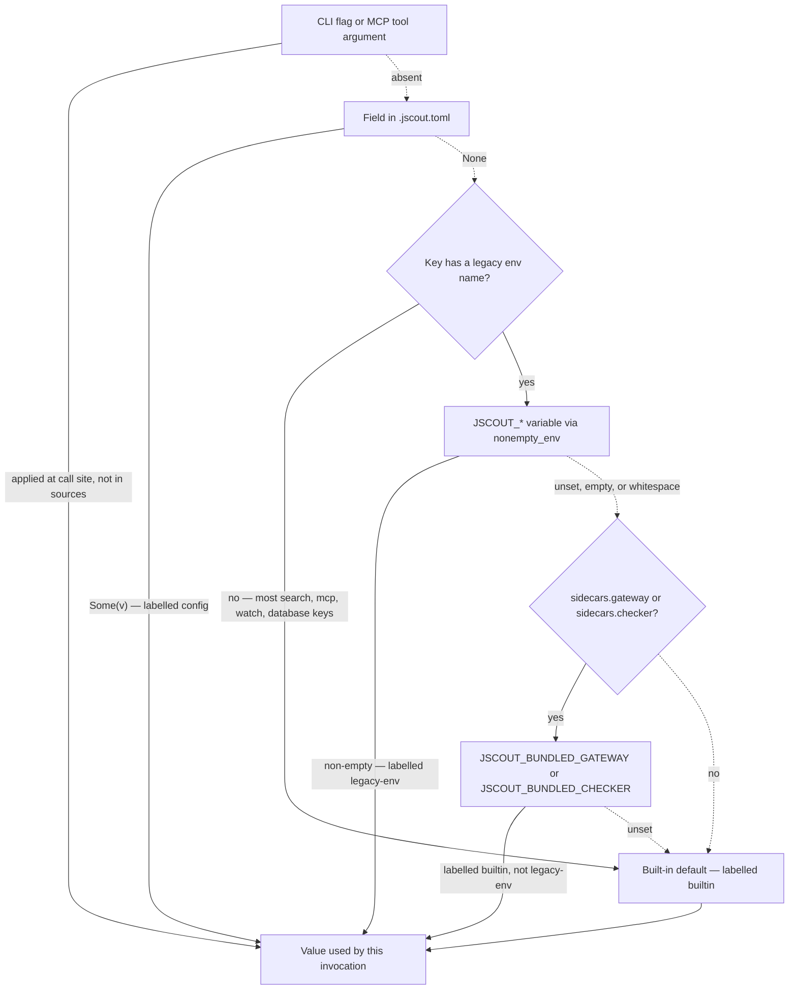
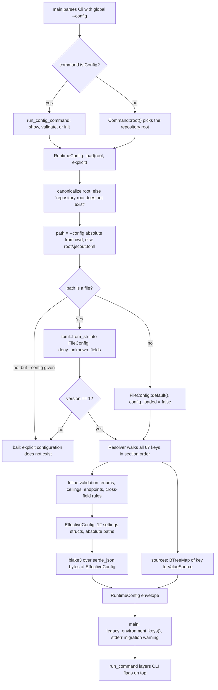
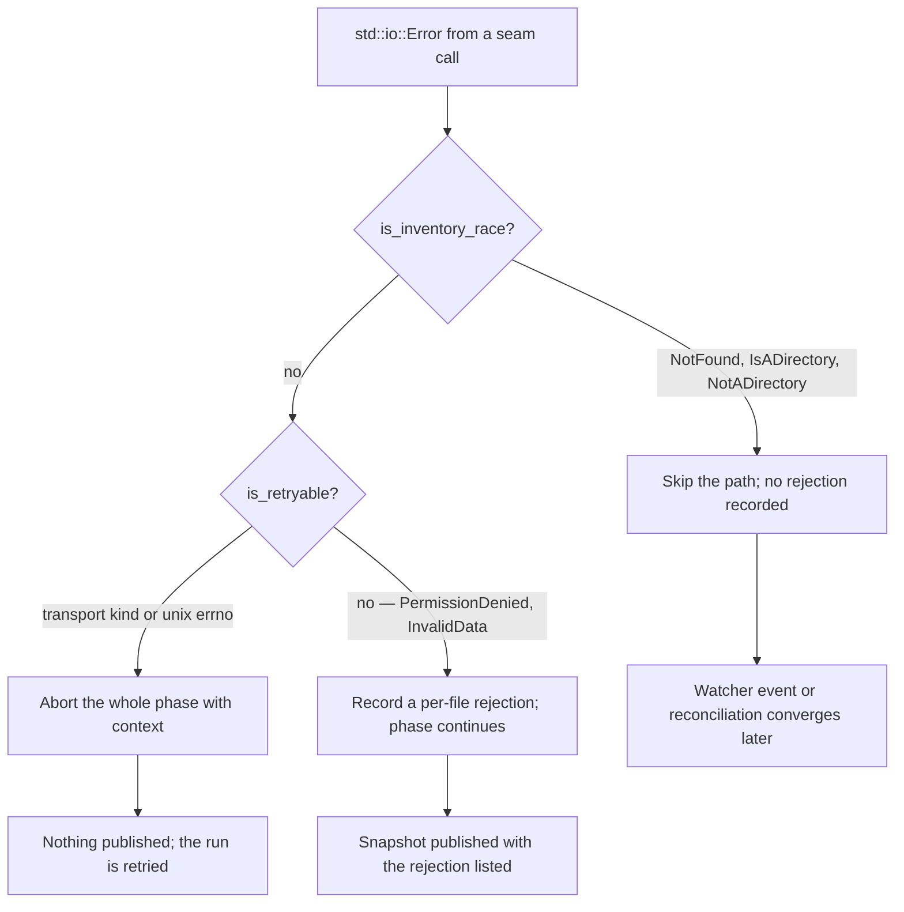

# Configuration and the I/O seam

jscout reads one repository-local TOML file, `<canonical-root>/.jscout.toml`, into a fully validated `RuntimeConfig` before any database is opened or any sidecar is spawned, and every command, the MCP server, and the watcher then read that struct as plain data. Each of the 67 dotted keys is resolved through a `Resolver` that records where the value came from — the file, a legacy `JSCOUT_*` environment variable, or a built-in default — so `jscout config show` can print provenance per key and `main` can warn about environment variables that should have been migrated. Sitting next to it is a second, unrelated seam: `io_policy` classifies `std::io::Error` into inventory-race, retryable, and permanent, `fs_ops` narrows filesystem access to four injectable methods, and `test_fs` layers one-shot faults over the real filesystem so that classification can be tested without touching production globals. Both subsystems are new; nothing in the codebase read a configuration file before the G21 work, and none of `fs_ops`, `io_policy`, or `test_fs` existed.

## Module layout

The module root is `src/config.rs` — 22 lines, no `src/config/mod.rs`. It re-exports the public types from `model`, `init` from `load`, and pins the two constants that fix the contract: `FILE_NAME = ".jscout.toml"` and `SCHEMA_VERSION = 1` (`src/config.rs:16-17`). `TEMPLATE` is `include_str!("../.jscout.toml.example")` (`src/config.rs:19`), so the binary carries the repository's own example file and `config init` writes it verbatim. Three private modules do the work: `load.rs` (1217 lines) holds the file-shaped `Deserialize` structs, the `Resolver`, `RuntimeConfig::load`, and every validator; `model.rs` (221 lines) the post-resolution types; `display.rs` (125 lines) the `config show` rendering and the legacy-key list. Tests sit in `src/config/tests.rs` (264 lines, 11 tests).

## Three type layers

The file layer is `FileConfig` plus twelve section structs (`src/config/load.rs:18-204`). Every leaf is `Option<T>` and every struct carries `#[serde(deny_unknown_fields)]`. The optionality is load-bearing: "absent" has to be distinguishable from "explicitly set to the default value", or the `sources` map could not be computed. `deny_unknown_fields` turns a typo into a load-time failure naming the file — `rerak = false` fails with the configuration path attached, asserted at `src/config/tests.rs:86-101`. `version: u32` is the only non-optional field (`src/config/load.rs:21`), and a mismatch against `SCHEMA_VERSION` is a hard error (`src/config/load.rs:361-368`).

The effective layer is the same shape with the `Option`s collapsed and paths already absolute `PathBuf`s (`src/config/model.rs:27-41`). Optionality that survives is semantic rather than "unset": `EmbeddingSettings::provider: Option<String>` means embeddings are off, and `TelemetrySettings::file: Option<PathBuf>` means telemetry is disabled — `display_optional_path` renders that as `<disabled>` (`src/config/load.rs:949-954`). `SearchSettings` and `ExpansionSettings` also carry hand-written `Default` impls (`src/config/model.rs:63-113`) restating the defaults `load` applies; MCP tests use `SearchSettings::default()` directly (`src/mcp.rs:2044`), and nothing forces the two tables to stay in sync.

The envelope is `RuntimeConfig { root, config_path, config_loaded, config_explicit, fingerprint, effective, sources }` (`src/config/model.rs:16-25`). `sources` is a `BTreeMap<String, ValueSource>` with `ValueSource::{Config, LegacyEnv, Builtin}`, serialized kebab-case so JSON shows `legacy-env` (`src/config/model.rs:8-14`). The `BTreeMap` gives deterministic key ordering in both output forms. There is no `Cli` variant — command-line and MCP argument overrides are never recorded here, which is the main reason `config show` describes the file-plus-environment layer rather than what a specific invocation will do.

## The precedence chain

Look at how many arrows skip the environment tier entirely, and at the extra `Builtin`-labelled hop that only the two sidecar keys have.

`Resolver`'s four helpers — `string`, `optional_string`, `bool`, `usize` — all walk `TOML → ENV → DEF` and stamp `sources` on whichever branch fires (`src/config/load.rs:230-339`). `configured_or` (`src/config/load.rs:217-229`) is the two-tier variant with no environment probe at all; it backs `search.file_roles`, `search.origins`, `search.expansion.file_roles`, `embedding.origins`, `index.dependencies`, and all four `watch` numeric keys. Many `string`/`bool`/`usize` calls also pass `None` for `env_name`, so the `ENVQ` branch to `DEF` is the common case, not the exception. `INT` exists because the npm launcher passes bundled sidecar paths through the environment; `optional_string_with_internal` deliberately labels those `Builtin` (`src/config/load.rs:286-290`) so an installed-package run does not print a migration warning on every invocation — at the cost of `config show` reporting `builtin` for a value that did come from the environment.

`nonempty_env` trims and treats empty or whitespace-only as unset (`src/config/load.rs:956-961`), so `JSCOUT_X=""` silently falls through to the default rather than erroring. `resolver.usize` runs `positive()` on both the configured and the environment value (`src/config/load.rs:317-339`), making every `usize` key strictly greater than zero; `configured_or` does not, which is why the `watch` zero checks are written out by hand at `src/config/load.rs:876-886`.

## Key inventory

Storage and retrieval. None of these has an environment fallback — the whole retrieval-policy surface is file-or-default.

| TOML path | Legacy env | Default |
|---|---|---|
| `database.path` | — | `.jscout.db` (`store::DB_FILE`), resolved against the root |
| `search.vector` | — | `true` |
| `search.rerank` | — | `true` |
| `search.attach_memory` | — | `false` |
| `search.limit` | — | `10` |
| `search.response_bytes` | — | `24000` |
| `search.file_roles` | — | `[]` |
| `search.origins` | — | `["repository", "workspace"]` |
| `search.memory_limit` | — | `4` (max 100) |
| `search.memory_depth` | — | `2` (max 8) |
| `search.memory_nodes` | — | `2000` (max 20000) |
| `search.expansion.enabled` | — | `false` |
| `search.expansion.mode` | — | `"paths"` |
| `search.expansion.depth` | — | `1` |
| `search.expansion.seeds` | — | `3` |
| `search.expansion.paths` | — | `8` (max 50) |
| `search.expansion.nodes` | — | `40` |
| `search.expansion.edges` | — | `120` |
| `search.expansion.bytes` | — | `24000` |
| `search.expansion.min_confidence` | — | `"likely"` |
| `search.expansion.file_roles` | — | `["production", "unknown"]` |

Embedding and the local inference service.

| TOML path | Legacy env | Default |
|---|---|---|
| `embedding.provider` | `JSCOUT_EMBED_PROVIDER` | none (embeddings off) |
| `embedding.model` | `JSCOUT_EMBED_MODEL` | `BAAI/bge-m3` (local), `voyage-code-3` (voyage), `text-embedding-3-small` (openai), else none |
| `embedding.revision` | `JSCOUT_EMBED_REVISION` | none |
| `embedding.url` | `JSCOUT_EMBED_URL` | none; only legal with `provider = "openai"` |
| `embedding.api_key_env` | — | `VOYAGE_API_KEY` / `JSCOUT_EMBED_KEY` (openai + custom url) / `OPENAI_API_KEY`, else none |
| `embedding.query_prefix` | `JSCOUT_QUERY_PREFIX` | none |
| `embedding.batch` | — | `64` |
| `embedding.origins` | — | `["repository", "workspace"]` |
| `inference.url` | `JSCOUT_INFERENCE_URL` | `client_url(host, port)` |
| `inference.host` | `JSCOUT_INFERENCE_HOST` | `127.0.0.1` |
| `inference.port` | `JSCOUT_INFERENCE_PORT` | `8792` |
| `inference.project` | `JSCOUT_INFERENCE_PROJECT` | none |
| `inference.uv` | `JSCOUT_UV` | `uv` |
| `inference.allow_remote` | `JSCOUT_INFERENCE_ALLOW_REMOTE` | `false` |
| `inference.batch_size` | `JSCOUT_INFERENCE_BATCH_SIZE` | `16` |
| `inference.max_length` | `JSCOUT_INFERENCE_MAX_LENGTH` | `4096` |
| `inference.model_cache_root` | `JSCOUT_MODEL_CACHE_ROOT` | none (tilde-expandable) |

Reranker and LLM gateway.

| TOML path | Legacy env | Default |
|---|---|---|
| `reranker.url` | `JSCOUT_RERANK_URL` | none |
| `reranker.model` | `JSCOUT_RERANK_MODEL` | `BAAI/bge-reranker-v2-m3` |
| `reranker.revision` | `JSCOUT_RERANK_REVISION` | none |
| `reranker.top` | `JSCOUT_RERANK_TOP` | `50` (config `> 100` errors; env `> 100` clamps) |
| `reranker.max_chars` | `JSCOUT_RERANK_CHARS` | `4000` |
| `llm.model` | `JSCOUT_LLM_MODEL` | `openai-codex:gpt-5.6-terra` |
| `llm.reasoning` | `JSCOUT_LLM_REASONING` | none |
| `llm.openai_base_url` | `JSCOUT_PI_AI_OPENAI_BASE_URL` | none |
| `llm.api_key_env` | — | `OPENAI_API_KEY` |
| `llm.auth_file` | `JSCOUT_PI_AI_AUTH_FILE` | `~/.pi-ai/auth.json` (tilde-expandable) |
| `llm.openai_compatible_providers` | `JSCOUT_PI_AI_OPENAI_COMPATIBLE_PROVIDERS` (JSON array) | `[]` |

Sidecars, MCP, telemetry, diagnostics, indexing, watching.

| TOML path | Legacy env | Default |
|---|---|---|
| `sidecars.node` | `JSCOUT_NODE` | `node` |
| `sidecars.gateway` | `JSCOUT_PI_AI_GATEWAY`, then `JSCOUT_BUNDLED_GATEWAY` as builtin | none (tilde-expandable) |
| `sidecars.checker` | `JSCOUT_CHECKER_SIDECAR`, then `JSCOUT_BUNDLED_CHECKER` as builtin | none (tilde-expandable) |
| `mcp.profile` | — | `structural` (or `baseline`) |
| `mcp.source_view` | — | `full` (or `elided`) |
| `mcp.result_transport` | — | `auto` (or `text`, `structured`) |
| `telemetry.file` | `JSCOUT_TELEMETRY_FILE` | none (disabled) |
| `telemetry.request_log` | — | none (disabled) |
| `diagnostics.timing` | `JSCOUT_TIMING` | `false` |
| `diagnostics.debug` | `JSCOUT_DEBUG` | `false` |
| `index.dependencies` | — | `[]` |
| `watch.embed` | — | `false` |
| `watch.product` | — | `false` (requires `watch.embed`) |
| `watch.dependencies` | — | `[]` |
| `watch.enrich` | — | `false` |
| `watch.enrich_timeout_seconds` | — | `300` |
| `watch.debounce_ms` | — | `2000` |
| `watch.reconcile_seconds` | — | `600` |

Three of these 67 keys are stamped outside the `Resolver` helpers: `embedding.api_key_env` by hand (`src/config/load.rs:570-582`), `inference.port` inside `resolve_port` (`src/config/load.rs:1003-1028`), and `llm.openai_compatible_providers` inside `resolve_compatible_providers` (`src/config/load.rs:1130-1132`). The invariant that every key gets exactly one entry is not merely tidy — `load` indexes `resolver.sources["inference.host"]` (`src/config/load.rs:649`) and `resolver.sources["reranker.top"]` (`src/config/load.rs:692`) directly, so a missing entry would panic.

## The load pipeline

Trace the two exits on the left — `Config` subcommands never reach the warning node — and note that the fingerprint is computed from `EFF` alone, after `SRC` has already been filled in.

`MAIN` dispatches at `src/main.rs:52-54`; `RCC` is `src/commands/mod.rs:25-53`, and because it is reached before the warning node, `config show`, `config validate`, and `config init` never print the migration warning even though the first two do load a `RuntimeConfig`. `ROOT` is `Command::root()` (`src/commands/mod.rs:57-86`), which returns `Some(".")` for `llm` and `inference`, `Some(root)` for `checker doctor`, and `None` for `agent-guide` without `--install`. `PICK` has no parent-directory search and no file merging (`src/config/load.rs:350-353`): a nested checkout cannot silently inherit an outer repository's model, database, or telemetry policy, and `--config` selects one explicit file rather than starting a chain. The cost is that there are no user-level or org-level defaults; every repository repeats its own policy. `--config` is `global = true` (`src/cli.rs:15`) and is the only path resolved against the process cwd (`absolute_from_cwd`, `src/config/load.rs:1106-1111`) rather than against the canonical root.

`RC` reaching `RUN` is the point where the configuration stops being a file and becomes a per-process constant. `run_command` binds `let configured_database = runtime.effective.database.path.as_path()` (`src/commands/mod.rs:154`) and every arm layers its flags on top.

## Validation

Validation happens inline during resolution, before a database is opened or a sidecar spawned, and it fails closed. Closed enums bail with their allowed set: `search.expansion.min_confidence` against `certain | likely | possible` (`src/config/load.rs:412-414`), `search.expansion.mode` through `search::ExpansionProjection::parse`, the three `mcp.*` keys (`src/config/load.rs:794-810`), and `embedding.provider` through `normalize_provider`, which lowercases and maps `""`/`none` to `None` (`src/config/load.rs:1031-1039`). Ceilings are re-checked after `SearchSettings` is built (`src/config/load.rs:512-532`). `validate_endpoint` (`src/config/load.rs:1041-1056`) rejects query strings, fragments, non-`http(s)` schemes, missing authority, and embedded `user@` credentials; it applies to `inference.url`, `embedding.url`, `reranker.url`, `llm.openai_base_url`, and every compatible-provider `base_url`. `validate_string_list` (`src/config/load.rs:992-1001`) rejects empty and duplicate entries in the two dependency lists.

Cross-field rules are the interesting part. `embedding.url` is legal only with `provider = "openai"` (`src/config/load.rs:561-563`). A non-loopback `inference.host` requires `allow_remote = true` — but only when the host came from the file: the guard is gated on `resolver.sources["inference.host"] == ValueSource::Config` (`src/config/load.rs:649-656`), so `JSCOUT_INFERENCE_HOST=0.0.0.0` bypasses the Rust check entirely and the Python service's own `JSCOUT_INFERENCE_ALLOW_REMOTE` check becomes the only guard. `watch.product` requires `watch.embed`, and `watch.reconcile_seconds` must exceed `watch.debounce_ms` or be zero (`src/config/load.rs:873-886`); those same two conditions are re-checked after CLI flags are applied (`src/commands/mod.rs:562-575`) with different error text. `reranker.top > 100` is a hard error from the file but silently clamped to 100 from the environment, with a comment preserving the historical env behavior (`src/config/load.rs:691-697`) — one key, two behaviors, discoverable only by reading the loader.

Compatible providers get their own pass. `normalize_compatible_provider_files` (`src/config/load.rs:1145-1167`) defaults `name` to `id`, `reasoning` to `false`, `context_window` to `131072`, and `max_tokens` to `32768`; `validate_compatible_providers` (`src/config/load.rs:1169-1217`) enforces unique provider ids, unique model ids within a provider, at least one model, non-zero limits, non-empty `api_key_env`, and endpoint safety. The TOML form accepts snake_case with camelCase aliases (`src/config/load.rs:134-156`) while the legacy environment form is a JSON array with camelCase keys — the two surfaces are not spelled identically.

The claim that all validation lives in `load` is not quite true. `load` validates the *config layer* only. CLI overrides of the three MCP enums are parsed in the command arm (`src/commands/mod.rs:362-364`), and the search ceilings are re-checked at query time because MCP and CLI arguments bypass `load` entirely (`src/search.rs:1030-1046`, `src/search.rs:2159-2171`).

## `config show`, `config validate`, `config init`

`config show` prints either `show_json` — `serde_json::to_string_pretty(self)` over the whole envelope, `sources` included (`src/config/display.rs:7`) — or `show_text`, a line-oriented digest of root, config path and loaded state, fingerprint, database, search, embedding, inference, reranker, llm, mcp, and sidecars, followed by a `sources:` block listing every `key: source` pair (`src/config/display.rs:11-114`). The text form buries telemetry `file` and `request_log` inside the `mcp:` line rather than giving them their own entries (`src/config/display.rs:94-101`). `config validate` prints only the path and fingerprint (`src/commands/mod.rs:36-47`) — its value is the exit code and the error message. `config init` writes `TEMPLATE` with `OpenOptions::create_new(true)` (`src/config/load.rs:918-939`), so an existing file is a hard "refusing to overwrite" error; `src/config/tests.rs:185-198` asserts the emitted template round-trips through `load`. `init` canonicalizes the root but takes an explicit `--config` path from the cwd, so `jscout config init /repo --config rel.toml` writes relative to the process cwd, not to `/repo`.

## The fingerprint

`load` serializes `EffectiveConfig` to JSON and hashes the bytes with blake3 (`src/config/load.rs:904-905`). Only the effective values are hashed — `sources`, `config_path`, `config_loaded`, and `config_explicit` are excluded, so relabelling a key from `config` to `legacy-env` without changing its value leaves the hash alone. The hash is stamped into the MCP `initialize` response as `configurationFingerprint` (`src/mcp.rs:237`) and into every telemetry row as `config_fingerprint` (`src/mcp.rs:1812`), which makes it an observability handle for correlating a run with the policy it ran under. It is deliberately not a cache key: embedding-cache and scout-run identity stay scoped to their own inputs. Two limits are worth stating. It changes on cosmetic edits — a response byte budget, a telemetry path — so it is a weak signal for "did anything meaningful change". And because `ValueSource` has no CLI variant, per-invocation flags never enter it, so the fingerprint identifies the file-plus-environment layer, not the run. The one test that touches it asserts only that flipping `search.rerank` changes the hash (`src/config/tests.rs:174-183`); the "same effective policy from any source hashes the same" property is real by construction but unasserted.

## The legacy-env migration warning

`legacy_environment_keys` filters `sources` for `ValueSource::LegacyEnv` and returns the dotted keys (`src/config/display.rs:119-124`). `main` prints them to stderr — `warning: legacy environment configuration supplied <keys>; migrate these settings to .jscout.toml` — on every non-`config` invocation where the list is non-empty (`src/main.rs:57-64`). There is no way to silence it, so an operator who intentionally drives CI through the environment gets the warning on every run. It is also over-eager in one spot: `embedding.provider`'s source label is recorded before `normalize_provider` runs, so `JSCOUT_EMBED_PROVIDER=none` produces `provider: None` labelled `legacy-env` and warns about a variable that turns the feature off. `.env.example` documents the resulting contract — jscout never auto-loads it, secrets and evaluation labels (`JSCOUT_SESSION_ID`, `JSCOUT_TASK_ID`, `JSCOUT_PROFILE_LABEL`) stay in the environment by design, and everything else is labelled a migration fallback.

## Secrets, and the environment as child-process transport

Secrets are never values in the model. `.jscout.toml` holds only variable *names* (`embedding.api_key_env`, `llm.api_key_env`, per-provider `api_key_env`) and a credential file path (`llm.auth_file`), keeping the file committable and `config show --json` safe to paste; the `std::env::var` calls live at the point of use (`src/embed.rs:198,227,229`; `src/llm/process.rs:184`). The tradeoff is a two-step setup and a mistyped variable name that only fails when the provider is invoked.

Consumers take typed sub-structs, never the environment: `embed::Provider::from_settings(&embedding, &inference)` (`src/embed.rs:167`) and `search::Reranker::from_settings(...)` (`src/search.rs:955`) each return `Option<Self>`, `None` meaning the feature is off. The legacy `JSCOUT_*` names survive as an internal transport into child processes. `gateway_environment` (`src/llm/process.rs:161-193`) exports exactly three variables to the Node gateway — `JSCOUT_PI_AI_AUTH_FILE` always, `JSCOUT_PI_AI_OPENAI_BASE_URL` when set, and `JSCOUT_PI_AI_OPENAI_COMPATIBLE_PROVIDERS` re-serialized as camelCase JSON when non-empty — and when `llm.api_key_env` is not `OPENAI_API_KEY` it reads that named secret and injects it as `OPENAI_API_KEY`, hard-erroring if the variable is unset. It does not export `llm.model` or `llm.reasoning`. `inference::serve` (`src/inference.rs:10-59`) exports `JSCOUT_INFERENCE_HOST/PORT/ALLOW_REMOTE/BATCH_SIZE/MAX_LENGTH` and `JSCOUT_RERANK_MODEL` unconditionally, plus `JSCOUT_EMBED_MODEL`, `JSCOUT_EMBED_REVISION`, `JSCOUT_RERANK_REVISION`, and `JSCOUT_MODEL_CACHE_ROOT` when present, then spawns `<inference.uv> run --project <project> python <project>/service.py`. `inference.url` is not exported — the client URL is a Rust-side concern.

## What `io_policy` decides

`io_policy` is pure classification with no I/O of its own. `is_inventory_race` matches `NotFound | IsADirectory | NotADirectory` (`src/io_policy.rs:6-11`): a file that vanished between inventory and read is not a failure, because watcher events or periodic reconciliation converge on the next checkout state. `is_retryable` excludes races first and then matches transport and interrupt kinds — `Interrupted`, `WouldBlock`, `TimedOut`, the four connection kinds, `NotConnected`, `BrokenPipe`, `UnexpectedEof` — falling through to a raw-errno list on unix that includes `EIO`, `EAGAIN`, `ENOMEM`, `EBUSY`, `EMFILE`, `ENFILE`, `ENOBUFS`, and `ESTALE` (`src/io_policy.rs:16-59`). The two predicates are disjoint by construction.

The `ABORT` branch is the point of the exercise: a resource failure such as `EMFILE` can affect an arbitrary slice of the corpus, so publishing what happened to succeed would produce a clean-looking but random subset. That policy is applied at `src/indexer.rs:405-424`, `src/workspace.rs:338-357`, and, through `retryable_ignore_error` unwrapping `ignore::Error`, at `src/walk.rs:152-175`. The `REJECT` branch keeps a permission-denied or invalid-UTF-8 file from killing an otherwise good index. On non-unix targets `retryable_os_error` returns `false` unconditionally (`src/io_policy.rs:61-64`), so Windows resource exhaustion falls into `REJECT` instead of `ABORT`.

## `fs_ops` and `test_fs`

`fs_ops::FileSystem` is a crate-private four-method trait — `read_to_string`, `metadata`, `read_dir`, `file_type` — with `OsFileSystem` delegating straight to `std::fs` (`src/fs_ops.rs:16-42`). Its doc comment fixes the boundary explicitly (`src/fs_ops.rs:5-15`): path canonicalization, existence probes, diagnostic `package_entry_paths` traversal, resolver internals, and repository walking through the `ignore` crate are all *outside* the seam and keep their existing owners and error policies. That is a deliberate scoping decision, and it means fault injection cannot reach a whole class of I/O — `walk.rs`'s race and retry classification is only exercisable through real errors.

The trait is threaded by value through workspace discovery (`src/workspace.rs:79` and about a dozen helpers), dependency discovery and planning (`src/dependency.rs:81,148,316,543,622,654`), and indexing via a private `IndexOperation<'a, F: FileSystem>` context whose comment separates "user policy remains plain data in `IndexOptions`" from "this private context carries the replaceable runtime seam" (`src/indexer.rs:277-285`). Roughly 25 function signatures grew an `fs: &impl FileSystem` parameter; public entry points pass `&OsFileSystem` (`src/workspace.rs:73`, `src/indexer.rs:173,221,239,258,303`).

`test_fs::FaultFileSystem` is `#[cfg(test)]`-only (`src/main.rs:39-40`) and holds two `RefCell` maps: path-addressed failures and `(FileOperation, PathBuf)`-addressed ones (`src/test_fs.rs:21-25`). `fail(path, error)` arms the next operation of any kind on that path; `fail_operation(op, path, error)` arms exactly one kind. `take_failure` checks the operation-keyed map first and removes the entry before returning it (`src/test_fs.rs:38-43`), so every fault is one-shot and an earlier `metadata` probe cannot swallow a fault aimed at a later `read_to_string` on the same path. `RefCell` rather than thread-local state is the reason the seam is a parameter at all: faults are scoped to one injected object, and production modules carry no test-only globals. One rough edge — `file_type` takes a `&fs::DirEntry` but the fault is keyed on `entry.path()` (`src/test_fs.rs:63`), so a fault armed on a path matches whichever `DirEntry` resolves to it.

## Gaps worth naming

`config_explicit` is set and serialized but read nowhere in the crate; it reaches users only through `config show --json`. `sidecars.gateway` and `sidecars.checker` go through `validate_optional_file` at load time (`src/config/load.rs:780-781`), so a config naming a since-deleted sidecar fails *every* command, including ones that never spawn one. `inference.url` is labelled `builtin` whenever it is derived from `host` and `port`, even when both came from the file (`src/config/load.rs:619-625`). `embedding.model` changes its default semantics based on a *different* key — with a provider set it goes through `resolver.string` and is never `None`, without one through `resolver.optional_string` (`src/config/load.rs:539-557`). `database.path` falls back to a bare relative `.jscout.db` in the no-root, no-config case (`src/config/load.rs:382-386`), reachable only from `agent-guide` without `--install`. Configuration is read exactly once per process: the MCP `initialize` response advertises `"reload": "restart-required"` (`src/mcp.rs:242`), and the watcher has no reload path either — see [13-incremental-and-watch.md](13-incremental-and-watch.md), [10-cli-and-commands.md](10-cli-and-commands.md) for where flags land on top, [11-mcp-surface.md](11-mcp-surface.md) for the tri-state tool arguments, and [20-delta-since-2026-08-17.md](20-delta-since-2026-08-17.md) for what this replaced.
